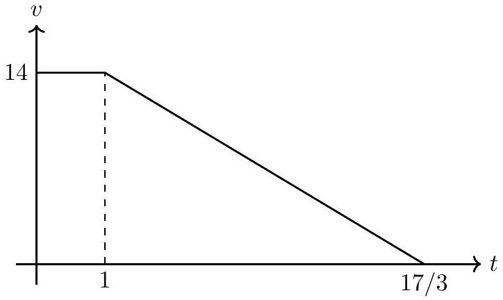

Foreword by solutions author: Some of the problems in SJPO 2022 appear to be problematic. The correct answers that you should reach can be found in the answer key as well as what is likely the intended answer.

## Q1 to Q3

We shall choose to use the 14m/s velocity and draw a $v - t$ graph tp represent the fastest possible stopping:

The distance $s \approx 46.67 \mathrm {~m}$ is the area under the graph. Hence,
Q1: (A) as the car cannot clear 50 m in 3 seconds, but it can stop in less than 50 m.
Q2: (D) as it cannot clear 40 m in 2 seconds, neither can it stop in 40 m.
Q3: (A)? is technically the best answer, as the true answer of $t = 17 / 3 \approx 5.667 \mathrm {~s}$ is none of the options. Looking at the recurring digits, (E) was likely the intended answer but a math error was made.

## Q4 to Q5

Q4: (A). The momentum added to the system is simply $\Delta p = F \Delta t = 180 \mathrm {~kg} \mathrm {~m} \mathrm {~s} ^ { - 1 } . B$ initially has $20 \mathrm {~kg} \mathrm {~m} \mathrm {~s} ^ { - 1 }$ and then $5 / 6 \Delta p$ is added to it, so in the end it has $170 \mathrm {~kg} \mathrm {~m} \mathrm {~s} ^ { - 1 }$.

Q5: (B). Using the final momentum, we can see the final velocity of the blocks is 8.5 m/s. We can calculate the change in kinetic energy to get 142.5 J.

## Q6 to Q7

A smart trick is to realise that by conservation of energy, the GPE graph will just be the KE graph flipped vertically. This now looks like the path of 3, hence:

Q6: (C). Reason why this works is that $x$-velocity is constant, so the axis will scale the same for both $x$ and $t$. Alternative way is to reason out which point is minimum $v$ in a projectile trajectory.

Q7: (C)?? The time taken is just a free-fall in the $y$-axis, by solving $h = \frac { 1 } { 2 } g t ^ { 2 }$. This gives us $\sqrt { 2 h / g }$, which is none of the options. (C) is likely the intended answer as there should be no dependence on $v _ { 0 }$, but ended up dimensionally inconsistent somehow.

## Q8 to Q9

Q8: (A). We can find this by calculating the change in EPE. We first find $k$ by doing $F = k x$ for the information given in the introduction, which gives $k = 200 \mathrm {~N} / \mathrm { m }$. We then do $\triangle E P E = \frac { 1 } { 2 } k \left( 0.05 ^ { 2 } - 0.03 ^ { 2 } \right) = 0.16 \mathrm {~J}$. Note that we take the positive answer as EPE decreases, meaning net work is done by the spring.

Q9: (C). We take this as SHM with amplitude $x _ { 0 } = 5 c m$, and due to the initial conditions we have $x = x _ { 0 } \cos \omega t$. We can find $\omega = \sqrt { k / m } = 10 \mathrm { rad } / \mathrm { s }$, so to get $\cos \omega t = - 3 / 5$ we must have $t = 0.22 \mathrm {~s}$ (answer must be in 2nd quadrant).

## Q10 to Q11

We can balance forces in the radial direction, which has a gravitational component of $m g \cos \theta$. Note that the net force must provide the centripetal force, which can be calculated by COE:

$$
\begin{aligned}
m g L \cos \theta & = \frac { 1 } { 2 } m v ^ { 2 } \\
F _ { c } = \frac { m v ^ { 2 } } { L } & = 2 m g \cos \theta
\end{aligned}
$$

Q10: (A) as the total is hence $3 m g \cos \theta$.
Q11: (E). This is now just a trigonometry maximisation problem as we already have an expression for tension. $- 1 \leq \cos \theta \leq 1$ makes the result obvious.

## Q12 to Q13

To reason this out, it is best to draw a free body diagram. Note that as long as it is sticking, we may apply the classic method of "distributing" $F$ over the two, to get a value of static friction of $f _ { s } = \frac { m _ { 1 } } { M } F$.

Q12: (C) is found by applying our upper bound of $f _ { s } \leq \mu _ { s } m _ { 2 } g$ to the previous expression.
Q13: (E). We can do a sanity check using our condition in Q12, which tells us it is sticking still. Hence, we can just treat the blocks as a system to get $a = F / \left( m _ { 1 } + m _ { 2 } \right) = 2 \mathrm {~m} / \mathrm { s } ^ { 2 }$.

## Q14 to Q16

Q14: (A) as the GPE is halved, hence the work done required by friction (a constant force) should also be halved to bring it to a stop.

Q15: (B) as both GPE and work done by friction are proportionate to mass, so it will have no effect. If unconvinced, a kinematics argument (which makes no reference to mass) may be used instead.

Q16: (C) by COE again, similar to Q14.

## Q17 to Q21

For questions 17 and 18, assume that $M$ is fixed to the floor, and the pulley is massless. After $m _ { 1 }$ is released from rest, both $m _ { 1 }$ and $m _ { 2 }$ move smoothly with a constant acceleration and the string remains taut.

Q17 and Q18 remain the classic "system method" question type.
Q17: (B) by taking $F _ { \text {net } } = m _ { 2 } g = \left( m _ { 1 } + m _ { 2 } \right) a$.
Q18: (B) by solving $h = \frac { 1 } { 2 } a t ^ { 2 }$ again.
For questions 19 and 20, all assumptions remain except that $M$ is no longer fixed to the floor but can move without friction on the floor.

This system is tricky due to the relative motion going on. It may sometimes be more helpful to move into the frame of reference of the big block first to gain perspective.

Q19: (B). Let the distance moved by $M$ be $x$ to the left (the direction is obvious to conserve the $x$-position of the centre of mass). Notice $m _ { 2 }$ must also move $x$ to the left, and $m _ { 1 }$ moves by $h$ to the right relative to $M$.

This means $m _ { 1 }$ actually moves by $h - x$, which means:

$$
\begin{aligned}
\left( M + m _ { 2 } \right) x & = m _ { 1 } ( h - x ) \\
x & = \frac { m _ { 1 } h } { m _ { 1 } + m _ { 2 } + M }
\end{aligned}
$$

Q20: (D). First treat it as a system with identical acceleration $a$ sys $= F / \left( M + m _ { 1 } + m _ { 2 } \right)$. Now go into the frame of reference of $M$, and introduce a fictitious force $F _ { \text {fict. } } = m _ { 1 } a _ { \text {sys } }$ to the right acting on $m _ { 1 }$. Now, our smaller system of $m _ { 1 }$ and $m _ { 2 }$ must have forces balanced, i.e. $m _ { 1 } a _ { \text {sys } } = m _ { 2 } g$. Rearranging gives us our answer.

Q21: For this question, assume that $M$ is fixed to the floor, and the mass and radius of the pulley is $m 3$ and $R$, respectively. What is the acceleration of blocks $m 1$ and $m 2$ ?

Q21: (B). The system method still works. To link our accelerations, recall that $\tau = I \alpha$, hence $F = I \alpha / R = \frac { 1 } { 2 } m _ { 3 } R \alpha =$ $\frac { 1 } { 2 } m _ { 3 } a$ when the string does not slip with respect to the pulley. Hence, we may simply include the term $m _ { 3 } / 2$ in the denominator as an additional "inertia" term.

You can convince yourself of this with the algebra and seeing the two tensions cancel.

## Q22 to 24

These questions are not linked.
Q22: (A). By continuity $\left( A _ { 1 } v _ { 1 } = A _ { 2 } v _ { 2 } \right)$, since the water's speed increases as it falls, its cross sectional area must decrease.

Q23: (B). This is an intuitive idea of surface tension, as it will prevent the water from flowing, but once broken will flow in a stream.

Q24: (E). Direct application of Archimedes' principle; the weight of the object must be less than or equal to the weight of fluid displaced (which is $200 \mathrm {~cm} ^ { 3 }$, or roughly 2 N if using $g = 10 \mathrm {~m} / \mathrm { s } ^ { 2 }$ ).

## Q25 to Q26

Q25: (D). If the total volume is $v _ { 2 }$ and submerged is $v _ { 1 }$, then $\rho _ { i } v _ { 2 } g = \rho _ { w } v _ { 1 } g$ by Archimedes' principle. We get the simple relation that $v _ { 1 } / v _ { 2 } = \rho _ { i } / r h o _ { w }$, which means that 89.32\% is submerged (and hence 10.68\% is above the surface).

Q26: (A). Pure ice will melt to pure water, with density 1.00 . This means that the pure water with the same mass as the initial displaced volume of seawater will have a higher volume, hence making the level rise.

## Q27

Q27: (A). Here, we are essentially considering the surface area in the direction of the light rays (a dot product in essence). Hence, $E _ { \text {output } } = 1000 \times \sin 40 ^ { \circ } \times 20 \% = 129 \mathrm {~W} / \mathrm { m } ^ { 2 }$.

## Q28 to Q29

Q28: (C). At $\theta _ { 2 } = 60 ^ { \circ }$ and 140°, the intensity is 0, which means that it is perpendicular to one of the two at each of these times. Hence, one of the two must be 150° and the other 50°. This leaves only one option.

Q29: (A). We apply Malus' law twice to get $I _ { f } = \frac { 1 } { 2 } I _ { 0 } \cos ^ { 2 } \left( \theta _ { 2 } - \theta _ { 1 } \right) \cos ^ { 2 } \left( \theta _ { 3 } - \theta _ { 2 } \right)$.

## Q30 to Q34

Q30: (A) as $\sin \theta \leq 1$. Be careful with this as the naming convention may differ.

Q31: (E). Direct application of critical angle formula.
Q32: (D). Once it undergoes total internal reflection once, it can keep going by symmetry. Hence, it only needs to be considered that $\sin \theta = n _ { 1 } \sin \theta _ { \text {in } }$, where $\theta _ { \text {in } }$ is the angle inside the medium.

We have $\cos \theta _ { \text {in } } = n _ { 2 } / n _ { 1 }$ from the previous question too (note the angle relations), Which can be rearranged and combined with the Q30 result to get our answer.

This problem can be reasonably guessed too by using extreme examples. For example, try setting $n _ { 1 } = 2.5$ (like diamond) and $n _ { 2 } = 1$ (like air). (A) and(C) can be eliminated immediately for being negative, while (B) can be eliminated by violating the range of $\sin \theta$ using our example.

Q33: (D). This is a direct consequence of the inequality in the previous problem.
Q34: (D). We take the $x$-component of the light's speed and apply our previous relation in Q32.

## Q35 to Q36

Q35: (E). We may write out the recommended binomial expansion:

$$
\begin{aligned}
F _ { \text {net } } & = \frac { k Q q } { ( r + x ) ^ { 2 } } - \frac { k Q q } { ( r - x ) ^ { 2 } } \\
& = \frac { k Q q } { r ^ { 2 } } ( 1 - 2 x / r + \ldots ) - \frac { k Q q } { r } ( 1 + 2 x / r + \ldots ) \\
& = - \frac { 4 k Q q x } { r ^ { 3 } }
\end{aligned}
$$

Q36: (A). From the previous approximation, we notice that it is roughly simple harmonic. We take one quarter of the period $T = \frac { 2 \pi } { \omega }$, where $\omega = \sqrt { \frac { 4 k Q q } { r ^ { 3 } } }$. This simplifies to give the answer in (A).

## Q37 to Q38

These questions are not linked.
Q37: (B). Apply right hand grip rule to the solenoid to deduce the field points to the right, then add it to the existing field.

Q38: (E). Apply Lenz's law to deduce the induced B field must point towards you, then right hand grip rule to deduce it is counterclockwise.

## Q39 to Q41

Q39: (E). Use the current direction and force direction and use Fleming left hand rule.
Q40: (D). Balance forces to get $B \left( I - I _ { \text {ind } } \right) l = m g$, where $I _ { \text {ind } } = \frac { A } { R } \frac { d B } { d t }$ hence $B = 10 \mathrm {~T}$ by solving the quadratic.
Q41: (E). Balance forces directly to get $B I l = m g$ and $B = 5 \mathrm {~T}$.

## Q42 to Q44

These questions are not linked.
Q42: (C). This can be reasoned out either that:

- The space between atoms increases, so the circumference of each circular layer must increase; or
- The hole is simply a big object - small circle, both of which expans.

Q43: (C). Calculate using linear expansion formula $L = L _ { 0 } ( 1 + \alpha \Delta T )$, and remember to add to room temperature.
Q44: (B). We can form the equation $x T _ { \text {room } } + T _ { \text {hot } } = ( 1 + x ) T _ { f }$ where $T _ { \text {hot } } = 100 ^ { \circ } \mathrm { C }$. Solving, we get $x \approx 0.4$.

## Q45 to Q50

Q45: (C). The pressure in G must be uniform, which means the spring force is equal to the external atmospheric pressure, i.e. $k x _ { 0 } = P _ { 0 } S$.

Q46: (B). The internal energy of the gas is a state function of temperature and has no dependence on the spring.
Q47: (E). We apply First Law, where $U = Q + W _ { \text {on } }$. Here, $W _ { \text {on } }$ is the work done by the spring, which is just the change in EPE.

Q48: (B). As no heating is provided and all materials are insulating, $Q = 0$. We apply First Law again and consider all the work terms by the spring, atmosphere and hand.

Q49: (D). We once again apply First Law.
Q50: (E). The last process must be an isobaric reduction in volume, while the initial process must be a straight line as the pressure is proportionate to the force, and hence linearly dependent on the compression of the spring.
