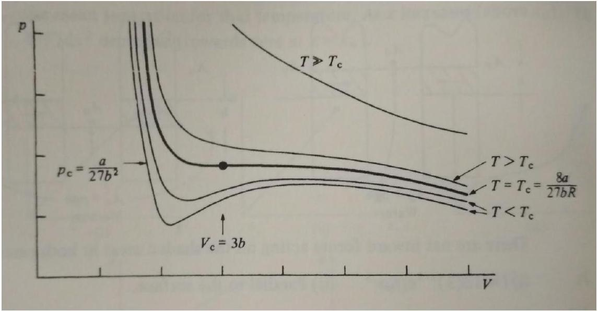

# Singapore Physics Olympiad Training (SPOT) - Examiner's report for 2018 selection test

Zhiming Darren TAN

Garett Tok

March 26, 2018

## 1 Chain

1(a)(i) As $d$ decreases, $T _ { 0 }$ decreases. The intuition is that the chain becomes more slack because the points of attachment at the two ends, which hold up the entire chain, are more vertical.

1(a)(ii)

$$
T _ { 0 } \frac { d ^ { 2 } y } { d x ^ { 2 } } = \lambda g \sqrt { 1 + \left( \frac { d y } { d x } \right) ^ { 2 } }
$$

There are some tricks involved to do the derivation - look it up online if you're having trouble.
1(a)(iii) Align the lowest point of the chain such that it lies on the $y$-axis (i.e. $x = 0$ ).

$$
a = \frac { T _ { 0 } } { \lambda g }
$$

and $b$ is the result of subtracting $a$ from the $y$-coordinate of the lowest point of the chain.
You just need to differentiate and then plug in this solution to the differential equation obtained in the previous part. There is no need to solve the differential equation yourself.

1(b)(i)( $\alpha$ )

$$
T _ { C } = \lambda v ^ { 2 }
$$

Some students ended up with an erroneous factor of half because of carelessness in thinking of the infinitesimal angle as $d \theta$ or $2 d \theta$.
$\operatorname { 1 } ( \mathrm { b } ) ( \mathrm { i } ) ( \beta )$ The "turn" at the top is sharp, such that the centripetal acceleration is much greater than the acceleration of free fall. Some students missed the point by saying $v$ is large or $r$ is small. Rather, the interpretation lies in comparing accelerations or comparing forces (tension much larger than weight).

1(b)(ii) Rising branch

$$
\lambda h _ { 2 } g + T _ { T } = T _ { C }
$$

Falling branch

$$
\lambda \left( h _ { 1 } + h _ { 2 } \right) g + T _ { F } = T _ { C }
$$

Some students tried to include $r$ in the expressions, despite how the figure was presented, which causes unnecessary complications.

1(b)(iii)

$$
T _ { T } = \lambda v ^ { 2 }
$$

Students who attempted to apply conservation of energy would have obtained an erroneous factor of half. This situation is inherently dissipative, similar to sand falling on a conveyor belt, which is actually discussed explicitly in the original journal article (see Biggins and Warner, 2014). Considering momentum change is the way to go.

Some students also were confused and not neglecting infinitesimals appropriately or considering finite chain lengths.

1(b)(iv) $h _ { 2 } = 0$ (no chain fountain produced) and $v = \sqrt { g h _ { 1 } }$.
1(c)(i) With $R = \alpha T _ { C }$, we have a modification of part (b)(iii) such that $T _ { T } = ( 1 - \alpha ) \lambda v ^ { 2 }$. We have

$$
\frac { h _ { 2 } } { h _ { 1 } } = \frac { \alpha } { 1 - \alpha - \beta }
$$

and

$$
\frac { v ^ { 2 } } { g h _ { 1 } } = \frac { 1 } { 1 - \alpha - \beta }
$$

1(c)(ii) See that for $h _ { 2 } / h _ { 1 }$ to be significant, we need $\alpha > 0$ and $\beta$ has less of an influence. We can say that $\beta \approx 0$ and then use the gradient of the graph plotted to solve for $\alpha \approx 0.12$.

1(d)(i) Generally not a problem for students because the equation is given, even if their analysis of $d T$ and $d \theta$ were not detailed and correct enough to proceed with the next part.

1(d)(ii)

$$
T \frac { d \theta } { d s } + \lambda g \sin \theta = \lambda v ^ { 2 } \frac { d \theta } { d s }
$$

1(d)(iii) For the equation in part (d)(ii), suppose we have a solution $\left\{ T _ { 0 } ( s ) , \theta _ { 0 } ( s ) \right\}$ for the case $v = 0$. Then keeping the expression $\theta ( s ) = \theta _ { 0 } ( s )$ unchanged and adding a constant throughout such that $T ( s ) =$ $T _ { 0 } ( s ) + \lambda v ^ { 2 }$ will be a solution for constant $v \neq 0$.

The shape of the curve is determined by $\theta ( s )$ and so we expect this to be a hyperbolic cosine function, as with the chain hanging in gravity. [We actually get an inverted curve because we can also invert the shape and put $\theta ( s ) = - \theta _ { 0 } ( s )$, since all terms in the equation of part (d)(ii) are odd functions of $\theta$.]

## 2 Prism

2(a) There is a minimum angle, such that

$$
\cos ^ { 2 } \theta < \frac { n _ { g } ^ { 2 } - n _ { w } ^ { 2 } } { 1 + n _ { g } ^ { 2 } - 2 n _ { w } }
$$

Many students did not simplify expressions sufficiently. Some students incorrectly identified the initial angle of incidence as $\theta$ instead of $\pi / 2 - \theta$. Mistakes were also made in calculating the angle of incidence on the bottom surface, and very careless mistakes also with mixing up the refractive indices (e.g. citing Snell's law as $n _ { 1 } \sin \theta _ { 2 } = n _ { 2 } \sin \theta _ { 1 }$ ).

2(b)(i) Replace $n _ { w }$ with unity in the previous expression, simplify it and deduce that there is no constraint on $\theta$.

2(b)(ii) Inverted. Ray tracing will give the answer (some students apparently just made guesses for this part and the next without any justification). Some students discussed lateral inversion - good.

2(b)(iii) Right-side up for $\phi = \pi / 2$, inverted for $\phi = \pi$.

## 3 van der Waals gas

3(a) Differentiate original equation with respect to $V$, then set $d p / d V = 0$. Assume that $V > b N$ when taking the square root. Some students came up with assumptions that were not actually used in their derivation.

3(b) Interpret left-hand expressions and right-hand expressions as functions of $V$. Solutions are the intersections of a linear expression (left-hand) and a $V ^ { 3 / 2 }$ curve, which vary because the coefficient of $V ^ { 3 / 2 }$ varies with temperature. The linear expression does not shift. Students are expected to show explicitly how to get 0 solutions, 1 solution, 2 solutions in different cases.

Some students attempted to consider this as the roots of an equation cubic in $V ^ { 1 / 2 }$, which is a bit trickier to argue convincingly.

3(c) $V _ { 0 } = 3 b N$ and $T _ { 0 } = \frac { 8 a } { 27 k _ { B } b }$. This is obtained after equating the gradients of the linear and $V ^ { 3 / 2 }$ expressions in the earlier part, as well as using the original van der Waals equation.

3(d) See Fig. 1 (slightly different definitions for $a$ and $b$ are at play, just modify the labels accordingly). Note the number of times that $d p / d V = 0$ for the various temperatures. Be sure to label important points whenever you are asked to make a sketch.

This part was successfully done only by a small number of students. Some students drew "isothermals" that were extremely unphysical.

Figure 1: Sketch of isotherms for van der Waals gas

## 4 Charged sphere

4(a)(i)

$$
U = \frac { 2 \pi r ^ { 3 } \sigma ^ { 2 } } { \epsilon _ { 0 } }
$$

Students could either consider the work done in assembling the charged sphere, or integrating the energy of the electric field over all space.

4(a)(ii)

$$
p = \frac { \sigma ^ { 2 } } { 2 \epsilon _ { 0 } }
$$

Some students made the mistake of assuming that $\sigma$ is constant when differentiating $F = - d U / d r$. There were even mistakes made in the definition of $p$ as well, as the $4 \pi$ factors seemed too temptingly nice to cancel.

4(b)(i) Some explanations involved too many leaps. The idea is to take a small square patch, pull it on all four sides with the same force, then resolve the radial component and relate it to pressure.

4(b)(ii) $9.96 \times 10 ^ { 6 } \mathrm { Nm } ^ { - 2 }$
4(b)(iii) With $N$ identical spheres of radius $r$, from part (a)(i) the energy stored goes as

$$
U \propto N r ^ { 3 } \sigma ^ { 2 }
$$

and the amount of metal used goes as $N r ^ { 2 }$.
Consider electrostatic breakdown and mechanical rupture scenarios separately.
We note that the electric field at the surface goes as $E \propto \sigma$, so if electrostatic breakdown is the limiting factor, we cap the allowed value of $\sigma$ and see that increasing $r$ at the expense of $N$ gives us greater gain in $U$ relative to the amount of metal used. (Better to use a large sphere.)

If mechanical rupture is the limiting factor, from the working for part (b)(ii) we see that we must cap the allowed value of $\sigma ^ { 2 } r$, so the amount of energy stored scales in the same way as the amount of metal used. (No difference in using a large sphere or several smaller spheres.)

Some students failed to structure their approach such that the comparison was fair - there was a need to either keep the amount of metal used constant, or keep the amount of energy stored constant. There are a lot of inter-related variables like $\sigma$ and $r$ at play here, so only by considering their combined effect would a reasonable conclusion be reached.

## 5 Blackbody radiation

5(a)(i) Stationary waves in cavity, and use $\varepsilon = h c / \lambda$.
5(a)(ii) The 3d wave-vector is $\vec { k } = \left( k _ { x } , k _ { y } , k _ { z } \right)$ and the energy of the photon is $\varepsilon = \hbar \omega$, with $\omega = c | \vec { k } |$. Get

$$
\varepsilon = \frac { h c } { 2 L } \sqrt { n _ { 1 } ^ { 2 } + n _ { 2 } ^ { 2 } + n _ { 3 } ^ { 2 } }
$$

5(b)(i) Note that expectation values are defined as

$$
\langle r \rangle = \sum r P ( r )
$$

Several students wrote this as integrals even though $r$ is a discrete variable, not a continuous variable. The simplest approach is to differentiate the natural logarithm of the partition function (using the partition function as a sum of terms as defined) with respect to the inverse temperature, and compare the expression given with the expectation value of $r$.

5(b)(ii) Use the result of part (b)(i) and the expression for the partition function as an infinite geometric sum.

5(c)(i) Use the substitution

$$
\epsilon _ { i } = \frac { n _ { i } h c } { 2 L }
$$

to convert the sum to an integral, which becomes exact in the limit of $L \rightarrow \infty$.

The 3d integral over the octant where $\epsilon _ { i } > 0$ can be conveniently performed in spherical coordinates due to the symmetry of the integrand. Make the replacement

$$
\int _ { 0 } ^ { \infty } \int _ { 0 } ^ { \infty } \int _ { 0 } ^ { \infty } d \epsilon _ { 1 } d \epsilon _ { 2 } d \epsilon _ { 3 } \longrightarrow \frac { 1 } { 8 } \int _ { 0 } ^ { \infty } 4 \pi \epsilon ^ { 2 } d \epsilon
$$

and then substitute $\nu = \epsilon / \hbar$ to get the expression

$$
u _ { \nu } = \frac { 8 \pi h \nu ^ { 3 } } { c ^ { 3 } } \frac { 1 } { e ^ { \beta h \nu } - 1 }
$$

5(c)(ii) Obtain the leading approximations in the small $\nu$ and large $\nu$ regimes respectively.

## 6 Bistable logic

6(a) Show that X normal and Y superconducting is stable if $\frac { 1 } { 12 } < B _ { 0 } / \mu _ { 0 } n V _ { 0 } < \frac { 1 } { 2 }$, but not for X and Y both normal or both superconducting.

Some students discussed varying the voltages independently, which is not the setup drawn.
6(b) $V _ { 0 }$ between 1.59 V and 9.55 V.

## 7 Relativistic exam

7)

$$
T \sqrt { \frac { 1 - \frac { v } { c } } { 1 + \frac { v } { c } } }
$$

Some students forgot that the light signal needed to travel back to Earth, or were not explicit enough and ended up confused with the frames in which distances or times were measured.

A simple space-time diagram would have helped in visualising the sequence of events. Using notation consistently would also help in organising the symbols used.

## References

J. S. Biggins and M. Warner. Understanding the chain fountain. Proceedings of the Royal Society A: Mathematical Physical and Engineering Sciences, 470(2163):20130689-20130689, jan 2014. doi: 10.1098/rspa.2013.0689. URL https://doi.org/10.1098\%2Frspa.2013.0689.
