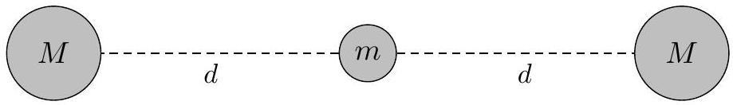
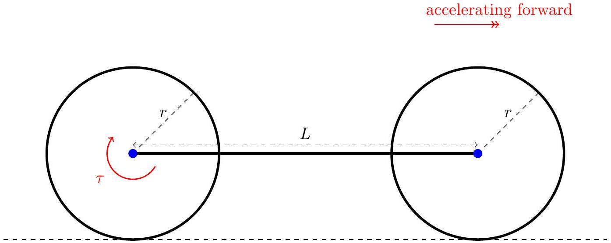
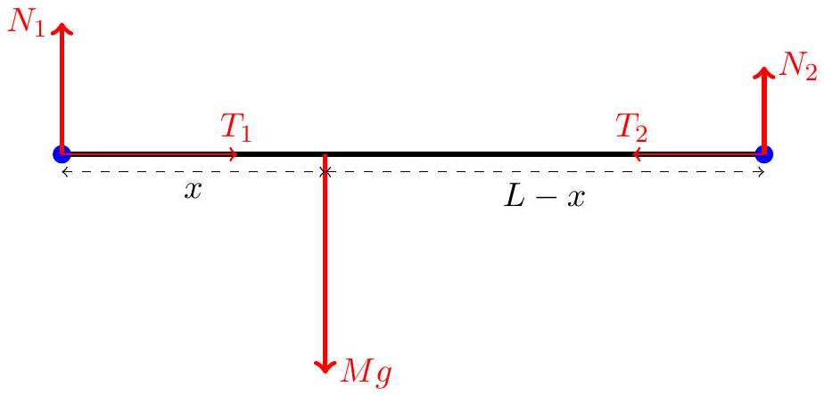
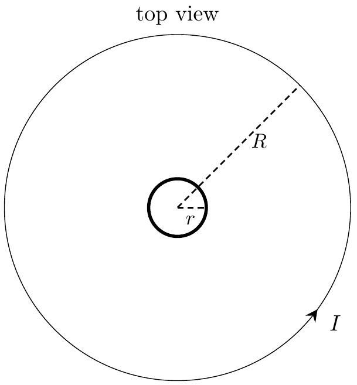
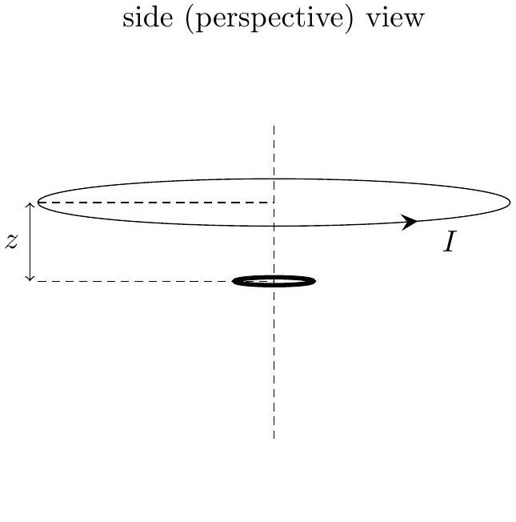
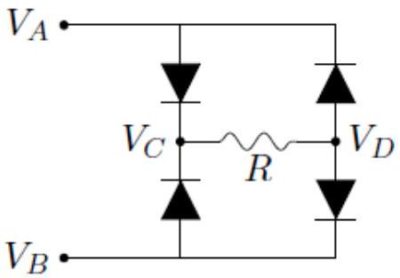
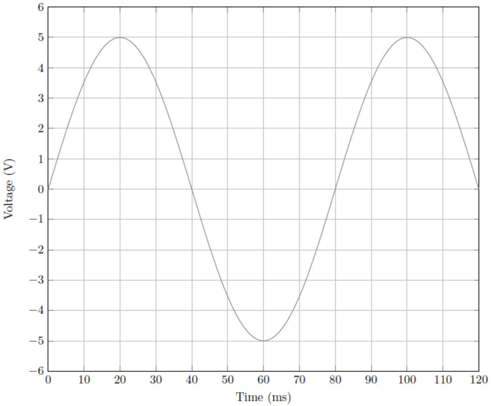
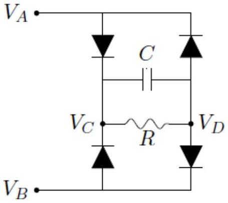
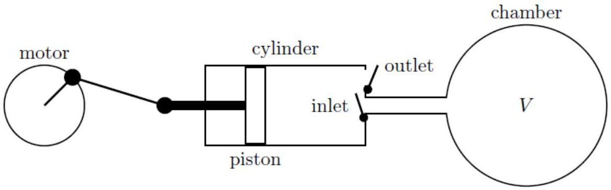
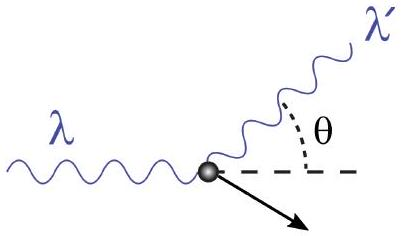

## Singapore Physics Olympiad Training

## 2022 Selection Test for the Asian and International Physics Olympiads

1. This is a four-hour test. Attempt all questions. The maximum total score is 90; marks allocated for each question part are indicated in square brackets.
2. Check that there are a total of 15 printed pages (including this cover page). The last page contains a table of physical constants that you may refer to and use.
3. Begin your answer for each question on a fresh sheet of paper, and present your working and answers clearly. Your answer sheets should be sorted according to the order of the questions.
4. Write your name on the top right hand corner of every answer sheet you submit.
5. Please complete and sign the declaration on page 2, which should be stapled together and submitted with your answer sheets.
6. You may use a standard (non-programmable) scientific calculator in accordance with the statutes of the International Physics Olympiad.
7. No books or documents relevant to the test may be brought into the examination room.

## Declaration

I declare that I will be fully committed to the training for and participation in the Asian Physics Olympiad and/or the International Physics Olympiad if selected. I will check first with the MOE coordinator before taking on additional commitments not listed below.

Potential limitations to my commitment in the period from now to end-July 2022 are described exhaustively in the box below, such as other academic competitions, CCA commitments (school-related or otherwise), travel plans, etc.
□

Name and signature: $\_\_\_\_$

| Question: | 1 | 2 | 3 | 4 | 5 | 6 | 7 | 8 | 9 | Total |
| :--- | :--- | :--- | :--- | :--- | :--- | :--- | :--- | :--- | :--- | :--- |
| Points: | 5 | 7 | 12 | 13 | 13 | 8 | 11 | 9 | 12 | 90 |
| Score: |  |  |  |  |  |  |  |  |  |  |

1. Suppose that masses $m _ { 1 }$ and $m _ { 2 }$ separated by a distance $r$ have an interaction potential energy given by
$$
U = \frac { \kappa m _ { 1 } m _ { 2 } } { r ^ { n } } , \text { where } \kappa > 0 \text { and } n \text { is a positive integer. }
$$
In this problem, consider a mass $m$ confined to move along the line segment of length $2 d$ between two identical particles of mass $M$. Assume that the two masses $M$ are fixed in position.

    (a) State, with brief reasons, whether the interaction is an attractive or a repulsive force.
    (b) Determine, in terms of the symbols introduced, the angular frequency $\omega$ of small oscillations of $m$ around its equilibrium position (i.e. for displacement $x \ll d$ ).

Solution: Adapted from Problem 2.04 of [2].

(a) 1 - repulsive due to sign of $\kappa$ and force being related to the potential gradient. (Note that the combined potential energy is a minimum at the equilibrium position. However, it would be a maximum for $\kappa < 0$ giving an unstable equilibrium if so.)
(b) 1 - general expression for potential energy for displacement $x$
1 - Taylor expansion of PE to quadratic order in $x$
1 - identifying the equivalent "spring constant"
1 - deriving the right expression for $\omega = \sqrt { 2 \kappa M n ( n + 1 ) / d ^ { n + 2 } }$
[alternative approach using force and acceleration also credited]

Q1 total: 5

2. Consider a yo-yo made up of two uniform solid disks of radius $R$ and each with mass $M$, connected rigidly by a light cylindrical axle of radius $r < R$, such that the disks and axle all share a common axis. A thin light string is wound tightly around the axle.
The free end of the string is held fixed and the yo-yo is released from rest. Assume that the string stays vertical as it is unwound from the axle. Let $g$ be the gravitational acceleration.
    (a) By integrating over thin circular rings, show that the moment of inertia $I$ of the yo-yo about its central axis is given by $I = M R ^ { 2 }$.
    (b) Determine, in terms of the symbols introduced, the downward acceleration $a$ of the yo-yo when it is released from rest.
    (c) Determine, in terms of the symbols introduced, the tension $T$ in the string when the yo-yo is released from rest.

Solution: Adapted from Problem 2.11 of [2].

(a)
1 - correct expression for contribution of a ring of infinitesimal thickness
1 - integrating over disk
(b)
1 - no-slip condition $v = r \omega$
1 - expression for (constant) total energy (GPE + translational KE + rotational KE)
1 - differentiating energy expression wrt time and setting to zero
1 - deriving the right expression for $a = g / \left( 1 + \frac { R ^ { 2 } } { 2 r ^ { 2 } } \right)$

[alternative approach using force and torque also credited for this part and the next]

(c)
1 - use $T = 2 M ( g - a )$

Q2 total: 7

3. In this problem, we consider a minimal mechanical model of a bicycle moving along a horizontal surface.
Model the wheels as two uniform solid disks of radius $r$, each of mass $m$ and moment of inertia $I$ about their centres. The wheels can rotate around their central axes and these axes are connected by a rigid bar of length $L$ and mass $M$. This bar represents the bicycle frame and rider, and we assume the bar is always horizontal with the centre of mass of this bar located a distance $x$ from the rear wheel (and thus a distance $L - x$ from the front wheel).
The rider exerts a pure torque $\tau$ on the rear wheel. The entire bicycle has linear acceleration $a$ in the forward direction. Assume that the wheels do not slip.

The free-body diagram of the bar (representing the frame and rider) is shown below. $N _ { 1 }$ and $T _ { 1 }$ are the vertical and horizontal forces respectively exerted by the rear wheel on the bar, while $N _ { 2 }$ and $T _ { 2 }$ are exerted by the front wheel on the bar.

(a) Write down an expression for acceleration $a$ in terms of $T _ { 1 } , T _ { 2 }$ and $M$.
(b) Write down an expression for $N _ { 2 }$ in terms of $N _ { 1 }$ and $M g$.
(c) Draw separate free-body diagrams for each of the rear and front wheels. Label the normal contact and frictional contact forces with the ground as $R _ { 1 } = N _ { 1 } + m g$ and $f _ { 1 }$ respectively for the rear wheel, and $R _ { 2 } = N _ { 2 } + m g$ and $f _ { 2 }$ for the front wheel.
(d) Determine an expression for $a$ in terms of $\tau , r , m , M$ and $I$.
(e) Suppose the frictional forces are maximal, i.e. $f _ { 1,2 } = \mu R _ { 1,2 }$ where $\mu$ is the coefficient of static friction (assumed to be the same for both wheels). Determine an expression for the ratio $R _ { 1 } / R _ { 2 }$ in terms of $r , m , M$ and $I$ and show that $R _ { 1 } / R _ { 2 } > 1$.

Solution: Adapted from [1].

(a)
1 - horizontal forces on bar, $a = \frac { T _ { 1 } - T _ { 2 } } { M }$
(b)
1 - vertical forces on bar, $N _ { 2 } = M g - N _ { 1 }$
(c)
1 - correct horizontal forces from bar $\left( T _ { 1 } , T _ { 2 } \right)$
1 - correct vertical forces ( $N _ { 1 } , R _ { 1 } , m g$ and so on)
1 - correct directions for frictional forces
(d)
1 - no slipping, $a = r \alpha$
1 - relate torque and angular acceleration for front wheel
1 - relate torque and angular acceleration for rear wheel
1 - find linear acceleration for system of wheels \& bar, $a = \tau / \left( M r + 2 m r + \frac { 2 I } { r } \right)$ common mistakes include sign errors and confusing $a , \alpha$ [alternative approach is to differentiate energy since this is constant over time]
(e)
1 - use $f _ { 1 } / f _ { 2 } = R _ { 1 } / R _ { 2 }$
1 - use results from earlier part
1 - get $\frac { R _ { 1 } } { R _ { 2 } } = 1 + \frac { ( M + 2 m ) r ^ { 2 } } { I } > 1$. Note that with these assumptions, the centre of gravity has to be closer to the wheel to which the powering torque is applied.

4. Starting from Maxwell's equations for electromagnetism, we can identify the energy density (i.e. energy per unit volume of space) in an electromagnetic field as
$$
u = \frac { \epsilon _ { 0 } } { 2 } \vec { E } \cdot \vec { E } + \frac { 1 } { 2 \mu _ { 0 } } \vec { B } \cdot \vec { B }
$$
where $\epsilon _ { 0 }$ is the vacuum electric permittivity, $\mu _ { 0 }$ is the vacuum magnetic permeability, and $\vec { E } , \vec { B }$ are the electric and magnetic field vectors respectively.
Poynting showed that the energy flow $\vec { S }$ corresponding to changes in this energy density $u$ is given by a vector cross product,
$$
\vec { S } = \epsilon _ { 0 } c ^ { 2 } \vec { E } \times \vec { B } ,
$$
which we now term the Poynting vector. In this expression, $c$ is the speed of light in vacuum. The integral of $\vec { S }$ over a closed surface gives the total energy flow in or out of the enclosed volume.
    (a) Consider a propagating light wave with wavelength $\lambda$, given by
$$
\left\{ \begin{array} { l }
\vec { E } ( x , t ) = E _ { 0 } \cos \left[ \frac { 2 \pi } { \lambda } ( x - c t ) \right] \hat { y } \\
\vec { B } ( x , t ) = \frac { E _ { 0 } } { c } \cos \left[ \frac { 2 \pi } { \lambda } ( x - c t ) \right] \hat { z }
\end{array} \right.
$$
where $E _ { 0 }$ is the amplitude of the electric field and $\hat { y } , \hat { z }$ are the unit vectors in the $y$-direction and $z$-direction respectively.
        i. Determine an expression for $\left\langle E ^ { 2 } \right\rangle$, the time-averaged value of $\vec { E } \cdot \vec { E }$.
        ii. Using the relation $c = 1 / \sqrt { \epsilon _ { 0 } \mu _ { 0 } }$, show that the time-averaged value of the energy density $u$ is given by
$$
\langle u \rangle = \epsilon _ { 0 } \left\langle E ^ { 2 } \right\rangle .
$$
        iii. State the direction of $\vec { S }$ and show that the time-averaged magnitude $S = | \vec { S } |$ is given by
$$
\langle S \rangle = c \langle u \rangle .
$$
Note that this is consistent with the interpretation of $\vec { S }$ as the energy flow due to the propagation of light.
    (b) Now consider a cylindrical section of conducting wire, with resistivity $\rho$, length $L$ and radius $r$. Let the current through the wire be $I$.
        i. The magnetic field pattern is concentric around the wire. Write down, in terms of the symbols provided, the expression for $B = | \vec { B } |$ at the curved surface of the wire.
        ii. Determine an expression for the potential difference $V$ between the two ends of the wire in terms of the symbols provided.
        iii. Assume that the electric field in the wire is uniform. State the direction of $\vec { S }$ and determine an expression for $S = | \vec { S } |$ at the curved surface of the wire.
        iv. Hence determine an expression for the power $P$ to the wire.

Solution: Poynting's original paper is [3]. Feynman's discussion of this is well worth a careful read, https://www.feynmanlectures.caltech.edu/II_27.html

(a) (i)
$1 - \left\langle E ^ { 2 } \right\rangle = \frac { 1 } { 2 } E _ { 0 } ^ { 2 }$

(a) (ii)
1 - obtaining $\langle u \rangle = \frac { 1 } { 2 } \epsilon _ { 0 } \left\langle E ^ { 2 } \right\rangle + \frac { 1 } { 2 } \frac { 1 } { \mu _ { 0 } } \left\langle B ^ { 2 } \right\rangle$
1 - substituting $\frac { 1 } { \mu _ { 0 } } \left\langle B ^ { 2 } \right\rangle = \epsilon _ { 0 } \left\langle E ^ { 2 } \right\rangle$ to get answer
(a) (iii)
1 - in the (positive) $x$-direction
1 - starting with definition of $\vec { S }$ and comparing with previous part to get answer
(b) (i)
$1 - B = \mu _ { 0 } I / ( 2 \pi r )$
(b) (ii)
1 - resistance $R = \rho L / \left( \pi r ^ { 2 } \right)$
$1 - V = I R = I \rho L / \left( \pi r ^ { 2 } \right)$
(b) (iii)
1 - use $E = V / L$
$1 - \vec { S }$ points radially inwards
1 - remembering that $\epsilon _ { 0 } c ^ { 2 } = 1 / \mu _ { 0 }$, get $S = I ^ { 2 } \rho / \left( 2 \pi ^ { 2 } r ^ { 3 } \right)$
(b) (iv)
1 - curved surface area $2 \pi r L$
1 - multiply with $S$ to get $P = I ^ { 2 } \rho L / \left( \pi r ^ { 2 } \right)$ in agreement with usual formula

Q4 total: 13

5. Two thin rigid circular loops share a common axis as shown. We can ignore the effects of gravity in this question.
The larger loop is a conducting wire of radius $R$. This wire carries a constant current $I$, and slides up the axis at constant speed $v \ll c$ so that the distance $z$ between the two loops increases linearly with time $t$.
The other loop is a smaller insulating ring of radius $r \ll R$, with a uniform positive linear charge density of $+ \lambda$ and a uniform linear mass density of $\rho$. The smaller loop can rotate freely around the central axis but cannot move up and down the axis.

At time $t = 0$, the loops are co-planar (i.e. $z = 0$ ) and the smaller loop is not rotating (i.e. angular speed $\omega = 0$ ).

(a) Briefly explain why the smaller loop starts spinning and whether the orientation of this rotation is in the same or opposite sense as the current $I$ in the larger loop.
(b) The current $I$ in the larger loop produces a magnetic field. Using the Biot-Savart law, show that at the centre of the smaller loop, the magnetic flux density due to this current is directed upwards along the axis and has a $z$-dependence given by
$$
B _ { I } ( z ) = \frac { \mu _ { 0 } I R ^ { 2 } } { 2 \left( z ^ { 2 } + R ^ { 2 } \right) ^ { 3 / 2 } } ,
$$
where $\mu _ { 0 }$ is the permeability of free space.
(c) The rotation of the smaller loop also contributes to the magnetic flux density at the centre of the smaller loop. Determine an expression, in terms of $\mu _ { 0 } , \lambda , r$ and the angular speed $\omega$, for this rotational contribution $B _ { \lambda } ( \omega )$.
(d) Assume that the magnetic field within the entire area of the smaller loop is approximately constant and is the same as the field at the centre of the loop, such that the resultant magnetic flux density is $B ( z , \omega ) = B _ { I } ( z ) + B _ { \lambda } ( \omega )$.
Determine the angular speed $\omega _ { \infty }$ at long times $t \rightarrow \infty$, in terms of $\mu _ { 0 } , I , \lambda , \rho , r$ and $R$.

Solution: Adapted from Question A1 of USAPhO 2020.
(a)
1 - Faraday's law and Lenz's law, induced e.m.f. and current to oppose change in flux
1 - positive charge spins in same orientation as current $I$, since linked flux decreases as the larger loop moves away

(b) derivation at http://hyperphysics.phy-astr.gsu.edu/hbase/magnetic/curloo. html\#c4
1 - contribution to B from infinitesimal element
1 - resolving distance and component correctly
1 - no other mistakes in derivation

(c)

1 - recognise that current due to rotation is charge x frequency $= \lambda ( 2 \pi r ) \cdot ( \omega / 2 \pi )$
1 - use previous equation with $z = 0$ and $r$ in place of $R$
1 - derive correct expression $B _ { \lambda } ( \omega ) = \frac { 1 } { 2 } \mu _ { 0 } \lambda \omega$

(d)

1 - use Faraday's law to relate integral of $E _ { \text {tangential } }$ around loop to $d B / d t$
1 - link torque due to $q E$ to angular acceleration $d \omega / d t$
1 - solve for $\omega$ using the first-order differential equation $\frac { d \omega } { d t } = - \frac { \lambda } { 2 \rho } \frac { d B } { d t }$
1 - use correct boundary conditions for $B$ at $t = 0$ and $t \rightarrow \infty$
1 - rearrange to get correct expression for $\omega _ { \infty } = \frac { \mu _ { 0 } \lambda I } { 4 \rho R + \mu _ { 0 } \lambda ^ { 2 } R }$

Q5 total: 13

6. For a certain circuit component shown below,
$$
V _ { L } \cdot \longmapsto \cdot V _ { R }
$$
the current $I$ is given by
$$
I = I _ { 0 } \exp \left( \frac { - e V _ { 0 } } { k T } \right) \left[ \exp \left( \frac { e V } { k T } \right) - 1 \right] ,
$$
where $I _ { 0 } = 25 \mu \mathrm {~A}$ and $V _ { 0 } = 1.0 \mathrm {~V} , e$ is the elementary charge, $k$ is the Boltzmann constant, $T$ is the absolute (Kelvin) temperature, and $V = V _ { L } - V _ { R }$ is the potential difference (positive $V$ when $V _ { L } > V _ { R }$ corresponds to current flowing from left to right).
Throughout this problem, assume low temperature, i.e. $k T \ll e V _ { 0 }$.
    (a) Show some working and sketch a graph of $I / I _ { 0 }$ against $V / V _ { 0 }$.
    (b) In the circuit below, a sinusoidal input voltage is applied across $V _ { A B } = V _ { A } - V _ { B }$ as
    shown in the graph. The resistance $R = 5.0 \Omega$.

i. Show some working and sketch $V _ { C D } = V _ { C } - V _ { D }$ for the same time interval as shown for $V _ { A B }$. Assume that $V _ { A B }$ has been running for a long time.
ii. A capacitor $C = 50 \mathrm { mF }$ is now added to the circuit, as shown below. [3]

Assume that the same sinusoidal input voltage $V _ { A B }$ is applied as shown in the graph, and has been running for a long time. Show some working and sketch the graph for $V _ { C D }$ as a function of time with the capacitor added.

Solution: Adapted from Question A2 of USAPhO 2018.

(a)
1 - qualitatively correct shape
1 - graph turns at approximately $V = V _ { 0 }$
(b) (i)
1 - idea of rectification
1 - no current for $\left| V _ { A B } \right| < 2 V _ { 0 }$
1 - peak voltage of 3V
(b) (ii)
1 - idea of smoothing
1 - calculate RC time constant
1 - calculate and reflect approximate rate of discharge

Q6 total: 8

7. A vacuum system consists of a chamber of constant volume $V$ connected to a pump mechanism in the form of a cylinder with a piston that moves left and right. As the piston moves, the minimum volume in the pump cylinder (to the right of the piston) is $V _ { 0 }$, and the maximum volume is $V _ { 0 } + \Delta V$. Assume that $\Delta V \ll V$.

The cylinder has two valves. The inlet valve opens when the pressure inside the cylinder is lower than the pressure in the chamber, but closes when the piston moves to the right.

The outlet valve opens when the pressure inside the cylinder is greater than atmospheric pressure $P _ { a }$, and closes when the piston moves to the left.
A motor drives the oscillatory motion of the piston. Each such complete pumping cycle takes a short time $\Delta t$. The piston moves at such a rate that heat is not conducted in or out of the gas contained in the cylinder during the pumping cycle. Assume that $\Delta t$ is a very small quantity, but that $\Delta V / \Delta t \equiv \alpha$ is finite.

The gas in the chamber is ideal monatomic and remains at a fixed temperature of $T _ { a }$. At time $t = 0$, the pressure inside the chamber is $P _ { a }$. Start with the assumption that $V _ { 0 } = 0$ with the piston all the way to the right. Assume that there are no leaks in the system.

(a) State, for an ideal monatomic gas, the value of the adiabatic gas constant
$$
\gamma = \frac { C _ { p } } { C _ { v } } ,
$$
where $C _ { p }$ is the heat capacity at constant pressure and $C _ { v }$ is the heat capacity at constant volume.
(b) Determine an expression for the chamber pressure $P ( t )$ at a later time $t$, and show that in the limit where $\Delta V / V$ vanishes, the pressure can be written as
$$
P ( t ) = P _ { a } \exp \left( - t / \tau _ { 1 } \right) ,
$$
where $\tau _ { 1 }$ is expressed in terms of variables introduced in the problem statement.
Hint: You may use the following mathematical definition of Euler's number,
$$
e = \lim _ { x \rightarrow 0 } ( 1 + x ) ^ { 1 / x }
$$
(c) Determine an expression for the temperature $T _ { \text {out } } ( t )$ of the gas as it is emitted from the pump cylinder into the atmosphere, and show that it can be written as
$$
T _ { \mathrm { out } } ( t ) = T _ { a } \exp \left( t / \tau _ { 2 } \right) ,
$$
where $\tau _ { 2 }$ is expressed in terms of variables introduced in the problem statement.
(d) Now assume that $0 < V _ { 0 } < \Delta V \ll V$. Determine an expression for the minimum possible pressure $P _ { \text {min } }$ that is achievable in the chamber. You may express your answer in terms of $P _ { a } , V _ { 0 }$ and $\Delta V$.

Solution: Adapted from Question A3 of USAPhO 2018.

(a)
1 - 5/3 (by considering additional work done needed at constant pressure)
(b)
1 - obtaining $P ( t ) = P _ { a } \left( \frac { V } { V + \Delta V } \right) ^ { t / \Delta t }$
1 - replacing $\Delta t$ with $\alpha$ and rewriting in terms of $\Delta V / V$
1 - using hint and obtaining $\tau _ { 1 } = V / \alpha$
(c)
1 - idea of adiabatic compression until outlet valve opens when $P ( t ) > P _ { a }$
1 - use of $p V ^ { \gamma } =$ const.
1 - replacing $V$ with $T$ using $p V / T =$ const.
1 - obtaining $\tau _ { 2 } = 5 V / 2 \alpha$

(d)
1 - idea that the gas has volume $V _ { 0 }$ and pressure $P _ { a }$ after outlet valve closes
1 - idea of adiabatic expansion to lowest pressure $P _ { \text {min } }$ when pump is no longer effective

1 - use of $p V ^ { \gamma } =$ const., to get $P _ { \min } = P _ { a } \left( 1 + \frac { \Delta V } { V _ { 0 } } \right) ^ { - 5 / 3 }$

Q7 total: 11
8. A photon with wavelength $\lambda$ scatters at an angle $\theta$ off an electron of mass $m$ initially at rest, as shown in Fig. 1. Denote the wavelength of the scattered photon as $\lambda ^ { \prime }$.

Figure 1: By JabberWok, CC BY-SA 3.0 https://commons.wikimedia.org/w/index.php?curid=2078004

(a) Write down a relativistic expression for the electron energy $E$ after the scattering event, in terms of its rest-mass $m$, the magnitude $P$ of its momentum, and the speed of light in vacuum $c$.
(b) By considering momentum conservation, show that
$$
P ^ { 2 } = h ^ { 2 } \left( \frac { 1 } { \lambda ^ { 2 } } + \frac { 1 } { \left( \lambda ^ { \prime } \right) ^ { 2 } } - \frac { 2 \cos \theta } { \lambda \lambda ^ { \prime } } \right) ,
$$
where $h$ is the Planck constant.
(c) By also considering energy conservation, show that
$$
\lambda ^ { \prime } - \lambda = \lambda _ { C } ( 1 - \cos \theta ) ,
$$
where $\lambda _ { C }$ is known as the Compton wavelength. Determine an expression for $\lambda _ { C }$ in terms of fundamental constants.
(d) Compton's original experiment was based on X-rays bombarding a graphite target. He found that some X-rays experienced no wavelength shift despite being scattered through large angles. Suggest an explanation for this.

Solution: A comprehensive discussion can be found at https://en.wikipedia.org/ wiki/Compton_scattering

(a)
1 - from relativistic momentum-energy relation, $E = \sqrt { P ^ { 2 } c ^ { 2 } + m ^ { 2 } c ^ { 4 } }$
(b)
1 - vector triangle for momentum conservation

1 - using cosine rule or equivalent
1 - using $h / \lambda$ for photon momentum and obtaining answer
(c)
$1 - h c / \lambda + m c ^ { 2 } = h c / \lambda ^ { \prime } + \sqrt { P ^ { 2 } c ^ { 2 } + m ^ { 2 } c ^ { 4 } }$ from energy conservation
1 - using previous expression for $P ^ { 2 }$ to simplify
1 - showing properly how terms cancel to get final expression
$1 - \lambda _ { C } = h / m c$
(d)
1 - electrons not ejected, effective mass much greater than $m$ so effective Compton wavelength much shorter (and unobservable).

Q8 total: 9
9. Quantum particles of integer spin are known as bosons. At low temperatures, a macroscopic number of bosons occupy the lowest energy quantum state, resulting in a collective quantum phase known as a Bose-Einstein condensate (BEC). The experimental achievement of BEC was honoured by the 2001 Nobel Prize in Physics.

In this question, we will estimate the critical temperature for BEC based on comparability of the de Broglie wavelength and the particle separation.

(a) By considering the average kinetic energy of translational motion, determine an expression for the typical de Broglie wavelength $\lambda$ of gas particles of mass $m$ at temperature $T$. Use the symbol $h$ for the Planck constant and $k$ for the Boltzmann constant.
(b) Determine the typical linear separation $d$ of gas particles as a function of mass density $\rho$. You may use symbols introduced in the previous part.
(c) Hence determine an expression for the critical temperature $T _ { c }$ for Bose-Einstein condensation. You may use symbols introduced in the previous parts.
(d) For a gas of Rubidium-87 atoms, a typical BEC temperature is $T _ { c } = 100 \mathrm { nK }$. For such a gas, calculate a numerical value for the ratio $\rho _ { c } / \rho _ { 0 }$, where $\rho _ { c }$ is the corresponding mass density for BEC and $\rho _ { 0 }$ is the density for a classical ideal gas at standard temperature and pressure $T _ { 0 } = 300 \mathrm {~K} , p _ { 0 } = 10 ^ { 5 } \mathrm {~Pa}$.

Solution: This question is adapted from IPhO 2021 (Part C of T3).

(a)
1 - average particle energy $\epsilon = \frac { 3 } { 2 } k T$
1 - in terms of momentum, $\epsilon = p ^ { 2 } / 2 m$
1 - de Broglie wavelength $\lambda = h / p$
$1 - \lambda = h / \sqrt { 3 m k T }$
(b)
1 - $d = ( V / N ) ^ { 1 / 3 }$ in terms of number of particles and volume
1 - relate mass density $\rho = N m / V$
$1 - d = ( m / \rho ) ^ { 1 / 3 }$
(c)
1 - equate previous expressions
1 - obtaining $T _ { c } = \frac { h ^ { 2 } \rho ^ { 2 / 3 } } { 3 k m ^ { 5 / 3 } }$ in terms of introduced symbols (i.e. should not have $N$ or $V$ )

(d)
1 - rearrange from previous part, $\rho _ { c } = \left( 3 k T _ { c } \right) ^ { 3 / 2 } m ^ { 5 / 2 } / h ^ { 3 }$
1 - get $\rho _ { 0 } = m p _ { 0 } / k T _ { 0 }$ from ideal gas equation $p _ { 0 } V _ { 0 } = N k T _ { 0 }$
1 - substitute values correctly to get $\rho _ { c } / \rho _ { 0 } = 6.6 \times 10 ^ { - 8 }$

## References

[1] Paulo Simeão Carvalho and Adriano Sampaio e Sousa. "Rotation in secondary school: teaching the effects of frictional force". In: Physics Education 40.3 (Mar. 2005), pp. 257-265. DOI: 10. 1088/0031-9120/40/3/007. URL: https://doi.org/10.1088/0031-9120/40/3/007.
[2] Jay L. Nadeau, Ben Sauerwine, and Leila Cohen. Truly Tricky Graduate Physics Problems With Solutions. Bitingduck Press, 2014. isbn: 9781938463174.
[3] J. H. Poynting and John William Strutt. "XV. On the transfer of energy in the electromagnetic field". In: Philosophical Transactions of the Royal Society of London 175 (1884), pp. 343-361. DOI: 10.1098/rstl.1884.0016. eprint: https://royalsocietypublishing. org/doi/pdf/10.1098/rstl.1884.0016. URL: https://royalsocietypublishing.org/doi/abs/10.1098/rstl.1884.0016.

Fundamental Physical Constants - Frequently used constants
| Quantity | Symbol | Value | Unit | Relative std. uncert. $u _ { \mathrm { r } }$ |
| :--- | :--- | :--- | :--- | :--- |
| speed of light in vacuum | $c$ | 299792458 | $\mathrm { m } \mathrm { s } ^ { - 1 }$ | exact |
| Newtonian constant of gravitation | $G$ | $6.67430 ( 15 ) \times 10 ^ { - 11 }$ | $\mathrm { m } ^ { 3 } \mathrm {~kg} ^ { - 1 } \mathrm {~s} ^ { - 2 }$ | $2.2 \times 10 ^ { - 5 }$ |
| Planck constant* | $h$ | $6.62607015 \times 10 ^ { - 34 }$ | $\mathrm { J } \mathrm { Hz } ^ { - 1 }$ | exact |
|  | え | $1.054571817 \ldots \times 10 ^ { - 34 }$ | J s | exact |
| elementary charge | $e$ | $1.602176634 \times 10 ^ { - 19 }$ | C | exact |
| vacuum magnetic permeability $4 \pi \alpha \hbar / e ^ { 2 } c$ | $\mu _ { 0 }$ | $1.25663706212 ( 19 ) \times 10 ^ { - 6 }$ | $\mathrm { NA } ^ { - 2 }$ | $1.5 \times 10 ^ { - 10 }$ |
| vacuum electric permittivity $1 / \mu _ { 0 } c ^ { 2 }$ | $\epsilon _ { 0 }$ | $8.8541878128 ( 13 ) \times 10 ^ { - 12 }$ | $\mathrm { F } \mathrm { m } ^ { - 1 }$ | $1.5 \times 10 ^ { - 10 }$ |
| Josephson constant $2 e / h$ | $K _ { \mathrm { J } }$ | $483597.8484 \ldots \times 10 ^ { 9 }$ | $\mathrm { Hz } \mathrm { V } ^ { - 1 }$ | exact |
| von Klitzing constant $\mu _ { 0 } c / 2 \alpha = 2 \pi \hbar / e ^ { 2 }$ | $R _ { \mathrm { K } }$ | $25812.80745 \ldots$ | $\Omega$ | exact |
| magnetic flux quantum $2 \pi \hbar / ( 2 e )$ | $\Phi _ { 0 }$ | $2.067833848 \ldots \times 10 ^ { - 15 }$ | Wb | exact |
| conductance quantum $2 e ^ { 2 } / 2 \pi \hbar$ | $G _ { 0 }$ | $7.748091729 \ldots \times 10 ^ { - 5 }$ | S | exact |
| electron mass | $m _ { \mathrm { e } }$ | $9.1093837015 ( 28 ) \times 10 ^ { - 31 }$ | kg | $3.0 \times 10 ^ { - 10 }$ |
| proton mass | $m _ { \mathrm { p } }$ | $1.67262192369 ( 51 ) \times 10 ^ { - 27 }$ | kg | $3.1 \times 10 ^ { - 10 }$ |
| proton-electron mass ratio | $m _ { \mathrm { p } } / m _ { \mathrm { e } }$ | 1836.152673 43(11) |  | $6.0 \times 10 ^ { - 11 }$ |
| fine-structure constant $e ^ { 2 } / 4 \pi \epsilon _ { 0 } \hbar c$ | $\alpha$ | $7.2973525693 ( 11 ) \times 10 ^ { - 3 }$ |  | $1.5 \times 10 ^ { - 10 }$ |
| inverse fine-structure constant | $\alpha ^ { - 1 }$ | 137.035999 084(21) |  | $1.5 \times 10 ^ { - 10 }$ |
| Rydberg frequency $\alpha ^ { 2 } m _ { \mathrm { e } } c ^ { 2 } / 2 h$ | $c R _ { \infty }$ | $3.2898419602508 ( 64 ) \times 10 ^ { 15 }$ | Hz | $1.9 \times 10 ^ { - 12 }$ |
| Boltzmann constant | $k$ | $1.380649 \times 10 ^ { - 23 }$ | $\mathrm { J } \mathrm { K } ^ { - 1 }$ | exact |
| Avogadro constant | $N _ { \mathrm { A } }$ | $6.02214076 \times 10 ^ { 23 }$ | $\mathrm { mol } ^ { - 1 }$ | exact |
| molar gas constant $N _ { \mathrm { A } } k$ | $R$ | 8.314462618... | $\mathrm { J } \mathrm { mol } ^ { - 1 } \mathrm {~K} ^ { - 1 }$ | exact |
| Faraday constant $N _ { \mathrm { A } } e$ | $F$ | $96485.33212 \ldots$. | $\mathrm { C } \mathrm { mol } ^ { - 1 }$ | exact |
| Stefan-Boltzmann constant |  |  |  |  |
| $\left( \pi ^ { 2 } / 60 \right) k ^ { 4 } / \hbar ^ { 3 } c ^ { 2 }$ | $\sigma$ | $5.670374419 \ldots \times 10 ^ { - 8 }$ | $\mathrm { W } \mathrm { m } ^ { - 2 } \mathrm {~K} ^ { - 4 }$ | exact |
| Non-SI units accepted for use with the SI |  |  |  |  |
| electron volt ( $e / \mathrm { C }$ ) J | eV | $1.602176634 \times 10 ^ { - 19 }$ | J | exact |
| (unified) atomic mass unit $\frac { 1 } { 12 } m \left( { } ^ { 12 } \mathrm { C } \right)$ | u | $1.66053906660 ( 50 ) \times 10 ^ { - 27 }$ | kg | $3.0 \times 10 ^ { - 10 }$ |

[^0]

[^0]:    * The energy of a photon with frequency $\nu$ expressed in unit Hz is $E = h \nu$ in J . Unitary time evolution of the state of this photon is given by $\exp ( - i E t / \hbar ) | \varphi \rangle$, where $| \varphi \rangle$ is the photon state at time $t = 0$ and time is expressed in unit s. The ratio $E t / \hbar$ is a phase.
