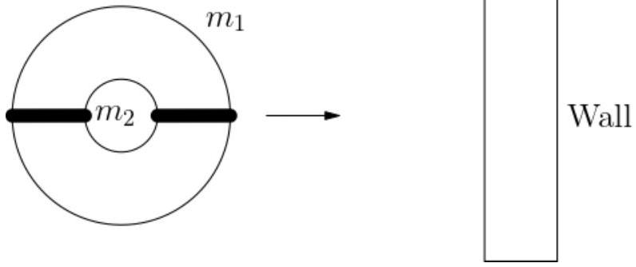
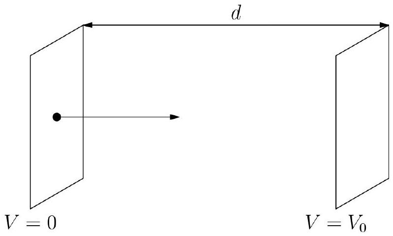
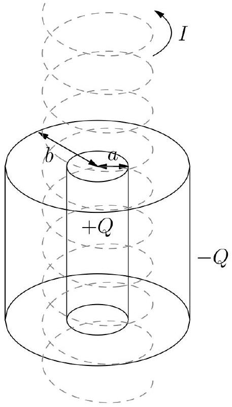
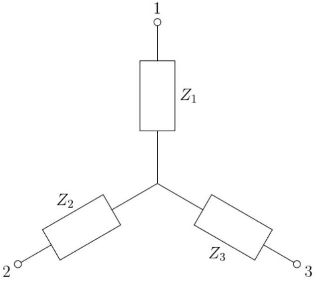
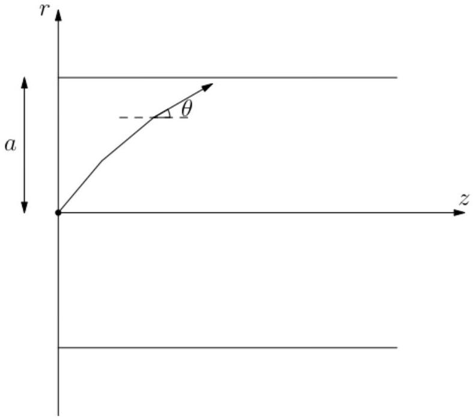

## Sp   Singapore Physics Olympiad Training

## 2023 Selection Test   for the Asian and International Physics Olympiads

a. This is a four-hour test. Attempt all questions. The maximum total score is 75; marks allocated for each question part are indicated in square brackets.
b. Check that there are a total of 22 printed pages (including this cover page). The last page contains a table of physical constants that you may refer to and use.
c. Begin your answer for each question on a fresh sheet of paper, and present your working and answers clearly. Your answer sheets should be sorted according to the order of the questions.
d. Write your name on the top right hand corner of every answer sheet you submit.
e. Please complete and sign the declaration on page 2, which should be stapled together and submitted with your answer sheets.
f. You may use a standard (non-programmable) scientific calculator in accordance with the statutes of the International Physics Olympiad.
g. No books or documents relevant to the test may be brought into the examination room.

## Declaration

I declare that I will be fully committed to the training for and participation in the Asian Physics Olympiad and/or the International Physics Olympiad if selected. I will check first with the MOE coordinator before taking on additional commitments not listed below.

Potential limitations to my commitment in the period from now to end-July 2023 are described exhaustively in the box below, such as other academic competitions, CCA commitments (school-related or otherwise), travel plans, etc.
□

Name and signature: $\_\_\_\_$

| Question: | 1 | 2 | 3 | 4 | 5 | 6 | 7 | 8 | Total |
| :--- | :--- | :--- | :--- | :--- | :--- | :--- | :--- | :--- | :--- |
| Points: | 5 | 9 | 10 | 9 | 7 | 6 | 10 | 19 | 75 |
| Score: |  |  |  |  |  |  |  |  |  |

1. We model the collision of a compound object with a rigid vertical wall. The object is made up of a spherical shell of mass $m _ { 1 }$ that is joined by a horizontal rod to the centre of an inner ball of mass $m _ { 2 }$.
The rod has negligible mass and an effective spring constant $k$, such that the magnitude of the restoring force is $F = k x$ when the distance between the centres of the masses is $x$. The rod does not twist or flex, but can compress and stretch as the masses are displaced from their initially concentric positions.

The object moves with constant horizontal velocity $v _ { i }$ directly towards the wall, colliding with it. Suppose that $m _ { 1 } > m _ { 2 }$. Ignore any vertical forces, and suppose the object does not spin or rotate. Assume that all collisions are elastic.

(a) Derive an expression for the coefficient of restitution $e \equiv v _ { f } / v _ { i }$, where $v _ { i }$ and $v _ { f }$ are the initial and final speeds of the centre of mass of the object.
(b) Show that after the collision, the masses $m _ { 1 }$ and $m _ { 2 }$ oscillate about their centre of mass in simple harmonic motion.
(c) Find the angular frequency $\omega$ of oscillation and maximum distance $X$ between the centres of masses, in terms of $v _ { i } , m _ { 1 } , m _ { 2 }$, and $k$.

Solution:

(a) Initially, both masses are moving to the right at speed $v _ { i }$. After the (elastic) collision, the mass $m _ { 1 }$ is moving at speed $v _ { i }$ to the left while the mass $m _ { 2 }$ continues moving at speed $v _ { i }$ to the right. The velocity of the CM is thus
$$
v _ { C M } = \frac { - m _ { 1 } v _ { i } + m _ { 2 } v _ { i } } { m _ { 1 } + m _ { 2 } } = - \frac { m _ { 1 } - m _ { 2 } } { m _ { 1 } + m _ { 2 } } v _ { i } .
$$
The coefficient of restitution is thus
$$
e = \frac { m _ { 1 } - m _ { 2 } } { m _ { 1 } + m _ { 2 } }
$$

1 - Correct answer

(b) Let the positions of the masses in the CM frame be $x _ { 1 } ( t )$ and $x _ { 2 } ( t )$. We know that $x _ { 1 } ( 0 ) = x _ { 2 } ( 0 )$. The extension or compression of the rod depends on $x _ { 2 } ( t ) - x _ { 1 } ( t )$, therefore the force on mass 1 is
$$
F _ { 1 } = - k \left( x _ { 1 } - x _ { 2 } \right)
$$
while the force on mass 2 is
$$
F _ { 2 } = - k \left( x _ { 2 } - x _ { 1 } \right) = - F _ { 1 } .
$$

We note that in this frame, the CM does not move (i.e. stays at zero), therefore

$$
m _ { 1 } x _ { 1 } + m _ { 2 } x _ { 2 } = 0 .
$$

Substituting $x _ { 2 } = - \frac { m _ { 1 } } { m _ { 2 } } x _ { 1 }$ into the above expressions for the forces, we get

$$
F _ { 1 } = - k \left( \frac { m _ { 1 } + m _ { 2 } } { m _ { 2 } } x _ { 1 } \right) ,
$$

which shows that the motion of $x _ { 1 }$ is simple harmonic, and thus the motion of $x _ { 2 }$ is simple harmonic as well (since it is scaled in the opposite direction by a constant factor).
1 - Using CM frame
1 - Argument using forces on masses

(c) Using $F _ { 1 } = m _ { 1 } a _ { 1 }$, we get
$$
a _ { 1 } = - k \frac { m _ { 1 } + m _ { 2 } } { m _ { 1 } m _ { 2 } } x _ { 1 } .
$$
Therefore, the angular frequency of oscillation is
$$
\omega = \sqrt { \frac { k \left( m _ { 1 } + m _ { 2 } \right) } { m _ { 1 } m _ { 2 } } } .
$$
Consider relative velocities of $m _ { 1 }$ and $m _ { 2 }$. Just after the collision, the relative velocity is $V = 2 v _ { i }$ since the outer shell moves to the left and the inner ball is still moving to the right. This is unchanged in the CM frame (initial velocity of $m _ { 1 }$ is $\frac { 2 m _ { 2 } } { m _ { 1 } + m _ { 2 } } v _ { i }$ to the left, while the initial velocity of $m _ { 2 }$ is $\frac { 2 m _ { 1 } } { m _ { 1 } + m _ { 2 } } v _ { i }$ to the right).
The maximum distance $X$ between $x _ { 1 }$ and $x _ { 2 }$ is given by the amplitude of oscillation:
$$
X = \frac { V } { \omega } = 2 v _ { i } \sqrt { \frac { m _ { 1 } m _ { 2 } } { k \left( m _ { 1 } + m _ { 2 } \right) } } .
$$
1 - Angular frequency of oscillation
1 - Amplitude of oscillation

Q1 total: 5
2. This question is about thermionic emission. Consider two very large parallel plates, each of area $A$, separated by a distance $d$. Electrons are emitted from rest from the hot cathode at potential $V = 0$, and accelerated across a gap to the anode at potential $V = V _ { 0 }$ as shown in the figure.
The moving electrons, termed as space charge, build up to the point where the electric field at the surface of the cathode is zero, with a steady current $I$ flowing between the plates.
Suppose the plates are large compared to the separation between them (i.e. $A \gg d ^ { 2 }$ ). Defining $x$ to be the distance from the cathode, the charge density ${ } ^ { 1 } \rho$ and speed of moving electrons $v$ are both functions of $x$. Denote the charge and mass of an electron to be $- q$ and $m$ respectively.

[^0]

(a) Find the relationship between the potential $V$ and the speed $v$ at distance $x$ from the cathode.
(b) At steady state, the current $I$ is independent of $x$. Show that $V$ obeys the following differential equation as a function of $x$ :
$$
\frac { d ^ { 2 } V } { d x ^ { 2 } } + \frac { I } { \varepsilon _ { 0 } A } \sqrt { \frac { m } { 2 q } } V ^ { - \frac { 1 } { 2 } } = 0 .
$$
(c) Hence find the potential $V$ as a function of $x$, in terms of $I , m , A , q$, and other fundamental constants.
(d) Find the relationship between the steady current $I$ and the applied potential difference $V _ { 0 }$, in terms of the geometry of the plates and fundamental constants.

Solution: Adapted from Problem 2.48 in [1].

(a) Using the conservation of energy, we have
$$
q V = \frac { 1 } { 2 } m v ^ { 2 }
$$
Therefore,
$$
v = \sqrt { \frac { 2 q V } { m } } .
$$

1 - Correct answer

(b) The current is
$$
I = \frac { d Q } { d t } = A \rho \frac { d x } { d t } = A \rho v .
$$
Gauss' law gives
$$
- \frac { d ^ { 2 } V } { d x ^ { 2 } } = \frac { \rho } { \varepsilon _ { 0 } } = \frac { 1 } { \varepsilon _ { 0 } } \frac { I } { A v } = \frac { I } { \varepsilon _ { 0 } A } \sqrt { \frac { m } { 2 q V } } .
$$
1 - Expressing $I = A \rho v$
1 - Use of Gauss' law
1 - Correct answer through proper algebraic manipulation

(c) Solve the differential equation, noting that $V ^ { \prime \prime } = V ^ { \prime } \frac { d V ^ { \prime } } { d V }$ :
$$
V ^ { \prime } \frac { d V ^ { \prime } } { d V } = - \frac { I } { \varepsilon _ { 0 } A } \sqrt { \frac { m } { 2 q } } V ^ { - \frac { 1 } { 2 } } .
$$
Integrating both sides,
$$
\frac { 1 } { 2 } V ^ { \prime 2 } = - \frac { 2 I } { \varepsilon _ { 0 } A } \sqrt { \frac { m } { 2 q } } V ^ { \frac { 1 } { 2 } } + \text { const. }
$$
Since the cathode is at zero potential and field at cathode is zero due to the space charge, we have $V ( 0 ) = V ^ { \prime } ( 0 ) = 0$, so the constant from integration is zero:
$$
V ^ { \prime 2 } = - \frac { 4 I } { \varepsilon _ { 0 } A } \sqrt { \frac { m } { 2 q } } V ^ { \frac { 1 } { 2 } }
$$
Thus,
$$
\frac { d V } { d x } = \sqrt { - \frac { 4 I } { \varepsilon _ { 0 } A } \sqrt { \frac { m } { 2 q } } } V ^ { \frac { 1 } { 4 } }
$$
Integrating once more,
$$
\frac { 4 } { 3 } V ^ { \frac { 3 } { 4 } } = \sqrt { - \frac { 4 I } { \varepsilon _ { 0 } A } \sqrt { \frac { m } { 2 q } } } x + \text { const. }
$$
But $V ( 0 ) = 0$, so this constant is also zero. Rearranging, we obtain
$$
V = \left( \frac { 81 I ^ { 2 } m } { 32 \varepsilon _ { 0 } ^ { 2 } A ^ { 2 } q } \right) ^ { \frac { 1 } { 3 } } x ^ { \frac { 4 } { 3 } } .
$$
    1 - Correct solving of ODE
    1 - Correct boundary conditions
    1 - Correct answer
(d) Setting $x = d$ and $V = V _ { 0 }$, we get
$$
V _ { 0 } = \left( \frac { 81 I ^ { 2 } m } { 32 \varepsilon _ { 0 } ^ { 2 } A ^ { 2 } q } \right) ^ { \frac { 1 } { 3 } } d ^ { \frac { 4 } { 3 } }
$$
Rearranging, we obtain the Child-Langmuir law
$$
I = \frac { 4 \sqrt { 2 } } { 9 } \frac { \varepsilon _ { 0 } A } { d ^ { 2 } } \sqrt { \frac { q } { m } } V _ { 0 } ^ { \frac { 3 } { 2 } } .
$$
    1 - Substitution of $d$ and $V _ { 0 }$
    1 - Correct answer

Q2 total: 9
3. A stationary observer, Alice, observes a proton $P _ { 1 }$ in a magnetic field with flux density

$B _ { z } = 1.0 \mathrm {~T}$ in the $+ z$-direction. $P _ { 1 }$ moves in a circle of radius $R _ { 1 }$ in the $x y$-plane with speed $v = 3.00 \times 10 ^ { 5 } \mathrm {~m} / \mathrm { s }$.

(a) State whether $P _ { 1 }$ moves clockwise or anticlockwise (when looking down at the proton).
(b) Find the radius $R _ { 1 }$ of the circle, and find the time the proton takes to complete one circle.

Relative to Alice, another observer Bob moves with constant velocity $v _ { B } = 1.00 \times 10 ^ { 4 } \mathrm {~m} / \mathrm { s }$ in the $+ x$-direction.

(c) Describe the motion of $P _ { 1 }$ in Bob's frame with a sketch. Remember to indicate the orientation of your axes.

Another proton $P _ { 2 }$ is at rest in Alice's frame, at a distance of 1.00 cm from the centre of the circle described above, which we assume is sufficiently far away that the interaction between the two protons can be neglected.

(d) Describe the motion of $P _ { 2 }$ in Bob's frame with a sketch. Remember to indicate the orientation of your axes.
(e) Bob attributes the motion of $P _ { 1 }$ and $P _ { 2 }$ to electromagnetic fields in his frame. What static electric and magnetic fields could result in the motion of both protons as observed by him?

Another observer Carol has a stationary position in Alice's frame and sees $P _ { 1 }$ as stationary. How can this be?

(f) Describe the motion of $P _ { 2 }$ in Carol's frame with a sketch.
(g) Carol attributes the motion of $P _ { 2 }$ to electromagnetic fields in her frame. What static electric and magnetic fields could result in the motion of both protons as observed by her?

Solution:

(a) The magnetic force $\mathbf { F } = q \mathbf { v } \times \mathbf { B }$, and since the force has to point towards the centre of the circle, the particle moves in the clockwise direction.
    1 - Correct direction
    (b) The centripetal force is equal to the magnetic force:
$$
\begin{gathered}
\frac { m v ^ { 2 } } { R _ { 1 } } = q v B _ { z } \\
R _ { 1 } = \frac { m v } { q B _ { z } } = 3.13 \times 10 ^ { - 3 } \mathrm {~m}
\end{gathered}
$$
The time taken is
$$
T = \frac { 2 \pi R _ { 1 } } { v } = 6.55 \times 10 ^ { - 8 } \mathrm {~s} .
$$
    1 - Correct radius
    1 - Correct period
(c) The motion of $P _ { 1 }$ is described by a circle whose centre is constantly shifting left at a speed of $1.00 \times 10 ^ { 4 } \mathrm {~m} / \mathrm { s }$. In the time that the proton makes one round, the centre has shifted left by
$$
x = \left( 1.00 \times 10 ^ { 4 } \right) \left( 6.55 \times 10 ^ { - 8 } \right) = 6.55 \times 10 ^ { - 4 } \mathrm {~m}
$$
1 - Correct depiction of motion

(d) $P _ { 2 }$ moves left with a constant speed of $1.00 \times 10 ^ { 4 } \mathrm {~m} / \mathrm { s }$.
1 - Correct depiction of motion
(e) Suppose there is an electric field E and a magnetic field B experienced by both protons. Then the electromagnetic force acting on proton $P _ { 2 }$ is equal to
$$
\mathbf { F } = q ( \mathbf { E } + \mathbf { v } \times \mathbf { B } )
$$
which must be zero since it is moving at constant speed. If we assume that B from earlier is unmodified, then we need $\mathbf { E } = - \mathbf { v } \times \mathbf { B } = - 1.00 \times 10 ^ { 4 } \mathrm {~V} / \mathrm { m } \hat { \mathbf { y } }$.
It is instructive to think about how this electric field E causes the circular path for $P _ { 1 }$ to drift.
1 - Balancing Lorentz force
1 - Correct electric field
(f) Carol is stationary in Alice's frame and sees $P _ { 1 }$ as stationary, therefore she must be at the centre of the circle and rotating (clockwise) at the same angular velocity as $P _ { 1 }$. Carol thus sees $P _ { 2 }$ rotating anticlockwise with a period of $6.56 \times 10 ^ { - 8 } \mathrm {~s}$.
1 - Correct depiction of motion
(g) There must be no electric field in Carol's frame, since $P _ { 1 }$ is at rest. The magnetic field causes the motion of $P _ { 2 }$, therefore it must be in the $- z$-direction with flux density
$$
B = \frac { m v } { q R } = \frac { m \omega } { q } = \frac { 2 \pi m } { q T } = 1.0 \mathrm {~T} .
$$
1 - Zero electric field and magnetic field in the $- z$-direction
1 - Correct magnetic field strength

Q3 total: 10
4. The energy transferred by an electromagnetic wave per unit time per unit surface area is given by the Poynting vector

$$
\mathbf { S } = \frac { 1 } { \mu _ { 0 } } \mathbf { E } \times \mathbf { B } ,
$$

where the direction of the vector $\mathbf { S }$ is the direction of energy transfer.

(a) Show the volume density of the linear momentum of an electromagnetic wave is
$$
\mathbf { p } _ { V } = \frac { 1 } { c ^ { 2 } \mu _ { 0 } } \mathbf { E } \times \mathbf { B } ,
$$
where $c$ is the speed of light.

We now consider a "paradox" regarding the conservation of angular momentum. Two long, coaxial cylindrical shells, shown in the figure, both have length $l$. The inner one has radius $a$ and electric charge $+ Q$ uniformly distributed along its surface, while the outer one has radius $b > a$ and electric charge $- Q$ uniformly distributed over its surface.

The cylinders are made of the same material, having mass per unit area equal to $\sigma$. Between them, there is another long solenoid with radius $R ( a < R < b )$ that is also coaxial with the two cylinders. The solenoid has $n$ turns per unit length and carries an electric current $I$.

The solenoid is held fixed in space, but the cylindrical shells can freely and independently rotate around their common axis. Initially, all parts of the system are at rest. When the current in the solenoid is gradually reduced to zero, the cylinders begin to rotate.

(b) Find the final angular velocities of each of the cylinders, giving their magnitude and orientation.
(c) Since no external force acts on the system, the net angular momentum should be conserved. Where did the extra angular momentum come from? Support your answer with equations.

Solution: Adapted from Romanian Masters of Physics 2017 T1.

(a) The momentum of the photons in the electromagnetic wave is
$$
\delta p = \frac { \delta E } { c } = \frac { S \delta A \delta t } { c }
$$
where $c$ is the speed of light. Therefore,
$$
p _ { V } = \frac { \delta p } { \delta V } = \frac { S \delta A \delta t } { c \delta A \delta l } = \frac { S } { c \frac { \delta l } { \delta t } } = \frac { S } { c ^ { 2 } } .
$$
In vector form,
$$
\mathbf { p } _ { V } = \frac { 1 } { c ^ { 2 } \mu _ { 0 } } \mathbf { E } \times \mathbf { B } = \varepsilon _ { 0 } \mathbf { E } \times \mathbf { B } .
$$
    1 - Expression for momentum of a photon
    1 - Correct interpretation of relationship to Poynting vector
(b) The current through the solenoid produces inside it a magnetic field given by
$$
\mathbf { B } = \mu _ { 0 } n I \hat { \mathbf { z } } , \quad r < R .
$$

When the current decreases, the magnetic field strength decreases, inducing an electric field in accordance with Faraday's law:

$$
\mathbf { E } \cdot 2 \pi r \hat { \boldsymbol { \phi } } = - \frac { d } { d t } ( \mathbf { B } \cdot \mathbf { A } ) .
$$

If $r < R$, then $\mathbf { A } = \pi r ^ { 2 } \hat { \mathbf { z } }$, and

$$
\mathbf { E } = - \frac { 1 } { 2 } \mu _ { 0 } n \frac { d I } { d t } r \hat { \boldsymbol { \phi } }
$$

If $r > R$, then $\mathbf { A } = \pi R ^ { 2 } \hat { \mathbf { z } }$, and

$$
\mathbf { E } = - \frac { 1 } { 2 } \mu _ { 0 } n \frac { d I } { d t } \frac { R ^ { 2 } } { r } \hat { \boldsymbol { \phi } } .
$$

The torque on the inner cylinder is

$$
\tau = \mathbf { r } \times Q \mathbf { E } = - \frac { 1 } { 2 } \mu _ { 0 } n Q a ^ { 2 } \frac { d I } { d t } \hat { \mathbf { r } } \times \hat { \boldsymbol { \phi } } = - \frac { 1 } { 2 } \mu _ { 0 } n Q a ^ { 2 } \frac { d I } { d t } \hat { \mathbf { z } } .
$$

The final angular momentum of the inner cylinder is

$$
\Delta \mathbf { L } _ { a } = - \frac { 1 } { 2 } \mu _ { 0 } n Q a ^ { 2 } \Delta I \hat { \mathbf { z } } = \frac { 1 } { 2 } \mu _ { 0 } n Q a ^ { 2 } I \hat { \mathbf { z } }
$$

The moment of inertia of the cylinder is equal to

$$
J = m _ { a } a ^ { 2 } = 2 \pi l \sigma a ^ { 3 }
$$

and the final angular velocity is thus

$$
\omega _ { a } = \frac { \mu _ { 0 } n Q I } { 4 \pi l \sigma a }
$$

in the counterclockwise direction.
The torque on the outer cylinder is

$$
\tau = \mathbf { r } \times ( - Q ) \mathbf { E } = \frac { 1 } { 2 } \mu _ { 0 } n Q R ^ { 2 } \frac { d I } { d t } .
$$

The increase in angular momentum is

$$
\Delta L = \frac { 1 } { 2 } \mu _ { 0 } n Q R ^ { 2 } \Delta I \hat { \mathbf { z } } = - \frac { 1 } { 2 } \mu _ { 0 } n Q R ^ { 2 } I \hat { \mathbf { z } } .
$$

We know that the moment of inertia of the outer cylinder is

$$
J = m _ { b } b ^ { 2 } = 2 \pi l \sigma b ^ { 3 } ,
$$

therefore the final angular velocity is

$$
\omega _ { b } = \frac { \mu _ { 0 } n Q I R ^ { 2 } } { 4 \pi l \sigma b ^ { 3 } }
$$

clockwise.

1 - Correct usage of Faraday's Law
1 - Correct torque on inner and outer cylinder
1 - Correct angular momentum on inner and outer cylinder
1 - Correct angular velocity and direction of inner and outer cylinder

(c) In the region between the cylinders, there is an electric field, given by Gauss' law
$$
\mathbf { E } = \frac { Q } { 2 \pi \varepsilon _ { 0 } l r } \hat { \mathbf { r } } .
$$
When there is a current through the solenoid, there is a magnetic field inside it, so the linear momentum density of the fields is
$$
\mathbf { p } _ { V } = \varepsilon _ { 0 } \mathbf { E } \times \mathbf { B } = \frac { Q } { 2 \pi l r } \hat { \mathbf { r } } \times \mu _ { 0 } n I \hat { \mathbf { z } } = - \frac { \mu _ { 0 } n I Q } { 2 \pi l r } \hat { \boldsymbol { \phi } } .
$$
The angular momentum density of the fields is
$$
\ell _ { e m } = \mathbf { r } \times \mathbf { p } _ { V } = - \frac { \mu _ { 0 } n I Q } { 2 \pi l } \hat { \mathbf { r } } \times \hat { \boldsymbol { \phi } } = - \frac { \mu _ { 0 } n I Q } { 2 \pi l } \hat { \mathbf { z } }
$$
The total angular momentum of the fields is
$$
\mathbf { L } _ { e m } = \ell _ { e m } \cdot \pi \left( R ^ { 2 } - a ^ { 2 } \right) l = - \frac { 1 } { 2 } \mu _ { 0 } n I Q \left( R ^ { 2 } - a ^ { 2 } \right) \hat { \mathbf { z } }
$$
We see that from the previous part,
$$
\mathbf { L } _ { e m } = \mathbf { L } _ { a } + \mathbf { L } _ { b }
$$
which means that the field angular momentum is totally transformed into mechanical angular momentum of the cylinders.
1 - Correct application of Gauss' Law to find linear momentum density
1 - Correct angular momentum density
1 - Correct conclusion that EM field angular momentum is transformed into mechanical angular momentum

Q4 total: 9

5. Three circuit elements are connected to a central junction in a "star" shape, as shown in the figure. One is a resistor, one is an inductor, and one is a capacitor, although it is not known which is which.

A physicist connects an AC source with fixed voltage $V _ { s }$ across a pair of terminals, at

the same time connecting an AC voltmeter to one of the terminals (the other end of the voltmeter is always fixed at the central junction). She obtains the following readings:

| AC source terminals | AC voltmeter terminal | Voltmeter reading |
| :--- | :--- | :--- |
| 1 \& 2 | 1 | 20.8 V |
| 1 \& 2 | 2 | 15.6 V |
| 1 \& 3 | 1 | 24.0 V |
| 1 \& 3 | 3 | 10.0 V |
| 2 \& 3 | 2 | 58.5 V |
| 2 \& 3 | 3 | 32.5 V |

(a) Determine the value of $V _ { s }$ (i.e. the reading on the AC voltmeter when it is hooked up directly to the AC source).
(b) Determine the possible identities of $Z _ { 1 } , Z _ { 2 } , Z _ { 3 }$ (i.e. which is the resistor, inductor, capacitor).
(c) Now, an AC ammeter is also connected in series with the AC source. Find the ratio of currents $I _ { 12 } : I _ { 13 } : I _ { 23 }$, where $I _ { i j }$ denotes the value on the AC ammeter when the AC source is connected to terminals $i$ and $j$.

Solution:

(a) The impedances of resistors, inductors and capacitors are positive real, positive imaginary and negative imaginary numbers respectively. Suppose the resistor has impedance $R$, the capacitor has impedance $- j X _ { C }$ while the inductor has impedance $+ j X _ { L }$.
Consider the following cases:
    - $R$ and $L$ in series. Then the voltages are
$$
\begin{aligned}
& \left| V _ { R } \right| = I R = \frac { R } { \sqrt { R ^ { 2 } + X _ { L } ^ { 2 } } } V _ { s } \\
& \left| V _ { L } \right| = I X _ { L } = \frac { X _ { L } } { \sqrt { R ^ { 2 } + X _ { L } ^ { 2 } } } V _ { s }
\end{aligned}
$$
The source voltage is thus the root of the sum of squares of the individual voltages.
    - $R$ and $C$ in series. The voltages are
$$
\begin{gathered}
\left| V _ { R } \right| = I R = \frac { R } { \sqrt { R ^ { 2 } + X _ { C } ^ { 2 } } } V _ { s } \\
\left| V _ { C } \right| = - I X _ { C } = \frac { X _ { C } } { \sqrt { R ^ { 2 } + X _ { C } ^ { 2 } } } V _ { s }
\end{gathered}
$$
The source voltage is thus the root of the sum of squares of the individual voltages.

- $L$ and $C$ in series. The voltages are
$$
\begin{aligned}
& \left| V _ { L } \right| = I X _ { L } = \frac { X _ { L } } { \left| X _ { L } - X _ { C } \right| } V _ { s } \\
& \left| V _ { C } \right| = I X _ { C } = \frac { X _ { C } } { \left| X _ { L } - X _ { C } \right| } V _ { s }
\end{aligned}
$$

The source voltage is thus the difference in voltages.
We see that

$$
\sqrt { 20.8 ^ { 2 } + 15.6 ^ { 2 } } = \sqrt { 24.0 ^ { 2 } + 10.0 ^ { 2 } } = 58.5 - 32.5 = 26.0
$$

therefore, the source voltage is 26.0 V.
1 - Writing down the correct impedances
1 - Recognising that source voltage is either square root of sum of squares or difference of component voltages
1 - Correct final answer

(b) We can conclude that $Z _ { 1 }$ is a resistor. However, $Z _ { 2 }$ and $Z _ { 3 }$ cannot be distinguished, since we may flip the signs of the imaginary part to get either combination.
1 - Correct analysis
(c) The ratio of impedances is equal to the ratio of voltages. Therefore,
$$
\begin{aligned}
& \left| Z _ { 1 } \right| : \left| Z _ { 2 } \right| = 4 : 3 \\
& \left| Z _ { 1 } \right| : \left| Z _ { 3 } \right| = 12 : 5 \\
& \left| Z _ { 2 } \right| : \left| Z _ { 3 } \right| = 9 : 5
\end{aligned}
$$
We thus conclude that
$$
\left| Z _ { 1 } \right| : \left| Z _ { 2 } \right| : \left| Z _ { 3 } \right| = 12 : 9 : 5 .
$$
The ratio of impedances across terminals is
$$
\left| Z _ { 12 } \right| : \left| Z _ { 13 } \right| : \left| Z _ { 23 } \right| = 15 : 13 : 4 .
$$
The ratio of current is thus
$$
I _ { 12 } : I _ { 23 } : I _ { 13 } = \frac { 1 } { 15 } : \frac { 1 } { 13 } : \frac { 1 } { 4 } .
$$
    1 - Correct ratio of impedances of elements
    1 - Correct ratio of impedances across terminals
    1 - Correct ratio of current

Q5 total: 7

6. This question is about deriving thermodynamic identities.
(a) Consider a mole of ideal gas at pressure $P$, volume $V$, and temperature $T$. Denote the

heat capacity at constant volume as $C _ { V }$. Show that the heat capacity $C$ is given by
$$
C = C _ { V } + \frac { R } { 1 + \frac { V } { P } \frac { d P } { d V } }
$$
(b) Consider two ideal gases $A$ and $B$ which are mixed. There are $n _ { 1 }$ moles of gas $A$ and $n _ { 2 }$ moles of gas $B$, and the molar heat capacities at constant volume of gases $A$ and $B$ are $c _ { v 1 }$ and $c _ { v 2 }$ respectively. Find the adiabatic constant of the mixed gas.

Solution:

(a) Using the 1st Law of Thermodynamics,
$$
C = \frac { d Q } { d T } = \frac { d U } { d T } + P \frac { d V } { d T } = C _ { V } + P \frac { d V } { d T } .
$$
The ideal gas law states that $P V = R T$, which means that
$$
R d T = P d V + V d P .
$$
Therefore,
$$
P \frac { d V } { d T } = R \frac { P d V } { P d V + V d P } = \frac { R } { 1 + \frac { V } { P } \frac { d P } { d V } }
$$
    1-1st Law of Thermodynamics
    1 - Implicitly differentiating Ideal Gas Equation and obtaining final result
(b) Using the first law of thermodynamics and the ideal gas equation,
$$
d S = \frac { d Q } { T } = \frac { d U } { T } + P \frac { d V } { T } = n c _ { v } \frac { d T } { T } + \frac { n R } { V } d V
$$
Integrating both sides,
$$
\Delta S = n c _ { v } \ln \frac { T _ { f } } { T _ { i } } + n R \ln \frac { V _ { f } } { V _ { i } } .
$$
In an adiabatic process, there is no change in heat, so the change in entropy is zero. For the mixture of two gases, we thus have
$$
n _ { 1 } c _ { v 1 } \ln \frac { T _ { f } } { T _ { i } } + n _ { 1 } R \ln \frac { V _ { f } } { V _ { i } } + n _ { 2 } c _ { v 2 } \ln \frac { T _ { f } } { T _ { i } } + n _ { 2 } R \ln \frac { V _ { f } } { V _ { i } } = 0 .
$$
This can be rewritten as
$$
\left( n _ { 1 } c _ { v 1 } + n _ { 2 } c _ { v 2 } \right) \ln \frac { T _ { f } } { T _ { i } } = - \left( n _ { 1 } R + n _ { 2 } R \right) \ln \frac { V _ { f } } { V _ { i } } = \left( n _ { 1 } + n _ { 2 } \right) R \ln \frac { V _ { i } } { V _ { f } } ,
$$
which is equivalent to
$$
T _ { i } V _ { i } ^ { g } = T _ { f } V _ { f } ^ { g } , \quad g = \frac { \left( n _ { 1 } + n _ { 2 } \right) R } { n _ { 1 } c _ { v 1 } + n _ { 2 } c _ { v 2 } } .
$$
An adiabatic process is characterised by an adiabatic constant $\gamma$ such that
$$
P V ^ { \gamma } = \text { const. }
$$

Using $P = n R T / V$ for the mixture, the adiabatic equation can also be written as

$$
T V ^ { \gamma - 1 } = \mathrm { const } .
$$

Therefore,

$$
\gamma = g + 1 = \frac { \left( n _ { 1 } + n _ { 2 } \right) R } { n _ { 1 } c _ { v 1 } + n _ { 2 } c _ { v 2 } } + 1 .
$$

1 - Writing 1st law of thermodynamics in terms of infinitesimal entropy change
1 - Integrating correctly to obtain total entropy change
1 - Relating to the adiabatic constant
1 - Final expression for adiabatic constant

Q6 total: 6
7. Weather balloons float at high altitudes and need to withstand very low temperatures and pressures. When inflated, the effective radial tension on the surface of a spherical balloon of radius $r$ is given by

$$
F _ { T } = 16 \pi r _ { 0 } \kappa R T \left( \lambda - \frac { 1 } { \lambda ^ { 5 } } \right) ,
$$

where $r _ { 0 }$ is the radius of the balloon when there is no tension, $\lambda \equiv r / r _ { 0 }$ is the size inflation ratio, $\kappa$ is a constant with dimensions of inverse area, $R$ is the molar gas constant, and $T$ is the temperature of the air.

(a) Find the pressure difference $\Delta p$ between the air inside and outside the balloon, giving your answer in terms of $\lambda , T , r _ { 0 }$ and other constants.
(b) Determine the maximum pressure difference $\Delta p _ { m }$ as a function of $T$ and the radius $r _ { m }$ in terms of $r _ { 0 }$ that achieves this value.

The constant $\kappa$ can be determined from the amount of gas required to inflate a balloon. Suppose at ground level, the temperature is $T _ { 0 } = 290 \mathrm {~K}$ and the pressure is $p _ { 0 } = 1.01 \times$ $10 ^ { 5 } \mathrm {~Pa}$.

An unstretched balloon of radius $r _ { 0 }$ contains $n _ { i } = 10 \mathrm {~mol}$ of helium. After the balloon is pumped with helium so that it contains a total of $n _ { f } = 40 \mathrm {~mol}$ of helium, the balloon has a radius $r = 1.5 r _ { 0 }$.

(c) Determine the value of $\kappa$ for this balloon.

Solution: Adapted from IPhO 2004 T2.

(a) The work needed to increase the radius from $r$ to $r + d r$ when the pressure difference is $\Delta p$ is
$$
d W = \Delta p \cdot 4 \pi r ^ { 2 } d r
$$
The increase in elastic energy for the same change in $r$ is
$$
d U = F _ { T } d r = 16 \pi r _ { 0 } \kappa R T \left( \frac { r } { r _ { 0 } } - \frac { r _ { 0 } ^ { 5 } } { r ^ { 5 } } \right) d r
$$

Equating the two,

$$
\Delta p = \frac { 16 \pi r _ { 0 } \kappa R T \left( \frac { r } { r _ { 0 } } - \frac { r _ { 0 } ^ { 5 } } { r ^ { 5 } } \right) } { 4 \pi r ^ { 2 } } = \frac { 4 \kappa R T } { r _ { 0 } } \left( \frac { 1 } { \lambda } - \frac { 1 } { \lambda ^ { 7 } } \right) .
$$

1 - Increase in elastic energy
1 - Correct $\Delta p$

Alternative approach by using force on an infinitesimal section to get $\Delta p$ also acceptable

(b) The maximum value can be found by differentiating with respect to $\lambda$ :
$$
\frac { d ( \Delta p ) } { d \lambda } = \frac { 4 \kappa R T } { r _ { 0 } } \left( - \frac { 1 } { \lambda ^ { 2 } } + \frac { 7 } { \lambda ^ { 8 } } \right) .
$$
Therefore,
$$
\begin{aligned}
\lambda & = 7 ^ { \frac { 1 } { 6 } } \\
r _ { m } & = 7 ^ { \frac { 1 } { 6 } } r _ { 0 } \\
\Delta p _ { m } & = \frac { 24 \kappa R T } { 7 ^ { \frac { 1 } { 6 } } r _ { 0 } }
\end{aligned}
$$
    1 - Differentiating to find stationary values
    1 - Correct $r _ { m }$
    1 - Correct $\Delta p _ { m }$
(c) Using the ideal gas equation,
$$
\begin{aligned}
p _ { i } V _ { i } & = n _ { i } R T _ { i } \\
p _ { f } V _ { f } & = n _ { f } R T _ { f }
\end{aligned}
$$
We know that $T _ { i } = T _ { f }$, and since $V _ { f } = \lambda ^ { 3 } V _ { i }$ where $\lambda = 1.5$, we get
$$
p _ { f } = \frac { n _ { f } } { n _ { i } \lambda ^ { 3 } } p _ { i } .
$$
But we also know that
$$
p _ { f } = p _ { i } + \Delta p = p _ { i } + \frac { 4 \kappa R T } { r _ { 0 } } \left( \frac { 1 } { \lambda } - \frac { 1 } { \lambda ^ { 7 } } \right)
$$
Therefore,
$$
\frac { 4 \kappa R T } { r _ { 0 } } \left( \frac { 1 } { \lambda } - \frac { 1 } { \lambda ^ { 7 } } \right) = \left( \frac { n _ { f } } { n _ { i } \lambda ^ { 3 } } - 1 \right) p _ { i }
$$
This means that
$$
\kappa = \frac { r _ { 0 } } { 4 R T } \left( \frac { 1 } { \lambda } - \frac { 1 } { \lambda ^ { 7 } } \right) ^ { - 1 } \left( \frac { n _ { f } } { n _ { i } \lambda ^ { 3 } } - 1 \right) p _ { i }
$$
Our last task is to find the value of $r _ { 0 }$. This can be found using the ideal gas equation for the non-inflated balloon:
$$
\begin{gathered}
p _ { 0 } \cdot \frac { 4 } { 3 } \pi r _ { 0 } ^ { 3 } = n _ { 0 } R T _ { 0 } \\
r _ { 0 } = 0.38 \mathrm {~m}
\end{gathered}
$$

Substituting in the numbers,

$$
\kappa = 1.2 \mathrm {~m} ^ { - 2 } .
$$

1 - Ideal gas equation and realising that volume scales with $\lambda ^ { 3 }$
1 - Equating expressions for pressure
1 - Expression for $\kappa$
1 - Expression for $r _ { 0 }$ using non-inflated balloon
1 - Value of $\kappa$

Q7 total: 10
8. This question is on pulse spreading in fibre optics.

Consider a cylindrical optical fibre in the region $0 \leq r \leq a$ for $z > 0$, see diagram. There is a light source at $r = z = 0$ that emits monochromatic waves. The refractive index $n ( r )$ is a function of the radial distance from the cylindrical axis.
Along the path of a ray, if the refractive index at some point is $n$ and the angle the ray makes with the horizontal ( $z$-axis) is $\theta$, we may use Snell's Law to conclude that

$$
n \cos \theta = \tilde { \beta }
$$

is a constant at all points along the path of the ray.

(a) Show that the path that a ray takes satisfies
$$
\frac { d ^ { 2 } r } { d z ^ { 2 } } = \frac { 1 } { 2 \tilde { \beta } ^ { 2 } } \frac { d \left( n ( r ) ^ { 2 } \right) } { d r } .
$$
This is known as the ray equation.
(b) The fibre is characterised by the following refractive index distribution:
$$
n ( r ) ^ { 2 } = n _ { 1 } ^ { 2 } \left[ 1 - 2 \Delta \left( \frac { r } { a } \right) ^ { 2 } \right] , \quad 0 \leq r \leq a
$$
where $\Delta \ll 1$ and $n _ { 1 }$ are constants.

The refractive index of the medium outside the optical fibre is uniform, with the value $n _ { 2 }$ given by
$$
n ( r ) ^ { 2 } = n _ { 2 } ^ { 2 } = n _ { 1 } ^ { 2 } ( 1 - 2 \Delta ) , \quad r > a .
$$
The initial angle of projection $\theta _ { 1 }$ has to be small enough for the ray to return to the $z$-axis.
    i. Assuming this is the case, find the equation of the path $r = r ( z )$ taken by the ray of light, as well as the position $z _ { 1 }$ of the first instance that the ray returns to the $z$-axis. Express your answers in terms of $n _ { 1 } , \Delta , a$, and $\tilde { \beta }$.
    ii. If $\theta _ { 1 } \ll 1$ such that we make the approximation $\cos \theta _ { 1 } \approx 1$, state the value of $z _ { 1 }$.
    iii. Find the maximum possible value of $\theta _ { 1 }$, in terms of $\Delta$.
(c) One of the important characteristics of a waveguide is pulse dispersion, the temporal spreading of a pulse of light launched into the waveguide. This is due to the difference in time taken by different rays. To calculate this dispersion, we calculate the time taken by a ray to traverse a given length of the waveguide.
Define the maximum radial distance the ray reaches from the $z$-axis to be $r _ { t }$. Show that the time taken for the light ray to first reach a distance $r _ { t }$ from the $z$-axis is given by
$$
\frac { 1 } { c } \int _ { 0 } ^ { r _ { t } } \frac { n ( r ) ^ { 2 } } { \sqrt { n ( r ) ^ { 2 } - \tilde { \beta } ^ { 2 } } } d r
$$
where $c$ is the speed of light in vacuum.
(d) For the fibre optic medium described in (b):
    i. Find the time taken for a light ray to first reach a distance $r _ { t }$ from the $z$-axis, expressing your answer in terms of $a , n _ { 1 } , \tilde { \beta } , \Delta$, and $c$.
    ii. Calculate the difference in the maximum and minimum times for rays to travel a distance $z$ along the $z$-axis, in terms of $n _ { 1 } , \Delta$, and $c$. This time difference $\tau$ can be taken to be the pulse dispersion time.
(e) To appreciate the small dispersion given in the previous part, let us consider the pulse dispersion in a cylindrical fibre optic medium with the same physical dimensions but with homogeneous refractive index $n _ { 1 }$, while the outside is still kept at refractive index $n _ { 2 }$ satisfying $n _ { 2 } ^ { 2 } = n _ { 1 } ^ { 2 } ( 1 - 2 \Delta )$.
Find the pulse dispersion time over a distance $z$ along the $z$-axis for such a setup, in terms of $n _ { 1 } , \Delta$, and $c$.

Solution: For a comprehensive discussion on this problem, see Chapter 4 of [2].

(a) Writing $d s ^ { 2 } = d r ^ { 2 } + d z ^ { 2 }$ and using $\cos \theta = \frac { d z } { d s }$, we obtain
$$
\frac { d s } { d z } = \frac { 1 } { \cos \theta } = \frac { n } { \tilde { \beta } }
$$
Therefore,
$$
\left( \frac { d r } { d z } \right) ^ { 2 } = \frac { n ( r ) ^ { 2 } } { \tilde { \beta } ^ { 2 } } - 1 .
$$
Differentiating both sides with respect to $z$,
$$
2 \frac { d r } { d z } \frac { d ^ { 2 } r } { d z ^ { 2 } } = \frac { 1 } { \tilde { \beta } ^ { 2 } } \frac { d \left( n ^ { 2 } \right) } { d r } \frac { d r } { d z } .
$$

Rearranging,

$$
\frac { d ^ { 2 } r } { d z ^ { 2 } } = \frac { 1 } { 2 \tilde { \beta } ^ { 2 } } \frac { d \left( n ^ { 2 } \right) } { d r }
$$

1 - Writing down $d s / d z$ in terms of $n$ and $\tilde { \beta }$
1 - Obtaining the final expression
(b) (i) Substituting into the ray equation,
$$
\frac { d ^ { 2 } r } { d z ^ { 2 } } = \frac { 1 } { 2 \tilde { \beta } ^ { 2 } } \frac { d } { d r } n _ { 1 } ^ { 2 } \left[ 1 - 2 \Delta \left( \frac { r } { a } \right) ^ { 2 } \right] = - \frac { 2 \Delta n _ { 1 } ^ { 2 } } { a ^ { 2 } \tilde { \beta } ^ { 2 } } r
$$
The general solution is given by
$$
r ( z ) = A \sin \Gamma z + B \cos \Gamma z
$$
where $\Gamma = \frac { n _ { 1 } \sqrt { 2 \Delta } } { \tilde { \beta } a }$.
Since $r ( 0 ) = 0$, therefore $B = 0$, and
$$
r ( z ) = A \sin \Gamma z .
$$
If the ray makes an angle $\theta _ { 1 }$ with the $z$-axis at $z = 0$, then
$$
\begin{gathered}
\tan \theta _ { 1 } = A \Gamma \\
A = \frac { \tilde { \beta } a \tan \theta _ { 1 } } { n _ { 1 } \sqrt { 2 \Delta } } = \frac { a \sin \theta _ { 1 } } { \sqrt { 2 \Delta } } = \frac { a } { \sqrt { 2 \Delta } } \left[ 1 - \left( \frac { \tilde { \beta } } { n _ { 1 } } \right) ^ { 2 } \right] ^ { \frac { 1 } { 2 } }
\end{gathered}
$$
where we have used the fact that
$$
\tilde { \beta } = n _ { 1 } \cos \theta _ { 1 } .
$$
Therefore,
$$
r ( z ) = \frac { a } { \sqrt { 2 \Delta } } \left[ 1 - \left( \frac { \tilde { \beta } } { n _ { 1 } } \right) ^ { 2 } \right] ^ { \frac { 1 } { 2 } } \sin \left( \frac { n _ { 1 } \sqrt { 2 \Delta } } { a \tilde { \beta } } z \right) .
$$
The first time the ray returns to the $z$-axis, we have
$$
\frac { n _ { 1 } \sqrt { 2 \Delta } } { a \tilde { \beta } } z _ { 1 } = \pi
$$
Therefore,
$$
z _ { 1 } = \frac { \pi a \tilde { \beta } } { n _ { 1 } \sqrt { 2 \Delta } }
$$
1 - Correctly simplifying the ray equation
1 - Recognising that the path is is sinusoidal
1 - Correct boundary condition
1 - Correct position along $z$-axis

(ii) Since $\tilde { \beta } \approx n _ { 1 }$,
$$
z _ { 1 } = \frac { \pi a } { \sqrt { 2 \Delta } } .
$$
This is independent of the launch angle (correspondingly $\tilde { \beta }$ )!
1 - Correct answer
(iii) The maximum angle can be found as follows: Suppose at initial angle $\theta _ { 1 }$ the wave reaches distance $a$ from the $z$-axis. Then
$$
\begin{gathered}
n _ { 1 } \cos \theta _ { 1 } = \tilde { \beta } = n _ { 2 } \\
\cos \theta _ { 1 } = \sqrt { 1 - 2 \Delta } \approx 1 - \Delta
\end{gathered}
$$
Since $\cos \theta \approx 1 - \frac { 1 } { 2 } \theta ^ { 2 }$, we get
$$
\theta _ { 1 } \approx \sqrt { 2 \Delta } .
$$
1 - Correct critical angle
(c) The time taken to travel along an arc length $d s$ is given by
$$
d t = \frac { d s } { v } = \frac { n ( r ) } { c } d s .
$$
We know that
$$
d s = \sqrt { 1 + \left( \frac { d z } { d r } \right) ^ { 2 } } d r = \frac { n ( r ) } { \sqrt { n ( r ) ^ { 2 } - \tilde { \beta } ^ { 2 } } } d r
$$
We thus obtain the required integral.
    1 - Correct expression for $d t$
    1 - Correct usage of ray equation
(d) (i) We know that $n \left( r _ { t } \right) = \tilde { \beta }$, therefore
$$
\begin{gathered}
n _ { 1 } ^ { 2 } \left[ 1 - 2 \Delta \left( \frac { r _ { t } } { a } \right) ^ { 2 } \right] = \tilde { \beta } ^ { 2 } \\
r _ { t } = \frac { a } { n _ { 1 } \sqrt { 2 \Delta } } \sqrt { n _ { 1 } ^ { 2 } - \tilde { \beta } ^ { 2 } }
\end{gathered}
$$
Therefore,
$$
\begin{aligned}
t & = \frac { 1 } { c } \int _ { 0 } ^ { r _ { t } } \frac { n _ { 1 } ^ { 2 } \left[ 1 - 2 \Delta ( r / a ) ^ { 2 } \right] } { \sqrt { n _ { 1 } ^ { 2 } \left[ 1 - 2 \Delta ( r / a ) ^ { 2 } \right] - \tilde { \beta } ^ { 2 } } } d r \\
& = \frac { 1 } { c } \left[ \frac { n _ { 1 } \sqrt { 2 \Delta } } { a } \int _ { 0 } ^ { r _ { t } } \sqrt { r _ { t } ^ { 2 } - r ^ { 2 } } d r + \frac { \tilde { \beta } ^ { 2 } a } { n _ { 1 } \sqrt { 2 \Delta } } \int _ { 0 } ^ { r _ { t } } \frac { d r } { \sqrt { r _ { t } ^ { 2 } - r ^ { 2 } } } \right] \\
& = \frac { \pi a } { 4 c n _ { 1 } \sqrt { 2 \Delta } } \left( n _ { 1 } ^ { 2 } + \tilde { \beta } ^ { 2 } \right)
\end{aligned}
$$

    1 - Expressing $r _ { t }$ in terms of known constants
    1 - Performing integration correctly
    1 - Correct final answer

(ii) Since the path is sinusoidal, we might as well talk in terms of periods. Letting $z _ { p }$ and $\tau _ { p }$ be the distance travelled and time taken over one period of the sinusoidal path,
$$
\begin{gathered}
z _ { p } = \frac { 2 \pi } { \Gamma } = \frac { 2 \pi a \tilde { \beta } } { n _ { 1 } \sqrt { 2 \Delta } } \\
\tau _ { p } = \frac { \pi a } { c n _ { 1 } \sqrt { 2 \Delta } } \left( n _ { 1 } ^ { 2 } + \tilde { \beta } ^ { 2 } \right)
\end{gathered}
$$
Thus, if $\tau ( z )$ represents the time taken by the ray to traverse the distance $z$, then
$$
\frac { \tau ( z ) } { z } = \frac { \tau _ { p } } { z _ { p } } = \frac { 1 } { 2 c } \left[ \tilde { \beta } + \frac { n _ { 1 } ^ { 2 } } { \tilde { \beta } } \right]
$$
Since $n _ { 2 } < \tilde { \beta } < n _ { 1 }$ for guided rays, a ray with $\tilde { \beta } = n _ { 1 }$ (i.e. axial) will take minimum time
$$
\tau _ { \min } ( z ) = \frac { n _ { 1 } z } { c }
$$
while a ray with $\tilde { \beta } = n _ { 2 }$ takes maximum time
$$
\tau _ { \max } ( z ) = \frac { 1 } { 2 c } \left[ n _ { 2 } + \frac { n _ { 1 } ^ { 2 } } { n _ { 2 } } \right] z .
$$
The difference is thus
$$
\tau = \tau _ { \max } - \tau _ { \min } = \frac { 1 } { 2 c n _ { 2 } } \left( n _ { 1 } - n _ { 2 } \right) ^ { 2 } z \approx \frac { n _ { 1 } } { 2 c } \Delta ^ { 2 } z .
$$
1 - Correct $\tau _ { \text {min } }$
1 - Correct $\tau _ { \text {max } }$
1 - Correct $\tau$
(e) The maximum angle above the horizontal is $\cos ^ { - 1 } \frac { n _ { 2 } } { n _ { 1 } }$. The shortest path taken has length $z$ and the light ray travels at speed $c / n _ { 1 }$, therefore it takes time $t = n _ { 1 } z / c$ to reach.
The horizontal distance covered by the light ray in the longest path is still $z$, but the horizontal velocity is now $\frac { c } { n _ { 1 } } \cos \theta = \frac { c n _ { 2 } } { n _ { 1 } ^ { 2 } }$. Therefore,
$$
t = \frac { n _ { 1 } ^ { 2 } z } { c n _ { 2 } } .
$$
The pulse dispersion is equal to
$$
\Delta t = \frac { n _ { 1 } ^ { 2 } z } { c n _ { 2 } } - \frac { n _ { 1 } z } { c } = \frac { n _ { 1 } } { c n _ { 2 } } \left( n _ { 1 } - n _ { 2 } \right) z \approx \frac { n _ { 1 } \Delta } { c } z .
$$
    1 - Correct minimum time
    1 - Correct maximum time
    1 - Correct pulse dispersion

Fundamental Physical Constants - Frequently used constants
| Quantity | Symbol | Value | Unit | Relative std. uncert. $u _ { \mathrm { r } }$ |
| :--- | :--- | :--- | :--- | :--- |
| speed of light in vacuum | $c$ | 299792458 | $\mathrm { m } \mathrm { s } ^ { - 1 }$ | exact |
| Newtonian constant of gravitation | $G$ | $6.67430 ( 15 ) \times 10 ^ { - 11 }$ | $\mathrm { m } ^ { 3 } \mathrm {~kg} ^ { - 1 } \mathrm {~s} ^ { - 2 }$ | $2.2 \times 10 ^ { - 5 }$ |
| Planck constant* | $h$ | $6.62607015 \times 10 ^ { - 34 }$ | $\mathrm { J } \mathrm { Hz } ^ { - 1 }$ | exact |
|  | え | $1.054571817 \ldots \times 10 ^ { - 34 }$ | J s | exact |
| elementary charge | $e$ | $1.602176634 \times 10 ^ { - 19 }$ | C | exact |
| vacuum magnetic permeability $4 \pi \alpha \hbar / e ^ { 2 } c$ | $\mu _ { 0 }$ | $1.25663706212 ( 19 ) \times 10 ^ { - 6 }$ | $\mathrm { NA } ^ { - 2 }$ | $1.5 \times 10 ^ { - 10 }$ |
| vacuum electric permittivity $1 / \mu _ { 0 } c ^ { 2 }$ | $\epsilon _ { 0 }$ | $8.8541878128 ( 13 ) \times 10 ^ { - 12 }$ | $\mathrm { F } \mathrm { m } ^ { - 1 }$ | $1.5 \times 10 ^ { - 10 }$ |
| Josephson constant $2 e / h$ | $K _ { \mathrm { J } }$ | $483597.8484 \ldots \times 10 ^ { 9 }$ | $\mathrm { Hz } \mathrm { V } ^ { - 1 }$ | exact |
| von Klitzing constant $\mu _ { 0 } c / 2 \alpha = 2 \pi \hbar / e ^ { 2 }$ | $R _ { \mathrm { K } }$ | $25812.80745 \ldots$ | $\Omega$ | exact |
| magnetic flux quantum $2 \pi \hbar / ( 2 e )$ | $\Phi _ { 0 }$ | $2.067833848 \ldots \times 10 ^ { - 15 }$ | Wb | exact |
| conductance quantum $2 e ^ { 2 } / 2 \pi \hbar$ | $G _ { 0 }$ | $7.748091729 \ldots \times 10 ^ { - 5 }$ | S | exact |
| electron mass | $m _ { \mathrm { e } }$ | $9.1093837015 ( 28 ) \times 10 ^ { - 31 }$ | kg | $3.0 \times 10 ^ { - 10 }$ |
| proton mass | $m _ { \mathrm { p } }$ | $1.67262192369 ( 51 ) \times 10 ^ { - 27 }$ | kg | $3.1 \times 10 ^ { - 10 }$ |
| proton-electron mass ratio | $m _ { \mathrm { p } } / m _ { \mathrm { e } }$ | 1836.152673 43(11) |  | $6.0 \times 10 ^ { - 11 }$ |
| fine-structure constant $e ^ { 2 } / 4 \pi \epsilon _ { 0 } \hbar c$ | $\alpha$ | $7.2973525693 ( 11 ) \times 10 ^ { - 3 }$ |  | $1.5 \times 10 ^ { - 10 }$ |
| inverse fine-structure constant | $\alpha ^ { - 1 }$ | 137.035999 084(21) |  | $1.5 \times 10 ^ { - 10 }$ |
| Rydberg frequency $\alpha ^ { 2 } m _ { \mathrm { e } } c ^ { 2 } / 2 h$ | $c R _ { \infty }$ | $3.2898419602508 ( 64 ) \times 10 ^ { 15 }$ | Hz | $1.9 \times 10 ^ { - 12 }$ |
| Boltzmann constant | $k$ | $1.380649 \times 10 ^ { - 23 }$ | $\mathrm { J } \mathrm { K } ^ { - 1 }$ | exact |
| Avogadro constant | $N _ { \mathrm { A } }$ | $6.02214076 \times 10 ^ { 23 }$ | $\mathrm { mol } ^ { - 1 }$ | exact |
| molar gas constant $N _ { \mathrm { A } } k$ | $R$ | 8.314462618... | $\mathrm { J } \mathrm { mol } ^ { - 1 } \mathrm {~K} ^ { - 1 }$ | exact |
| Faraday constant $N _ { \mathrm { A } } e$ | $F$ | $96485.33212 \ldots$. | $\mathrm { C } \mathrm { mol } ^ { - 1 }$ | exact |
| Stefan-Boltzmann constant |  |  |  |  |
| $\left( \pi ^ { 2 } / 60 \right) k ^ { 4 } / \hbar ^ { 3 } c ^ { 2 }$ | $\sigma$ | $5.670374419 \ldots \times 10 ^ { - 8 }$ | $\mathrm { W } \mathrm { m } ^ { - 2 } \mathrm {~K} ^ { - 4 }$ | exact |
| Non-SI units accepted for use with the SI |  |  |  |  |
| electron volt ( $e / \mathrm { C }$ ) J | eV | $1.602176634 \times 10 ^ { - 19 }$ | J | exact |
| (unified) atomic mass unit $\frac { 1 } { 12 } m \left( { } ^ { 12 } \mathrm { C } \right)$ | u | $1.66053906660 ( 50 ) \times 10 ^ { - 27 }$ | kg | $3.0 \times 10 ^ { - 10 }$ |

[^1]

[^0]:    ${ } ^ { 1 }$ To be clear, we mean the charge density "per unit volume".

[^1]:    * The energy of a photon with frequency $\nu$ expressed in unit Hz is $E = h \nu$ in J . Unitary time evolution of the state of this photon is given by $\exp ( - i E t / \hbar ) | \varphi \rangle$, where $| \varphi \rangle$ is the photon state at time $t = 0$ and time is expressed in unit s. The ratio $E t / \hbar$ is a phase.
