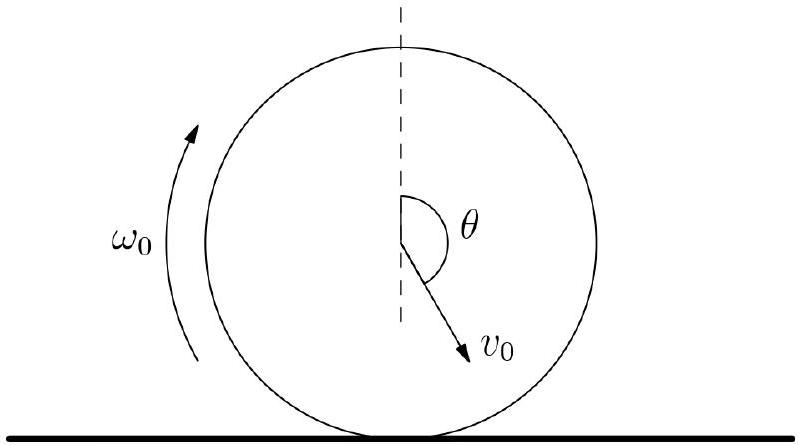
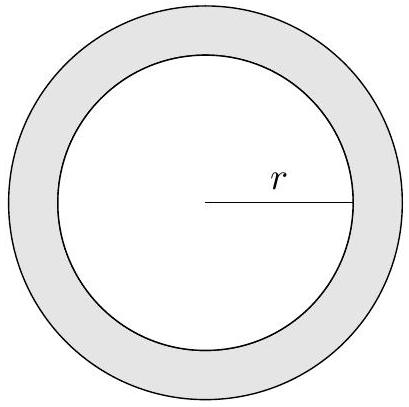
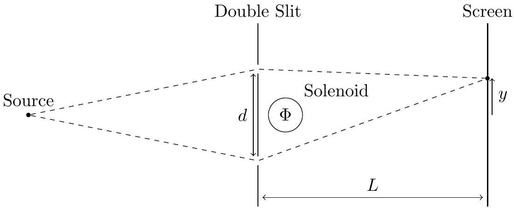
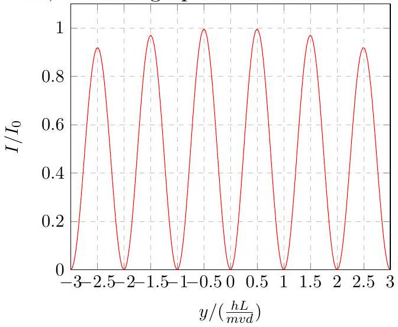
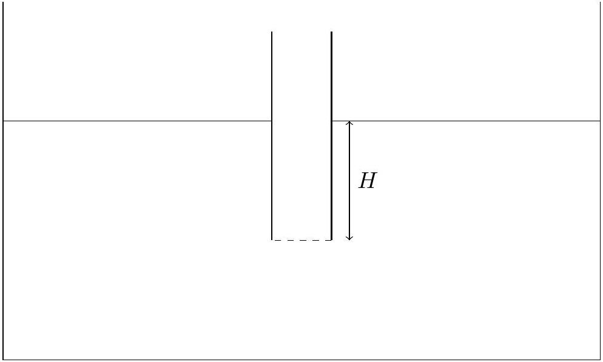
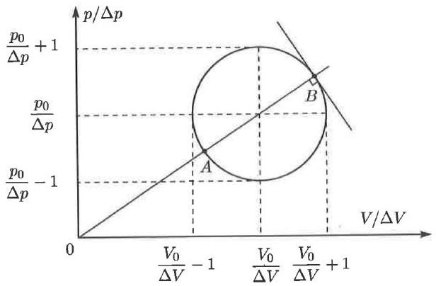
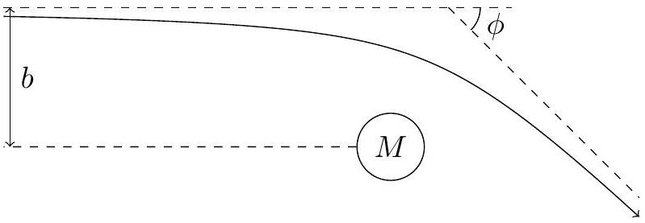

## Sp   Singapore Physics Olympiad Training

## 2024 Selection Test   for the Asian and International Physics Olympiads

a. This is a 4 hour test. Attempt all questions. The maximum total score is 85; marks allocated for each question part are indicated in square brackets.
b. Check that there are a total of 34 printed pages (including this cover page). The last page contains a table of physical constants that you may refer to and use.
c. Begin your answer for each question on a fresh sheet of paper, and present your working and answers clearly. Your answer sheets should be sorted according to the order of the questions.
d. Write your name on the top right hand corner of every answer sheet you submit.
e. Please complete and sign the declaration on page 2, which should be stapled together and submitted with your answer sheets.
f. You may use a standard (non-programmable) scientific calculator in accordance with the statutes of the International Physics Olympiad.
g. No books or documents relevant to the test may be brought into the examination room.

## Declaration

I declare that I will be fully committed to the training for and participation in the Asian Physics Olympiad and/or the International Physics Olympiad if selected. I will check first with the MOE coordinator before taking on additional commitments not listed below.

Potential limitations to my commitment in the period from now to end-July 2024 are described exhaustively in the box below, such as other academic competitions, CCA commitments (school-related or otherwise), travel plans, etc.
□

Name and signature: $\_\_\_\_$

| Question: | 1 | 2 | 3 | 4 | 5 | 6 | 7 | 8 | 9 | Total |
| :--- | :--- | :--- | :--- | :--- | :--- | :--- | :--- | :--- | :--- | :--- |
| Points: | 5 | 5 | 7 | 6 | 20 | 10 | 9 | 10 | 13 | 85 |
| Score: |  |  |  |  |  |  |  |  |  |  |

Total time: 4 hours

1. A thin uniform ring of mass $m$ falls onto a rough floor. The initial velocity of the centre of mass is $v _ { 0 }$, at an angle $\theta$ clockwise from the upwards vertical when it contacts the floor (refer to the diagram). It is also rotating with angular velocity $\omega _ { 0 }$ clockwise. The ground is rough enough so that the ring achieves no-slipping right after it contacts the ground. Denote the coefficient of restitution as $e$ and the gravitational acceleration as $g$.

    (a) Find the velocity of the ring after the first bounce, and its angular velocity.
    (b) Suppose the ring bounces straight up after touching the ground. Find the maximum height reached by the ring.

Solution:

(a) Let the ring have mass $m$, and suppose the impulse it receives from the ground in the horizontal direction is $J$. Let the speed of the centre of the ring after the bounce is $v$, making an angle $\beta$ with the upwards vertical. Also suppose the ring rotates with a final angular velocity of $\omega$.
Using the impulse-momentum theorem in the horizontal direction,
$$
m v \sin \beta - m v _ { 0 } \sin \theta = J .
$$
Using the angular impulse-momentum theorem, the angular impulse received is $- r J$, therefore
$$
m r ^ { 2 } \omega - m r ^ { 2 } \omega _ { 0 } = - r J .
$$
The ring achieves the no-slip condition before it lifts off the ground, therefore
$$
v \sin \beta = r \omega .
$$
Finally, using the coefficient of restitution,
$$
v \cos \beta = - e v _ { 0 } \cos \theta
$$
noting the sign of $\cos \theta$. To eliminate $J$, we can combine the first two equations:
$$
- m v r \sin \beta + m v _ { 0 } r \sin \theta = m r ^ { 2 } \omega - m r ^ { 2 } \omega _ { 0 } .
$$
Therefore,
$$
v _ { 0 } \sin \theta - v \sin \beta = r \left( \omega - \omega _ { 0 } \right)
$$
Substituting in $r \omega = v \sin \beta$, we get
$$
v _ { 0 } \sin \theta = 2 v \sin \beta - r \omega _ { 0 }
$$

Therefore,

$$
v \sin \beta = \frac { 1 } { 2 } \left( v _ { 0 } \sin \theta + r \omega _ { 0 } \right) .
$$

Combining this with $v \cos \beta = - e v _ { 0 } \cos \theta$, we get

$$
\begin{gathered}
v = \sqrt { ( v \sin \beta ) ^ { 2 } + ( v \cos \beta ) ^ { 2 } } = \frac { 1 } { 2 } \sqrt { 4 e ^ { 2 } v _ { 0 } ^ { 2 } \cos ^ { 2 } \theta + \left( v _ { 0 } \sin \theta + r \omega _ { 0 } \right) ^ { 2 } } . \\
\tan \beta = \frac { v \sin \beta } { v \cos \beta } = - \frac { v _ { 0 } \sin \theta + r \omega } { 2 v _ { 0 } \cos \theta } \\
\omega = \frac { v \sin \beta } { r } = \frac { v _ { 0 } \sin \theta + r \omega _ { 0 } } { r \omega } .
\end{gathered}
$$

Mark scheme:

1 - Impulse-Momentum Theorem
1 - COR and No-slip
1 - Final velocity
1 - Final angular velocity
(b) If the ring bounces vertically upwards, then $\beta = 0$, therefore
$$
v _ { 0 } \sin \theta = - r \omega .
$$
The maximum height reached is
$$
h = \frac { v ^ { 2 } } { 2 g } = \frac { e ^ { 2 } v _ { 0 } ^ { 2 } \cos ^ { 2 } \theta } { 2 g } = \frac { e ^ { 2 } \left( v _ { 0 } ^ { 2 } - r \omega _ { 0 } ^ { 2 } \right) } { 2 g } .
$$
Mark scheme:
1 - Correct value of maximum height

2. Two square plates of side length $L$, constructed from an ideal conducting material, are separated by an air gap of $h$. Both plates are parallel to and have the same projection onto the $x y$-plane. The space between them is permeated with a magnetic field $B$ which is parallel to the $x$-axis. A metal rod of mass $m$, length $h$ and resistance $R$ is placed parallel to the $z$-axis at the maximum $y$-position such that it is just touching both plates and allowed to fall from rest until time $T$, when it reaches the minimum $y$-position and loses contact with both plates. Assume that gravity acts in the negative $y$-direction and that the rod remains in contact with both plates for as long as possible.
    (a) Derive the expression for the velocity $v$ of the rod.
    (b) Describe and explain qualitatively the behaviour of the rod after a long time but before time $T$, assuming $T$ is very large.

Solution:

| Marking scheme | marks | comments |
| :--- | :--- | :--- |
| We may calculate the electromotive force $\epsilon$ across the rod, where $\sigma$ is the charge density on each plate: $\epsilon = \left( v B - \frac { \sigma } { \epsilon _ { 0 } } \right) h$ | M0.5 | Correct equation |
| Hence, we get the rate of change of $\sigma$ by calculating $I = \frac { \epsilon } { R }$ and taking $\frac { \mathrm { d } \sigma } { \mathrm { d } t } = \frac { I } { L ^ { 2 } }$ : $\frac { \mathrm { d } \sigma } { \mathrm {~d} t } = \left( v B - \frac { \sigma } { \epsilon _ { 0 } } \right) \frac { h } { R L ^ { 2 } }$ |  |  |
| From $I$, we can calculate $\frac { \mathrm { d } v } { \mathrm {~d} t } = g - \frac { B I h } { m }$ : |  |  |
| $\frac { \mathrm { d } v } { \mathrm {~d} t } = g - \left( v B - \frac { \sigma } { \epsilon _ { 0 } } \right) \frac { B h ^ { 2 } } { m R }$ | M0.5 | Correct equation |
| Rearranging the expression for $\frac { \mathrm { d } v } { \mathrm {~d} t }$, we get: |  |  |
| $\sigma = \epsilon _ { 0 } \left( \frac { m R } { B h ^ { 2 } } \left( \frac { \mathrm {~d} v } { \mathrm {~d} t } - g \right) + v B \right)$ | M0.5 | Correct equation |
| Substituting this into the expression for $\frac { \mathrm { d } \sigma } { \mathrm { d } t }$, we get: |  |  |
| $\frac { m \epsilon _ { 0 } R } { B h ^ { 2 } } \frac { \mathrm {~d} ^ { 2 } v } { \mathrm {~d} t ^ { 2 } } + \left( \epsilon _ { 0 } B + \frac { m } { B L ^ { 2 } h } \right) \frac { \mathrm { d } v } { \mathrm {~d} t } = \frac { m g } { B L ^ { 2 } h }$ | M0.5 | Correct equation |
| This is a first order differential equation in $\frac { d v } { d t }$. Solving and integrating the expression: | M1 | Correct expression for $\frac { d v } { d t }$ |
| $v = \frac { m g \epsilon _ { 0 } ^ { 2 } B ^ { 2 } L ^ { 4 } R } { \left( m + \epsilon _ { 0 } B ^ { 2 } h L ^ { 2 } \right) ^ { 2 } } \left( 1 - e ^ { - \frac { h } { m L ^ { 2 } \epsilon _ { 0 } R } \left( m + \epsilon _ { 0 } B ^ { 2 } h L ^ { 2 } \right) t } \right) + \frac { m } { m + \epsilon _ { 0 } B ^ { 2 } h L ^ { 2 } } g t$ |  |  |

As $t \rightarrow \infty$, the acceleration of the rod approaches a constant value which is less than $g$ due to the resistance from continued current flow through the rod, which also approaches a constant value. (No credit should be given for answers which cite formulae without analysis.)

3. Consider a magnetic monopole at the origin emitting a magnetic field $\mathbf { B } ( \mathbf { r } ) = \frac { \mu } { r ^ { 3 } } \mathbf { r }$. The monopole is fixed. An electron of charge $e = - 1.6 \times 10 ^ { - 19 } \mathrm { C }$ and mass m is at position r, moving with velocity $v$. In addition there is an arbitrary radially symmetric potential field $U ( \mathbf { r } ) = U ( r )$ acting on the electron, this is generally to ensure that the electron's path would be bounded. (Hint: $U ( r )$ should not appear in your answers for b) to f))
    (a) Write down the equation of motion for the electron. (Hint: write the equation out in the vector form)
    (b) By considering the rate of change of orbital angular momentum $\mathbf { L }$ and the quantity $\mathbf { S } = - e \mu \frac { \mathbf { r } } { r }$

Prove that the quantity $\mathbf { J } = \mathbf { L } + \mathbf { S }$ is conserved. This can be interpreted as "total" angular momentum, and $\mathbf { S }$ can be interpreted as a spin angular momentum associated with the energy field of the system.

(c) By considering the component of total angular momentum $\mathbf { J }$ in the radial direction $\hat { r } = \frac { \mathbf { r } } { r }$, show that the angle between the two vectors are constant. Hence describe the surface that the path of the electron must lie on, and sketch some possible paths.

Solution:
Marking scheme

a) Newton's second law,
$$
m \ddot { \mathbf { r } } = - \nabla U + e \dot { \mathbf { r } } \times \mathbf { B }
$$
Plugging in the definition of B,
$$
m \ddot { \mathbf { r } } = - \nabla U + \frac { e \mu } { r ^ { 3 } } \dot { \mathbf { r } } \times \mathbf { r }
$$
Total:
Total:
b) Definition of Orbital angular momentum:
$$
\mathbf { L } = m \mathbf { r } \times \dot { \mathbf { r } }
$$
Rate of change of $\mathbf { L }$ :
$$
\frac { d \mathbf { L } } { d t } = m \dot { \mathbf { r } } \times \dot { \mathbf { r } } + m \mathbf { r } \times \ddot { \mathbf { r } } = m \mathbf { r } \times \ddot { \mathbf { r } }
$$
The form inspires us to take $\mathbf { r } \times$ the equation of motion.
$$
\begin{gathered}
m \ddot { \mathbf { r } } = - \nabla U + \frac { e \mu } { r ^ { 3 } } \dot { \mathbf { r } } \times \mathbf { r } \\
m \mathbf { r } \times \ddot { \mathbf { r } } = - \mathbf { r } \times \nabla U + \frac { e \mu } { r ^ { 3 } } \mathbf { r } \times ( \dot { \mathbf { r } } \times \mathbf { r } )
\end{gathered}
$$
For a spherically symmetric potential U, the gradient $\nabla U$ is radial, hence $\mathbf { r } \times \nabla U = 0$. In other words, a central force exerts no torque and hence does not cause change in angular momentum.
Double cross product formula:
$$
\begin{gathered}
\mathbf { r } \times ( \dot { \mathbf { r } } \times \mathbf { r } ) = \dot { \mathbf { r } } ( \mathbf { r } \cdot \mathbf { r } ) - \mathbf { r } ( \mathbf { r } \cdot \dot { \mathbf { r } } ) \\
\frac { d \mathbf { L } } { d t } = \frac { e \mu } { r ^ { 3 } } \left( \dot { \mathbf { r } } r ^ { 2 } - \mathbf { r } ( \mathbf { r } \cdot \dot { \mathbf { r } } ) \right)
\end{gathered}
$$
Now for
$$
\begin{gathered}
\mathbf { S } = - e \mu \frac { \mathbf { r } } { r } \\
\frac { d \mathbf { S } } { d t } = - e \mu \left( \frac { \dot { \mathbf { r } } } { r } - \frac { \mathbf { r } ( \mathbf { r } \cdot \dot { \mathbf { r } } ) } { r ^ { 3 } } \right)
\end{gathered}
$$
Hence for $\mathbf { J } = \mathbf { L } + \mathbf { S }$,
$$
\frac { d \mathbf { J } } { d t } = \frac { d \mathbf { L } } { d t } + \frac { d \mathbf { S } } { d t } = 0
$$

marks comments

M1 ther)
M1 Differentiate
M1 torque discussion
M1 or equivalent
M1 Full expression for $\frac { d S } { d t }$ or equivalent

Solution:

|  | marks | comments |
| :--- | :--- | :--- |
| c) Let the angle between $\mathbf { J }$ and $\hat { \mathbf { r } }$ be $\theta$. Then $\mathbf { J } \cdot \hat { \mathbf { r } } = J \cos \theta$ |  |  |
| Meanwhile, $\mathbf { L } \cdot \hat { \mathbf { r } } = 0$ due to the cross product in the definition of $\mathbf { L }$. Hence, $\mathbf { J } \cdot \hat { \mathbf { r } } = ( \mathbf { L } + \mathbf { S } ) \cdot \hat { \mathbf { r } } = \mathbf { S } \cdot \hat { \mathbf { r } } = - e \mu$ |  |  |
|  |  |  |
| Note: any path sketched on the cone is acceptable since the confining potential U(r) is not specified. |  |  |

4. A mass is attached to the end of a massless rod of length $l$, which is then raised to nearvertical then released. Let the angle between the rod and the vertical be $\epsilon \ll 1$.
    (a) For motion between $\epsilon \ll \theta _ { 0 } \ll 1$, find the equation of motion of the pendulum. Hence, find the time taken to reach $\theta _ { 0 }$, and the angular velocity when it reaches $\theta _ { 0 }$.
    (b) By considering the motion of the pendulum past $\theta _ { 0 }$, justify that the period of the pendulum $T$ tends to $4 \sqrt { \frac { l } { g } } \ln \frac { 1 } { \epsilon }$ as $\epsilon \rightarrow 0$

Solution:

Marking scheme
Writing the torques acting on the pendulum and with $\theta \ll 1$, we have

$$
m l ^ { 2 } \ddot { \theta } = m g l \theta
$$

Solving the DE with the boundary conditions $\theta ( t =$ $0 ) = \epsilon , \dot { \theta } ( t = 0 ) = 0$, we obtain

$$
\theta = \frac { \epsilon } { 2 } \left( e ^ { \Omega t } + e ^ { - \Omega t } \right) = \epsilon \cosh \Omega t \left( \Omega = \sqrt { \frac { g } { l } } \right)
$$

At $\theta _ { 0 } \gg \epsilon$, we obtain

$$
\theta \approx \frac { \epsilon } { 2 } e ^ { \Omega t } \Rightarrow t _ { 0 } \approx \frac { 1 } { \Omega } \ln \frac { 2 \theta _ { 0 } } { \epsilon } \approx \frac { 1 } { \Omega } \ln \frac { \theta _ { 0 } } { \epsilon }
$$

It is possible to obtain the velocity by differentiating, but it is easier to take an energy approach. We have

$$
m g l \cos \epsilon = m g l \cos \theta _ { 0 } + \frac { 1 } { 2 } m l ^ { 2 } \dot { \theta } ^ { 2 }
$$

Solving for $\dot { \theta }$, we obtain

$$
\dot { \theta } \left( \theta = \theta _ { 0 } \right) = \Omega \sqrt { \theta _ { 0 } ^ { 2 } - \epsilon ^ { 2 } } \approx \Omega \theta _ { 0 }
$$

Now, the upper limit of the time taken to move through $\theta = \theta _ { 0 }$ to $\theta = \pi$ is

$$
t _ { 1 } \leq \frac { \pi } { \Omega \theta _ { 0 } }
$$

This is a constant independent of $\epsilon$, so as $\epsilon \rightarrow 0 , t _ { 0 } \gg$ $t _ { 1 }$.
Using $\epsilon \ll \theta _ { 0 }$, the period in the limit is then

$$
T = 4 \left( t _ { 0 } + t _ { 1 } \right) = 4 t _ { 0 } = \frac { 4 } { \Omega } \ln \frac { 1 } { \epsilon }
$$

Total:
marks comments

Correct equation of motion

M1

A1

Correct equation Give accordingly if alternative method is used

Correct equation Other methods must have correct coefficient

Explanation must quantitatively show that the period is dominated by the first part of the motion in the limit

A1

6

5. The 1997 Nobel Prize in Physics was awarded to Steven Chu, Claude Cohen-Tannoudji and William D. Phillips for development of methods to cool and trap atoms with laser light. The laser light cools the particles down to the $\mu \mathrm { K }$ temperature range, allowing particles to move at speeds less than 1 km/h. At these speeds, scientists can study individual atoms with great accuracy, opening the gateway to a deeper understanding of the properties of gases at low temperatures.
In this problem, you will be analysing the basics of laser cooling and a method of cooling using the Doppler effect.
Part A: Radiation Pressure
An atom can be represented as an electron of charge $q$ and mass $m$ attached to a spring with spring constant $m \omega _ { 0 } ^ { 2 }$, experiencing a damping force proportional to its speed with proportionality constant $m \gamma$. It is driven by an electromagnetic field $E = E _ { 0 } \cos \omega t$, whose frequency is very close to the resonant frequency of the atom: defining the detuning $\Delta =$ $\omega - \omega _ { 0 }$, we may write $| \Delta | \ll \omega$. Also assume that $\gamma \ll \omega$.
    (a) Write down the differential equation satisfied by the displacement $x ( t )$ of the electron from its equilibrium position. Hence, find $x _ { 0 }$ and $\phi$ in terms of $q , m , \Delta , \gamma , E _ { 0 }$, and $\omega _ { 0 }$.
    (b) Find the average power $\langle P \rangle$ absorbed over one cycle of the electromagnetic field, expressing your answer in terms of $q , m , \gamma , E _ { 0 }$ and $\Delta$.
The saturation intensity $I _ { s }$ is the intensity of the laser beam which causes the atom to spend one-quarter of its time in the excited state, and it is a quantity which appears widely in literature on laser cooling:
$$
I _ { s } = \frac { \varepsilon _ { 0 } m c \gamma ^ { 2 } \hbar \omega } { q ^ { 2 } } .
$$
    (c) Show that the average rate $R$ at which photons are absorbed by an atom is $R = \frac { I / I _ { s } } { 1 + 4 \Delta ^ { 2 } / \gamma ^ { 2 } } \gamma$
    (d) Find an expression for the force on an atom due to resonant absorption.

Part B: Doppler Cooling
For gases to reach low temperatures, their atoms must achieve low velocities as well. This damping mechanism is different from the radiation damping $\gamma$ described earlier, and relies on the Doppler effect on an atom's interaction with its surrounding electromagnetic field.
Consider the case where the atom is moving in one dimension $( x )$, and the electromagnetic field is propagating in the $+ x$-direction with angular frequency $\omega$.

(e) Write down the angular frequency $\omega ^ { \prime }$ the particle sees the field oscillating at while it is moving at velocity $v$. Show that for $v \ll c$, the Doppler shift $\delta \omega _ { D } = \omega ^ { \prime } - \omega$ can be expressed as $- k v$, where $k$ is the wave number of the electromagnetic wave.

This means that when you calculate the force, you can take into account the Doppler effect by replacing $\Delta$ with $\Delta + \delta \omega _ { D }$.
It is clear that when an atom travels into an incoming laser beam, it will slow down. However, if the radiative forces continue to act, it will accelerate in the opposite direction. We want the atom to experience no further force after coming to a stop. This will be possible if we illuminate the atom with two identical laser beams propagating in opposite directions.

(f) Calculate the net force $F$ on an atom moving with velocity $v$. Express your answer in terms of quantities defined earlier. Furthermore, show that in the low-velocity limit $( k v \ll | \Delta |$ and $\gamma )$, the net force $F$ can be written as $F = - \alpha v$, where $\alpha$ is to be determined.

Part C: Heating Due to Photon Recoil
The damping force causes the atom to slow down. However, there is another heating mechanism - the atom absorbs a photon from the electromagnetic field, making a transition from the ground state to the excited state. The excited state is not stable, so the atom returns to the ground state by emitting a photon in a random direction (+ or - in one dimension). In both instances, momentum is not transferred to the atom in a continuous manner, but rather in units of $\hbar k$.
This quantized gains and losses of energy causes the momentum of the atom to take the path of a random walk. In a given time interval, the number of steps is the number of photons absorbed and emitted. Take the probability of absorption of a photon from either beam to be equally likely. Thus, each absorption and emission results in two steps of the random walk. In a time interval $d t$, the atom executes $d N = 2 R _ { \text {tot } } d t$ steps, where $R _ { \text {tot } } = R _ { + } + R _ { - }$ is the total absorption rate from the two beams.
For this one-dimensional walk, the average momentum remains zero, but the RMS momentum equals the square root of the number of steps times the step size:

$$
\sqrt { \left\langle p ^ { 2 } \right\rangle } = \sqrt { N } \hbar k .
$$

(g) Calculate the rate at which the atom's energy increases due to the heating.
(h) Find the equilibrium temperature $T$ associated with this atomic motion.
(i) Determine the resulting minimum temperature $T _ { \text {min } }$ and the corresponding $\Delta$ when this is achieved.

Solution:

a. The electron experiences a spring force $- m \omega _ { 0 } ^ { 2 } x$, a drag force $- m \gamma \dot { x }$ and a driving force $q E _ { 0 } \cos \omega t$. Therefore, Newton's 2nd Law can be written as
$$
\ddot { x } + \gamma \dot { x } + \omega _ { 0 } ^ { 2 } x = \frac { q } { m } E _ { 0 } \cos \omega t .
$$
Now substitute in the solution $x ( t ) = x _ { 0 } \cos ( \omega t - \phi )$ to obtain
$$
- \omega ^ { 2 } x _ { 0 } \cos ( \omega t - \phi ) - \gamma \omega x _ { 0 } \sin ( \omega t - \phi ) + \omega _ { 0 } ^ { 2 } x _ { 0 } \cos ( \omega t - \phi ) = \frac { q } { m } E _ { 0 } \cos \omega t
$$
Simplifying and expanding,
$$
\begin{aligned}
& - \left( \omega ^ { 2 } - \omega _ { 0 } ^ { 2 } \right) x _ { 0 } \cos \omega t \cos \phi + \left( \omega ^ { 2 } - \omega _ { 0 } ^ { 2 } \right) x _ { 0 } \sin \omega t \sin \phi \\
& \quad - \gamma \omega x _ { 0 } \sin \omega t \cos \phi - \gamma \omega x _ { 0 } \cos \omega t \sin \phi \\
& \quad = \frac { q } { m } E _ { 0 } \cos \omega t .
\end{aligned}
$$
Comparing coefficients, the $\cos \omega t$ and $\sin \omega t$ terms give
$$
\begin{aligned}
& x _ { 0 } \left[ \left( \omega ^ { 2 } - \omega _ { 0 } ^ { 2 } \right) \cos \phi + \gamma \omega \sin \phi \right] = \frac { q } { m } E _ { 0 } \\
& x _ { 0 } \left[ \left( \omega ^ { 2 } - \omega _ { 0 } ^ { 2 } \right) \sin \phi - \gamma \omega \cos \phi \right] = 0
\end{aligned}
$$

Squaring both equations and adding,

$$
x _ { 0 } ^ { 2 } \left[ \left( \omega ^ { 2 } - \omega _ { 0 } \right) ^ { 2 } \cos \phi + \gamma ^ { 2 } \omega ^ { 2 } \right] = \left( \frac { q } { m } E _ { 0 } \right) ^ { 2 } .
$$

Therefore,

$$
x _ { 0 } = \frac { \frac { q } { m } E _ { 0 } } { \sqrt { \left( \omega ^ { 2 } - \omega _ { 0 } ^ { 2 } \right) ^ { 2 } + \gamma ^ { 2 } \omega ^ { 2 } } } \approx \frac { \frac { q } { m } E _ { 0 } } { \sqrt { ( 2 \Delta \omega ) ^ { 2 } + \gamma ^ { 2 } \omega ^ { 2 } } } = \frac { \frac { q } { m } E _ { 0 } } { 2 \omega \sqrt { \Delta ^ { 2 } + \frac { \gamma ^ { 2 } } { 4 } } }
$$

Solving the second equation yields

$$
\tan \phi = \frac { \gamma \omega } { \omega ^ { 2 } - \omega _ { 0 } ^ { 2 } } \approx - \frac { \gamma \omega } { 2 \omega \Delta } = - \frac { \gamma } { 2 \Delta } .
$$

Mark scheme:

1 - Newton's 2nd Law
1 - Correct equations to compare coefficients
1 - Correct $x _ { 0 }$
1 - Correct $\phi$

b. The power absorbed is

$$
\begin{aligned}
P & = F v = q E _ { 0 } \cos \omega t \cdot \left( - \omega x _ { 0 } \sin ( \omega t - \phi ) \right) \\
& = - q E _ { 0 } \omega x _ { 0 } \left( \cos \omega t \sin \omega t \cos \phi - \cos ^ { 2 } \omega t \sin \phi \right) .
\end{aligned}
$$

Averaging $P$ over one cycle, we note that $\langle \sin \omega t \rangle = 0$ while $\left\langle \cos ^ { 2 } \omega t \right\rangle = \frac { 1 } { 2 }$, thus

$$
\langle P \rangle = \frac { 1 } { 2 } q E _ { 0 } \omega x _ { 0 } \sin \phi .
$$

Therefore,

$$
\langle P \rangle = \frac { m \gamma \omega ^ { 2 } \frac { q ^ { 2 } } { m ^ { 2 } } E _ { 0 } ^ { 2 } } { 2 \omega _ { 0 } ^ { 2 } \left( 4 \Delta ^ { 2 } + \gamma ^ { 2 } \right) } \approx \frac { q ^ { 2 } } { 2 m } \frac { \gamma } { 4 \Delta ^ { 2 } + \gamma ^ { 2 } } E _ { 0 } ^ { 2 } .
$$

Mark scheme:

1 - Writing down expression for power in terms of trigonometric functions
1 - Correct final answer
c. The rate at which photons are absorbed is the power absorbed divided by the energy carried per photon. We know that the energy carried per photon is $\frac { h c } { \lambda } =$ $\frac { h \omega } { 2 \pi } = \hbar \omega$, thus the rate at which photons are absorbed is
$$
R = \left( \frac { q ^ { 2 } } { 2 m } \frac { \gamma } { 4 \Delta ^ { 2 } + \gamma ^ { 2 } } E _ { 0 } ^ { 2 } \right) \cdot \frac { 1 } { \hbar \omega } .
$$
Since $I = \frac { 1 } { 2 } c \varepsilon _ { 0 } E ^ { 2 }$, we have
$$
\frac { I } { I _ { s } } = \frac { q ^ { 2 } E _ { 0 } ^ { 2 } } { 2 m \hbar \omega \gamma ^ { 2 } } .
$$
Therefore,
$$
R = \frac { I / I _ { s } } { 1 + 4 \Delta ^ { 2 } / \gamma ^ { 2 } } \gamma
$$

Mark scheme:

0.5 - Rate at which photons are absorbed
0.5 - Correct expression for $I$
d. The force is given by multiplying the rate $R$ by the momentum per photon given by $p = \frac { \hbar \omega } { c }$ :
$$
F = \frac { I / I _ { s } } { 1 + 4 \Delta ^ { 2 } / \gamma ^ { 2 } } \frac { \hbar \omega \gamma } { c } .
$$
1 - Final answer

e. The Doppler effect causes the particle to see the field oscillating with angular velocity

$$
\omega ^ { \prime } = \omega \sqrt { \frac { c - v } { c + v } } .
$$

Performing binomial expansion, we have

$$
\left( 1 - \frac { v } { c } \right) ^ { 1 / 2 } \approx 1 - \frac { v } { 2 c } , \quad \left( 1 + \frac { v } { c } \right) ^ { - 1 / 2 } \approx 1 - \frac { v } { 2 c } .
$$

Multiplying the two quantities together,

$$
\omega ^ { \prime } = \omega \left( 1 - \frac { v } { c } \right) \Rightarrow \delta \omega _ { D } = - \frac { v \omega } { c } = - k v .
$$

Mark scheme:

1 - Correct Doppler effect expression
1 - Correct binomial expansion
f. The forces from the + and - beams can be written as
$$
F _ { \pm } = \pm \frac { R _ { \pm } \hbar \omega } { c } = \pm R _ { \pm } \hbar k .
$$
Since
$$
R _ { \pm } = \frac { I / I _ { s } } { 1 + 4 ( \Delta \mp k v ) ^ { 2 } / \gamma ^ { 2 } } ,
$$
the net force is
$$
F = F _ { + } + F _ { - } = \frac { I } { I _ { s } } \hbar k \gamma \left( \frac { 1 } { 1 + \frac { 4 ( \Delta - k v ) ^ { 2 } } { \gamma ^ { 2 } } } - \frac { 1 } { 1 + \frac { 4 ( \Delta + k v ) ^ { 2 } } { \gamma ^ { 2 } } } \right) .
$$
For low velocities, binomial expansion of the denominators yields
$$
\begin{aligned}
\frac { 1 } { 1 + \frac { 4 ( \Delta \mp k v ) ^ { 2 } } { \gamma ^ { 2 } } } & \approx \frac { 1 } { 1 + \frac { 4 \Delta ^ { 2 } \mp 8 \Delta k v } { \gamma ^ { 2 } } } \\
& = \frac { \gamma ^ { 2 } } { \gamma ^ { 2 } + 4 \Delta ^ { 2 } \mp 8 \Delta k v } \\
& = \frac { \gamma ^ { 2 } } { \left( \gamma ^ { 2 } + 4 \Delta ^ { 2 } \right) \left( 1 \mp \frac { 8 \Delta k v } { \gamma ^ { 2 } + 4 \Delta ^ { 2 } } \right) } \\
& \approx \frac { \gamma ^ { 2 } } { \gamma ^ { 2 } + 4 \Delta ^ { 2 } } \left( 1 \pm \frac { 8 \Delta k v } { \gamma ^ { 2 } + 4 \Delta ^ { 2 } } \right)
\end{aligned}
$$

Thus,

$$
F \approx 16 \frac { I } { I _ { s } } \frac { \hbar k ^ { 2 } \gamma ^ { 3 } \Delta v } { \left( \gamma ^ { 2 } + 4 \Delta ^ { 2 } \right) ^ { 2 } }
$$

Mark scheme:

1 - Correctly writing down $R _ { \pm }$
1 - Net force
1 - Correct final answer
g. For small $v$,
$$
\frac { d \left\langle p ^ { 2 } \right\rangle } { d t } = \frac { d N } { d t } ( \hbar k ) ^ { 2 } = 2 R _ { t o t } ( \hbar k ) ^ { 2 } = \frac { 4 I / I _ { s } } { 1 + 4 \Delta ^ { 2 } / \gamma ^ { 2 } } \gamma ( \hbar k ) ^ { 2 }
$$
Therefore,
$$
\frac { d E } { d t } = \frac { 1 } { 2 m } \frac { d \left\langle p ^ { 2 } \right\rangle } { d t } = \frac { ( \hbar k ) ^ { 2 } } { m } \frac { 2 I / I _ { s } } { 1 + 4 \Delta ^ { 2 } / \gamma ^ { 2 } } \gamma .
$$
Mark scheme:
1 - Correct $\frac { d \left\langle p ^ { 2 } \right\rangle } { d t }$
1 - Correct final answer

h. First we compute $\frac { d E } { d t }$ due to cooling.

$$
\frac { d E } { d t } = \frac { d } { d t } \left( \frac { 1 } { 2 } m v ^ { 2 } \right) = m v \frac { d v } { d t } = F v = - \alpha v ^ { 2 } = - \frac { 2 \alpha } { m } E .
$$

Therefore,

$$
\frac { ( \hbar k ) ^ { 2 } } { m } \frac { 2 I / I _ { s } } { 1 + 4 \Delta ^ { 2 } / \gamma ^ { 2 } } \gamma = \frac { 2 \alpha } { m } E .
$$

After substituting in the expression for $\alpha$, we have

$$
E = - \frac { \hbar \left( \gamma ^ { 2 } + 4 \Delta ^ { 2 } \right) } { 8 \Delta } .
$$

Applying the equipartition theorem, each degree of freedom contributes an energy $k _ { B } T / 2$. Thus, the equilibrium temperature is

$$
T = - \frac { \hbar \left( \gamma ^ { 2 } + 4 \Delta ^ { 2 } \right) } { 4 \Delta k _ { B } } .
$$

Mark scheme:

1 - Finding $\frac { d E } { d t }$ due to cooling and solving for $E$
1 - Applying equipartition theorem
1 - Correct equilibrium temperature
i. Note that
$$
T = \frac { \hbar \gamma } { 2 k _ { B } } \left( \frac { \gamma } { 2 ( - \Delta ) } + \frac { 2 ( - \Delta ) } { \gamma } \right) \geq \frac { \hbar \gamma } { k _ { B } } .
$$
Equality holds when $\frac { \gamma } { 2 ( - \Delta ) } = \frac { 2 ( - \Delta ) } { \gamma }$, or $\Delta = - \frac { \gamma } { 2 }$.
Mark scheme:
1 - Finding $\Delta = - \frac { \gamma } { 2 }$
1 - Correct $T _ { \text {min } }$

For a comprehensive discussion, see: Gould, P. (1997). Laser cooling of atoms to the Doppler limit. American Journal of Physics, 65(11), 1120-1123. https://doi.org/ 10.1119/1.18740

6. An electron is confined to move along the circumference of a thin ring with radius $r$.
(a) Find the allowed values of its kinetic energy, giving your answer in terms of the electron mass $m$ and Planck's constant $h$.

The ring is now placed in a constant (but not necessarily uniform) magnetic field directed into the page, such that the magnetic flux through the ring is $\Phi$.

Figure 1: Illustration of the ring.

(b) By considering the energy contribution from the current of the moving charge, show that the total energy of the system (up to an additive constant) is given by
$$
E = \frac { p _ { \mathrm { eff } } ^ { 2 } } { 2 m } = \frac { 1 } { 2 m } \left( p + \frac { e \Phi } { 2 \pi r } \right) ^ { 2 }
$$
where $p$ is the electron's momentum (treating anticlockwise as positive) and $- e$ is the charge of the electron.
(c) Treating $p _ { \text {eff } }$ as the total effective momentum of the electron's quantum wave, find the magnitude and direction of the current flowing in the ring in the ground state(s) and first excited state(s) of the electron's kinetic energy when $\Phi = \frac { h } { 2 e }$.

A typical electron double-slit experiment is set up as shown in the diagram below, with a solenoid placed just behind the two slits. The width of each slit is small but finite. The velocity of the electron beam is $v$, the distance between the slits is $d$, and the distance from the slits to the screen is $L \gg d$. The magnetic field of the solenoid is directed into the page, and the total magnetic flux through the solenoid is $\Phi = \frac { N h } { 2 e }$, where $N$ is the number of coils in the solenoid.

Figure 2: Illustration of the electron double-slit experiment.

(d) Sketch the intensity of electrons detected as a function of the vertical position $y$ along the screen. Include the distance between extrema in the sketch.

Solution:
Marking scheme
Similar to the typical wave-in-a-box setting, the electron can be treated as a standing wave, with wavelength given by the de Broglie wavelength.

$$
\lambda = \frac { h } { p }
$$

The boundary condition on the ring is then that the circumference of the ring must be an integer multiple of the wavelength, in order for standing waves to form.

$$
2 \pi r = n \lambda
$$

Hence, $E = \frac { p ^ { 2 } } { 2 m } = \frac { n ^ { 2 } h ^ { 2 } } { 8 \pi ^ { 2 } m r ^ { 2 } }$.
Total:

| marks | comments |
| :--- | :--- |
| M0.2 | Correct equation |
| M0.5 | Correct equation |
| A0.3 | Correct answer |
| 1.0 |  |

Solution:
Marking scheme
The magnitude of the current due to the electron is given by its charge over its period of motion:

$$
I = \frac { e } { T } = \frac { e v } { 2 \pi r } = \frac { e p } { 2 \pi m r }
$$

From inductors, the energy required to add a current $\mathrm { d } I$ to a loop with magnetic flux $\Phi$ is $\mathrm { d } E = \Phi \mathrm { d } I$. Hence, the additional energy due to the current is

$$
| \Delta E | = \int _ { 0 } ^ { I } \Phi \mathrm {~d} I = \Phi I
$$

[Note: The expression $U = - \vec { \mu } \cdot \vec { B }$ for potential energy of an ideal dipole in a uniform external field gives the same answer. Credit should only be provided if the student considers each infinitesimal dipole and local magnetic field and explicitly show that it reduces to the expression for the flux.]

The sign of the additional energy can be deduced to be positive by noting that when the momentum is positive (anticlockwise), the current is clockwise, which produces a B field aligned with the external field, thereby increasing the stored magnetic energy.

Thus, $E = \frac { p ^ { 2 } } { 2 m } + \frac { e \Phi } { 2 \pi m r } p = \frac { 1 } { 2 m } \left( p + \frac { e \Phi } { 2 \pi r } \right) ^ { 2 } +$ const.
Total:

| marks | comments |
| :--- | :--- |
| M1 | Correct equation |
| M1 | Correct equation |
| A0.5 | Correct answer |
| 2.0 |  |

Solution:
Marking scheme
With $p _ { \text {eff } }$ as the new momentum of the quantum wave, the de Broglie wavelength is now

$$
\lambda = \frac { h } { p _ { \mathrm { eff } } } = \frac { h } { p + \frac { e \Phi } { 2 \pi r } }
$$

Applying the same condition $2 \pi r = n \lambda$ as part (a), the quantised momentum is now

$$
p = \frac { n h - e \Phi } { 2 \pi r } = \frac { h } { 2 \pi r } \left( n - \frac { 1 } { 2 } \right)
$$

The kinetic energy and current are then given by

$$
\begin{gathered}
\mathrm { KE } = \frac { p ^ { 2 } } { 2 m } = \frac { h ^ { 2 } } { 8 \pi ^ { 2 } m r ^ { 2 } } \left( n - \frac { 1 } { 2 } \right) ^ { 2 } \\
I = - \frac { e p } { 2 \pi m r } = - \frac { e h } { 4 \pi ^ { 2 } m r ^ { 2 } } \left( n - \frac { 1 } { 2 } \right)
\end{gathered}
$$

It follows that the ground states of KE occur when $n = 0 , + 1$ and the first excited states occur when $n =$ $- 1 , + 2$. This corresponds to a current of

$$
I = \begin{cases} \pm \frac { e h } { 8 \pi ^ { 2 } m r ^ { 2 } } , & n = 0 , + 1 \\ \pm \frac { 3 e h } { 8 \pi ^ { 2 } m r ^ { 2 } } , & n = - 1 , + 2 \end{cases}
$$

Total:

| marks | comments |
| :--- | :--- |
| M0.4 | Correct equation |
| M0.4 | Correct equation |
| A1.2 | 0.3 per correct answer |
| 2.0 |  |

Solution:

Marking scheme
The key idea here is to consider the closed loop formed by a pair of electrons going through either slit and interfering at the same point on the screen (shown in Figure 2). The result from (b) can be generalised to a loop of arbitrary shape,

$$
p _ { \mathrm { eff } } = p \pm \frac { e \Phi } { L _ { \mathrm { loop } } }
$$

The sign in $p _ { \text {eff } }$ changes between the top and bottom paths (clockwise and anticlockwise respectively). This gives a phase difference between both paths of

$$
\begin{aligned}
\phi _ { \mathrm { top } } & = \frac { 2 \pi p _ { \mathrm { eff } } } { h } L _ { \mathrm { top } } = \frac { 2 \pi } { h } L _ { \mathrm { top } } \left( p - \frac { e \Phi } { L _ { \mathrm { loop } } } \right) \\
\phi _ { \mathrm { bot } } & = \frac { 2 \pi p _ { \mathrm { eff } } } { h } L _ { \mathrm { bot } } = \frac { 2 \pi } { h } L _ { \mathrm { bot } } \left( p + \frac { e \Phi } { L _ { \mathrm { loop } } } \right) \\
\therefore ( \Delta \phi ) _ { \mathrm { t } - \mathrm { b } } & = \frac { 2 \pi p } { h } ( \Delta L ) _ { \mathrm { t } - \mathrm { b } } - \frac { 2 \pi e } { h } \Phi
\end{aligned}
$$

The first term is exactly the same as regular doubleslit diffraction. The flux through the loop is $1 / N$ times the total flux through the solenoid, $\Phi = \frac { h } { 2 e }$, hence the second term is exactly $- \pi$; the electron passing through the bottom slit obtains a relative phase shift of $+ \pi$, which translates the diffraction pattern down by half a period.

$$
\begin{aligned}
d \sin \theta & = \left( n - \frac { 1 } { 2 } \right) \lambda \\
y _ { \operatorname { maxima } } & \approx \frac { h L } { m v d } \left( n - \frac { 1 } { 2 } \right)
\end{aligned}
$$

Finally, since the slits have finite width, there is a large single-slit decay envelope centered about the origin. Thus, the final graph should look like:

marks comments

M1

Correctly identifying that the bottom slit has additional phase $+ \pi$ and hence $y = 0$ is a minima

1 - Distance between
A2 maxima
$1 - \operatorname { sinc } ^ { 2 } y$ envelope about origin

7. A straw with its bottom end covered is placed in a large tank of water such that its bottom end is $H$ below the surface of the water. At $t = 0$ the barrier (dashed) vanishes.

    (a) Use Bernoulli's principle to find the total time it takes for the water to reach the surface level inside the tube. Explain why this value may be inaccurate.
    (b) The Navier-Stokes equation (1) can be used to obtain a more accurate solution.
$$
\begin{equation*}
\frac { \partial \overrightarrow { \mathbf { u } } } { \partial t } + ( \overrightarrow { \mathbf { u } } \cdot \nabla ) \overrightarrow { \mathbf { u } } = - \frac { \nabla P } { \rho } + \overrightarrow { \mathbf { g } } \tag{1}
\end{equation*}
$$
Assuming irrotational flow such that $\overrightarrow { \mathbf { u } } = \nabla \phi ( x , y , z , t )$. Show that the equation reduces to (2) where $C$ is a constant. (Hint: You may want to use the fact that $\overrightarrow { \mathbf { A } } \times ( \nabla \times \overrightarrow { \mathbf { A } } ) =$ $\frac { 1 } { 2 } \nabla A ^ { 2 } - ( \overrightarrow { \mathbf { A } } \cdot \nabla ) \overrightarrow { \mathbf { A } }$ for any vector field $\overrightarrow { \mathbf { A } }$.)
$$
\begin{equation*}
\frac { \partial \phi } { \partial t } + \frac { u ^ { 2 } } { 2 } + \frac { P } { \rho } + g z = C \tag{2}
\end{equation*}
$$
    (c) Find the function $\phi$ for the region inside the straw in terms of velocity of the water surface at the top of the straw and $z$ (the vertical distance from the bottom of the straw). Explain how you arrived at the answer.
(d) Using (2) determine the maximum height that the water can reach above the surrounding water level outside the straw. (Hint: The substitution $r = \frac { v _ { z } ^ { 2 } } { 2 }$ may be useful)

Solution:
Marking scheme

(a) Consider a point on the surface of the water and a point at the top of the water inside the straw why it is y above the bottom of the straw. The equation becomes
$$
\frac { 1 } { 2 } \rho v ^ { 2 } = \rho g ( H - y )
$$
Which gives us
$$
\frac { \mathrm { d } y } { \mathrm {~d} t } = \sqrt { 2 g ( H - y ) }
$$
$$
\int _ { 0 } ^ { H } \frac { d y } { \sqrt { 2 g ( H - y ) } } = \int _ { 0 } ^ { t } d t
$$
Carrying out the integration we get $t = \sqrt { \frac { 2 H } { g } }$.
Total:
(b) Irrotational flow implies that $\nabla \times \overrightarrow { \mathbf { u } } = 0$.
Which means that $( \overrightarrow { \mathbf { u } } \cdot \nabla ) \overrightarrow { \mathbf { u } } = \frac { 1 } { 2 } \nabla u ^ { 2 }$. Noting that ∇ - $g z = \overrightarrow { \mathbf { g } }$, (1) becomes
$$
\frac { \partial } { \partial t } \nabla \phi + \frac { 1 } { 2 } \nabla u ^ { 2 } + \nabla \frac { P } { \rho } + \nabla g z = 0
$$
Factoring the ∇ out we get desired equation.
Total:
(c) By the continuity equation we know that the velocity inside the straw is constant. Thus, $\frac { \partial } { \partial z } \phi = u _ { z }$ where $u _ { z }$ is the velocity of the water inside the straw. Integrating the expression we get $\phi = u _ { z } z$ (up to a function of $x , y , t$ ).

Total:

| marks | comments |
| :--- | :--- |
| M1 | Correct equation |
| A1 | Correct answer |
| 2 |  |
| M1 | Use the identity |
| A1 | Final answer |
| 2 |  |
| M1 | $u _ { z }$ is uniform |
| A1 2 | Correct answer |

Solution:

Marking scheme
(d) Once again considering a point at the water surface outside the straw and at the water surface inside the straw. We know that the $\phi = 0$ at the outside surface and that the pressures are equal.

$$
z i i _ { z } + \frac { u _ { z } ^ { 2 } } { 2 } + g z = g H
$$

The final ODE to solve becomes

$$
z \ddot { z } + \frac { \dot { z } ^ { 2 } } { 2 } + g z = g H
$$

To solve it, we use the substitutions $w = \dot { z }$ and $r = \frac { w ^ { 2 } } { 2 }$ which gives us that $\ddot { z } = w \frac { \mathrm {~d} w } { \mathrm {~d} z } = \frac { 1 } { 2 } \frac { \mathrm {~d} w ^ { 2 } } { \mathrm {~d} z }$. This gives us the previous equation in a form suitable for applying the integration factor method

$$
\begin{gathered}
z \frac { \mathrm {~d} r } { \mathrm {~d} z } + r + g ( z - H ) = 0 \\
\int _ { 0 } ^ { 0 } d ( z r ) = \int _ { z _ { \max } } ^ { 0 } g ( H - z ) d z \\
= g \left( H z _ { \max } - \frac { z _ { \max } ^ { 2 } } { 2 } \right) = 0
\end{gathered}
$$

Thus the final answer is $z _ { \text {max } } = 2 H$ and the water jumps up above the surrounding level.

Total:
M1
M1
A1
marks comments
comments
Correct boundary conditions
Rewrite/Solve the equation
Correct answer
3

8. A cyclic process with one mole of an ideal polyatomic gas appears as a circle on the pressurevolume $( P - V )$ diagram. Coordinates of the circle centre are $\left( P _ { 0 } , V _ { 0 } \right)$, the diameter along the pressure axis is $2 \Delta P$, and the diameter along the volume axis is $2 \Delta V$.

    (a) Determine all pairs of diametrically opposite points of the circle $( P , V )$ with equal heat capacities. Calculate these heat capacities in terms of known quantities, $C _ { V } , C _ { p }$ and $R$.
    (b) Compare heat capacities of two arbitrary diametrically opposite points lying in quadrants 2 and 4 of the circle. Which of these points has greater heat capacity? Why?
    (c) Form a pair of simultaneous (algebraic) equations that you would use to determine the values $( P , V )$ where entropy is maximum and minimum during the cycle. Comment, with mathematical justification, whether these points are diametrically opposite.

Solution:
Marking scheme
(a)
Consider one mole of an ideal gas. By definition, its heat capacity is

$$
C = \frac { d Q } { d T } = \frac { d U + P d V } { d T }
$$

For an ideal gas,

$$
d U = C _ { V } d T
$$

Also,

$$
R d T = P d V + V d P
$$

Therefore, the heat capacity is

$$
C = C _ { V } + R \frac { P d V } { P d V + V d P } = C _ { V } + \frac { R } { 1 + \frac { V } { P } \frac { d P } { d V } }
$$

Tangents to a circle at any diametrically opposite points A and B have the same slope:

$$
\left( \frac { d P } { d V } \right) _ { A } = \left( \frac { d P } { d V } \right) _ { B }
$$

Therefore, heat capacities can be equal when $\frac { d P } { d V }$ either vanishes or diverges. This corresponds to

$$
\begin{aligned}
& \left( V _ { 0 } , P _ { 0 } - \Delta P \right) , \left( V _ { 0 } , P _ { 0 } + \Delta P \right) , C = C _ { P } \\
& \left( V _ { 0 } - \Delta V , P _ { 0 } \right) , \left( V _ { 0 } + \Delta V , P _ { 0 } \right) , C = C _ { V }
\end{aligned}
$$

The equality also takes place if

$$
\frac { V _ { A } } { P _ { A } } = \frac { V _ { B } } { P _ { B } }
$$

i.e. when points $\mathrm { A } , \mathrm { B }$ and the circle centre lie on the same straight line passing through the origin. Therefore,

$$
\frac { V _ { A } } { P _ { A } } = \frac { V _ { B } } { P _ { B } } = \frac { V _ { 0 } } { P _ { 0 } }
$$

marks comments

M0.5

Correct equation

M0.5
Correct equation

M0.5 Realising $\frac { d P } { d V }$ is same

A1 Correct answer for $C$

A1 Correct answer for $C$

M0.5 Correct equation

Solution:

Marking scheme

Consider the process in dimensionless coordinates as shown above. We get

$$
\frac { d P / \Delta P } { d V / \Delta V } = - \frac { V _ { 0 } / \Delta V } { P _ { 0 } / \Delta P }
$$

and so

$$
\frac { d P } { d V } = - \frac { V _ { 0 } } { P _ { 0 } } \left( \frac { \Delta P } { \Delta V } \right) ^ { 2 }
$$

Hence, the heat capacity for the last pair of points is

$$
C = C _ { V } + \frac { R } { 1 - \left( \frac { V _ { 0 } } { P _ { 0 } } \right) ^ { 2 } \left( \frac { \Delta P } { \Delta V } \right) ^ { 2 } }
$$

Note: If $\frac { V _ { 0 } } { P _ { 0 } } = \frac { \Delta P } { \Delta V }$, then $C = \pm \infty$ i.e. the tangent points belong to isotherms.

Total:
(b)

Let us compare heat capacities at points $C$ and $D$ lying in quadrants 2 and 4, respectively. Since

$$
\left( \frac { d P } { d V } \right) _ { C } = \left( \frac { d P } { d V } \right) _ { D } > 0 ,
$$

heat capacity is greater when the ratio $\frac { V } { P }$ is smaller:

$$
\frac { V _ { C } } { P _ { C } } < \frac { V _ { D } } { P _ { D } }
$$

Hence, $C _ { C } > C _ { D }$
Total:
marks comments

M1 Correct equation

A1 Correct answer for $C$

E1 Extra point if spotted
6

Note $\frac { d P } { d V }$ positive

Compare $\frac { V } { P }$
A1 Correct answer
1

Solution:
(c) Note that at the maxmimum and minimum entropy, $d Q = 0$. This is equivalent to an adiabatic process, and our extrema should hence be tangent to adiabatic curves. For the gradients, we have:

$$
\begin{aligned}
\frac { d P } { d V } & = - \gamma \frac { P V ^ { \gamma } } { V ^ { \gamma + 1 } } \\
& = - \frac { \gamma P } { V }
\end{aligned}
$$

Hence, our first equation equating gradients (in dimensionless coordinates) is $\frac { V - V _ { 0 } } { P - P _ { 0 } } = \frac { \gamma P } { V }$. With the final constraint that the point lies on the circle,

$$
\left( \frac { P - P _ { 0 } } { \Delta P } \right) ^ { 2 } + \left( \frac { V - V _ { 0 } } { \Delta V } \right) ^ { 2 } = 1
$$

1 - Notice that the points are tangent to the adiabat
1 - Equation for the gradient
1 - Equation for the circle

9. From special relativity, it is known that energy and mass are equivalent and interchangeable. Some of the results of general relativity can be obtained by treating the gravitational mass as $m _ { g } = \frac { F } { c ^ { 2 } }$, where $F$ is the total non-potential energy of the particle.
    (a) Consider a photon fired radially outwards from a large mass $M$. If the frequency received by an observer infinitely far away is $f _ { 0 }$, determine its frequency $f ( r )$ as a function of the radial distance $r \gg \frac { G M } { c ^ { 2 } }$ away from the large mass.
    (b) Hence, find the effective Lorentz factor $\gamma _ { g } ( r )$ by which time and length are dilated and contracted with respect to an observer at infinity, and determine the speed $v$ at which a non-accelerating frame would experience the same effect.

To account for these effects, under weak gravity $\left( r \gg \frac { G M } { c ^ { 2 } } \right)$, the usual invariant proper time interval can be modified to

$$
d \tau ^ { 2 } = \left( 1 - \frac { 2 G M } { r c ^ { 2 } } \right) d t ^ { 2 } - \frac { 1 } { c ^ { 2 } } \left[ \left( 1 + \frac { 2 G M } { r c ^ { 2 } } \right) d r ^ { 2 } + r ^ { 2 } d \theta ^ { 2 } \right]
$$

where the coordinates $( r , \theta )$ are the usual polar coordinates with mass $M$ at the origin, and all coordinates are taken with respect to an observer at infinity.

A particle of mass $m$ is fired towards an object of mass $M$ from very far away with impact parameter $b \gg \frac { G M } { c ^ { 2 } }$ and initial velocity $u$, such that the particle's trajectory is deflected by an angle $\phi \ll 1$.

(c) Show that the total energy of the particle is given by
$$
E ^ { 2 } = \frac { c ^ { 2 } } { \alpha ^ { 2 } } \left( m ^ { 2 } c ^ { 2 } + \alpha ^ { 2 } p _ { r } ^ { 2 } + r ^ { 2 } p _ { \theta } ^ { 2 } \right)
$$
where $p _ { x } = m \frac { d x } { d \tau }$ is the $x$-component of the particle's momentum and $\alpha = 1 + \frac { G M } { r c ^ { 2 } }$.
[Hint: If $d s ^ { 2 } = A d x ^ { 2 } + B d y ^ { 2 }$, then $\vec { a } \cdot \vec { b } = A a _ { x } b _ { x } + B a _ { y } b _ { y }$.]
(d) Show that this effectively reduces to an additional central force acting on the particle of the form
$$
\vec { F } = \frac { d \vec { p } } { d \tau } = - \frac { \beta } { r ^ { 4 } } \hat { r }
$$
where $\beta$ is some constant you should determine.
(e) Hence or otherwise, determine the angle of deflection $\phi$ to leading order in $\frac { G M } { b c ^ { 2 } }$ and compare your results for a massive particle $( u \ll c )$ and a photon $( u = c )$ to the classical case $\left( \phi = \frac { 2 G M } { b u ^ { 2 } } \right)$.
You may make use of the following integral without proof:
$$
\int _ { - \infty } ^ { \infty } \frac { d x } { \left( x ^ { 2 } + 1 \right) ^ { k } } = \begin{cases} 2 & \left( k = \frac { 3 } { 2 } \right) \\ \frac { 4 } { 3 } & \left( k = \frac { 5 } { 2 } \right) \end{cases}
$$

Solution:

| Marking scheme | marks | comments |
| :--- | :--- | :--- |
| Using the formula given, for a photon   $m _ { g } = \frac { E } { c ^ { 2 } } = \frac { h f } { c ^ { 2 } }$ |  |  |
|  | M0.5 | Correct energy of photon |
| The simplest approach is then to use energy conservation; |  |  |
| $\begin{aligned} & E = h f - \frac { G M m _ { g } } { r } = h f _ { 0 } \\ & \frac { f } { f _ { 0 } } = \left( 1 - \frac { G M } { r c ^ { 2 } } \right) ^ { - 1 } \approx 1 + \frac { G M } { r c ^ { 2 } } \end{aligned}$ | $\mathrm { M } _ { 1 } 0.5$ | Correct equation of COE |
| Alternatively, one can obtain the same result using N2L and integrating (using $\frac { d r } { d t } = c$ ): |  |  |
| $\begin{aligned} \frac { d p } { d t } & = - \frac { G M m _ { g } } { r ^ { 2 } } \\ c \frac { d p } { d r } & = - \frac { G M p } { c r ^ { 2 } } \\ \int _ { p _ { 0 } } ^ { p } \frac { d p ^ { \prime } } { p ^ { \prime } } & = - \frac { G M } { c ^ { 2 } } \int _ { \infty } ^ { r } \frac { d r ^ { \prime } } { r ^ { \prime 2 } } \\ \frac { p } { p _ { 0 } } & = \exp \left\{ \left( \frac { G M } { r c ^ { 2 } } \right) \right\} \approx 1 + \frac { G M } { r c ^ { 2 } } \end{aligned}$ | $\mathrm { M } _ { 2 } 0.5$ | Correct application of   Correct application of N2L N2L |
| Thus, $f = \left( 1 + \frac { G M } { r c ^ { 2 } } \right) f _ { 0 }$. | A1 | Correct answer [-0.5 if approximation for large $r$ not carried out] |
| Total: | 1.0 |  |

Solution:
Marking scheme
Treating the photon from (a) as a wave, an observer at $r$ will observe the time between pulses as $T = \frac { 1 } { f ( r ) }$, and the length between pulses as $\lambda = \frac { c } { f ( r ) }$. Since the pulses are an observable effect, it should be coordinate invariant. From special relativity, the speed of light $c$ is also coordinate invariant. Hence, we can conclude that the time dilation/length contraction factor is given by

$$
\gamma _ { g } = \frac { T _ { 0 } } { T ( r ) } = \frac { \lambda _ { 0 } } { \lambda ( r ) } = 1 + \frac { G M } { r c ^ { 2 } }
$$

The corresponding speed $v$ is then

$$
v = c \sqrt { 1 - \frac { 1 } { \gamma _ { g } ^ { 2 } } } \approx \sqrt { \frac { 2 G M } { r } }
$$

which is the escape velocity at distance $r$.
Total:

A0.5
marks comments
comments

A0.5 Correct answer

Correct answer [-0.5 if approximation for large $r$ not carried out]
1.0
ye

Solution:
Marking scheme
The non-potential energy of the particle is given by

$$
F ^ { 2 } = m ^ { 2 } c ^ { 4 } + p ^ { 2 } c ^ { 2 }
$$

Using the hint given, noticing that the term in square brackets in the expression for $d \tau ^ { 2 }$ corresponds to the spatial distance $d s ^ { 2 } = \alpha ^ { 2 } d r ^ { 2 } + r ^ { 2 } d \theta ^ { 2 }$,

$$
\begin{aligned}
p ^ { 2 } & = \vec { p } \cdot \vec { p } = \alpha ^ { 2 } p _ { r } ^ { 2 } + r ^ { 2 } p _ { \theta } ^ { 2 } \\
F ^ { 2 } & = c ^ { 2 } \left( m ^ { 2 } c ^ { 2 } + \alpha ^ { 2 } p _ { r } ^ { 2 } + r ^ { 2 } p _ { \theta } ^ { 2 } \right)
\end{aligned}
$$

Using the formula for $m _ { g }$ stated earlier, the total energy including the gravitational potential is

$$
E = F - \frac { G M F } { r c ^ { 2 } } \approx \frac { F } { \alpha }
$$

Hence, $E ^ { 2 } = \frac { c ^ { 2 } } { \alpha ^ { 2 } } \left( m ^ { 2 } c ^ { 2 } + \alpha ^ { 2 } p _ { r } ^ { 2 } + r ^ { 2 } p _ { \theta } ^ { 2 } \right)$.
Total:

| marks | comments |
| :--- | :--- |
| M0.5 | Relativistic energy formula used |
| M0.5 | Correct expression |
| M0.5 | Considered gravitational potential |
| A0.5 | Correct answer |
| 2.0 |  |

Solution:
Marking scheme
Using the conservation of angular momentum,

$$
\begin{aligned}
L & = \gamma _ { u } m b u = r ^ { 2 } p _ { \theta } \\
p _ { \theta } & = \frac { \gamma _ { u } m b u } { r ^ { 2 } }
\end{aligned}
$$

Rearranging the expression in part (d),

$$
\begin{aligned}
p _ { r } ^ { 2 } + \left( 1 - \frac { 2 G M } { r c ^ { 2 } } \right) \left( m ^ { 2 } c ^ { 2 } + \frac { \gamma _ { u } ^ { 2 } m ^ { 2 } b ^ { 2 } u ^ { 2 } } { r ^ { 2 } } \right) & = \mathrm { const } \\
\frac { p _ { r } ^ { 2 } } { 2 m } - \frac { G M m } { r } + \frac { L ^ { 2 } } { 2 m r ^ { 2 } } - \frac { G M m b ^ { 2 } u ^ { 2 } } { \left( c ^ { 2 } - u ^ { 2 } \right) r ^ { 3 } } & = \mathrm { const }
\end{aligned}
$$

The first 3 terms should be recognized as the kinetic energy and effective potential energy for gravitation. The additional term thus represents a potential energy,
marks comments
comments

M1
Conservation of angular momentum used
M1
M1
pression
M1
M1

Differentiating to find force which corresponds to a force of

$$
\vec { F } = - \frac { \partial U } { \partial r } \hat { r } = - \frac { 3 G M m b ^ { 2 } u ^ { 2 } } { \left( c ^ { 2 } - u ^ { 2 } \right) r ^ { 4 } } \hat { r }
$$

Hence, $\beta = \frac { 3 G M m b ^ { 2 } u ^ { 2 } } { c ^ { 2 } - u ^ { 2 } }$.
Total:

Solution:

Marking scheme
To get the deflection to leading order, we can first suppose the particle is not deflected at all, then calculate the momentum imparted to it along said trajectory (Born approximation).

By symmetry, the net impulse exerted in the horizontal direction is 0. Since the force is already small, time dilation due to gravity can be ignored, hence only the SR factor remains $\left( \frac { d t } { d \tau } \approx \gamma _ { u } \right)$. The impulse in the vertical direction is given by

$$
\Delta v _ { y } = \int F _ { y } d \tau \approx \int _ { - \infty } ^ { \infty } \frac { F _ { y } } { \gamma _ { u } u } d x
$$

Resolving the force into the $y$-direction,

$$
F _ { y } = - \left( \frac { G M m } { x ^ { 2 } + b ^ { 2 } } + \frac { 3 G M m b ^ { 2 } u ^ { 2 } } { \left( c ^ { 2 } - u ^ { 2 } \right) \left( x ^ { 2 } + b ^ { 2 } \right) ^ { 2 } } \right) \frac { x } { \sqrt { x ^ { 2 } + b ^ { 2 } } }
$$

hence the impulse in the vertical direction is

$$
\begin{aligned}
\Delta p _ { y } & = - \frac { G M m b } { \gamma _ { u } u } \int _ { - \infty } ^ { \infty } \left( \frac { 1 } { \left( x ^ { 2 } + b ^ { 2 } \right) ^ { 3 / 2 } } + \frac { 3 b ^ { 2 } u ^ { 2 } } { \left( c ^ { 2 } - u ^ { 2 } \right) \left( x ^ { 2 } + b ^ { 2 } \right) ^ { 5 / 2 } } \right) d x \\
& = - \frac { G M m } { \gamma _ { u } b u } \int _ { - \infty } ^ { \infty } \left( \frac { 1 } { \left( \xi ^ { 2 } + 1 \right) ^ { 3 / 2 } } + \frac { 3 u ^ { 2 } } { c ^ { 2 } - u ^ { 2 } } \frac { 1 } { \left( \xi ^ { 2 } + 1 \right) ^ { 5 / 2 } } \right) d \xi \\
& = - \frac { 2 G M m } { \gamma _ { u } b u } \left( 1 + \frac { 2 u ^ { 2 } } { c ^ { 2 } - u ^ { 2 } } \right) \\
& = - \frac { 2 G M m } { b u } \gamma _ { u } \left( 1 + \frac { u ^ { 2 } } { c ^ { 2 } } \right)
\end{aligned}
$$

The initial momentum is $p _ { x } = \gamma _ { u } m u$, hence the angle of deflection is given by

$$
\phi = \left| \frac { p _ { y } } { p _ { x } } \right| = \left\lvert \, \frac { 2 G M } { b u ^ { 2 } } \left( 1 + \frac { u ^ { 2 } } { c ^ { 2 } } \right) \right.
$$

Plugging in the cases as requested,

$$
\phi = \begin{cases} \frac { 2 G M } { b u ^ { 2 } } , & v \ll c \\ \frac { 4 G M } { b c ^ { 2 } } , & v = c \end{cases}
$$

As expected, it reduces to the classical case in the limit $v \ll c$, but for a photon, it is twice the classical result. (This factor of 2 is due to photons travelling through time and space equally, but we have ignored the 'time component' in the classical limit.)

Total:
marks comments
comments

M0.5
Correct or equivalent approximation used

M1
Attempt to calculate vertical momentum or velocity

M1
Correct expression

A1
Correct answer

A0.5
A0.5
Relevant comments
4.0

Fundamental Physical Constants - Frequently used constants
| Quantity | Symbol | Value | Unit | Relative std. uncert. $u _ { \mathrm { r } }$ |
| :--- | :--- | :--- | :--- | :--- |
| speed of light in vacuum | $c$ | 299792458 | $\mathrm { m } \mathrm { s } ^ { - 1 }$ | exact |
| Newtonian constant of gravitation | $G$ | $6.67430 ( 15 ) \times 10 ^ { - 11 }$ | $\mathrm { m } ^ { 3 } \mathrm {~kg} ^ { - 1 } \mathrm {~s} ^ { - 2 }$ | $2.2 \times 10 ^ { - 5 }$ |
| Planck constant* | $h$ | $6.62607015 \times 10 ^ { - 34 }$ | $\mathrm { J } \mathrm { Hz } ^ { - 1 }$ | exact |
|  | え | $1.054571817 \ldots \times 10 ^ { - 34 }$ | J s | exact |
| elementary charge | $e$ | $1.602176634 \times 10 ^ { - 19 }$ | C | exact |
| vacuum magnetic permeability $4 \pi \alpha \hbar / e ^ { 2 } c$ | $\mu _ { 0 }$ | $1.25663706212 ( 19 ) \times 10 ^ { - 6 }$ | $\mathrm { NA } ^ { - 2 }$ | $1.5 \times 10 ^ { - 10 }$ |
| vacuum electric permittivity $1 / \mu _ { 0 } c ^ { 2 }$ | $\epsilon _ { 0 }$ | $8.8541878128 ( 13 ) \times 10 ^ { - 12 }$ | $\mathrm { F } \mathrm { m } ^ { - 1 }$ | $1.5 \times 10 ^ { - 10 }$ |
| Josephson constant $2 e / h$ | $K _ { \mathrm { J } }$ | $483597.8484 \ldots \times 10 ^ { 9 }$ | $\mathrm { Hz } \mathrm { V } ^ { - 1 }$ | exact |
| von Klitzing constant $\mu _ { 0 } c / 2 \alpha = 2 \pi \hbar / e ^ { 2 }$ | $R _ { \mathrm { K } }$ | $25812.80745 \ldots$ | $\Omega$ | exact |
| magnetic flux quantum $2 \pi \hbar / ( 2 e )$ | $\Phi _ { 0 }$ | $2.067833848 \ldots \times 10 ^ { - 15 }$ | Wb | exact |
| conductance quantum $2 e ^ { 2 } / 2 \pi \hbar$ | $G _ { 0 }$ | $7.748091729 \ldots \times 10 ^ { - 5 }$ | S | exact |
| electron mass | $m _ { \mathrm { e } }$ | $9.1093837015 ( 28 ) \times 10 ^ { - 31 }$ | kg | $3.0 \times 10 ^ { - 10 }$ |
| proton mass | $m _ { \mathrm { p } }$ | $1.67262192369 ( 51 ) \times 10 ^ { - 27 }$ | kg | $3.1 \times 10 ^ { - 10 }$ |
| proton-electron mass ratio | $m _ { \mathrm { p } } / m _ { \mathrm { e } }$ | 1836.152673 43(11) |  | $6.0 \times 10 ^ { - 11 }$ |
| fine-structure constant $e ^ { 2 } / 4 \pi \epsilon _ { 0 } \hbar c$ | $\alpha$ | $7.2973525693 ( 11 ) \times 10 ^ { - 3 }$ |  | $1.5 \times 10 ^ { - 10 }$ |
| inverse fine-structure constant | $\alpha ^ { - 1 }$ | 137.035999 084(21) |  | $1.5 \times 10 ^ { - 10 }$ |
| Rydberg frequency $\alpha ^ { 2 } m _ { \mathrm { e } } c ^ { 2 } / 2 h$ | $c R _ { \infty }$ | $3.2898419602508 ( 64 ) \times 10 ^ { 15 }$ | Hz | $1.9 \times 10 ^ { - 12 }$ |
| Boltzmann constant | $k$ | $1.380649 \times 10 ^ { - 23 }$ | $\mathrm { J } \mathrm { K } ^ { - 1 }$ | exact |
| Avogadro constant | $N _ { \mathrm { A } }$ | $6.02214076 \times 10 ^ { 23 }$ | $\mathrm { mol } ^ { - 1 }$ | exact |
| molar gas constant $N _ { \mathrm { A } } k$ | $R$ | 8.314462618... | $\mathrm { J } \mathrm { mol } ^ { - 1 } \mathrm {~K} ^ { - 1 }$ | exact |
| Faraday constant $N _ { \mathrm { A } } e$ | $F$ | $96485.33212 \ldots$. | $\mathrm { C } \mathrm { mol } ^ { - 1 }$ | exact |
| Stefan-Boltzmann constant |  |  |  |  |
| $\left( \pi ^ { 2 } / 60 \right) k ^ { 4 } / \hbar ^ { 3 } c ^ { 2 }$ | $\sigma$ | $5.670374419 \ldots \times 10 ^ { - 8 }$ | $\mathrm { W } \mathrm { m } ^ { - 2 } \mathrm {~K} ^ { - 4 }$ | exact |
| Non-SI units accepted for use with the SI |  |  |  |  |
| electron volt ( $e / \mathrm { C }$ ) J | eV | $1.602176634 \times 10 ^ { - 19 }$ | J | exact |
| (unified) atomic mass unit $\frac { 1 } { 12 } m \left( { } ^ { 12 } \mathrm { C } \right)$ | u | $1.66053906660 ( 50 ) \times 10 ^ { - 27 }$ | kg | $3.0 \times 10 ^ { - 10 }$ |

[^0]

[^0]:    * The energy of a photon with frequency $\nu$ expressed in unit Hz is $E = h \nu$ in J . Unitary time evolution of the state of this photon is given by $\exp ( - i E t / \hbar ) | \varphi \rangle$, where $| \varphi \rangle$ is the photon state at time $t = 0$ and time is expressed in unit s. The ratio $E t / \hbar$ is a phase.
