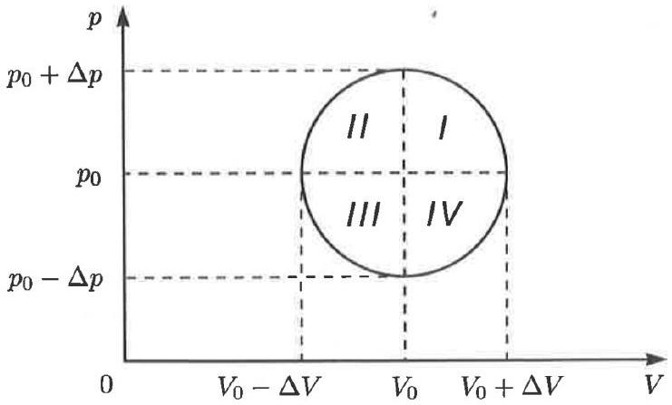

8. A cyclic process with one mole of an ideal polyatomic gas appears as a circle on the pressurevolume $( P - V )$ diagram. Coordinates of the circle centre are $\left( P _ { 0 } , V _ { 0 } \right)$, the diameter along the pressure axis is $2 \Delta P$, and the diameter along the volume axis is $2 \Delta V$.

    (a) Determine all pairs of diametrically opposite points of the circle $( P , V )$ with equal heat capacities. Calculate these heat capacities in terms of known quantities, $C _ { V } , C _ { p }$ and $R$.
    (b) Compare heat capacities of two arbitrary diametrically opposite points lying in quadrants 2 and 4 of the circle. Which of these points has greater heat capacity? Why?
    (c) Form a pair of simultaneous (algebraic) equations that you would use to determine the values $( P , V )$ where entropy is maximum and minimum during the cycle. Comment, with mathematical justification, whether these points are diametrically opposite.

Solution:
