## 2025 Selection Test

for the International Physics Olympiad (IPhO), Asian Physics Olympiad (APhO) and International Nuclear Science Olympiad (INSO)

a. This is a 4 hour test. Attempt all questions. The maximum total score is 80; marks allocated for each question part are indicated in square brackets.
b. Check that there are a total of 34 printed pages (including this cover page). The last page contains a table of physical constants that you may refer to and use.
c. Begin your answer for each question on a fresh sheet of paper, and present your working and answers clearly. Your answer sheets should be sorted according to the order of the questions.
d. Write your name on the top right hand corner of every answer sheet you submit.
e. You may use a standard (non-programmable) scientific calculator in accordance with the statutes of the International Physics Olympiad.
f. No external materials may be brought into the examination room. No discussion is allowed. Any intentional breach of integrity may lead to disqualification.

| Question: | 1 | 2 | 3 | 4 | 5 | 6 | 7 | 8 | 9 | Total |
| :--- | :--- | :--- | :--- | :--- | :--- | :--- | :--- | :--- | :--- | :--- |
| Points: | 6 | 5 | 5 | 10 | 10 | 14 | 10 | 12 | 8 | 80 |
| Score: |  |  |  |  |  |  |  |  |  |  |

1. A wide river of uniform depth flows with a uniform constant speed $u$ parallel to its banks. A boat is moving in the river with constant speed $v$, measured in the moving frame of the river.
As the boat moves, a metal ball is dropped into the river with zero vertical velocity and the same horizontal velocity as the boat. The drag force law for the ball's motion in water is unknown. When the ball reaches the bottom of the river, the horizontal distance it has travelled since its point of release is measured in the stationary frame of the river bank.
We will now consider three different cases, each with the boat moving in a different direction.
(Case 1) When the boat is moving downstream (its net motion is parallel to the river velocity), the distance measured is $a$.
(Case 2) When the boat is moving upstream (its net motion is antiparallel to the river velocity), the distance measured is $b$.
(Case 3) When the boat is moving such that its net motion in the stationary frame is perpendicular to the velocity of the river, the distance measured is $c$.
    (a) Is it necessary to know the drag force law to determine the trajectory of the ball in the frame of the river? Explain your answer. (Hint: Drawing a diagram may be helpful.)
Solution: No. All three trajectories are identical in the frame of the river because the boat has the same velocity in that frame, so the ball has the same initial velocity in that frame.
    (b) With appropriate diagrams, find the ratio $\frac { v } { u }$. Leave your answer in terms of $a , b$ and $c$.
Solution: As discussed before, we know that the trajectory of the ball in the rest frame of the water is identical. Thus, we also know that the horizontal displacement of the ball in all 3 cases is the same with respect to the water. The problem can be solved by considering the displacement of the starting position and that of the ball separately, in the frame of the moving water. The direction of the horizontal displacement of the ball is dependent on the direction of the velocity of the boat in the frame of the water.
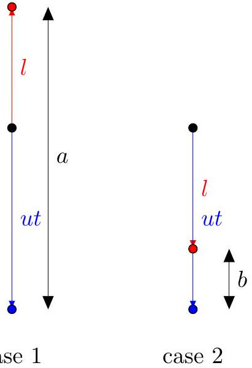

\begin{figure}
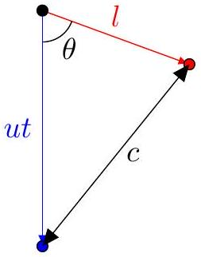
\end{figure}
The red arrow shows the unknown displacement $l$ of the ball in the frame of the water while the blue arrow shows the displacement of the starting position defined in the lab frame, $u t$. Note that in case 3, $u t$ and $c$ are not perpendicular because

the ball undergoes drag after it enters the river. We are able to form the following relationships:

$$
\begin{aligned}
a & = u t + l \\
b & = u t - l \\
c ^ { 2 } & = ( u t ) ^ { 2 } + l ^ { 2 } - 2 u t l \cos \theta
\end{aligned}
$$

We can find $\theta$ with the condition that the net motion of the boat is perpendicular to the river motion. That gives us $\cos \theta = \frac { u } { v }$.
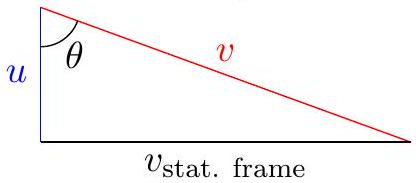
Solving, we get:

$$
\frac { v } { u } = \frac { a ^ { 2 } - b ^ { 2 } } { a ^ { 2 } + b ^ { 2 } - 2 c ^ { 2 } }
$$

## Marking Scheme:

| Part | Steps | Marks |
| :--- | :--- | :--- |
| (a) | Answer with correct explanation | A1 |
| (b) | Correct direction of boat in the stationary frame for the first and second case | M0.75 |
|  | Correct direction of boat in the stationary frame for the third case | M1 |
|  | Correct expression for $a$ and $b$ in terms of unknown quantities | M0.75 |
|  | Use of method of cosines to express $c$ | M1 |
|  | $\cos \theta = \frac { u } { v }$ or equivalent | M0.5 |
|  | Correct final answer | A1 |

2. A pendulum with an inextensible string of length $\ell$ and mass $m$ is attached to a spring of zero natural length and stiffness $k$. The string and spring are fixed to two perpendicular walls at distances $l$ from the corner, as shown in the figure.
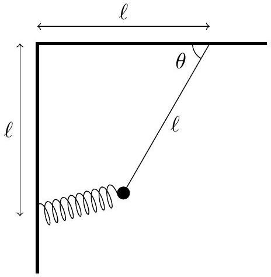
    (a) At equilibrium, $\theta = \theta _ { 0 }$. Find $\theta _ { 0 }$.
Solution: The fundamental simplification is that for a zero rest length spring, its force is simply given by $\vec { F } = - k \vec { r }$, so we may directly resolve components to get:
$$
\begin{aligned}
k \ell ( 1 - \cos \theta ) & = T \cos \theta \\
k \ell ( 1 - \sin \theta ) + m g & = T \sin \theta
\end{aligned}
$$
Hence, we have:
$$
\begin{aligned}
k \ell ( 1 - \cos \theta ) \tan \theta & = k \ell ( 1 - \sin \theta ) + m g \\
\tan \theta - \sin \theta & = 1 - \sin \theta + \frac { m g } { k \ell }
\end{aligned}
$$
which simplifies to $\theta _ { 0 } = \tan ^ { - 1 } \left( 1 + \frac { m g } { k \ell } \right)$.
Alternatively, many correct answers used an energy approach. The potential energy in the system is given by:
$$
\begin{aligned}
U & = \frac { 1 } { 2 } k \ell ^ { 2 } \left[ ( 1 - \cos \theta ) ^ { 2 } + ( 1 - \sin \theta ) ^ { 2 } \right] - m g \ell \sin \theta \\
& = \frac { 1 } { 2 } k \ell ^ { 2 } ( 3 - 2 \cos \theta - 2 \sin \theta ) - m g \ell \sin \theta
\end{aligned}
$$
At the equilibrium angle, the potential energy is at a minimum.
$$
\begin{gathered}
\frac { d U } { d \theta } = k \ell ^ { 2 } ( \sin \theta - \cos \theta ) - m g \ell \cos \theta = 0 \\
\tan \theta _ { 0 } = \frac { k l ^ { 2 } + m g \ell } { k \ell ^ { 2 } } \\
\theta _ { 0 } = \tan ^ { - 1 } \left( 1 + \frac { m g } { k \ell } \right)
\end{gathered}
$$
    (b) Find the angular frequency of small oscillations of the system about equilibrium. If required, leave your answer in terms of $\theta _ { 0 }$.

Solution: The energy approach leads most directly to the final answer. Consider the kinetic energy of the mass $T = \frac { 1 } { 2 } m l ^ { 2 } \dot { \theta } ^ { 2 }$. Then, differentiating the total energy, we obtain:

$$
\begin{aligned}
E & = \frac { 1 } { 2 } m l ^ { 2 } \dot { \theta } ^ { 2 } + \frac { 1 } { 2 } k \ell ^ { 2 } ( 3 - 2 \cos \theta - 2 \sin \theta ) - m g \ell \sin \theta \\
0 & = m l ^ { 2 } \ddot { \theta } \ddot { \theta } + k l ^ { 2 } ( \sin \theta - \cos \theta ) \dot { \theta } - m g l \cos \theta \dot { \theta }
\end{aligned}
$$

We consider small displacements $\delta \theta$ about the equilibrium point $\theta _ { 0 }$.

$$
\begin{aligned}
\ddot { \theta } & = - \frac { k } { m } ( \sin \theta - \cos \theta ) + \frac { g } { l } \cos \theta \\
& = - \left( \frac { k } { m } \left( \cos \theta _ { 0 } + \sin \theta _ { 0 } \right) + \frac { g } { l } \sin \theta _ { 0 } \right) \delta \theta \\
\omega & = \sqrt { \frac { k } { m } \left( \cos \theta _ { 0 } + \sin \theta _ { 0 } \right) + \frac { g } { l } \sin \theta _ { 0 } }
\end{aligned}
$$

## Marking Scheme:

| Part | Steps | Marks |
| :--- | :--- | :--- |
| (a) | Correct force balance | M1 |
|  | Correct final answer | A1 |
|  | Correct energy expression | M0.5 |
|  | Correct differentiation, setting to zero | M0.5 |
|  | Correct final answer | A1 |
| (b) | Correct total energy | M0.5 |
|  | Differentiating twice and evaluating at $\theta _ { 0 }$ | M1 |
|  | $\omega = \sqrt { \frac { U ^ { \prime \prime } \left( \theta _ { 0 } \right) } { m l ^ { 2 } } }$ | M0.5 |
|  | Correct final answer | A1 |

3. A continuous rigid helix of uniform density has mass $m$ and radius $R$. Its axis is oriented vertically, and the vertical distance between each helix turn is $H = \pi R$. The helix is able to rotate freely about its vertical axis but remains translationally fixed in place. It does not undergo compression nor extension.
A small bead of identical mass $m$ is threaded onto the frictionless helix. It is released from rest at point A and allowed to slide downwards along the helix.

    (a) Find the helix angle $\theta$ of the helix. The helix angle is the slope angle with respect to the horizontal, if the helix is unravelled.
Solution: For every horizontal distance $2 \pi R$ travelled along the helix, a vertical distance $H$ is travelled. This gives us:
$$
\begin{aligned}
\tan \theta & = \frac { H } { 2 \pi R } = \frac { 1 } { 2 } \\
\theta & = \arctan \frac { 1 } { 2 }
\end{aligned}
$$
    (b) When the ball passes point B , located a vertical distance $h$ directly below A , determine the angular velocity of the helix. If required, leave your answer in terms of $\theta$.
Solution: As the ball slides down the helix, it acquires angular momentum about the helix axis. Since the only external force on this system is gravity, which exerts no torque about the helix axis, the total angular momentum of the system is conserved at zero. The helix must thus be rotating in the opposite direction as the translational velocity of the ball.
Let the magnitude of the angular velocity of the helix be $\omega$, and let the velocity of the ball in the frame of the helix be $v ^ { \prime }$. The components of the ball velocity in the lab frame in the horizontal and vertical directions are:
$$
\begin{aligned}
v _ { \| } & = v ^ { \prime } \cos \theta - \omega R \\
v _ { \perp } & = v ^ { \prime } \sin \theta
\end{aligned}
$$
Applying conservation of angular momentum, we have:
$$
\begin{aligned}
m v _ { \| } R - m R ^ { 2 } \omega & = 0 \\
v ^ { \prime } \cos \theta - \omega R & = \omega R
\end{aligned}
$$

Applying conservation of energy, we have:

$$
\begin{aligned}
m g h & = \frac { 1 } { 2 } m \left( v _ { \| } ^ { 2 } + v _ { \perp } ^ { 2 } \right) + \frac { 1 } { 2 } m R ^ { 2 } \omega ^ { 2 } \\
2 g h & = \left( v ^ { \prime } \cos \theta - \omega R \right) ^ { 2 } + \left( v ^ { \prime } \sin \theta \right) ^ { 2 } + R ^ { 2 } \omega ^ { 2 }
\end{aligned}
$$

Solving these two equations simultaneously for $v ^ { \prime }$ and $\omega$, we obtain:

$$
\omega = \frac { \sqrt { g h } } { R } \frac { \cos \theta } { \sqrt { 1 + \sin ^ { 2 } \theta } }
$$

Marking Scheme:

| Part | Steps | Marks |
| :--- | :--- | :--- |
| (a) | Correct final answer | A1 |
| (b) | Noticing that the equations for angular momentum and energy must be written in terms of $v ^ { \prime }$ (or equivalent) | M0.5 |
|  | Correct decomposition of ball velocities in horizontal and vertical directions in terms of $v ^ { \prime }$ and $\omega$ | M0.5 |
|  | Noticing that conservation of angular momentum may be applied | M0.5 |
|  | Correct application of conservation of angular momentum | M0.5 |
|  | Noticing that conservation of energy may be applied in the rotating frame | M0.5 |
|  | Correct application of conservation of energy | M0.5 |
|  | Correct final answer | A1 |

4. Part A: Scaling Laws in a Column

Consider a solid cylindrical column of diameter $d$ and height $h$ supporting a sphere of diameter $D$ on top. Assume that $D \gg d$, such that the contact area between the sphere and column is effectively the cross-sectional area of the column.

(a) Suppose the diameter of the column is just sufficient to withstand the compressive load of the sphere. How should $d$ scale with $D$, i.e. what should be the exponent $\alpha$ such that $d \propto D ^ { \alpha }$ ? (Hint: The maximum stress that the solid column can withstand is a constant. Assume even stress across the contact area.)

Solution: We have the weight of the sphere $W \propto D ^ { 3 }$, and the area $A$ in contact with the column is $\propto d ^ { 2 }$. Therefore, the stress is

$$
\sigma = \frac { W } { A } \propto \frac { D ^ { 3 } } { d ^ { 2 } }
$$

Since the maximum $\sigma$ is a constant, we have $d \propto D ^ { 3 / 2 }$.

Another possible mode of structural failure is buckling. According to the Euler-Bernoulli beam theory, the deflection $w$ of a beam is related to its bending moment $M$ by

$$
M ( x ) = E I \frac { d ^ { 2 } w } { d x ^ { 2 } }
$$

where $E$ is the Young's modulus of the material (a constant), and $I = \int r ^ { 2 } d A$ is the second moment of area about its central axis (analogous to the moment of inertia, but involving the cross-sectional area $d A$ instead of the mass $d m$ ).
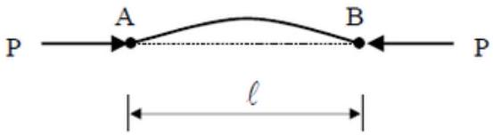
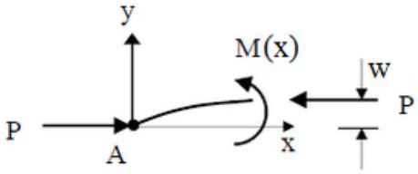
For example, in the figure above, a horizontal load $P$ is applied inwards to both ends of a beam, causing deflections $w ( x )$. The horizontal load causes a bending moment $M ( x ) =$ $P w ( x )$. Above a critical load $P _ { \text {crit } }$, the beam will undergo buckling.

(b) Consider the sphere-column system introduced in part (a). Given that $h \propto D$, how should $d$ scale with $D$ in order to prevent buckling?

Solution: We know that $M = P w$, so

$$
E I \frac { d ^ { 2 } w } { d x ^ { 2 } } + P w = 0
$$

The general solution to this equation is

$$
w = A \sin \left( \sqrt { \frac { P } { E I } } x \right) + B \cos \left( \sqrt { \frac { P } { E I } } x \right)
$$

Applying the boundary conditions $w ( 0 ) = w ( h ) = 0$, we must have $\sqrt { \frac { P } { E I } } h = n \pi$. Therefore,

$$
P \propto \frac { I } { h ^ { 2 } }
$$

The second moment of area $I = \int r ^ { 2 } d A$, so

$$
I \propto d ^ { 4 }
$$

Finally, since the load $P$ is equal to the weight of the sphere $\propto D ^ { 3 }$, we obtain

$$
D ^ { 3 } \propto P \propto \frac { d ^ { 4 } } { D ^ { 2 } } \quad \Rightarrow \quad d \propto D ^ { 5 / 4 }
$$

Part B: Scaling of Gravitational Potentials
A massive thin rhombus plate, with side length $a$ and acute apex angle 60°, has uniform surface mass density $\sigma$. The gravitational potential at the vertex of the acute angle of the rhombus is equal to $\varphi _ { 1 }$, and the potential at the vertex of the obtuse angle is $\varphi _ { 2 }$ (see first object in the figure).
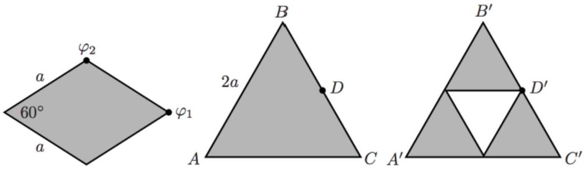

(c) An equilateral triangle of side length $2 a$ (see second object in the figure) has the same uniform mass density $\sigma$. Find the gravitational potential at points C and D. Leave your answers in terms of $\varphi _ { 1 }$ and $\varphi _ { 2 }$.
Solution: The rhombus is equivalent to two equilateral triangles joined along a side. Hence by superposition, $\varphi _ { 2 } = 2 \varphi _ { v }$, where $\varphi _ { v } = \frac { 1 } { 2 } \varphi _ { 2 }$ is the potential at vertex of an equilateral triangle of side $a$. The equation for gravitational potential is
$$
\begin{aligned}
\varphi & = G \int \frac { d m } { r } \\
& = G \int \frac { \sigma d A } { r }
\end{aligned}
$$
The potential at points on an equilateral triangle thus scale proportionally to its side length, so
$$
\varphi _ { C } = 2 \varphi _ { v } = \varphi _ { 2 }
$$
The large equilateral triangle can be filled in by a rhombus and two smaller equilateral triangles. The rhombus contributes a potential $\varphi _ { 1 }$, while the the two triangles each contribute a potential $\varphi _ { v }$. Hence, we have
$$
\varphi _ { D } = \varphi _ { 1 } + 2 \frac { \varphi _ { 2 } } { 2 } = \varphi _ { 1 } + \varphi _ { 2 }
$$

center. Find the new potential at C' and D'. Leave your answer in terms of $\varphi _ { 1 }$ and $\varphi _ { 2 }$.

Solution: Consider superposing a middle triangle of "negative mass" distribution $- \sigma$ to our triangle in part (b). By superposition, our potential at D' will be

$$
\varphi _ { D ^ { \prime } } = \varphi _ { D } - \frac { \varphi _ { 2 } } { 2 } = \varphi _ { 1 } + \frac { \varphi _ { 2 } } { 2 }
$$

Now, consider the initial rhombus again. The contribution of the further equilateral triangle of the rhombus to the potential at the point labelled $\varphi _ { 1 }$ is $\varphi _ { \text {far } } = \varphi _ { 1 } - \frac { \varphi _ { 2 } } { 2 }$. Applying the same method of negative mass, the potential at C' will be

$$
\varphi _ { C ^ { \prime } } = \varphi _ { C } - \varphi _ { f a r } = \frac { 3 } { 2 } \varphi _ { 2 } - \varphi _ { 1 }
$$

Marking Scheme:

| Part | Steps | Marks |
| :--- | :--- | :--- |
| (a) | $W \propto D ^ { 3 }$ | M0.5 |
|  | Area $\propto d ^ { 2 }$ | M0.5 |
|  | Stress $\propto D ^ { 3 } / d ^ { 2 }$ | M0.5 |
|  | $d \propto D ^ { 3 / 2 }$ | A0.5 |
| (b) | Differential equation for $w$ | M1 |
|  | Solution for $w$ | M0.5 |
|  | $P \propto \frac { E I } { h ^ { 2 } }$ | M0.5 |
|  | $I \propto d ^ { 4 }$ | M0.5 |
|  | $d \propto D ^ { 5 / 4 }$ | A0.5 |
| (c) | Appropriate superposition argument | M1 |
|  | Appropriate scaling argument | M1 |
|  | $\varphi _ { c } = \varphi _ { 2 }$ | A0.5 |
|  | $\varphi _ { d } = \varphi _ { 1 } + \varphi _ { 2 }$ | A0.5 |
| (d) | Appropriate $- \sigma$ superposition argument | M1 |
|  | $\varphi _ { D ^ { \prime } } = \varphi _ { 1 } + \frac { \varphi _ { 2 } } { 2 }$ | A0.5 |
|  | $\varphi _ { C ^ { \prime } } = \frac { 3 } { 2 } \varphi _ { 2 } - \varphi _ { 1 }$ | A0.5 |

Part A of this problem is adapted from examples in https://courses.cs.vt.edu/cs2104/Spring18Onufriev/LectureNotes/ScalingLaws.pdf.

5. Consider a point charge $+ q$ placed at a fixed distance $d$ from an infinitely large, thin, conducting plane.
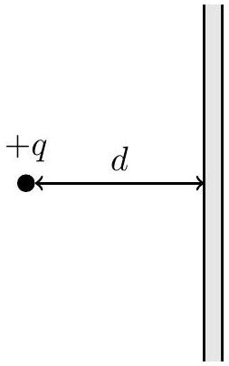
A small fly, initially on the point charge, takes off with an initial angle $\theta$ from the horizontal. Flying at a constant speed $v$, it follows the path of an electric field line until it reaches the plane (this diagram is not drawn to scale).
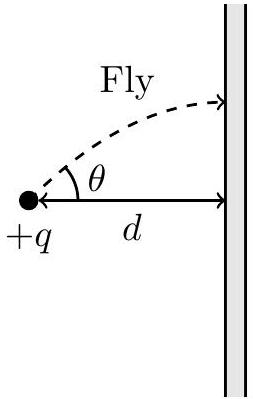
    (a) Define the coordinates $( x , y )$ such that the plane is at $x = 0$, and the point charge is at $( - d , 0 )$. Determine $E _ { x }$ and $E _ { y }$, the $x$ and $y$ components of the electric field, for all points $( x , y )$ in $x < 0$.
Solution: Using the method of images, we can find the electric field everywhere to the left of the plane $( x < 0 )$ :
$$
\begin{aligned}
& \vec { E } = \vec { E } ( + q \text { at } ( - d , 0 ) ) + \vec { E } ( - q \text { at } ( + d , 0 ) ) \\
& \left\{ \begin{aligned}
E _ { x } & = \frac { q } { 4 \pi \varepsilon _ { 0 } } \left[ \frac { x + d } { \left( ( x + d ) ^ { 2 } + y ^ { 2 } \right) ^ { 3 / 2 } } - \frac { x - d } { \left( ( x - d ) ^ { 2 } + y ^ { 2 } \right) ^ { 3 / 2 } } \right] \\
E _ { y } & = \frac { q } { 4 \pi \varepsilon _ { 0 } } \left[ \frac { y } { \left( ( x + d ) ^ { 2 } + y ^ { 2 } \right) ^ { 3 / 2 } } - \frac { y } { \left( ( x - d ) ^ { 2 } + y ^ { 2 } \right) ^ { 3 / 2 } } \right]
\end{aligned} \right.
\end{aligned}
$$
    (b) The electric field line illustrated terminates at $\left( 0 , y _ { 0 } \right)$. Determine $y _ { 0 }$, leaving your answer in terms of $d$ and $\theta$. (Hint: The curved surface area of a sphere sector with half-angle $\theta$ is $\frac { 1 } { 2 } ( 1 - \cos \theta )$ of the total surface area of the sphere.)
Solution: Consider a Gaussian surface formed by the surface of revolution from the fly's trajectory and the plane. Since the curved part of the surface is by definition parallel to the electric field lines, the only contribution to the electric

flux is from its intersection with the plane.

$$
\begin{aligned}
\Phi _ { E } & = \int _ { 0 } ^ { y _ { 0 } } E _ { x } ( x = 0 ) \cdot 2 \pi y \mathrm {~d} y \\
& = \frac { q d } { \varepsilon _ { 0 } } \int _ { 0 } ^ { y _ { 0 } } \frac { y \mathrm {~d} y } { \left( d ^ { 2 } + y ^ { 2 } \right) ^ { 3 / 2 } } \\
& = \frac { q d } { \varepsilon _ { 0 } } \left[ - \frac { 1 } { \sqrt { d ^ { 2 } + y ^ { 2 } } } \right] _ { 0 } ^ { y _ { 0 } } \\
& = \frac { q } { \varepsilon _ { 0 } } \left( 1 - \frac { d } { \sqrt { d ^ { 2 } + y _ { 0 } ^ { 2 } } } \right)
\end{aligned}
$$

If we take the point charge to be spherical with radius $r \rightarrow 0$, at the end with the point charge, the surface approaches a cone with half-angle $\theta$. We know that the electric flux through a spherical surface surrounding a point charge is uniform, so the flux passing through this surface is given by the total flux multiplied by the surface area fraction of the sector with respect to the entire sphere:

$$
\Phi _ { E } = \frac { q } { 2 \varepsilon _ { 0 } } ( 1 - \cos \theta ) = \frac { q } { \varepsilon _ { 0 } } \sin ^ { 2 } \frac { \theta } { 2 }
$$

Equating the two fluxes, we have:

$$
\begin{aligned}
\frac { q } { \varepsilon _ { 0 } } \left( 1 - \frac { d } { \sqrt { d ^ { 2 } + y _ { 0 } ^ { 2 } } } \right) & = \frac { q } { \varepsilon _ { 0 } } \sin ^ { 2 } \frac { \theta } { 2 } \\
\frac { d } { \sqrt { d ^ { 2 } + y _ { 0 } ^ { 2 } } } & = \cos ^ { 2 } \frac { \theta } { 2 } \\
y _ { 0 } & = d \sqrt { \sec ^ { 4 } \frac { \theta } { 2 } - 1 }
\end{aligned}
$$

(c) Find the instantaneous acceleration of the fly $a$ as it reaches the plane. Leave your answer in terms of $v , d$ and $\theta$. (Hint: The radius of curvature $R$ of a curve $y ( x )$ is given by $R = \left| \frac { \left( 1 + y ^ { \prime 2 } \right) ^ { \frac { 3 } { 2 } } } { y ^ { \prime \prime } } \right|$, where primes denote a derivative with respect to $x$.)

Solution: Since the fly moves along a field line, its motion is parallel to the electric field at every point. Hence, the trajectory of the fly is given by $\frac { \mathrm { d } y } { \mathrm {~d} x } = \frac { E _ { y } } { E _ { x } }$. This is a differential equation which can be solved to yield the full trajectory, however it is extremely difficult and not the intended solution.
As the fly is moving at a constant speed, its acceleration must be perpendicular to its velocity, with magnitude equal to the centripetal acceleration. At the plane, the electric field lines are horizontal, so the expression simplifies considerably. Namely, $E _ { y } = 0 , \frac { \mathrm {~d} y } { \mathrm {~d} x } = 0$ so $\frac { \mathrm { d } } { \mathrm { d } x } = \frac { \partial } { \partial x }$, and the radius of curvature is given by $\frac { 1 } { R } = \left| \frac { \mathrm { d } ^ { 2 } y } { \mathrm {~d} x ^ { 2 } } \right|$.

Hence,

$$
\begin{aligned}
a & = \frac { v ^ { 2 } } { R } = v ^ { 2 } \left| \frac { \mathrm {~d} ^ { 2 } y } { \mathrm {~d} x ^ { 2 } } \right| = v ^ { 2 } \left| \frac { \partial } { \partial x } \frac { E _ { y } } { E _ { x } } \right| = v ^ { 2 } \frac { \left| E _ { y } ^ { \prime } \right| } { E _ { x } } \\
& = \frac { 3 } { 2 } v ^ { 2 } \frac { \frac { 2 y ( x + d ) } { \left( ( x + d ) ^ { 2 } + y ^ { 2 } \right) ^ { 5 / 2 } } - \frac { 2 y ( x - d ) } { \left( ( x - d ) ^ { 2 } + y ^ { 2 } \right) ^ { 5 / 2 } } } { \left( ( x + d ) ^ { 2 } + y ^ { 2 } \right) ^ { 3 / 2 } } - \left. \frac { x - d } { \left( ( x - d ) ^ { 2 } + y ^ { 2 } \right) ^ { 3 / 2 } } \right| _ { x = 0 } \\
& = \frac { 3 y _ { 0 } } { y _ { 0 } ^ { 2 } + d ^ { 2 } } v ^ { 2 }
\end{aligned}
$$

where primes denote a partial derivative with respect to $x$.
Substituting the expression for $y _ { 0 }$, the final answer is

$$
a = \frac { 3 v ^ { 2 } } { d } \cos ^ { 2 } \frac { \theta } { 2 } \sin \frac { \theta } { 2 } \sqrt { 1 + \cos ^ { 2 } \frac { \theta } { 2 } }
$$

Marking Scheme:

| Part | Steps | Marks |
| :--- | :--- | :--- |
| (a) | Image charge with correct magnitude and position | M1 |
|  | Correct $E _ { x }$ | A1 |
|  | Correct $E _ { y }$ | A1 |
| (b) | Applying Gauss' Law | M0.3 |
|  | Appropriately constructed Gaussian surface | M0.7 |
|  | Identifying that electric flux is solely due to intersection of field lines with plane | M0.5 |
|  | Correct derivation for electric flux at plane | M0. 8 |
|  | Considering point charge as a sphere and obtaining the correct flux | M1 |
|  | Correct final answer | A0.7 |
| (c) | Identifying that the acceleration is solely centripetal | M0.5 |
|  | Identifying that electric field lines are horizontal and simplifying the expression for radius of curvature | M0.5 |
|  | Correct equation of trajectory $\frac { \mathrm { d } y } { \mathrm {~d} x } = \frac { E _ { y } } { E _ { x } }$ | M0.5 |
|  | Differentiation and substitution | M1 |
|  | Correct final answer | A0.5 |

6. Superconductors exhibit the Meissner effect where below a critical temperature, the superconducting material expels all magnetic fields from its interior. This effect can be visualised by magnetic field lines, which are unable to penetrate the superconducting surface, instead curving around the superconductor.
This behaviour is similar to fluid flow around a solid object, and we may draw an analogy between electromagetism and fluid dynamics. In this problem, we will exploit this analogy to discuss the Magnus effect; a phenomenon that occurs when a rotating object moves through a fluid.

(a) Consider an infinitely long conducting cylinder of radius $R$, carrying current $I$ along its axis of symmetry distributed uniformly across its cross section. Find $B ( r )$ for $r < R$.
Solution: By Ampere's Law,
$$
\oint \vec { B } \cdot d \vec { l } = \mu _ { 0 } \cdot I _ { e n c l } = \mu _ { 0 } I \frac { r ^ { 2 } } { R ^ { 2 } }
$$
This leads us directly to the result $B ( r ) = \frac { \mu _ { 0 } I r } { 2 \pi R ^ { 2 } }$.

Two straight, infinitely long cylindrical nonmagnetic conductors $C _ { + }$and $C _ { - }$, insulated from each other, overlap. They carry uniformly distributed current $I$ in and out of the paper respectively (i.e. $C _ { + }$carries a current of $I$ out of the page and $C _ { - }$carries a current of $I$ into the page. The overlapping region has zero net current). The cross sections of the conductors (shaded in the figure) are limited by circles of radius $R$ in the x-y plane, with distance $d$ between their centres.
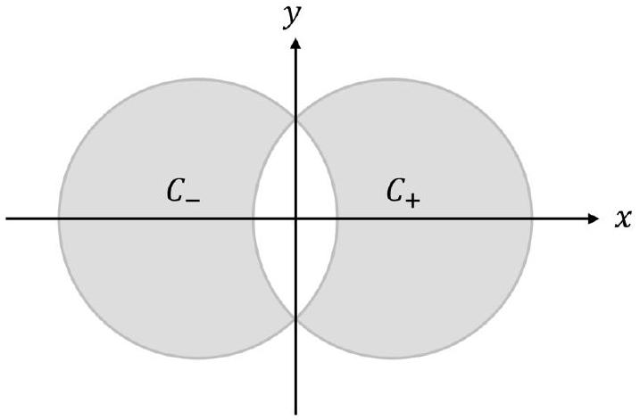

(b) Determine the magnetic field $\vec { B } ( x , y )$ in the space between the conductors. The origin is placed in the middle of the two centres.

Solution:
The magnetic field can be determined as the superposition of the fields of two cylindrical conductors. From part (a), we know that the magnetic field within a current cylinder is azimuthal and has magnitude

$$
B = \frac { \mu _ { 0 } I r } { 2 \pi R ^ { 2 } }
$$

Consider an arbitrary point within the space between the two conductors.

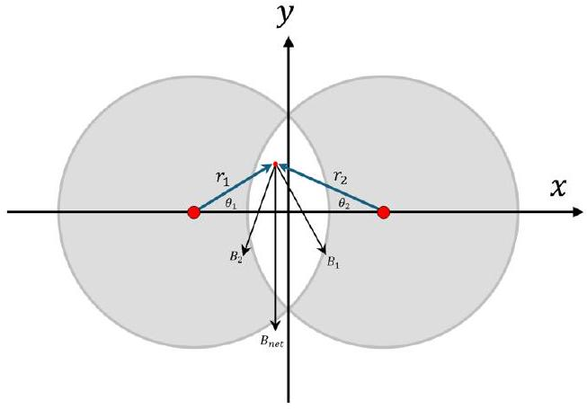
Taking components of the magnetic fields along the $x$ and $y$ axes respectively,

$$
B _ { x } = \frac { \mu _ { 0 } r _ { 1 } I \sin \theta _ { 1 } } { 2 \pi R ^ { 2 } } - \frac { \mu _ { 0 } r _ { 2 } I \sin \theta _ { 2 } } { 2 \pi R ^ { 2 } } = 0
$$

where we have used the fact that $r _ { 1 } \sin \theta _ { 1 } = r _ { 2 } \sin \theta _ { 2 }$.

$$
\begin{aligned}
B _ { y } & = - \frac { \mu _ { 0 } r _ { 1 } I _ { 0 } \cos \theta _ { 1 } } { 2 \pi R ^ { 2 } } - \frac { \mu _ { 0 } r _ { 2 } I _ { 0 } \cos \theta _ { 2 } } { 2 \pi R ^ { 2 } } \\
& = - \frac { \mu _ { 0 } I _ { 0 } \left( r _ { 1 } \cos \theta _ { 1 } + r _ { 2 } \cos \theta _ { 2 } \right) } { 2 \pi R ^ { 2 } }
\end{aligned}
$$

But $r _ { 1 } \cos \theta _ { 1 } + r _ { 2 } \cos \theta _ { 2 } = d$. Hence,

$$
\vec { B } = - \frac { \mu _ { 0 } I d } { 2 \pi R ^ { 2 } } \hat { y }
$$

which is constant everywhere in the intersecting region.

An infinite solid superconducting cylinder of radius $R$ with symmetry axis parallel to the z-axis lies in a uniform external magnetic field of magnitude $B _ { 0 }$ parallel to the y-axis.
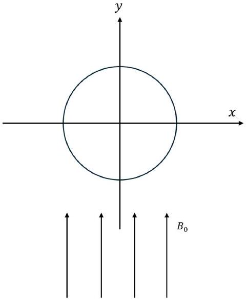

(c) Knowing that superconductors repel magnetic fields, and using the result in part (b), show that the net magnetic field $\overrightarrow { B _ { 1 } }$ in the region $r > R$ is given by:
$$
\overrightarrow { B _ { 1 } } ( r , \theta ) = B _ { 0 } \sin \theta \left( 1 - \frac { R ^ { 2 } } { r ^ { 2 } } \right) \hat { r } + B _ { 0 } \cos \theta \left( 1 + \frac { R ^ { 2 } } { r ^ { 2 } } \right) \hat { \theta }
$$

Solution:
The net magnetic field within the cylinder is zero. To negate the external magnetic field, there must be a current distribution on the surface of the superconducting cylinder that generates a uniform magnetic field $- B _ { 0 } \hat { y }$ within the cylinder. We may apply our result from part (b), modelling the current distribution in the superconductor as the superposition of two opposite current cylinders separated by a distance $d \ll R$ (such that the intersection of the two current cylinders effectively fills the entire volume of the superconducting cylinder). The current $I$ and separation $d$ must satisfy

$$
B _ { 0 } = \frac { \mu _ { 0 } I d } { 2 \pi R ^ { 2 } }
$$

Hence, by Ampere's Law, the magnetic field outside the cylinder is effectively equal to the magnetic fields of two infinite current-carrying wires spaced a distance $d$ apart.
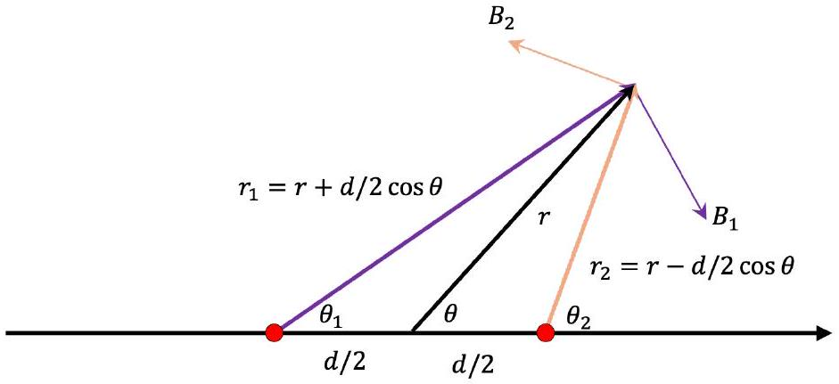
Superimposing the fields in polar coordinates, we obtain

$$
B _ { 1 , \theta } = B _ { 0 } \cos \theta + \frac { \mu _ { 0 } I } { 2 \pi } \left( \frac { 1 } { r - \frac { d } { 2 } \cos \theta } - \frac { 1 } { r + \frac { d } { 2 } \cos \theta } \right)
$$

Taking first order terms with respect to $\frac { d } { r }$, we get

$$
\begin{aligned}
B _ { 1 , \theta } & = B _ { 0 } \cos \theta + \frac { \mu _ { 0 } I d \cos \theta } { 2 \pi r ^ { 2 } } \\
& = B _ { 0 } \cos \theta \left( 1 + \frac { R ^ { 2 } } { r ^ { 2 } } \right)
\end{aligned}
$$

Similarly, we can obtain

$$
\begin{aligned}
B _ { 1 , r } & = B _ { 0 } \sin \theta - \frac { \mu _ { 0 } I } { 2 \pi r } \left( \frac { d \sin \theta } { r } \right) \\
& = B _ { 0 } \sin \theta \left( 1 - \frac { R ^ { 2 } } { r ^ { 2 } } \right)
\end{aligned}
$$

Hence, we conclude that

$$
\overrightarrow { B _ { 1 } } ( r , \theta ) = B _ { 0 } \sin \theta \left( 1 - \frac { R ^ { 2 } } { r ^ { 2 } } \right) \hat { r } + B _ { 0 } \cos \theta \left( 1 + \frac { R ^ { 2 } } { r ^ { 2 } } \right) \hat { \theta }
$$

An infinitely long solid cylinder of radius $R$ is placed in a region of incompressible, nonviscous fluid that flows from $y = - \infty$ with a uniform velocity of $U _ { 0 } \hat { y }$, past the cylinder and away towards $y = + \infty$. Consider the fluid motion in one cross-sectional plane of the cylinder.
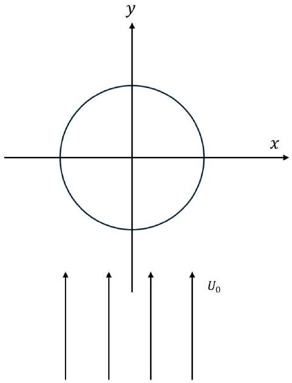

(d) Draw a diagram to represent the fluid flow around the cylinder and write down an expression for $\vec { U } ( r , \theta )$, the velocity of the fluid at any point in space outside the cylinder in polar coordinates, justifying your answer.
Solution: Here, we need to make the appropriate analogy between our current superconductor setup and what we are trying to find; which is the velocity field of fluid flowing around an object. We notice a few similarities between magnetic fields and the velocity fields of fluids.
1. Just like how magnetic field lines are unable to penetrate superconductors, fluid always flows around the object; the velocity field must always be parallel to the object surface, at the object surface.
2. Gauss' Law for magnetism states that $\oint \vec { B } \cdot d \vec { S } = 0$ or $\nabla \cdot \vec { B } = 0$. This is similar to the law of continuity for fluid flow $\nabla \cdot \vec { U } = 0$.
Hence, since the governing equations for the magnetic field and velocity field are the same, and the boundary condition at the cylinder surfaces are the same in both cases, we can conclude that magnetic fields and velocity fields are exactly analogous in this context.
We therefore obtain that the velocity field is:
$$
\vec { U } ( r , \theta ) = U _ { 0 } \sin \theta \left( 1 - \frac { R ^ { 2 } } { r ^ { 2 } } \right) \hat { r } + U _ { 0 } \cos \theta \left( 1 + \frac { R ^ { 2 } } { r ^ { 2 } } \right) \hat { \theta }
$$

The cylinder is now given an angular velocity that points in the positive $z$-direction (out of the paper), inducing circular currents in the fluid around it. To model the effect of the rotation of the cylinder on the surrounding fluid, we will use the concept of circulation.
Usually, non-viscous flow has an important property of being irrotational: the circulation of velocity along any closed path within the fluid is zero.

$$
\oint \vec { v } \cdot d \vec { l } = 0
$$

However, this changes if we introduce a vortex filament; which induces long range circulatory flows in the fluid. For any closed loop that wraps around these filaments,

$$
| \oint \vec { v } \cdot d \vec { l } | = 2 \pi \Gamma
$$

where $\Gamma$ is called the circulation quantum. To illustrate this, a vortex filament (thick line) is drawn in fluid. The velocity circulation along paths $L _ { 1 } , L _ { 2 } , L _ { 5 }$ and $L _ { 6 }$ (thin lines) are all zero, whereas those for $L _ { 3 }$ and $L _ { 4 }$ are equal to $\pm 2 \pi \Gamma$. Note that circulations along $L _ { 3 }$ and $L _ { 4 }$ have opposite signs.
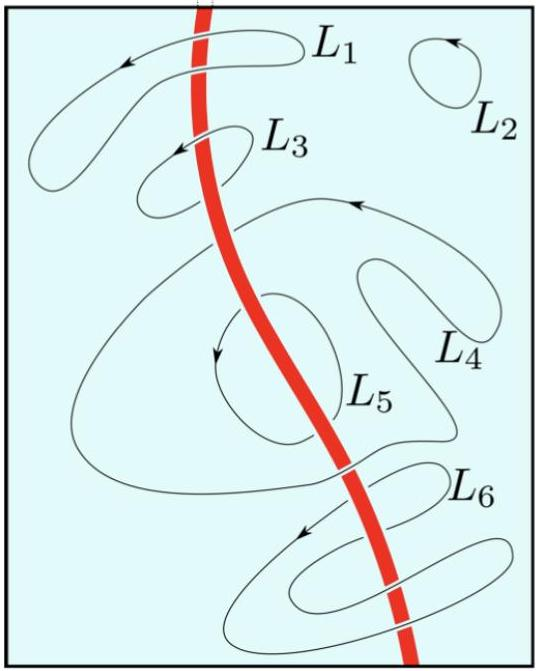

(e) Model the rotation of the cylinder with a long infinite vortex filament with circulation quantum $\Gamma$ placed along the central axis of the cylinder. Find the new velocity field $\overrightarrow { U _ { 1 } } ( r , \theta )$.

Solution:
Notice that we can separate the velocity field into two components - the irrotational field $\vec { U } ( r , \theta )$, and the rotational field generated by the circulation, which we call $\vec { v } ( r , \theta )$. We may safely assume that $\vec { v } ( r , \theta )$ is rotationally symmetric, making it independent of $\theta$. Furthermore, since it only has a rotational component, we will call that $v _ { \theta } ( r )$. Using the circulation law, we obtain:

$$
\begin{aligned}
2 \pi r v _ { \theta } ( r ) & = 2 \pi \Gamma \\
v _ { \theta } ( r ) & = \frac { \Gamma } { r }
\end{aligned}
$$

We can now simply superimpose $v _ { \theta }$ and $\vec { U } ( r , \theta )$ to obtain:

$$
\vec { U } _ { 1 } ( r , \theta ) = U \sin \theta \left( 1 - \frac { R ^ { 2 } } { r ^ { 2 } } \right) \hat { r } + \left( U \cos \theta \left( 1 + \frac { R ^ { 2 } } { r ^ { 2 } } \right) + \frac { \Gamma } { r } \right) \hat { \theta }
$$

(f) Given density of fluid $\rho$, find the force per unit length $\vec { F }$ acting upon the cylinder due to the fluid flow. (Hint: One possible solution is to apply Bernoulli's equation.)
Solution: We are now almost done.
This is the Magnus effect; the rotation of the cylinder in the fluid generates an asymmetric velocity field. Hence, by Bernoulli's law, the resulting pressure field is also asymmetric, generating a net force on the object.
First, let us find the velocity field $\vec { V } ( \theta )$ at the surface of the object, since we want to integrate the fluid pressure at the object's surface to find the force. Substituting $r = R$ into $\vec { U } _ { 1 } ( r , \theta )$,
$$
\vec { V } ( \theta ) = \left( 2 U _ { 0 } \cos \theta + \frac { \Gamma } { R } \right) \hat { \theta }
$$
We apply Bernoulli's theorem, taking $p _ { 0 }$ to be the gauge pressure set at infinity:
$$
p _ { 0 } + \frac { 1 } { 2 } \rho U _ { 0 } ^ { 2 } = p ( \theta ) + \frac { 1 } { 2 } \rho V ( \theta ) ^ { 2 }
$$
Simplifying, we obtain
$$
p ( \theta ) = p _ { 0 } + \frac { 1 } { 2 } \rho U _ { 0 } ^ { 2 } \left( 1 - 4 \cos ^ { 2 } \theta \right) - \frac { \Gamma ^ { 2 } } { R ^ { 2 } } - \frac { 2 \rho \Gamma U _ { 0 } \cos \theta } { R }
$$
Hence, the force per unit length can be expressed as:
$$
\vec { F } = - \int _ { 0 } ^ { 2 \pi } p ( \theta ) R \cos \theta d \theta \hat { x } - \int _ { 0 } ^ { 2 \pi } p ( \theta ) R \sin \theta d \theta \hat { y }
$$
The only term which remains non-zero upon integration is the $\cos ^ { 2 } \theta$ term. We may simplify the equation and obtain:
$$
\begin{aligned}
\vec { F } & = \int _ { 0 } ^ { 2 \pi } 2 \rho \Gamma U _ { 0 } \cos ^ { 2 } \theta d \theta \hat { x } \\
& = 2 \pi \rho \Gamma U _ { 0 } \hat { x }
\end{aligned}
$$

| Marking Scheme: |  |  |
| :--- | :--- | :--- |
| Part | Steps | Marks |
| (a) | $\oint \vec { B } \cdot d \vec { l } = \mu _ { 0 } I \frac { r ^ { 2 } } { R ^ { 2 } }$ Correct final answer | M1 A1 |
| (b) | Idea of superposition of two opposite cylindrical currents $B ( x ) = 0$ Correct $B ( y )$ | M0.5   M0.5 A1 |
| (c) | Realise that the configuration in part (b) with current $I$ satisfying $B _ { 0 } = \frac { \mu _ { 0 } I d } { 2 \pi R ^ { 2 } }$ fufills the condition that the magnetic field inside the superconductor is 0 Correct calculations for field due to superconductor, with sufficient detail Correct calculations for field due to external field | M1   M1.5   M0.5 |
| (d) | Correct diagram Justification on similarities in governing equations (Continuity, Gauss' Law) Justification on similarities in boundary conditions (No normal component at cylinder walls) Correct final answer | A0.5   M0.5   M0.5   A0.5 |
| (e) | $v _ { \text {theta } } \cdot 2 \pi r = 2 \pi \Gamma$ Correct final answer | M1   A1 |
| (f) | Substitution of $r = R$ to find $\vec { V } ( \theta )$ Use Bernoulli's equation to find $p = p _ { 0 } + \frac { 1 } { 2 } \rho U _ { 0 } ^ { 2 } \left( 1 - 4 \cos ^ { 2 } \theta \right) - \frac { \Gamma ^ { 2 } } { R ^ { 2 } } - \frac { 2 \rho \Gamma U _ { 0 } \cos \theta } { R } F _ { y } = 0$ Correct final answer | M0.5   M1   M0.5   A1 |

## 7. Part A: Thin Lens Interference

A plano-convex lens with radius of curvature $R$ and refractive index $n$ is placed on top of a flat glass plate such that there is a small air gap between the curved surface and the plate.

(a) Consider the thickness $t ( r )$ of the air gap as a function of radial distance $r$ from the centre of the lens. Determine $t ( r )$ to leading order in $r$.

Solution: Applying Pythagoras' Theorem, we use the fact that $t \ll R$ to show that:

$$
\begin{aligned}
R ^ { 2 } & = r ^ { 2 } + ( R - t ( r ) ) ^ { 2 } \\
& \approx r ^ { 2 } + R ^ { 2 } - 2 R t ( r ) \\
t ( r ) & \approx \frac { r ^ { 2 } } { 2 R }
\end{aligned}
$$

(b) Collimated light of wavelength $\lambda$ is incident on the lens. Determine the the radial position $r _ { m }$ of the $m ^ { \text {th } }$ bright fringe. Assume that the incident light and reflected light is always approximately normal to both the lens and plate.

Solution: In order for constructive interference to occur, the phase difference between a ray that is reflected off the bottom surface of the lens and a ray transmitted and reflected off the glass plate must be an integer multiple of $2 \pi$.
The transmitted ray travels an extra distance $2 t$, equivalent to a phase angle $\frac { 4 \pi t } { \lambda }$. Furthermore, as it is reflected within a medium of lower refractive index, whereas the other ray is reflected within a medium of higher refractive index, it gains an additional phase $\pi$. Thus we have:

$$
\begin{aligned}
\frac { 4 \pi t } { \lambda } + \pi & = 2 \pi m \\
\frac { 2 \pi r _ { m } ^ { 2 } } { \lambda R } + \pi & = 2 \pi m \\
r _ { m } & = \sqrt { \left( m - \frac { 1 } { 2 } \right) \lambda R }
\end{aligned}
$$

## Part B: Double Slit Diffraction

We consider two-slit diffraction, but with collimated light of speed $c$ and two different wavelengths $\lambda _ { 1 } , \lambda _ { 2 }$ entering the two slits respectively. The two slits are separated by distance $d$. For simplicity, we project onto a screen placed a distance $r$ away, and define the angular position $\theta$ at the screen as shown in the figure. Assume $r \gg d \gg \lambda _ { 1 } , \lambda _ { 2 }$. Set the phases of the two waves at the slit to be $\phi = 0$.

(c) Let the electric field through each slit have amplitude $E _ { 0 }$. Find the amplitude of the total electric field at an angle $\theta$ on the screen, at an arbitrary time $t$. Express your answer as a product of cosines or sines. (Hint: You may use the identity $\cos A + \cos B =$ $2 \cos \frac { A + B } { 2 } \cos \frac { A - B } { 2 }$. You may choose to define your own variables to simplify your final answer.)

Solution: The major difference between this and usual diffraction is that both the wavenumber and frequency are different. The wavenumber is $k = \frac { 2 \pi } { \lambda }$ and the frequency is $\omega = c k$. The amplitude is

$$
E _ { 1,2 } = E _ { 0 } \cos \left[ \frac { 2 \pi } { \lambda _ { 1,2 } } \cdot \left( r \pm \frac { d } { 2 } \sin \theta - c t \right) \right]
$$

The resulting diffraction pattern is $E = E _ { 1 } + E _ { 2 }$, therefore

$$
E = E _ { 0 } \left[ \cos \left[ \frac { 2 \pi } { \lambda _ { 1 } } \cdot \left( r + \frac { d } { 2 } \sin \theta - c t \right) \right] + \cos \left[ \frac { 2 \pi } { \lambda _ { 2 } } \cdot \left( r - \frac { d } { 2 } \sin \theta - c t \right) \right] \right]
$$

For simplicity, we use the wavenumber $k = \frac { 2 \pi } { \lambda }$. Let $\bar { k } = \frac { k _ { 1 } + k _ { 2 } } { 2 } , \delta k = \frac { k _ { 1 } - k _ { 2 } } { 2 }$. Using the sum to product formula $\cos A + \cos B = 2 \cos \frac { A + B } { 2 } \cos \frac { A - B } { 2 }$, we have

$$
E = 2 E _ { 0 } \cos \left( \bar { k } ( r - c t ) + \delta k \frac { d \sin \theta } { 2 } \right) \cos \left( \delta k ( r - c t ) + \bar { k } \frac { d \sin \theta } { 2 } \right)
$$

Writing $\frac { r } { \cos \theta }$ instead of $r$ as approximated in the solution gets full credit. Including an additional $\frac { 1 } { \sqrt { r \cos \theta } }$ term to account for the falloff of intensity of cylindrical waves with a larger surface area also gets full credit.

(d) Now suppose $\lambda _ { 1 } = \lambda - \delta \lambda , \lambda _ { 2 } = \lambda + \delta \lambda$, where $\delta \lambda \ll \lambda$. Consider the time average to be taken over the period corresponding to $\lambda$. Find the intensity pattern $I ( \theta , t )$. State the angles which correspond to maxima and minima, and comment on how the positions of these maxima and minima near $\theta = 0$ change with time. You may use appropriate approximations.

Solution: Let $k = \frac { 2 \pi } { \lambda }$, then to first order, $k _ { 1 } \approx k \left( 1 + \frac { \delta \lambda } { \lambda } \right) , k _ { 2 } \approx k \left( 1 - \frac { \delta \lambda } { \lambda } \right)$. Let $\delta k = k \frac { \delta \lambda } { \lambda }$. Then

$$
E = 2 E _ { 0 } \cos \left( k ( r - c t ) + \frac { d \sin \theta } { 2 } \delta k \right) \cos \left( \delta k ( r - c t ) + k \frac { d \sin \theta } { 2 } \right)
$$

We may assume that since $\delta k \ll k$, the value of the second cosine hardly changes as $t$ varies. Therefore we only need to compute the first cosine, which averages to $\frac { 1 } { 2 }$.

$$
\begin{aligned}
I & \approx 2 \epsilon _ { 0 } E _ { 0 } ^ { 2 } \cos ^ { 2 } \left( \delta k ( r - c t ) + k \frac { d \sin \theta } { 2 } \right) \\
& \approx \epsilon _ { 0 } E _ { 0 } ^ { 2 } [ 1 + \cos ( 2 \delta k ( r - c t ) + k d \sin \theta ) ] \\
& \approx \epsilon _ { 0 } E _ { 0 } ^ { 2 } \left[ 1 + \cos \left( 2 k \frac { \delta \lambda } { \lambda } ( r - c t ) + k d \sin \theta \right) \right]
\end{aligned}
$$

The maxima correspond to:

$$
\begin{aligned}
2 \delta k ( r - c t ) + k d \sin \theta & = 2 \pi n , n \in \mathbb { N } \\
d \sin \theta _ { \text {minima } } & = n \lambda - 2 \frac { \delta \lambda } { \lambda } ( r - c t ) , n \in \mathbb { N }
\end{aligned}
$$

Similarly,

$$
d \sin \theta _ { \text {maxima } } = \left( n + \frac { 1 } { 2 } \right) \lambda - 2 \frac { \delta \lambda } { \lambda } ( r - c t ) , n \in \mathbb { N }
$$

Near $\theta = 0$, we may use the small angle approximation, which leads us to conclude that the positions of maxima move with angular velocity:

$$
\frac { d \theta _ { \text {maxima } , \text { minima } } } { d t } = 2 \frac { \delta \lambda } { \lambda } \frac { r } { d } c
$$

| Marking Scheme: |  |  |
| :--- | :--- | :--- |
| Part | Steps | Marks |
| (a) | Correct distance expression $t \ll R$ Correct final answer | M0.5 M0.2 A0.8 |
| (b) | Recognising that constructive interference occurs when phase difference is an integer multiple of $2 \pi$ Correct phase difference due to extra distance travelled Correct phase difference due to reflection Correct final answer $m + \frac { 1 } { 2 }$ instead of $m - \frac { 1 } { 2 }$ in the final answer is awarded 2/2.5 marks | M0.5 M1.0 M0.5 A0.5 |
| (c) | Wave formula $\cos ( k r - \omega t )$ or $e ^ { i ( k r - \omega t ) }$ with Real Part stated. Correct inclusion of different wavelengths / wavenumbers, frequencies, and path length difference. Use of sum-to-product formula or correct taking of real parts. Answer matches up to a phase difference (i.e. sin or cos). | M1 M1 A1 |
| (d) | First order approximation of wavenumber or equivalent. Approximation of second cosine as constant during integral. Answer matches for minima and maxima, comment about speed of movement $\frac { d \theta _ { \text {maxima } , \text { minima } } } { d t } = 2 \frac { \delta \lambda } { \lambda } c$. | M1 M1 A1 |

8. This is the $P V$-diagram of the Otto cycle: $A \rightarrow B$ and $C \rightarrow D$ are isochoric (or isovolumetric) processes, and $B \rightarrow C$ and $D \rightarrow A$ are adiabatic processes.
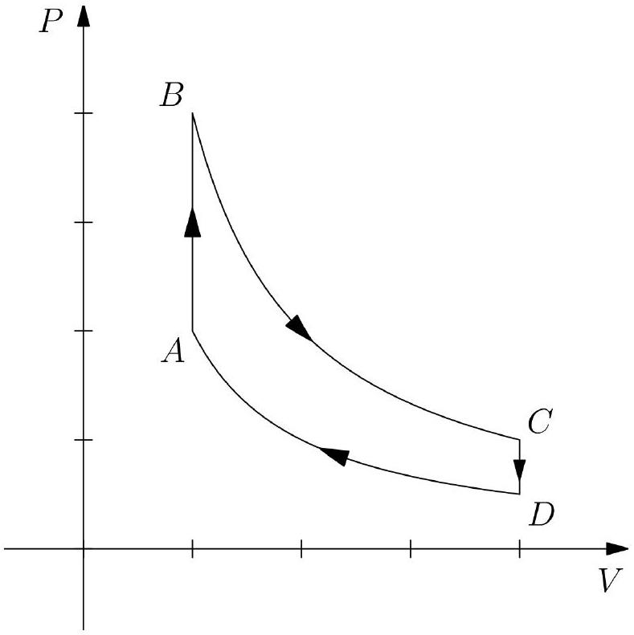
    (a) Consider a classical Otto engine, containing a gas with adiabatic index $\gamma$ with volumes $V _ { 1 }$ and $V _ { 2 }$ respectively at the two isochoric processes $\left( V _ { 1 } < V _ { 2 } \right)$. Determine the efficiency $\eta _ { c }$ of such an engine.

Solution: The efficiency $\eta$ of an engine is given by

$$
\eta = 1 - \frac { Q _ { \mathrm { out } } } { Q _ { \mathrm { in } } }
$$

The only heat transfer occurs during the isochoric processes. Using the equation $\Delta Q = C _ { v } \Delta T$ for an isochoric process, we have

$$
\eta _ { c } = 1 - \frac { T _ { C } - T _ { D } } { T _ { B } - T _ { A } }
$$

For an adiabatic process, $p V ^ { \gamma } =$ const. implies $T V ^ { \gamma - 1 } =$ const.. We may use this relation to obtain

$$
\begin{aligned}
\eta _ { c } & = 1 - \frac { T _ { B } \left( \frac { V _ { 1 } } { V _ { 2 } } \right) ^ { \gamma - 1 } - T _ { A } \left( \frac { V _ { 1 } } { V _ { 2 } } \right) ^ { \gamma - 1 } } { T _ { B } - T _ { A } } \\
& = 1 - \left( \frac { V _ { 1 } } { V _ { 2 } } \right) ^ { \gamma - 1 }
\end{aligned}
$$

Now, we will discuss the quantum Otto engine. For simplicity, consider a two-level atomic system with ground state and excited state energies $E _ { 0 } = 0$ and $E _ { 1 }$, and suppose the probabilities of existing in these states are $p _ { 0 }$ and $p _ { 1 }$ respectively. The average energy of the two-level atom is thus

$$
\langle E \rangle = p _ { 0 } E _ { 0 } + p _ { 1 } E _ { 1 } = p _ { 1 } E _ { 1 }
$$

Suppose the energy difference $E _ { 1 }$ between the two states can be adjusted throughout the cycle. The probability $p$ that the atom is in the energy state $E$ satisfies the Boltzmann distribution

$$
p \propto e ^ { - E / \left( k _ { B } T \right) }
$$

where $T$ is the temperature and $k _ { B }$ is the Boltzmann constant.

(b) When the quantum matter is in equilibrium with a heat reservoir of temperature $T$, write down expressions for the probabilities $p _ { 0 }$ and $p _ { 1 }$. Leave your answers in terms of $E _ { 1 } , k _ { B }$ and $T$.

Solution: We know that

$$
p _ { 1 } = p _ { 0 } \exp \left( - \frac { E _ { 1 } } { k _ { B } T } \right)
$$

Since $p _ { 0 } + p _ { 1 } = 1$, we have

$$
p _ { 0 } = \frac { 1 } { 1 + \exp \left( - \frac { E _ { 1 } } { k _ { B } T } \right) } \quad p _ { 1 } = \frac { \exp \left( - \frac { E _ { 1 } } { k _ { B } T } \right) } { 1 + \exp \left( - \frac { E _ { 1 } } { k _ { B } T } \right) }
$$

In a thermodynamical process, the energy change $d E$ can be written in terms of the change in work and heat using the First Law of Thermodynamics.

$$
d E = d W + d Q
$$

In a quasi-static quantum process, the change in average energy is given by differentiating the equation for average energy.

$$
d \langle E \rangle = p _ { 1 } d E _ { 1 } + E _ { 1 } d p _ { 1 }
$$

The quantum adiabatic theorem states that the probabilities of each quantum state remain effectively constant during an adiabatic process.

(c) Write an equation for $d \langle E \rangle$ in an adiabatic process. Leave your answer in terms of $p _ { 1 }$, $E _ { 1 }$ and their differentials.

Solution: Since the adiabatic theorem states that the probabilities of each state remain constant, the second term in the equation for $d \langle E \rangle$ goes to zero.

$$
d \langle E \rangle = p _ { 1 } d E _ { 1 }
$$

The von Neumann entropy $S$ is given by

$$
S = - k _ { B } \sum _ { i } p _ { i } \ln p _ { i }
$$

where $k _ { B }$ is the Boltzmann constant and $p _ { i }$ is the probability of the $i$-th state in the quantum system.

(d) Using the equation for von Neumann entropy, write an equation for $d \langle E \rangle$ in an isochoric process. Leave your answer in terms of $p _ { 1 } , E _ { 1 }$ and their differentials.

Solution: In an isochoric process, the work done is zero. The change in energy is then given by $d Q = T d S$. Let us first differentiate the expression for $S$.

$$
d S = - k _ { B } \sum _ { i } \left( 1 + \ln p _ { i } \right) d p _ { i }
$$

Knowing that $p _ { 0 } + p _ { 1 } = 1$, we have $d p _ { 0 } = - d p _ { 1 }$. Furthermore, since $p _ { 1 } =$ $p _ { 0 } \exp \left( - \frac { E _ { 1 } } { k _ { B } T } \right)$, we have $\ln p _ { 1 } = \ln p _ { 0 } - \frac { E _ { 1 } } { k _ { B } T }$. Upon substitution, we obtain our final answer.

$$
\begin{aligned}
d \langle E \rangle & = T d S \\
& = - k _ { B } T \sum _ { i } \left( 1 + \ln p _ { i } \right) d p _ { i } \\
& = - k _ { B } T \left( 1 + \ln p _ { 1 } - \frac { E _ { 1 } } { k _ { B } T } - 1 - \ln p _ { 1 } \right) d p _ { 1 } \\
& = E _ { 1 } d p _ { 1 }
\end{aligned}
$$

Solutions that arrive straight at the correct final answer from the first law will receive only 1.5 marks.

(e) Sketch the quantum Otto cycle on the axes $E _ { 1 }$ against $p _ { 1 }$, with arrows and labels for $A , B , C , D$. You may use the first law of thermodynamics, or your results from parts (c) and (d).

Solution: For an adiabatic process, we have $d \langle E \rangle = p _ { 1 } d E _ { 1 }$. For an isochoric process, we have $d \langle E \rangle = E _ { 1 } d p _ { 1 }$. Therefore, all processes in the Otto cycle correspond to straight lines on the $E _ { 1 } - p _ { 1 }$ diagram, so we end up with a rectangle.
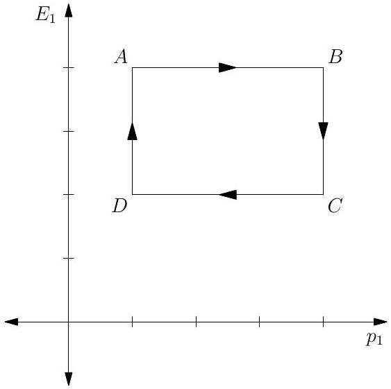
For a less rigorous derivation straight from the first law, we can notice that the two

equations for classical and quantum energy can each be partitioned into a term for work $\left( d W = p _ { 1 } d E _ { 1 } \right)$ and heat $\left( d Q = E _ { 1 } d p _ { 1 } \right)$.
(f) Compute the efficiency $\eta _ { q }$ of the quantum Otto cycle, in terms of the temperatures $T _ { B }$ and $T _ { C }$ at the states $B$ and $C$ respectively.

Solution: The efficiency is

$$
\eta _ { q } = 1 - \frac { Q _ { \mathrm { out } } } { Q _ { \mathrm { in } } }
$$

Since heat exchange only occurs during the isochoric processes, we have

$$
\eta _ { q } = 1 - \frac { E _ { B } \left( p _ { B } - p _ { A } \right) } { E _ { C } \left( p _ { B } - p _ { A } \right) } = 1 - \frac { E _ { B } } { E _ { C } }
$$

Since $p _ { B } = p _ { C }$, we have

$$
\frac { \exp \left( - \frac { E _ { B } } { k _ { B } T _ { B } } \right) } { 1 + \exp \left( - \frac { E _ { B } } { k _ { B } T _ { B } } \right) } = \frac { \exp \left( - \frac { E _ { C } } { k _ { B } T _ { C } } \right) } { 1 + \exp \left( - \frac { E _ { C } } { k _ { B } T _ { C } } \right) }
$$

Simplifying, we have $\frac { E _ { B } } { T _ { B } } = \frac { E _ { C } } { T _ { C } }$, so the efficiency is

$$
\eta _ { q } = 1 - \frac { T _ { C } } { T _ { B } }
$$

| Marking Scheme: |  |  |
| :--- | :--- | :--- |
| Part | Steps | Marks |
| (a) | Writing $\eta = 1 - \frac { Q _ { \text {out } } } { Q _ { \text {in } } }$ or equivalent Computing $Q _ { \text {out } } , Q _ { \text {in } }$ and/or $W$ accurately Correct final answer | M0.5 M1.5 A1 |
| (b) | Writing down $p _ { 1 }$ in terms of $p _ { 0 }$ Correct final answer | M0.5 A0.5 |
| (c) | Correct final answer | A1 |
| (d) | Correct differentiation of $S d Q = T d S$ Expressing $p _ { 0 }$ and $d p _ { 0 }$ in terms of $p _ { 1 }$ and $d p _ { 1 }$ Correct final answer | M0.5 M0.5 M0.5 A1 |
| (e) | Correct interpretation of $E _ { 1 } d p _ { 1 }$ and $p _ { 1 } d E _ { 1 }$ Correct $E _ { 1 } - p _ { 1 }$ diagram shape Correct labels on rectangle | M1 A1 A0.5 |
| (f) | Correct values of $Q _ { \text {in } }$ and $Q _ { \text {out } } \eta _ { q } = 1 - \frac { E _ { C } } { E _ { B } }$ Making use of $p _ { B } = p _ { C }$ to relate $T _ { B }$ and $T _ { C }$ Correct final answer | M0.5 M0.5 M0.5 A0.5 |
| This problem is adapted from a Chinese Physics Olympiad. |  |  |

9. When stars collapse, over 97\% of them become white dwarves. These are extremely dense bodies consisting largely of degenerate electron matter and some ions. Unlike stars, the white dwarves can no longer support itself against gravitational collapse by its gas pressure, and instead the electron degeneracy pressure dominates.
For the free electrons in white dwarves, we must use a quantum mechanical description. We can define their number density of state $g ( p )$ as:
$$
g ( p ) d p = \frac { 8 \pi } { h ^ { 3 } } p ^ { 2 } d p
$$
where $p$ is the momentum of the state and $h$ is Planck's constant. In other words, in a volume $d V$, there are $g ( p ) d p d V$ states of momentum $p$ that may be occupied by an electron.
To describe the probability in which these states are occupied, we can apply Fermi-Dirac statistics, which tells us that a state of energy $\varepsilon$ has an average occupation probability $f ( \varepsilon )$ :
$$
f ( \varepsilon ) = \frac { 1 } { \exp \left( \frac { \varepsilon - \mu } { k T } \right) + 1 }
$$
where $k$ is the Boltzmann constant, $T$ is the temperature and $\mu$ is an energy term known as the chemical potential.
    (a) Show that the pressure $P$ due to the free electrons is given by:
$$
P = \frac { 8 \pi } { 3 h ^ { 3 } } \int _ { 0 } ^ { \infty } \frac { p ^ { 3 } } { \exp \left( \frac { \varepsilon - \mu } { k T } \right) + 1 } v ( p ) d p
$$
where $v ( p )$ is the magnitude of the velocity of an electron as a function of its momentum $p$.

Solution: The pressure can be seen as the momentum flux through a unit surface. Firstly, we can get the actual electron number density by multiplying the number density of states with the probability that that state is occupied:

$$
n ( p ) = g ( p ) f ( \varepsilon ( p ) )
$$

Consider a flat surface with area $d S$, placed in a spherical coordinate system at its origin. In unit time $d t$, the number of electrons hitting the surface from a polar angle $\theta$ and azimuthal angle $\phi$ with velocity $v$ is given by $n ( p )$ multiplied by the volume of the parallelepiped with base $d S$ and height $v d t \cos \theta$. The fraction of the electrons which come from any angle is uniform, and given by $\frac { \sin \theta d \theta d \phi } { 4 \pi }$. Since the net momentum is in the directional perpendicular to the surface, we only want the perpendicular component of the momentum $p \cos \theta$. Integrating across the upper a spherical shell, and across all values of $p$, the total perpendicular momentum transferred through the surface in time $d t$ is given by:

$$
\int _ { 0 } ^ { \infty } \int _ { 0 } ^ { 2 \pi } \int _ { 0 } ^ { \pi } n ( p ) d S v d t \cos \theta p \cos \theta \frac { \sin \theta d \theta d \phi } { 4 \pi } d p
$$

We divide by $d S$ and $d t$ to get the momentum transferred per unit surface and per

unit time.

$$
\begin{aligned}
P & = \int _ { 0 } ^ { \infty } \int _ { 0 } ^ { 2 \pi } \int _ { 0 } ^ { \pi } n ( p ) v ( p ) p \cos ^ { 2 } \theta \frac { \sin \theta d \theta d \phi } { 4 \pi } d p \\
& = \frac { 1 } { 3 } \int _ { 0 } ^ { \infty } n ( p ) v ( p ) p d p \\
& = \frac { 8 \pi } { 3 h ^ { 3 } } \int _ { 0 } ^ { \infty } \frac { p ^ { 3 } } { \exp \left( \frac { \varepsilon - \mu } { k T } \right) + 1 } v ( p ) d p
\end{aligned}
$$

Alternatively, answers using a simpler model exploiting symmetry may obtain full credit if explained clearly.

We now make the assumption that the electron gas is fully degenerate. This means that all the electron states are occupied up till the state with Fermi momentum $p _ { f }$, and no electron states above that are occupied. This is equivalent to assuming zero temperature for the gas, and the energy of the electron is equal to $\mu$ when it occupies the state with momentum $p _ { f }$.

(b) Under this assumption, show that the pressure $P$ can be simplified to:
$$
P = \frac { 8 \pi } { 3 h ^ { 3 } } \int _ { 0 } ^ { p _ { f } } p ^ { 3 } v ( p ) d p
$$

Solution: With the zero temperature assumption, the Fermi-Dirac distribution simplifies to a step function. When $\varepsilon < \mu , \exp \left( \frac { \varepsilon - \mu } { k T } \right) = 0$ and $f ( \varepsilon ) = 1$. On the other hand, when $\varepsilon > \mu , \exp \left( \frac { \varepsilon - \mu } { k T } \right)$ tends towards infinity and $f ( \varepsilon ) = 0$. With this in mind, any momentum values above $p _ { f }$ in the integral all go to zero, and we can simplify the denominator to 1 . This leaves us with the desired equation:

$$
P = \frac { 8 \pi } { 3 h ^ { 3 } } \int _ { 0 } ^ { p _ { f } } p ^ { 3 } v ( p ) d p
$$

(c) Determine an expression for $n _ { e }$, the number density of electrons. Assume that the electron gas is fully degenerate. Leave your answer in terms of $h$ and $p _ { f }$.

Solution: With the assumption that the electron is fully degenerate, we consider all states above momentum $p _ { f }$ to be empty and all states below momentum $p _ { f }$ to be fully filled. We can integrate $g ( p ) d p$ from 0 to $p _ { f }$ to obtain:

$$
\begin{aligned}
n _ { e } & = \frac { 8 \pi } { h ^ { 3 } } \int _ { 0 } ^ { p _ { f } } p ^ { 2 } d p \\
& = \frac { 8 \pi } { 3 h ^ { 3 } } p _ { f } ^ { 3 }
\end{aligned}
$$

(d) Assume that the electrons only move non-relativistically. Determine the pressure $P$ for the electron cloud. Leave your answer in terms of $h , m _ { e }$ and $n _ { e }$.

Solution: For non-relativistic particles, $v \ll c$. The velocity $v$ is given by $\frac { p } { m _ { e } }$, so the integral for pressure becomes:

$$
\begin{aligned}
P & = \frac { 8 \pi } { 3 h ^ { 3 } m _ { e } } \int _ { 0 } ^ { p _ { f } } p ^ { 4 } d p \\
& = \frac { 8 \pi } { 15 h ^ { 3 } m _ { e } } p _ { f } ^ { 5 }
\end{aligned}
$$

Substuting the expression for $n _ { e }$, we have:

$$
P = \frac { 1 } { 20 } \left( \frac { 3 } { \pi } \right) ^ { \frac { 2 } { 3 } } \frac { h ^ { 2 } } { m _ { e } } n _ { e } ^ { \frac { 5 } { 3 } }
$$

Unlike the electrons in the white dwarf, the ions can be described using classical ideal gas equations. Consider the white dwarf Sirius B, which we assume to be purely carbon such that the number of ions $n _ { i }$ is given by $6 n _ { i } = n _ { e }$. The electrons here move non-relativistically.

(e) Estimate the numerical ratio of pressures exerted by the electrons to the ions $\frac { P _ { e } } { P _ { i } }$. The mean density of Sirius B is $2.38 \times 10 ^ { 9 } \mathrm {~kg} \mathrm {~m} ^ { - 3 }$ and its temperature can be estimated to be 25000 K. Despite the non-zero temperature, assume that your result in part (d) remains valid.

Solution: The equation of state for the ions is given by the ideal gas equation:

$$
P _ { i } = n _ { i } k T
$$

Since the number of ions and electrons is fairly similar and the mass of each ion is much greater than each electron, we can make the approximation $\rho \approx n _ { i } m _ { i }$, where $m _ { i } = 12 \mathrm { u }$ for carbon. Then, $n _ { e } = 6 \frac { \rho } { m _ { i } }$. Upon plugging in numerical values, we obtain:

$$
\begin{aligned}
\frac { P _ { e } } { P _ { i } } & = \frac { \frac { 1 } { 20 } \left( \frac { 3 } { \pi } \right) ^ { \frac { 2 } { 3 } } \frac { h ^ { 2 } } { m _ { e } } n _ { e } ^ { \frac { 5 } { 3 } } } { n _ { i } k T } \\
& \approx 3.3 \times 10 ^ { 5 }
\end{aligned}
$$

This confirms that the pressure in a white dwarf is mostly due to electrons rather than ions.

| Marking Scheme: |  |  |
| :--- | :--- | :--- |
| Part | Steps | Marks |
| (a) | Electron number density $n ( p )$ | M0.5 |
|  | Forming the triple integral accurately | M1 |
|  | Each inaccurate reasoning step (e.g. using $p$ instead of $p \cos \theta$ ) | -M0.3 |
| (b) | Performing the integration accurately | M0.5 |
|  | Noticing the step function | M1 |
|  | Setting momentum values to 0 and 1 | M0.5 |
| (c) | Setting appropriate limits for integration | M1 |
|  | Correct final answer | A0.5 |
| (d) | Identifying $v ( p )$ for non-relativistic particles | M0.3 |
|  | Substitution and integration | M0.5 |
|  | Correct final answer | A0.7 |
| (e) | Writing the ideal gas equation | M0.5 |
|  | $n _ { e } = 6 \frac { \rho } { m _ { i } }$ | M0.5 |
|  | Correct final answer | A0.5 |

Fundamental Physical Constants - Frequently used constants
| Quantity | Symbol | Value | Unit | Relative std. uncert. $u _ { \mathrm { r } }$ |
| :--- | :--- | :--- | :--- | :--- |
| speed of light in vacuum | $c$ | 299792458 | $\mathrm { m } \mathrm { s } ^ { - 1 }$ | exact |
| Newtonian constant of gravitation | $G$ | $6.67430 ( 15 ) \times 10 ^ { - 11 }$ | $\mathrm { m } ^ { 3 } \mathrm {~kg} ^ { - 1 } \mathrm {~s} ^ { - 2 }$ | $2.2 \times 10 ^ { - 5 }$ |
| Planck constant* | $h$ | $6.62607015 \times 10 ^ { - 34 }$ | $\mathrm { J } \mathrm { Hz } ^ { - 1 }$ | exact |
|  | ћ | $1.054571817 \ldots \times 10 ^ { - 34 }$ | J s | exact |
| elementary charge | $e$ | $1.602176634 \times 10 ^ { - 19 }$ | C | exact |
| vacuum magnetic permeability $4 \pi \alpha \hbar / e ^ { 2 } c$ | $\mu _ { 0 }$ | $1.25663706127 ( 20 ) \times 10 ^ { - 6 }$ | $\mathrm { N } \mathrm { A } ^ { - 2 }$ | $1.6 \times 10 ^ { - 10 }$ |
| vacuum electric permittivity $1 / \mu _ { 0 } c ^ { 2 }$ | $\epsilon _ { 0 }$ | $8.8541878188 ( 14 ) \times 10 ^ { - 12 }$ | $\mathrm { F } \mathrm { m } ^ { - 1 }$ | $1.6 \times 10 ^ { - 10 }$ |
| Josephson constant $2 e / h$ | $K _ { \mathrm { J } }$ | $483597.8484 \ldots \times 10 ^ { 9 }$ | $\mathrm { Hz } \mathrm { V } ^ { - 1 }$ | exact |
| von Klitzing constant $\mu _ { 0 } c / 2 \alpha = 2 \pi \hbar / e ^ { 2 }$ | $R _ { \mathrm { K } }$ | $25812.80745 \ldots$ | $\Omega$ | exact |
| magnetic flux quantum $2 \pi \hbar / ( 2 e )$ | $\Phi _ { 0 }$ | $2.067833848 \ldots \times 10 ^ { - 15 }$ | Wb | exact |
| conductance quantum $2 e ^ { 2 } / 2 \pi \hbar$ | $G _ { 0 }$ | $7.748091729 \ldots \times 10 ^ { - 5 }$ | S | exact |
| electron mass | $m _ { \mathrm { e } }$ | $9.1093837139 ( 28 ) \times 10 ^ { - 31 }$ | kg | $3.1 \times 10 ^ { - 10 }$ |
| proton mass | $m _ { \mathrm { p } }$ | $1.67262192595 ( 52 ) \times 10 ^ { - 27 }$ | kg | $3.1 \times 10 ^ { - 10 }$ |
| proton-electron mass ratio | $m _ { \mathrm { p } } / m _ { \mathrm { e } }$ | 1836.152673 426(32) |  | $1.7 \times 10 ^ { - 11 }$ |
| fine-structure constant $e ^ { 2 } / 4 \pi \epsilon _ { 0 } \hbar c$ | $\alpha$ | $7.2973525643 ( 11 ) \times 10 ^ { - 3 }$ |  | $1.6 \times 10 ^ { - 10 }$ |
| inverse fine-structure constant | $\alpha ^ { - 1 }$ | 137.035999 177(21) |  | $1.6 \times 10 ^ { - 10 }$ |
| Rydberg frequency $\alpha ^ { 2 } m _ { \mathrm { e } } c ^ { 2 } / 2 h$ | $c R _ { \infty }$ | $3.2898419602500 ( 36 ) \times 10 ^ { 15 }$ | Hz | $1.1 \times 10 ^ { - 12 }$ |
| Boltzmann constant | $k$ | $1.380649 \times 10 ^ { - 23 }$ | $\mathrm { J } \mathrm { K } ^ { - 1 }$ | exact |
| Avogadro constant | $N _ { \mathrm { A } }$ | $6.02214076 \times 10 ^ { 23 }$ | $\mathrm { mol } ^ { - 1 }$ | exact |
| molar gas constant $N _ { \mathrm { A } } k$ | $R$ | 8.314462618 … | $\mathrm { J } \mathrm { mol } ^ { - 1 } \mathrm {~K} ^ { - 1 }$ | exact |
| Faraday constant $N _ { \mathrm { A } } e$ | $F$ | $96485.33212 \ldots$. | $\mathrm { C } \mathrm { mol } ^ { - 1 }$ | exact |
| Stefan-Boltzmann constant $\left( \pi ^ { 2 } / 60 \right) k ^ { 4 } / \hbar ^ { 3 } c ^ { 2 }$ | $\sigma$ | $5.670374419 \ldots \times 10 ^ { - 8 }$ | $\mathrm { W } \mathrm { m } ^ { - 2 } \mathrm {~K} ^ { - 4 }$ | exact |
| Non-SI units accepted for use with the SI |  |  |  |  |
| electron volt ( $e / \mathrm { C }$ ) J | eV | $1.602176634 \times 10 ^ { - 19 }$ | J | exact |
| (unified) atomic mass unit $\frac { 1 } { 12 } m \left( { } ^ { 12 } \mathrm { C } \right)$ | u | $1.66053906892 ( 52 ) \times 10 ^ { - 27 }$ | kg | $3.1 \times 10 ^ { - 10 }$ |

[^0]

[^0]:    * The energy of a photon with frequency $\nu$ expressed in unit Hz is $E = h \nu$ in J. Unitary time evolution of the state of this photon is given by $\exp ( - i E t / \hbar ) | \varphi \rangle$, where $| \varphi \rangle$ is the photon state at time $t = 0$ and time is expressed in unit s. The ratio $E t / \hbar$ is a phase.
