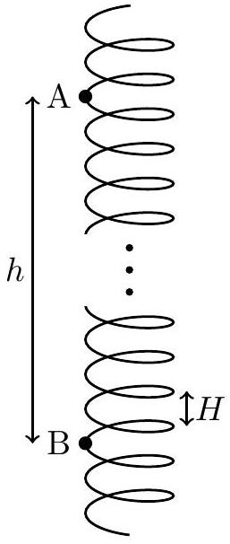

3. A continuous rigid helix of uniform density has mass $m$ and radius $R$. Its axis is oriented vertically, and the vertical distance between each helix turn is $H = \pi R$. The helix is able to rotate freely about its vertical axis but remains translationally fixed in place. It does not undergo compression nor extension.
A small bead of identical mass $m$ is threaded onto the frictionless helix. It is released from rest at point A and allowed to slide downwards along the helix.

    (a) Find the helix angle $\theta$ of the helix. The helix angle is the slope angle with respect to the horizontal, if the helix is unravelled.
Solution: For every horizontal distance $2 \pi R$ travelled along the helix, a vertical distance $H$ is travelled. This gives us:
$$
\begin{aligned}
\tan \theta & = \frac { H } { 2 \pi R } = \frac { 1 } { 2 } \\
\theta & = \arctan \frac { 1 } { 2 }
\end{aligned}
$$
    (b) When the ball passes point B , located a vertical distance $h$ directly below A , determine the angular velocity of the helix. If required, leave your answer in terms of $\theta$.
Solution: As the ball slides down the helix, it acquires angular momentum about the helix axis. Since the only external force on this system is gravity, which exerts no torque about the helix axis, the total angular momentum of the system is conserved at zero. The helix must thus be rotating in the opposite direction as the translational velocity of the ball.
Let the magnitude of the angular velocity of the helix be $\omega$, and let the velocity of the ball in the frame of the helix be $v ^ { \prime }$. The components of the ball velocity in the lab frame in the horizontal and vertical directions are:
$$
\begin{aligned}
v _ { \| } & = v ^ { \prime } \cos \theta - \omega R \\
v _ { \perp } & = v ^ { \prime } \sin \theta
\end{aligned}
$$
Applying conservation of angular momentum, we have:
$$
\begin{aligned}
m v _ { \| } R - m R ^ { 2 } \omega & = 0 \\
v ^ { \prime } \cos \theta - \omega R & = \omega R
\end{aligned}
$$

Applying conservation of energy, we have:

$$
\begin{aligned}
m g h & = \frac { 1 } { 2 } m \left( v _ { \| } ^ { 2 } + v _ { \perp } ^ { 2 } \right) + \frac { 1 } { 2 } m R ^ { 2 } \omega ^ { 2 } \\
2 g h & = \left( v ^ { \prime } \cos \theta - \omega R \right) ^ { 2 } + \left( v ^ { \prime } \sin \theta \right) ^ { 2 } + R ^ { 2 } \omega ^ { 2 }
\end{aligned}
$$

Solving these two equations simultaneously for $v ^ { \prime }$ and $\omega$, we obtain:

$$
\omega = \frac { \sqrt { g h } } { R } \frac { \cos \theta } { \sqrt { 1 + \sin ^ { 2 } \theta } }
$$
