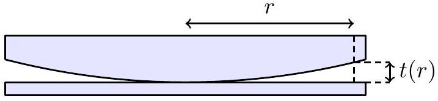
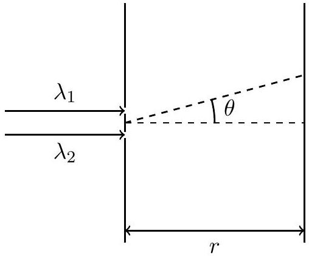

## 7. Part A: Thin Lens Interference

A plano-convex lens with radius of curvature $R$ and refractive index $n$ is placed on top of a flat glass plate such that there is a small air gap between the curved surface and the plate.

(a) Consider the thickness $t ( r )$ of the air gap as a function of radial distance $r$ from the centre of the lens. Determine $t ( r )$ to leading order in $r$.

Solution: Applying Pythagoras' Theorem, we use the fact that $t \ll R$ to show that:

$$
\begin{aligned}
R ^ { 2 } & = r ^ { 2 } + ( R - t ( r ) ) ^ { 2 } \\
& \approx r ^ { 2 } + R ^ { 2 } - 2 R t ( r ) \\
t ( r ) & \approx \frac { r ^ { 2 } } { 2 R }
\end{aligned}
$$

(b) Collimated light of wavelength $\lambda$ is incident on the lens. Determine the the radial position $r _ { m }$ of the $m ^ { \text {th } }$ bright fringe. Assume that the incident light and reflected light is always approximately normal to both the lens and plate.

Solution: In order for constructive interference to occur, the phase difference between a ray that is reflected off the bottom surface of the lens and a ray transmitted and reflected off the glass plate must be an integer multiple of $2 \pi$.
The transmitted ray travels an extra distance $2 t$, equivalent to a phase angle $\frac { 4 \pi t } { \lambda }$. Furthermore, as it is reflected within a medium of lower refractive index, whereas the other ray is reflected within a medium of higher refractive index, it gains an additional phase $\pi$. Thus we have:

$$
\begin{aligned}
\frac { 4 \pi t } { \lambda } + \pi & = 2 \pi m \\
\frac { 2 \pi r _ { m } ^ { 2 } } { \lambda R } + \pi & = 2 \pi m \\
r _ { m } & = \sqrt { \left( m - \frac { 1 } { 2 } \right) \lambda R }
\end{aligned}
$$

## Part B: Double Slit Diffraction

We consider two-slit diffraction, but with collimated light of speed $c$ and two different wavelengths $\lambda _ { 1 } , \lambda _ { 2 }$ entering the two slits respectively. The two slits are separated by distance $d$. For simplicity, we project onto a screen placed a distance $r$ away, and define the angular position $\theta$ at the screen as shown in the figure. Assume $r \gg d \gg \lambda _ { 1 } , \lambda _ { 2 }$. Set the phases of the two waves at the slit to be $\phi = 0$.

(c) Let the electric field through each slit have amplitude $E _ { 0 }$. Find the amplitude of the total electric field at an angle $\theta$ on the screen, at an arbitrary time $t$. Express your answer as a product of cosines or sines. (Hint: You may use the identity $\cos A + \cos B =$ $2 \cos \frac { A + B } { 2 } \cos \frac { A - B } { 2 }$. You may choose to define your own variables to simplify your final answer.)

Solution: The major difference between this and usual diffraction is that both the wavenumber and frequency are different. The wavenumber is $k = \frac { 2 \pi } { \lambda }$ and the frequency is $\omega = c k$. The amplitude is

$$
E _ { 1,2 } = E _ { 0 } \cos \left[ \frac { 2 \pi } { \lambda _ { 1,2 } } \cdot \left( r \pm \frac { d } { 2 } \sin \theta - c t \right) \right]
$$

The resulting diffraction pattern is $E = E _ { 1 } + E _ { 2 }$, therefore

$$
E = E _ { 0 } \left[ \cos \left[ \frac { 2 \pi } { \lambda _ { 1 } } \cdot \left( r + \frac { d } { 2 } \sin \theta - c t \right) \right] + \cos \left[ \frac { 2 \pi } { \lambda _ { 2 } } \cdot \left( r - \frac { d } { 2 } \sin \theta - c t \right) \right] \right]
$$

For simplicity, we use the wavenumber $k = \frac { 2 \pi } { \lambda }$. Let $\bar { k } = \frac { k _ { 1 } + k _ { 2 } } { 2 } , \delta k = \frac { k _ { 1 } - k _ { 2 } } { 2 }$. Using the sum to product formula $\cos A + \cos B = 2 \cos \frac { A + B } { 2 } \cos \frac { A - B } { 2 }$, we have

$$
E = 2 E _ { 0 } \cos \left( \bar { k } ( r - c t ) + \delta k \frac { d \sin \theta } { 2 } \right) \cos \left( \delta k ( r - c t ) + \bar { k } \frac { d \sin \theta } { 2 } \right)
$$

Writing $\frac { r } { \cos \theta }$ instead of $r$ as approximated in the solution gets full credit. Including an additional $\frac { 1 } { \sqrt { r \cos \theta } }$ term to account for the falloff of intensity of cylindrical waves with a larger surface area also gets full credit.

(d) Now suppose $\lambda _ { 1 } = \lambda - \delta \lambda , \lambda _ { 2 } = \lambda + \delta \lambda$, where $\delta \lambda \ll \lambda$. Consider the time average to be taken over the period corresponding to $\lambda$. Find the intensity pattern $I ( \theta , t )$. State the angles which correspond to maxima and minima, and comment on how the positions of these maxima and minima near $\theta = 0$ change with time. You may use appropriate approximations.

Solution: Let $k = \frac { 2 \pi } { \lambda }$, then to first order, $k _ { 1 } \approx k \left( 1 + \frac { \delta \lambda } { \lambda } \right) , k _ { 2 } \approx k \left( 1 - \frac { \delta \lambda } { \lambda } \right)$. Let $\delta k = k \frac { \delta \lambda } { \lambda }$. Then

$$
E = 2 E _ { 0 } \cos \left( k ( r - c t ) + \frac { d \sin \theta } { 2 } \delta k \right) \cos \left( \delta k ( r - c t ) + k \frac { d \sin \theta } { 2 } \right)
$$

We may assume that since $\delta k \ll k$, the value of the second cosine hardly changes as $t$ varies. Therefore we only need to compute the first cosine, which averages to $\frac { 1 } { 2 }$.

$$
\begin{aligned}
I & \approx 2 \epsilon _ { 0 } E _ { 0 } ^ { 2 } \cos ^ { 2 } \left( \delta k ( r - c t ) + k \frac { d \sin \theta } { 2 } \right) \\
& \approx \epsilon _ { 0 } E _ { 0 } ^ { 2 } [ 1 + \cos ( 2 \delta k ( r - c t ) + k d \sin \theta ) ] \\
& \approx \epsilon _ { 0 } E _ { 0 } ^ { 2 } \left[ 1 + \cos \left( 2 k \frac { \delta \lambda } { \lambda } ( r - c t ) + k d \sin \theta \right) \right]
\end{aligned}
$$

The maxima correspond to:

$$
\begin{aligned}
2 \delta k ( r - c t ) + k d \sin \theta & = 2 \pi n , n \in \mathbb { N } \\
d \sin \theta _ { \text {minima } } & = n \lambda - 2 \frac { \delta \lambda } { \lambda } ( r - c t ) , n \in \mathbb { N }
\end{aligned}
$$

Similarly,

$$
d \sin \theta _ { \text {maxima } } = \left( n + \frac { 1 } { 2 } \right) \lambda - 2 \frac { \delta \lambda } { \lambda } ( r - c t ) , n \in \mathbb { N }
$$

Near $\theta = 0$, we may use the small angle approximation, which leads us to conclude that the positions of maxima move with angular velocity:

$$
\frac { d \theta _ { \text {maxima } , \text { minima } } } { d t } = 2 \frac { \delta \lambda } { \lambda } \frac { r } { d } c
$$

| Marking Scheme: |  |  |
| :--- | :--- | :--- |
| Part | Steps | Marks |
| (a) | Correct distance expression $t \ll R$ Correct final answer | M0.5 M0.2 A0.8 |
| (b) | Recognising that constructive interference occurs when phase difference is an integer multiple of $2 \pi$ Correct phase difference due to extra distance travelled Correct phase difference due to reflection Correct final answer $m + \frac { 1 } { 2 }$ instead of $m - \frac { 1 } { 2 }$ in the final answer is awarded 2/2.5 marks | M0.5 M1.0 M0.5 A0.5 |
| (c) | Wave formula $\cos ( k r - \omega t )$ or $e ^ { i ( k r - \omega t ) }$ with Real Part stated. Correct inclusion of different wavelengths / wavenumbers, frequencies, and path length difference. Use of sum-to-product formula or correct taking of real parts. Answer matches up to a phase difference (i.e. sin or cos). | M1 M1 A1 |
| (d) | First order approximation of wavenumber or equivalent. Approximation of second cosine as constant during integral. Answer matches for minima and maxima, comment about speed of movement $\frac { d \theta _ { \text {maxima } , \text { minima } } } { d t } = 2 \frac { \delta \lambda } { \lambda } c$. | M1 M1 A1 |
