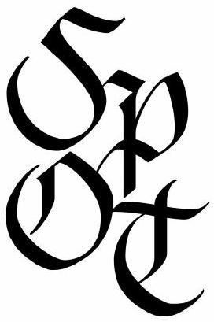

## 2026 Selection Test

for the International Physics Olympiad (IPhO), Asian Physics Olympiad (APhO) and International Nuclear Science Olympiad (INSO)

Name: $\_\_\_\_$

a. This is a 4 hour test. Attempt all questions. The maximum total score is 100 ; marks allocated for each question part are indicated in square brackets.
b. Check that there are a total of 38 printed pages (including this cover page and the table of physical constants).
c. Begin your answer for each question on a fresh sheet of paper, and present your working and answers clearly. Your answer sheets should be sorted according to the order of the questions.
d. Write your name on the top right hand corner of every answer sheet you submit.
e. Submit this question paper and all your working sheets. No paper, whether used or unused, may be taken out of this examination room.
f. You may use a standard (non-programmable) scientific calculator in accordance with the statutes of the International Physics Olympiad.
g. No books or documents relevant to the test may be brought into the examination room.

| Question: | 1 | 2 | 3 | 4 | 5 | 6 | 7 | 8 | 9 | 10 | Total |
| :--- | :--- | :--- | :--- | :--- | :--- | :--- | :--- | :--- | :--- | :--- | :--- |
| Points: | 9 | 9 | 4 | 10 | 10 | 10 | 7 | 8 | 15 | 18 | 100 |
| Score: |  |  |  |  |  |  |  |  |  |  |  |

1. (a) A sailboat is moving in stationary water. A wind with uniform density and horizontal speed $v _ { 0 }$ (relative to the ground) is blowing perpendicularly to the surface of the sail. Find the speed of the sailboat where the wind exerts maximum power.
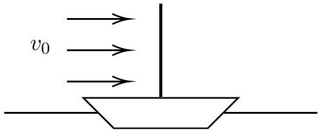
Solution: Let the speed of the boat be $v$ and density of air be $\rho$. In this frame, the incoming air has velocity $v _ { 0 } - v$. Hence, it exerts a force proportional to $\rho \left( v _ { 0 } - v \right) ^ { 2 }$. Since the question asks for power, and $P = F v$, we get that $P \propto \left( v _ { 0 } - v \right) ^ { 2 } v$. We can maximise this
$$
\frac { \mathrm { d } P } { \mathrm {~d} v } = \left( v _ { 0 } - v \right) ^ { 2 } - 2 \left( v _ { 0 } - v \right) v = 0 \Longrightarrow v = \frac { v _ { 0 } } { 3 }
$$
    (b) A circular uniform disk is initially rotating about point $P _ { 1 }$ on its circumference at a constant angular velocity $\omega _ { 1 }$. If point $P _ { 1 }$ is suddenly released and another point $P _ { 2 }$ on the circumference is simultaneously fixed in place, what is the new angular velocity of the disk $\omega _ { 2 }$ about $P _ { 2 }$. Take angle $\angle P _ { 1 } O P _ { 2 }$ to be $\theta$.
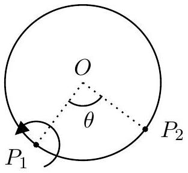

Solution: The initial angular momentum about $P _ { 2 }$ is

$$
L _ { i } = m R ^ { 2 } \omega _ { 1 } \cos \theta + \frac { 1 } { 2 } M R ^ { 2 } \omega _ { 1 }
$$

The final angular momentum about $P _ { 2 }$ is

$$
L _ { f } = \frac { 3 } { 2 } M R ^ { 2 } \omega _ { 2 }
$$

Conserving angular momentum about $P _ { 2 }$ and solving gives us

$$
\omega _ { 2 } = \left( \frac { 1 + 2 \cos \theta } { 3 } \right) \omega _ { 1 }
$$

We can check this by noting that when $\theta = \pi$ or 0, we get the intuitive result $\omega _ { 2 } = \omega _ { 1 }$. When $\theta = 2 \pi / 3$, our answer is surprisingly 0.

Alternative Solution: It is also possible to solve it using an impulse approach, although it will be a lot more tedious. We first consider the initial COM velocity as $\overrightarrow { v _ { 1 } } = \overrightarrow { \omega _ { 1 } } \times \overrightarrow { O P _ { 1 } }$ and final COM velocity as $\overrightarrow { v _ { 2 } } = \overrightarrow { \omega _ { 2 } } \times \overrightarrow { O P } _ { 2 }$. Then, the impulse

is $\Delta \vec { p } = m \left( \overrightarrow { v _ { 2 } } - \overrightarrow { v _ { 1 } } \right)$ and the change in angular momentum about the COM is $I \overrightarrow { \omega _ { 1 } } + \Delta \vec { p } \times O \overrightarrow { P _ { 2 } } = I \overrightarrow { \omega _ { 2 } }$. Substituting in the explicit expression for $\Delta \vec { p }$, we get
$$
I \overrightarrow { \omega _ { 1 } } + m \left( \overrightarrow { \omega _ { 2 } } \times \overrightarrow { O P _ { 2 } } - \overrightarrow { \omega _ { 1 } } \times \overrightarrow { O P _ { 1 } } \right) \times \overrightarrow { O P _ { 2 } } = I \overrightarrow { \omega _ { 2 } }
$$
and we can subsequently solve for $\omega _ { 2 }$ in terms of $\omega _ { 1 }$.
(c) A cylindrical disk of radius $R$ lies flat on a smooth horizontal surface and is fixed in place. An inextensible thread is tightly wound on the disk, and the free end is attached to a small puck with mass $m$. The length of the free part of the thread is $\ell _ { 0 }$. The puck is initially given a velocity $v$ perpendicular to the thread. Assuming the thread can only withstand some maximum tension $T$, explain whether the puck be able to reach the disk. If yes, find the time taken for the puck to hit the disk. If not, find the time taken for the thread to break in terms of $T$ and other relevant constants.
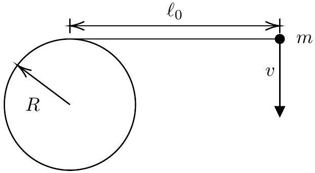

Solution: Since the thread is inextensible and always under stress, the tension force always points perpendicular to the displacement and does zero work. Hence, the speed of the puck remains constant. The tension force provides centripetal acceleration

$$
T = \frac { m v ^ { 2 } } { \ell }
$$

As $\ell \rightarrow 0 , T \rightarrow \infty$ and the thread eventually breaks. It is therefore not possible for the puck to hit the cylinder. In time $\mathrm { d } t$, the length of the rope decreases by $\omega R \mathrm {~d} t$. We also have $\omega = v / \ell$ from geometry. Hence, we can form a differential equation

$$
\mathrm { d } \ell = - \frac { v } { \ell } R \mathrm {~d} t \Longrightarrow \ell ^ { 2 } - \ell _ { 0 } ^ { 2 } = - 2 v R t
$$

The final $\ell$ before breaking is $m v ^ { 2 } / T$. Rearranging gives us

$$
t = \frac { \ell _ { 0 } ^ { 2 } T ^ { 2 } - m ^ { 2 } v ^ { 4 } } { 2 R v T ^ { 2 } }
$$

Marking Scheme:

| Part | Steps | Marks |
| :--- | :--- | :--- |
| (a) | Power is $P = F v$ | M0.5 |
|  | Force $F \propto \left( v _ { 0 } - v \right) ^ { 2 }$ | M0.5 |
|  | $v = \frac { v _ { 0 } } { 3 }$ | A1 |
| (b) | Angular momentum is conserved | M0.5 |
|  | dinitial angular momentum | M0.75 |
|  | Correct final angular momentum | M0.75 |
|  | Final angular velocity $\omega _ { 2 } = \left( \frac { 1 + 2 \cos \theta } { 3 } \right) \omega _ { 1 }$ | A0.5 |
| (c) | Workdone by $T$ is 0/energy is conserved/ $v$ is constant | M0.5 |
|  | Realising that the string will always break | M0.5 |
|  | Correct differential equation relating $d \ell$ and $d t$ (if missing minus sign subtract 0.5) 0 | M1.5 |
|  | DE solved correctly | M0.5 |
|  | Correct answer $t = \frac { \ell _ { 0 } ^ { 2 } T ^ { 2 } - m ^ { 2 } v ^ { 4 } } { 2 R v T ^ { 2 } }$ | A1 |

2. In the figure below, we have an electrical circuit consisting of a DC voltage source $U _ { 0 }$, capacitor $C$, switch K and a nonlinear element. The current-voltage characteristic of the nonlinear element is as follows:
$$
\left( \frac { I } { I _ { 0 } } \right) ^ { 2 } + \left( \frac { U } { U _ { 0 } } \right) ^ { 2 } = 1
$$
The equation holds when $I > 0$ and for $| U | \geq U _ { 0 } , I = 0 . I _ { 0 }$ and $U _ { 0 }$ are known.
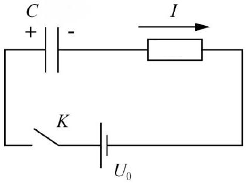
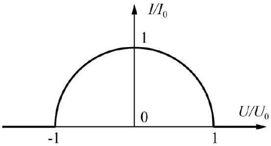
    (a) Consider the above circuit without the nonlinear element first. The capacitor is initially uncharged; at $t = 0$, the switch is closed to charge the capacitor. What is the final voltage across the capacitor?
Solution: The final voltage is just $U _ { 0 }$, the same as the battery.
    (b) Now, with the capacitor charged to the voltage in (a) and the switch open, the nonlinear element is reintroduced and the switch is again closed at $t = 0$. What is the

a. time taken for the second charging process, and
b. the final voltage across the capacitor?

Justify your answers and show all working clearly.
Solution: Let $Q$ denotes the charge on the positive plate of the capacitor and current as positive flowing clockwise around the circuit. Writing the Kirchhoff loop rule and denoting the non linear element as $N$, we have

$$
U _ { 0 } - \frac { Q } { C } - U _ { N } = 0
$$

Writing the time derivative, we get

$$
- \frac { I } { C } = \frac { d U _ { N } } { d t }
$$

Let us parameterise the $I - V$ characteristic of the nonlinear element:

$$
I = I _ { 0 } \sin \phi , U _ { N } = U _ { 0 } \cos \phi
$$

where $\phi$ is the phasor angle relative to the $x$-axis. Substituting into the Kirchhoff equation,

$$
- \frac { I _ { 0 } \sin \phi } { C } = - U _ { 0 } \dot { \phi } \sin \phi
$$

from which we can conclude that the phasor simply rotates with constant angular velocity

$$
\omega = \dot { \phi } = \frac { I _ { 0 } } { U _ { 0 } C }
$$

The capacitor is initially charged to $U _ { 0 }$; the nonlinear element hence has $U _ { N } = 0$ initially, with phasor angle $\phi = \frac { \pi } { 2 }$. From our earlier analysis, we can conclude that the phasor will simply rotate anticlockwise with constant angular velocity from $\frac { \pi } { 2 }$ to $\pi$. Therefore the final voltage across the capacitor is $U _ { 0 } - \left( - U _ { 0 } \right) = 2 U _ { 0 }$, and the time taken is

$$
t = \frac { \pi - \frac { \pi } { 2 } } { \omega } = \frac { \pi } { 2 } \frac { C U _ { 0 } } { I _ { 0 } }
$$

Alternatively, we can just directly solve the differential equation earlier.

$$
- \frac { I } { C } = \frac { d U _ { N } } { d t } = \frac { d U _ { N } } { d I } \frac { d I } { d t }
$$

We express $U _ { N }$ in terms of $I$ :

$$
U _ { N } = \pm U _ { 0 } \sqrt { 1 - \left( \frac { I } { I _ { 0 } } \right) ^ { 2 } } \Longrightarrow \frac { d U _ { N } } { d I } = \mp \frac { U _ { 0 } } { \sqrt { 1 - \left( \frac { I } { I _ { 0 } } \right) ^ { 2 } } } \frac { I } { I _ { 0 } ^ { 2 } }
$$

Working out the time-derivative and plugging into the differential equation, we obtain

$$
\int _ { I _ { 0 } } ^ { 0 } \frac { d I } { \sqrt { 1 - \left( \frac { I } { I _ { 0 } } \right) ^ { 2 } } } = \pm \int _ { 0 } ^ { t } \frac { I _ { 0 } ^ { 2 } } { C U _ { 0 } } d t
$$

To take care of the sign, we note that the initial potential difference across the element drives a positive current through it, which further increases the potential

difference between the capacitor and the battery (the non linear element can be thought of as a second "battery"). This is represented by the left half of the $I - V$ graph and we replace the ± with a - . Using a trigonometric substitution $I = I _ { 0 } \sin \theta$, we obtain the final answer as
$$
t = \frac { \pi } { 2 } \frac { C U _ { 0 } } { I _ { 0 } }
$$
Since the current is positive, the capacitor is further charged and the final voltage across is $2 U _ { 0 }$.
(c) Find the maximum rate of change of capacitor energy. At what time $t$ does this occur? [2]

Solution: Begin from the equation for capacitor energy:

$$
E = \frac { 1 } { 2 } \frac { Q ^ { 2 } } { C }
$$

The rate of change can be expressed as:

$$
P = \frac { d E } { d t } = \frac { Q I } { C }
$$

But $\frac { Q } { C }$ is just the voltage of the capacitor, which we can express in terms of $U _ { N }$ as

$$
\frac { Q } { C } = U _ { 0 } - U _ { N }
$$

Expressing in terms of $\phi$, we obtain

$$
P = U _ { 0 } I _ { 0 } \sin \phi ( 1 - \cos \phi )
$$

It is not difficult to differentiate the expression and find the value of $\phi$ that gives the maxima. However, we can also visualise the expression as the area of a triangle with base $2 \sin \phi$ and height $1 - \cos \phi$, inscribed in a unit circle. The maximum area is hence achieved in the case of an equilateral triangle, corresponding to $\phi = \frac { 2 \pi } { 3 }$.

This gives $P _ { \text {max } } = \frac { 3 \sqrt { 3 } } { 4 } U _ { 0 } I _ { 0 }$, and the time is

$$
t = \frac { \frac { 2 \pi } { 3 } - \frac { \pi } { 2 } } { \omega } = \frac { \pi } { 6 } \frac { C U _ { 0 } } { I _ { 0 } }
$$

(d) Now consider the same nonlinear circuit, but the capacitor has a very small positive charge $\delta \ll C U$ before the switch is closed. Find the time taken in this charging process and the final voltage across the capacitor. Explain why it can be said that this process is a transition from unstable to stable equilibrium.

Solution: Referring to our solution to part b, we use the same idea of constant angular velocity;

$$
t = \frac { \pi - 0 } { \omega } = \pi \frac { I _ { 0 } } { U _ { 0 } C }
$$

Notice that the circuit is only in "equilibrium" at $\phi = 0$ and $\phi = \pi$. At both points, the current is 0 - hence $U _ { N }$ and the capacitor voltage remain constant, and the circuit is in equilibrium. However, $\phi = 0$ is unstable. With a small perturbation (such as by introducing a charge to the capacitor), the phasor will swing anticlockwise towards $\phi = \pi$, the other point of equilibrium.

Marking Scheme:

| Part | Steps | Marks |
| :--- | :--- | :--- |
| (a) | State that the final voltage is $U _ { 0 }$. | A1 |
| (b) | Kirchhoff's loop rule applied correctly AND time derivative applied Parameterise $I$ and $U _ { N }$ in terms of phasor angle | M1 |
|  | Correctly state the idea of constant angular velocity $\omega$ | M0.5 |
|  | $\omega = \frac { I _ { 0 } } { U _ { 0 } C }$ | M1 |
|  | Final voltage $= 2 U _ { 0 }$ | A0.5 |
|  | Time taken $t = \frac { \pi } { 2 } \frac { C U _ { 0 } } { I _ { 0 } }$ | A0.5 |
|  | OR: Kirchhoff's loop rule applied correctly AND time derivative applied | M1 |
|  | $U _ { N } = \pm U _ { 0 } \sqrt { 1 - \left( \frac { I } { I _ { 0 } } \right) ^ { 2 } }$ | M0.5 |
|  | Obtain correct integral equation | M1 |
|  | Integral solved correctly | M0.5 |
|  | Final voltage $= 2 U _ { 0 }$ | A0.5 |
|  | Time taken $t = \frac { \pi } { 2 } \frac { C U _ { 0 } } { I _ { 0 } }$ | A0.5 |
| (c) | $P = \frac { Q I } { C }$ | M0.5 |
|  | Parameterise $P$ in terms of $\phi$, obtain $\phi = \frac { 2 \pi } { 3 }$ OR any other correct method | M1 |
|  | $P _ { \text {max } } = \frac { 3 \sqrt { 3 } } { 4 } U _ { 0 } I _ { 0 }$ AND $t = \frac { \pi } { 6 } \frac { C U _ { 0 } } { I _ { 0 } }$ | A0.5 |
| (d) | $t = \pi \frac { I _ { 0 } } { U _ { 0 } C }$ | A1 |
|  | Explain two points of equilibrium, $\phi = 0$ perturbed will swing to the other point of equilibrium $\phi = \pi$. | A1 |

3. In General Relativity, light rays can get deflected by massive bodies. For a sphericallysymmetric body, if the undisturbed motion of the ray passes the centre of the body at a minimum distance of $r$ (the impact parameter), the angular deflection (in radians) is given by:

$$
\alpha = \frac { 4 G M } { r c ^ { 2 } }
$$

for $\alpha \ll 1 \mathrm { rad }$. We aim to construct a lens out of plastic with refractive index $n$ that simulates this effect. The lens is constructed using the volume of revolution of a function

$r = f ( x )$ about the $x$-axis. We want to choose $f ( x )$ such that the angle of deflection at an impact parameter of $r$ is given by:

$$
\alpha = \frac { s } { r }
$$

where $s$ is some constant. You may use small angle approximation for the angle of incidence and $\alpha$, and assume that air has refractive index 1 .
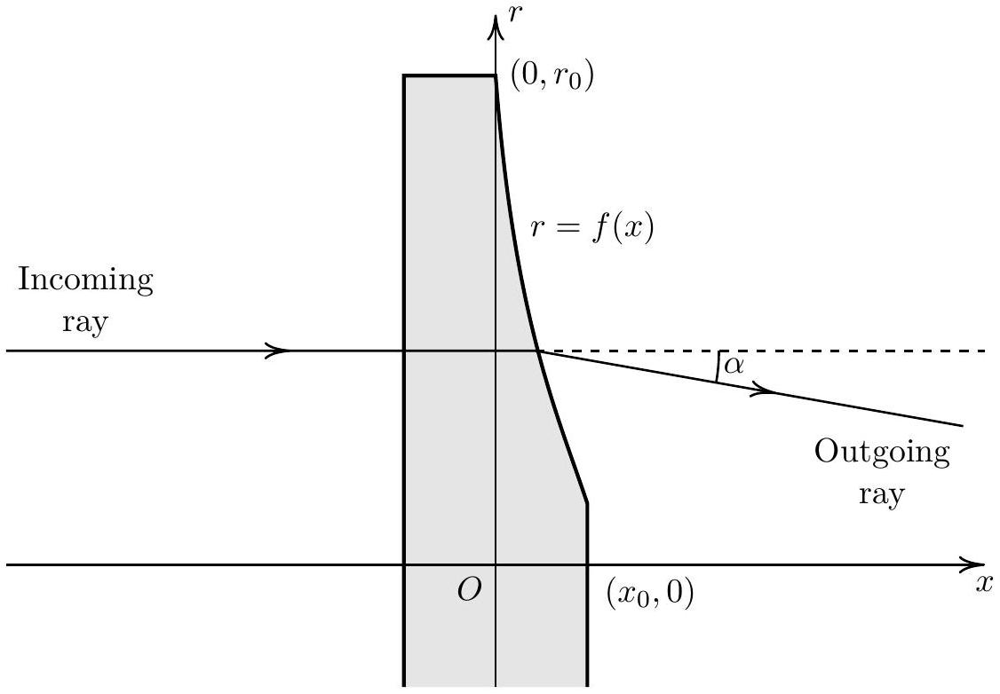
Determine $f ( x )$ for $x \in \left[ 0 , x _ { 0 } \right]$ shown in the diagram above in terms of $x , n , s$ and $r _ { 0 }$.

Solution: From Snell's law, we know that:

$$
n \sin \theta = \sin \phi
$$

Using the small angle approximation,

$$
n \theta = \phi
$$

The angle of deflection is:

$$
\alpha = \phi - \theta = ( n - 1 ) \theta
$$

The gradient of the normal is given by $- 1 / \left( f ^ { \prime } ( x ) \right)$ and hence,

$$
\begin{aligned}
- 1 / \left( f ^ { \prime } ( x ) \right) & = \tan \theta \\
f ^ { \prime } ( x ) & = - \frac { n - 1 } { \alpha } \\
f ^ { \prime } ( x ) & = - \frac { n - 1 } { s } f ( x )
\end{aligned}
$$

Solving the differential equation, we obtain:

$$
f ( x ) = C e ^ { - ( n - 1 ) x / s }
$$

where $C$ is an integration constant. Substituting $\left( 0 , r _ { 0 } \right)$, we find that $C = r _ { 0 }$ and hence:

$$
f ( x ) = r _ { 0 } e ^ { - \frac { n - 1 } { s } x }
$$

Marking Scheme:

| Part | Steps | Marks |
| :--- | :--- | :--- |
|  | $n \sin \theta = \sin \phi$ and use of small angle approximation | M0.5 |
|  | $\alpha = ( n - 1 ) \theta$ | M0.5 |
|  | Gradient of normal: $- 1 / f ^ { \prime } ( x )$ | M0.5 |
|  | Correct differential equation $f ^ { \prime } ( x ) = - \frac { n - 1 } { s } f ( x )$ | M1.5 |
|  | Equation solved correctly with correct substitution of constants to get $f ( x ) = r _ { 0 } \exp \left( - \frac { n - 1 } { s } x \right)$ | A1 |

4. Optical microscopes use optical lenses to bend light and form images. Electron microscopes on the other hand rely on electromagnetic fields to bend electrons. We will explore the properties of a magnetic lens in the following question. For all parts below we will work in cylindrical coordinates $( r , \theta , z )$ with the origin coninciding with the center of the top face of the magnet.
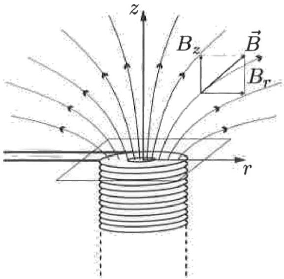
We can use a cylindrically symmetric magnetic field as a lens. Near the central axis of the magnet (small $r$ ), the $z$ component of the field can be approximated by
$$
B _ { z } ( z ) = \frac { B _ { 0 } } { 1 + \left( \frac { z } { a } \right) ^ { 2 } }
$$
where $a$ is some constant.
    (a) Show that the radial magnetic field $B _ { r }$ near the central axis is given by
$$
\begin{equation*}
B _ { r } = - \frac { r } { 2 } \frac { d B _ { z } } { d z } \tag{1}
\end{equation*}
$$

Solution: The magnetic field must obey Gauss' Law. Thus we can construct a cylindrical surface with its axis on the z axis, has height $d z$ and radius r. Given

that the total outgoing flux is 0:
$$
\begin{gathered}
2 \pi r B _ { r } d z + \pi r ^ { 2 } B _ { z } ( z + d z ) - \pi r ^ { 2 } B _ { z } ( z ) = 0 \\
B _ { r } = - \frac { r } { 2 } \frac { d B _ { z } } { d z }
\end{gathered}
$$
(b) By considering the equation of motion for an electron with mass $m$ and charge $- e$ originating far away from the lens with some initial position $\left( r _ { 0 } , \theta _ { 0 } , z _ { 0 } \right)$, show that the angular position of the electron is governed by
$$
\dot { \theta } = \frac { e } { 2 m } B _ { z }
$$
You may assume that the electrons are paraxial ( $r _ { 0 }$ is small) and that the initial speed $v$ of the electron is almost entirely in $z$ direction $\left( v \approx v _ { z } \right)$ at all times.

Solution: The velocity of the electron is given by $( \dot { r } , r \dot { \theta } , \dot { z } )$, so Newton's $2 ^ { n d }$ Law can be written as such:

$$
\begin{aligned}
\vec { F } & = - e \vec { v } \times \vec { B } \\
& = - e \left( \begin{array} { c }
\dot { r } \\
r \dot { \theta } \\
\dot { z }
\end{array} \right) \times \left( \begin{array} { c }
- \frac { r } { 2 } \frac { d B _ { z } } { d z } \\
0 \\
B _ { z }
\end{array} \right)
\end{aligned}
$$

This is equal to $\frac { \mathrm { d } ( m \vec { v } ) } { \mathrm { d } t }$ where $| \vec { v } |$ is constant.Splitting this up in to the relevant components we get:

$$
\begin{aligned}
m \ddot { r } & = - e B _ { z } r \dot { \theta } + m r \dot { \theta } ^ { 2 } \\
\frac { d } { d t } \left( m r ^ { 2 } \dot { \theta } \right) & = e B _ { z } r \dot { r } + e \frac { r ^ { 2 } } { 2 } \dot { z } \frac { d B _ { z } } { d z } \\
& = \frac { d } { d t } \left( \frac { e } { 2 } r ^ { 2 } B _ { z } \right) \\
m \ddot { z } & = e B _ { r } r \dot { \theta } \approx 0
\end{aligned}
$$

From the azimuthal equation we get that:

$$
m r ^ { 2 } \dot { \theta } = \frac { e } { 2 } r ^ { 2 } B _ { z } + C
$$

But since at $z = \infty , B _ { z } = 0$ and $\dot { \theta } = 0$ then $C = 0$. Giving us the final expression for $\dot { \theta }$ :

$$
\dot { \theta } = \frac { e } { 2 m } B _ { z }
$$

(c) From the equation of motion in the radial direction, derive the following equation relating $z$ and $r$ for the trajectory of the particle:
$$
\frac { d ^ { 2 } y } { d x ^ { 2 } } = - \frac { k ^ { 2 } } { \left( 1 + x ^ { 2 } \right) ^ { 2 } } y
$$
where $y = \frac { r } { a } , x = \frac { z } { a }$ and $k$ is to be determined in terms of the electron's initial kinetic energy, $E$, its mass, $m$, and other constants.

Solution: We substitute the expression for $\dot { \theta }$ into the radial equation of motion:

$$
\begin{aligned}
m \ddot { r } & = - e B _ { z } r \frac { e } { 2 m } B _ { z } + m r \left( \frac { e } { 2 m } B _ { z } \right) ^ { 2 } \\
& = - \frac { e ^ { 2 } } { 4 m } B _ { z } ^ { 2 } r
\end{aligned}
$$

Since $v$ is constant and mostly in the $z$ direction we can replace the time derivative with a spatial derivative, $\frac { d } { d t } = v \frac { d } { d z }$. This turns our equation into:

$$
\frac { d ^ { 2 } r } { d z ^ { 2 } } = - \frac { e ^ { 2 } } { 4 m ^ { 2 } v ^ { 2 } } r B _ { z } ^ { 2 }
$$

Using this and the relevant substitutions mentioned in the question our equation becomes:

$$
\frac { d ^ { 2 } y } { d x ^ { 2 } } = - \frac { e ^ { 2 } B _ { 0 } ^ { 2 } a ^ { 2 } } { 16 E ^ { 2 } } \frac { y } { \left( 1 + x ^ { 2 } \right) ^ { 2 } }
$$

Giving us $k = \frac { e B _ { 0 } a } { 4 E }$

(d) The general solution to the equation can be found using the substitutions $x = \frac { z } { a } = \cot ( \phi )$ and $y = \frac { r } { a }$ :
$$
y ( \phi ) = C _ { 1 } \frac { \sin ( \omega \phi ) } { \sin \phi } + C _ { 2 } \frac { \cos ( \omega \phi ) } { \sin \phi } , \quad \text { where } \omega = \sqrt { 1 + k ^ { 2 } }
$$
where $C _ { 1 }$ and $C _ { 2 }$ depend on the initial direction and position of the electron. If a point source of electrons emitting electrons in all directions is at some point $P _ { 0 } \left( y _ { 0 } , \phi _ { 0 } \right)$, determine the $\phi$ values ( $\phi _ { n }$ ) where the emitted electrons converge. Also determine the minimum $k$ such that two images will be formed for any $\phi _ { 0 }$.

Solution: Substituting the initial condition in we can obtain one of the constants:

$$
\begin{aligned}
y _ { 0 } & = C _ { 1 } \frac { \sin \left( \omega \phi _ { 0 } \right) } { \sin \phi _ { 0 } } + C _ { 2 } \frac { \cos \left( \omega \phi _ { 0 } \right) } { \sin \phi _ { 0 } } \\
C _ { 1 } & = \frac { y _ { 0 } \sin \phi _ { 0 } } { \sin \left( \omega \phi _ { 0 } \right) } - C _ { 2 } \frac { \cos \left( \omega \phi _ { 0 } \right) } { \sin \left( \omega \phi _ { 0 } \right) }
\end{aligned}
$$

Giving us the expression for $y ( \phi )$ :

$$
y ( \phi ) = \frac { \sin \left( \omega \phi _ { 0 } \right) \sin \phi _ { 0 } } { \sin \left( \omega \phi _ { 0 } \right) \sin \phi _ { 0 } } y _ { 0 } + \frac { C _ { 2 } } { \sin \phi } \left[ \cos ( \omega \phi ) - \frac { \cos \left( \omega \phi _ { 0 } \right) } { \sin \left( \omega \phi _ { 0 } \right) } \sin ( \omega \phi ) \right]
$$

Because the final $y _ { n }$ of the image are independent of the initial direction of the electrons, the result must be independent of $C _ { 2 }$. Giving:

$$
\cos ( \omega \phi ) - \frac { \cos \left( \omega \phi _ { 0 } \right) } { \sin \left( \omega \phi _ { 0 } \right) } \sin ( \omega \phi ) = 0
$$

Which is equivalent to:

$$
\sin \left( \omega \left( \phi - \phi _ { 0 } \right) \right) = 0
$$

The solutions are $\phi _ { n } = \phi _ { 0 } - n \frac { \pi } { \omega }$. Since $0 < \phi < \pi \Rightarrow \omega \left( \frac { \phi _ { 0 } } { \pi } - 1 \right) < n < \omega \frac { \phi _ { 0 } } { \pi }$
The smallest value such that $n = 2$ is possible is when $\omega \geq 2$ thus $k \geq \sqrt { 3 }$.

Marking Scheme:

| Part | Steps | Marks |
| :--- | :--- | :--- |
| (a) | Construction of Gaussian Surface | M0.5 |
|  | Final Expression | A0.5 |
| (b) | $\vec { F } = - e \vec { v } \times \vec { B }$ | M0.5 |
|  | Separate equation for each direction | M1 |
|  | Torque equation in terms of $\frac { d } { d t }$ on both sides | M2 |
|  | $C = 0$ and equation proven | A0.5 |
|  | If student prematurely assumes $\dot { r } \rightarrow$ 0 and derives the correct result without writing out the full equation of motion, cap at 2 marks |  |
| (c) | $\frac { d } { d t } = v \frac { d } { d z }$ | M0.5 |
|  | $m ^ { 2 } v ^ { 4 } = 4 E ^ { 2 }$ | M0.5 |
|  | Correct expression | A1 |
| (d) | $y ( \phi )$ independant of one of the boundary conditions | M1 |
|  | $\sin \left( \omega \left( \phi _ { n } - \phi _ { 0 } \right) \right) = 0$ or equivalent | M1 |
|  | $\phi _ { n } = \phi _ { 0 } - n \frac { \pi } { \omega }$ | A0.5 |
|  | $k \geq \sqrt { 3 }$ | A0.5 |

5. In this problem, we will study the thermodynamics of an unusual heat engine, known as an Archibald rubber band heat engine.
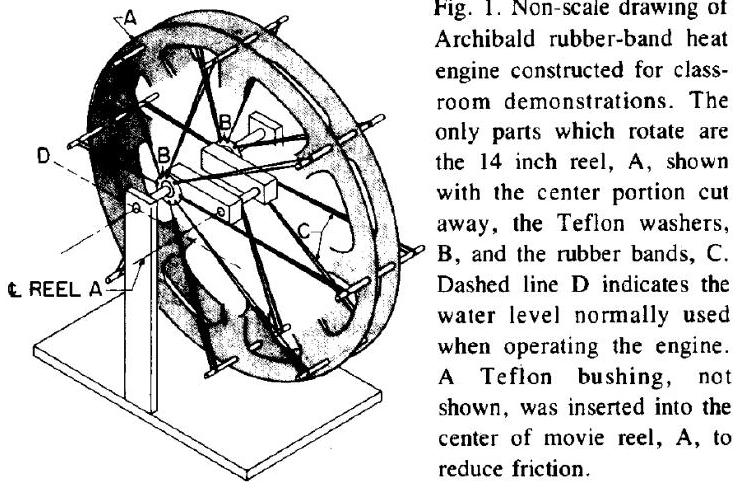
This heat engine consists of a series of rubber bands with one end attached to the circumference of a wheel with radius $R$, and the other end fastened to a frictionless bearing, whose center is offset from the wheel's central axis of rotation by a distance $R _ { 0 }$. Both the wheel's axis and rubber band axis are fixed and do not move.
A "heat engine" can be constructed by submerging the bottom half of the assembly in hot water with uniform temperature $T _ { H }$, which causes the wheel and attached bands to rotate. The top half remains at ambient temperature $T _ { C }$. A clearer diagram is shown below. The rubber bands are connected to $O ^ { \prime }$, while the wheel rotates about $O$.
(a) Given the set up above where the rubber band axis is offset to the left by $R _ { 0 }$ and that

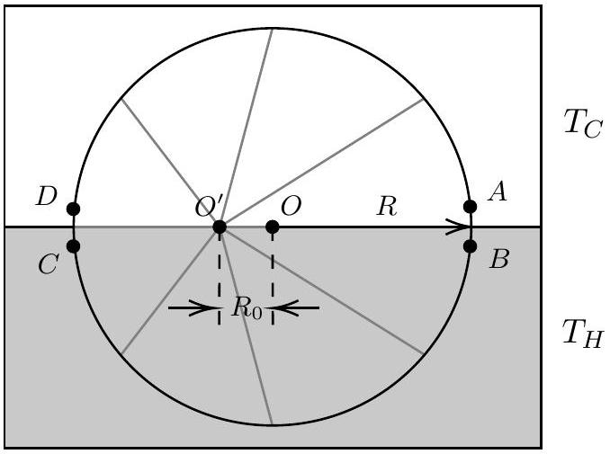
stretched rubber contracts when heated, explain whether the wheel rotates clockwise or counterclockwise.

Solution: Without submerging the half of the wheel in hot water, the net counterclockwise torque exerted by the top half of the wheel exactly cancels out the net clockwise torque exerted by the bottom half of the wheel. However, the rubber band in the bottom half contracts upon being heated. Hence, the clockwise torque exerted by the bottom half dominates and the wheel rotates clockwise.

The thermodynamic relation for a rubber band is given by

$$
d U = T d S + \tau d L
$$

where $T$ is the temperature, $\tau$ is the tension, $U$ is the internal energy, $S$ is the entropy, and $L$ is the length of the rubber band. You may assume that just like an ideal gas, $U$ can be expressed as a function of only the temperature $T$.

(b) By referencing the Maxwell relation for a typical $P , V , T$ system:
$$
\left( \frac { \partial S } { \partial V } \right) _ { T } = \left( \frac { \partial P } { \partial T } \right) _ { V } ,
$$
derive an equivalent Maxwell relation for the rubber band with a suitable substitution.

Solution: The classic thermodynamic relation is

$$
d U = T d S - P d V
$$

With a direct comparison, we can obtain the relation for the rubber band by replacing $P \rightarrow - \tau$ and $V \rightarrow L$. Hence, the new Maxwell relation is

$$
\left( \frac { \partial S } { \partial L } \right) _ { T } = - \left( \frac { \partial \tau } { \partial T } \right) _ { L }
$$

We assume that that change in tension in the rubber band is small in one cycle and may be expanded linearly about the tension at length $R$ and average temperature $\bar { T } = \left( T _ { C } + T _ { H } \right) / 2$ as

$$
\tau ( L , T ) = \tau ( R , \bar { T } ) + \rho ( L - R ) + \sigma ( T - \bar { T } )
$$

where $\rho = ( \partial \tau / \partial L ) _ { T }$ and $\sigma = ( \partial \tau / \partial T ) _ { L }$ both evaluated at $( R , \bar { T } )$ are constants.

(c) By considering the entropy $S$ as a state function of the temperature $T$ and length $L$ of the rubber band, show clearly that for a reversible process, we have
$$
d Q = C _ { L } d T - T \sigma d L
$$
where $C _ { L }$ is defined as the heat capacity at constant length.
Hint: For a multivariate function $f ( x , y )$, we may write its differential
$$
d f = \frac { \partial f } { \partial x } d x + \frac { \partial f } { \partial y } d y
$$
You may also use the Maxwell relation derived in (b).
Solution: Using the hint, we can express $d S$ as
$$
d S = \left( \frac { \partial S } { \partial T } \right) _ { L } d T + \left( \frac { \partial S } { \partial L } \right) _ { T } d L
$$
Since the LHS of the equation we want to show is $d Q$, this motivates us to rewrite $d S = d Q / T$ for a reversible process and get
$$
d Q = T \left( \frac { \partial S } { \partial T } \right) _ { L } d T + T \left( \frac { \partial S } { \partial L } \right) _ { T } d L
$$
In particular, we also know that for a reversible process at constant length, we have
$$
\left( \frac { \partial S } { \partial T } \right) _ { L } = \left( \frac { 1 } { T } \frac { \partial Q } { \partial T } \right) _ { L } = \frac { C _ { L } } { T }
$$
since by definition, $C _ { L } = ( \partial Q / \partial T ) _ { L }$. Using the Maxwell equation given in (b) to substitute the second term, we obtain the desired relation.
(d) We now consider the thermodynamic cycle undergone by a rubber band on the wheel during a full rotation. We consider the state of the rubber band as it rotates through 4 locations $A , B , C$ and $D$ shown in the second diagram above. Sketch a $\tau - L$ diagram connecting $A , B , C , D$ (on your answer sheet) and use arrows to denote the direction of the thermodynamic cycle as the wheel rotates in the direction given by your answer in (a). Label the horizontal coordinates of $A , B , C , D$ in terms of $R$ and $R _ { 0 }$. You may also use the linear approximation of $\tau$ about $( R , \bar { T } )$ if necessary.
Hint: You may assume two of the processes to be "isochoric" and two of the processes to be isothermal, but which?
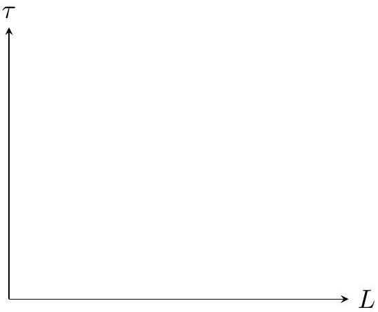

Solution: Firstly, we establish that the wheel rotates clockwise. So the cycle should be $A \rightarrow B \rightarrow C \rightarrow D$. Secondly, it is clear that the isothermal processes should be $D \rightarrow A$ and $B \rightarrow C$ since the temperature of the rubber band will quickly equilibriate with the ambient temperature. The "isochoric processes" (constant length instead of constant volume in this case) will be $A \rightarrow B$ and $C \rightarrow D$, since the length of the rubber band should remain constant at the instant the temperature changes.
With this, we know that $A \rightarrow B$ and $C \rightarrow D$ should be two vertical lines on the $\tau - L$ diagram, with the tension $\tau _ { B } > \tau _ { A }$ and $\tau _ { C } > \tau _ { D }$. To now construct the isothermal process, we notice that at constant temperature, we can make use of $\rho = ( \partial \tau / \partial L ) _ { T }$, which gives us that we can assume $\tau = \rho L + C$ (linear approximation) at constant temperature. Graphically, this means that both $D A$ and $B C$ should be straight lines with the same gradient.
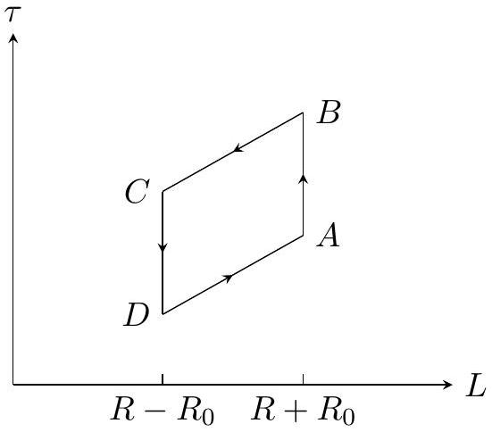

(e) By considering the heat cycle in (d), calculate the thermodynamic efficiency $\eta$ of this engine in terms of $T _ { C } , T _ { H } , \sigma$ and $R _ { 0 }$. You may use the simplification
$$
\alpha = \int _ { T _ { C } } ^ { T _ { H } } C _ { L } d T
$$
in your answer without explicitly evaluating the integral.

Solution: This question should be free marks if you could do part (d). Firstl, we calculate the workdone in the cycle to be the area enclosed by the loop. Notice that the net workdone by the rubber band $d W = - \tau d L$ is positive. Along $D A$, we have

$$
Q _ { D \rightarrow A } = - \int _ { R - R _ { 0 } } ^ { R + R _ { 0 } } T _ { C } \sigma d L = - 2 T _ { C } \sigma R _ { 0 }
$$

Along $B C$, we have

$$
Q _ { B \rightarrow C } = - \int _ { R + R _ { 0 } } ^ { R - R _ { 0 } } T _ { H } \sigma d L = 2 T _ { H } \sigma R _ { 0 }
$$

Along $A B$, we have

$$
Q _ { A \rightarrow B } = \int _ { T _ { C } } ^ { T _ { H } } C _ { L } d T = \alpha
$$

Along $C D$,we have

$$
Q _ { C \rightarrow D } = \int _ { T _ { H } } ^ { T _ { C } } C _ { L } d T = - \alpha
$$

So the net heat input during this cycle is given by

$$
Q = 2 T _ { H } \sigma R _ { 0 } + \alpha
$$

By the first law of thermodynamics, $\Delta U$ over the whole cycle is 0 and hence

$$
\begin{gathered}
W = Q _ { A \rightarrow B } + Q _ { B \rightarrow C } + Q _ { C \rightarrow D } + Q _ { D \rightarrow A } = 2 \sigma R _ { 0 } \left( T _ { H } - T _ { C } \right) \\
\eta = \frac { W } { Q } = \frac { 2 \sigma R _ { 0 } \left( T _ { H } - T _ { C } \right) } { 2 \sigma R _ { 0 } T _ { H } + \alpha }
\end{gathered}
$$

Marking Scheme:

| Part | Steps | Marks |
| :--- | :--- | :--- |
| (a) | Correctly explain the origin of torque from the uneven rubber band contraction in the top and bottom halves of the wheel | M0.5 |
|  | Wheel rotates clockwise | A0.5 |
| (b) | $d U = T d S - P d V$ | M0.5 |
|  | Correct substitution of $P \rightarrow - \tau$ and $V \rightarrow L$ and correct answer (give 0.5 if missing minus sign) | A0.5 |
| (c) | Expanding $d S$ correctly using the hint | M0.5 |
|  | Correct substitution of $d S = d Q / T$ | M0.5 |
|  | Correct substitution of $\left( \frac { \partial S } { \partial T } \right) _ { L } = \frac { C _ { L } } { T }$ | M0.5 |
|  | Know that $C _ { L } = \left( \frac { \partial Q } { \partial T } \right) _ { L }$ | M0.5 |
| (d) | Know that $A B$ and $C D$ are isochoric, $B D$ and $D A$ are isothermal Connect $D A$ and $B C$ with straight | M1 |
|  |  | M0.5 |
|  | lines using linear approximation lines using linear approximation A is higher than D and B is higher than C | M1 |
| (e) | Correct Q for all 4 processes. One wrong minus 0.4 | M1.5 |
|  | Realise $W = \sum Q = 2 \sigma R _ { 0 } \left( T _ { H } - T _ { C } \right)$ Correct $\eta$ | M1 A0.5 |

6. In this question, we will consider variations of the Michelson-Morley interferometer.
(a) In the interferometer below, an ideal beam splitter is placed at $A$ while two perfectly reflective mirrors are placed at $B$ and $C$, with $| A B |$ and $| A C |$ being equidistant. To mesaure the refractive index of a gas such as helium, we insert a hollow glass cell of

width $D = 0.10 \mathrm {~m}$ and negligible thickness into one path of the interferometer and evacuate it. Monochromatic light of wavelength $\lambda$ is shone into the interferometer.
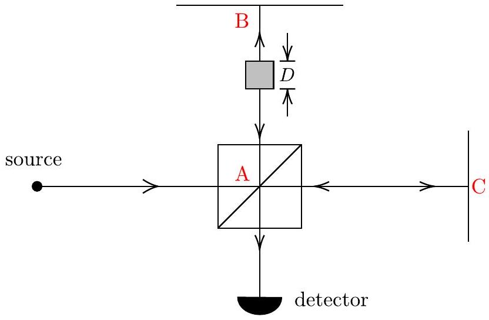
Helium gas with refractive index $n$ is then slowly added to the cell until the pressure reaches atmospheric pressure. As this is done, the intensity of the light at the detector will vary. We then carefully count the number of times the intensity varies from maximum to minimum and back to maximum. If $\lambda = 633 \mathrm {~nm}$ (from a helium-neon laser) and there are $k = 11$ cycles back to maximum intensity, find the numerical value of $n - 1$ at atmospheric pressure. The interferometer is placed in the $x - y$ plane and you may neglect effects of gravity.

Solution: The path length difference increases by $11 \lambda$. Letting $k = 11$, we have

$$
\frac { 2 n D - 2 D } { \lambda } = k \lambda
$$

We get

$$
n - 1 = \frac { k \lambda } { 2 D } = 3.48 \times 10 ^ { - 5 }
$$

(b) Suppose the tiny gas chamber is now moving at speed $v$ from $A$ towards $B$, find the phase difference $| \Delta \phi |$ between the light from the two paths meeting at the detector in terms of the refractive index $n$, wavelength $\lambda$, and other relevant constants.

Solution: The speed of light in a stationary chamber is $\frac { 1 } { n }$ (we work in units where $c = 1$ ). By relativistic velocity addition, the light is effectively "dragged along" the gas chamber when the chamber is moving at speed $v$. We therefore have the new speed

$$
v _ { \mathrm { in } } = \frac { \frac { 1 } { n } + v } { 1 + \frac { v } { n } } = \frac { v n + 1 } { n + v }
$$

The time taken $A \rightarrow B$ to travel through the chamber when the light travels in the same direction as the chamber is

$$
t _ { \mathrm { in } } = \frac { D / \gamma _ { v } } { v ^ { \prime } - v }
$$

where $\frac { D } { \gamma _ { v } }$ is due to length contraction. The time the light spends outside of the

chamber is

$$
t _ { \mathrm { out } } = \frac { L - \frac { D } { \gamma _ { v } } - v t _ { \mathrm { in } } } { c }
$$

The total time is therefore

$$
t _ { \mathrm { in } } + t _ { \mathrm { out } } = \frac { L - \frac { D } { \gamma _ { v } } + ( c - v ) t _ { \mathrm { in } } } { c } \Longrightarrow L - \frac { D } { \gamma _ { v } } + ( 1 - v ) t _ { \mathrm { in } } = L + \frac { D ( n - 1 ) } { \gamma ( v + 1 ) }
$$

When the light is travelling from $B \rightarrow A$ against the direction of the glass, we reverse the direction of $v \rightarrow - v$ and get a total time of $L + \frac { D ( n - 1 ) } { \gamma ( 1 - v ) }$. The original time without the gas chamber would have been $\frac { 2 L } { c }$. Hence, the time difference is

$$
\Delta t = \frac { 2 D ( n - 1 ) } { \sqrt { 1 - v ^ { 2 } } }
$$

We also have $\Delta \phi = \omega \Delta t$. Restoring the factor of $t$ and setting $\omega = \frac { 2 \pi c } { \lambda }$, we get

$$
\Delta \phi = \frac { 4 \pi ( n - 1 ) } { \sqrt { 1 - \frac { v ^ { 2 } } { c ^ { 2 } } } } \frac { D } { \lambda }
$$

Alternative Solution: We can also solve this problem by working in the frame of the gas chamber, which is simpler. In this frame, the distance travelled is $x ^ { \prime } = D$ and time taken is $t ^ { \prime } = \frac { D } { v _ { \mathrm { in } } } = \frac { n D } { c }$. We can use Lorentz transformation to change back to the lab frame

$$
\binom { c t } { x } = \left( \begin{array} { c c }
\gamma & \gamma \beta \\
\gamma \beta & \gamma
\end{array} \right) \binom { c t ^ { \prime } } { x ^ { \prime } } \Longrightarrow \left\{ \begin{array} { l }
{ c t = \gamma ( c t ^ { \prime } + \beta x ^ { \prime } ) } \\
{ x = \gamma ( x ^ { \prime } + \beta c t ^ { \prime } ) }
\end{array} \Longrightarrow \left\{ \begin{array} { l }
c t = \gamma D ( n + \beta ) \\
x = \gamma D ( 1 + \beta n )
\end{array} \right. \right.
$$

As the light travels from $A$ to $B$, the light takes time $t$ to travel a distance $x$, while the light on the other path from $A$ to $C$ takes time $\frac { x } { c }$ to travel the same distance $x$. Hence, the difference in time is

$$
\Delta t _ { 1 } = t - \frac { x } { c } = \gamma \frac { D } { c } ( n + \beta ) - \gamma \frac { D } { c } ( 1 + \beta n )
$$

For the reverse direction, we replace $\beta \rightarrow - \beta$ and get

$$
\Delta t _ { 2 } = \gamma \frac { D } { c } ( n - \beta ) - \gamma \frac { D } { c } ( 1 - \beta n )
$$

Adding $\Delta t _ { 1 }$ and $\Delta t _ { 2 }$ gives us

$$
\Delta t = \Delta t _ { 1 } + \Delta t _ { 2 } = 2 \gamma \frac { D } { c } ( n - 1 )
$$

Since $\Delta \phi = \frac { 2 \pi c } { \lambda } \Delta t$, we get the same answer as before.

(c) Now, we consider a different Michelson-Morley interferometer set up in the vertical plane, with the top mirror at $B$ removed. A beam of neutrons, each having mass $m$, is fired from the left. The splitter placed at $A$ causes half of it to take the horizontal path with distance $L$ to a mirror at $C$ and back, while the other half takes the vertical path against gravity to some turning point $B ^ { \prime }$ and back. The initial kinetic energy of

each neutron is $\varepsilon = \alpha m g L$.
By treating the neutrons as non-relativistic de Broglie waves, derive the expression for the phase difference $| \Delta \phi |$ when the two neutron beams meet at the detector in terms of $\alpha , m , g , L$, and $\hbar$. Effects of gravity are not negligible.

Solution: The phase of $A C$ is

$$
\phi _ { 1 } = 2 \pi \frac { 2 L } { \lambda _ { 1 } } = \frac { 2 L p _ { 1 } } { \hbar } = \frac { 2 L \sqrt { 2 m \epsilon } } { \hbar }
$$

Along $A B$, the momentum $p _ { 2 }$ changes as a function of the vertical position as part of the energy is converted to gravitational potential energy $p _ { 2 } = \sqrt { 2 m ( \epsilon - m g y ) }$ Then the differential phase is

$$
d \phi _ { 2 } = 2 \pi \frac { d y } { \lambda _ { 2 } } = \frac { p _ { 2 } d y } { \hbar }
$$

Integrating $d \phi _ { 2 }$ from 0 to the turning point $h = \frac { \epsilon } { m g }$ and back to 0 (making sure to reverse the sign of the backwards integral) gives us

$$
\phi _ { 2 } = \frac { 4 } { 3 g h } \sqrt { \frac { 2 \epsilon ^ { 3 } } { m } }
$$

Replacing $\epsilon = \alpha m g L$ gives us a phase difference

$$
\Delta \phi = \frac { m \sqrt { 2 g L ^ { 3 } } } { \hbar } \left| 2 \alpha ^ { 1 / 2 } - \frac { 4 } { 3 } \alpha ^ { 3 / 2 } \right|
$$

Some students accounted for the phase shift due to reflection from the mirror at $C$ and added a $\pm \pi$ to the answer, which is also acceptable.

(d) Qualitatively sketch the graph of intensity $I$ measured at the detector against $\alpha$ for $0 \leq \alpha \leq 6$ assuming the number of neutrons emitted per unit time is the same.

Solution: Constructive interference happens when $\Delta \phi = 2 \pi N$ with $N$ being an integer, and destructive interference happens when $\Delta \phi = ( 2 N + 1 ) \pi$. The intensity $I$ is proportional to the total energy per unit time: $I \propto \alpha$. So the equation of the graph would look like something like

$$
I \propto \alpha \cos ^ { 2 } \left( 2 \alpha ^ { 1 / 2 } - \frac { 4 } { 3 } \alpha ^ { 3 / 2 } \right)
$$

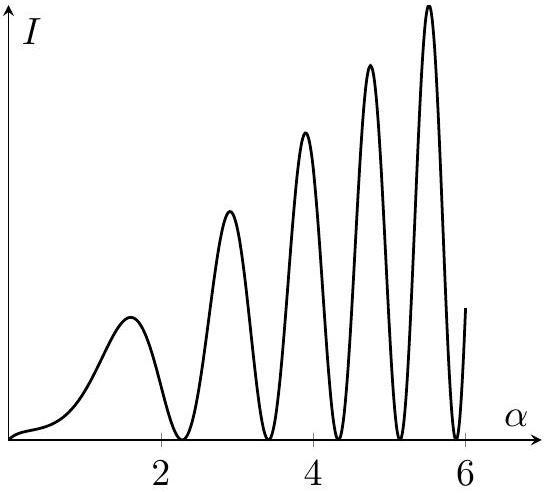

The 2 important features that one must get correct will be the increasing amplitude and decreasing gaps between adjacent intensity maxima.

Marking Scheme:

| Part | Steps | Marks |
| :--- | :--- | :--- |
| (a) | Correct path difference $\delta = 2 n D -$ 2D | M1 |
|  | Correct constructive interference condition $\delta = n \lambda$ | M0.5 |
|  | Correct numerical answer | A0.5 |
| (b) | Correct relativistic velocity addition | M0.5 |
|  | Calculate the time taken inside the chamber and accounting for length contraction | M0.5 |
|  | Calculate time outside the chamber | M0.5 |
|  | Do the same for the backward path | M0.5 |
|  | Correct time difference $\Delta t$ | M0.5 |
|  | Use $\Delta \phi = \omega \Delta t$ to get answer | A1 |
|  | Correctly express momentum as a |  |
| (c) | function of the vertical position $p _ { 2 } = \sqrt { 2 m ( \epsilon - m g y ) }$ | M0.75 |
|  | Correct use of de broglie wave length to get differential phase $d \phi$ | M0.75 |
|  | Correctly integrate $d \phi$ from 0 to max height and backward (if integral bounds are correct but calculation is wrong, award 0.5) | M1 |
|  | Correct phase change for the horizontal path | M0.5 |
|  | Correct answer | A0.5 |
| (d) | Peaks become closer as $\alpha$ increases | A0.5 |
|  | Peaks become taller as $\alpha$ increases | A0.5 |

7. In this question, we will learn more about the interaction between atoms and light. Let us consider a cavity of volume $V$ held at constant temperature $T$. Within this cavity is a "photon gas" in thermal equilibrium with the walls. We model these photons as ideal gas particles with a mean energy per photon of $\hbar \langle \omega \rangle$.
(a) Using arguments from Kinetic Particle Theory or otherwise, show that the power incident per unit area of cavity wall $\langle I \rangle$, due to the photons, can be written as
$$
\langle I \rangle = \frac { c } { 4 } \langle U \rangle
$$
where $\langle U \rangle$ is the energy density of the photon gas and $c$ is the speed of light.

Solution: Consider a small area $\mathrm { d } A$ on the cavity wall. In time $\mathrm { d } t$, the volume of particles hitting the wall at an angle $\theta$ with respect to the normal is $\mathrm { d } A c \cos \theta \mathrm {~d} t$. Note that we can use this because all photons, regardless of their frequencies (or energy), all travel at the same speed. Assuming isotropy, the proportion of particles moving at angle $\theta$ is $n \sin \theta \mathrm {~d} \theta / 2$ where $n$ is the number of particles per unit volume. Hence, the number of particles hitting the area per unit time per unit area is

$$
\frac { \mathrm { d } N } { \mathrm {~d} A \mathrm {~d} t } = \frac { 1 } { 2 } n c \cos \theta \sin \theta \mathrm {~d} \theta
$$

Integrating this across $\theta$ from 0 to $\pi / 2$ gives us $n c / 4$. This proves the desired relation upon multiplying both sides by the average energy per particle.

For a perfect blackbody at thermodynamic equilibrium at temperature $T$, the power incident per unit area per unit angular frequency $I ( \omega )$ is equal to the power emitted per unit area per unit angular frequency, given by the famous Planck's Law

$$
I ( \omega ) = \frac { \hbar \omega ^ { 3 } } { 4 \pi ^ { 2 } c ^ { 2 } } \frac { 1 } { e ^ { \hbar \omega / \left( k _ { B } T \right) } - 1 } = \frac { c } { 4 } U ( \omega )
$$

We now introduce a collection of atoms into the cavity. Each atom has a ground state $| a \rangle$ with energy $E _ { a }$ and an excited state $| b \rangle$ with energy $E _ { b }$, separated by $\Delta E = E _ { b } - E _ { a } = \hbar \Delta \omega$. The number of atoms in each of these states are $N _ { a }$ and $N _ { b }$ respectively. The atoms then interact with the photon gas, and Einstein identified three fundamental processes occuring:

a. Spontaneous emission: Atom naturally decays from $| b \rangle \rightarrow | a \rangle$ with rate $k _ { 1 }$, emitting a photon.
b. Stimulated emission: An incident photon triggers an atom to decay from $| b \rangle \rightarrow | a \rangle$ with rate $k _ { 2 }$, emitting a second, identical photon.
c. Stimulated absorption: An atom absorbs an incident photon gets excited from $| a \rangle \rightarrow | b \rangle$ with rate $k _ { 3 }$.
(b) The actual rates used by Einstein when he tackled this problem in 1917 are $\alpha N _ { b }$, $\beta U ( \Delta \omega ) N _ { a } , \gamma U ( \Delta \omega ) N _ { b }$, where $\alpha , \beta$ and $\gamma$ are new numerical constants he defined. Match these to the rate $k _ { 1,2,3 }$ corresponding to the 3 processes above and justify your choices fully with physics.

Solution: Spontaneous emission should not depend on the number of photons. Stimulated emission depends on the number density of photons with frequency matching the excitation frequency. Looking at the dependence on $N _ { a }$ and $N _ { b }$, we arrive at

$$
k _ { 1 } \rightarrow \alpha N _ { b } , \quad k _ { 2 } \rightarrow \gamma U ( \Delta \omega ) N _ { b } , \quad k _ { 3 } \rightarrow \beta U ( \Delta \omega ) N _ { a }
$$

(c) Given that the atoms are in thermal equilibrium with the bath of photons and by considering $\dot { N } _ { a }$ and $\dot { N } _ { b }$, show the following relationships
$$
\beta = \gamma \quad \text { and } \quad \alpha = \frac { \hbar \Delta \omega ^ { 3 } } { \pi ^ { 2 } c ^ { 3 } } \beta
$$

Solution: The population $N _ { a }$ and $N _ { b }$ must satisfy the Boltzmann distribution since it is in thermal equilibrium with the photons. We obtain

$$
\frac { N _ { b } } { N _ { a } } = e ^ { - \beta \hbar \Delta \omega }
$$

Next, we consider the steady-state condition

$$
\dot { N } _ { a } = \alpha N _ { b } + \gamma U ( \Delta \omega ) N _ { b } - \beta U ( \Delta \omega ) N _ { a } = 0
$$

(note that since $\dot { N } _ { a } + \dot { N } _ { b } =$ const., we just have $\dot { N } _ { b } = - \dot { N } _ { a } = 0$ and writing an equation for $\dot { N } _ { b }$ does not add new information). Substituting in the Boltzmann condition and solving for $U ( \Delta \omega )$, we find that

$$
U ( \Delta \omega ) = \frac { \alpha } { \beta e ^ { \hbar \Delta \omega / \left( k _ { B } T \right) } - \gamma } = \frac { \frac { \alpha } { \beta } } { e ^ { \hbar \Delta \omega / \left( k _ { B } T \right) } - \frac { \gamma } { \beta } }
$$

Finally, matching this with the expression for $U ( \Delta \omega )$ given by Planck's Law gives us the desired relationship

$$
\frac { \gamma } { \beta } = 1 , \quad \frac { \alpha } { \beta } = \frac { \hbar ^ { 2 } \omega ^ { 3 } } { \pi ^ { 2 } c ^ { 3 } }
$$

A LASER, Light Amplification by Stimulated Emission of Radiation, works by having population inversion, where most of the atoms are "pumped" into the excited energy level $| b \rangle$. Then any small number of photons can trigger larger and larger numbers of stimulated emission processes.

Marking Scheme:

| Part | Steps | Marks |
| :--- | :--- | :--- |
| (a) | Correct argument by considering the number of particles hitting the wall in $d t$ | M1 |
|  | Corect integral of $\frac { 1 } { 2 } n c \cos \theta \sin \theta d \theta$ from $\theta = 0$ to $\pi / 2$ | M1 |
| (b) | All constants matched correctly | A1 |
|  | $N _ { b } = N _ { a } e ^ { - \beta \hbar \Delta \omega }$ | M1 |
|  | Correct steady state relationship | M1 |
|  | Correct substitution and into boltzmann distribution and solving for $U ( \Delta \omega )$ | M1 |
|  | Constants matched correctly | A1 |

8. (a) Inverse beta decay is an important reaction in neutrino detectors. One version of this decay occurs when an electron antineutrino interacts with a proton to produce a neutron and a positron:
$$
\bar { \nu } _ { e } + \mathrm { p } \longrightarrow \mathrm { n } + \mathrm { e } ^ { + }
$$
Assuming the proton is at rest in the lab frame, determine the minimum neutrino

energy in the lab frame required for this reaction to take place. Leave your answer in terms of the relevant rest masses of the proton $m _ { p }$, neutron $m _ { n }$, and electron $m _ { e }$. The mass of the neutrino is negligible.

Solution: Consider the centre of momentum frame. To minimise the neutrino energy, the products of the reaction should have zero velocity in this frame. Any nonzero velocity would mean energy is "wasted" in moving the particles, rather than simply creating them.
Let us use the relativistic invariant $\varepsilon ^ { 2 } = - E ^ { 2 } + p ^ { 2 } c ^ { 2 }$. This quantity is both conserved and invariant across frames. Before the reaction, in the lab frame, we have:

$$
\varepsilon ^ { 2 } = - \left( E _ { \bar { \nu } _ { e } } + m _ { p } c ^ { 2 } \right) ^ { 2 } + E _ { \bar { \nu } _ { e } } ^ { 2 }
$$

After the reaction, in the centre of momentum frame, we have:

$$
\varepsilon ^ { 2 } = - \left( m _ { n } c ^ { 2 } + m _ { e } c ^ { 2 } \right) ^ { 2 }
$$

We can then equate these expressions and solve for $E _ { \bar { \nu } _ { e } }$ :

$$
\begin{gathered}
- \left( E _ { \bar { \nu } _ { e } } + m _ { p } c ^ { 2 } \right) ^ { 2 } + E _ { \bar { \nu } _ { e } } ^ { 2 } = - \left( m _ { n } c ^ { 2 } + m _ { e } c ^ { 2 } \right) ^ { 2 } \\
- 2 E _ { \bar { \nu } _ { e } } m _ { p } c ^ { 2 } - m _ { p } ^ { 2 } c ^ { 4 } = - \left( m _ { n } + m _ { e } \right) ^ { 2 } c ^ { 4 } \\
E _ { \bar { \nu } _ { e } } = \frac { \left( m _ { n } + m _ { e } \right) ^ { 2 } - m _ { p } ^ { 2 } } { 2 m _ { p } } c ^ { 2 }
\end{gathered}
$$

(b) Bob decides to take a spaceship with constant proper acceleration $g$. In the lab frame, his position $x$ as a function of his proper time $\tau$ is given by:

$$
x ( \tau ) = \frac { c ^ { 2 } } { g } \cosh \frac { g \tau } { c }
$$

where $\cosh x = \frac { e ^ { x } + e ^ { - x } } { 2 }$.
Alice, afraid to leave Bob, attaches herself behind Bob's spaceship with a rope of constant proper length $L$. Determine the proper acceleration $g ^ { \prime }$ experienced by Alice.

Hint: Proper time $\tau$ is always time measured in the frame of the moving body, while coordinate time $t$ can be time measured in any frame. The proper distance $\Delta s$ in any frame between two fixed events is given by:

$$
\Delta s ^ { 2 } = \Delta x ^ { 2 } - c ^ { 2 } \Delta t ^ { 2 }
$$

The following identities may be helpful

$$
\frac { d } { d x } \sinh x = \cosh x , \quad \frac { d } { d x } \cosh x = \sinh x , \quad \frac { \sinh x } { \cosh x } = \tanh x
$$

Solution: Let us compute the proper distance of Bob from the origin over time, and use the proper distance between him and Alice to infer Alice's motion. To do this, we need to determine $\Delta t$.
Consider a clock ticking on Bob's spaceship. Each tick has no spatial separation, but has time separation $d \tau$. By the Lorentz transformation, we have:

$$
d t = \gamma d \tau
$$

where $\gamma = \frac { 1 } { \sqrt { 1 - \frac { v ^ { 2 } } { c ^ { 2 } } } }$. To determine $\gamma$, we write:

$$
\begin{aligned}
\frac { d x } { d \tau } & = c \sinh \frac { g \tau } { c } \\
\frac { d x } { d t } & = \frac { d \tau } { d t } \frac { d x } { d \tau } = \frac { 1 } { \gamma } \frac { d x } { d \tau } \\
\frac { v } { \sqrt { 1 - \frac { v ^ { 2 } } { c ^ { 2 } } } } & = c \sinh \frac { g \tau } { c } \\
v & = c \tanh \frac { g \tau } { c } \\
\gamma & = \cosh \frac { g \tau } { c }
\end{aligned}
$$

This allows to obtain $\Delta t ( \tau )$ :

$$
\begin{aligned}
\int _ { 0 } ^ { \Delta t } d t & = \int _ { 0 } ^ { \tau } \cosh \frac { g \tau } { c } d \tau \\
\Delta t & = \frac { c } { g } \sinh \frac { g \tau } { c }
\end{aligned}
$$

Given $\Delta x ( \tau )$ and $\Delta t ( \tau )$, we obtain the proper distance:

$$
\begin{aligned}
\Delta s ^ { 2 } & = \left( \frac { c ^ { 2 } } { g } \right) ^ { 2 } \left( \cosh ^ { 2 } \frac { g \tau } { c } - \sinh ^ { 2 } \frac { g \tau } { c } \right) \\
& = \left( \frac { c ^ { 2 } } { g } \right) ^ { 2 }
\end{aligned}
$$

This implies that the proper distance of Bob to the origin is always $\frac { c ^ { 2 } } { g }$. Alice lags behind this by a constant proper distance $L$, so her proper distance to the origin is $\frac { c ^ { 2 } } { g } - L$. But since a constant proper acceleration implies constant proper distance to the origin, and Alice has a constant proper distance to the origin, she also has a constant proper acceleration. In fact, her equation of motion differs from Bob's only by the proper acceleration she experiences. We have:

$$
\begin{aligned}
\frac { c ^ { 2 } } { g } - L & = \frac { c ^ { 2 } } { g ^ { \prime } } \\
g ^ { \prime } & = \frac { g } { 1 - \frac { g L } { c ^ { 2 } } }
\end{aligned}
$$

Marking Scheme:

| Part | Steps | Marks |
| :--- | :--- | :--- |
| (a) | Noticing that products should have equal velocities | M1 |
|  | Identifying the relativistic invariant mass-energy | M1 |
|  | $\varepsilon ^ { 2 } = - \left( E _ { \bar { \nu } _ { e } } + m _ { p } c ^ { 2 } \right) ^ { 2 } + E _ { \bar { \nu } _ { e } } ^ { 2 }$ | M1 |
|  | $\varepsilon ^ { 2 } = - \left( m _ { n } c ^ { 2 } + m _ { e } c ^ { 2 } \right) ^ { 2 }$ | M1 |
|  | $E _ { \bar { \nu } _ { e } } = \frac { \left( m _ { n } + m _ { e } \right) ^ { 2 } - m _ { p } ^ { 2 } } { 2 m _ { p } } c ^ { 2 }$ | A1 |
|  | For a conservation of energy and momentum approach, award M1 to each of the two equations and A2 to the correct final answer |  |
| (b) | $d t = \gamma d \tau$ | M1 |
|  | $\Delta t = \frac { c } { g } \sinh \frac { g \tau } { c }$ | M1 |
|  | $\Delta s = \frac { c ^ { 2 } } { g }$ | M1 |
|  | Noticing that both Alice and Bob must have constant proper distance to origin and proper acceleration | M1 |
|  | $g ^ { \prime } = \frac { g } { 1 - \frac { g L } { c ^ { 2 } } }$ | A1 |

9. The temperature in which a thermodynamic phase transition happens can be plotted against pressure in a $P ( T )$ graph. This graph is called a coexistence curve and it is determined by the Clausius-Clapeyron equation:
$$
\frac { d P } { d T } = \frac { L } { T \left( v _ { 2 } - v _ { 1 } \right) }
$$
where $L$ is the latent heat per mole, and $v _ { 1 }$ and $v _ { 2 }$ are the volumes per mole of the material in each of the phases. As an illustration, the coexistence curve of a water is shown below.
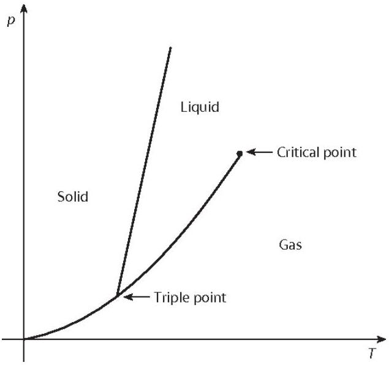
    (a) First, consider a simple phase transition - a liquid-gas phase transition. You are given that the point $\left( P _ { 0 } , T _ { 0 } \right)$ lies on the coexistence curve. Determine the equation of $P ( T )$,

making (and justifying) any relevant approximations about liquids and gases. You may assume the latent heat of vaporisation $L$ is temperature-independent. To not confuse the ideal gas constant with the radius (in later parts), you may write the former as $R _ { \mathrm { g } }$.

Solution: The approximation that we need to make is that $v _ { \text {liquid } } \ll v _ { \text {gas } }$. This is justifiable because the gaseous vapour will take up much more volume (the volume of the container) than the liquid.
Applying the Clausius-Clapeyron equation,

$$
\begin{gathered}
\frac { d P } { d T } = \frac { L } { T \left( v _ { \text {gas } } - v _ { \text {liquid } } \right) } \approx \frac { L } { T v _ { \text {gas } } } = \frac { L P } { R _ { \mathrm { g } } T ^ { 2 } } \\
\int _ { P _ { 0 } } ^ { P } \frac { d P } { P } = \frac { L } { R _ { \mathrm { g } } } \int _ { T _ { 0 } } ^ { T } \frac { d T } { T ^ { 2 } } \\
P ( T ) = P _ { 0 } \exp \left( \frac { L } { R _ { \mathrm { g } } } \left( \frac { 1 } { T _ { 0 } } - \frac { 1 } { T } \right) \right)
\end{gathered}
$$

From now on, we shall let $P _ { \text {sat } } ( T )$ denote the saturation pressure; that is, the pressure that lies on the coexistence curve (the $P ( T )$ found previously) for a given temperature. Consider a container held at a fixed external pressure $P _ { \text {ext } }$. By definition, ordinary boiling occurs at a temperature $T _ { \mathrm { b } }$, whereby

$$
P _ { \mathrm { sat } } \left( T _ { \mathrm { b } } \right) = P _ { \mathrm { ext } }
$$

In the following parts, we shall study the dynamics of nucleation, referring to the initial formation of a microscopic vapour bubble inside a liquid.
For the following parts, assume that:

i. The liquid and vapour are both at a temperature $T$.
ii. The vapour inside the microscopic bubbles can be treated as having a pressure $P _ { \text {sat } } ( T )$.
iii. The surrounding bulk liquid is at a constant pressure $P _ { \text {ext } }$.
iv. The surface tension $\sigma$ is constant.
v. Gravity can be neglected for pressure variations in the liquid.
vi. The formation of bubbles is a fully reversible process.

We define the driving pressure for vapour-bubble formation as follows:

$$
\Delta P ( T ) = P _ { \mathrm { sat } } ( T ) - P _ { \mathrm { ext } } \quad \left( T > T _ { \mathrm { b } } \right)
$$

(b) For the case $T > T _ { \mathrm { b } }$, vapour bubbles can form in the liquid. Gibbs free-energy is a thermodynamic potential measuring the maximum reversible work by a thermodynamic system at constant pressure and temperature; we can use it to determine the spontaneity and energetic feasibility of phase transitions. The Gibbs free-energy can be given by
$$
G _ { \mathrm { b } } ( R ) = U + P V - T S
$$
where $U$ is internal energy, $P$ is pressure, $V$ is volume and $S$ is entropy. Find an expression for the free-energy change $\Delta G _ { \mathrm { b } } ( R )$ when forming a spherical bubble of vapour of radius $R$. You must explain the physical meaning and the signs of each term in your answer.

Solution: There are two components of $\Delta G _ { \mathrm { b } } ( R )$ :

i. Surface free energy due to surface tension: Its magnitude is given by $\sigma A =$ $4 \pi R ^ { 2 } \sigma$. It is positive because it costs energy to create a free surface. This can be interpreted as the internal energy of the bubble, $U$.
ii. Pressure-volume energy due to driving pressure: Its magnitude is given by $V \Delta P ( T ) = \frac { 4 } { 3 } \pi R ^ { 3 } \Delta P ( T )$. It is negative because the formation of the vapour is thermodynamically favoured when $T > T _ { \mathrm { b } }$, since it is above boiling point.

These are the two competing effects at play here. Since the process is reversible, there is no entropy change. We hence obtain

$$
\Delta G _ { \mathrm { b } } ( R ) = 4 \pi R ^ { 2 } \sigma - \frac { 4 } { 3 } \pi R ^ { 3 } \Delta P ( T )
$$

(c) Determine expressions for the critical radius $R _ { \mathrm { c } , \mathrm { b } }$ where $\Delta G _ { \mathrm { b } } ( R )$ is maximum, and the corresponding nucleation barrier height (maximum free-energy barrier) $\Delta G _ { \mathrm { b } } ^ { * }$.

Solution: We simply differentiate $\Delta G _ { \mathrm { b } } ( R )$ with respect to $R$, and set the derivative equal to 0 to find the (non-zero) critical radius:

$$
\begin{gathered}
\frac { d \left( \Delta G _ { \mathrm { b } } ( R ) \right) } { d R } = 8 \pi R \sigma - 4 \pi R ^ { 2 } \Delta P ( T ) = 0 \\
R _ { \mathrm { c } , \mathrm {~b} } = \frac { 2 \sigma } { \Delta P ( T ) }
\end{gathered}
$$

The corresponding nucleation barrier height is

$$
\Delta G _ { \mathrm { b } } ^ { * } = \frac { 16 \pi \sigma ^ { 3 } } { 3 ( \Delta P ( T ) ) ^ { 2 } }
$$

Continue working in the regime $T > T _ { \mathrm { b } }$, so that bubble nucleation is relevant. You may treat $\Delta P$ as roughly constant during a short time interval. A vapour bubble of radius $R ( t )$ expands in an incompressible, ideal liquid of mass density $\rho$. Neglect viscous and dissipative effects, and assume that the container of liquid is large.
Assume the liquid around the bubble to be incompressible, and that the resulting liquid velocity field $\mathbf { u } = u ( r , t ) \hat { \mathbf { r } }$ is purely radial, where $r > R ( t )$ is the distance from the center of the bubble, outside the bubble.

(d) Derive an expression for $u ( r , t )$, in terms of $R ( t ) , \dot { R } ( t )$ and $r$. Show your working clearly.
Hint: If needed, the continuity equation is $\nabla \cdot \mathbf { v } = 0$, where $\mathbf { v }$ is the velocity field of the liquid. For a purely radial vector field $\mathbf { v } = v _ { r } \hat { \mathbf { r } }$, the divergence in spherical coordinates is given by $\nabla \cdot \mathbf { v } = \frac { 1 } { r ^ { 2 } } \frac { \partial } { \partial r } \left( r ^ { 2 } v _ { r } \right)$.

Solution: Using the hint, we have

$$
\frac { 1 } { r ^ { 2 } } \frac { \partial } { \partial r } \left( r ^ { 2 } u ( r , t ) \right) = 0
$$

This implies that

$$
r ^ { 2 } u ( r , t ) = A ( t )
$$

for some function $A ( t )$ that only depends on time.
We can identify what $A ( t )$ is based on the boundary condition at the interface: the liquid at the surface ( $r = R$ ) must move with the surface, hence $u ( R ( t ) , t ) = \dot { R } ( t )$. This gives us

$$
A ( t ) = ( R ( t ) ) ^ { 2 } \dot { R } ( t )
$$

Hence,

$$
u ( r , t ) = \frac { A ( t ) } { r ^ { 2 } } = \frac { ( R ( t ) ) ^ { 2 } \dot { R } ( t ) } { r ^ { 2 } }
$$

Alternatively, one can just conserve volume flow across any spherical surface and get the same result.

(e) Hence, show that
$$
\rho f _ { 1 } ( R , \dot { R } , \ddot { R } ) = \Delta P - f _ { 2 } ( R )
$$
for some functions $f _ { 1 } ( R , \dot { R } , \ddot { R } )$ and $f _ { 2 } ( R )$ that depend on the given parameters. Find the functions $f _ { 1 } ( R , \dot { R } , \ddot { R } )$ and $f _ { 2 } ( R )$.

Solution: Since $f _ { 1 }$ depends on $\ddot { R }$, this is a good hint that we should write an energy conservation equation, so that we can differentiate with respect to time to extract out a $\ddot { R }$ term. Hence,

$$
\frac { d } { d t } ( T + V ) = 0
$$

First, we can determine the bulk kinetic energy of the liquid outside the bubble. We make use of the previous part to do so:

$$
\begin{gathered}
T = \iiint _ { V } \frac { 1 } { 2 } \rho ( u ( r , t ) ) ^ { 2 } d V = \int _ { R ( t ) } ^ { \infty } \frac { 1 } { 2 } \rho ( u ( r , t ) ) ^ { 2 } \left( 4 \pi r ^ { 2 } d r \right) \\
= 2 \pi \rho R ^ { 4 } \dot { R } ^ { 2 } \int _ { R ( t ) } ^ { \infty } \frac { d r } { r ^ { 2 } } = 2 \pi \rho R ^ { 3 } \dot { R } ^ { 2 }
\end{gathered}
$$

The potential energy $V$ is just the free-energy associated with the formation of the bubble, as per part (b). Hence,

$$
V = 4 \pi R ^ { 2 } \sigma - \frac { 4 } { 3 } \pi R ^ { 3 } \Delta P
$$

(We have accounted for the driving work by the pressure in this term, by absorbing it in as an effective potential.)
Putting these together in the energy conservation equation, we have:

$$
\begin{gathered}
2 \pi \rho \left( 3 R ^ { 2 } \dot { R } ^ { 3 } + 2 R ^ { 3 } \dot { R } \ddot { R } \right) + \left( 8 \pi \sigma R - 4 \pi R ^ { 2 } \Delta P \right) \dot { R } = 0 \\
\rho \left( R \ddot { R } + \frac { 3 } { 2 } \dot { R } ^ { 2 } \right) = \Delta P - \frac { 2 \sigma } { R }
\end{gathered}
$$

which is of the form we desire. Hence, the required functions are:

$$
\begin{gathered}
f _ { 1 } ( R , \dot { R } , \ddot { R } ) = R \ddot { R } + \frac { 3 } { 2 } \dot { R } ^ { 2 } \\
f _ { 2 } ( R ) = \frac { 2 \sigma } { R }
\end{gathered}
$$

Let $T _ { \mathrm { R } }$ be the temperature where a bubble of radius $R$ remains in mechanical equilibrium, under the conditions and assumptions of the previous parts. Clearly, $T _ { \mathrm { R } } \neq T _ { \mathrm { b } }$. We denote $\Delta T = T _ { \mathrm { R } } - T _ { \mathrm { b } }$.
(f) Assuming that $\Delta T \ll T _ { \mathrm { b } }$, determine an expression for $\Delta T$. [3]

Solution: Using part (e), or by applying the Young-Laplace equation, we see that at mechanical equilibrium,

$$
P _ { \mathrm { sat } } \left( T _ { \mathrm { R } } \right) - P _ { \mathrm { ext } } = \frac { 2 \sigma } { R }
$$

We can perform a linearisation:

$$
P _ { \mathrm { sat } } \left( T _ { \mathrm { R } } \right) = P _ { \mathrm { sat } } \left( T _ { \mathrm { b } } + \Delta T \right) \approx P _ { \mathrm { sat } } \left( T _ { \mathrm { b } } \right) + \left. \frac { d P _ { \mathrm { sat } } } { d T } \right| _ { T = T _ { \mathrm { b } } } \Delta T
$$

Recall that by definition, $T _ { \mathrm { b } }$ satisfies $P _ { \text {sat } } \left( T _ { \mathrm { b } } \right) = P _ { \text {ext } }$. And, using the ClausiusClapeyron equation, we have $\frac { d P _ { \text {sat } } } { d T } \approx \frac { L P _ { \text {sat } } } { R _ { \mathrm { g } } T ^ { 2 } }$.
Combining all the results, we eventually obtain

$$
\Delta T = \frac { 2 \sigma R _ { \mathrm { g } } T _ { \mathrm { b } } ^ { 2 } } { R L P _ { \mathrm { ext } } }
$$

Marking Scheme:

| Part | Steps | Marks |
| :--- | :--- | :--- |
| (a) | Approximating $v _ { \text {liquid } } \ll v _ { \text {gas } }$ with justification | M0.5 |
|  | $\frac { d P } { d T } = \frac { L P } { R _ { \mathrm { g } } T ^ { 2 } }$ | M0.5 |
|  | Correct final answer for $P ( T )$ | A1 |
| (b) | Physical meaning and sign of $4 \pi r ^ { 2 } \sigma$ | M1 |
|  | Physical meaning and sign of $\frac { 4 } { 3 } \pi r ^ { 3 } \Delta P ( T )$ | M1 |
|  | Reversible hence $\Delta S = 0$ | M0.5 |
|  | Correct final answer | M0.5 |
| (c) | Correct final answer for $r _ { \mathrm { c } , \mathrm { b } }$ | A0.5 |
|  | Correct final answer for $\Delta G _ { \mathrm { b } } ^ { * }$ | A0.5 |
|  | Using the divergence in spherical coordinates or otherwise (must |  |
|  | be properly justified) to obtain | M1 |
|  | $u ( R ( t ) , t ) = \dot { R } ( t )$ | M0.5 |
|  | Correct final answer | A0.5 |
| (e) | Idea of conservation of energy, | M0.5 |
|  | $\frac { d } { d t } ( T + V ) = 0$ |  |
|  | $T = 2 \pi \rho R ^ { 3 } \dot { R } ^ { 2 }$ | M1 |
|  | $V = 4 \pi R ^ { 2 } \sigma - \frac { 4 } { 3 } \pi R ^ { 3 } \Delta P$, or alternatively, accounting for the driving work by the pressure separately |  |
|  | Correct substitution into the energy conservation equation | M0.5 |
|  | Correct final answer for $f _ { 1 } ( R , \dot { R } , \ddot { R } )$ | A0.5 |
|  | Correct final answer for $f _ { 2 } ( R )$ | A0.5 |
| (f) | $P _ { \text {sat } } \left( T _ { \mathrm { R } } \right) - P _ { \text {ext } } = \frac { 2 \sigma } { R }$ | M1 |
|  | Linearisation of $P _ { \text {sat } } \left( T _ { \mathrm { R } } \right)$ | M0.5 |
|  | Correct usage of Clausius-Clapeyron equation | M1 |
|  | Correct final answer | A0.5 |
|  | Incorrect coefficient used in $\frac { 2 \sigma } { R }$ penalty but A0.5 to still be given if all other steps are performed correctly. | -M0.5 |

10. We know that for all solutions to the linear wave equation, the principle of superposition applies. Examples include electromagnetic waves and waves on a string.
Dispersion relations describe the relation between angular velocity $\omega ( k )$ and wavenumber $k$, where phase velocity can be obtained as $v _ { p } = \frac { \omega } { k }$. Each wave component has its own phase velocity, propagating independently of each other.

However, in nonlinear dynamics, this is no longer the case. Interfering wave packets interact,

leading to nontrivial behaviour; in dispersive media, nonlinear interactions can even preserve wave packets and oppose dispersion. These wave packets are called solitons.

To investigate solitons, we will look at a simple mechanical system. Consider a long taut horizontal string, to which at equal intervals $b$, identical spokes arranged vertically are attached. These spokes can be considered as pendulums swinging in the plane perpendicular to the string axis. The weight of each spoke is $m$, the distance from the center of mass of the spoke to the string is $d$, and the moment of inertia relative to the axis passing through the string is $I$. When one spoke deviates from the neighboring one by an angle $\Delta \phi$, the string creates a restoring torsional torque $\tau = - K \Delta \phi$.
It can be assumed that the characteristic size of the soliton $\lambda \gg b$. Hence, consider that the angular coordinate at some point $x$ along the string is given by a continuous function $\phi ( x , t ) ; \phi = 0$ is defined at the position where the pendulum points vertically downwards, and increases as the pendulum rotates anticlockwise.

Take the level of a line passing through the lowest possible positions of the center of mass of the spokes as zero of the potential energy in the gravitational field.
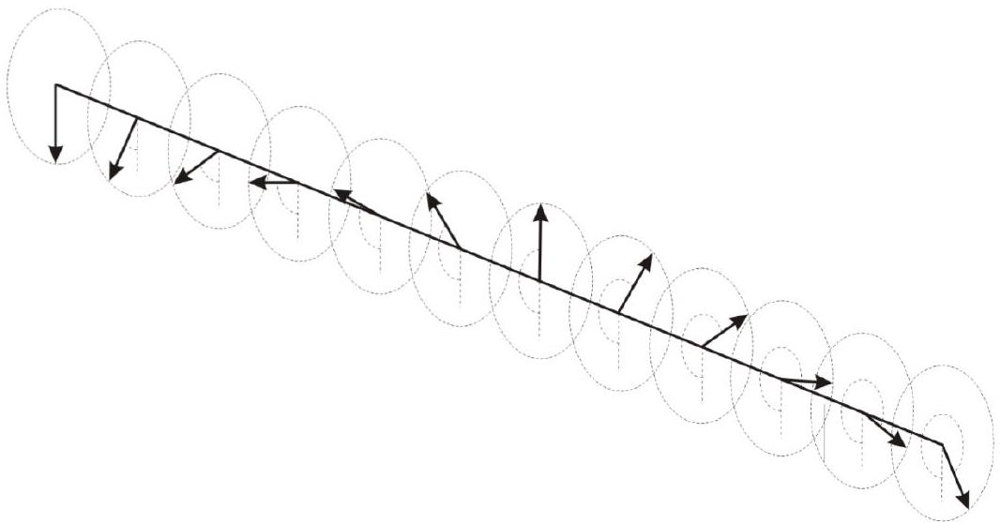

(a) Assuming the absence of gravity first: obtain a differential equation for $\phi ( x , t )$ of the following form
$$
\frac { \partial ^ { 2 } \phi ( x , t ) } { \partial t ^ { 2 } } = \alpha \frac { \partial ^ { 2 } \phi ( x , t ) } { \partial x ^ { 2 } }
$$
where $\alpha$ is some constant.

Solution: Consider the torque acting upon the i-th spoke. We have

$$
\tau = - K \left( \phi _ { i } - \phi _ { i - 1 } \right) - K \left( \phi _ { i } - \phi _ { i + 1 } \right) = K \left( \phi _ { i - 1 } + \phi _ { i + 1 } - 2 \phi _ { i } \right)
$$

Using the continuous assumption, we simplify to

$$
\tau = K b ^ { 2 } \frac { \partial ^ { 2 } \phi ( x , t ) } { \partial x ^ { 2 } }
$$

Relating to angular acceleration, we hence obtain

$$
I \frac { \partial ^ { 2 } \phi ( x , t ) } { \partial t ^ { 2 } } = K b ^ { 2 } \frac { \partial ^ { 2 } \phi ( x , t ) } { \partial x ^ { 2 } }
$$

(b) Using the substitution $\phi ( x , t ) = f ( x \pm v t )$, find the speed of linear wave propagation $v _ { 0 }$ for the scenario in (a). Show your substitution clearly.

Solution: What we obtained in part a is the standard linear wave equation. By making the required substitution given in the problem statement, we can easily obtain

$$
I v ^ { 2 } f ^ { \prime \prime } ( x \pm v t ) = K b ^ { 2 } f ^ { \prime \prime } ( x \pm v t )
$$

where $f ^ { \prime \prime } ( x \pm v t )$ is equivalent to $\frac { d ^ { 2 } f \left( x ^ { \prime } \right) } { d x ^ { \prime 2 } } , x ^ { \prime } = x \pm v t$. Hence, the speed of wave propagation is

$$
v = b \sqrt { \frac { K } { I } }
$$

(c) Now, considering gravity, obtain a differential equation for $\phi ( x , t )$ of the following form
$$
\beta \frac { \partial ^ { 2 } \phi ( x , t ) } { \partial t ^ { 2 } } - \gamma \frac { \partial ^ { 2 } \phi ( x , t ) } { \partial x ^ { 2 } } + \delta \sin \phi ( x , t ) = 0
$$
where $\beta , \gamma$, and $\delta$ are constants to determined. DO NOT use the small angle approximation.
Solution: By including torque due to gravity into the equation obtained in part a, we obtain
$$
I \frac { \partial ^ { 2 } \phi ( x , t ) } { \partial t ^ { 2 } } = - m g d \sin \phi ( x , t ) + K b ^ { 2 } \frac { \partial ^ { 2 } \phi ( x , t ) } { \partial x ^ { 2 } }
$$
(d) Deduce the maximum speed of wave propagation $v _ { \text {max } }$ for the scenario in (c). Justify your answer.
Solution: The speed of any propagating wave entity is strictly less than the maximum speed of linear wave propagation; this is a physical limit defined by the coupling strength between successive spokes.
$$
v _ { \max } = b \sqrt { \frac { K } { I } }
$$

The equation given in (c), ignoring coefficients, is called the Sine-Gordon equation; it is a generalisation of the Klein-Gordon equation

$$
\frac { \partial ^ { 2 } \phi ( x , t ) } { \partial t ^ { 2 } } - \frac { \partial ^ { 2 } \phi ( x , t ) } { \partial x ^ { 2 } } + \phi ( x , t ) = 0
$$

which is a relativistic quantum wave equation for spin-0 particles. (But don't worry - we are not doing quantum field theory here). In this equation, $\phi ( x , t )$ is a field variable; which we gave a physical interpretation as the angular displacement in our mechanical model. Fields possess energy and momenta, not unlike electromagnetic fields. However, the exact nature of these conserved quantities may differ. Note that you do not have to worry about what appears to be inconsistent units - the equation is non-dimensionalised.
Continue to make reference to the pendulum model whenever necessary.

(e) Work with the Klein-Gordon equation. Using the ansatz $\phi ( x , t ) = A e ^ { i ( k x \pm \omega t ) }$, obtain the dispersion relation $\omega ( k )$.

Solution: Substituting and differentiating, it should be fairly straightforward to obtain

$$
\omega ^ { 2 } = 1 + k ^ { 2 }
$$

These are still linear waves with a well-defined dispersion relation. The waves propagate independently and at different speeds; hence wavepackets spread out over time. To better understand nonlinear waves, let us study the soliton solutions of the Sine-Gordon equation.

(f) Show that $\phi _ { s } ( x ) = 4 \arctan e ^ { \pm x }$ is a solution to the Sine-Gordon equation for a static soliton in equilibrium. To simplify things, proving for just the plus case $\phi _ { s } ( x ) =$ $4 \arctan e ^ { x }$ is sufficient. Sketch a graph of $\phi _ { s } ( x )$ for both cases on the same graph and label the asymptotes.
Hint: $\frac { d } { d x } \arctan x = \frac { 1 } { 1 + x ^ { 2 } }$

Solution: The equation reduces to

$$
\frac { \partial ^ { 2 } \phi ( x ) } { \partial x ^ { 2 } } = \sin \phi ( x )
$$

for static solitons. Substituting in the proposed solution,

$$
\frac { \partial ^ { 2 } \phi ( x ) } { \partial x ^ { 2 } } = \frac { d } { d x } \frac { 4 e ^ { x } } { 1 + e ^ { 2 x } } = \frac { 4 \left( e ^ { x } - e ^ { 3 x } \right) } { \left( 1 + e ^ { 2 x } \right) ^ { 2 } }
$$

Furthermore,

$$
\sin \phi ( x ) = \sin \left( 4 \arctan e ^ { x } \right)
$$

Let $\theta = \arctan e ^ { x }$ :

$$
\sin \phi ( x ) = \sin 4 \theta = 2 \sin 2 \theta \cos 2 \theta = 4 \sin \theta \cos \theta \left( 1 - 2 \sin ^ { 2 } \theta \right)
$$

Given $\theta = \arctan e ^ { x }$ we can also obtain $\sin \theta = \frac { e ^ { x } } { \sqrt { 1 + e ^ { 2 x } } }$ and $\cos \theta = \frac { 1 } { \sqrt { 1 + e ^ { 2 x } } }$ :

$$
\sin \phi ( x ) = 4 \frac { e ^ { x } } { \sqrt { 1 + e ^ { 2 x } } } \frac { 1 } { \sqrt { 1 + e ^ { 2 x } } } \left( 1 - \frac { 2 e ^ { 2 x } } { 1 + e ^ { 2 x } } \right) = \frac { 4 e ^ { x } \left( 1 - e ^ { 2 x } \right) } { \left( 1 + e ^ { 2 x } \right) ^ { 2 } }
$$

Hence $\frac { \partial ^ { 2 } \phi ( x ) } { \partial x ^ { 2 } } = \sin \phi ( x )$, and we conclude our proof.
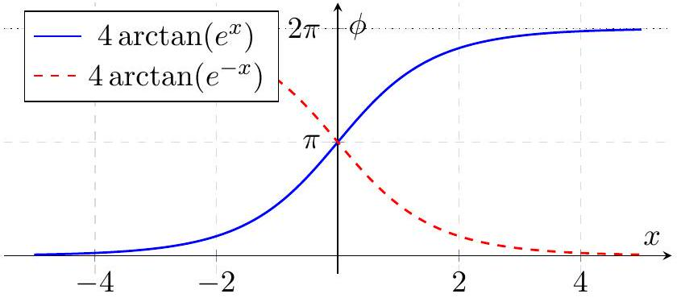
From here on, we will use kink and anti-kink to describe the plus and minus soliton solutions in (f) respectively.

(g) Find the energy $E _ { 0 }$ of a static kink. Hint: Energy is also non-dimensionalised; do not use constants from the mechanical model such as $m$ and $I$ in your answers.

Solution: To get a hint of what the energy should look like, we need to refer back to our mechanical model. (Of course, for those familiar with field theory you are free to directly quote the Hamiltonian - you will be given full credit too)

In the mechanical model we have three sources of energy:

a. Kinetic energy, $\frac { 1 } { 2 } I { \frac { \partial \phi _ { i } } { \partial t } } ^ { 2 }$
b. Torsion energy, $\frac { 1 } { 2 } K \left( \theta _ { i } - \theta _ { i - 1 } \right) ^ { 2 }$
c. Gravitational potential energy, $m g d \left( 1 - \cos \phi _ { i } \right)$

And if we make the continuous assumption, we can define an energy density

$$
\epsilon = \frac { 1 } { 2 } \frac { I } { b } \frac { \partial \phi ( x , t ) ^ { 2 } } { \partial t } + \frac { 1 } { 2 } K b \frac { \partial \phi ( x , t ) ^ { 2 } } { \partial x } + \frac { m g d } { b } ( 1 - \cos \phi ( x , t ) )
$$

It is neater when we work with the nondimensionalised Sine-Gordon equation:

$$
\epsilon ( x , t ) = \frac { 1 } { 2 } \frac { \partial \phi ( x , t ) ^ { 2 } } { \partial t } + \frac { 1 } { 2 } \frac { \partial \phi ( x , t ) ^ { 2 } } { \partial x } + ( 1 - \cos \phi ( x , t ) )
$$

Hence, we find the energy by integrating;

$$
E = \int _ { 0 } ^ { \infty } \frac { 1 } { 2 } \frac { \partial \phi ( x , t ) ^ { 2 } } { \partial t } + \frac { 1 } { 2 } \frac { \partial \phi ( x , t ) ^ { 2 } } { \partial x } + ( 1 - \cos \phi ( x , t ) ) d x
$$

Since we are working with a static kink, there is no kinetic energy. Differentiating $\phi$ by $x$ and manipulating, we get

$$
E = \int _ { 0 } ^ { \infty } \frac { 1 } { 2 } \left( \frac { 4 e ^ { x } } { 1 + e ^ { 2 x } } \right) ^ { 2 } + 2 \left( 2 \sin \frac { \phi _ { s } ( x ) } { 4 } \cos \frac { \phi _ { s } ( x ) } { 4 } \right) ^ { 2 } d x = \int _ { 0 } ^ { \infty } 16 \frac { e ^ { 2 x } } { \left( 1 + e ^ { 2 x } \right) ^ { 2 } } d x
$$

Integrating, we get

$$
E = \left[ - \frac { 8 } { 1 + e ^ { 2 x } } \right] _ { - \infty } ^ { \infty } = 8
$$

(h) i. Let $x ^ { \prime }$ and $t ^ { \prime }$ be the coordinates in a frame moving at relativistic speed $v$ in the positive $x$-direction. Express $x ^ { \prime }$ and $t ^ { \prime }$ in terms of $x$ and $t$.

Solution:

$$
t ^ { \prime } = \gamma ( t - v x ) , \quad x ^ { \prime } = \gamma ( x - v t )
$$

ii. In terms of $\phi ( x , t )$, the field expressed in the moving frame $\phi ^ { \prime } \left( x ^ { \prime } , t ^ { \prime } \right) = \phi ( x , t )$, and the respective coordinates, state an equation which shows that the Sine-Gordan equation is invariant under a Lorentz transformation.

Solution: Since $\sin \phi ^ { \prime } = \sin \phi$, we just need to have

$$
\frac { \partial ^ { 2 } \phi ^ { \prime } \left( x ^ { \prime } , t ^ { \prime } \right) } { \partial t ^ { \prime 2 } } - \frac { \partial ^ { 2 } \phi \left( x ^ { \prime } , t ^ { \prime } \right) } { \partial x ^ { \prime 2 } } = \frac { \partial ^ { 2 } \phi ( x , t ) } { \partial t ^ { 2 } } - \frac { \partial ^ { 2 } \phi ( x , t ) } { \partial x ^ { 2 } }
$$

or written more elegantly,

$$
\partial _ { t ^ { \prime } } ^ { 2 } - \partial _ { x ^ { \prime } } ^ { 2 } = \partial _ { t } ^ { 2 } - \partial _ { x } ^ { 2 }
$$

This is called the d'Alembertian operator.
To prove that it is Lorentz invariant, however, is much more involved. This was the original question but was nerfed as it was too mathematical. But we present the solution below for interested readers.
Using chain rule, the partial derivative operators transform as

$$
\begin{aligned}
& \frac { \partial } { \partial x } = \frac { \partial x ^ { \prime } } { \partial x } \frac { \partial } { \partial x ^ { \prime } } + \frac { \partial t ^ { \prime } } { \partial x } \frac { \partial } { \partial t ^ { \prime } } = \gamma \frac { \partial } { \partial x ^ { \prime } } - \gamma \beta \frac { \partial } { \partial t ^ { \prime } } \\
& \frac { \partial } { \partial t } = \frac { \partial x ^ { \prime } } { \partial t } \frac { \partial } { \partial x ^ { \prime } } + \frac { \partial t ^ { \prime } } { \partial t } \frac { \partial } { \partial t ^ { \prime } } = - \gamma \beta \frac { \partial } { \partial x ^ { \prime } } + \gamma \frac { \partial } { \partial t ^ { \prime } }
\end{aligned}
$$

We now calculate the operator □ in terms of the primed coordinates

$$
\square = \left( \gamma \frac { \partial } { \partial t ^ { \prime } } - \gamma \beta \frac { \partial } { \partial x ^ { \prime } } \right) ^ { 2 } - \left( \gamma \frac { \partial } { \partial x ^ { \prime } } - \gamma \beta \frac { \partial } { \partial t ^ { \prime } } \right) ^ { 2 }
$$

Expanding the squares, we get

$$
\square = \gamma ^ { 2 } \left( \frac { \partial ^ { 2 } } { \partial t ^ { \prime 2 } } - 2 \beta \frac { \partial ^ { 2 } } { \partial t ^ { \prime } \partial x ^ { \prime } } + \beta ^ { 2 } \frac { \partial ^ { 2 } } { \partial x ^ { \prime 2 } } \right) - \gamma ^ { 2 } \left( \frac { \partial ^ { 2 } } { \partial x ^ { \prime 2 } } - 2 \beta \frac { \partial ^ { 2 } } { \partial x ^ { \prime } \partial t ^ { \prime } } + \beta ^ { 2 } \frac { \partial ^ { 2 } } { \partial t ^ { \prime 2 } } \right)
$$

The mixed partial derivative terms cancel out. Collecting the remaining terms gives us

$$
\square = \gamma ^ { 2 } \left( 1 - \beta ^ { 2 } \right) \frac { \partial ^ { 2 } } { \partial t ^ { \prime 2 } } - \gamma ^ { 2 } \left( 1 - \beta ^ { 2 } \right) \frac { \partial ^ { 2 } } { \partial x ^ { \prime 2 } }
$$

Since $\gamma ^ { 2 } = \frac { 1 } { 1 - \beta ^ { 2 } }$, the coefficients become unity:

$$
\square = \frac { \partial ^ { 2 } } { \partial t ^ { \prime 2 } } - \frac { \partial ^ { 2 } } { \partial x ^ { \prime 2 } } = \square ^ { \prime }
$$

Because $\phi$ is a Lorentz scalar $\left( \phi = \phi ^ { \prime } \right)$, and the operator □ is invariant $( \square =$ □'), the equation transforms as:

$$
\square ^ { \prime } \phi ^ { \prime } + \sin \phi ^ { \prime } = 0
$$

The equation holds the same form in all inertial frames, proving it is indeed Lorentz invariant.

From here on, you may assume the Sine-Gordan equation to be Lorentz invariant.

(i) Using your results in (f) and (h), find the solution $\phi _ { k } ( x , t )$ to a solitary kink propagating at speed $v$ in the positive $x$-direction.

Solution: Having shown Lorentz invariance, it is a simple matter of applying our results. We can think of a kink propagating at speed $v$ as a Lorentz boost applied upon a static kink $\phi _ { s }$ ! Hence

$$
\phi _ { s } = 4 \arctan e ^ { x } \rightarrow \phi _ { k } = 4 \arctan e ^ { \frac { x - v t } { \sqrt { 1 - v ^ { 2 } } } }
$$

This is in fact simply length contraction; the factor of $\gamma = \frac { 1 } { \sqrt { 1 - v ^ { 2 } } }$ compresses the graph of $\phi _ { k } ( x )$ at any snapshot of time along the x-axis.
(j) What is the energy $E _ { v }$ of a kink propagating at speed $v$ ? Express your answer in terms of $E _ { 0 }$ and $v$.
Solution: Similarly we use relativistic analogy; we can simply infer that
$$
E _ { v } = \frac { E _ { 0 } } { \sqrt { 1 - v ^ { 2 } } }
$$
This is doable without relativistic methods - repeat the procedure in part g, and include kinetic terms. But given that the question is only allocated one mark, students should not be looking to do too much math.
(k) Now, consider two static kinks separated by a very large distance $D$. By considering the energy density or otherwise, deduce and justify a scaling relation between the interaction energy $\Delta E$ and the distance of separation $D$.
Solution: Near both static kinks, the influence from the other static kink is extremely small; hence the change in energy density at points near the kinks is very small. We want to consider what happens at the midpoint of the kinks, since that is where the energy density is most sensitive to changes in $D$.
Referring back to our results in part g, we can say that the energy density for each kink is:
$$
\epsilon ( x ) = 16 \frac { e ^ { 2 x } } { \left( 1 + e ^ { 2 x } \right) ^ { 2 } }
$$
Hence, the energy density at the midpoint of the two kinks is:
$$
\epsilon ( 0 ) = 16 \frac { e ^ { D } } { \left( 1 + e ^ { D } \right) ^ { 2 } } + 16 \frac { e ^ { - D } } { \left( 1 + e ^ { - D } \right) ^ { 2 } } \approx \frac { 16 } { e ^ { D } } + 16 e ^ { - D } = 32 e ^ { - D }
$$
We hence conclude that $\Delta E \propto e ^ { - D }$.
(l) Using your results in (k), deduce whether the interaction force of each pair below are attractive or repulsive.
    a. kink - kink
    b. kink - antikink
    c. antikink - antikink
Solution: For a kink-anti-kink pair, the $\frac { d E } { d D } < 0$, so the interaction force is attractive since $F = - \frac { d E } { d D }$. The same logic applies to the other pairs.
The answer is therefore a. repulsive, b. attractive, c. repulsive. In literature, kinks and antikinks are assigned something called topological charge - kinks have +1 charge, and antikinks have -1 charge.

Marking Scheme:

| Part | Steps | Marks |
| :--- | :--- | :--- |
| (a) | Correct change from discrete to continuous assumption | M1 |
|  | Correct answer $\alpha = K b ^ { 2 } / I$ | A1 |
| (b) | Correct differentiation | M0.5 |
|  | Correct answer $v = b \sqrt { K / I }$ | A0.5 |
| (c) | $\beta , \gamma , \delta$ are all correct | A1 |
| (d) | Correct answer $v _ { \text {max } } = b \sqrt { K / I }$ | A0.5 |
|  | Reasonable justification | A0.5 |
| (e) | Correct substitution and answer | A1 |
| (f) | Find $\partial ^ { 2 } \phi / \partial ^ { 2 } x$ correctly | M0. 7 |
|  | Find $\sin \phi$ correctly and match $\partial ^ { 2 } \phi / \partial ^ { 2 } x$ | A0.7 |
|  | Correct Sketch of graph and labelling of asymptote | A0.6 |
| (g) | Realise theres no KE for static kink | M0.5 |
|  | Find torsion energy correctly as $\frac { 1 } { 2 } \left( \frac { \partial \phi } { \partial x } \right) ^ { 2 }$ | M1 |
|  | Find GPE correctly as ( $1 - \cos \phi$ ) | M1 |
|  | Integrate correctly and obtain answer | A0.5 |
| (h)(i) | Correct $x ^ { \prime }$ AND $t ^ { \prime }$ | A1 |
| (h)(ii) | Correct invariant equation | A1 |
| (i) | Correct $\phi _ { k }$ | A1 |
| (j) | Correct energy $E _ { v } = \gamma E _ { 0 }$ | A1 |
| (k) | Consider energy density at midpoint between kinks | M2 |
|  | Correct scaling $\Delta E \propto e ^ { - D }$ | A1 |
| (l) | All 3 forces correct | A1 |

Fundamental Physical Constants - Frequently used constants
| Quantity | Symbol | Value | Unit | Relative std. uncert. $u _ { \mathrm { r } }$ |
| :--- | :--- | :--- | :--- | :--- |
| speed of light in vacuum | $c$ | 299792458 | $\mathrm { m } \mathrm { s } ^ { - 1 }$ | exact |
| Newtonian constant of gravitation | $G$ | $6.67430 ( 15 ) \times 10 ^ { - 11 }$ | $\mathrm { m } ^ { 3 } \mathrm {~kg} ^ { - 1 } \mathrm {~s} ^ { - 2 }$ | $2.2 \times 10 ^ { - 5 }$ |
| Planck constant* | $h$ | $6.62607015 \times 10 ^ { - 34 }$ | $\mathrm { J } \mathrm { Hz } ^ { - 1 }$ | exact |
|  | ћ | $1.054571817 \ldots \times 10 ^ { - 34 }$ | J s | exact |
| elementary charge | $e$ | $1.602176634 \times 10 ^ { - 19 }$ | C | exact |
| vacuum magnetic permeability $4 \pi \alpha \hbar / e ^ { 2 } c$ | $\mu _ { 0 }$ | $1.25663706127 ( 20 ) \times 10 ^ { - 6 }$ | $\mathrm { N } \mathrm { A } ^ { - 2 }$ | $1.6 \times 10 ^ { - 10 }$ |
| vacuum electric permittivity $1 / \mu _ { 0 } c ^ { 2 }$ | $\epsilon _ { 0 }$ | $8.8541878188 ( 14 ) \times 10 ^ { - 12 }$ | $\mathrm { F } \mathrm { m } ^ { - 1 }$ | $1.6 \times 10 ^ { - 10 }$ |
| Josephson constant $2 e / h$ | $K _ { \mathrm { J } }$ | $483597.8484 \ldots \times 10 ^ { 9 }$ | $\mathrm { Hz } \mathrm { V } ^ { - 1 }$ | exact |
| von Klitzing constant $\mu _ { 0 } c / 2 \alpha = 2 \pi \hbar / e ^ { 2 }$ | $R _ { \mathrm { K } }$ | $25812.80745 \ldots$ | $\Omega$ | exact |
| magnetic flux quantum $2 \pi \hbar / ( 2 e )$ | $\Phi _ { 0 }$ | $2.067833848 \ldots \times 10 ^ { - 15 }$ | Wb | exact |
| conductance quantum $2 e ^ { 2 } / 2 \pi \hbar$ | $G _ { 0 }$ | $7.748091729 \ldots \times 10 ^ { - 5 }$ | S | exact |
| electron mass | $m _ { \mathrm { e } }$ | $9.1093837139 ( 28 ) \times 10 ^ { - 31 }$ | kg | $3.1 \times 10 ^ { - 10 }$ |
| proton mass | $m _ { \mathrm { p } }$ | $1.67262192595 ( 52 ) \times 10 ^ { - 27 }$ | kg | $3.1 \times 10 ^ { - 10 }$ |
| proton-electron mass ratio | $m _ { \mathrm { p } } / m _ { \mathrm { e } }$ | 1836.152673 426(32) |  | $1.7 \times 10 ^ { - 11 }$ |
| fine-structure constant $e ^ { 2 } / 4 \pi \epsilon _ { 0 } \hbar c$ | $\alpha$ | $7.2973525643 ( 11 ) \times 10 ^ { - 3 }$ |  | $1.6 \times 10 ^ { - 10 }$ |
| inverse fine-structure constant | $\alpha ^ { - 1 }$ | 137.035999 177(21) |  | $1.6 \times 10 ^ { - 10 }$ |
| Rydberg frequency $\alpha ^ { 2 } m _ { \mathrm { e } } c ^ { 2 } / 2 h$ | $c R _ { \infty }$ | $3.2898419602500 ( 36 ) \times 10 ^ { 15 }$ | Hz | $1.1 \times 10 ^ { - 12 }$ |
| Boltzmann constant | $k$ | $1.380649 \times 10 ^ { - 23 }$ | $\mathrm { J } \mathrm { K } ^ { - 1 }$ | exact |
| Avogadro constant | $N _ { \mathrm { A } }$ | $6.02214076 \times 10 ^ { 23 }$ | $\mathrm { mol } ^ { - 1 }$ | exact |
| molar gas constant $N _ { \mathrm { A } } k$ | $R$ | 8.314462618 … | $\mathrm { J } \mathrm { mol } ^ { - 1 } \mathrm {~K} ^ { - 1 }$ | exact |
| Faraday constant $N _ { \mathrm { A } } e$ | $F$ | $96485.33212 \ldots$. | $\mathrm { C } \mathrm { mol } ^ { - 1 }$ | exact |
| Stefan-Boltzmann constant $\left( \pi ^ { 2 } / 60 \right) k ^ { 4 } / \hbar ^ { 3 } c ^ { 2 }$ | $\sigma$ | $5.670374419 \ldots \times 10 ^ { - 8 }$ | $\mathrm { W } \mathrm { m } ^ { - 2 } \mathrm {~K} ^ { - 4 }$ | exact |
| Non-SI units accepted for use with the SI |  |  |  |  |
| electron volt ( $e / \mathrm { C }$ ) J | eV | $1.602176634 \times 10 ^ { - 19 }$ | J | exact |
| (unified) atomic mass unit $\frac { 1 } { 12 } m \left( { } ^ { 12 } \mathrm { C } \right)$ | u | $1.66053906892 ( 52 ) \times 10 ^ { - 27 }$ | kg | $3.1 \times 10 ^ { - 10 }$ |

[^0]

[^0]:    * The energy of a photon with frequency $\nu$ expressed in unit Hz is $E = h \nu$ in J. Unitary time evolution of the state of this photon is given by $\exp ( - i E t / \hbar ) | \varphi \rangle$, where $| \varphi \rangle$ is the photon state at time $t = 0$ and time is expressed in unit s. The ratio $E t / \hbar$ is a phase.
