(a) The modes are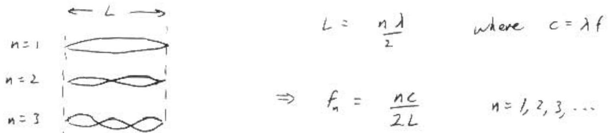
(b)
$$
n _ { 0 } = \frac { 2 L f _ { n _ { 0 } } } { c } = \frac { 2 ( 1.5 \mathrm {~m} ) \left( 5 \times 10 ^ { 14 } / \mathrm { s } \right) } { 3 \times 10 ^ { 8 } \mathrm {~m} / \mathrm { s } } = 5 \times 10 ^ { 6 }
$$
(c)
$$
\begin{aligned}
& f _ { n _ { 0 } } \pm \Delta f = \left( n _ { 0 } \pm \Delta n \right) \frac { c } { 2 L } \\
& f _ { n _ { 0 } } \pm \Delta f = \frac { n f } { 2 L } \pm \frac { c } { 2 L } \Delta n \\
& \Delta n = \frac { 2 L } { c } \Delta f = \frac { 2 ( 1.5 \mathrm {~m} ) \left( 1 \times 10 ^ { 9 } / \mathrm { s } \right) } { 3 \times 10 ^ { 8 } \mathrm {~m} / \mathrm { s } } = 10
\end{aligned}
$$
So The frequencies being excited into resonance are Thase corresponding to $n _ { 0 } , n _ { 0 } \pm 1 , n _ { 0 } \pm 2 , \ldots , n _ { 0 } \pm 10$

21 modes

(d) From (c), we note that as $L$ gets shorter, an gets smaller ( $\Delta f$ is fixed by the plasma tube, not the cavity). Decreasing $L$, The first modes to go away are $n _ { 0 } \pm 10$, next is $n _ { 0 } \pm 9$, etc. To lop off $\pm 10$ modes, the length $L$ must be $\frac { 1 } { 10 }$ as long as before (since $L \propto \Delta _ { n }$ ). Hence
$$
L = \frac { 1.5 \mathrm {~m} } { 10 } = 15 \mathrm {~cm} .
$$

Lach hop is a projectile motion, so that

$$
\begin{equation*}
x - v _ { v ⿻ 二 } l , \tag{2}
\end{equation*}
$$

and

$$
\begin{equation*}
\left. t = 2 v _ { v } / g \text { (from } \theta = y = v _ { v a } t - k g t ^ { \prime } \right) \text {, } \tag{2}
\end{equation*}
$$

and upon eliminating $t$, the range $L$ of a hop is

$$
\begin{equation*}
L = 2 v _ { i u x } v _ { i x } / g . \tag{2}
\end{equation*}
$$

Since $v _ { v _ { i , n , } : } = \epsilon _ { i } v _ { i e v s }$ and $v _ { i , n , n } = \epsilon , v _ { i , n n }$, it follows that

$$
\begin{align*}
v _ { n , n + } & = \epsilon _ { y } ^ { n } v _ { n > 1 }  \tag{1}\\
v _ { n , n + j } & = \epsilon _ { i } ^ { n } v _ { n , j }  \tag{1}\\
L _ { n } & = \left( \epsilon _ { 1 } \epsilon _ { v } \right) ^ { n } L _ { j }  \tag{2}\\
t _ { n } & = L _ { n } ; v _ { n a n - j } = \epsilon _ { 1 } ^ { n } t _ { i } \tag{2}
\end{align*}
$$

The total range is

$$
\begin{align*}
L ^ { * } & = L _ { 1 } + L _ { 2 } + L _ { 3 } + L _ { 3 } + \ldots \\
& = L _ { 1 } \left[ 1 - E _ { 3 } E _ { 3 } + \left( E _ { 1 } E _ { x } \right) ^ { 2 } + \left( E _ { 1 } E _ { 2 } \right) ^ { 7 } \ldots 1 \right. \\
& = L _ { 1 } \left[ 1 - E _ { 3 } \epsilon _ { 3 } \right] \tag{2}
\end{align*}
$$

The total time is

$$
\begin{align*}
t ^ { * } & = t _ { i } + t _ { 2 } + t _ { 3 } + t _ { 2 } + \ldots \\
& = t _ { 2 } \left[ 1 + \epsilon _ { 3 } + \left( \epsilon _ { 4 } \right) ^ { 2 } + \left( \epsilon _ { 6 } \right) ^ { 3 } + 1 \right. \\
& = t _ { 1 } \left[ 1 - \epsilon _ { 2 } \right] ^ { 1 } \tag{2}
\end{align*}
$$

The angle $\theta _ { i }$ is given by

$$
\begin{align*}
\theta _ { i } & = \tan ^ { - 1 } \left( v _ { v _ { i } } / v _ { u _ { i } } \right) \\
& = \tan ^ { - 1 } \left( g t _ { i } ^ { 2 } / 2 L _ { i } \right) \\
& = \tan ^ { - 1 } \left\{ \left[ g t ^ { * 2 } \left( 1 - \epsilon _ { v } \right) ^ { 2 } \right] / \left[ 2 L ^ { * } \left( 1 - \epsilon _ { 1 } \epsilon _ { 1 } \right) \right] \right\} \tag{4}
\end{align*}
$$

(a) as $t \rightarrow \infty$ the circuit becumes:
In parallel, so
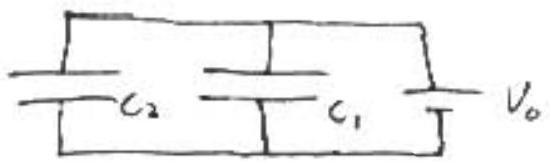
$$
\begin{aligned}
V _ { 1 } & = V _ { 2 } = V _ { 0 } = 10 \mathrm {~V} \\
\Rightarrow \quad q _ { 1 } & = C _ { 1 } V _ { 0 } = ( 1 \mathrm { MF } ) ( 10 \mathrm {~V} ) = 10 \mathrm { mC } \\
q _ { 2 } & = C _ { 2 } V _ { 0 } = ( 4 \mu \mathrm {~F} ) ( 10 \mathrm {~V} ) = 40 \mu \mathrm { C }
\end{aligned}
$$
(b) as $t \rightarrow \infty$, current flows through outer loop unly,
$$
I = \frac { 10 \mathrm {~V} } { 100 \Omega } = \frac { 1 } { 10 } \mathrm {~A}
$$
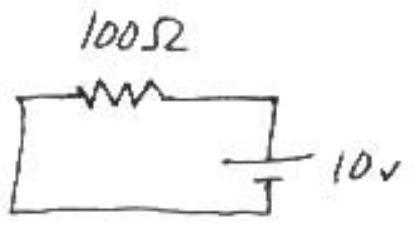
$C _ { 2 }$ is in parallel with the $25 \Omega$ resistor by $S _ { 3 }$ :
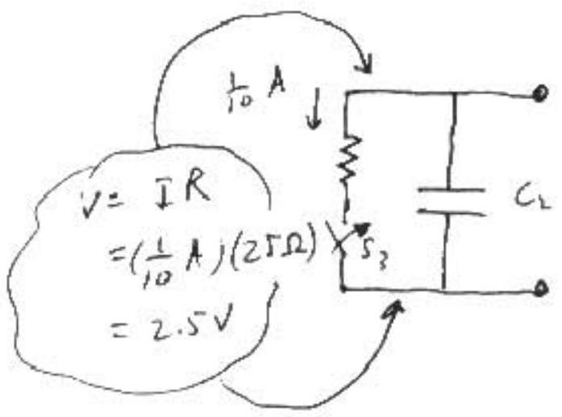
$$
\begin{aligned}
\Rightarrow q _ { 2 } & = c _ { 2 } V _ { 2 } = ( 4 \mu \mathrm {~F} ) ( 2.5 \mathrm {~V} ) \\
& = 10 \mu \mathrm { C }
\end{aligned}
$$
$C _ { 1 }$ is in parallel with $50 \Omega$
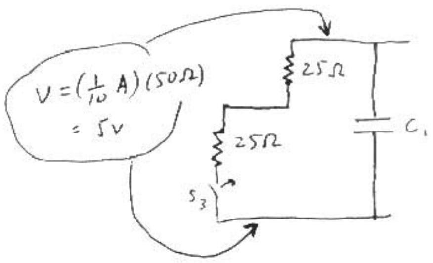
$$
\begin{aligned}
q _ { 1 } & = C _ { 1 } V _ { 1 } = \left( I _ { \mu } F \right) ( 5 v ) \\
& = S _ { \mu } C
\end{aligned}
$$

(c) From (b), $q _ { \text {total } } = q _ { 1 } + q _ { 2 } = 15 \mu c$ Now the charge may only redistribute itself until $V _ { 1 } = V _ { 2 }$
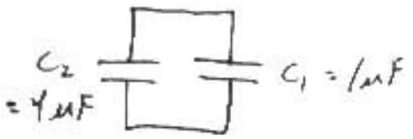
$$
\begin{gathered}
q _ { 1 } + q _ { 2 } = 15 \mu \mathrm { C } \quad \text { and } \quad \frac { q _ { 1 } } { c _ { 1 } } = \frac { q _ { 2 } } { c _ { 2 } } \\
\qquad \frac { 5 } { 4 } = \frac { c _ { 1 } } { c _ { 2 } } q _ { 2 } = 4 q _ { 2 } = 15 \mu \mathrm { c } \quad \text { or } \quad q _ { 2 } = 12 \mu c \quad \Rightarrow q _ { 1 } = 3 \mu c
\end{gathered}
$$
(d) initial
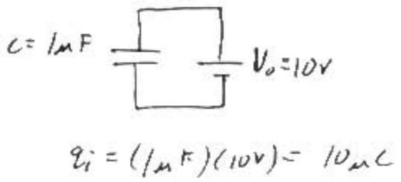
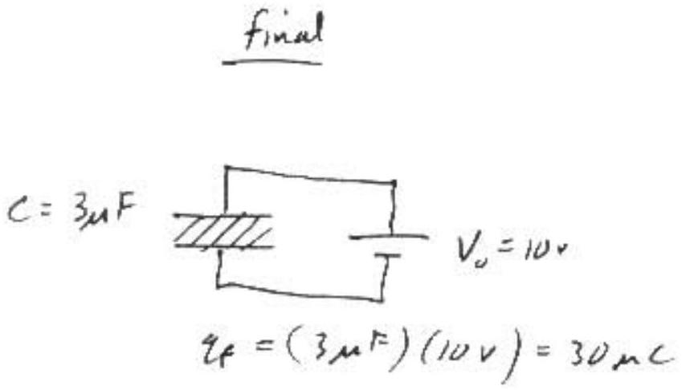
Battery connected, $V$ does not change, but $q$ does
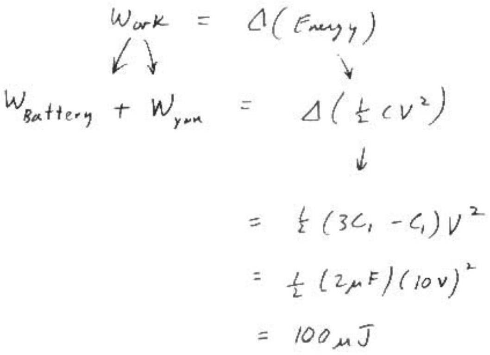

(a) To conserve momentum the atom must recoil. Thus after emitting The photion, the atom carries some kinetic energy $K$, leaving less than $E _ { 0 }$ for photon.
(b) Before decay After decay

(M)
(Energy, momentum) $= \left( M ^ { \prime } c ^ { 2 } , 0 \right)$
Conservation of Energy
Conservation of Energy
$\stackrel { p } { \leftarrow } ( M )$
$\left( M C ^ { 2 } + K , - \rho \right)$
photur
( $E , E / c$ )
Curs. of Momentum

$$
\begin{gathered}
M ^ { \prime } c ^ { 2 } = M c ^ { 2 } + K + E \\
\left( M ^ { \prime } - M \right) c ^ { 2 } = K + E \\
E _ { 0 } = K + E
\end{gathered}
$$

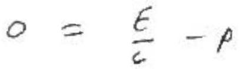

$$
p = \frac { E } { c }
$$

since the atom is Reavy, $v \ll c$ and $k \simeq p ^ { 2 } / 2 m$, or
given $\frac { E _ { 0 } } { 2 m c ^ { 2 } } \ll 1$
$p \approx \sqrt { 2 m K }$ for atom
since $k$ and $E$ are $< E _ { v }$,
$\frac { k } { 2 m c ^ { 2 } }$ and $\frac { E } { 2 m c ^ { 2 } }$ are $\ll 1$

$$
\sqrt { 2 m k } = \frac { E } { 2 } \Rightarrow k = \frac { t ^ { 2 } } { 2 m t ^ { 2 } }
$$

too
or, relativistically,

$$
\begin{gathered}
\left( M c ^ { 2 } \right) ^ { 2 } = \left( K + M c ^ { 2 } \right) ^ { 2 } - ( \rho c ) ^ { 2 } \\
\Rightarrow K = M c ^ { 2 } \left[ \sqrt { 1 + \left( \frac { E } { M c ^ { 2 } } \right) ^ { 2 } } - 1 \right] \\
\simeq E ^ { 2 } / 2 M c ^ { 2 }
\end{gathered}
$$

Conservation of Energy Equation becomes

$$
\begin{aligned}
E _ { 0 } & = \frac { E ^ { - 2 } } { 2 m c ^ { 2 } } + E \\
\Rightarrow E & = E _ { 0 } \left( 1 + \frac { E } { 2 m c ^ { 2 } } \right) ^ { - 1 } \\
& \approx E _ { 0 } \left( 1 - \frac { E } { 2 m c ^ { 2 } } \right) \quad \text { Iterate } \\
& = E _ { 0 } \left[ 1 - \frac { E _ { 0 } \left( 1 - E / 2 m c ^ { 2 } \right) } { 2 m c ^ { 2 } } \right]
\end{aligned}
$$

Alternate: Quadratic formula -

$$
\begin{aligned}
& E ^ { 2 } + r E ^ { 2 } + r E _ { 0 } = 0 \\
& \text { where } r = 2 m c ^ { 2 }
\end{aligned}
$$

since $\epsilon > 0$ take +

$$
E = E _ { 0 } ( 1 - \gamma )
$$

Note: 2nd onder seceded Binomial

If $d \equiv \frac { E _ { 0 } } { 2 m c ^ { 2 } } \ll 1$ Then $\frac { E E _ { 0 } } { \left( 2 m c ^ { 2 } \right) ^ { 2 } } \approx d ^ { 2 }$ it negligible

$$
\Rightarrow \quad E \approx E _ { 0 } \left( 1 - \frac { E _ { 0 } } { 2 m c ^ { 2 } } \right)
$$

(c) From purt (b),
$$
E _ { 0 } - E = \frac { E _ { 0 } ^ { 2 } } { 2 m c ^ { 2 } }
$$
Using $E = h f$, and writing $E _ { 0 } ^ { 2 } = h f _ { 0 } E _ { 0 }$,
$$
\begin{aligned}
& h \left( f _ { 0 } - f \right) = \frac { h f _ { 0 } E _ { 0 } } { 2 m c ^ { 2 } } \\
& \frac { \Delta f } { f _ { 0 } } = \frac { E _ { 0 } } { 2 m c ^ { 2 } } = \frac { 4 \times 10 ^ { 5 } \mathrm { eV } } { 2 \left( 2 \times 10 ^ { n } \mathrm { eV } \right) } = 10 ^ { - 6 }
\end{aligned}
$$

(d) For $v \ll c$, Duppler stift says
$\frac { V } { C } = \frac { \Delta \lambda } { \lambda } \quad$ where $c = \lambda f$
Since $f _ { 0 } > f$, the observer must move towards the photm

$$
\stackrel { c } { \rightarrow } \quad \leftarrow q
$$

$$
\Delta \lambda = c \Delta \left( \frac { 1 } { f } \right) = - \frac { \Delta f } { f ^ { 2 } } c
$$

∴ (in magnitude)

$$
\begin{aligned}
\frac { v } { c } & = \frac { \Delta f } { f ^ { 2 } } \frac { c } { \lambda } \\
& = \frac { \Delta f } { f }
\end{aligned}
$$

Afternate:

$$
\begin{aligned}
c & = \lambda f \\
d c & = 0 = \lambda d f + f d \lambda \\
d \lambda & = - \lambda \frac { d f } { f } \\
\frac { d \lambda } { \lambda } & = - \frac { d f } { f }
\end{aligned}
$$

minus sign meases that a decrease in $\lambda$ curresponds to increase in frequency!

$$
\begin{aligned}
v & = \frac { \Delta f } { f _ { 0 } } c \\
& = 10 ^ { - 6 } c \\
& = 300 \mathrm {~m} / \mathrm { s }
\end{aligned}
$$

(a) Use Gauss' law: flux of $\vec { E } = \frac { 1 } { \varepsilon _ { 0 } }$ (charge enclosed) ↓
$$
\begin{aligned}
& E z \pi r h = \frac { 1 } { \varepsilon _ { 0 } } \left( n _ { 0 } e \right) \left( \pi r ^ { 2 } h \right) \\
& F = \left( \frac { n _ { 0 } e } { 2 \varepsilon _ { 0 } } \right) r \\
& \vec { E } = \frac { n _ { 0 } e } { 2 \varepsilon _ { 0 } } r ( - \hat { r } ) \quad \begin{array} { l }
\text { rudiully } \\
\text { in }
\end{array}
\end{aligned}
$$
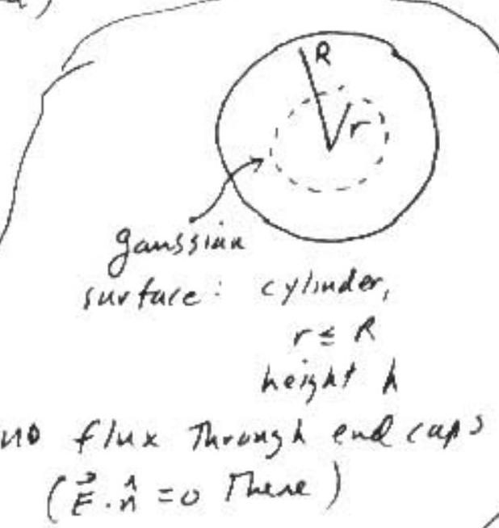
(n)
$$
\begin{aligned}
\vec { F } & = q ( \vec { E } + \vec { V } \times \vec { B } ) \\
& = - e \left[ - \frac { n _ { 0 } e r } { 2 \varepsilon _ { 0 } } \hat { r } + r \omega B _ { 0 } \hat { r } \right] \\
\vec { F } & = \left( \frac { n _ { 0 } e ^ { 2 } r } { 2 \varepsilon _ { 0 } } - r \omega B _ { 0 } e \right) \hat { r }
\end{aligned}
$$
$$
\begin{aligned}
& \vec { B } = B _ { \nu } k \\
& \vec { v } = r \omega \hat { \theta } \\
& \hat { \theta } \times \hat { k } = \hat { r }
\end{aligned}
$$
(c)
(c)
$$
\begin{aligned}
& \vec { F } = m \vec { a } \\
& \left( \frac { n _ { 0 } e ^ { 2 } r } { 2 \varepsilon _ { 0 } } - r \omega B _ { 0 } e \right) \hat { r } = m \frac { ( r \omega ) ^ { 2 } } { r } ( - \hat { r } ) \\
& \Rightarrow \quad \frac { n _ { 0 } e ^ { 2 } } { 2 \varepsilon _ { 0 } } - \omega B _ { 0 } e + m \omega ^ { 2 } = 0 \\
& \omega ^ { 2 } - \left( \frac { B e } { m } \right) \omega + \frac { n _ { 0 } e ^ { 2 } } { 2 \varepsilon _ { 0 } m } = 0 \\
& \omega ^ { 2 } - \omega _ { c } \omega + \frac { 1 } { 2 } \omega _ { 1 } ^ { 2 } = 0
\end{aligned}
$$

$$
\begin{aligned}
& \omega = \frac { \omega _ { c } } { 2 } \pm \frac { 1 } { 2 } \sqrt { \omega _ { c } ^ { 2 } - 2 \omega _ { f } ^ { 2 } } \\
& \omega = \frac { \omega _ { c } } { 2 } \left( 1 \pm \sqrt { 1 - 2 \left( \frac { \omega _ { c } } { \omega _ { c } } \right) ^ { 2 } } \right)
\end{aligned}
$$

(d) Since $\omega$ is real, this requires
$$
\begin{aligned}
1 - 2 \left( \frac { w _ { p } } { w _ { c } } \right) ^ { 2 } & \geqslant 0 \\
w _ { p } ^ { 2 } & \leq \frac { 1 } { 2 } w _ { c } ^ { 2 } \\
\frac { n _ { 0 } e ^ { 2 } } { \varepsilon _ { 0 } m } & \leq \frac { 1 } { 2 } \frac { e ^ { 2 } B _ { 0 } ^ { 2 } } { m ^ { 2 } } \\
n _ { 0 } & \leq \frac { B _ { 0 } ^ { 2 } \varepsilon _ { 0 } } { 2 m } \quad \text { so } \left( n _ { 0 } \right) _ { \text {max } } = \frac { B _ { 0 } ^ { 2 } \varepsilon _ { 0 } } { 2 m }
\end{aligned}
$$
(e)
$$
\begin{aligned}
\left( n _ { 0 } \right) _ { \text {max } } & = \frac { B _ { 0 } ^ { 2 } \varepsilon _ { 0 } } { 2 m } \quad \text { use } \mu _ { 0 } \varepsilon _ { 0 } = \frac { 1 } { c ^ { 2 } } \\
& = \frac { B _ { 0 } ^ { 2 } } { 2 m \left( \mu _ { 0 } c ^ { 2 } \right) } \\
& = \frac { B _ { 0 } ^ { 2 } / 2 \mu _ { 0 } } { m c ^ { 2 } } = \frac { \text { magnetic field energy density } } { \text { electron mass energy } }
\end{aligned}
$$

opppy somperes haw,

(e)
$$
\oint _ { c } \vec { B } \cdot d \vec { l } = \mu _ { 0 } I _ { s }
$$
where $G =$ boundary of $S$
$$
B ^ { \prime } h = \mu _ { 0 } \int _ { s } j d a
$$
where $f =$ current density
$$
\begin{aligned}
& = \left( n _ { 0 } e \right) v \\
& = n _ { 0 } e r ^ { \prime } \omega
\end{aligned}
$$
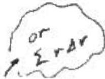
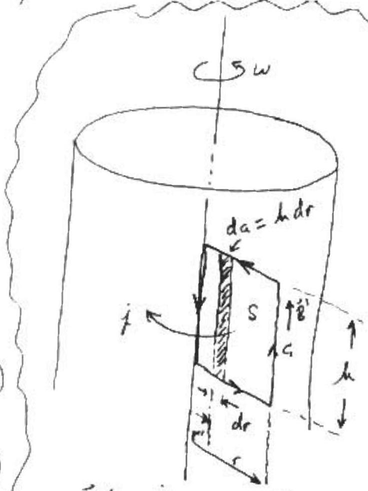
$$
\begin{aligned}
& B ^ { \prime } h = \mu _ { 0 } \left( n _ { 0 } e \omega \right) \int _ { 0 } ^ { r } r ^ { \prime } \left( d r ^ { \prime } h \right) \\
& B ^ { \prime } h = \mu _ { 0 } n _ { 0 } e \omega h \int _ { 0 } ^ { r } r ^ { \prime } d r ^ { \prime } \\
& B ^ { \prime } = \mu _ { 0 } n _ { 0 } e \omega \frac { r ^ { 2 } } { 2 }
\end{aligned}
$$
$$
\vec { B } ^ { \prime } = \text { induced field } = B ^ { \prime } \hat { k }
$$
given $\vec { B } ^ { \prime } = 0$ on axis
note $\bar { B } ^ { \prime } \cdot d \bar { l } = 0$ horizantally
(t) Force due to induced magnetic field is $\vec { F } ^ { \prime }$ where
$$
\begin{aligned}
\vec { F } ^ { \prime } & = - e \vec { v } \times \vec { B } ^ { \prime } = - e ( r \omega \hat { \theta } ) \times \left( \mu _ { 0 } n _ { 0 } e \omega \frac { r ^ { 2 } } { 2 } \hat { k } \right. \\
& = \frac { \mu _ { 0 } n _ { 0 } e ^ { 2 } } { 2 } \omega ^ { 2 } r ^ { 3 } ( - \hat { r } ) \\
\left| \vec { F } ^ { \prime } \right| & = \frac { 1 } { 2 } \mu _ { 0 } n _ { 0 } e ^ { 2 } v ^ { 2 } r \\
\therefore \quad \frac { \left| \vec { F } ^ { \prime } \right| } { \left| \vec { F } _ { e l } \right| } & = \frac { \frac { 1 } { 2 } \mu _ { 0 } n _ { 0 } e ^ { 2 } v ^ { 2 } r } { \frac { 1 } { 2 } \frac { n _ { 0 } e ^ { 2 } r } { \varepsilon _ { 0 } } } = \mu _ { 0 } \varepsilon _ { 0 } v ^ { 2 } = \frac { v ^ { 2 } } { e ^ { 2 } }
\end{aligned}
$$
$| e \vec { E } |$ where $| \vec { E } |$ is from part (a)

(a) Apply $F = m a$ to a slab of atmosphere of Thickness $d y$, cross-sectional area $A$, density $\rho$. Take y positive upwards.
Furces :
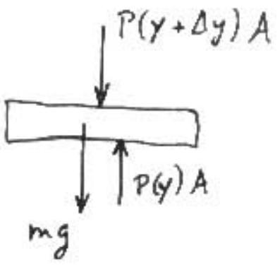
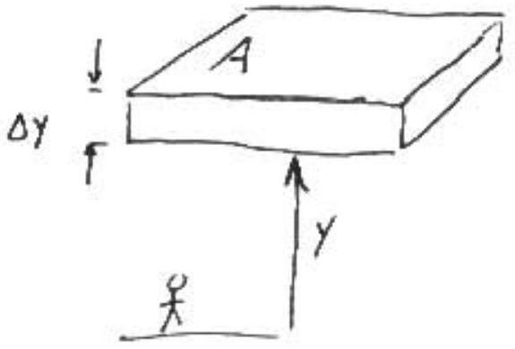
$$
F = m a \quad ( \text { which } = 0 )
$$
$$
\begin{aligned}
P ( y ) A - P ( y + \Delta y ) A & - ( \rho A \Delta y ) g = 0 \\
\underbrace { P ( y + \Delta y ) - P ( y ) } _ { \Delta P } & = - \rho g \Delta y \\
& = - \rho g \Delta y
\end{aligned}
$$
$$
\text { note } \quad \begin{aligned}
& \rho = \rho ( y ) \\
& g = g ( y )
\end{aligned}
$$

(b) Since $V _ { 0 } = \frac { - \Delta y } { \Delta t }$ (probe going down, $y$ points up)

$$
\begin{align*}
& \Delta p = - \rho g \Delta y \text { gives } \\
& \frac { \Delta p } { \Delta t } = \rho g v _ { 0 } \tag{1}
\end{align*}
$$

Need $\rho$ : From ideal gas eq. of state $P V = n R T$,

$$
\begin{aligned}
P = \frac { n } { V } R T \quad \text { where } \frac { n } { V } & = \frac { \# \text { moles } } { \text { vol. } } \\
& = \frac { \# \text { moles } } { \text { mass } } \frac { \text { mass } } { \text { vol. } } \\
\frac { n } { V } & = \frac { 1 } { M } \rho
\end{aligned}
$$

$$
\begin{align*}
\Rightarrow p & = \frac { p } { M } R T \\
p & = \frac { P M } { R T } \tag{2}
\end{align*}
$$

using $\rho$ from (2) in (1),

$$
\begin{align*}
& \frac { \Delta P } { \Delta t } = \frac { P M } { R T } g v _ { 0 } \\
& v _ { 0 } = \left( \frac { \Delta P } { \Delta t } \right) \frac { R T } { P M g } \tag{3}
\end{align*}
$$

From graph, probe lands on surface at $t = 4000$ s

$$
\begin{aligned}
& P = 60 \text { units } \\
& g = 9.9 \mathrm {~N} / \mathrm { kg } \\
& T = 400 \mathrm {~K}
\end{aligned}
$$

From graph: at surface

$$
\frac { \Delta P } { \Delta t } = \frac { ( 60 - 55 ) \text { units } } { ( 4000 - 3900 ) \mathrm { s } } = .05 \text { units/s }
$$

From Eq. (3),

$$
[ \text { line from } ( 3900,55 ) \text { to } ( 4000,60 ) \text { is straight } ]
$$

$$
v _ { 0 } = \frac { ( .05 \mathrm { units } / \mathrm { s } ) ( 8.3 \mathrm {~J} / \mathrm { K } - \mathrm { mol } ) ( 400 \mathrm {~K} ) } { ( 60 \mathrm { units } ) \left( 44 \times 10 ^ { - 3 } \mathrm {~kg} / \mathrm { mol } \right) ( 9.9 \mathrm {~N} / \mathrm { kg } ) } \cong 6.4 \mathrm {~m} / \mathrm { s }
$$

(c) Probe was 15 km above surface
$$
\begin{aligned}
& \Delta t = \frac { 15 \mathrm {~km} } { 6.4 \mathrm {~m} / \mathrm { s } } \equiv 2344 \mathrm {~s} \text { before touchdown; ie., at } \\
& t = ( 4000 - 2344 ) \mathrm { s } = 1656 \mathrm {~s}
\end{aligned}
$$
at $t = 1650 \mathrm {~s} , \quad P = 11$ units
slope at $t = 1650$ s is about the same as slope of line from $( 1500 \mathrm {~s} , 9 \mathrm { unts } )$ to $( 2000 \mathrm {~s} , 154 \mathrm { x } 1 \mathrm { ts } )$
$$
\begin{aligned}
\text { slupe } \cong \frac { ( 15 - 9 ) u n i t } { ( 2000 - 1500 ) s } & = .012 \text { units } / 5 \\
& \approx .01 \text { to two sig. Figures (like slope } \\
& \text { found above) }
\end{aligned}
$$

From Eq. (3), $\quad T = \frac { P M g V _ { 0 } } { R \left( \frac { \Delta P } { \Delta t } \right) }$

$$
\begin{aligned}
& \Rightarrow \quad \frac { T _ { 2 } } { T _ { 1 } } = \frac { P _ { 2 } } { P _ { 1 } } \frac { ( \Delta P / \Delta t ) _ { 1 } } { ( \Delta P / \Delta t ) _ { 2 } } \quad \text { Point } 1 \\
& \text { Point } 2 \\
& T _ { 2 } = \frac { 11 } { 60 } \left( \frac { .05 } { .01 } \right) 400 \mathrm {~K} \cong 367 \mathrm {~K}
\end{aligned}
$$

(d)

$$
\begin{aligned}
g ( h ) & = \frac { G M } { ( R + h ) ^ { 2 } } \\
& = \frac { G m } { R ^ { 2 } } \left( 1 + \frac { h } { R } \right) ^ { - 2 } \\
& \cong g _ { 0 } \left( 1 - \frac { 2 h } { R } \right) \\
& \equiv g _ { 0 } - \Delta g
\end{aligned}
$$

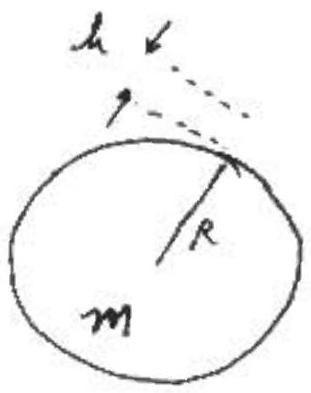

$$
g _ { 0 } = \frac { G M } { R ^ { 2 } }
$$

where $\Delta g = \frac { 2 h } { R } g _ { 0 }$

$$
\frac { \Delta g } { g _ { 0 } } = \frac { 2 h } { R } = \frac { 2 \left( 15 \times 10 ^ { 3 } \mathrm {~m} \right) } { 5 \times 10 ^ { 6 } \mathrm {~m} } = 6 \times 10 ^ { - 3 }
$$

In part (c), The estimate of $P$ and $\Delta P / \Delta t$ at 15 km above the surface was much cruder than 6 parts unt of a Thousand.
