Solutions - 1998 Exam 2 us Physis Team
A1 (a) $\omega = \int P d V = P _ { 0 } V _ { 0 }$

(b) $Q = d u ^ { \circ } + w = P _ { 0 } v _ { 0 }$
(c) $e = \frac { w } { Q _ { \text {in } } }$ where $Q _ { \text {in } } =$ heat put into system in cycle (all persitive heat)

Segments 1 and 3: $V =$ const

$$
\begin{gathered}
Q = \Delta U + W = n C _ { v } \Delta T = \frac { C _ { v } } { R } \Delta ( P V ) = \frac { 3 } { 2 } V \Delta P \\
\text { segment } Q _ { 1 } = \frac { 3 } { 2 } V _ { 0 } \left( 2 P _ { 0 } - P _ { 0 } \right) = \frac { 3 } { 2 } P _ { 0 } V _ { 0 } > 0 \quad \square \\
Q _ { 3 } = \frac { 3 } { 2 } \left( 2 V _ { 0 } \right) \left( P _ { 0 } - 2 P _ { 0 } \right) < 0
\end{gathered}
$$

2 and 4: $P =$ cunst.

$$
\begin{gathered}
\phi = \Delta u + w = \frac { 3 } { 2 } V \Delta P + P \Delta V = \frac { 5 } { 2 } P \Delta V \\
\phi _ { 2 } = \frac { 5 } { 2 } \left( 2 P _ { 0 } \right) \left( 2 V _ { 0 } - V _ { 0 } \right) = 5 P _ { 0 } V _ { 0 } \\
\phi _ { 4 } = \frac { 5 } { 2 } P _ { 0 } \left( V _ { 0 } - 2 V _ { 0 } \right) < 0 \\
\therefore \phi _ { \text {in } } = Q _ { 1 } + Q _ { 2 } = \frac { 13 } { 2 } P _ { 0 } V _ { 0 }
\end{gathered}
$$

and $e = \frac { 2 } { 13 }$

Al

$$
\begin{aligned}
\Delta S & = \int _ { A } ^ { D } \frac { d Q } { T } = \int _ { A } ^ { D } \frac { d U + P d V } { T } = \int _ { A } ^ { D } \left[ n c _ { v } \frac { d T } { T } + n R \frac { d V } { V } \right] \\
& = n c _ { v } \ln \frac { T _ { D } } { T _ { A } } + n R \ln \frac { V _ { D } } { V _ { A } } \quad \left[ \frac { T _ { D } } { T _ { A } } = 2 = \frac { V _ { D } } { V _ { A } } \right. \\
& = n \left( c _ { v } + R \right) \ln 2 = 5 R \ln 2
\end{aligned}
$$

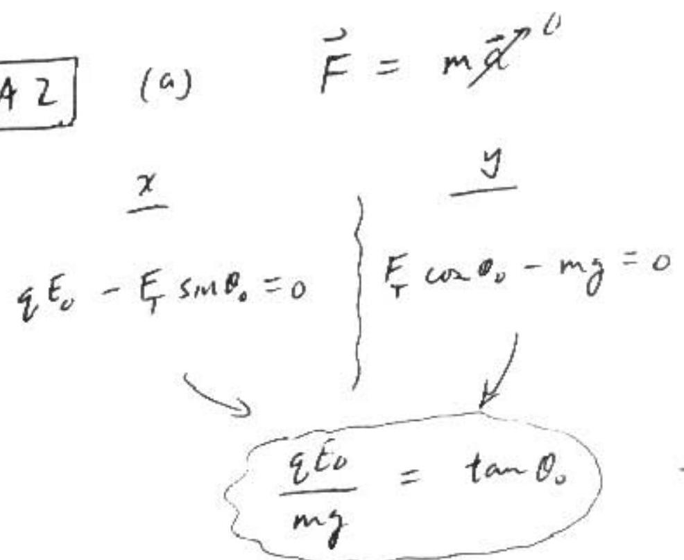

$$
\left\{ \begin{array} { c }
q ^ { 1 }  \tag{1}\\
\zeta _ { m g } ^ { 1 } \\
\zeta _ { 0 } ^ { 1 } \delta _ { T }
\end{array} \right\} \rightarrow x
$$

(b) $$
\begin{aligned}
S _ { 0 } & = 2 L \sin \theta _ { 0 } \\
S ^ { \prime } & = 2 L \sin \left( \theta _ { 0 } + d \right) \\
& \simeq 2 L \left( \sin \theta _ { 0 } + d \cos \theta _ { 0 } \right) \\
& = S _ { 0 } \left( 1 + S \cot \theta _ { 0 } \right)
\end{aligned}
$$
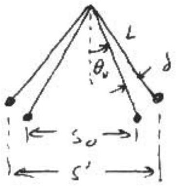
$$
\begin{aligned}
F ^ { \prime } = q E ^ { \prime } & = \frac { k q ^ { 2 } } { s ^ { 2 } } = \frac { k q ^ { 2 } } { s _ { 0 } ^ { 2 } } \left( 1 + d \cot \theta _ { 0 } \right) ^ { - 2 } \\
& \cong F _ { 0 } \left( 1 - 2 d \cot \theta _ { 0 } \right)
\end{aligned}
$$

A 2 (c) Apply $\vec { \tau } = I \vec { \alpha }$ about thook

$$
\begin{gathered}
q E ^ { \prime } L \cos \left( \theta _ { 0 } + d \right) \\
- m g L \sin \left( \theta _ { 0 } + d \right) = m L ^ { 2 } \ddot { \delta } \\
q E _ { 0 } \left( 1 - 2 \delta \cot \theta _ { 0 } \right) \left( \cos \theta _ { 0 } - \delta \sin \theta _ { 0 } \right) \\
- m g \left( \sin \theta _ { 0 } + \delta \cos \theta _ { 0 } \right) = m L \ddot { \delta }
\end{gathered}
$$
...(2)

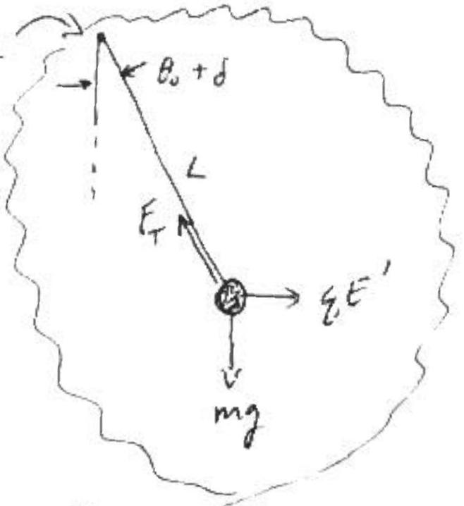
...(2)

use $\varepsilon _ { q } \cdot ( 1 ) , q E _ { 0 } \cos \theta _ { 0 } = m g \sin \theta _ { 0 } \cdot T _ { 0 } \theta ( d )$, Eq. (2) hecomes

$$
\begin{aligned}
& \ddot { j } + \frac { g } { 2 } \left( \frac { 1 } { \cos \theta _ { 0 } } + 2 \cos \theta _ { 0 } \right) d = 0 \\
& \omega ^ { 2 } = \underbrace { \frac { g } { L } \left( \frac { 1 } { \cos \theta _ { 0 } } + 2 \cos \theta _ { 0 } \right) } \\
& \left. T = \frac { 2 \pi } { \omega } = 2 \pi \sqrt { \frac { L } { g } \left( \frac { 1 } { \cos \theta _ { 0 } } + 2 \cos \theta _ { 0 } \right) ^ { - \frac { 1 } { 2 } } } \right\}
\end{aligned}
$$

$$
\text { (d) } \begin{aligned}
& \text { at } \theta _ { 0 } = 45 ^ { \circ } , \quad \cos \theta _ { 0 } = \frac { 1 } { \sqrt { 2 } } = \sin \theta _ { 0 } \quad T _ { 0 } = 2 \pi \sqrt { \frac { 1 } { y } } \\
& T = \frac { T _ { 0 } } { \sqrt { \sqrt { 2 } + \frac { 2 } { \sqrt { 2 } } } } \\
& T = \frac { T _ { 0 } } { \sqrt { 2 \sqrt { 2 } } }
\end{aligned}
$$

A3

(a) min. everyy regurred is SeV
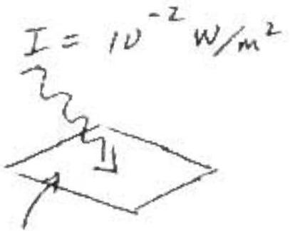
$$
\begin{aligned}
& \text { IADt } = 5 \mathrm { eV } \\
& \Delta t = \frac { 5 \left( 1.6 \times 10 ^ { - 19 } \mathrm {~J} \right) } { \left( 2 \times 10 ^ { - 20 } \mathrm {~m} ^ { 2 } \right) \left( 10 ^ { - 2 } \frac { \mathrm {~J} } { \mathrm {~s} - \mathrm { m } ^ { 2 } } \right) } \\
& = 4 \times 10 ^ { 3 } \mathrm {~s} \cong 1.1 \mathrm { Mr } .
\end{aligned}
$$
Area with 1 surface electron
$$
\begin{aligned}
A & = \left( 5 \times 10 ^ { 14 } / \mathrm { m } ^ { 2 } \right) ^ { - 1 } \\
& = 2 \times 10 ^ { - 20 } \mathrm {~m} ^ { 2 }
\end{aligned}
$$
(b) $\quad h f = 5 \mathrm { eV } \Rightarrow f = \frac { 5 \mathrm { eV } } { 4.14 \times 10 ^ { - 15 } \mathrm { eV } \cdot \mathrm { s } } = 1.21 \times 10 ^ { 15 } \mathrm {~Hz}$
(c) 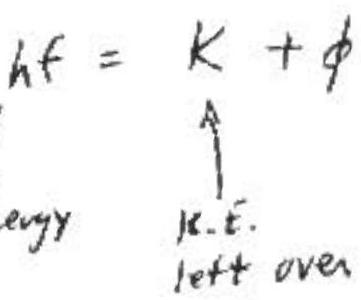
(cons. of Energy)
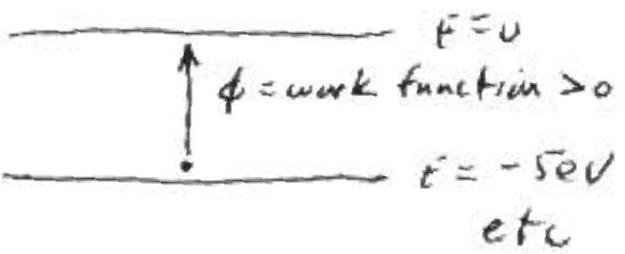
$$
\begin{aligned}
k = h f - \phi & = \left( 4.14 \times 10 ^ { - 15 } \mathrm { eV } - 5 \right) \left( 4.5 \times 10 ^ { 15 } \mathrm {~Hz} \right) - \phi \\
& = 18.6 \mathrm { eV } - \phi
\end{aligned}
$$
State 1: $\quad K _ { 1 } = 18.6 \mathrm { eV } - 5 \mathrm { eV } = 13.6 \mathrm { eV }$
$$
\begin{array} { l l }
2 : & k _ { 2 } = 8.6 \mathrm { eV } \\
3 : & k _ { 3 } = \\
4 : & 3.6 \mathrm { ev } \\
5 : & - \quad \text { k.E. cannot } \\
\text { he } < 0
\end{array}
$$
(d) $$
e V _ { \text {stop } } = 13.6 \mathrm { eV } \Rightarrow V _ { \text {stop } } = 13.6 V _ { \text {olth } }
$$

A 4 (a) $\oint \vec { B } \cdot d \vec { l } = \mu _ { 0 } I$

$$
\begin{array} { r }
B = \frac { \mu _ { 0 } I } { 2 \pi r } \text { or } \frac { 2 k _ { m } I } { r } \\
\left( k _ { m } \equiv \frac { \mu _ { v } } { 4 \pi } \right)
\end{array}
$$

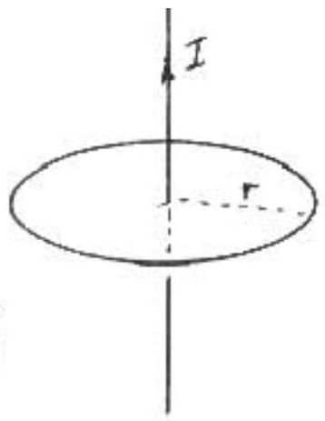

(b) Neglect variation of $B$ with $r$ over area of loop

$$
\text { magnituede, } \begin{aligned}
\varepsilon & = \frac { \partial \Phi _ { \beta } } { d t } \\
& = \frac { 2 \mathrm {~km} } { r } \frac { d J } { d t } \\
& = \frac { \left( 12 \mathrm {~m} ^ { 2 } \right) \left( 2 \times 10 ^ { - 7 } \mathrm { Ns } ^ { 2 } / \mathrm { c } ^ { 2 } \right) \left( 10 ^ { 6 } \mathrm {~A} \right) } { \left( 10 ^ { 3 } \mathrm {~m} \right) \left( 5 \times 10 ^ { - 5 } \mathrm {~s} \right) } \\
& = 48 \mathrm {~V}
\end{aligned}
$$

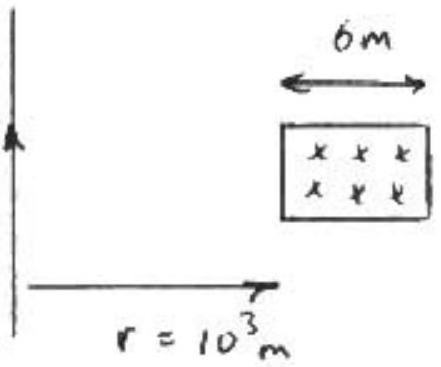
(c) $I = \frac { \varepsilon } { R } = \frac { 48 \mathrm {~V} } { 50 \Omega } = .96 \mathrm {~A}$
yes the device may be damage

B1

(a) The bent frequency is "blue shifted" on the. and "red shifted" on the L - hence moving
(b) The beats are a "suncre" of frequency $\left| f _ { L } - f _ { R } \right| \equiv \Delta$ When on $L$ :
$$
\Delta f _ { c } ^ { \prime } = \Delta f _ { 0 } \left( 1 - \frac { v } { c } \right)
$$
moving away
$$
\begin{equation*}
.99 \mathrm {~Hz} = \Delta f _ { 0 } ( 1 - v / c ) \tag{0}
\end{equation*}
$$
moving away
muring towards
When an $R$ :
$$
\begin{align*}
& \Delta f _ { R } ^ { \prime } = \Delta f _ { 0 } \left( 1 + \frac { v } { c } \right) \\
& 1.01 \mathrm {~Hz} = \Delta f _ { 0 } \left( 1 + \frac { v } { c } \right) \tag{2}
\end{align*}
$$
(1) and (2)
$$
\begin{align*}
& \Rightarrow \beta \equiv \frac { 1.01 } { .99 } = \frac { 1 + v / c } { 1 - v / c }  \tag{3}\\
& \Rightarrow v / c = .01 \tag{4}
\end{align*}
$$
(c) In between, $f _ { R }$ is red - rhifted:
$$
f _ { R } ^ { \prime } = f _ { R } - \varepsilon _ { R } \quad \text { for sume } \varepsilon _ { R } > 0
$$
In between, $f _ { v }$ is blue-shifted:
$$
f _ { L } ^ { \prime } = f _ { L } + \varepsilon _ { R } \text { for some } \varepsilon _ { L } > 0
$$
In between, $f _ { L } ^ { \prime } = f _ { R } ^ { \prime }$
$$
\begin{aligned}
& f _ { L } + \varepsilon _ { R } = f _ { R } - \varepsilon _ { R } \\
\Rightarrow \quad & f _ { R } = f _ { L } + \varepsilon _ { R } + \varepsilon _ { R } > f _ { L }
\end{aligned}
$$
Su
$f _ { R } > f _ { L }$

B1

(d) In between,
$$
\begin{aligned}
& f _ { L } ^ { \prime } = f _ { L } \left( 1 + \frac { v } { c } \right) 1 , \\
& \text { bine } \\
& \text { shifted }
\end{aligned}
$$
and $f _ { L } ^ { \prime } = f _ { R } ^ { \prime }$, so $f _ { L } \left( 1 + \frac { v } { c } \right) = f _ { R } ( 1 - v / c )$
$$
\begin{array} { r }
\text { io., } \frac { f _ { R } } { f _ { L } } = \frac { 1 + v / c } { 1 - v / c } = \beta \quad [ \text { from (3) } ] \\
\ldots ( 5 )
\end{array}
$$
Also, from either (1) or (2), and using (4) $\left[ \frac { v } { c } = 0.01 \right]$ it follows that $f _ { R } - f _ { L } = 1 \mathrm {~Hz}$
Solving (5) and (6) sives $f _ { R } = 50.5 \mathrm {~Hz}$
$$
f _ { L } = 49.5 \mathrm {~Hz}
$$
(e) . Source moring: $v = - g t$
$$
\begin{aligned}
f ^ { \prime } & = f _ { 0 } \left( 1 + \frac { v } { c } \right) ^ { - 1 } \\
& = f _ { 0 } \left( 1 - \frac { s t } { c } \right) \\
g = 9.8 \mathrm {~m} / \mathrm { s } ^ { 2 } \quad f _ { 0 } & = 50 \mathrm {~Hz} \\
c = 343 \mathrm {~m} / \mathrm { s } & \\
f ^ { \prime } & = \frac { 50 \mathrm {~Hz} } { 1 - \frac { t } { 35 \mathrm {~s} } }
\end{aligned}
$$
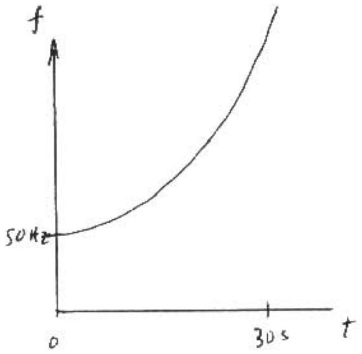

B2

$$
E = \frac { 1 } { 2 } m \dot { r } ^ { 2 } + \frac { L ^ { 2 } } { 2 m r ^ { 2 } } - \frac { k z e ^ { 2 } } { r } \quad \text { for arbiting electron }
$$

(a) At aposee (2) and perige (1), $\dot { r } = 0$
$$
\begin{gathered}
E _ { 1 } = E _ { 2 } \\
\frac { L ^ { 2 } } { 2 m r _ { 1 } ^ { 2 } } - \frac { k z e ^ { 2 } } { r _ { 1 } } = \frac { L ^ { 2 } } { 2 m r _ { 2 } } - \frac { k z e ^ { 2 } } { r _ { 2 } } \quad \text { where } r _ { 2 } = \beta r _ { 1 } \\
\frac { L ^ { 2 } } { 2 m } \left( \frac { 1 } { r _ { 2 } ^ { 2 } } - \frac { 1 } { r _ { 1 } ^ { 2 } } \right) - k z e ^ { 2 } \left( \frac { 1 } { r _ { 2 } } - \frac { 1 } { r _ { 1 } } \right) = 0 \\
\frac { c ^ { 2 } } { 2 m r _ { 1 } ^ { 2 } } \underbrace { \left( \frac { 1 } { \beta ^ { 2 } } - 1 \right) } _ { \beta ^ { 2 } } - \frac { k z e ^ { 2 } } { r _ { 1 } } \left( \frac { 1 } { \beta } - 1 \right) = 0 \\
\frac { L ^ { 2 } } { 2 m r _ { 1 } ^ { 2 } } \left( \frac { 1 } { \beta } + 1 \right) = \frac { k z e ^ { 2 } } { r _ { 1 } } \\
z = \frac { L ^ { 2 } \left( \frac { 1 } { \beta } + 1 \right) } { 2 m r _ { 1 } k e ^ { 2 } } = 28
\end{gathered}
$$

(b) $$
\begin{aligned}
& E _ { \text {final } } + h f = E _ { \text {initial } } 0 \quad \begin{array} { l }
\text { "mitial" and } \\
\text { refer to electr }
\end{array} \\
& h f = - E _ { f } \\
& = - \frac { L ^ { 2 } } { 2 m r _ { 2 } ^ { 2 } } + \frac { k z e ^ { 2 } } { r _ { 2 } } = 8.6 \times 10 ^ { - 18 } \mathrm {~J} \\
& = \frac { h c } { E } \\
& = 2.3 \times 10 ^ { - 8 } \mathrm {~m}
\end{aligned}
$$

B2
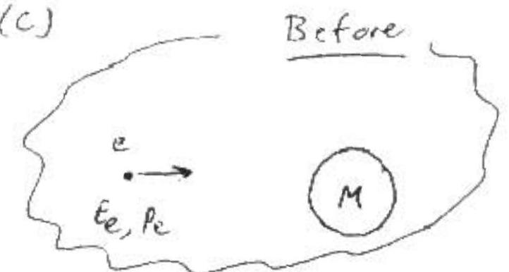
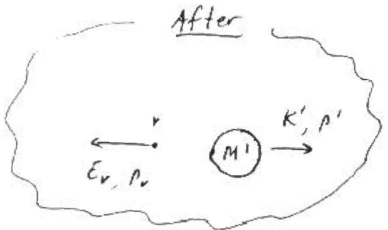

$$
\begin{aligned}
& M \simeq M ^ { \prime } = 121 \mathrm { Gev } / \mathrm { c } ^ { 2 } \\
& E _ { e } = K _ { e } + m _ { e } c ^ { 2 } = 16 \mathrm { ev } + \frac { 1 } { 2 } \mathrm { Mev } \approx 16 \mathrm { ev }
\end{aligned}
$$

neglect electron mass

$$
M ^ { \prime } c ^ { 2 } \gg k _ { e } \Rightarrow m ^ { \prime } \text { kinetic energy } \left( k ^ { \prime } \right) = \frac { p ^ { \prime 2 } } { 2 m }
$$

∴ The electron is relativistic, the nucleus mon-relativistic

Need we consider electrons electrical potential energy?
Estimate P.E. at surface of nucleus (orden of magn.tuide)

$$
\begin{aligned}
u & = \frac { 7 k e ^ { 2 } } { r } \\
& \approx \frac { ( 50 ) \left( 9 \times 10 ^ { 9 } \right) \left( 1.6 \times 10 ^ { - 19 } \right) } { 10 ^ { - 14 } \mathrm {~m} } e \left\{ \begin{array} { l }
z \sim 50 \\
r \sim 10 ^ { - 14 } \mathrm {~m}
\end{array} \right\} \\
& \left. = 7.2 \times 10 ^ { 5 } \mathrm { eV } < 1 \mathrm { MeV } \ll \mathrm { Ke } - \operatorname { may } _ { \text {P. } 6 . } \text { squre } \right\}
\end{aligned}
$$

$O K$, here we go: (units: ignive $c ^ { \prime } s - E$ in $e V , \rho$ in $\frac { e V } { c } , m$ in $\frac { e V ^ { \prime } } { c ^ { 2 } }$ cuss. of Energy:

$$
\begin{align*}
K _ { e } + M & = E _ { \nu } + M ^ { \prime } + K ^ { \prime } \quad M \simeq M ^ { \prime } \\
K _ { e } & \simeq E _ { \nu } + K ^ { \prime } \\
& \simeq E _ { \nu } + \frac { p ^ { \prime 2 } } { 2 M ^ { \prime } } \tag{1}
\end{align*}
$$

Cons. of momentum:

$$
\begin{equation*}
P _ { e } = P ^ { \prime } - P _ { v } \tag{cre-dimenticial}
\end{equation*}
$$

$$
\begin{equation*}
\Rightarrow \quad p ^ { \prime } = p _ { e } + p _ { r } \tag{2}
\end{equation*}
$$

(2) into (1) ⇒

$$
\begin{align*}
& K _ { e } = E _ { v } + \frac { \left( P _ { e } + P _ { v } \right) ^ { 2 } } { 2 M } \\
& K _ { e } = E _ { v } + \frac { 1 } { 2 M } \left( P _ { e } ^ { 2 } + P _ { r } ^ { 2 } + 2 P _ { e } P _ { v } \right) \tag{3}
\end{align*}
$$

For neutrino,

$$
\begin{aligned}
& E _ { v } ^ { 2 } - P _ { v } ^ { 2 } = m _ { v } ^ { 2 } \\
& P _ { v } = \epsilon _ { v }
\end{aligned}
$$

$$
\begin{aligned}
& \text { Fur election } \\
& E _ { e } ^ { 2 } - p _ { e } ^ { 2 } = m _ { e } ^ { 2 } \\
& \left( K _ { e } + m _ { e } \right) ^ { 2 } - p _ { e } ^ { 2 } = m _ { e } ^ { 2 } \quad m _ { e } \ll K _ { e } \\
& K _ { e } \approx p _ { e }
\end{aligned}
$$

(3) becomes

$$
K _ { e } = E _ { v } + \frac { 1 } { 2 m } \left( K _ { e } ^ { 2 } + E _ { v } ^ { 2 } + 2 K _ { e } E _ { v } \right)
$$

numerically,

$$
1 \mathrm { GeV } = E _ { v } + \frac { 1 } { 242 \mathrm { GeV } } \left( 1 \mathrm { GeV } ^ { 2 } + E _ { v } ^ { 2 } + ( 2 \mathrm { GeV } ) E _ { v } \right)
$$

neglect $\frac { 1 } { 242 }$

$$
\begin{aligned}
& 1 \mathrm { GeV } \approx \frac { \epsilon _ { v } ^ { 2 } } { 242 \mathrm { Gev } } + \epsilon _ { v } \left( 1 + \frac { 1 } { 121 } \right) \text { Cuspect } \frac { 1 } { 121 } \\
& \epsilon _ { v } ^ { 2 } + 242 \epsilon _ { v } - 242 \mathrm { Gev } = 0
\end{aligned}
$$

Keeping $\frac { 1 } { 2 } \times 2$ and $1 / 121$ gives .98
