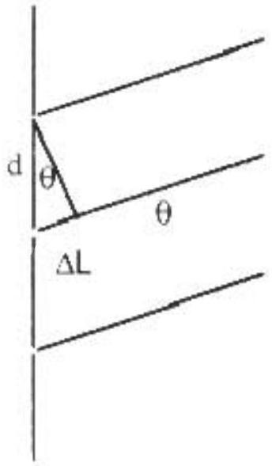

A3. a. The path difference $\Delta L$ between wave through adjacent slits is $\quad \Delta L = d \sin \theta$.
The phase difference $\delta$ is $\delta = \frac { 2 \pi } { \lambda } \Delta L = \frac { 2 \pi } { \lambda } d \sin \theta$
b.

$$
\Psi _ { t } = A \sin ( \omega t + \phi - \delta )
$$

where $\omega = 2 \pi f , f$ is the frequency of the wave and $\phi$ is a constant that is independent of the wave (may be set to zero).

$$
\begin{gathered}
\Psi _ { m } = A \sin ( \omega t + \phi ) \\
\Psi _ { b } = A \sin ( \omega t + \phi + \delta )
\end{gathered}
$$

(or any equivalent set with phase shifts differing by $\delta$ ).
c.

$$
\begin{gathered}
\Psi = \Psi _ { t } + \Psi _ { m } + \Psi _ { b } \\
\Psi = A \sin ( ( \omega t + \phi ) - \delta ) + A \sin ( \omega t + \phi ) + A \sin ( ( \omega t + \phi ) + \delta ) \\
\Psi = A [ \sin ( \omega t + \phi ) \cos \delta - \sin \delta \cos ( \omega t + \phi ) ] + A \sin ( \omega t + \phi ) \\
+ A [ \sin ( \omega t + \phi ) \cos \delta + \sin \delta \cos ( \omega t + \phi ) ] \\
\Psi = A ( 1 + 2 \cos \delta ) \sin ( \omega t + \phi ) = A _ { r e s } \sin ( \omega t + \phi )
\end{gathered}
$$

With the resultant amplitude

$$
A _ { r e s } = A ( 1 + 2 \cos \delta )
$$

d. The intensity is proportional to the amplitude squared. Calling the constant of proportionality c, we have
$$
I ( \theta ) = c A ^ { 2 } ( 1 + 2 \cos \delta ) ^ { 2 } .
$$
At $\theta = 0 , \delta = 0 , \cos \delta = 1$
$$
I _ { o } = c A ^ { 2 } ( 1 + 2 ) ^ { 2 } = 9 c A ^ { 2 } .
$$
Eliminating c from the $I ( \theta )$ equation
$$
I ( \theta ) = \frac { I _ { o } } { 9 } ( 1 + 2 \cos \delta ) ^ { 2 } .
$$
e. In order for $I ( \theta ) = 0$
$$
1 + 2 \cos \delta = 0
$$
or
$$
\begin{gathered}
\cos \delta = - 1 / 2 \quad \text { or } \quad \delta = 120 ^ { \circ } = 2 \pi / 3 \\
\frac { 2 \pi } { 3 } = \frac { 2 \pi } { \lambda } d \sin \theta
\end{gathered}
$$
or
$$
\theta = \sin ^ { - 1 } \left( \frac { \lambda } { 3 d } \right)
$$
