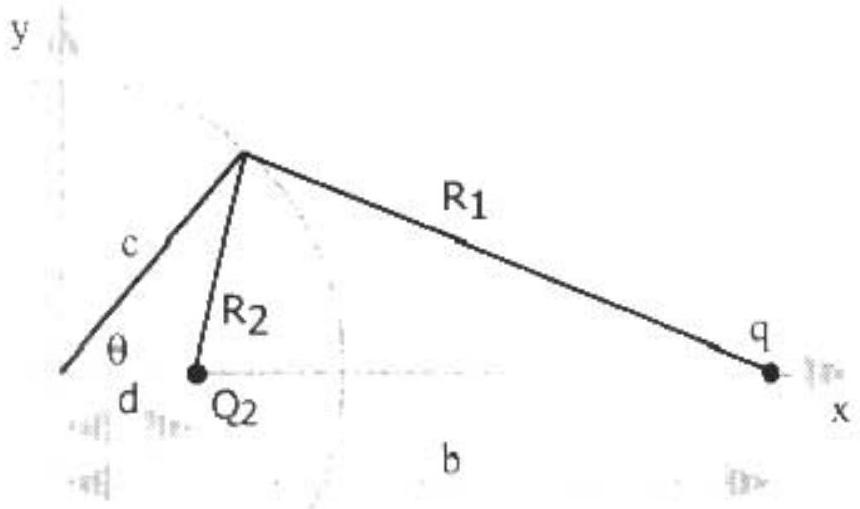
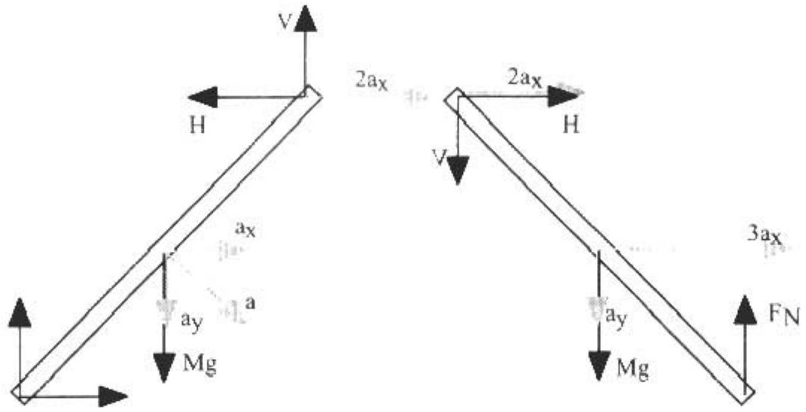
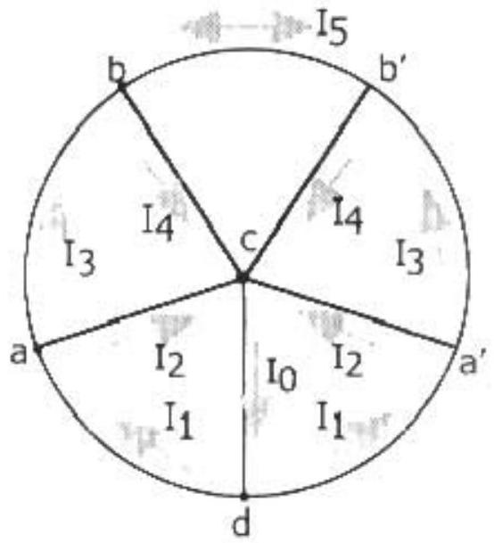
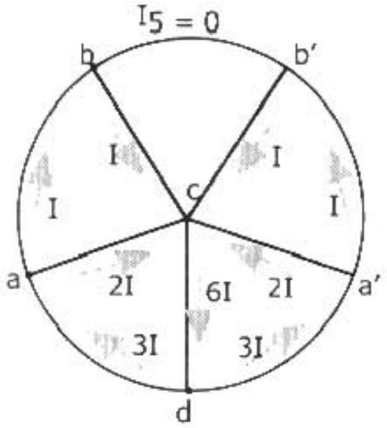
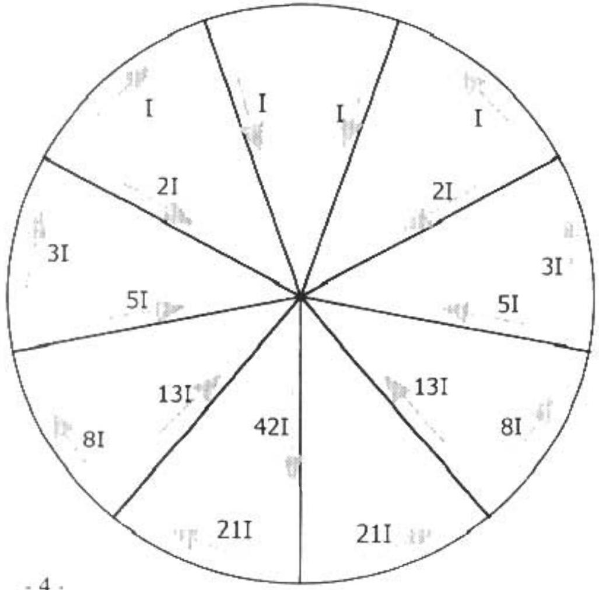

| AAPT |  | UNITED STATES PHYSICS TEAM |
| :--- | :--- | :--- |
| AIP | 1999 |  |

1999 Semi-Final Exam
Part A - Solutions

A1. a. Let $\mathrm { Mg } = 5.0 \mathrm {~N} =$ weight of the crate
$\mathrm { h } = 2.0 \mathrm {~m} =$ the initial height of the crate
$\mathrm { h } ^ { \prime } =$ maximum height the crate reaches on the right hand side
$\mathrm { s } =$ distance traveled along the rough plane to highest point.
$\mathrm { x } =$ maximum compression of the spring

$$
\begin{aligned}
& h ^ { \prime } = s \sin 30 ^ { \circ } = s ( 1 / 2 ) \quad s = 2 h ^ { \prime } \\
& x = s - \left( \frac { 0.5 m } { \sin 30 ^ { \circ } } \right) = s - 1 m = 2 h ^ { \prime } - 1 m
\end{aligned}
$$

To find the final height $\mathrm { h } ^ { \prime }$, apply the work energy theorem

$$
\begin{gathered}
U _ { G } ^ { \prime } + U _ { s p } ^ { \prime } = U _ { G } + W _ { f } \\
M g h ^ { \prime } + 1 / 2 k x ^ { 2 } = M g h - \mu _ { k } F _ { i v } s \\
F _ { N } = M g \cos 30 ^ { \circ } = M g \sqrt { 3 } / 2 \\
M g h ^ { \prime } + 1 / 2 k \left( 2 h ^ { \prime } - 1 \right) ^ { 2 } = M g h - ( 1 / \sqrt { 3 } ) ( M g \sqrt { 3 } / 2 ) \left( 2 h ^ { \prime } \right) \\
M g h ^ { \prime } + 1 / 2 k \left( 2 h ^ { \prime } - 1 \right) ^ { 2 } = M g h - M g h ^ { \prime } \\
2 M g h ^ { \prime } + 1 / 2 k \left( 2 h ^ { \prime } - 1 \right) ^ { 2 } = M g h \\
2 ( 5 N ) h ^ { \prime } + 1 / 2 ( 20 N / m ) \left( 2 h ^ { \prime } - 1 \right) ^ { 2 } = ( 5 N ) ( 2 m ) \\
h ^ { \prime } + \left( 2 h ^ { \prime } - 1 \right) ^ { 2 } = 1 \quad \text { where } h ^ { \prime } \text { is in meters }
\end{gathered}
$$

$$
4 h ^ { \prime 2 } - 3 h ^ { \prime } = 0
$$

Since $h ^ { \prime }$ can't be zero
Since $h ^ { \prime }$ can't be zero

$$
h ^ { \prime } = ( 3 / 4 ) m
$$

b. Initially it has

$$
M g h = ( 5 N ) ( 2 m ) = 10 J \quad \text { of total mechanical energy } .
$$

Sliding up to the highest point on the right hand side, the crate loses total mechanical energy

$$
\begin{aligned}
\mu _ { k } F _ { N } s & = \mu _ { k } ( M g \cos \theta ) \left( 2 h ^ { \prime } \right) = ( 1 / \sqrt { 3 } ) M g ( \sqrt { 3 } / 2 ) \left( 2 h ^ { \prime } \right) \\
& = M g h ^ { \prime } = ( 5 N ) ( 0.75 m ) = 3.75 J
\end{aligned}
$$

(Note: On the first trip up the plane, the crate reached the spring which provided an additional force of kx down the plane. At maximum extension this force is 10 N , sufficient to overcome static friction.)
Sliding back down it loses another 3.75 J of total mechanical energy. Therefore it has

$$
10 \mathrm {~J} - 2 ( 3.75 \mathrm {~J} ) = 2.5 \mathrm {~J}
$$

at the bottom of the right hand plane. The total mechanical energy remains unchanged until the crate returns to the right hand plane and begins to slide up it. Using our prior result that as the crate slides up the plane

$$
\mu _ { k } F _ { N } s = M g h ^ { \prime }
$$

That is, as the crate rises half the kinetic energy becomes potential and half is dissipated by friction, it will rise to a height given by

$$
( 1 / 2 ) ( 2.5 J ) = M g h ^ { \prime } = ( 5 N ) h ^ { \prime }
$$

or

$$
h ^ { \prime } = 0.25 \mathrm {~m}
$$

It stops before it reaches the spring. At this point, the only two forces acting on the crate are the gravitational force and the frictional force. The component of the weight parallel to the plane is

$$
F _ { G } = M g \sin 30 ^ { \circ } = ( 5 N ) ( 1 / 2 ) = 2.5 N \quad \text { down the plane. the }
$$

maximum force of static friction is

$$
\begin{gathered}
f _ { s \max } = \mu _ { s } M g \cos 30 ^ { o } = ( 1 / \sqrt { 2 } ) ( 5 N ) ( \sqrt { 3 } / 2 ) = 3.1 N \\
F _ { G \mid } < f _ { s \max }
\end{gathered}
$$

The crate comes to rest a height 0.25 m up the right hand plane. It has slid down the smooth plane, up the rough plane, temporarily compressing the spring, back down the rough plane, across the horizontal surface, up and down the smooth plane, back across the horizontal surface, and up the rough plane a second time before it finally stops.

A2. Assume a charge of $Q _ { z }$ at $\mathrm { x } = d$ along the x -axis. The total potential a distance c from the origin is

$$
\begin{equation*}
V = k \frac { Q _ { 2 } } { R _ { 2 } } + k \frac { q } { R _ { 1 } } \tag{1}
\end{equation*}
$$

where k is Coulomb's constant and $R _ { I }$ and $R _ { 2 }$ can be found using the law of cosines.

$$
R _ { 1 } = \sqrt { b ^ { 2 } - 2 b c \cos \theta + c ^ { 2 } }
$$

and

$$
R _ { 2 } = \sqrt { d ^ { 2 } - 2 d c \cos \theta + c ^ { 2 } } .
$$

Since $\mathrm { V } = 0$,

$$
0 = k \frac { Q _ { 2 } } { R _ { 2 } } + k \frac { q } { R _ { 1 } }
$$

Therefore

$$
\frac { Q _ { 2 } } { R _ { 2 } } = - \frac { q } { R _ { 1 } } .
$$

This must be true for all points a distance c from the origin. In particular at $\theta = 0$ or $\mathrm { x } = + \mathrm { c }$ we have

$$
\begin{equation*}
\frac { Q _ { 2 } } { ( c - d ) } = - \frac { q } { ( b - c ) } . \tag{2}
\end{equation*}
$$

At $\theta = 180 ^ { \circ } = \pi$ or $\mathrm { x } = - \mathrm { c }$ we have

$$
\begin{equation*}
\frac { Q _ { 2 } } { ( c + d ) } = - \frac { q } { ( b + c ) } \tag{3}
\end{equation*}
$$

Solving equations (2) and (3) simultaneously for $Q _ { 2 }$ and $d$, we have

$$
Q _ { 2 } = - \frac { c } { b } q \quad \text { at } \quad d = \frac { c ^ { 2 } } { b } .
$$

Substituting $d$ into $R _ { 2 }$, we have

$$
R _ { 2 } = a ^ { \prime } \left( c ^ { 2 } / b \right) ^ { 2 } - 2 \left( c ^ { 2 } / b \right) c \cos \theta + c ^ { 2 } = ( c / b ) \sqrt { c ^ { 2 } - 2 b c \cos \theta + b ^ { 2 } } = ( c / b ) R _ { 1 } .
$$

for any angle $\theta$, i.e. any point a distance $c$ from the origin. Substituting $Q _ { 2 }$ and $R _ { 2 }$ into (1),

$$
V = k \frac { ( - c / b ) q } { ( c / b ) R _ { 1 } } + k \frac { q } { R _ { 1 } } = 0
$$

A3. a. The path difference $\Delta L$ between wave through adjacent slits is $\quad \Delta L = d \sin \theta$.
The phase difference $\delta$ is $\delta = \frac { 2 \pi } { \lambda } \Delta L = \frac { 2 \pi } { \lambda } d \sin \theta$
b.

$$
\Psi _ { t } = A \sin ( \omega t + \phi - \delta )
$$

where $\omega = 2 \pi f , f$ is the frequency of the wave and $\phi$ is a constant that is independent of the wave (may be set to zero).

$$
\begin{gathered}
\Psi _ { m } = A \sin ( \omega t + \phi ) \\
\Psi _ { b } = A \sin ( \omega t + \phi + \delta )
\end{gathered}
$$

(or any equivalent set with phase shifts differing by $\delta$ ).
c.

$$
\begin{gathered}
\Psi = \Psi _ { t } + \Psi _ { m } + \Psi _ { b } \\
\Psi = A \sin ( ( \omega t + \phi ) - \delta ) + A \sin ( \omega t + \phi ) + A \sin ( ( \omega t + \phi ) + \delta ) \\
\Psi = A [ \sin ( \omega t + \phi ) \cos \delta - \sin \delta \cos ( \omega t + \phi ) ] + A \sin ( \omega t + \phi ) \\
+ A [ \sin ( \omega t + \phi ) \cos \delta + \sin \delta \cos ( \omega t + \phi ) ] \\
\Psi = A ( 1 + 2 \cos \delta ) \sin ( \omega t + \phi ) = A _ { r e s } \sin ( \omega t + \phi )
\end{gathered}
$$

With the resultant amplitude

$$
A _ { r e s } = A ( 1 + 2 \cos \delta )
$$

d. The intensity is proportional to the amplitude squared. Calling the constant of proportionality c, we have
$$
I ( \theta ) = c A ^ { 2 } ( 1 + 2 \cos \delta ) ^ { 2 } .
$$
At $\theta = 0 , \delta = 0 , \cos \delta = 1$
$$
I _ { o } = c A ^ { 2 } ( 1 + 2 ) ^ { 2 } = 9 c A ^ { 2 } .
$$
Eliminating c from the $I ( \theta )$ equation
$$
I ( \theta ) = \frac { I _ { o } } { 9 } ( 1 + 2 \cos \delta ) ^ { 2 } .
$$
e. In order for $I ( \theta ) = 0$
$$
1 + 2 \cos \delta = 0
$$
or
$$
\begin{gathered}
\cos \delta = - 1 / 2 \quad \text { or } \quad \delta = 120 ^ { \circ } = 2 \pi / 3 \\
\frac { 2 \pi } { 3 } = \frac { 2 \pi } { \lambda } d \sin \theta
\end{gathered}
$$
or
$$
\theta = \sin ^ { - 1 } \left( \frac { \lambda } { 3 d } \right)
$$

A4. The only torque acting on the system is due to the gravitaqtional force.
For small angles

$$
\begin{aligned}
I \alpha & = \sum \tau = ( M + m ) g R \sin \theta \\
\alpha & \equiv \left( \frac { ( M + m ) g R } { l } \right) \theta = \omega ^ { 2 } \theta
\end{aligned}
$$

We will use the parallel axis theorem to find the moment of inertia of the sytem. Swinging in the plane of the bob, pivot on rim

$$
\begin{aligned}
I _ { \text {tot } } & = I _ { \text {ringcm } } + M R ^ { 2 } + I _ { \text {rodcm } } + m R ^ { 2 } \\
& = M R ^ { 2 } + M R ^ { 2 } + 1 / 12 m ( 2 R ) ^ { 2 } + m R ^ { 2 } = ( 2 M + 4 / 3 m ) R ^ { 2 }
\end{aligned}
$$

Swinging perpendicular to the bob, we expect the extreme cases to be rod horizontal and rod vertical
vertical:

$$
\begin{array} { l r }
I _ { r o d } = 4 / 3 m R ^ { 2 } & \text { horizontal: } I _ { r o d } = m R ^ { 2 } \\
I _ { r i n g } = I _ { r i n g c m } + M R ^ { 2 } = 1 / 2 M R ^ { 2 } + M R ^ { 2 } = 3 / 2 M R ^ { 2 }
\end{array}
$$

vertical:

$$
I _ { \text {viot } } = 3 / 2 M R ^ { 2 } + 4 / 3 m R ^ { 2 } = ( 3 / 2 M + 4 / 3 m ) R ^ { 2 }
$$

horizontal:

$$
I _ { \text {htot } } = 3 / 2 M R ^ { 2 } + m R ^ { 2 } = ( 3 / 2 M + m ) R ^ { 2 }
$$

The maximum period occurs when $\omega$ is smallest or $l$ is largest. Since $\quad l _ { \text {tot } } \geq I _ { \text {vtot } } \geq I _ { \text {htot } }$ the maximum period occurs when it swings in the plane of the bob. The minimum period occurs when it swings perpendicular to the plane of the bob and the wire is horizontal.

$$
\frac { T _ { \max } } { T _ { \min } } = \sqrt { \frac { I _ { \max } } { I _ { \min } } } = \sqrt { \frac { 2 M + 4 / 3 m } { 3 / 2 M + m } } = \sqrt { 4 / 3 }
$$

| AAPT |  | UNITED STATES PHYSICS TEAM |
| :--- | :--- | :--- |
| AIP | 1999 |  |

1999 Semi-Final Exam
Part B - Solutions

B1.

Bla. For $\theta = 45 ^ { \circ }$, both $\cos \theta = 1 / \sqrt { 2 }$ and $\sin \theta = 1 / \sqrt { 2 }$. The relation between the magnitude of the angular acceleration $\alpha$ and the magnitude of the linear acceleration a is $a = \alpha L / 2$ with $a _ { \mathrm { x } } = a _ { y } = \alpha L / ( 2 \sqrt { 2 } )$. Using $\mathrm { I } \alpha = \Sigma \tau$ for the rotation about the hinge at the lower end of the left rod

$$
\begin{equation*}
\frac { M L ^ { 2 } \alpha } { 3 } = \frac { M g L } { 2 \sqrt { 2 } } - \frac { V L } { \sqrt { 2 } } - \frac { H L } { \sqrt { 2 } } \tag{a.1}
\end{equation*}
$$

Applying Newton's second law to the right rod

$$
\begin{array} { r c }
M a _ { x } = \sum F _ { x } & \frac { M 3 \alpha L } { 2 \sqrt { 2 } } = H \\
M a _ { y } = \sum F _ { y } & \frac { M \alpha L } { 2 \sqrt { 2 } } = M g + V - F _ { N } \tag{a.3}
\end{array}
$$

The net torque about the center of mass of the right rod is

$$
\begin{equation*}
I \alpha = \sum \tau \quad \frac { M L ^ { 2 } \alpha } { 12 } = \frac { F _ { \mathrm { N } } L } { 2 \sqrt { 2 } } + \frac { V L } { 2 \sqrt { 2 } } - \frac { H L } { 2 \sqrt { 2 } } \tag{a.4}
\end{equation*}
$$

Equations (a.1), (a.2), (a.3), and (a.4) form a set of four simultaneous equations in the four unknowns $H , V , \alpha$, and $F _ { N }$. Solving them simultaneously for $\mathrm { F } _ { \mathrm { S } }$, yields $F _ { N } = \frac { 7 } { 10 } \mathrm { Mg }$

b. By symmetry $\mathrm { V } = 0$. Applying Newton's second law to the right rod
$$
\begin{array} { r c }
M a _ { x } = \sum F _ { x } & \frac { M \alpha L } { 2 \sqrt { 2 } } = H \\
M a _ { y } = \sum F _ { y } & \frac { M \alpha L } { 2 \sqrt { 2 } } = M g - F _ { N } \tag{b.2}
\end{array}
$$
The net torque about the center of mass
$$
\begin{equation*}
I \alpha = \sum \tau \quad \frac { M L ^ { 2 } \alpha } { 12 } = \frac { F _ { N } L } { 2 \sqrt { 2 } } - \frac { H L } { 2 \sqrt { 2 } } \tag{b.3}
\end{equation*}
$$
Solving these three equations in unknowns $H . \alpha$ and $F _ { \mathrm { N } }$. Solving them simultaneously for $\mathrm { F } _ { \mathrm { N } }$, yields
$$
F _ { N } = \frac { 5 } { 8 } M g
$$
c. Considering both rods as the system so we don't need to include the work done by the forces H and V,
$$
\begin{equation*}
P E _ { L i } + P E _ { R i } = P E _ { L f } + P E _ { R f } + K E _ { L j } + K E _ { R f } \tag{c.1}
\end{equation*}
$$
Initially the center of mass of each rod is at a height $( \mathrm { L } / 2 ) \sin \theta _ { \mathrm { i } }$ where $\theta _ { \mathrm { i } } = 45 ^ { \circ }$
$$
P E _ { L i } + P E _ { R i } = M g \frac { L } { 2 } \sin \theta _ { i } + M g \frac { L } { 2 } \sin \theta _ { i } = M g L \sin \theta _ { i }
$$
Finally,
$$
P E _ { L f } + P E _ { R f } = M g \frac { L } { 2 } \sin \theta + M g \frac { L } { 2 } \sin \theta = M g L \sin \theta
$$
For each side
$$
K E _ { f } = \frac { 1 } { 2 } M v ^ { 2 } + \frac { 1 } { 2 } l \omega ^ { 2 } \text { with } \quad I = \frac { 1 } { 12 } M L ^ { 2 } .
$$
For the left rod $\quad \mathrm { v } _ { \mathrm { L } } = \omega \mathrm { L } / 2$, so $\quad K E _ { L f } = \frac { 1 } { 2 } M \left( \frac { \omega L } { 2 } \right) ^ { 2 } + \frac { 1 } { 2 } \left( \frac { 1 } { 12 } M L ^ { 2 } \right) \omega ^ { 2 } = \frac { 1 } { 6 } M L ^ { 2 } \omega ^ { 2 }$
For the right rod $\mathrm { v } _ { \mathrm { Ry } } = \omega ( \mathrm { L } / 2 ) \cos \theta$, but $\mathrm { v } _ { \mathrm { Rx } } = 3 \omega ( \mathrm {~L} / 2 ) \sin \theta$, so
$$
K E _ { R f } = \frac { 1 } { 2 } M \left( \frac { \omega L } { 2 } \right) ^ { 2 } \left( \cos ^ { 2 } \theta + 9 \sin ^ { 2 } \theta \right) + \frac { 1 } { 2 } \left( \frac { 1 } { 12 } M L ^ { 2 } \right) \omega ^ { 2 } = M L ^ { 2 } \omega ^ { 2 } \left( \frac { 1 } { 6 } + \sin ^ { 2 } \theta \right)
$$
Substituting all of the above into (c.1):
$$
M g L \sin \theta _ { i } = M g L \sin \theta + M L ^ { 2 } \omega ^ { 2 } \left( \frac { 2 } { 6 } + \sin ^ { 2 } \theta \right)
$$

Or

$$
\omega ^ { 2 } = \frac { 3 g } { L } \frac { \left( \sin \theta _ { i } - \sin \theta \right) } { \left( 1 + 3 \sin ^ { 2 } \theta \right) } = \frac { 3 g } { L } \frac { ( 1 / \sqrt { 2 } - \sin \theta ) } { \left( 1 + 3 \sin ^ { 2 } \theta \right) }
$$

d. By symmetry, $\mathrm { V } = 0$. The top of the "vee" doesn't move horizontally so H does no work. v $= \omega \mathrm { L } / 2$ for both rods. Applying energy conservation to either rod

$$
\begin{equation*}
P E _ { l } = P E _ { f } + K E _ { f } \tag{d.1}
\end{equation*}
$$

with

$$
P E _ { i } = M g \frac { L } { 2 } \sin \theta _ { i } \quad \text { and } \quad P E _ { f } = M g \frac { L } { 2 } \sin \theta
$$

For either side

$$
K E _ { f } = \frac { 1 } { 2 } M v ^ { 2 } + \frac { 1 } { 2 } I \omega ^ { 2 } \text { with } \quad I = \frac { 1 } { 12 } M L ^ { 2 }
$$

With

$$
\begin{equation*}
\mathrm { v } _ { \mathrm { L } } = \omega \mathrm { L } / 2 \text {, so } \quad K E _ { f } = \frac { 1 } { 2 } M \left( \frac { \omega L } { 2 } \right) ^ { 2 } + \frac { 1 } { 2 } \left( \frac { 1 } { 12 } M L ^ { 2 } \right) \omega ^ { 2 } = \frac { 1 } { 6 } M L ^ { 2 } \omega ^ { 2 } . \tag{d.3}
\end{equation*}
$$

Combining equations (d.1), (d.2), and (d.3). yields

$$
M g L \sin \theta _ { i } = M g L \sin \theta + \frac { 2 } { 6 } M L ^ { 2 } \omega ^ { 2 }
$$

Or

$$
\omega ^ { 2 } = \frac { 3 g } { L } \left( \sin \theta _ { i } - \sin \theta \right) = \frac { 3 g } { L } ( 1 / \sqrt { 2 } - \sin \theta )
$$

B2. a. Using Faraday's Law

$$
\mathcal { E } = - \frac { d \Phi } { d t } \quad \text { with } \quad \Phi = B A
$$

Let $\theta$ be the angle the magnetic field boundary makes with spoke $c d$ shown in the diagram below. Then

$$
A = \left( \frac { \theta } { 2 \pi } \right) \pi r _ { o } ^ { 2 } = ( 1 / 2 ) \theta r _ { o } ^ { 2 }
$$

And

$$
\mathcal { E } = - \frac { d } { d t } \left( B ( 1 / 2 ) \theta r _ { o } ^ { 2 } \right) = - ( 1 / 2 ) B r _ { o } ^ { 2 } \omega .
$$

This is the emf induced in the circuit branch $c d$. By symmetry the currents to the left of $c d$ equal those to the right of $c d . \mathrm { I } _ { 5 } = 0$. Since no current branches off at $b _ { 3 } \mathrm {~L} _ { 4 } = \mathrm { I } _ { 3 } = \mathrm { I }$. The potential drop between point points $a$ and $c$ must be independent of path, so

$$
R I _ { 2 } = R I + R I
$$

and

$$
I _ { 2 } = 2 I
$$

At point $\alpha$ the total current in must equal the total current out, so $I _ { 1 } = 2 I + I = 3 I$
And finally at point $d$

$$
I _ { 0 } = 3 I + 3 I = 6 I .
$$

For loop acda

$$
\mathcal { E } = - ( 1 / 2 ) B r _ { n } { } ^ { 2 } \omega = 6 I R + 3 I R + 2 I R = 11 I R
$$

Or

$$
I = \frac { 1 } { 22 } \frac { B r _ { o } ^ { 2 } \omega } { R }
$$

with the current directions and magnitudes in terms of I shown in the above diagram.

b. $$
\begin{gathered}
P = \sum I ^ { 2 } R = R \left\{ ( 6 I ) ^ { 2 } + 2 ( 3 I ) ^ { 2 } + 2 ( 2 I ) ^ { 2 } + 4 ( I ) ^ { 2 } \right\} \\
P = I ^ { 2 } R ( 36 + 18 + 8 + 4 ) = 66 I ^ { 2 } R \\
P = 66 \left( \frac { 1 } { 22 } \frac { B r _ { o } ^ { 2 } \omega } { R } \right) ^ { 2 } R = \frac { 3 } { 22 } \frac { B ^ { 2 } r _ { o } ^ { 4 } \omega ^ { 2 } } { R }
\end{gathered}
$$
c.
$\tau$ and $\omega$ are in the opposite direction, so
$$
\begin{gathered}
P = \tau \cdot \omega \\
\tau = - \frac { P } { \omega } = - \frac { 3 } { 22 } \frac { B ^ { 2 } r _ { o } { } ^ { 4 } \omega } { R } .
\end{gathered}
$$

$\tau$ is the only torque acting, so

$$
\alpha = \frac { \tau } { I _ { o } } = - \frac { 3 } { 22 } \frac { B ^ { 2 } r _ { o } ^ { 4 } \omega } { I _ { o } ^ { 4 } R } .
$$

Its direction is opposite to $\omega$.

d. The emf determined in Part a. is unchanged. By a treatment similar to Part a., the currents are related as shown in the accompanying diagram. The sequence of current coefficients, 1 , $1,2,3,5,8,13,21$, are the Fibonacci numbers.
$$
\begin{aligned}
& \mathcal { E } = - ( 1 / 2 ) B r _ { o } ^ { 2 } \omega \\
& = 42 I R + 21 I R + 13 I R = 76 I R
\end{aligned}
$$
$$
I = \frac { 1 } { 152 } \frac { B r _ { o } ^ { 2 } \omega } { R }
$$

