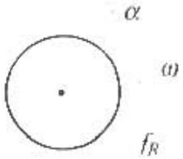
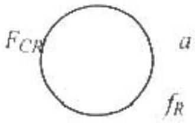
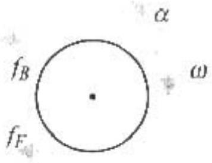
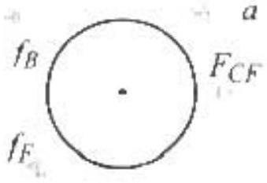

2000 Semi-Final Exam
Part A - Solutions

A1. Let $R = 0.15 \mathrm {~m} =$ the radius of the balloon
$p = 2 \times 1.01 \times 10 ^ { 5 } \mathrm {~Pa} =$ The pressure inside the balloon
$m _ { b } = 0.0042 \mathrm {~kg} =$ The mass of the empty balloon
$T = ( 20 + 273 ) \mathrm { K } =$ The temperature of the air
a. The volume of the balloon is

$$
V = \frac { 4 } { 3 } \pi R ^ { 3 } = \frac { 4 } { 3 } \pi ( 0.15 \mathrm {~m} ) ^ { 3 } = 0.0141 \mathrm {~m} ^ { 3 }
$$

Using the ideal gas law

$$
n = \frac { p \mathrm { l } } { R T } = \frac { \left( 2.02 \times 10 ^ { 5 } \mathrm {~Pa} \right) \left( 0.0141 \mathrm {~m} ^ { 3 } \right) } { ( 8.31 \mathrm {~J} / \mathrm { mole } \cdot \mathrm {~K} ) ( 293 \mathrm {~K} ) } = 1.17 \text { moles } .
$$

Therefore the mass of the air inside the balloon is

$$
m = n M = ( 1.17 \text { moles } ) ( 28.8 \mathrm {~g} / \text { mole } ) = 33.7 \mathrm {~g} = 0.0337 \mathrm {~kg}
$$

The scale reading will be equal to the force of gravitational attraction $\left( m + m _ { b } \right) g$ on the balloon and the enclosed air minus the buoyant force $B = m _ { \text {dats } } g = \rho g V$ acting on the balloon, where $m _ { \text {dis } }$ is the mass of the air displaced by the balloon.

$$
F _ { s } = \left( m + m _ { b } \right) g - m _ { \text {dis } } g = \left( m + m _ { b } - m _ { \text {dis } } \right) g
$$

The temperature and volume of the air displaced is the same as that of the air within the balloon but the pressure is only half as much.

$$
\begin{gathered}
m _ { \text {dis } } = n _ { \text {dis } } M = \frac { 1 } { 2 } n M = \frac { 1 } { 2 } m = 0.0168 \mathrm {~kg} \\
F _ { s } = ( 0.0337 \mathrm {~kg} + 0.0042 \mathrm {~kg} - 0.0168 \mathrm {~kg} ) \left( 9.8 \mathrm {~m} / \mathrm { s } ^ { 2 } \right) = 0.21 \mathrm {~N}
\end{gathered}
$$

b. The amount of air inside the balloon and its mass do not change. The volume of air displaced and its mass both change by the amount

$$
\begin{gathered}
m _ { \text {dis } } ^ { \prime } = \rho V ^ { \prime } = \rho \frac { 4 } { 3 } \pi \left( R ^ { \prime } \right) ^ { 3 } = \rho \frac { 4 } { 3 } \pi ( 1.1 R ) ^ { 3 } = ( 1.1 ) ^ { 3 } \rho \frac { 4 } { 3 } \pi R ^ { 3 } = ( 1.1 ) ^ { 3 } m _ { \text {dis } } = ( 1.1 ) ^ { 3 } ( 0.0168 \mathrm {~kg} ) = 0.0224 \mathrm {~kg} \\
F _ { s } = \left( m + m _ { b } - m _ { \text {dis } } { } ^ { \prime } \right) g = ( 0.0337 \mathrm {~kg} + 0.0042 \mathrm {~kg} \cdot 0.0224 \mathrm {~kg} ) \left( 9.8 \mathrm {~m} / \mathrm { s } ^ { 2 } \right) = 0.15 \mathrm {~N}
\end{gathered}
$$

A2. a. Because of symmetry, $I _ { l } = I _ { 2 }$ and $I _ { 4 } = I _ { 5 }$ and $I _ { 7 } = I _ { 8 }$.
No current flows through 3 or $6 . \quad I _ { 3 } = 0$ and $I _ { 6 } = 0$.
1,4 , and 7 are effectively in series with an equivalent resistance of $R _ { s } = R + R + R = 3 R$
Similarly for the right branch containing 2, 5, and 8.
The left and right branches are in parallel so, the equivalent resistance is given by

$$
\frac { 1 } { R _ { e q } } = \frac { 1 } { 3 R } + \frac { 1 } { 3 R } = \frac { 2 } { 3 R }
$$

or
b. As stated in the argument in Part a.

$$
l _ { 2 } = 0 \quad \text { and } \quad l _ { 6 } - 0 .
$$

All the other currents are equal

$$
I _ { 1 } = I _ { 2 } = I _ { 4 } - I _ { 5 } = I _ { 2 } - I _ { 5 } = I .
$$

Applying Kirchhoff's loop rule to the left loop

$$
\begin{gathered}
0 = 6.0 \mathrm {~V} - l ( 3 R ) \\
I = \frac { 6.0 \mathrm {~V} } { 3 R } = \frac { 6.0 \mathrm {~V} } { 36 \Omega } = \frac { 1 } { 6 } \mathrm {~A}
\end{gathered}
$$

c. When the circuit has been connected for a very long time, the capacitors are fully charged. No current flows through 7,5 , and 7 . There is only one path for the current, through $2,3,4,6$, and 8. These five resistors are effectively in series with

$$
V _ { R } = ( 1 / 5 ) 60 \mathrm {~V} - 1.2 \mathrm {~V}
$$

across each. Applying Kirchoff's loop rule to the upper loop

$$
0 = V _ { R } + V _ { R } - V _ { C l }
$$

$$
Q _ { 1 } - C V _ { C l } = C 2 V _ { R } = ( 4.0 \mu \mathrm {~F} ) ( 2.4 \mathrm {~V} ) - 9.6 \mu \mathrm { C }
$$

Similarly for

$$
Q _ { 2 } = 9.6 \mu C .
$$

For the middle loop we have

$$
0 = V _ { H } + V _ { R } + V _ { R } - V _ { C 5 }
$$

Which yields

$$
Q _ { s } = C V _ { c s } = C 3 V _ { R } = ( 4.0 \mu \mathrm {~F} ) ( 3.6 \mathrm {~V} ) = 14.4 \mu \mathrm { C }
$$

d. When the circuit has been connected for a very long time, no current flows through 7 or 7 . The same current flows through 3, 4. and 6.

$$
\begin{aligned}
0 & = 6.0 \mathrm {~V} - 3 R I \\
I _ { 3 } = I _ { 4 } & = I _ { 6 } = \frac { 6.0 \mathrm {~V} } { 36 \Omega } = \frac { 1 } { 6 } \mathrm {~A}
\end{aligned}
$$

There is 2.0 V across each of the resistors 3, 4, and 6 and capacitors $I$ and 7. Hence the voltage across 2 and 8 is zero and

$$
I _ { 2 } = I _ { 8 } = 0
$$

A3. a. The relativistic energy and momentum of a particle are given by

$$
E = \frac { m c ^ { 2 } } { \sqrt { 1 - ( V / c ) ^ { 2 } } }
$$

$$
p = \frac { m V } { \sqrt { 1 - ( V / c ) ^ { 2 } } }
$$

where $m$ is the particle mass and $V$ is the particle speed. The energy and momentum of a photon of frequency $v$ are given by

$$
E _ { \gamma } = h v
$$

Applying energy conservation, we have

$$
\begin{gather*}
p _ { y } = \frac { h v } { c } \\
\frac { m c ^ { 2 } } { \sqrt { 1 - ( V / c ) ^ { 2 } } } = h v _ { 1 } + h v _ { 2 }  \tag{A3.1}\\
\frac { m V } { \sqrt { 1 - ( V / c ) ^ { 2 } } } = \frac { h v _ { 1 } } { c } - \frac { h v _ { 2 } } { c } \tag{A3.2}
\end{gather*}
$$

Dividing (A3.2) by (A3,1), we have

$$
\frac { m V } { m c ^ { 2 } } = \frac { h \left( v _ { 1 } - v _ { 2 } \right) } { c h \left( v _ { 1 } + v _ { 2 } \right) } .
$$

Canceling common factors and solving for $V$

$$
\begin{equation*}
V = c \frac { \left( v _ { 1 } - v _ { 2 } \right) } { \left( v _ { 1 } + v _ { 2 } \right) } \quad \text { to the right. } \tag{A3.3}
\end{equation*}
$$

b. Solving (A3.1) for $m$

$$
\begin{align*}
& m = \frac { h } { c ^ { 2 } } \left( v _ { 1 } + v _ { 2 } \right) \sqrt { 1 - \left( \frac { V } { c } \right) ^ { 2 } } \\
& m = \frac { h } { c ^ { 2 } } \left( v _ { 1 } + v _ { 2 } \right) \sqrt { 1 - \left( \frac { v _ { 1 } - v _ { 2 } } { v _ { 1 } + v _ { 2 } } \right) ^ { 2 } } = \frac { h } { c ^ { 2 } } \sqrt { \left( v _ { 1 } + v _ { 2 } \right) ^ { 2 } - \left( v _ { 1 } - v _ { 2 } \right) ^ { 2 } } \\
& \quad m = \frac { 2 h } { c ^ { 2 } } \sqrt { v _ { 1 } v _ { 2 } } \tag{A3.4}
\end{align*}
$$

c. In the rest frame of the particle the two photons must have equal and opposite momenta. I travels to the right with frequency $v$ and 2 travels to the left with frequency $v$. In its rest frame the particle's energy is $m c ^ { 2 }$. Applying energy conservation we have

$$
m c ^ { 2 } = h v + h v = 2 h v .
$$

Combining this with (A3.4)

$$
m c ^ { 2 } = 2 h \sqrt { v _ { 1 } v _ { 2 } } = 2 h v .
$$

Or

$$
v = \sqrt { v _ { 1 } v _ { 2 } } = \frac { m c ^ { 2 } } { 2 h }
$$

d. Writing the given equation for photon 1

$$
\frac { h v _ { 1 } } { c } = F _ { 1 } \frac { h v } { c } + F _ { 2 } \frac { h v } { c } = \left( F _ { 1 } + F _ { 2 } \right) \frac { h v } { c }
$$

Or

$$
\begin{equation*}
\left( F _ { 1 } + F _ { 2 } \right) = \frac { 2 h v _ { 1 } } { m c ^ { 2 } } . \tag{A3.5}
\end{equation*}
$$

While for photon 2

$$
- \frac { h v _ { 2 } } { c } = - F _ { 1 } \frac { h \sqrt { v _ { 1 } v _ { 2 } } } { c } + F _ { 2 } \frac { h \sqrt { v _ { 1 } v _ { 2 } } } { c }
$$

or

$$
\begin{equation*}
\left( F _ { 1 } - F _ { 2 } \right) = \frac { 2 h v _ { 2 } } { m c ^ { 2 } } \tag{A3.6}
\end{equation*}
$$

Adding (A3.5) and (A3.6)
and comparing to (A3.1)
Subtracting (A3.6) from (A3.5) we have
and comparing to (A3.2)

$$
\begin{aligned}
2 F _ { 1 } & = \frac { 2 h } { m c ^ { 2 } } \left( v _ { 1 } + v _ { 2 } \right) \\
F _ { 1 } & = \frac { 1 } { \sqrt { 1 - ( V / c ) ^ { 2 } } } \\
2 F _ { 2 } & = \frac { 2 h } { m c ^ { 2 } } \left( v _ { 1 } - v _ { 2 } \right) \\
F _ { 2 } & = \frac { ( V / c ) } { \sqrt { 1 - ( V / c ) ^ { 2 } } }
\end{aligned}
$$

A4. Since friction is assumed non-existent, all collisions are elastic. Both momentum and mechanical energy are conserved.
Let $v =$ speed of coin after it has left the left-hand wedge
$V _ { 1 }$ - speed of left-hand wedge after coin has left
$H =$ maximum height the coin reaches on the right hand wedge
$V =$ speed of right-hand wedge and coin when coin is at its highest point on the righthand wedge and at rest with respect to it
In all of the following, velocities to the right will be positive and velocities to the left will be negative. Equating the energy and momentum of the initial condition (coin at height h) and final condition (coin has completely left left-hand wedge).
Momentum conservation

$$
0 = - M V _ { l } + m v
$$

Solving for $V _ { t }$

$$
\begin{equation*}
V _ { l } = \frac { m } { M } v \tag{A4.1}
\end{equation*}
$$

Energy conservation

$$
m g h = \frac { 1 } { 2 } M V _ { L } ^ { 2 } + \frac { 1 } { 2 } m v ^ { 2 }
$$

Substituting (A4.1)

$$
2 m g h = M \left( \frac { m } { M } v \right) ^ { 2 } + m v ^ { 2 } = m \left( \frac { m } { M } + 1 \right) v ^ { 2 }
$$

Solving for $\mathrm { v } ^ { 2 }$

$$
\begin{equation*}
v ^ { 2 } = \frac { 2 M g h } { m - M } \tag{A4.2}
\end{equation*}
$$

a. Equating the energy and momentum of the initial condition (coin with velocity $v$, right-hand wedge at rest) and final condition (coin at rest with respect to right-hand wedge).
Momentum conservation

$$
\begin{equation*}
m v = ( m + M ) V \tag{A4.3}
\end{equation*}
$$

Energy conservation

$$
\begin{equation*}
\frac { 1 } { 2 } m v ^ { 2 } = \frac { 1 } { 2 } ( m + M ) V ^ { 2 } + m g H \tag{A4.4}
\end{equation*}
$$

Combining (a4.3) and (A4.4)

$$
m v ^ { 2 } = ( m + M ) \left( \frac { m } { m + M } v \right) ^ { 2 } + 2 m g H = \frac { m ^ { 2 } } { m + M } r ^ { 2 } + 2 m g H
$$

Solving for $H$

$$
H = \frac { 1 } { 2 g } \left( 1 - \frac { m } { m + M } \right) v ^ { 2 } = \frac { 1 } { 2 g } \left( \frac { M } { m + M } \right) v ^ { 2 }
$$

Substituting (A4.2) into this

$$
H = \frac { 1 } { 2 g } \left( \frac { M } { m + M } \right) \left( \frac { 2 M g h } { m + M } \right) = \left( \frac { M } { m + M } \right) ^ { 2 } h
$$

b. Let $\quad v _ { F } =$ The speed of the coin after it has left the right-hand wedge
$V _ { R } =$ The speed of the right hand wedge after the coin has slid off it
For the coin to again contact the left-hand wedge $\quad v _ { f } > V _ { f }$. Equating the momentum and energy before and after the coin's collision with the right-hand wedge
Momentum conservation

$$
\begin{aligned}
& m v = M V _ { R } - m v _ { F } \\
& V _ { R } = \frac { m } { M } \left( v + v _ { F } \right)
\end{aligned}
$$

Energy conservation

$$
\frac { 1 } { 2 } m v ^ { 2 } = \frac { 1 } { 2 } M V _ { R } ^ { 2 } + \frac { 1 } { 2 } m v _ { r } ^ { 2 }
$$

Combining the last two equations and dividing by $m$ and multiplying by 2 .

$$
\begin{gathered}
v ^ { 2 } = \left( \frac { m } { M } \right) \left( v + v _ { F } \right) ^ { 2 } + v _ { F } ^ { 2 } \\
M v ^ { 2 } = m \left( v ^ { 2 } + 2 v v _ { i } + v _ { F } ^ { 2 } \right) + M v _ { F } ^ { 2 }
\end{gathered}
$$

Or regrouping terms

$$
0 = ( M + m ) v _ { F } ^ { 2 } + ( 2 m v ) v _ { F } - ( M - m ) v ^ { 2 }
$$

Solving this quadratic equation for $v _ { f }$

$$
v _ { F } = \frac { - 2 m v \pm \sqrt { ( 2 m v ) ^ { 2 } + 4 ( M + m ) ( M - m ) v ^ { 2 } } } { 2 ( M + m ) } = \frac { - 2 m v \pm \sqrt { 4 M ^ { 2 } v ^ { 2 } } } { 2 ( M + m ) } = \frac { - m v \pm M v } { ( M + m ) }
$$

Only the plus sign gives a positive speed and a velocity in the correct direction.

$$
v _ { F } = \left( \frac { M - m } { M + m } \right) v
$$

For the coin to again contact the left-hand wedge $\quad v _ { F } > V _ { L }$, or

$$
\left( \frac { M - m } { M + m } \right) v > \frac { m } { M } v
$$

Dividing by $v$ and cross multiplying, the condition becomes
Or

$$
\begin{gathered}
( M - m ) M > ( M + m ) m \\
M ^ { 2 } - 2 M m - m ^ { 2 } > 0
\end{gathered}
$$

Using the quadratic formula this becomes

$$
M > \frac { 1 } { 2 } \left( 2 m \pm \sqrt { 4 m ^ { 2 } + 4 m ^ { 2 } } \right)
$$

Since $M$ must be positive this becomes $M > m ( 1 + \sqrt { 2 } )$

| AAPT | UNITED STATES PHYSICS TEAM |
| :--- | :--- |
| AIP | 2000 |

2000 Semi-Final Exam
Part B - Solutions

B1a. Because the charge distribution is uniform, there is spherical symmetry and we can use Gauss's Law to calculate the electrostatic field. This yields

$$
\vec { E } = k \frac { q _ { e n c } } { R ^ { 2 } } \vec { e } _ { R }
$$

where $R = \sqrt { x ^ { 2 } + y ^ { 2 } + z ^ { 2 } } \cdot q _ { \text {enc } }$ is the charge enclosed by a Gaussian surface of radius R, and $\vec { e } _ { R }$ is a unit vector in the $\boldsymbol { R }$ direction.
Region I: A Gaussian surface of radius $R < b$ encloses no charge, so $\quad E _ { j } = 0$
Region II: A Gaussian surface of radius $c > R > b$ encloses $\quad q _ { e n c } = - Q$
Thus

$$
\begin{equation*}
\bar { E } _ { i f } = - k \frac { Q } { R ^ { 2 } } \dot { e } _ { R } \quad \text { or } \quad E _ { i / } = k \frac { Q } { R ^ { 2 } } \quad \text { radially inward. } \tag{B1.1}
\end{equation*}
$$

Region III: A Gaussian surface of radius $R > c$ encloses
Therefore

$$
\begin{array} { r }
q _ { e n c } = - Q - Q = 0 \\
E _ { I t f } = 0
\end{array}
$$

b. Region III: Since the field is zero, the potential is a constant throughout the region. Its value at any point in III is the same as its value at infinity

$$
V _ { i j l } = 0
$$

Region II:

$$
V _ { l l } ( R ) - V _ { l l } ( c ) = - \int _ { c } ^ { R } \vec { E } \cdot \overrightarrow { d l }
$$

Using (B1.1), $\overrightarrow { d l } = \left( - \vec { e } _ { R } \right) ( - d R ) = \vec { e } _ { R } d R$, and noting $V _ { I I } ( c ) = V _ { I I } ( c ) = 0$

$$
V _ { H } ( R ) = \int _ { c } ^ { R } k \frac { Q } { r ^ { 2 } } d r = - \left. k \frac { Q } { r } \right| _ { r = c } ^ { R } = k \frac { Q } { c } - k \frac { Q } { R } = k Q \left( \frac { 1 } { c } - \frac { 1 } { R } \right)
$$

Region I: Since the field is zero, the potential is constant and is everywhere equal to its value on the boundary

$$
V _ { l } = V _ { l l } \text { at } R = b .
$$

Thus

$$
V _ { l } = k Q \left( \frac { 1 } { c } - \frac { 1 } { b } \right) .
$$

c. In each region the total field can be obtained by superposition, adding vectorially the fields due to the individual spheres.

$$
\vec { E } = \vec { E } _ { + Q } + \vec { E } _ { - Q }
$$

Inside each uniformly charged sphere the field due to that sphere is zero.
Region 1: This region is inside both spheres so both contributions are zero and $\quad E _ { I } = 0$.

Region 11: The field due to the $+ Q$ sphere is zero in this region. The field due to the $- Q$ is equivalent to that due to a $- Q$ point charge at $x - ( t ) , y = 0 , z = b$. Letting $\bar { R } = x \vec { i } + y \vec { j } + ( z - b ) \vec { k }$ represent the vector from this point charge to the arbitrary field point, we have

$$
E _ { l l } = - k \frac { Q \vec { R } } { R ^ { 3 } } = k \frac { Q ( x i + y i + ( z - b ) \vec { k } ) } { \left( x ^ { 2 } + y ^ { 2 } + ( z - b ) ^ { 2 } \right) ^ { 3 / 2 } }
$$

Region III: In this region both spheres contribute to the field. Adding to the previous result the contribution equivalent to a $+ Q$ point charge at the origin, yields

$$
E _ { l l } = - k \frac { Q ( x \vec { i } + y \vec { j } + ( z - b ) \vec { k } ) } { \left( x ^ { 2 } + y ^ { 2 } + ( z - b ) ^ { 2 } \right) ^ { 3 / } } + k \frac { Q ( x \vec { i } + y \vec { j } + z \vec { k } ) } { \left( x ^ { 2 } + y ^ { 2 } + z ^ { 2 } \right) ^ { 1 / 2 } }
$$

d. Region III. Since the field here is the equivalent to that due to two point charges, so is the potential.

$$
V _ { i I I } = k Q \left( \frac { 1 } { \sqrt { x ^ { 2 } + y ^ { 2 } + z ^ { 2 } } } - \frac { 1 } { \sqrt { x ^ { 2 } + y ^ { 2 } + ( z - b ) ^ { 2 } } } \right)
$$

Region II: In this region. the contribution due to the inner sphere is equivalent to that due to a point charge. The contribution due to the outer sphere is constant. To find this value, equate across the boundary with Region III.

$$
V _ { H } = k Q \left( \frac { 1 } { c } - \frac { 1 } { \sqrt { x ^ { 2 } + y ^ { 2 } + ( z - b ) ^ { 2 } } } \right)
$$

Region I: Since the field is zero, the potential is constant. To find this value, equate across the boundary with Region II.

$$
v _ { i } = k Q \left( \frac { 1 } { c } - \frac { 1 } { h } \right)
$$

B2.a. For the wheel $I = \frac { 1 } { 2 } m R ^ { 2 }$ and $a = \alpha R$ since it is rolling without slipping. The wheel is turning clockwise. It's decelerating so the force producing the torque must be towards the front of the car. For the rotational motion of the rear wheel about its axis

$$
\begin{gathered}
f \alpha = f _ { R } R \\
\frac { 1 } { 2 } m R ^ { 2 } \frac { a } { R } = f _ { R } R \\
f _ { R } = \frac { 1 } { 2 } m a
\end{gathered}
$$

b. Now consider the translational deceleration of the rear wheel

$$
m a = F _ { C R } - f _ { R } \quad \text { where we }
$$

have chosen the acceleration direction to be positive. Therefore

$$
F _ { C R } = m a + f _ { R } = m a + \frac { 1 } { 2 } m a = \frac { 3 } { 2 } m a \quad \text { towards the rear }
$$

c. Consider the total external force acting on the car-wheel combination which has total mass $M + 2 m$

$$
\begin{gathered}
f _ { F } - f _ { R } = ( M + 2 m ) a \\
f _ { F } = f _ { R } + ( M + 2 m ) a = \frac { 1 } { 2 } m a + ( M + 2 m ) a = \left( M + \frac { 5 } { 2 } m \right) a \quad \text { towards rear. }
\end{gathered}
$$

d. Considering the rotational motion of the front wheel about its axis

$$
I \alpha = \left( f _ { B } - f _ { F } \right) R
$$

Solving for $f _ { B } \quad f _ { B } = \frac { 1 } { 2 } m a + f _ { F } = \frac { 1 } { 2 } m a + \left( M + \frac { 5 } { 2 } m \right) a = ( M + 3 m ) a$

towards the rear.
e. Consider the total external force acting on the front wheel

$$
f _ { F } + f _ { B } - F _ { C F } = m a
$$

$$
F _ { C F } = f _ { F } + f _ { B } - m a = \left( M + \frac { 5 } { 2 } m \right) a + ( M + 3 m ) a - m a = \left( 2 M + \frac { 9 } { 2 } m \right) a
$$

towards the front.
f. We will first calculate the normal forces exerted by the axles on the carriage part of the car. Call these normal forces $N _ { R }$ and $N _ { F }$. Using Newton's third law to find the horizontal forces exerted on the carriage by the axles and the brake, we have the force diagram at the right. Consider the vertical forces acting on the block part of the car. There is no acceleration in the vertical direction, so these must sum to zero. Or

$$
\begin{equation*}
N _ { F } + N _ { R } = M g \tag{B2.1}
\end{equation*}
$$

Consider the torques acting on the block part of the car. It is not rotating, so the total torque about the center of mass must equal zero.

$$
F _ { C R } \left( \frac { h } { 2 } + R \right) + f _ { h } \frac { h } { 2 } + N _ { F } \frac { l } { 2 } - F _ { C Z } \left( \frac { h } { 2 } + R \right) - N _ { R } \frac { L } { 2 } = 0
$$

Reartanging terms
Reartanging terms

$$
N _ { F } - N _ { R } = \frac { 2 } { L } \left[ \left( F _ { C F } - F _ { C R } \right) \left( \frac { h } { 2 } + R \right) - f _ { B } \frac { h } { 2 } \right]
$$

Substituting the known $F _ { C F } , F _ { C R }$, and $f _ { B }$

$$
\begin{gather*}
N _ { F } - N _ { R } = \frac { 2 } { L } \left[ \left( 2 M + \frac { 9 } { 2 } m - \frac { 3 } { 2 } m \right) u \left( \frac { h } { 2 } + R \right) - ( M + 3 m ) a \frac { h } { 2 } \right] \\
N _ { F } - N _ { R } = \frac { a } { L } [ ( 2 M + 3 m ) ( h + 2 R ) - ( M + 3 m ) h ] = \frac { a } { L } [ h M + 2 R ( 2 M + 3 m ) ] \tag{B2.2}
\end{gather*}
$$

Adding (B2.1) and (B2.2)

$$
\begin{aligned}
& 2 N _ { F } = \frac { a } { L } [ h M + 2 R ( 2 M + 3 m ) ] + M g \\
& N _ { F } = \frac { 1 } { 2 } M g + \frac { a h } { 2 L } M + \frac { a R } { L } ( 2 M + 3 m )
\end{aligned}
$$

And for the rear axle $\quad N _ { R } = M g - N _ { f } = \frac { 1 } { 2 } M g \quad \frac { a h } { 2 L } M - \frac { a R } { L } ( 2 M + 3 m )$
These are the upward forces exerted by the axles on the carriage. Consider now the vertical forces acting on the wheel, shown in the diagram at the right. Since there is no vertical acceleration these must sum to zero.

$$
n _ { F } - N _ { F } - m g = 0
$$

Finally

$$
\begin{equation*}
n _ { F } = N _ { F } + m g = \frac { 1 } { 2 } ( M + 2 m ) g + \frac { a h } { 2 L } M + \frac { a R } { L } ( 2 M + 3 m ) \tag{B2.3}
\end{equation*}
$$

Similarly for the rear wheel

$$
\begin{equation*}
n _ { R } = \frac { 1 } { 2 } ( M + 2 m ) g - \frac { a h } { 2 L } M - \frac { a R } { L } ( 2 M + 3 m ) \tag{B2.4}
\end{equation*}
$$

g. For each wheel the maximum frictional force corresponding to the maximum deceleration is un. For the rear wheel

$$
f _ { R } = \mu t _ { R }
$$

Using the results of Part a and Part f.

$$
\frac { 1 } { 2 } m a = \mu \left[ \frac { 1 } { 2 } ( M + 2 m ) g - \frac { a h } { 2 L } M - \frac { a R } { L } ( 2 M + 3 m ) \right]
$$

Solving for a

$$
\begin{equation*}
a _ { R \text { max } } = \frac { \mu ( M + 2 m ) g L } { m L + \mu [ M h + ( 2 M + 3 m ) 2 R ] } \tag{B2.5}
\end{equation*}
$$

For the front wheel

$$
\begin{gather*}
\left( M + \frac { 5 } { 2 } m \right) a = \mu \left[ \frac { 1 } { 2 } ( M + 2 m ) g + \frac { a h } { 2 L } M + \frac { a R } { L } ( 2 M + 3 m ) \right] \\
a _ { F \text { max } } = \frac { \mu ( M + 2 m ) g L } { ( 2 M + 5 m ) L - \mu [ M h + ( 2 M + 3 m ) 2 R ] } \tag{B2.6}
\end{gather*}
$$

h. Putting the given values into (B2.5) and (B2.6). we have
$$
\begin{gathered}
a _ { R \text { max } } = \frac { 0.6 ( 6000 \mathrm {~kg} + 2 ( 200 \mathrm {~kg} ) ) g ( 2.5 \mathrm {~m} ) } { ( 200 \mathrm {~kg} ) ( 2.5 \mathrm {~m} ) + 0.6 [ ( 6000 \mathrm {~kg} ) ( 1.5 \mathrm {~m} ) + ( 2 ( 6000 \mathrm {~kg} ) + 3 ( 200 \mathrm {~kg} ) ) 2 ( 0.3 \mathrm {~m} ) ] } \\
a _ { R \text { max } } = 0.920 \mathrm {~g} \\
a _ { f \text { max } } = \frac { 0.6 ( 600 \mathrm {~kg} + 2 ( 200 \mathrm {~kg} ) ) g ( 2.5 \mathrm {~m} ) } { ( 2 ( 6000 \mathrm {~kg} ) + 5 ( 200 \mathrm {~kg} ) ) ( 2.5 \mathrm {~m} ) - 0.6 [ ( 6000 \mathrm {~kg} ) ( 1.5 \mathrm {~m} ) + ( 2 ( 6000 \mathrm {~kg} ) + 3 ( 200 \mathrm {~kg} ) ) 2 ( 0.3 \mathrm {~m} ) ] } \\
a _ { f \text { max } } = 0.425 \mathrm {~g}
\end{gathered}
$$
therefore the maximum deceleration the car can have is $\quad a _ { \text {car max } } = 0.425 g$
i. Forming the ratio and substituting in the given values
$$
\begin{gathered}
\frac { n _ { F } } { n _ { R } } = \frac { \frac { 1 } { 2 } ( M + 2 m ) g + \frac { a h } { 2 L } M + \frac { a R } { L } ( 2 M + 3 m ) } { \frac { 1 } { 2 } ( M + 2 m ) g - \frac { a h } { 2 L } M - \frac { a R } { L } ( 2 M + 3 m ) } = \frac { ( M + 2 m ) g L + a h M + 2 a R ( 2 M + 3 m ) } { ( M + 2 m ) g L - a h M - 2 a R ( 2 M + 3 m ) } \\
\frac { n _ { F } } { n _ { R } } = \frac { ( 6000 \mathrm {~kg} + 2 ( 200 \mathrm {~kg} ) ) g ( 2.5 \mathrm {~m} ) + ( 0.425 g ) ( 1.5 \mathrm {~m} ) ( 6000 \mathrm {~kg} ) + 2 ( 0425 g ) ( 0.3 \mathrm {~m} ) ( 2 ( 6000 \mathrm {~kg} ) + 3 ( 200 \mathrm {~kg} ) ) } { ( 6000 \mathrm {~kg} + 2 ( 200 \mathrm {~kg} ) ) g ( 2.5 \mathrm {~m} ) - ( 0.425 g ) ( 1.5 \mathrm {~m} ) ( 6000 \mathrm {~kg} ) - 2 ( 0.425 \mathrm {~g} ) ( 0.3 \mathrm {~m} ) ) ( 2 ( 6000 \mathrm {~kg} ) + 3 ( 200 \mathrm {~kg} ) ) } \\
\frac { n _ { F } } { n _ { R } } = \frac { ( 6400 \mathrm {~kg} ) ( 2.5 \mathrm {~m} ) + ( 0.425 ) ( 1.5 \mathrm {~m} ) ( 6000 \mathrm {~kg} ) + 2 ( 0.425 ) ( 0.3 \mathrm {~m} ) ( 12600 \mathrm {~kg} ) } { ( 6400 \mathrm {~kg} ) ( 25 \mathrm {~m} ) - ( 0.425 ) ( 1.5 \mathrm {~m} ) ( 6000 \mathrm {~kg} ) - 2 ( 0.425 ) ( 0.3 \mathrm {~m} ) ( 12600 \mathrm {~kg} ) } \\
\frac { n _ { F } } { n _ { R } } = 2.57
\end{gathered}
$$
