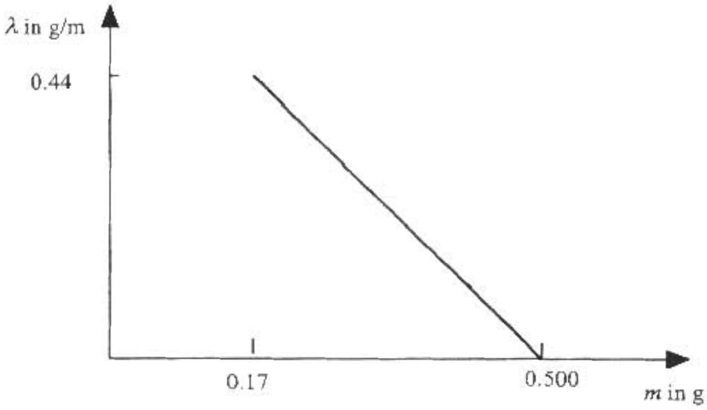

| RAPT | UNITED STATES PHYSICS TEAM |
| :--- | :--- |
| AIP | 2002 |

2002 Semi-Final Exam
Part A - Solutions

A1. a. The magnitude of the magnetic field inside an ideal solenoid is $B = \mu _ { 0 } n I$ where the number of turns per unit length $n$ is the inverse of the length per turn - the diameter $d$ of the wire.

$$
n = \frac { 1 } { d } = \frac { 1 } { 2 r _ { 1 } }
$$

The total resistance of the wire used to construct the solenoid is

$$
R = \rho \frac { l } { A _ { 1 } } = \rho \frac { l } { \pi r _ { 1 } ^ { 2 } } .
$$

The current

$$
I = \frac { V } { R } = \frac { V \pi r _ { 1 } ^ { 2 } } { \rho l }
$$

Combining to find
b. The self inductance $L$ can be found from

$$
\begin{equation*}
L l = N \Phi \tag{Al-1}
\end{equation*}
$$

where $N$ is the total number of turns - the length of the wire divided by the circumference of one turn

$$
N = \frac { l } { 2 \pi r _ { 2 } }
$$

and $\Phi$ is the flux through one turn

$$
\Phi = B \pi r _ { 2 } ^ { 2 } = \mu _ { 0 } n I \pi r _ { 2 } ^ { 2 } = \frac { \mu _ { 0 } \pi r _ { 2 } ^ { 2 } } { 2 r _ { 1 } } I
$$

combining with (A1-1)

$$
L = \frac { N \Phi } { I } = \left( \frac { l } { 2 \pi r _ { 2 } } \right) \left( \frac { \mu _ { 0 } \pi r _ { 2 } ^ { 2 } } { 2 r _ { 1 } } \right) = \frac { \mu _ { 0 } r _ { 2 } l } { 4 r _ { 1 } }
$$

c. The inductive impedance is $Z _ { L } = \omega L$. The total impedance of the circuit is $Z = \sqrt { R ^ { 2 } + ( \omega L ) ^ { 2 } }$

$$
I _ { r m s } = \frac { V _ { r m s } } { \sqrt { R ^ { 2 } + ( \omega L ) ^ { 2 } } } = \frac { V _ { r m s } } { \sqrt { \left( \frac { \rho l } { \pi r _ { 1 } ^ { 2 } } \right) ^ { 2 } + \left( \frac { 2 \pi f \mu _ { o } r _ { 2 } l } { 4 r _ { 1 } } \right) ^ { 2 } } } = \frac { 2 r _ { 1 } V _ { r m s } } { l \sqrt { \left( \frac { 2 \rho } { \pi r _ { 1 } } \right) ^ { 2 } + \left( \pi f \mu _ { o } r _ { 2 } \right) ^ { 2 } } }
$$

A2. a. The energy and magnitude of the momentum of a photon of frequency $f$ are:

$$
E = h f \quad p = \frac { h } { \lambda } = \frac { h f } { c } .
$$

Energy is conserved. Equating the energy of the particle before the decay to the total photon energy after the decay

$$
\begin{equation*}
\frac { m c ^ { 2 } } { \sqrt { 1 - ( v / c ) ^ { 2 } } } = h f + h f \tag{A2-1}
\end{equation*}
$$

Momentum is conserved. Equating the momentum of the particle before the decay to the sum of the x-components of the photon momentum after the decay

$$
\begin{equation*}
\frac { m v } { \sqrt { 1 - ( v / c ) ^ { 2 } } } = \frac { h f } { c } \cos \theta + \frac { h f } { c } \cos \theta . \tag{A2-2}
\end{equation*}
$$

Dividing (A2-2) by (A2-1) $\frac { m v } { \sqrt { 1 - ( v / c ) ^ { 2 } } } \frac { \sqrt { 1 - ( v / c ) ^ { 2 } } } { m c ^ { 2 } } = \frac { ( 2 h f / c ) \cos \theta } { 2 h f }$
Or

$$
\begin{align*}
& \frac { v } { c ^ { 2 } } = \frac { \cos \theta } { c } \\
& v = c \cos \theta \quad \text { in the positive } x \text {-direction } \tag{A2-3}
\end{align*}
$$

b. Solving (A2-1) for $m c ^ { 2 } \quad m c ^ { 2 } = 2 h f \sqrt { 1 - ( v / c ) ^ { 2 } }$
and substituting in (A2-3) $m c ^ { 2 } = 2 h f \sqrt { 1 - ( c \cos \theta / c ) ^ { 2 } } = 2 h f \sqrt { 1 - ( \cos \theta ) ^ { 2 } } = 2 h f \sin \theta$

$$
\begin{equation*}
m = \frac { 2 h f } { c ^ { 2 } } \sin \theta \tag{A2-4}
\end{equation*}
$$

c. In this frame, the particle has zero momentum, so the momentum of the final photons must be equal and opposite - one along the $+ y$-axis, the other along the $- y$-axis. If each photon's momentum has the same magnitude, the photons must have the same frequency $f ^ { \prime }$.

In this frame the particles energy is $m c ^ { 2 }$. Applying energy conservation

$$
m c ^ { 2 } = 2 h f ^ { \prime } .
$$

Solving for $f ^ { \prime }$ and substituting in (A2-4)

$$
f ^ { \prime } = \frac { m c ^ { 2 } } { 2 h } = \left( \frac { 2 h f } { c ^ { 2 } } \sin \theta \right) \frac { c ^ { 2 } } { 2 h } = f \sin \theta
$$

A3. The Planck length $\lambda _ { \mathrm { P } }$, the Planck time $t _ { \mathrm { P } }$, and the Planck mass $m _ { \mathrm { P } }$ depend only on the Newton's gravitational constant $G$, Planck's constant $h$, and speed of light in a vacuum $c$ and no other constant. Use dimensional analysis to obtain the equations. Let

[T] represent the dimension of time
[L] represent the dimension of length

[M] represent the dimension of mass
Since $G$ has units $\mathrm { N } \cdot \mathrm { m } ^ { 2 } / \mathrm { kg } ^ { 2 } = \left( \mathrm { kg } \cdot \mathrm { m } / \mathrm { s } ^ { 2 } \right) \mathrm { m } ^ { 2 } / \mathrm { kg } ^ { 2 } = \mathrm { m } ^ { 3 } \mathrm {~kg} ^ { - 1 } \mathrm {~s} ^ { - 2 }$ its dimensions are $[ \mathrm { L } ] ^ { 3 } [ \mathrm { M } ] ^ { - 1 } [ \mathrm {~T} ] ^ { - 2 }$ for $G$ $h$ has units $\mathrm { J } \mathrm { s } = \left( \mathrm { kg } \cdot \mathrm { m } ^ { 2 } / \mathrm { s } ^ { 2 } \right) \mathrm { s } = \mathrm { m } ^ { 2 } \mathrm {~kg} ^ { 1 } \mathrm {~s} ^ { - 1 }$ its dimensions are

$[ \mathrm { L } ] ^ { 2 } [ \mathrm { M } ] ^ { 1 } [ \mathrm {~T} ] ^ { - 1 }$ for $h$

$[ \mathrm { L } ] ^ { 1 } [ \mathrm { M } ] ^ { 0 } [ \mathrm {~T} ] ^ { - 1 }$ for $c$

Let

$$
\lambda _ { \mathrm { p } } = G ^ { \mathrm { a } } h ^ { \mathrm { b } } c ^ { \mathrm { d } } .
$$

Then analyzing the dimensions

$$
[ L ] ^ { 1 } [ M ] ^ { 0 } [ T ] ^ { 0 } = [ L ] ^ { 3 a } [ M ] ^ { - a } [ T ] ^ { - 2 a } [ L ] ^ { 2 b } [ M ] ^ { b } [ T ] ^ { - b } [ L ] ^ { d } [ M ] ^ { 0 } [ T ] ^ { - d } = [ L ] ^ { 3 a + 2 b + d } [ M ] ^ { - a + b } [ T ] ^ { - 2 a - b - d } .
$$

Equating exponents of [L] $1 = 3 \mathrm { a } + 2 \mathrm {~b} - \mathrm { d }$
Equating exponents of [M] $0 = - a + b$
Equating exponents of [T] $0 = - 2 \mathrm { a } - \mathrm { b } - \mathrm { d }$
Solving these equations $\quad \mathrm { b } = \mathrm { a }$ and $\mathrm { d } = - 3 \mathrm { a }$ then $1 = 3 \mathrm { a } + 2 \mathrm { a } - 3 \mathrm { a } = 2 \mathrm { a }$
So $\mathrm { a } = 1 / 2 , \mathrm {~b} = 1 / 2$, and $\mathrm { d } = - 3 / 2$ and

$$
\lambda _ { \mathrm { p } } = G ^ { 1 / 2 } h ^ { 1 / 2 } c ^ { \cdot 3 / 2 } = \left( \frac { G h } { c ^ { 3 } } \right) ^ { 1 / 2 } = \left( \frac { \left( 6.67 \times 10 ^ { - 11 } \mathrm {~N} \cdot \mathrm {~m} ^ { 2 } / \mathrm { kg } ^ { 2 } \right) \left( 6.63 \times 10 ^ { - 34 } \mathrm {~J} \cdot \mathrm {~s} \right) } { \left( 3.0 \times 10 ^ { 8 } \mathrm {~m} / \mathrm { s } \right) ^ { 3 } } \right) ^ { 1 / 2 } = 4.05 \times 10 ^ { - 35 } \mathrm {~m}
$$

Let

$$
t _ { \mathrm { p } } = G ^ { \mathrm { a } } h ^ { \mathrm { b } } c ^ { \mathrm { d } } .
$$

Then analyzing the dimensions $[ \mathrm { L } ] ^ { 0 } [ \mathrm { M } ] ^ { 0 } [ \mathrm {~T} ] ^ { 1 } = [ \mathrm { L } ] ^ { 1 \mathrm { a } + 2 \mathrm {~b} + \mathrm { d } } [ \mathrm { M } ] ^ { - \mathrm { a } + \mathrm { b } } [ \mathrm { T } ] ^ { - 2 \mathrm { a } - \mathrm { b } - \mathrm { d } }$.
Equating exponents of [L] $0 = 3 \mathrm { a } + 2 \mathrm {~b} + \mathrm { d }$
Equating exponents of [M] $0 = - a + b$
Equating exponents of [T] $1 = - 2 \mathrm { a } - \mathrm { b } - \mathrm { d }$
Solving these equations $\mathrm { b } = \mathrm { a } , \mathrm { d } = - 5 \mathrm { a }$, and $1 = - 2 \mathrm { a } - \mathrm { a } + 5 \mathrm { a } = 2 \mathrm { a }$
So $\mathrm { a } = 1 / 2 , \mathrm {~b} = 1 / 2 \mathrm {~m}$ and $\mathrm { d } = - 5 / 2$

$$
t _ { \mathrm { p } } = G ^ { 1 / 2 } h ^ { 1 / 2 } c ^ { - 5 / 2 } = \left( \frac { G h } { c ^ { 5 } } \right) ^ { 1 / 2 } = \left( \frac { \left( 6.67 \times 10 ^ { - 11 } \mathrm {~N} \cdot \mathrm {~m} ^ { 2 } / \mathrm { kg } ^ { 2 } \right) \left( 6.63 \times 10 ^ { - 34 } \mathrm {~J} \cdot \mathrm {~s} \right) } { \left( 3.0 \times 10 ^ { 8 } \mathrm {~m} / \mathrm { s } \right) ^ { 5 } } \right) ^ { 1 / 2 } = 1.35 \times 10 ^ { - 43 } \mathrm {~s}
$$

Let

$$
m _ { \mathrm { p } } = G ^ { \mathrm { a } } h ^ { \mathrm { b } } c ^ { \mathrm { d } } .
$$

Then analyzing the dimensions $[ \mathrm { L } ] ^ { 0 } [ \mathrm { M } ] ^ { 1 } [ \mathrm {~T} ] ^ { 0 } = [ \mathrm { L } ] ^ { 3 \mathrm { a } + 2 \mathrm {~b} + \mathrm { d } } [ \mathrm { M } ] ^ { - \mathrm { a } + \mathrm { d } } [ \mathrm { T } ] ^ { - 2 \mathrm { a } - \mathrm { b } - \mathrm { d } }$.
Equating exponents of [L]
Equating exponents of [M]

$$
\begin{aligned}
& 0 = 3 a + 2 b + d \\
& 1 = - a + b
\end{aligned}
$$

Equating exponents of [T]

$$
0 = - 2 a - b - d
$$

Solving these equations

$$
\mathrm { a } = - 1 / 2 , \mathrm {~b} = 1 / 2 \text {, and } \mathrm { d } = 1 / 2
$$

$$
m _ { \mathrm { p } } = G ^ { - 1 / 2 } h ^ { 1 / 2 } c ^ { 1 / 2 } = \left( \frac { h c } { G } \right) ^ { 1 / 2 } = \left( \frac { \left( 6.63 \times 10 ^ { - 34 } \mathrm {~J} \cdot \mathrm {~s} \right) \left( 3.0 \times 10 ^ { 8 } \mathrm {~m} / \mathrm { s } \right) } { \left( 6.67 \times 10 ^ { - 11 } \mathrm {~N} \cdot \mathrm {~m} ^ { 2 } / \mathrm { kg } ^ { 2 } \right) } \right) ^ { 1 / 2 } = 5.46 \times 10 ^ { - 8 } \mathrm {~kg}
$$

A4. a. Let $L = 0.75 \mathrm {~m}$, the length of the rod.
$\rho =$ the density of the unknown fluid
$V =$ the total volume of the rod
$\lambda L =$ mass of the rod
Since if the rod were fully submerged it would displaced $7.5 \times 10 ^ { - 4 } \mathrm {~kg}$ of fluid, $\quad 7.5 \times 10 ^ { - 4 } \mathrm {~kg} = \rho V$ In the present case the rod is only $2 / 3$ submerged so The buoyant force acting on the rod is

$$
B = W _ { n \text { dis } } = \rho \left( \frac { 2 } { 3 } V \right) g = \frac { 2 } { 3 } \left( 7.5 \times 10 ^ { - 4 } \mathrm {~kg} \right) g = \left( 5.0 \times 10 ^ { - 4 } \mathrm {~kg} \right) g
$$

Since the system is in equilibrium the buoyant force balances the total weight force.
or

$$
\begin{gather*}
\left( 5.0 \times 10 ^ { - 4 } \mathrm {~kg} \right) g = m g + \lambda L g \\
5.0 \times 10 ^ { - 4 } \mathrm {~kg} = m + \lambda L . \tag{A4-1}
\end{gather*}
$$

Since $\%$ cannot be negative the largest value m can have is

$$
5.0 \times 10 ^ { - 4 } \mathrm {~kg} \geq \mathrm { m } .
$$

b. The system oscillates and comes to rest. It must be in stable equilibrium. For this to occur the center of gravity must be below the center of buoyancy. The fluid is uniform. The center of buoyancy is at the mid point of the submerged length. Measuring distances from the bottom end of the rod, the location of the center of buoyancy is

$$
y _ { c b } = \frac { 1 } { 2 } \left( \frac { 2 } { 3 } L \right) = \frac { 1 } { 3 } L .
$$

Mass $m$ is located at $y = 0$. The center of gravity of the rod is at $L / 2$. The combined center of gravity of the system $y _ { \text {cg } }$ is

$$
\begin{gathered}
y _ { c g } \sum _ { m } m _ { g } = \sum y _ { r } m _ { l } g \\
y _ { c g } ( m + \lambda L ) g = 0 m g + ( L / 2 ) ( \lambda L ) g \\
y _ { c g } = \frac { \lambda L ^ { 2 } } { 2 ( m + \lambda L ) }
\end{gathered}
$$

Requiring the center of gravity to be below the center of buoyancy

$$
\begin{gathered}
y _ { c g } < y _ { c b } \\
\frac { \lambda L ^ { 2 } } { 2 ( m + \lambda L ) } < \frac { 1 } { 3 } L \\
3 \lambda L < 2 ( m + \lambda L )
\end{gathered}
$$

or

$$
\lambda L < 2 m
$$

Combining this with (A4-1)
Or

$$
m > \frac { 1 } { 3 } \left( 5.0 \times 10 ^ { - 4 } \mathrm {~kg} \right) = 1.7 \times 10 ^ { - 4 } \mathrm {~kg}
$$

c. Solving (A4-1) for $\lambda \quad \lambda = \frac { 5.0 \times 10 ^ { - 4 } \mathrm {~kg} - m } { L } = \frac { 0.5 \text { grams } - m } { 0.75 \mathrm {~m} }$.
At its minimum value $m _ { \text {mio } } = 1.7 \times 10 ^ { - 4 } \mathrm {~kg} = 0.17$ grams , $\lambda = 0.44$ grams $/ \mathrm { m }$
At its maximum value $m _ { \text {max } } = 5.0 \times 10 ^ { - 4 } \mathrm {~kg} = 0.50$ grams, $\lambda = 0$.
The graph is a straight line with negative slope between these two points.

2002 Semi-Final Exam
Part B - Solutions

B1. (10) a. The semicircular hoop's moment of inertia about its center is $I = m R ^ { 2 }$. Using the parallel axis theorem to find the moment of inertia about the center of mass $I _ { \text {cm } }$

$$
I = I _ { c m } + m h ^ { 2 }
$$

where $h$ is the perpendicular distance between an axis through the center of mass and a parallel axis through an arbitrary point.

In this case

$$
\begin{gathered}
h = \frac { 2 R } { \pi } \\
I _ { \mathrm { cm } } = I - m h ^ { 2 } = m R ^ { 2 } - m \left( \frac { 2 R } { \pi } \right) ^ { 2 } = m R ^ { 2 } \left( 1 - \frac { 4 } { \pi ^ { 2 } } \right)
\end{gathered}
$$

(20) b. Finding the moment of inertia about the stationary point, the point where the hoop is in contact with the surface.

$$
I = I _ { \mathrm { cm } } + m L ^ { 2 } = m R ^ { 2 } \left( 1 - \frac { 4 } { \pi ^ { 2 } } \right) + m L ^ { 2 } .
$$

Using the Law of cosines to find $L$

$$
L ^ { 2 } = R ^ { 2 } + \left( \frac { 2 R } { \pi } \right) ^ { 2 } - \frac { 4 R ^ { 2 } } { \pi } \cos \theta .
$$

Substituting into the expression for $I$

$$
\begin{gathered}
I = m R ^ { 2 } \left( 1 - \frac { 4 } { \pi ^ { 2 } } \right) + m \left( R ^ { 2 } + \left( \frac { 2 R } { \pi } \right) ^ { 2 } - \frac { 4 R ^ { 2 } } { \pi } \cos \theta \right) \\
I = m R ^ { 2 } \left( 1 - \frac { 4 } { \pi ^ { 2 } } + 1 + \frac { 4 } { \pi ^ { 2 } } - \frac { 4 } { \pi } \cos \theta \right) = m R ^ { 2 } \left( 2 - \frac { 4 } { \pi } \cos \theta \right) .
\end{gathered}
$$

For small amplitude oscillations (keeping only terms through first order in $\theta$

$$
\cos \theta = 1 \quad \text { and } \quad I \approx 2 m R ^ { 2 } \left( 1 - \frac { 2 } { \pi } \right) .
$$

The restoring torque about the stationary point is $\quad \tau = - m g d = - m g \left( \frac { 2 R } { \pi } \right) \sin \theta = - \frac { 2 m g R } { \pi } \theta$, where the small angle approximation $\sin \theta \approx \theta$ has been used. Combining the last two equations in

$$
\tau = I \alpha ,
$$

yields

$$
- \frac { 2 m g R } { \pi } \theta \approx 2 m R ^ { 2 } \left( 1 - \frac { 2 } { \pi } \right) \alpha .
$$

Comparing this with the defining equation of simple harmonic motion $- \omega ^ { 2 } x = a$, gives an expression for $\omega ^ { 2 }$.

$$
\omega ^ { 2 } = \frac { 2 m g R } { \pi 2 m R ^ { 2 } \left( 1 - \frac { 2 } { \pi } \right) } = \frac { g } { R \pi \left( 1 - \frac { 2 } { \pi } \right) } = \frac { g } { R ( \pi - 2 ) } .
$$

For the period $T _ { \text {boslip } }$

$$
T _ { 00 \text { slif } } = \frac { 2 \pi } { \omega } = \frac { 2 \pi } { \sqrt { \frac { g } { R ( \pi - 2 ) } } } = 2 \pi \sqrt { \frac { R ( \pi - 2 ) } { g } }
$$

(20) c. There is no horizontal force. The center of mass does not move from side to side. The ycoordinate of the center of mass is

$$
y = R - \frac { 2 R } { \pi } \cos \theta = R - \frac { 2 R } { \pi } \left( 1 - \frac { \theta ^ { 2 } } { 2 } + \ldots \right) \approx R - \frac { 2 R } { \pi }
$$

including only terms through first order in $\theta$. To this approximation, the vertical position of the center of mass is constant and its acceleration is zero as well. Thus

$$
\sum F _ { y } = N - m g = m a _ { y } = 0
$$

or

$$
N \approx m g .
$$

Taking torques about the center of mass

$$
\tau = - N d = - N \frac { 2 R } { \pi } \sin \theta \approx - \frac { 2 m g R } { \pi } \theta
$$

where we have once again used the small angle approximation $\sin \theta = \theta$.

$$
\begin{aligned}
\tau & = I _ { c m } \alpha \\
- \frac { 2 m g R } { \pi } \theta & = m R ^ { 2 } \left( 1 - \frac { 4 } { \pi ^ { 2 } } \right) \alpha
\end{aligned}
$$

Comparing this with the defining equation of simple harmonic motion $- \omega ^ { 2 } x = a$, gives an expression for $\omega ) ^ { 2 }$.

$$
\omega ^ { 2 } = \frac { 2 m g R } { \pi m R ^ { 2 } \left( 1 - \frac { 4 } { \pi ^ { 2 } } \right) } = \frac { 2 g } { R \pi \left( 1 - \frac { 4 } { \pi ^ { 2 } } \right) } = \frac { 2 g \pi } { R \left( \pi ^ { 2 } - 4 \right) } .
$$

For the period $T _ { \text {slip } }$

$$
T _ { \mathrm { slip } } = \frac { 2 \pi } { \omega } = \frac { 2 \pi } { \sqrt { \frac { 2 g \pi } { R \left( \pi ^ { 2 } - 4 \right) } } } = 2 \pi \sqrt { \frac { R \left( \pi ^ { 2 } - 4 \right) } { 2 g \pi } } .
$$

The ratio of periods is $\frac { T _ { \text {slip } } } { T _ { \text {ao slip } } } = \frac { 2 \pi \sqrt { \frac { R \left( \pi ^ { 2 } - 4 \right) } { 2 g \pi } } } { 2 \pi \sqrt { \frac { R ( \pi - 2 ) } { g } } } = \sqrt { \frac { R \left( \pi ^ { 2 } - 4 \right) g } { 2 g \pi R ( \pi - 2 ) } } = \sqrt { \frac { ( \pi - 2 ) ( \pi + 2 ) } { 2 \pi ( \pi - 2 ) } } = \sqrt { \frac { \pi + 2 } { 2 \pi } }$

B2. (5) a. If the charge $Q$ is uniformly distributed, the charge density is $\quad \rho = \frac { Q } { \frac { 4 } { 3 } \pi R ^ { 3 } }$. The charge in a sphere of radius $R / 2$ is

$$
q = \rho \frac { 4 } { 3 } \pi \left( \frac { R } { 2 } \right) ^ { 3 } = \frac { 1 } { 8 } \rho ^ { 4 } \pi R ^ { 3 } = \frac { 1 } { 3 } \frac { Q } { \frac { 4 } { 3 } \pi R ^ { 3 } } \frac { 4 } { 3 } \pi R ^ { 3 } = \frac { 1 } { 8 } Q .
$$

(10) b. The $x$-axis is totally outside the cavity. By Gauss's Law the field outside a spherical symmetric charge distribution of radius $R / 2$ centered on $z = R / 2$ is the same as that due to point charge at the center with the same total charge. So on the $x$-axis the field is the same as that due to uniform charge distribution of total charge $Q$ and radius $R$.
From Gauss's Law for a spherically symmetric charge distribution

$$
E = k \frac { Q _ { \text {enc } } } { R ^ { 2 } }
$$

where $k$ is Coulomb's constant and $Q _ { \text {enc } }$ is the total charge enclosed by a Gaussian sphere of radius $R$.
Outside the sphere

$$
Q _ { e n c } = Q
$$

For $| x | > R$

$$
E = k \frac { Q } { R ^ { 2 } } \quad \text { in a direction out from the origin. }
$$

Inside the sphere

$$
Q _ { \text {enc } } = \rho \frac { 4 } { 3 } \pi | x | ^ { 3 } = \frac { Q } { \frac { 4 } { 3 } \pi R ^ { 3 } } \frac { 4 } { 3 } \pi | x | ^ { 3 } = \frac { Q | x | ^ { 3 } } { R ^ { 2 } }
$$

For $| x | < R$

$$
E = k \frac { 1 } { x ^ { 2 } } \frac { Q | x | ^ { 3 } } { R ^ { 3 } } = k \frac { Q | x | } { R ^ { 3 } } \quad \text { in a direction out from the origin. }
$$

(10) c. The total field can be considered the sum of two terms. That due to:
a sphere of radius $R$ centered on the origin with uniformly distributed total charge $+ Q$.
a sphere of radius $R / 2$ centered on $z = R / 2$ with uniformly distributed total charge $- Q / 8$.
Outside the large sphere both fields are equal to those due to point charges at their centers.
For $| z | > R$

$$
E = k \frac { Q } { z ^ { 2 } } - k \frac { Q } { 8 ( z - R / 2 ) ^ { 2 } } \quad \text { out from the origin. }
$$

Inside the large sphere but outside the cavity, treat the cavity as a point charge at its center and the sphere as an extended distribution
For $- R < z < 0$

$$
E = k \frac { Q | z | } { R ^ { 3 } } - k \frac { Q } { 8 ( z - R / 2 ) ^ { 2 } } \quad \text { out from the origin. }
$$

Inside the cavity, treat both the sphere and cavities as extended charge distributions.

$$
\begin{array} { l l l }
0 < z < R / 2 & E = k \frac { Q z } { R ^ { 3 } } + k \frac { Q ( R / 2 - z ) } { 8 ( R / 2 ) ^ { 3 } } = k \frac { Q z } { R ^ { 3 } } + k \frac { Q ( R / 2 - z ) } { R ^ { 3 } } = k \frac { Q } { 2 R ^ { 2 } } & \text { out from the origin. } \\
R / 2 < z < R & E = k \frac { Q z } { R ^ { 3 } } - k \frac { Q ( z - R / 2 ) } { 8 ( R / 2 ) ^ { 3 } } = k \frac { Q z } { R ^ { 3 } } + k \frac { Q ( R / 2 - z ) } { R ^ { 3 } } = k \frac { Q } { 2 R ^ { 2 } } & \text { out from the origin. }
\end{array}
$$

(10) d. Outside the sphere, the electrostatic potential is the same as that due to a point charge of $+ Q$ at the origin and a point charge of $- Q / 8$ at $x = 0 , y = 0 , z = R / 2$.

Writing the distance from the origin as

$$
r = \sqrt { x ^ { 2 } + y ^ { 2 } + z ^ { 2 } }
$$

and the distance from at $x = 0 , y = 0 , z = R / 2$. as

$$
r ^ { \prime } = \sqrt { x ^ { 2 } + y ^ { 2 } + ( z - R / 2 ) ^ { 2 } } .
$$

The potential is

$$
V = k \frac { Q } { r } - k \frac { q } { r ^ { \prime } } = k \frac { Q } { \sqrt { x ^ { 2 } + y ^ { 2 } + z ^ { 2 } } } - k \frac { Q } { 8 \sqrt { x ^ { 2 } + y ^ { 2 } + ( z - R / 2 ) ^ { 2 } } }
$$

(10) e. In order to get the electrostatic potential in the form shown, expand $r ^ { \prime }$ in a binomial series.

$$
\begin{aligned}
& r ^ { \prime } = \sqrt { x ^ { 2 } + y ^ { 2 } + ( z - R / 2 ) ^ { 2 } } = \sqrt { x ^ { 2 } + y ^ { 2 } + z ^ { 2 } - z R + R ^ { 2 } / 4 } = \sqrt { r ^ { 2 } - z R + R ^ { 2 } / 4 } = r \sqrt { 1 - \frac { z R } { r ^ { 2 } } + \frac { R ^ { 2 } } { 4 r ^ { 2 } } } \\
& V = k \frac { Q } { r } - k \frac { q } { r ^ { \prime } } = k \frac { Q } { r } - k \frac { Q } { 8 r \sqrt { 1 - \frac { z R } { r ^ { 2 } } + \frac { R ^ { 2 } } { 4 r ^ { 2 } } } } = k \frac { Q } { r } - k \frac { Q } { 8 r } \left( 1 + \frac { 1 } { 2 } \frac { z R } { r ^ { 2 } } - \frac { 1 } { 2 } \frac { R ^ { 2 } } { 4 r ^ { 2 } } + \ldots \right) \approx k \left( \frac { 7 Q } { 8 r } - \frac { Q z R } { 16 r ^ { 3 } } + \ldots \right)
\end{aligned}
$$

Only terms of order $\frac { 1 } { r }$ and of order $\frac { 1 } { r ^ { 2 } } \left( \right.$ such as $\left. \frac { z } { r ^ { 3 } } \right)$ have been retained.
Comparing to the expression for $V$ given in 2Be
And with $z = \vec { r } \cdot \hat { k }$
Which gives

$$
\vec { b } \cdot \vec { r } = - \frac { Q z R } { 16 } = - \frac { Q ( \vec { r } \cdot \hat { k } ) R } { 16 } .
$$

(5) f. A point charge of $\frac { 7 } { 8 } Q$ at the origin and a dipole consisting of $- \frac { 1 } { 8 } Q$ at $( 0,0 , R / 2 )$ and $+ \frac { 1 } { 8 } Q$ at the origin.
