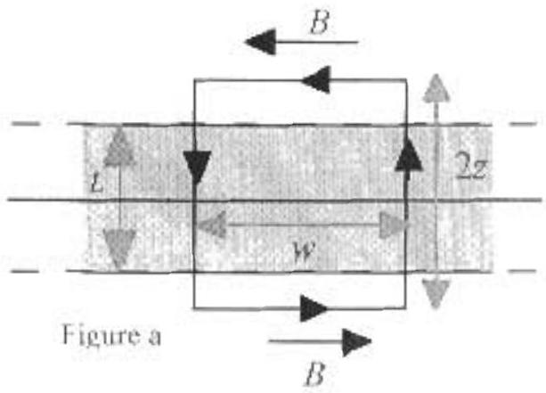
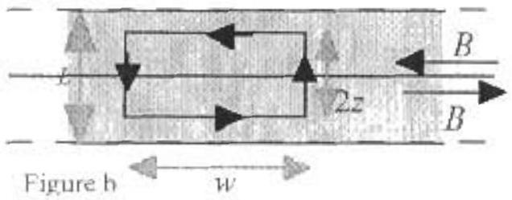

A3. a. The slab has infinite extent in the $x$ and $y$ direction. Therefore the magnetic field $\vec { B }$ can depend at most on 2. By the right hand rule and symmetry $\vec { B }$ is to the left for positive $z$ and to the right for negative $z$.

$$
\begin{array} { l l }
\vec { B } = - B ( z ) \hat { j } & z > 0 \\
\vec { B } = + B ( z ) \hat { j } & z < 0
\end{array}
$$

$\vec { B }$ can be found from Ampere's law. To find $\vec { B }$ outside the slab, $z > L / 2$, use the loop shown in Figure a. The loop segments parallel to the $z$ direction are perpendicular to $\vec { B }$ and will not contribute.

$$
\begin{array} { l l }
\oint \vec { B } \cdot \overrightarrow { d l } & = \mu _ { 0 } I _ { e x } \\
B w + B w & = \mu _ { 0 } ( I . w / ) \\
B = \frac { 1 } { 2 } \mu _ { 0 } L J & \text { for } | z | > L / 2 .
\end{array}
$$

To find $\dot { B }$ inside the slab, $z < L / 2$, use the loop shown in Figure b. Once again, the loop segments parallel to the $z$ direction are perpendicular to $\vec { B }$ and will not contribute.

$$
\begin{array} { l l }
\oint \dot { B } \cdot d l = \mu _ { 0 } l _ { \text {ovs } } & \\
B w + B w - \mu _ { 0 } ( 2 z w . J ) & \text { for } | z | < L / 2 . \\
B = \mu _ { 0 } J z &
\end{array}
$$

Including the direction,

$$
\begin{array} { l l }
\vec { B } = \frac { 1 } { 2 } \mu _ { 0 } J l \hat { j } & - L / 2 > z , \\
\vec { B } = - \mu _ { 0 } J z \hat { j } & + L / 2 > z > - 1.12 , \\
\vec { B } = - \frac { 1 } { 2 } \mu _ { 0 } J L \hat { j } & z > L / 2
\end{array}
$$

b. In the region of the loop, $\vec { B }$ is uniform, $\vec { B } = - \frac { 1 } { 2 } u _ { o } \mu \hat { j }$. The force on the top segment is equal and opposite to the force on the bottom segment. The force on the left segment it equal and opposite to the force on the right segment. The net force on the loop is zero.

$$
\begin{aligned}
\vec { F } _ { n e i } & = 0 . \\
\vec { \tau } _ { n e l } & = \vec { \mu } \times \vec { B } \\
\vec { \mu } - L A \hat { n } & = I a ^ { 2 } ( \cos \theta \hat { i } + \sin \theta \hat { j } ) .
\end{aligned}
$$

$$
\begin{aligned}
& \vec { \tau } _ { n e t } = I a ^ { 2 } ( \cos \theta \hat { i } + \sin \theta \hat { i } ) \times \left( - \frac { 1 } { 2 } \mu _ { o } J L \hat { j } \right) \\
& \vec { \tau } _ { n e i } = - \frac { 1 } { 2 } \mu _ { o } J L I a ^ { 2 } ( \cos \theta \hat { i } \times \hat { j } + \sin \theta \hat { j } \times \hat { j } ) \\
& \vec { \tau } _ { n e z } = - \frac { 1 } { 2 } \mu _ { o } J L I a ^ { 2 } \cos \theta \hat { k }
\end{aligned}
$$

c. $\vec { B }$ is uniform so the flux through the loop is

$$
\begin{gathered}
\Phi = \vec { B } \cdot A \hat { n } = - \frac { 1 } { 2 } \mu _ { a } J t \hat { j } \cdot a ^ { 2 } ( \cos \theta \hat { i } + \sin \theta \hat { j } ) \\
\Phi = - \frac { 1 } { 2 } \mu _ { D } J L a ^ { 2 } \sin \theta
\end{gathered}
$$

Using Faraday's Law, the emf

$$
\varepsilon = - \frac { \Delta \Phi } { \Delta t } = \frac { 1 } { 2 } \mu _ { v } L a ^ { 2 } \sin \theta \frac { \Delta t } { \Delta t } .
$$

The emf is also

$$
\varepsilon = I R = \frac { \Delta Q } { \Delta t } R
$$

where

$$
R - ( 4 a ) S .
$$

$$
\frac { \Delta Q } { \Delta t } = \frac { 1 } { 2 R } \mu _ { 0 } L a ^ { 2 } \sin \theta \frac { \Delta t } { \Delta t } = \frac { 1 } { 8 a S } \mu _ { i } L a ^ { 2 } \sin \theta \frac { \Delta t } { \Delta t } .
$$

Since $J$ has been reduced to zero over time $T$, the charge $Q$ flowing in time $T$ is

$$
Q = \frac { \mu _ { 0 } a L J } { 8 S } \sin \theta
$$
