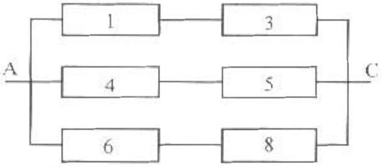
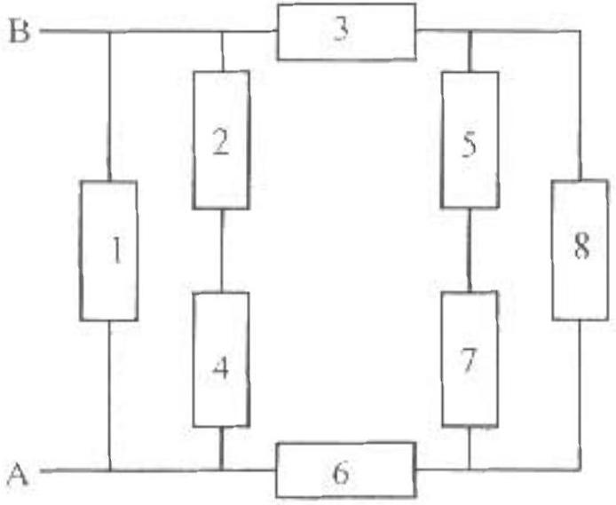

| AAPT | UNITED STATES PHYSICS TEAM |
| :--- | :--- |
| AIP | 2003 |

2003 Semi-Final Exam
Part A - Solutions

A1. a. Setting the mass times centripetal acceleration equal to the gravitational force
Solving for speed

$$
\begin{gathered}
m \frac { v ^ { 2 } } { r } = G \frac { M m } { r ^ { 2 } } \\
v = \sqrt { \frac { G M } { r } } ,
\end{gathered}
$$

and multiplying by mass to get the momentum

$$
p = m v = m \sqrt { \frac { G M } { r } }
$$

b. To escape from the star the total energy must be at least zero. Writing the escape speed $v _ { e }$.

$$
\frac { 1 } { 2 } m c _ { c } ^ { 2 } - G \frac { M m } { r } - 0 .
$$

Solving for $v _ { \mathrm { c } }$, and multiplying by mass to get the needed momentum,

$$
p _ { e } = m v _ { e } = m \sqrt { \frac { 2 G M } { r } } = \sqrt { 2 } p .
$$

This is greater than p above, so the impulse must be in the direction of $\vec { p }$.

$$
\vec { I } _ { e } = \vec { p } _ { 1 } - \vec { p } = ( \sqrt { 2 } - 1 ) \vec { p }
$$

c. Since angular momentum $L = m v r$ must be conserved, the only way to crash into a star with $R = 0$ is with $L = 0$. The satellite's momentum $m v _ { C 0 }$ must be slowed to zero.

$$
\vec { l } _ { C 0 } = m \vec { v } _ { C 0 } - \dot { p } = 0 - \vec { p } = - \vec { p } .
$$

d. Letting $v _ { 1 }$ be the new speed at orbital radius $r$ and $v _ { \mathrm { R } }$ be the speed at stellar radius $R$, angular momentum conservation yields

$$
m v _ { r } r = m v _ { n } R .
$$

Solving for $\mathrm { v } _ { \mathrm { R } }$

$$
\begin{equation*}
v _ { R } = v , \frac { r } { R } . \tag{Al•I}
\end{equation*}
$$

Mechanical energy is also conserved.

$$
\frac { 1 } { 2 } m v _ { 1 } ^ { 2 } - G \frac { M m } { r } = \frac { 1 } { 2 } m v _ { R } ^ { 2 } - G \frac { M m } { R }
$$

Regrouping terms and canceling $m$,

$$
G \frac { M } { R } - G \frac { M } { r } = \frac { 1 } { 2 } v _ { R } { } ^ { 2 } - \frac { 1 } { 2 } v _ { r } { } ^ { 2 }
$$

Substituting (A1-1)

$$
\begin{aligned}
& 2 G M \left( \frac { 1 } { R } - \frac { 1 } { r } \right) = v _ { 1 } ^ { 2 } \left( \frac { r } { R } \right) ^ { 2 } - v _ { 2 } ^ { 2 } \\
& \frac { 2 G M } { r R } ( r - R ) = \frac { v _ { 2 } ^ { 2 } } { R ^ { 2 } } \left( r ^ { 2 } - R ^ { 2 } \right)
\end{aligned}
$$

Multiplying by $R$ and dividing by ( $r - R$ )

$$
\frac { 2 G M } { r } = \frac { v _ { r } ^ { 2 } } { R } ( r + R )
$$

Solving for $v _ { \mathrm { r } }$ and multiplying by mass to get $p _ { \mathrm { r } }$.

$$
p _ { r } = m v _ { r } = m \sqrt { \frac { 2 G M R } { r ( r + R ) } } - m \sqrt { \frac { G M } { r } } \sqrt { \frac { 2 } { 1 - \frac { r } { R } } } = p \sqrt { \frac { 2 } { 1 + \frac { r } { R } } }
$$

This is less than the original orbital momentum. Fioding the impulse,

$$
\vec { I } _ { C S } = \vec { p } _ { r } - \vec { p } = \vec { p } _ { \sqrt { } } \sqrt { \frac { 2 } { 1 + r / R } } - \vec { p } = - \vec { p } \left( 1 - \sqrt { \frac { 2 } { 1 + r / R } } \right)
$$

A2. a. By symmetry the current through resistor I and 3 is the same. No current branches off through resistor 2. Similarly no current flows through resistor 7. The circuit reduces to that shown to the right. Each branch has two resistors in series for a total series resistance of

$$
R _ { t } = 2 R .
$$

The three branches are in parallel, so the equivalent resistance is

$$
\frac { 1 } { R _ { t q } } = \frac { 1 } { 2 R } + \frac { 1 } { 2 R } + \frac { 1 } { 2 R } = \frac { 3 } { 2 R }
$$

Therefore

$$
R _ { r q } = \frac { 2 } { 3 } R
$$

b. By symmetry the current through resistor 2 and 4 is the same. The current through resistor 5 is the same as that through resistor 7. The circuit reduces to that shown below. The series combination 5 and 7 has resistance

$$
R _ { 57 } = 2 R .
$$

This combination is in parallel with 8.

$$
\frac { 1 } { R _ { 35 ; } } = \frac { 1 } { R } + \frac { 1 } { 2 R } = \frac { 3 } { 2 R } .
$$

This combination is in series with 3 and 6.

$$
R _ { 368573 } = R + R + \frac { 2 } { 3 } R = \frac { 3 } { 3 } R
$$

This combination is in parallel with the two other branches.

$$
\begin{gathered}
\frac { 1 } { R _ { e q } } = \frac { 1 } { R } + \frac { 1 } { 2 R } + \frac { 3 } { 8 R } = \frac { 15 } { 8 R } \\
R _ { e q } = \frac { 8 } { 15 } R
\end{gathered}
$$

A3. a. The slab has infinite extent in the $x$ and $y$ direction. Therefore the magnetic field $\vec { B }$ can depend at most on 2. By the right hand rule and symmetry $\vec { B }$ is to the left for positive $z$ and to the right for negative $z$.

$$
\begin{array} { l l }
\vec { B } = - B ( z ) \hat { j } & z > 0 \\
\vec { B } = + B ( z ) \hat { j } & z < 0
\end{array}
$$

$\vec { B }$ can be found from Ampere's law. To find $\vec { B }$ outside the slab, $z > L / 2$, use the loop shown in Figure a. The loop segments parallel to the $z$ direction are perpendicular to $\vec { B }$ and will not contribute.

$$
\begin{array} { l l }
\oint \vec { B } \cdot \overrightarrow { d l } & = \mu _ { 0 } I _ { e x } \\
B w + B w & = \mu _ { 0 } ( I . w / ) \\
B = \frac { 1 } { 2 } \mu _ { 0 } L J & \text { for } | z | > L / 2 .
\end{array}
$$

To find $\dot { B }$ inside the slab, $z < L / 2$, use the loop shown in Figure b. Once again, the loop segments parallel to the $z$ direction are perpendicular to $\vec { B }$ and will not contribute.

$$
\begin{array} { l l }
\oint \dot { B } \cdot d l = \mu _ { 0 } l _ { \text {ovs } } & \\
B w + B w - \mu _ { 0 } ( 2 z w . J ) & \text { for } | z | < L / 2 . \\
B = \mu _ { 0 } J z &
\end{array}
$$

Including the direction,

$$
\begin{array} { l l }
\vec { B } = \frac { 1 } { 2 } \mu _ { 0 } J l \hat { j } & - L / 2 > z , \\
\vec { B } = - \mu _ { 0 } J z \hat { j } & + L / 2 > z > - 1.12 , \\
\vec { B } = - \frac { 1 } { 2 } \mu _ { 0 } J L \hat { j } & z > L / 2
\end{array}
$$

b. In the region of the loop, $\vec { B }$ is uniform, $\vec { B } = - \frac { 1 } { 2 } u _ { o } \mu \hat { j }$. The force on the top segment is equal and opposite to the force on the bottom segment. The force on the left segment it equal and opposite to the force on the right segment. The net force on the loop is zero.

$$
\begin{aligned}
\vec { F } _ { n e i } & = 0 . \\
\vec { \tau } _ { n e l } & = \vec { \mu } \times \vec { B } \\
\vec { \mu } - L A \hat { n } & = I a ^ { 2 } ( \cos \theta \hat { i } + \sin \theta \hat { j } ) .
\end{aligned}
$$

$$
\begin{aligned}
& \vec { \tau } _ { n e t } = I a ^ { 2 } ( \cos \theta \hat { i } + \sin \theta \hat { i } ) \times \left( - \frac { 1 } { 2 } \mu _ { o } J L \hat { j } \right) \\
& \vec { \tau } _ { n e i } = - \frac { 1 } { 2 } \mu _ { o } J L I a ^ { 2 } ( \cos \theta \hat { i } \times \hat { j } + \sin \theta \hat { j } \times \hat { j } ) \\
& \vec { \tau } _ { n e z } = - \frac { 1 } { 2 } \mu _ { o } J L I a ^ { 2 } \cos \theta \hat { k }
\end{aligned}
$$

c. $\vec { B }$ is uniform so the flux through the loop is

$$
\begin{gathered}
\Phi = \vec { B } \cdot A \hat { n } = - \frac { 1 } { 2 } \mu _ { a } J t \hat { j } \cdot a ^ { 2 } ( \cos \theta \hat { i } + \sin \theta \hat { j } ) \\
\Phi = - \frac { 1 } { 2 } \mu _ { D } J L a ^ { 2 } \sin \theta
\end{gathered}
$$

Using Faraday's Law, the emf

$$
\varepsilon = - \frac { \Delta \Phi } { \Delta t } = \frac { 1 } { 2 } \mu _ { v } L a ^ { 2 } \sin \theta \frac { \Delta t } { \Delta t } .
$$

The emf is also

$$
\varepsilon = I R = \frac { \Delta Q } { \Delta t } R
$$

where

$$
R - ( 4 a ) S .
$$

$$
\frac { \Delta Q } { \Delta t } = \frac { 1 } { 2 R } \mu _ { 0 } L a ^ { 2 } \sin \theta \frac { \Delta t } { \Delta t } = \frac { 1 } { 8 a S } \mu _ { i } L a ^ { 2 } \sin \theta \frac { \Delta t } { \Delta t } .
$$

Since $J$ has been reduced to zero over time $T$, the charge $Q$ flowing in time $T$ is

$$
Q = \frac { \mu _ { 0 } a L J } { 8 S } \sin \theta
$$

A4. a. Process $1 \rightarrow 2$ takes place at constant pressure. The work done is

$$
W _ { 1 \rightarrow 2 } = p \Delta V .
$$

For a constant pressure process, the ideal gas law yields

$$
p \Delta V = n R \Delta T
$$

and

$$
W _ { \mapsto 2 } = n R \Delta T = ( 0.10 \mathrm {~mol} ) ( 8.31 \mathrm {~J} / \mathrm { mol } \cdot \mathrm {~K} ) ( 400 \mathrm {~K} - 300 \mathrm {~K} ) = + 83.1 \mathrm {~J} .
$$

Process $2 \rightarrow 3$ is adiabatic, $Q = 0$. Combining this with the first law of thermodynamics,

$$
Q = W + \Delta U .
$$

The work done is the negative of the change in internal energy.

$$
W _ { 2 \rightarrow 3 } = - \Delta U = - n C _ { v } \Delta T = - n C _ { v } \left( T _ { 3 } - T _ { 2 } \right) .
$$

Since process $3 \rightarrow 1$ is isothermal.

$$
T _ { 1 } = T _ { 1 } = 300 \mathrm {~K} .
$$

And

$$
W _ { 2 \rightarrow 3 } = - ( 0.10 \mathrm {~mol} ) ( 335 \mathrm {~J} / \mathrm { mol } \cdot \mathrm {~K} ) ( 300 \mathrm {~K} - 400 \mathrm {~K} ) = + 335 \mathrm {~J} .
$$

For the isothermal process $3 \rightarrow \mathbf { 1 }$, the work done is

$$
W _ { 3.1 } = n R T \ln \left( \frac { V _ { 1 } } { V _ { 3 } } \right)
$$

Since $2 \rightarrow 3$ is adiabatic,

$$
p _ { 2 } V _ { 2 } ^ { \gamma } = p _ { 3 } V _ { 3 } ^ { \gamma }
$$

with $\gamma = \frac { C _ { p } } { C _ { v } } = \frac { 41.9 } { 33.5 } = \frac { 5 } { 4 }$. Combining this with the ideal gas law $p V = n R T$,

$$
n R T _ { 2 } V _ { 2 } ^ { \gamma - 1 } = n R T _ { 1 } V _ { 2 } ^ { \gamma - 1 } .
$$

Solving for $V _ { 3 }$,
Solving for $V _ { 3 }$,

$$
V _ { 1 } ^ { r - 1 } = \left( \frac { T _ { 2 } } { T _ { 3 } } \right) V _ { 2 } ^ { r - 1 }
$$

$$
V _ { 3 } = \left( \frac { T _ { 2 } } { T _ { 2 } } \right) ^ { 14 ( r - 1 ) } \quad V _ { 2 } = \left( \frac { T _ { 2 } } { T _ { 3 } } \right) ^ { 4 } V _ { i } = \left( \frac { 400 } { 300 } \right) ^ { 4 } \left( 0.0157 \mathrm {~m} ^ { 3 } \right) = 0.0496 \mathrm {~m} ^ { 3 }
$$

Finally,

$$
W _ { 3 \rightarrow 1 } = ( 0.10 \mathrm {~mol} ) ( 8.31 \mathrm {~J} / \mathrm { mol } \cdot \mathrm {~K} ) ( 300 \mathrm {~K} ) \ln \left( \frac { 0.0118 } { 0.0496 } \right) = - 358 \mathrm {~J} .
$$

b. The efficiency is the total work done divided by the heat input. Heat is input during process $1 \rightarrow 2$ and leaves during $3 \rightarrow 1$.

$$
\begin{gathered}
Q _ { i n } = Q _ { 1 \rightarrow 2 } = n C _ { p } \Delta T = ( 0.10 \mathrm {~mol} ) ( 41.9 \mathrm {~J} / \mathrm { mol } \cdot \mathrm {~K} ) ( 100 \mathrm {~K} ) = + 419 \mathrm {~J} \\
W _ { n e t } = W _ { 1 \rightarrow 2 } + W _ { 2 \rightarrow 1 } + W _ { 1 \rightarrow 1 } - 83 \mathrm {~J} + 335 \mathrm {~J} - 358 \mathrm {~J} = 60 \mathrm {~J} \\
e = \frac { 60 } { 419 } = 0.14
\end{gathered}
$$

| AAPT | UNITED STATES PHYSICS TEAM |
| :--- | :--- |
| AIP | 2003 |

## 2003 Semi-Final Exam Part B-Solutions

B1. a. Squaring the relativistic expressions for $E$ and $p$,

$$
E ^ { 2 } = \frac { m ^ { 2 } c ^ { 4 } } { 1 - ( v / c ) ^ { 2 } } \quad p ^ { 2 } = \frac { m ^ { 2 } v ^ { 2 } } { 1 - ( v / c ) ^ { 2 } }
$$

Multiplying the $p ^ { 2 }$ equation by $c ^ { 2 }$ and subtracting from $E ^ { 2 }$

$$
\begin{gathered}
E ^ { 2 } - c ^ { 2 } p ^ { 2 } = \frac { m ^ { 2 } c ^ { 4 } } { 1 - ( v / c ) ^ { 2 } } - \frac { m ^ { 2 } v ^ { 2 } c ^ { 2 } } { 1 - ( v / c ) ^ { 2 } } = \frac { m ^ { 2 } c ^ { 4 } \left( 1 - ( v / c ) ^ { 2 } \right) } { 1 - ( v / c ) ^ { 2 } } = m ^ { 2 } c ^ { 4 } \\
E ^ { 2 } = ( c p ) ^ { 2 } + \left( m c ^ { 2 } \right) ^ { 2 }
\end{gathered}
$$

b. Since A is at rest, $E _ { A } = m _ { A } c ^ { 2 } = 1000 \mathrm { MeV }$ and $p _ { A } = 0$;
and

$$
c p _ { B } = \sqrt { E _ { B } ^ { 2 } - m _ { B } ^ { 2 } c ^ { 4 } } = \sqrt { ( 700 \mathrm { MeV } ) ^ { 2 } - ( 500 \mathrm { MeV } ) ^ { 2 } } = 490 \mathrm { MeV } .
$$

By conservation of energy and momentum,

$$
\begin{aligned}
& E _ { C ^ { * } } = E _ { A } + E _ { B } = 1000 \mathrm { McV } + 700 \mathrm { MeV } = 1700 \mathrm { MeV } \\
& c p _ { C ^ { * } } = c p _ { A } + c p _ { B } = 0 + 490 \mathrm { MeV } = 490 \mathrm { MeV }
\end{aligned}
$$

Thus

$$
m _ { C * C } { } ^ { 2 } = \sqrt { E _ { C ^ { * } } { } ^ { 2 } - \left( c p _ { C ^ { * } } \right) ^ { 2 } } = \sqrt { ( 1700 \mathrm { MeV } ) ^ { 2 } - ( 490 \mathrm { MeV } ) ^ { 2 } } = 1628 \mathrm { MeV }
$$

c. Again, using conservation of energy and momentum,

$$
\begin{aligned}
& E _ { C } + E _ { Y } = R _ { C } \\
& c p _ { C } + c p _ { Y } = c p _ { C ^ { + } }
\end{aligned}
$$

Since the gamma is massless, $E _ { \gamma } { } ^ { 2 } = \left( c p _ { \gamma } \right) ^ { 2 }$. It is emitted along the direction of travel of C*, so we select the positive root, $c p _ { \gamma } = E _ { \gamma }$. Thus, rearranging.

$$
\begin{aligned}
& E _ { C } = E _ { C ^ { * } } - E _ { \gamma } \\
& c p _ { C } = c p _ { C ^ { * } } - k _ { \gamma }
\end{aligned}
$$

We need a fourth relationship,

$$
E _ { C } ^ { 2 } - \left( c p _ { C } \right) ^ { 2 } = \left( m _ { C } c ^ { 2 } \right) ^ { 2 } .
$$

$$
\begin{gathered}
\left( E _ { C ^ { * } } - E _ { \gamma } \right) ^ { 2 } - \left( c p _ { C ^ { * } } - E _ { \gamma } \right) ^ { 2 } = \left( m _ { C } c ^ { 2 } \right) ^ { 2 } \\
E _ { C } * ^ { 2 } - 2 E _ { C } * E _ { \gamma } + E _ { \gamma } ^ { 2 } - \left( c p _ { C } * \right) ^ { 2 } + 2 c p _ { C } * E _ { \gamma } - E _ { \gamma } ^ { 2 } = \left( m _ { C } c ^ { 2 } \right) ^ { 2 } \\
E _ { C } { } ^ { 2 } - \left( c p _ { C } * \right) ^ { 2 } + 2 c p _ { C } * E _ { \gamma } - 2 E _ { C } * E _ { \gamma } = \left( m _ { C } c ^ { 2 } \right) ^ { 2 }
\end{gathered}
$$

Since

$$
E _ { C _ { 0 } } { } ^ { 2 } - \left( c p _ { C \cdot } \right) ^ { 2 } = \left( m _ { C \cdot } c ^ { 2 } \right) ^ { 2 } ,
$$

the prior equation becomes, $\quad \left( m _ { C } . c ^ { 2 } \right) ^ { 2 } - 2 E _ { \gamma } \left( E _ { C \cdot } - c p _ { c ^ { \cdot } } \right) = \left( m _ { C } c ^ { 2 } \right) ^ { 2 }$

$$
E _ { r } = \frac { \left( m _ { c ^ { * } \cdot c ^ { 2 } } \right) ^ { 2 } - \left( m _ { c } c ^ { 2 } \right) ^ { 2 } } { 2 \left( E _ { c ^ { * } } - c p _ { c ^ { * } } \right) } = \frac { ( 1628 \mathrm { MeV } ) ^ { 2 } - ( 1300 \mathrm { MeV } ) ^ { 2 } } { 2 ( 1700 \mathrm { MeV } - 490 \mathrm { MeV } ) } = 397 \mathrm { MeV }
$$

d. Let the gamma be emitted at an angle $\theta _ { r }$ to the axis, and C at an angle $\theta _ { C }$. We measure the two angles on opposite sides of the axis so that both are in the interval $[ 0 , \pi ]$.
From conservation of energy,
thus

$$
\begin{gathered}
E _ { C } - E _ { C * } - E _ { \gamma } = 1700 \mathrm { MeV } - 300 \mathrm { MeV } = 1400 \mathrm { MeV } : \\
c p _ { C } = \sqrt { k _ { C } ^ { 2 } - \left( m _ { C } c ^ { 2 } \right) ^ { 2 } } = \sqrt { ( 1400 \mathrm { MeV } ) ^ { 2 } } - ( 1300 \mathrm { MeV } ) ^ { 2 } \\
= 520 \mathrm { MeV }
\end{gathered}
$$

And again.

$$
c p _ { \gamma } = E _ { \gamma } = 300 \mathrm { MeV } .
$$

Then from conservation of momentum,

$$
p _ { \gamma } \sin \theta _ { \gamma } - p _ { C } \sin \theta _ { E } = 0
$$

$$
p _ { I } \cos \theta _ { Y } + p _ { C } \cos \theta _ { C } = p _ { C } .
$$

Rearranging,

$$
\begin{gathered}
\left( p _ { C } \sin \theta _ { C } \right) ^ { 2 } + \left( p _ { C } \cos \theta _ { C } \right) ^ { 2 } = \left( p _ { \gamma } \sin \theta _ { \gamma } \right) ^ { 2 } + \left( p _ { C ^ { * } } - p _ { \gamma } \cos \theta _ { \gamma } \right) ^ { 2 } \\
p _ { C } { } ^ { 2 } = p _ { C } { } ^ { 2 } + p _ { \gamma } { } ^ { 2 } - 2 p _ { C } * p _ { \gamma } \cos \theta _ { \gamma } \\
\cos \theta _ { \gamma } = \frac { p _ { C } { } ^ { 2 } + p _ { \gamma } { } ^ { 2 } - p _ { C } { } ^ { 2 } } { 2 p _ { C } \cdot p _ { \gamma } } = \frac { ( 490 \mathrm { MeV } / \mathrm { c } ) ^ { 2 } + ( 300 \mathrm { MeV } / \mathrm { c } ) ^ { 2 } - ( 520 \mathrm { MeV } / \mathrm { c } ) ^ { 2 } } { 2 ( 490 \mathrm { MeV } / \mathrm { c } ) ( 300 \mathrm { MeV } / \mathrm { c } ) } = 0.204 \\
\theta _ { \gamma } = \cos ^ { - 1 } 0.204 = 1.365 \mathrm { rad }
\end{gathered}
$$

Then,

$$
\sin \theta _ { C } = \frac { p _ { \gamma } } { p _ { C } } \sin \theta _ { \gamma } = \frac { 300 \mathrm { MeV } / \mathrm { c } } { 520 \mathrm { MeV } / \mathrm { c } } \sin 1.365 = 0.565
$$

Thus,

$$
\theta _ { C } = 0.601 \mathrm { rad } .
$$

B2. a. The field is spherically symmetric and radially oriented. Applying Gauss's Law to a sphere of radius $r$.

$$
\begin{gathered}
\oint \overrightarrow { \mathrm { E } } \cdot d \overrightarrow { \mathrm {~S} } = \frac { q _ { e r a i } } { \varepsilon _ { 0 } } \\
4 \pi r ^ { 2 } E ( r ) - \frac { \frac { 4 } { 3 } \pi r ^ { 3 } \rho } { \varepsilon _ { 0 } }
\end{gathered}
$$

Therefore

$$
\vec { E } ( r ) = \frac { \rho } { 3 \varepsilon _ { 0 } } \vec { r }
$$

b. Consider the small amount of fluid before it is replaced by the ball. It is in equilibrium. The electrostatic force $\vec { F } _ { E }$ on the small amount of fluid due to the field is balanced by a force exerted by the rest of the fluid which we shall call an electrostatic buoyant force $\vec { F } _ { B }$.

$$
\begin{gathered}
\vec { F } _ { B } + \vec { F } _ { E } = 0 \\
\vec { F } _ { B } = - \vec { F } _ { E } = - q \vec { E } - - ( \rho V ) \left( \frac { \rho } { 3 \varepsilon _ { 0 } } \vec { r } \right) = - \frac { \rho ^ { 2 } V } { 3 \varepsilon _ { 0 } } \vec { r }
\end{gathered}
$$

where $V$ is the volume. When the fluid is replaced by the ball, there is no longer an electrostatic force on it and the buoyant force $\vec { F } _ { B }$ is unbalanced and the net force acting on the ball. Using Newton's second law with $m = \delta V$,

$$
\begin{align*}
\delta V \vec { a } & = - \frac { \rho ^ { 2 } V } { 3 \varepsilon _ { 0 } } \vec { r } \\
\vec { a } & = - \frac { \rho ^ { 2 } } { 3 \varepsilon _ { 0 } \delta } \vec { r } . \tag{B2-1}
\end{align*}
$$

The motion is simple harmonic motion. Fxamining the initial conditions, the motion is onedimensional in the $x$ direction. $\vec { r } ( t ) = x ( t ) \hat { i }$.

$$
\begin{aligned}
a _ { x } = & - \left( \frac { \rho ^ { 2 } } { 3 \varepsilon _ { 0 } \delta } \right) x . \\
& \text { where } \quad \omega = \frac { \rho } { \sqrt { 3 \varepsilon _ { 0 } \delta } } ,
\end{aligned}
$$

and

$$
\vec { r } ( t ) = x _ { c } \hat { i } \cos \theta t ,
$$

c. Now the net force is

$$
\vec { F } = - \frac { p ^ { i } } { 3 \varepsilon _ { 0 } } \sqrt { r } + m g \hat { i }
$$

Since the ball is once again released from rest at $\vec { r } _ { 0 } = x _ { 0 } \hat { i }$, the motion is once again one-dimensional in the $x$ direction. $\vec { r } ( t ) = x ( t ) \hat { i }$ and

$$
m a _ { A } = - \frac { \rho ^ { 2 } } { 3 \varepsilon _ { 0 } } \left( \frac { m } { \delta } \right) x + m g = - m \omega ^ { 2 } \left( x - \frac { g } { \omega ^ { 2 } } \right)
$$

Letting $x ^ { \prime } = x - \frac { g } { \omega ^ { 2 } }$, and noting that $a _ { f } = a _ { 1 }$.

$$
a _ { c ^ { \prime } } = m \theta ^ { 2 } x ^ { \prime }
$$

i.e., $x ^ { \prime }$ undergoes simple harmonic motion with the same frequency. Again, examining the initial conditions, we must have

$$
x ^ { \prime } ( t ) = x ^ { \prime } ( 0 ) \cos \omega t = \left( x _ { 0 } - \frac { g } { \omega ^ { 2 } } \right) \cos \omega t
$$

ie.

$$
\begin{gathered}
x ( t ) = \left( x _ { 0 } - \frac { g } { \omega ^ { 2 } } \right) \cos \omega t + \frac { g } { \omega ^ { 2 } } \\
\vec { r } ( t ) = \left[ \left( x _ { 0 } - \frac { g } { \omega ^ { 2 } } \right) \cos \omega t + \frac { g } { \omega ^ { 2 } } \hat { i } \right.
\end{gathered}
$$

d. (j) Returning to equation (B2-1) $\quad \vec { a } = - \frac { \rho ^ { 2 } } { 3 \varepsilon _ { 0 } \dot { \theta } } \vec { r } = - \omega ^ { 2 } \vec { r } \quad$ where $\omega = \frac { \rho } { \sqrt { 3 \varepsilon _ { 0 } \delta } }$
Writing

$$
\vec { r } ( t ) = x ( t ) \hat { i } + y ( t ) \hat { j } + z ( t ) \hat { k }
$$

yields a separate simple harmonic motion equation for each component

$$
a _ { x } = - \omega ^ { 2 } x \quad a _ { y } = - \omega ^ { 2 } y \quad a _ { z } = - \omega ^ { 2 } z
$$

The direction of the ball's initial displacement is $\vec { r } _ { 0 } = x _ { 0 } \hat { i }$, and the direction of its initial velocity is $\vec { v } _ { u } = v _ { u } \hat { j }$. Examining these initial conditions, we must have

$$
x ( t ) = x _ { 0 } \cos \omega t \quad y ( t ) - \frac { \nu _ { 0 } } { \omega } \sin \omega t \quad z ( t ) = 0 .
$$

Eliminating $t$, we have

$$
\frac { x ( t ) ^ { 2 } } { x _ { 0 } ^ { 2 } } + \frac { \omega ^ { 2 } y ( t ) ^ { 2 } } { v _ { 0 } ^ { 2 } } = \cos ^ { 2 } \omega t + \sin ^ { 2 } t \omega t = 1 .
$$

Therefore the path is an ellipse.
(ii) The maximum radius reached by the ball is the semimajor axis of the ellipse, which is the greater of $x _ { 0 }$ and $\frac { v _ { 0 } } { ( D ) }$. Since we know that $x _ { 0 } < R$, we only need $\frac { v _ { 0 } } { \omega } < R$ for the ball to avoid the wall; that is, the ball can avoid the wall so long as $v _ { i n } < \omega R$.
(iii) Since $x , y$, and $z$ all oscillate at the same frequency, the orbit must be periodic with that frequency, i.e. with period $\frac { 2 \pi } { \omega } = 2 \pi \frac { \sqrt { 3 \varepsilon _ { 0 } \delta } } { \rho }$.
