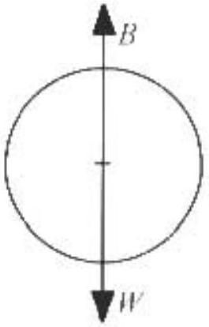

A2. First find the forces on the balloon. The weight force is

$$
W = m g = \rho _ { k } V g
$$

where $\rho _ { b } = 1.20 \mathrm {~kg} / \mathrm { m } ^ { 3 }$ is the density of the balloon. $V$ is its volume. and $g$ is the gravitational field strength. The buoyant force is

$$
B = \rho _ { n } V _ { g }
$$

where $\rho _ { a }$ is the density of air. Since it is assumed to be a linear function of height, $\rho _ { u } = \rho _ { 0 } - c d h$ where $\rho _ { \mathrm { b } } = 1.29 \mathrm {~kg} / \mathrm { m } ^ { 3 }$ is the density of air at sea level and $h$ is the height above sea level. The forces are in equilibrium at $h _ { 0 } = 1.00 \mathrm {~km} = 1.00 \times 10 ^ { \mathrm { i } } \mathrm { m }$.

$$
\begin{equation*}
\rho _ { b } V g = \rho _ { a } V g - \left( \rho _ { 0 } - \alpha h _ { 0 } \right) V g . \tag{A2-1}
\end{equation*}
$$

Solving this for $\alpha$,

$$
\alpha = \frac { \rho _ { 0 } \quad \rho _ { b } } { h _ { 0 } } = \frac { 1.29 \mathrm {~kg} / \mathrm { m } ^ { 3 } - 1.20 \mathrm {~kg} / \mathrm { m } ^ { 3 } } { 1000 \mathrm {~m} } = 9 \times 10 ^ { - 5 } \mathrm {~kg} / \mathrm { m } ^ { 4 }
$$

a. After being blown to a height of $h = 1.10 \mathrm {~km}$, the forces are no longer balanced.

$$
\begin{aligned}
& m a - B - W \\
\rho _ { k } V _ { a } = & \left( \rho _ { 11 } - \alpha h \right) V _ { g } - \rho _ { b } V _ { g } .
\end{aligned}
$$

Substituting (A2-1) into the above equation

$$
\rho _ { b } V a = \left( \rho _ { 0 } - \alpha h _ { t } \right) V g - \left( \rho _ { 0 } - \alpha h _ { 0 } \right) V g = - \alpha \left( h - h _ { 0 } \right) V g = - \alpha \Delta h V g .
$$

Solving for the acceleration $a$

$$
a = - \frac { \left( \frac { \alpha g } { \rho _ { 0 } } \right) } { \left( \rho _ { 0 } \right) } \Delta t
$$

The acceleration is proportional to the displacement. The motion is simple harmonic moun with

$$
\omega = \sqrt { \left( \frac { \alpha g } { \rho _ { b } } \right) } = \sqrt { \frac { \left( 9 \times 10 ^ { - 5 } \mathrm {~kg} / \mathrm { m } ^ { 4 } \right) \left( 9.8 \mathrm {~m} / \mathrm { s } ^ { 2 } \right) } { 1.20 \mathrm {~kg} / \mathrm { m } ^ { 3 } } } = 0.0271 \mathrm { rad } / \mathrm { s } .
$$

The balloon is released at rest at amplitude $A = h - h _ { 0 } = 100 \mathrm {~m}$ and first passes through its equilibrium position at a time equal to one fourth its pernod.

$$
t = \frac { T } { 4 } = \frac { 2 \pi } { 4 \omega } = \frac { \pi } { 2 ( 0.0271 \mathrm { rad } / \mathrm { s } ) } = 57.9 \mathrm {~s} .
$$

b. The balloon passes through its equilibrium position with maximum velocity

$$
v = \omega A = ( 0.0271 \mathrm { rad } / \mathrm { s } ) ( 100 \mathrm {~m} ) = 2.71 \mathrm {~m} / \mathrm { s } .
$$
