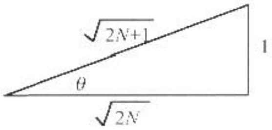

| AAPT | UNITED STATES PHYSICS TEAM |
| :--- | :--- |
| AIP | 2004 |

2004 Semi-Final Exam
Part A - Solutions
A1. a. At the instant the switch is closed, there is no charge on the capacitor and no voltage across it. Applying Kirchhoff's junction rule $I _ { 11 } = I _ { 20 } + I _ { 30 }$.
Applying Kirchhoff's loop rule to the right loop $\quad 0 = ( 20.0 \Omega ) / _ { 20 } - ( 30.0 \Omega ) t _ { 30 }$.
Solving for $t _ { 30 }$ and then $t _ { 10 } , \quad t _ { 20 } = 1.5 t _ { 30 } \quad t _ { 10 } = 1.5 t _ { 30 } + t _ { 30 } = 2.5 t _ { 30 }$
Applying Kirchhoff's loop rule to the left loop

$$
\begin{gathered}
0 = 6.00 \mathrm {~V} - ( 20.0 \Omega ) I _ { 30 } - ( 10.0 \Omega ) I _ { 10 } = 6.00 \mathrm {~V} - ( 20.0 \Omega ) \left( 1.5 I _ { 30 } \right) - ( 10.0 \Omega ) \left( 2.5 I _ { 30 } \right) \\
0 = 6.00 \mathrm {~V} - ( 30.0 \Omega ) I _ { 30 } - ( 25.0 \Omega ) I _ { 30 } = 6.00 \mathrm {~V} - ( 55.0 \Omega ) I _ { 30 }
\end{gathered}
$$

Solving for the currents

$$
l _ { 30 } = \frac { 6.00 \mathrm {~V} } { 550 \Omega } = 0.109 \mathrm {~A} . \quad l _ { 30 } = 1.5 ( 0.109 \mathrm {~A} ) = 0.164 \mathrm {~A}
$$

and

$$
I _ { 10 } = 2.5 ( 0.109 \mathrm {~A} ) = 0.273 \mathrm {~A}
$$

(A solution using parallel and series resistor combinations is equally valid.)
b. When the switch has been closed for a very long time, the capacitors are fully charged.
Current no longer flows in the capacitor branch and

$$
I _ { \text {un } } = 0
$$

Applying Kirchhoff's loop rule to the left loop

$$
\begin{gathered}
0 - 6.00 \mathrm {~V} - ( 20.0 \Omega ) I _ { 10 } - ( 10.0 \Omega ) I _ { 11 } = 6.00 \mathrm {~V} - ( 30.0 \Omega ) I _ { 10 } \\
I _ { 31 } = I _ { 10 } = \frac { 6.00 \mathrm {~V} } { 30.0 \Omega } = 0.200 \mathrm {~A}
\end{gathered}
$$

c. The two capacitors are in series. Both have the same charge. The equivalent capacitance is

$$
\frac { 1 } { C _ { m } } = \frac { 1 } { C _ { 2 } } + \frac { 1 } { C _ { 4 } } = \frac { 1 } { 2.00 \mu \mathrm {~F} } + \frac { 1 } { 4.00 \mu \mathrm {~F} } = \frac { 3 } { 4.00 \mu \mathrm {~F} }
$$

or
The voltage across the equivalent capacitance is the same as that across the $20.0 \Omega$ resistor.

$$
V _ { c } = V _ { 10 } = ( 20.0 \Omega ) I _ { 20 } = ( 20.0 \Omega ) ( 0.200 \mathrm {~A} ) = 4.00 \mathrm {~V} .
$$

So the charge

$$
Q _ { 2 } = Q _ { 4 } = Q _ { r q } = C _ { c q } V = ( 1.33 \mu \mathrm {~F} ) ( 4.00 \mathrm {~V} ) = 5.33 \mu \mathrm { C }
$$

A2. First find the forces on the balloon. The weight force is

$$
W = m g = \rho _ { k } V g
$$

where $\rho _ { b } = 1.20 \mathrm {~kg} / \mathrm { m } ^ { 3 }$ is the density of the balloon. $V$ is its volume. and $g$ is the gravitational field strength. The buoyant force is

$$
B = \rho _ { n } V _ { g }
$$

where $\rho _ { a }$ is the density of air. Since it is assumed to be a linear function of height, $\rho _ { u } = \rho _ { 0 } - c d h$ where $\rho _ { \mathrm { b } } = 1.29 \mathrm {~kg} / \mathrm { m } ^ { 3 }$ is the density of air at sea level and $h$ is the height above sea level. The forces are in equilibrium at $h _ { 0 } = 1.00 \mathrm {~km} = 1.00 \times 10 ^ { \mathrm { i } } \mathrm { m }$.

$$
\begin{equation*}
\rho _ { b } V g = \rho _ { a } V g - \left( \rho _ { 0 } - \alpha h _ { 0 } \right) V g . \tag{A2-1}
\end{equation*}
$$

Solving this for $\alpha$,

$$
\alpha = \frac { \rho _ { 0 } \quad \rho _ { b } } { h _ { 0 } } = \frac { 1.29 \mathrm {~kg} / \mathrm { m } ^ { 3 } - 1.20 \mathrm {~kg} / \mathrm { m } ^ { 3 } } { 1000 \mathrm {~m} } = 9 \times 10 ^ { - 5 } \mathrm {~kg} / \mathrm { m } ^ { 4 }
$$

a. After being blown to a height of $h = 1.10 \mathrm {~km}$, the forces are no longer balanced.

$$
\begin{aligned}
& m a - B - W \\
\rho _ { k } V _ { a } = & \left( \rho _ { 11 } - \alpha h \right) V _ { g } - \rho _ { b } V _ { g } .
\end{aligned}
$$

Substituting (A2-1) into the above equation

$$
\rho _ { b } V a = \left( \rho _ { 0 } - \alpha h _ { t } \right) V g - \left( \rho _ { 0 } - \alpha h _ { 0 } \right) V g = - \alpha \left( h - h _ { 0 } \right) V g = - \alpha \Delta h V g .
$$

Solving for the acceleration $a$

$$
a = - \frac { \left( \frac { \alpha g } { \rho _ { 0 } } \right) } { \left( \rho _ { 0 } \right) } \Delta t
$$

The acceleration is proportional to the displacement. The motion is simple harmonic moun with

$$
\omega = \sqrt { \left( \frac { \alpha g } { \rho _ { b } } \right) } = \sqrt { \frac { \left( 9 \times 10 ^ { - 5 } \mathrm {~kg} / \mathrm { m } ^ { 4 } \right) \left( 9.8 \mathrm {~m} / \mathrm { s } ^ { 2 } \right) } { 1.20 \mathrm {~kg} / \mathrm { m } ^ { 3 } } } = 0.0271 \mathrm { rad } / \mathrm { s } .
$$

The balloon is released at rest at amplitude $A = h - h _ { 0 } = 100 \mathrm {~m}$ and first passes through its equilibrium position at a time equal to one fourth its pernod.

$$
t = \frac { T } { 4 } = \frac { 2 \pi } { 4 \omega } = \frac { \pi } { 2 ( 0.0271 \mathrm { rad } / \mathrm { s } ) } = 57.9 \mathrm {~s} .
$$

b. The balloon passes through its equilibrium position with maximum velocity

$$
v = \omega A = ( 0.0271 \mathrm { rad } / \mathrm { s } ) ( 100 \mathrm {~m} ) = 2.71 \mathrm {~m} / \mathrm { s } .
$$

A3. a. In order for minimum sound intensity to be heard in the region along the $x$-axis with $x >$ $x _ { 0 }$. the distance between sources must be an odd half-integer multiple of the wavelength $\%$.

$$
2 x _ { n } = ( 2 n \quad 1 ) \frac { \lambda } { 2 } = ( 2 n - 1 ) \frac { n } { 2 f } \quad n = 1,2,3 , \ldots
$$

where $v = 340 \mathrm {~m} / \mathrm { s }$, the velocity of sound in air, and $175 \mathrm {~Hz} \leq f \leq 625 \mathrm {~Hz}$, the frequency of the sound that produces minimum intensity, Solving for the frequency

$$
f _ { n } = ( 2 n - 1 ) \frac { v ^ { \prime } } { 4 x _ { 0 } } = ( 2 n - 1 ) \frac { ( 340 \mathrm {~m} / \mathrm { s } ) } { 4 ( 0.85 \mathrm {~m} ) } - ( 2 n - 1 ) ( 100 \mathrm {~Hz} ) .
$$

The frequencies in the possible range are

$$
f _ { 2 } = 300 \mathrm {~Hz} \quad \text { and } \quad f _ { 1 } = 500 \mathrm {~Hz}
$$

b. In the region between the sources, source $S _ { 1 }$ emits a wave $\Psi _ { 1 }$ that travels to the left and source $S _ { 2 }$ emits a wave $\Psi _ { 2 } ^ { \prime }$ that travels to the right.

$$
\Psi _ { 1 } = A \sin \left( \omega t + k \left( x - x _ { 0 } \right) \right) \quad \Psi _ { 2 } - A \sin \left( \omega t - k \left( x + x _ { 0 } \right) \right)
$$

where

$$
k = \frac { 2 \pi } { \lambda } \quad \text { and } \quad \omega = 2 \pi f
$$

Adding the waves to determine the resultant wave

$$
\begin{gathered}
\Psi = \Psi _ { 1 } + \Psi _ { 2 } = A \sin \left( \omega t + k \left( x - x _ { 0 } \right) \right) + A \sin \left( \omega t - k \left( x + x _ { 0 } \right) \right) \\
\Psi = A \sin \left( \omega t - k x _ { 0 } \right) \cos ( k x ) + A \cos \left( \omega t - k x _ { 0 } \right) \sin ( k x ) \\
+ A \sin \left( \omega t - k x _ { 0 } \right) \cos ( k x ) - A \cos \left( \omega t - k x _ { 0 } \right) \sin ( k x ) \\
\Psi = 2 A \cos ( k x ) \sin \left( \omega t - k x _ { 0 } \right)
\end{gathered}
$$

Note: This equation has the correct $x$-dependence. The waves travel the same distance to reach $x = 0$. This point is an interference maximum. Any expression with

$$
\Psi = 2 A \cos ( k x ) \sin \left( \omega t - k x _ { 0 } + \delta \right)
$$

where $\delta$ is a phase constant is valid.
c. Minimum sound intensity occurs when $\cos ( k x ) = 0$, i.e., $k x = \pm ( 2 n + 1 ) \pi / 2$. Solving for $x$,

$$
x = + \frac { ( 2 n + 1 ) \pi } { 2 k } = + \frac { ( 2 n + 1 ) \pi } { 2 ( 2 \pi / \lambda ) } = + \frac { ( 2 n + 1 ) \lambda } { 4 } = + \frac { ( 2 n + 1 ) v } { 4 f }
$$

For $f = 300 \mathrm {~Hz}$ :

$$
x = \pm \frac { ( 2 n + 1 ) ( 340 \mathrm {~m} / \mathrm { s } ) } { 4 ( 300 \mathrm {~Hz} ) } = \pm ( 2 n + 1 ) ( 0.283 \mathrm {~m} ) = \pm 0.283 \mathrm {~m} \quad \text { with } n = 0 .
$$

For $f = 500 \mathrm {~Hz}$ :

$$
x = \pm \frac { ( 2 n + 1 ) ( 340 \mathrm {~m} / \mathrm { s } ) } { 4 ( 500 \mathrm {~Hz} ) } = \pm ( 2 n + 1 ) ( 0.170 \mathrm {~m} ) = \pm 0.170 \mathrm {~m} . \pm 0.510 \mathrm {~m}
$$

with $n = 0,1$.

A4. Selecting the $y$-axis perpendicular to the ramp and the $x$-axis parallel to the ramp in the upward direction, the components of the gravitational acceleration are

$$
a _ { 1 } = - g \sin \theta \quad \text { and } \quad a _ { 1 } = - g \cos \theta
$$

where $\theta$ is the angle the ramp makes with the horizontal. The components of the initial velocity are

$$
v _ { n + 1 } = v _ { 0 } \cos \theta \quad \text { and } \quad v _ { 0 , r } = - v _ { 11 } \sin \theta .
$$

a. At each collision with the plane, the $x$-component of velocity does not change while the $y$ component reverses sign. At the start of the first bounce

$$
v _ { 0 : } = + v _ { 0 } \sin \theta .
$$

The $y$-displacement is given by

$$
v = v _ { 0 } + v _ { 0 \mathrm { y } } l + \frac { 1 } { 2 } a _ { 0 } t ^ { 2 } \quad ( \mathrm {~A} 4 - 1 )
$$

Let $y _ { 11 } = 0$ at $t = 0$, the start of the first bounce. Let $t = t _ { 1 }$ - the time when the ball returns to the ramp $y = 0$, at the end of the first bounce. Substituting these values into (A4-1)

$$
0 = v _ { \mathrm { u } } \sin \theta t _ { 1 } - \frac { 1 } { 2 } g \cos \theta t _ { 1 } ^ { 2 } .
$$

Solving for $t _ { 1 }$ and eliminating the initial time $t _ { 1 } = 0$,

$$
t _ { 1 } = \frac { 2 v _ { 0 } \sin \theta } { g \cos \theta } = \frac { 2 v _ { 0 } } { g } \tan \theta .
$$

The velocity at the end of the first bounce, as the ball is about to impact the ramp again, is

$$
\begin{aligned}
& v _ { v } = v _ { 0 v } + a _ { v } t = v _ { 0 } \sin \theta - g \cos \theta t = v _ { 0 } \sin \theta - g \cos \theta \frac { 2 v _ { 0 } \sin \theta } { g \cos \theta } = - v _ { 0 } \sin \theta . \\
& \text { the ramp the velocity reverses to become } \quad v _ { 0 v } = + v _ { 0 v } \sin \theta .
\end{aligned}
$$

Each bounce has the same $v _ { 0 }$, and $a _ { 3 }$, so each bounce takes the same amount of time $t _ { 1 }$.
Therefore the time for $N$ bounces is

$$
\begin{equation*}
t _ { v } = N t = N \frac { 2 v _ { 0 } \sin \theta } { g \cos \theta } = \frac { 2 N v _ { v } } { g } \tan \theta . \tag{A4-2}
\end{equation*}
$$

There is no impulse in the $x$-direction, so the $x$-equations hold continuously. At the end of the N'th bounce, the ball's velocity is perpendicular to the ramp. $v _ { \mathrm { v } } = 0$. Substituting this into the equation for the $x$-component of velocity.

$$
\begin{gathered}
v _ { 1 } = v _ { 01 } + a _ { 1 } t \\
0 = v _ { 0 } \cos \theta - g \sin \theta t _ { N } = v _ { 0 } \cos \theta - g \sin \theta \left( N \frac { 2 v _ { 0 } \sin \theta } { g \cos \theta } \right) .
\end{gathered}
$$

Dividing by $v _ { 0 } \cos \theta$,

$$
0 = 1 - \frac { 2 N \sin ^ { 2 } \theta } { \cos ^ { 2 } \theta } - 1 - 2 N \tan ^ { 2 } \theta
$$

Solving for $\tan \theta$

$$
\begin{equation*}
\tan \theta = \frac { 1 } { \sqrt { 2 N } } \tag{A4-3}
\end{equation*}
$$

b. The $x$-displacement is given by $\quad x = v _ { i n } t + \frac { 1 } { 2 } a t ^ { 2 }$.
The maximum displacement occurs at the end of the Nith bounce, time $t _ { N }$. Combining (A4-2) and (A4-3)

$$
t _ { N } = \frac { 2 N v _ { 0 } } { g } \tan \theta = \frac { 2 N v _ { 11 } } { g } \frac { 1 } { \sqrt { 2 N } } = \frac { v _ { 11 } } { g } \sqrt { 2 N } .
$$

Substituting this into the $x$-equation.

$$
x = \left( v _ { c } \cos \theta \right) \left( \frac { v _ { n } } { g } \sqrt { 2 N } \right) + \frac { 1 } { 2 } ( - g \sin \theta ) \left( \frac { v _ { 0 } } { g } \sqrt { 2 N } \right) ^ { 2 } = \frac { v _ { 0 } ^ { 2 } } { g } \cos \theta \sqrt { 2 N } - \frac { v _ { n } ^ { 2 } } { 2 g } 2 N \sin \theta
$$

Using the triangle to the right to determine $\cos \theta$ and $\sin \theta$

$$
\begin{gathered}
\cos \theta = \sqrt { \frac { 2 N } { 2 n + 1 } } \quad \sin \theta = \frac { 1 } { \sqrt { 2 N - 1 } } \\
x = \frac { v _ { 10 } ^ { 2 } } { g } \sqrt { \frac { 2 N } { 2 N + 1 } } \sqrt { 2 N } - \frac { v _ { 0 } ^ { 2 } } { 2 g } 2 N \frac { 1 } { \sqrt { 2 N + 1 } } = \frac { v _ { 10 } ^ { 2 } } { g } \frac { N } { \sqrt { 2 N + 1 } }
\end{gathered}
$$

| AAPT | UNITED STATES PHYSICS TEAM |
| :--- | :--- |
| AIP | 2004 |

2004 Semi-Final Exam Part B - Solutions

B1. a. The electrostatic force causes the eentripetal acceleration that keeps the electron in its circular orbit around the proton. Since the proton is assumed to be very massive, reduced mass effects can be neglected.

$$
m \frac { v ^ { 2 } } { r } = k \frac { e ^ { 2 } } { r ^ { 2 } }
$$

where $m$ is the electron mass, $e$ is the electron charge, $v$ is its orbital velocity, $r$ is its orbital radius and $k$ is Coulomb's constant. Multiplying hy $r$ yields

$$
m v ^ { 2 } = k \frac { e ^ { 2 } } { r }
$$

The angular momentum of an object moving in a circle is $L = m v r$. $m v r = n h$

Solving this for $m v ^ { 2 }$

$$
\begin{aligned}
& m v ^ { 2 } = \frac { 1 } { m } \left( \frac { n \hbar } { r } \right) ^ { 2 } \\
& \frac { 1 } { m } \left( \frac { n \hbar } { r } \right) ^ { 2 } = k \frac { e ^ { 2 } } { r } \\
& \frac { 1 } { r } = \frac { m k e ^ { 2 } } { ( n \hbar ) ^ { 2 } }
\end{aligned}
$$

The total energy $E$ is the sum of the electron's kinetic and potential energy.

$$
E _ { n } = \frac { 1 } { 2 } m v ^ { 2 } - k \frac { e ^ { 2 } } { r } = - k \frac { e ^ { 2 } } { 2 r } = - \frac { m \left( k e ^ { 2 } \right) ^ { 2 } } { 2 ( n \hbar ) ^ { 2 } }
$$

Which is

$$
E _ { n } = - \frac { \left( 9.109 \times 10 ^ { - 11 } \right) \left[ \left( 8.99 \times 10 ^ { 2 } \right) \left( 1.602 \times 10 ^ { 12 } \right) ^ { 2 } \right] ^ { 2 } } { 2 n ^ { 2 } \left( 6.63 \times 10 ^ { - 14 } / ( 2 \pi ) \right) ^ { 2 } } = \frac { 2.18 \times 10 ^ { 18 } } { n ^ { 2 } } \mathrm {~J} .
$$

b. i. As the electrons are accelerated through the potential difference $V$, they gained kinetic energy eV. The hydrogen is initially in its ground state $E _ { 1 }$. After the collision the electron has kinetic energy $\frac { 1 } { 2 } m v _ { n } { } ^ { 2 }$ and the atom is in state $n$ with energy $E _ { v }$. Applying energy conservation. we have

$$
\begin{equation*}
e V + E _ { 1 } = \frac { 1 } { 2 } m v _ { n } + E _ { c } . \tag{BI-I}
\end{equation*}
$$

The electron enters the magnetic field $B$ with velocity $v _ { i i }$ perpendicular to $\vec { B }$. The force on the electron causes it to move in a circular path with radius $r _ { 1 }$.

$$
e w _ { n } B = m \frac { v _ { n } { } ^ { 2 } } { r _ { n } } .
$$

Solving for $m v _ { n }$

$$
m v _ { \natural } = e B r _ { q } .
$$

Combining with (BI-I),

$$
\begin{equation*}
N + E - \frac { \left( e B r _ { n } \right) ^ { 2 } } { 2 m } + E _ { n } \tag{B1-2}
\end{equation*}
$$

The two furthest out spots correspond to $n = 1$ and 2. The diameters of the paths are $2 r _ { 1 } = 0.09491 \mathrm {~m}$ and $2 r _ { 2 } = 0.03980 \mathrm {~m}$. The radii are $r _ { 1 } = 0.04746 \mathrm {~m}$ and $r _ { 2 } = 0.01990 \mathrm {~m}$

Writing (B1-2) for these two cases

$$
r V + E _ { 1 } - \frac { \left( e B r _ { 1 } \right) ^ { 2 } } { 2 m } + E _ { 1 }
$$

or

$$
\begin{equation*}
e V = \frac { \left( e B r _ { i } \right) ^ { 2 } } { 2 m } \tag{B1-3}
\end{equation*}
$$

and

$$
e V + E _ { 1 } = \frac { \left( e B r _ { 2 } \right) ^ { 2 } } { 2 m } + E _ { 2 } = \frac { \left( e B r _ { 2 } \right) ^ { 2 } } { 2 m } + \frac { E _ { 1 } } { 2 ^ { 2 } }
$$

or

$$
\frac { \left( e B _ { T _ { 1 } } \right) ^ { 2 } } { 2 m } = \frac { \left( e B r _ { 2 } \right) ^ { 2 } } { 2 m } - \frac { 3 E _ { 1 } } { 4 } .
$$

Solving for $B$

$$
B = \sqrt { \frac { 3 E _ { 1 } m } { 2 e ^ { 2 } \left( r _ { 1 } ^ { 2 } - r _ { 2 } ^ { 2 } \right) } } = \sqrt { \frac { 3 \left( - 2.18 \times 10 ^ { 18 } \mathrm {~J} \right) \left( 9.109 \times 10 ^ { - 21 } \mathrm {~kg} \right) } { 2 \left( 1.602 \times 10 ^ { 14 } \mathrm { C } \right) ^ { 2 } \left( ( 0.04746 \mathrm {~m} ) ^ { 2 } - ( 0.01990 \mathrm {~m} ) ^ { 2 } \right) } } = 2.50 \times 10 ^ { - 4 } \mathrm {~T}
$$

ii. Substituting into (B1-3)
$$
V = \frac { e ( B r ) ^ { 2 } } { 2 m } = \frac { \left( 1.602 \times 10 ^ { - 19 } \mathrm { C } \right) \left( \left( 2.50 \times 10 ^ { - 4 } \mathrm {~T} \right) ( 0.09491 \mathrm {~m} ) / 2 \right) ^ { 2 } } { 2 \left( 9.109 \times 10 ^ { 11 } \mathrm {~kg} \right) } = 12.4 \mathrm {~V}
$$
iii. The electron's kinetic energy $\frac { 1 } { 2 } m v _ { 4 } { } ^ { 2 }$ after the collision has got to be greater than zero. Using $n$ to represent the maximum $n$ in (BI-1)
$$
e V > E _ { n } - E _ { 1 } = \frac { E _ { 1 } } { n ^ { 2 } } - E _ { 1 } = - E _ { 1 } \left( 1 - \frac { 1 } { n ^ { 2 } } \right) .
$$
Expressing the energies in electron volts, this is $12.4 \mathrm { eV } > 13.6 \mathrm { eV } \left( 1 - \frac { 1 } { n ^ { 2 } } \right)$
or
$$
\frac { 13.6 } { n ^ { 2 } } > 1.2
$$
or
$$
13.6 / 1.2 = 11.3 > n ^ { 2 }
$$
The maximum number of spots is 3 .

B2. a. Using ₹ to represent a unit vector in the $z$-direction, $\dot { B } = \mu _ { 0 } n \vec { \varepsilon }$ for $r < b$. (It is not necessary to derive this result from Ampere's Law )

b. $$
u _ { s } = \frac { 1 } { 2 \mu _ { u } } B ^ { 2 } = \frac { \mu _ { 0 } n ^ { 2 } t ^ { 2 } } { 2 } .
$$
It is also possible to derive this result from
$$
U = \frac { 1 } { 2 } L I ^ { 2 } .
$$
If edge effects are ignored
$$
U = u _ { g } h A
$$

where $h$ is the length and $A$ is the cross-sectional area of the solenoid. Combining this with

$$
L l = N \Phi = ( n h ) ( B A )
$$

yiclds

$$
u _ { B } h A = \frac { 1 } { 2 } n h B A t .
$$

or

$$
u _ { n } = \frac { 1 } { 2 } n B I = \frac { 1 } { 2 } \mu _ { 0 } n ^ { 2 } I ^ { 2 }
$$

c. The charge per unit length on the inner cylindrical shell is $\lambda = + Q / h$.
Letting $\hat { r }$ represent a unit vector in the $r$-direction, Gauss's Law for cylindrical symmetry yields
$$
\vec { E } = + \frac { Q } { 2 \pi \varepsilon _ { 11 } h r } \hat { r } .
$$
d. $$
u _ { F } = \frac { 1 } { 7 } \varepsilon _ { n } E ^ { 2 } = \frac { Q ^ { 2 } } { 8 \pi ^ { 2 } \varepsilon _ { n } h ^ { 2 } r ^ { 2 } } .
$$
c. Use Faradays Law to find the induced electric freld at the location of each charged cylinder.
$$
\oint \vec { E } \cdot d \vec { l } = - \frac { d \Phi _ { i i } } { d l } .
$$
$\dot { E }$ is constant around a circular path, the cross-section of the cylinder, $\quad \phi \vec { E } \cdot d \vec { l } = E 2 \pi r$.
The magnetic flux is
$$
\Phi _ { R } = B A
$$
where $A$ is the enclosed area that has a magnetic field. Thus
$$
E 2 \pi r = - \Lambda \frac { d B } { d t } = - \Lambda \mu _ { 0 } n \frac { d l } { d t } .
$$
Since $I$ is decreasing at a constant rate
$$
E 2 \pi r = - \lambda \mu _ { \mathrm { n } } n \frac { \Delta } { \Delta \prime }
$$

For the inner cylinder, $r = a$ and $A = \pi a ^ { 2 }$, and

$$
E _ { n } 2 \pi a = - \pi a ^ { 2 } \mu _ { 0 } n \frac { \Delta I } { \Delta t } .
$$

Therefore

$$
E _ { a } = - \frac { \mu _ { 0 } n a } { 2 } \frac { A } { \Delta t } .
$$

In order to oppose the decrease in $I , E$ is in the same direction as $I$

$$
\dot { E } _ { \omega } = - \frac { \mu _ { 0 } \pi t a } { 2 } \frac { \Delta t } { \Delta t } \hat { \phi }
$$

For the outer cylinder, $r = c$ and $A = \pi b ^ { 2 }$, since the field $B = 0$ for $r > b$
and

$$
t _ { i } , 2 \pi t = - \pi b ^ { 2 } \mu _ { 0 } n \frac { \Delta t } { \Delta t }
$$

Therefore

$$
E _ { 1 } = - \frac { \mu _ { 0 } n b ^ { 2 } } { 2 c } \frac { \Delta t } { \Delta t } .
$$

with

$$
\dot { E } _ { c } = - \frac { \mu _ { 0 } n b b ^ { 2 } } { 2 c } \frac { \Delta } { \Delta t } \hat { \delta }
$$

Each cylinder experiences a torquc caused by the electric force.

$$
\frac { d \vec { L } } { d t } = \vec { \tau } = \vec { r } \times \vec { F } _ { b } .
$$

For the inner cylinder

$$
\frac { d L _ { a } } { d t } = a \dot { r } \times Q \left( - \frac { \mu _ { 0 } n a } { 2 } \frac { \Delta l } { \Delta t } \hat { \phi } \right) = - \frac { \mu _ { 0 } n a ^ { 2 } Q } { 2 } \frac { \Delta l } { \Delta t } \hat { z } .
$$

Since $I$ decreases at a constant rate, $L$ also changes at a constant rate.

$$
\begin{gathered}
\frac { \Delta \vec { L } _ { \omega } } { \Delta t } = - \frac { \mu _ { 0 } n a ^ { 2 } Q } { 2 } \frac { ( 0 - I ) } { \Delta t } = \\
\Delta \vec { L } _ { a } = \frac { 1 } { 2 } \mu _ { 0 } n a ^ { 2 } Q \hat { z } .
\end{gathered}
$$

For the outer cylinder $\quad \frac { d \vec { L } _ { i } } { d t } = c \hat { r } \times ( - Q ) \left( - \frac { \mu _ { 0 } n b ^ { 2 } } { 2 c } \frac { A } { \Delta t } \hat { \phi } \right) = + \frac { \mu _ { 0 } n b ^ { 2 } Q } { 2 } \frac { \Delta I } { \Delta t } \hat { z }$,
and

$$
\begin{gathered}
\frac { \Delta L _ { r } } { \Delta t } = + \frac { \mu _ { 1 } n b ^ { 2 } Q } { 2 } \frac { ( 0 - l ) } { \Delta t } \hat { 2 } \\
\Delta \vec { L } _ { r } = \frac { 1 } { 3 } \mu _ { 0 } n t b ^ { 2 } Q \dot { 2 } .
\end{gathered}
$$

f. $E = 0$ for $r < a$ and $B = 0$ for $r > b$. Using $\bar { \pi } _ { A B }$ to represent the linear momentum density

$$
\vec { \pi } _ { F A } = \varepsilon _ { 0 } \vec { b } \times \vec { B } = \varepsilon _ { 0 } \left( \frac { Q } { 2 \pi \varepsilon _ { 11 } h r } \right) \hat { r } \times \left( \mu _ { 0 } n t \right) \hat { z } = - \frac { Q \mu _ { 11 } n t } { 2 \pi h r } \hat { \phi } \quad \text { for } \quad a < r < b
$$

and

$$
\vec { \pi } _ { e u } = 0 \text { for } r < a \text { and } b < r
$$

Using $\vec { \ell } _ { B M }$ to represent the angular momentum density

$$
\vec { f } _ { r u } = \vec { r } \times \vec { \pi } _ { t w }
$$

In the region $a < r < b$,

$$
\vec { t } _ { t M } = \vec { r } \times \vec { \pi } _ { t k } = ( \hat { r } ) \times \left( - \frac { Q \mu _ { 0 } n l } { 2 \pi h r } \hat { \phi } \right) = - \frac { Q \mu _ { 0 } n l } { 2 \pi h } \hat { z } .
$$

The angular momentum density is constant in the region $a < r < b$ and zero outside. Therefore the total angular momentum originally stored in the fields is

$$
\begin{gathered}
\vec { L } _ { E , t } = \left( \text { volume containing field) } \vec { t } _ { \mathrm { EM } } \right. \\
\vec { L } _ { E w } = \left[ h \pi \left( b ^ { 2 } - a ^ { 2 } \right) \right] \left( - \frac { Q \mu _ { 0 } n t } { 2 \pi h } ; \right) = - \frac { 1 } { 2 } Q \mu _ { \mathrm { C } } n t \left( b ^ { 2 } - a ^ { 2 } \right) \hat { z }
\end{gathered}
$$

When the current is reduced to zero, this angular momentum goes to zero. Therefore the change in angular momentum is

$$
\vec { L } _ { F u } = - \frac { 1 } { 2 } Q \mu _ { 0 } n d \left( b ^ { 2 } - a ^ { 2 } \right) z .
$$
