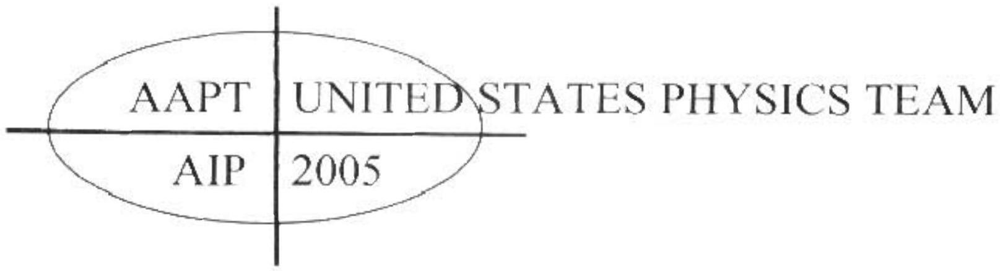
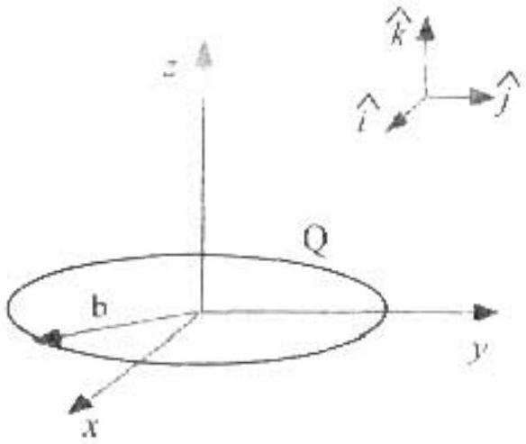
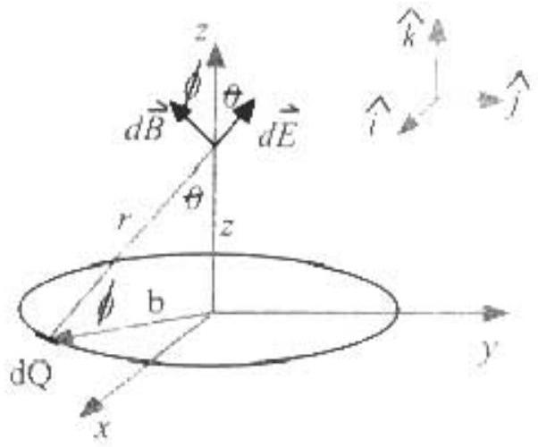

## Semi-Final Exam - SOLUTIONS Part A

AI . (a) Since $R _ { 3 }$ and $R _ { 6 }$ are in series, $l _ { 3 } = l _ { 6 }$ Since $R _ { 2 }$ and $R _ { 5 }$ are in series, $l _ { 2 } = l _ { 5 }$. By symmetry, the current through $R _ { 3 }$ and $R _ { 6 }$ must be the same as the current through $R _ { 2 }$ and $R _ { 5 }$ since the current through $\mathrm { A } =$ the current through B and this current splits into two branches one with a resistance of $2 R$ and the other with a resistance of $R$. Therefore,

$$
\begin{equation*}
t _ { 2 } = t _ { 3 } = t _ { 5 } = t _ { 6 } \tag{A1-1}
\end{equation*}
$$

and $I _ { i } = I _ { z }$.
By the junction rule,

$$
\begin{equation*}
t _ { i } = t _ { z } + t _ { a } \tag{A1-3}
\end{equation*}
$$

Applying the loop rule from A to B across the top of the circuit,

$$
\begin{equation*}
\varepsilon = I _ { 1 } R + 2 I _ { 2 } R \tag{A1-4}
\end{equation*}
$$

Applying the loop rule from A to B going through $R _ { i } , R _ { 4 }$, and $R _ { 7 }$ yields

$$
\begin{equation*}
\varepsilon = I _ { i } R + I _ { d } R + I _ { f } R . \tag{A1-5}
\end{equation*}
$$

Substitute (A1-3) into (A1-4) and (A1-5).

$$
\begin{equation*}
\varepsilon = 3 I _ { 2 } R + I _ { 4 } R \tag{Al-6}
\end{equation*}
$$

and $\varepsilon = 2 I _ { 2 } R + 3 I _ { 4 } R$
Subtract, (A1-7) from (A1-6) to obtain

$$
\begin{equation*}
I _ { 2 } = 2 I _ { 4 } . \tag{A1-8}
\end{equation*}
$$

Substitute into (A1-6) or (A1-7) to find that

$$
\begin{equation*}
I _ { 4 } = \frac { \varepsilon } { 7 R } \tag{A1‧9}
\end{equation*}
$$

Then, from (AI-8) and (A1-1),

$$
\begin{equation*}
I _ { 2 } = I _ { 3 } = I _ { 5 } = I _ { 6 } = \frac { 2 \varepsilon } { 7 R } \tag{A1-10}
\end{equation*}
$$

Using (A1-3) and (A1-2),

$$
\begin{equation*}
I _ { 1 } = I _ { 2 } = \frac { 3 \varepsilon } { 7 R } \tag{A1-11}
\end{equation*}
$$

(b) $\quad I _ { \text {datiery } } = \frac { \varepsilon } { R _ { \text {equars } } }$
and $\quad I _ { \text {lunery } } = I _ { 1 } + I _ { 2 }$
Therefore, by substituting (A1-10) and (A1-11) into (A1-12) and (A1-13).

$$
\begin{equation*}
\frac { \varepsilon } { R _ { \text {equ } } } = \frac { 5 \varepsilon } { 7 R } \tag{A1-14}
\end{equation*}
$$

Thus, $R _ { \text {equa } } = \frac { 7 R } { 5 }$
(c) After a very long time, no current will flow through the branch of the circuit with the capacitor. Therefore, $R _ { l } , R _ { 2 }$, and $R _ { 5 }$ are in series and $R _ { 3 } , R _ { 6 }$, and $R _ { 7 }$ are in series. The current through the top branch and the current through the bottom branch will then be

$$
\begin{equation*}
I = \frac { \varepsilon } { 3 R } \tag{AI-16}
\end{equation*}
$$

The voltage drop across $R _ { 1 }$ is $I R$ and the voltage drop across $R _ { 3 }$ and $R _ { 6 }$ is $2 I R$. Thus, the voltage drop across the capacitor is $2 I R - I R = I R$.

Using (A1-16),

$$
\begin{equation*}
V _ { \text {copp } } = \frac { \varepsilon } { 3 } \tag{A1-17}
\end{equation*}
$$

The charge on the capacitor is $Q = C V _ { \text {age } } = \frac { C \cdot E } { 3 }$. (A1-18)
(A2). Vaporizing the water will require energy:

$$
\begin{equation*}
\Delta U _ { ( m , 3 } = m L _ { r } = ( 0.0360 \mathrm {~kg} ) \left( 2.26 \times 10 ^ { 6 } \mathrm {~J} / \mathrm { kg } \right) = 81.4 \mathrm {~kJ} . \tag{A2-1}
\end{equation*}
$$

We find that we have $\frac { 0.0360 \mathrm {~kg} } { 0.018 \mathrm {~kg} / \mathrm { mol } } = 2.0 \mathrm {~mol}$ of water.
Using $p V = n R T$, we find that we have 48.1 mol of air.
Since the volume is constant, the change in internal energy of the air and of the steam are given by

$$
\begin{equation*}
\Delta U = n C _ { v } \Delta T . \tag{A2-2}
\end{equation*}
$$

The total change in internal energy of the system musi be zero:

$$
\begin{equation*}
\Delta U _ { \operatorname { mep } } ^ { \prime } + \Delta U _ { \text {newn } } + \Delta U _ { \text {rar } } ^ { \prime } = 0 . \tag{A2-3}
\end{equation*}
$$

Substituting (A2-1) and (A2-2) into (A2-3):

$$
\begin{equation*}
81.4 \mathrm { k } / + \left( n C _ { 1 } \Delta T \right) _ { 100 \% m } + \left( n C _ { 1 } \Delta T \right) _ { \cdots . } = 0 . \tag{A2-4}
\end{equation*}
$$

$81.4 \mathrm {~kJ} + ( 2.0 \mathrm {~mol} ) \left( 27.9 \mathrm {~J} / ( \mathrm { mol } \cdot \mathrm { K } ) \left( \mathrm { T } _ { f } - 500 \mathrm {~K} \right) + ( 48.1 \mathrm {~mol} ) \left( 20.8 \mathrm {~J} / ( \mathrm { mol } \cdot \mathrm { K } ) \left( T _ { f } - 373 \mathrm {~K} \right) = 0 \right. \right.$.

$$
\begin{equation*}
T _ { \text {inoi } } = 416 \mathrm {~K} . \tag{A2-5}
\end{equation*}
$$

There are a total of $2.0 \mathrm {~mol} + 48.1 \mathrm {~mol} = 50.1 \mathrm {~mol}$ of gas in the container, so from the ideal gas law,

$$
\begin{equation*}
p = \frac { n R T } { V } = \frac { ( 50.1 \mathrm {~mol} ) ( 8.31 \mathrm {~J} / \mathrm { mol } \bullet \mathrm {~K} ) ( 416 \mathrm {~K} ) } { 2.00 \mathrm {~m} } = 86.7 \mathrm { kPa } \tag{A2-6}
\end{equation*}
$$

A3. (a) We can assume that there is an image of the source $S$ in the perfectly reflecting surface located a distance $d / 2$ beneath the surface. The problem then reduces to one of two point sources a distance $d$ apart creating an interference pattern on a screen a located a distance $L \gg d$ away from the sources. We are informed that the midpoint on the screen, $y = 0$, is an interference minimum. Since this would be an interference maximum for two point sources which are in phase, then we can conclude that the phase of the reflected wave is shifted by an amount $\pi$, so that the location of interference maxima and interference minima are switched relative to the "normal" presentation. Consequently, the location of the first maximum is $y = \lambda L / 2 d$.

In the event that you forgot the formula, you will need to derive it.
The distance from the object point source to a point on the screen is

$$
\begin{equation*}
x _ { 1 } \quad \sqrt { ( y - d / 2 ) ^ { 2 } + t ^ { 2 } } \approx t \cdot \left( 1 + \frac { ( y - d / 2 ) ^ { 2 } } { 2 t ^ { 2 } } \right) \tag{A3-1}
\end{equation*}
$$

The distance from the image point source to a point on the screen is

$$
\begin{equation*}
r _ { 1 } \quad \sqrt { ( y - d / 2 ) ^ { 2 } + E ^ { 2 } } \approx L \left( 1 + \frac { ( y + d / 2 ) ^ { 2 } } { 2 t ^ { 2 } } \right) \tag{A3-2}
\end{equation*}
$$

The path length difference is then

$$
\begin{equation*}
r _ { 2 } - r _ { 1 } \approx \frac { y d } { l } . \tag{A3-3}
\end{equation*}
$$

where the approximation is true for $L \gg y + d / 2$.
The relative phase shift due to the path length difference is found by dividing through by the wavelength and multiplying by $2 \pi$, so

$$
\begin{equation*}
\Delta \phi _ { 101 } = 2 \pi \frac { y d } { \lambda l } . \tag{A3‧4}
\end{equation*}
$$

There is an additional phase shift of $\pi$ from the reflection, so that the overall phase difference between the waves is

$$
\begin{equation*}
\Delta \omega = 2 \pi \frac { y d } { \lambda L } - \pi \tag{A3-5}
\end{equation*}
$$

Constructive interference occurs when $\Delta \phi = 2 n \pi$, where $n$ is an integer; the smallest value for $y$ with constructive interference happens when $n - 1$, or

$$
\begin{equation*}
y = \frac { \lambda l } { 2 d } \tag{A3-6}
\end{equation*}
$$

(b) For the wave from the source above the boundary:

$$
\begin{equation*}
\theta = 1 \sin ( k = \text { wit } 10 ) \tag{A3-7}
\end{equation*}
$$

The wave below the boundary travels in a medium that (1) doesn't affect 0 or $\phi$. but (2) scales $k$ according to $k \rightarrow n k$, since the wave velocity is changed but the frequency is unaffected. Consequently the wave equation from the second source is

$$
\begin{equation*}
v _ { 2 } = 1 \sin ( n k x - w t c o ) \text {. } \tag{A3-8}
\end{equation*}
$$

The distance $z$ is the same for both, and is approximately equal to $L$ for $L \gg d$.
Adding the two waves in (A3-7) and in (A3-8) and making use of the given trigonometric identity yields

$$
\begin{equation*}
\omega + \omega y \quad 2.1 \cos \left[ \frac { ( n - 1 ) k t } { 2 } \right] \sin \left[ \frac { ( n 11 ) k t } { 2 } - \omega t + c \right] . \tag{A3-9}
\end{equation*}
$$

(c) The intensity is proportional to the wave-function squared, or
$$
\begin{equation*}
I \times v ^ { 2 } . \tag{A3-10}
\end{equation*}
$$

The time average is found by integrating the above expression over one period and then dividing by the period, or

$$
\begin{equation*}
\langle t \rangle x \cdot A t ^ { 2 } \cos ^ { 2 } \left[ \frac { ( t - 1 ) k t } { 2 } \right] \frac { - } { 2 \pi } \int _ { \cdots p d t } \sin ^ { 2 } \left[ \frac { ( n + 1 ) k t } { 2 } - 2 t - \phi \right] d t . \tag{A3-11}
\end{equation*}
$$

Everything inside the sin function can be written compactly as

$$
\begin{equation*}
\left. \sin ^ { 2 } \left[ \frac { ( n + 1 ) k t } { 2 } - \mu t - 0 \right] \quad \sin ^ { 2 } \theta - w i \right\rvert \, . \tag{A3-12}
\end{equation*}
$$

A change of variables to try would be

$$
\begin{equation*}
u = v - \omega t \tag{A3-13}
\end{equation*}
$$

Then the expression for the time- averaged intensity becomes

$$
\begin{equation*}
( I ) \times \cos ^ { 2 } \left[ \frac { ( n - 1 ) k \cdot l } { 2 } \right] \int _ { - g i s } \sin ^ { 2 } n d u . \tag{A3-14}
\end{equation*}
$$

where we have conveniently swallowed all constants into the proportionality. The integral is fairly easy, but it doesn't matter, since it is also a constant independent of $k$ or $L$. So it can be swallowed as well, leaving

$$
\begin{equation*}
\text { (i) } x \cos ^ { 2 } \left[ \frac { \ln - 1 / k / } { 2 } \right] . \tag{A3-15}
\end{equation*}
$$

This is true for all values of the argument of the cosine function, including the value that maximizes the cosine function, so

$$
\begin{equation*}
\text { (i) } \quad J _ { 11 } \cos \mathrm {~m} ^ { 2 } \left[ \frac { 1 / 21 + 2 t } { 2 } \right] \tag{A3-16}
\end{equation*}
$$

gives us the required relation for $\langle I \rangle _ { \text {max } }$
A4. (a) The mass of a spherical shell of radius $r$ and thickness dr is

$$
\begin{equation*}
\rho ( r ) 4 \pi r ^ { 2 } d r = A r ^ { \prime \prime } 4 \pi r ^ { 2 } d r = A r ^ { \prime \prime } 4 \pi d r \tag{A4-1}
\end{equation*}
$$

To find the total mass enclosed by a sphere of radius $R$, we add up the mass of all of the spherical shells:

$$
\begin{equation*}
M ( R ) = \int _ { 0 } ^ { R } A r ^ { n + 2 } 4 \pi d r = \frac { 4 \pi A R ^ { n + 3 } } { n + 3 } = C R ^ { n + 3 } \tag{\(\wedge4-2\)}
\end{equation*}
$$

where $C = \frac { 4 \pi A } { n + 3 }$.
(b) Gauss's Law applied to a spherical shell of radius R gives us

$$
\begin{equation*}
\oint \vec { g } \cdot d A = - 4 \pi G M _ { \text {enclosed } } \tag{A4-4}
\end{equation*}
$$

By symmetry, $g$ is constant over the surface of the spherical shell. $g$ is radially inward, so

$$
\begin{equation*}
\hat { g } \cdot d \vec { A } = - g 4 \pi R ^ { 2 } \tag{A4-5}
\end{equation*}
$$

When we substitute (A4-5) into (A4-4) and substitute (A4-2) for $M _ { \text {enclosed } }$, we obtain

$$
\begin{equation*}
- g 4 \pi R ^ { 2 } = - 4 \pi G C R ^ { n + 3 } \tag{A4-6}
\end{equation*}
$$

Solving for g ,

$$
\begin{equation*}
g = G C R ^ { n + 1 } \tag{A4-7}
\end{equation*}
$$

The gravitation force on a star of mass $m$ is then

$$
\begin{equation*}
F _ { g r w } = m g = m G C R ^ { n - 1 } \tag{A4-8}
\end{equation*}
$$

(c) Applying Newton's second law to the circular motion of the star, we find that

$$
\begin{equation*}
F _ { g v ^ { * u } } = \frac { m v ^ { 2 } } { R } \tag{A4-9}
\end{equation*}
$$

Substituting (A4-8) into (A4-9) yields

$$
\begin{align*}
& m G C R ^ { \alpha + 1 } = \frac { m v ^ { 2 } } { R }  \tag{A4-10}\\
& v = \sqrt { G C R ^ { n - 2 } } \tag{A4-11}
\end{align*}
$$

(d) If $v$ is constant, then $R ^ { n + 2 } = R ^ { o }$, so $n = - 2$.
(e) Apply Gauss's Law to a spherical shell of radius $r$, where $r > R$. Here, the mass enclosed is $M _ { 0 }$.

$$
\begin{equation*}
- g 4 \pi r ^ { 2 } = - 4 \pi G M _ { 0 } \tag{A4-13}
\end{equation*}
$$

$$
\begin{equation*}
g = \frac { G M _ { D } } { r ^ { 2 } } \tag{A4-14}
\end{equation*}
$$

Substituting into (A4-9)

$$
\begin{align*}
& \frac { m G M _ { 0 } } { r ^ { 2 } } = \frac { m v ^ { 2 } } { r }  \tag{A4-15}\\
& v = \sqrt { \frac { G M _ { 3 } } { r } } \tag{A4-16}
\end{align*}
$$

## Semi-Final Exam - SOLUTIONS   Part B

B1. (a) By symmetry, the $x$ and $y$ components of the electric field from different parts of the ring will cancel

$$
E _ { 1 } = E _ { 1 } = 0
$$

Therefore, we need to add up the $z$-components of the electric field from the various parts of the ring.

The electric field due to an infinitesimal charge $d q$ on the ring at a distance $z$ from the origin is

$$
\begin{equation*}
d E = \frac { d q } { 4 \pi \varepsilon _ { 0 } r ^ { 2 } } \hat { r } \tag{\(B\mid-1\)}
\end{equation*}
$$

where $r = \left( b ^ { 2 } + z ^ { 2 } \right) ^ { 1.2 }$
( r is the distance from a point on the ring to the point $( 0.0 . z )$.) $\hat { r }$ is a unit vector at the point $( 0,0 , z )$ pointing away from the charge $d q$ on the ring

The $z$-component is then given by

$$
\begin{equation*}
d E _ { r } = d E \cos \theta = \frac { z d E } { r } \tag{BI-3}
\end{equation*}
$$

where $\theta$ is the angle between $i$ and the $z$ axis.
Substituting eq. (B1-1) into (B1-2) yields:

$$
\begin{equation*}
d E _ { z } = \frac { z d q } { 4 \pi \varepsilon _ { 0 } r ^ { 3 } } \tag{B1-4}
\end{equation*}
$$

Integrating (B 1-4) around the ring and observing that r is the same for all points on the ring yields

$$
\begin{equation*}
E _ { z } = \int \frac { z d q } { 4 \pi \varepsilon _ { 0 } r ^ { 4 } } = \frac { z Q } { 4 \pi \varepsilon _ { 0 } r ^ { 3 } } \tag{B1-5}
\end{equation*}
$$

Using the fact that $E _ { 1 } = E _ { y } = 0$ and substituting ( $\mathrm { B } 1 - 2$ ) into ( $\mathrm { B } 1 - 5$ ) gives us the answer.

$$
\begin{equation*}
E = E \dot { k } = \frac { z Q \hat { k } } { 4 \pi \varepsilon _ { 0 } \left( b ^ { 2 } + z ^ { 2 } \right) ^ { 1 / 2 } } \tag{B1-6}
\end{equation*}
$$

(b) The potential a distance $r$ away from an infinitesimal charge $d q$ is given by
$$
\begin{equation*}
d V = \frac { d q } { 4 \pi \varepsilon _ { v } r } \tag{B1-7}
\end{equation*}
$$
Integrating around the ring, using the fact that $r$ is the same from every point on the ring to the point (0,0,Z), and substituting (B1-2) for $r$ yields
$$
\begin{equation*}
V = \int \frac { d q } { 4 \pi \varepsilon _ { o } r } = \frac { Q } { 4 \pi \varepsilon _ { c } r } = \frac { Q } { 4 \pi \varepsilon _ { c } \left( b ^ { 2 } + z ^ { 2 } \right) ^ { 1 / 2 } } \tag{B1-8}
\end{equation*}
$$
Note that it is easier to solve part (b) first and then to solve part (a) using
$$
\begin{align*}
& E _ { z } = - \frac { d V } { d z } = - \frac { d } { d z } \left( \frac { Q } { 4 \pi \varepsilon _ { 0 } \left( b ^ { 2 } + z ^ { 2 } \right) ^ { 1 / 2 } } \right) = - \frac { \left( - \frac { 1 } { 2 } \right) ( 2 z Q ) } { 4 \pi \varepsilon _ { 0 } \left( b ^ { 2 } + z ^ { 3 } \right) ^ { 1 / 2 } }  \tag{B1-9}\\
& = \frac { z Q } { 4 \pi \varepsilon _ { 0 } \left( b ^ { 2 } + z ^ { 2 } \right) ^ { 3 / 2 } }
\end{align*}
$$
(c) The potential energy of the system is given by
$$
\begin{equation*}
U = - \varphi V \tag{B1-10}
\end{equation*}
$$
Using (B1-8),
$$
\begin{equation*}
U = \frac { - q Q } { 4 \pi \varepsilon _ { 0 } \left( b ^ { 2 } + z ^ { 2 } \right) ^ { 1 - 2 } } \tag{BI-11}
\end{equation*}
$$
Factoring out $b ^ { 2 }$,
$$
\begin{equation*}
U = \frac { - q Q } { 4 \pi \varepsilon _ { o } } \left( b ^ { 2 } + z ^ { 2 } \right) ^ { - 12 } = \frac { - q Q } { 4 \pi \varepsilon _ { o } b } \left( 1 + \frac { z ^ { 2 } } { b ^ { 2 } } \right) ^ { - 12 } \tag{B1-12}
\end{equation*}
$$
Using the fact that $| z | \ll b$ and using the approximation $( 1 + x ) ^ { n } \approx 1 + n x$ when $x \ll 1$, (B1-12) becomes
$$
\begin{equation*}
U \approx \frac { - q Q } { 4 \pi \varepsilon _ { c } b } \left( 1 - \frac { 2 ^ { 2 } } { 2 b ^ { 2 } } \right) \tag{B1-13}
\end{equation*}
$$

(d) Mechanical energy is conserved, so
$$
\begin{equation*}
U \left( z _ { 0 } \right) + K \left( z _ { 0 } \right) = U ( 0 ) + K ( 0 ) \tag{B1-14}
\end{equation*}
$$
Since the charge is at rest at $\mathrm { z } = \mathrm { z } _ { 0 }$ and using (B1-13),
$$
\begin{equation*}
\frac { - q Q } { 4 \pi \varepsilon _ { e } b } \left( 1 - \frac { z _ { 0 } ^ { 2 } } { 2 b ^ { 2 } } \right) + 0 = \frac { - q Q } { 4 \pi \varepsilon _ { e } b } + \frac { 1 } { 2 } m [ v ( 0 ) ] ^ { 2 } \tag{(B \(\mid - 15\) )}
\end{equation*}
$$
Solving for $v ( 0 )$,
$$
\begin{equation*}
v ( 0 ) = \left( \frac { q Q z _ { 0 } ^ { 2 } } { 4 m \pi \varepsilon _ { 0 } b ^ { 3 } } \right) ^ { 1 / 2 } \tag{B1-16}
\end{equation*}
$$
(e) We shall use Newton's Second Law:
$$
\begin{equation*}
F _ { r r ^ { \prime } } = m a = m \frac { d ^ { 2 } z } { d t ^ { 2 } } \tag{B1-17}
\end{equation*}
$$
The force on the charge - q is - qE where E is given by (B1-6). Substituting into (B1-17),
$$
\begin{equation*}
\frac { - q z Q } { 4 \pi \varepsilon _ { n } \left( b ^ { 2 } + z ^ { 2 } \right) ^ { 1 / 2 } } = m \frac { d ^ { 2 } z } { d t ^ { 2 } } \tag{B1-18}
\end{equation*}
$$
But, $z \ll b$, so $\left( b ^ { 2 } + z ^ { 2 } \right) ^ { 3 / 2 } \approx b ^ { 3 }$ and, after dividing both sides by $\mathrm { m } , ( \mathrm { B } 1 - 18 )$ becomes
$$
\begin{equation*}
\frac { d ^ { 2 } z } { d t ^ { 2 } } = \frac { - q Q z } { 4 \pi \varepsilon _ { 0 } m b ^ { \prime } } \tag{B1-19}
\end{equation*}
$$
We recognize that the differential equation
$$
\begin{equation*}
\frac { d ^ { 2 } z } { d t ^ { 2 } } = - \omega ^ { 2 } z \tag{B1-20}
\end{equation*}
$$
is simple harmonic motion. The solution to (BI-20) is
$$
\begin{equation*}
z ( t ) = A \cos t o t \tag{B1-21}
\end{equation*}
$$
Since $z ( 0 ) = z _ { 0 }$, we find that $A = z _ { 0 }$.
By comparison with (B1-19), we find that

$$
\begin{equation*}
\omega = \left( \frac { q Q } { 4 \pi \varepsilon _ { a } m b ^ { 3 } } \right) ^ { \prime 2 } \tag{B1-22}
\end{equation*}
$$

We can derive an expression for the velocity as a function of time by differentiating (B1-21):

$$
\begin{equation*}
\nu ( t ) = \frac { d z ( t ) } { d t } = - \omega z _ { , } \sin \omega t \tag{B1-23}
\end{equation*}
$$

(where $\omega$ is given by (B1-22).)
Note that an alternative method of solving part (d) is to note that the speed at the origin will be the maximum value of the magnitude of the velocity

$$
v ( 0 ) = \omega z _ { 0 } = \left( \frac { q Q z _ { 0 } ^ { 2 } } { 4 \pi \varepsilon _ { 0 } m b ^ { 3 } } \right) ^ { 1 / 2 }
$$

Note that an alternative (easier) method of solving part (e) is to note that the potential energy found in (BI-13) is of the form $U ^ { \prime } ( z ) = U ( 0 ) + \frac { k z ^ { 2 } } { 2 }$

Therefore, since it starts from rest, we know that $z ( t ) = A \cos \omega t$ and that

$$
v ( t ) = \frac { d z ( t ) } { d t } = - \omega z _ { n } \sin \omega t = - v _ { \max } \sin \omega t
$$

Thus, $\omega = \frac { v _ { \text {max } } } { z _ { 0 } }$ and $v _ { \text {max } }$ was found in (B1-16).

(f) According to the Biot-Savart law, the magnetic field due to a moving infinitesimal charge $d q$ is given by
$$
\begin{equation*}
d \vec { B } = \frac { \mu _ { 0 } } { 4 \pi } \frac { \partial \overrightarrow { d s } \times \hat { r } } { r ^ { 2 } } = \frac { \mu _ { 0 } } { 4 \pi } \frac { d q \vec { v } \times \hat { r } } { r ^ { 2 } } \tag{B1-24}
\end{equation*}
$$
Since $d \vec { B }$ depends on the cross product $\vec { v } \times \hat { r } , d \vec { B }$ must be perpendicular to both $\vec { v }$ and $\hat { r }$
By symmetry, when we add the magnetic field vectors due to all points on the rotating ring, the $x$ and $y$ components will cancel. Therefore, we need to find the $z$ components and add them. Let $\varphi$ be the angle between $\bar { B }$ and $\vec { z }$.

$$
\begin{equation*}
d B _ { z } = d B \cos \varphi = \frac { b d B } { r } \tag{B1-25}
\end{equation*}
$$

Substituting $v = b \omega$ and (B1-24) into (B1-25):

$$
\begin{equation*}
d B _ { z } = \frac { \mu _ { 0 } } { 4 \pi } \frac { b ^ { 2 } \omega d q } { r ^ { 3 } } \tag{B1-26}
\end{equation*}
$$

Integrating (B1-26) around the ring and observing that r is the same for all points on the ring yields

$$
\begin{equation*}
B _ { z } = \int \frac { \mu _ { 0 } } { 4 \pi } \frac { b ^ { 2 } \omega d q } { r ^ { 3 } } = \frac { \mu _ { 0 } } { 4 \pi } \frac { b ^ { 2 } \omega Q } { r ^ { 3 } } \tag{BI-27}
\end{equation*}
$$

Using the fact that $B _ { x } = B _ { y } = 0$ and substituting (B1-2) into (B1-27) gives us the answer

$$
\begin{equation*}
B = B \hat { k } = \frac { \mu _ { 0 } } { 4 \pi } \frac { b ^ { 2 } \omega Q \hat { k } } { \left( b ^ { 2 } + z ^ { 2 } \right) ^ { 3 \cdot 2 } } \tag{B1-28}
\end{equation*}
$$

(g) A point charge $- q$ moving with velocity $v$ in a magnetic field $B$ experiences a magnetic force
$$
\begin{equation*}
\dot { F } _ { \operatorname { mogh } } = - q \vec { v } \times \vec { B } \tag{B1-29}
\end{equation*}
$$
However, since the charge is moving in the $- \vec { k }$ direction and the magnetic field is in the $\hat { k }$ direction, $\vec { v } \times \vec { B } = 0$, so $\dot { F } _ { \text {magn } } = 0$.

B2. (a) (1) The frictional force acting on the block depends on the normal force on the portion of the block that is on the rough surface. Therefore,

$$
\begin{equation*}
F _ { l m } = \frac { \mu x m g } { L } \tag{B2-1}
\end{equation*}
$$

As the leading edge travels a distance $L$ on the rough surface, friction does work:

$$
\begin{equation*}
W _ { m } = \int F _ { f m } d x = \int _ { 0 } ^ { i } \frac { \mu x m g } { L } d x = \frac { \mu L m g } { 2 } \tag{B2-2}
\end{equation*}
$$

Since the block stops after traveling a distance $L$, the work done by friction must equal the initial potential energy of the block.

$$
\begin{equation*}
m g H _ { c m } = W _ { t m t } \tag{B2-3}
\end{equation*}
$$

Using (B2-2), we obtain

$$
\begin{equation*}
m g H _ { c m } = \frac { \mu L m g } { 2 } \tag{B2-4}
\end{equation*}
$$

Therefore.

$$
\begin{equation*}
H _ { \cdots } = \frac { \mu t } { 2 } \tag{B2-5}
\end{equation*}
$$

(ii) Substituting (B2-1) into Newton's Second Law yields:

$$
\begin{equation*}
\frac { - \mu x m g } { L } = m \frac { d ^ { 2 } x } { d t ^ { 2 } } \tag{B2-6}
\end{equation*}
$$

Dividing both sides by m :

$$
\begin{equation*}
\frac { d ^ { 2 } x } { d t ^ { 2 } } = \frac { - \mu g x } { L } \tag{B2-7}
\end{equation*}
$$

We recognize that the differential equation

$$
\begin{equation*}
\frac { d ^ { 2 } x } { d t ^ { 2 } } = - \omega ^ { 2 } x \tag{B2-8}
\end{equation*}
$$

is simple harmonic motion.

By comparison with (B2-7), we find that

$$
\begin{equation*}
\omega = \left( \frac { \mu g } { l } \right) ^ { 1 / 2 } \tag{B2-9}
\end{equation*}
$$

The period of SHM is $\frac { 2 \pi } { \omega }$. The motion of the block coming to rest is $\frac { 1 } { 4 }$ of a cycle, so

$$
\begin{equation*}
t = \frac { T } { 4 } = \frac { \pi } { 2 } \left( \frac { L } { \mu g } \right) ^ { V } \tag{B2-10}
\end{equation*}
$$

(b) (i) In this case, the leading edge travels a distance $d$ on the rough surface, so friction does work:

$$
\begin{equation*}
W _ { i m c } = \int F _ { f m c } d x = \int _ { 0 } ^ { d } \frac { \mu x m g } { L } d x = \frac { \mu d m g } { 2 L } \tag{B2-11}
\end{equation*}
$$

Since the block stops after traveling a distance $x$, the work done by friction must equal the initial potential energy of the block.

$$
\begin{equation*}
m g H = W _ { l m } = \frac { \mu d ^ { 2 } m g } { 2 L } \tag{B2-12}
\end{equation*}
$$

Solving for $d$,

$$
\begin{equation*}
d = \sqrt { \frac { 2 H L } { \mu } } \tag{B2-13}
\end{equation*}
$$

(1) As the block slides on the rough surface, (B2-6) will hold as before. Thus, the motion will be $1 / 4$ of a cycle of simple harmonic motion as before. Although the amplitude will be $d$ (given by B2-13) instead of $L$, the period of SHM is independent of the amplitude. Therefore, the time for the block to stop will be the same as (B2-10).

(c) (i) Until the block is entirely on the rough surface, the force of friction acting on the block is given by (B2-1). Once the block is entirely on the surface, the force of friction is constant:
$$
\begin{equation*}
F _ { i m c } = \mu m g \tag{B2-14}
\end{equation*}
$$
Let $\Delta x =$ the distance that the block travels on the surface with friction after the entire block is on the surface.

We set the initial gravitational potential energy of the block equal to the total work done by friction as the block comes to a stop:

$$
\begin{align*}
& m g H = \int _ { 0 } ^ { i } \frac { \mu x m g } { L } d x + \mu m * \Delta x  \tag{B2-15}\\
& m g H = \frac { \mu m g L } { 2 } + \mu m g \Delta x \tag{B2-16}
\end{align*}
$$

Solving for $\Delta x$,

$$
\begin{equation*}
\Delta x = \frac { H } { \mu } - \frac { L } { 2 } \tag{B2-17}
\end{equation*}
$$

The total distance traveled by the leading edge across the surface with friction is

$$
\begin{equation*}
\Delta x + L = \frac { H } { \mu } + \frac { L } { 2 } \tag{B2-18}
\end{equation*}
$$

(ii) While the block is only partially on the surface with friction, we have SHM as in equation (B2-7). However, since the block does not come to a stop until after the entire block is on the surface, we do not complete one-quarter of the cycle of SHM this time. The solution for SHM is given by

$$
\begin{equation*}
x ( t ) = A \sin \sqrt { a t } = A \sin \sqrt { \frac { \mu g t } { L } } \tag{B2-19}
\end{equation*}
$$

where we have used (B2-9).
Take the derivative of (B2-19) to find velocity.

$$
\begin{equation*}
v ( t ) = A \sqrt { \frac { \mu g } { L } } \cos \sqrt { \frac { \mu g t } { L } } \tag{B2-20}
\end{equation*}
$$

We can find the velocity of the block just before the leading edge hits the surface with friction using conservation of mechanical energy:

$$
\begin{align*}
& m g H = \frac { m v } { 2 }  \tag{B2-21}\\
& v = \sqrt { 2 g H } \tag{B2-22}
\end{align*}
$$

We can evaluate the amplitude $A$ by substituting (B2-22) for $v$ when $t = 0$ into (B2-10):

$$
\begin{align*}
& \sqrt { 2 g H } = A \sqrt { \frac { \mu g } { L } }  \tag{B2-23}\\
& A = \sqrt { \frac { 2 H I } { \mu } } \tag{B2-24}
\end{align*}
$$

Let $t _ { i }$ be the time that it takes the leading edge of the block to travel a distance $L$ across the surface with friction. To find $t _ { i }$, we substitute (B2-24) into (B2-19) and solve for $t$.

$$
\begin{align*}
& L = \sqrt { \frac { 2 H L } { \mu } } \sin \sqrt { \frac { \mu g t } { L } }  \tag{B2-25}\\
& t _ { 1 } = \sqrt { \frac { L } { \mu g } } \sin ^ { - 1 } \sqrt { \frac { \mu L } { 2 H } } \tag{B2-26}
\end{align*}
$$

Now, that the entire block is on the surface with friction, we need to find the additional time that it will take to stop it. Now that the entire block is on the surface, the force, and therefore the acceleration, are constant. We need to find out how fast the block is going at the instant that the leading edge has traveled a distance L . We shall use the generalized work-energy theorem where the work done by friction is given by (B2-2).

$$
\begin{equation*}
m g H = \frac { \mu m g L } { 2 } + \frac { m v ^ { 2 } } { 2 } \tag{B2-27}
\end{equation*}
$$

Solving for v,

$$
\begin{equation*}
v = \sqrt { 2 g H - \mu g L } \tag{B2-28}
\end{equation*}
$$

From (B2-14), we see that the acceleration of the block is given by

$$
\begin{equation*}
a = - \mu g \tag{B2-29}
\end{equation*}
$$

Let $\mathrm { t } _ { 2 } =$ the time that it takes the block to come to rest after the entire block is on the surface with friction. Using the definition of acceleration and (B2-29) and (B2-28) we have

$$
\begin{equation*}
t _ { 2 } = \frac { 0 - v } { a } = \frac { - \sqrt { 2 g H - \mu g L } } { - \mu g } = \sqrt { \frac { 2 H } { g \mu ^ { 2 } } - \frac { L } { \mu g } } \tag{B2-30}
\end{equation*}
$$

The total time that it takes to stop is then given by adding (B2-26) and (B2-30).

$$
\begin{equation*}
t = t _ { 1 } + t _ { 2 } = \sqrt { \frac { L } { \mu g } } \sin ^ { - 1 } \sqrt { \frac { \mu L } { 2 H } } + \sqrt { \frac { 2 H } { g \mu ^ { 2 } } - \frac { L } { \mu g } } \tag{B2-31}
\end{equation*}
$$
