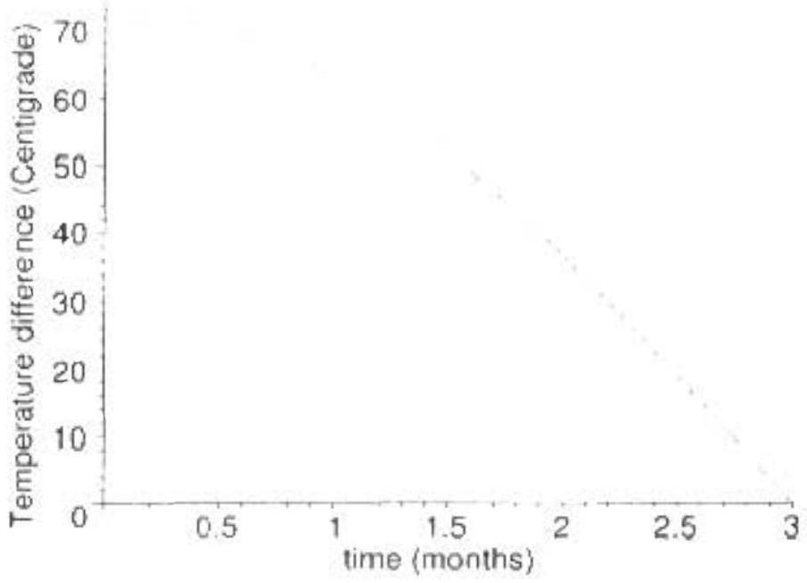

Question 4

a. The ions move. for the most part, in uniform circular motion under the influence of a magnetic force. 50
$$
\begin{equation*}
\frac { m v ^ { 2 } } { r } = q ( B . \tag{A4-1}
\end{equation*}
$$
or
$$
\begin{equation*}
m v - q B r . \tag{A4-2}
\end{equation*}
$$
When $r = R$ we have the maxmim pessible momentum, so
$$
\begin{equation*}
p _ { \max } - q B R . \tag{A4-3}
\end{equation*}
$$
b. Since
$$
\begin{equation*}
K - \frac { p ^ { 2 } } { 2 m } , \tag{A4-4}
\end{equation*}
$$
we have
$$
\begin{equation*}
K = \frac { q ^ { 2 } B ^ { 2 } R ^ { 2 } } { 2 m } \tag{A4-5}
\end{equation*}
$$
But
$$
\begin{equation*}
m = \psi B \frac { R } { v ^ { \prime } } = \frac { q B } { \omega } . \tag{A4-6}
\end{equation*}
$$
So
$$
\begin{equation*}
K - \frac { q B R ^ { 2 } \omega } { 2 } . \tag{A4-7}
\end{equation*}
$$
c. The ioms pick up this kinetic energy from the changing potential, collecting $2 q V _ { 0 }$ after every revolution. The number of revolutions required is then
$$
\begin{equation*}
N = \frac { B R ^ { 2 } \omega } { 4 V _ { 0 } } . \tag{A4-8}
\end{equation*}
$$
and since each revolution requires a time $2 \pi / \omega$, the total time $t$ is given by
$$
\begin{equation*}
t = \frac { \pi B R ^ { 2 } } { 2 V _ { 0 } } \tag{A4-9}
\end{equation*}
$$
d. The cyclotron works only because the revolution of the charged particle is constant in time. $p = q B r$ is relativistically correct, but now the velocity is given by the condition that $p = \gamma m e$. The angular frequency of revolution needs to be $w$ in order to get a boost each half-cycle, so
$$
\begin{equation*}
v = r \iota \tag{A4-10}
\end{equation*}
$$
Then
$$
\begin{equation*}
p = m \frac { v } { \sqrt { 1 - r ^ { 2 } / c ^ { 2 } } } = \frac { m \tau \omega } { \sqrt { 1 - r ^ { 2 } \omega ^ { 2 } / c ^ { 2 } } } . \tag{A4-11}
\end{equation*}
$$
Putting this into the momentum expression yelds
$$
\begin{equation*}
B = \frac { m \omega } { q } \left( 1 - \frac { r ^ { 2 } \omega ^ { 2 } } { r ^ { 2 } } \right) ^ { - 1 / t } \tag{A4-12}
\end{equation*}
$$

## Part B

Question 1

a. For simplicity we write $v _ { t }$ instead of $v _ { t e r m }$. Wherever possible we will solve the problem in the simplest pussible manner.

i. The magnitude of the force of gravity on the wire is

$$
\begin{equation*}
k _ { g } = m g . \tag{B1-1}
\end{equation*}
$$

the magntude of the magnet is force on a current $l$ in the wire is

$$
\begin{equation*}
F _ { m } = B I X . \tag{B1-2}
\end{equation*}
$$

the induced emf, $V$. in the wire when traveling with speed $v$ is

$$
\begin{equation*}
V = - B v X . \tag{B1-3}
\end{equation*}
$$

and, finally, the relationship between the enf and current is

$$
\begin{equation*}
V = I R \tag{B1-4}
\end{equation*}
$$

Terminal velocity occurs when there is no acceleration, so that the net force is zero. Then

$$
\begin{align*}
m g & = B I X .  \tag{B1-5}\\
m g & = B \frac { V } { R } X _ { 1 }  \tag{B1-6}\\
m g & - B \frac { B v X } { R } X ,  \tag{B1-7}\\
- \frac { m g R } { B ^ { 2 } X ^ { 2 } } & = 1 : \tag{B1-8}
\end{align*}
$$

It is traditional to give the terminal speed, and consequently we don't usually write the negative sign indicating downward motion. Henceforth.

$$
\begin{equation*}
v _ { t } = \frac { m g R } { B ^ { 2 } X ^ { 2 } } . \tag{B1-9}
\end{equation*}
$$

ii. Let the above symbols, except for ze. now be variables in time. Define a dot notation for time derivatives, so that velocity is given by
$$
\begin{equation*}
, \cdots \frac { d y } { d t } = \dot { y } , \tag{B1-10}
\end{equation*}
$$
and
$$
\begin{equation*}
a = \frac { d : } { d t } - \dot { c } = \vec { y } . \tag{BI-11}
\end{equation*}
$$

The acceleration of the wire is given by Newton's second law.

$$
\begin{align*}
m a & - F _ { m } - F _ { g }  \tag{Bi-12}\\
m \dot { v } & - B / X - m g .  \tag{B1-13}\\
m \dot { v } & - \quad - B \frac { B _ { 2 } X } { R } X - m g .  \tag{B1-14}\\
\dot { r } & = - \frac { E ^ { 2 } X ^ { 2 } } { m R } r - m g .  \tag{BI-15}\\
\dot { u } & = - y \left( \frac { v } { v _ { t } } + 1 \right) . \tag{B1-16}
\end{align*}
$$

We must now integrate this expression,

$$
\begin{align*}
\frac { d v } { d t } & = - g \left( \frac { v } { v _ { t } } + 1 \right)  \tag{B1-18}\\
\frac { d v } { \left( v + v _ { t } \right) } & = - \frac { g } { v _ { t } } d t _ { t }  \tag{B1-19}\\
\int \frac { d v } { \left( v + v _ { t } \right) } & = - \int \frac { g } { v _ { t } } d t  \tag{B1-20}\\
\ln \left( \frac { v } { v _ { t } } + 1 \right) & = \frac { g t } { v _ { t } } \tag{B1-21}
\end{align*}
$$

Solving for $v$.

$$
\begin{equation*}
v = v _ { i } \left( e ^ { - g t / v _ { i } } - 1 \right) . \tag{B1-22}
\end{equation*}
$$

iii. Thermal energy dissipates at a rate given by
$$
\begin{equation*}
P = I V = V ^ { 2 } / R . \tag{B1-23}
\end{equation*}
$$
so
$$
\begin{align*}
P & = \frac { B ^ { 2 } , ^ { 2 } X ^ { 2 } } { R } .  \tag{B1-24}\\
& = \operatorname { mgr } \left( \rho w ^ { 2 / w _ { 1 } } - 1 \right) ^ { 2 } . \tag{B1-25}
\end{align*}
$$
iv. It is tempting to integrate the above expression. Don't do it! Instead, focus on the fact that the energy dissipated is equal to the change in energy of the wire. Note that it is moving at terminal speed when it completely leaves the field region, so
$$
\begin{equation*}
E - m g D - \frac { 1 } { 2 } m v _ { t } ^ { 2 } \tag{B1-26}
\end{equation*}
$$
b. Be wanned that we never actually need to find $L$ in this problem, so don't spend time trying to calculate it'
    i. Equations B1-1, B1-2 and B1-3 are stall true. But now the emf is related to the inductance and the change in current by
$$
\begin{equation*}
V - 1.1 \tag{B127}
\end{equation*}
$$

The dot above the $I$ means time derivative Combining.

$$
\begin{align*}
m \ddot { 0 } = & B I X - m \dot { 0 } .  \tag{B1-28}\\
= & B i X .  \tag{B1-29}\\
= & - B \frac { V } { L } X .  \tag{B1.30}\\
& \frac { B ^ { 2 } X ^ { 2 } } { L } r . \tag{BI-31}
\end{align*}
$$

This is the differential equation for a simple harmonic oscillator, with angular frequeney w given by

$$
\begin{equation*}
\omega = \sqrt { \frac { B ^ { 2 } K ^ { 2 } } { m L } } . \tag{B1-32}
\end{equation*}
$$

The period of oscillation is then

$$
\begin{equation*}
T = \frac { 2 \pi } { \omega } = \frac { 2 \pi \sqrt { m L } } { B X } . \tag{B1-33}
\end{equation*}
$$

ii. Oscillatory motion is necessarily of the form
$$
\begin{equation*}
y = A \cos ( \omega t + \phi ) + B . \tag{B1-34}
\end{equation*}
$$
where $A , B$, and $\delta$ are constants. Since $y$ is a maximum when $t = 0$, we can conclude that $\phi - 0$. The acceleration will be given by $a = \ddot { y }$, and the maximum acceleration is then $a _ { \text {max } } = A \omega ^ { 2 }$. This maximum acederation occurs when the object is released. atid there is not yet any current through the wire, sit, from Eq. B1-28.
$$
\begin{align*}
m A _ { \omega ^ { 2 } } ^ { 2 } & = m g  \tag{B1-35}\\
A & = \frac { m g L } { B ^ { 2 } X ^ { 2 } } . \tag{B1-36}
\end{align*}
$$
Finally, $y = D$ when $t - 0$, so
$$
\begin{align*}
y & = A \cos \{ \omega t \} + D - A .  \tag{B1.37}\\
& - \frac { m g L } { B ^ { 2 } X ^ { 2 } } \left( \cos \left( \sqrt { \frac { B ^ { 2 } X ^ { 2 } } { m L } } i \right) - 1 \right) + D . \tag{B1-38}
\end{align*}
$$
iii. Using $v _ { \text {max } } = A \omega$,
$$
\begin{align*}
K _ { \max } & = \frac { 1 } { 2 } m t _ { \max } { } ^ { 2 }  \tag{B1-39}\\
& = \frac { 1 } { 2 } m \left( \frac { g } { \omega } \right) ^ { 2 } ,  \tag{B1-40}\\
& = \frac { 1 } { 2 } \frac { g ^ { 2 } m ^ { 2 } L } { B ^ { 2 } X ^ { 2 } } . \tag{B1-41}
\end{align*}
$$
iv. At the bottom point of the path all of the "lost' potential energy of the wire must be stored in the magnetic field, so
$$
\begin{equation*}
E _ { B } - 2 m g A - \frac { 2 m ^ { 2 } q ^ { 2 } L } { B ^ { 2 } X ^ { 2 } } . \tag{\{131-42\}}
\end{equation*}
$$

v. At the low point of the oscillation the magnetic energy will be unaximal, or
$$
\begin{equation*}
t _ { \max } = \frac { T } { 2 } = \frac { 5 \sqrt { m L } } { B X } . \tag{B1-43}
\end{equation*}
$$

Question 2

a. The radiation power absorbed by the patch of area $a$ is
fal
while the power radiated from the patels is
$$
\begin{equation*}
\tan T ^ { 4 } . \tag{B2-2}
\end{equation*}
$$
The inbalance causes a temperature rhange given by
$$
\begin{align*}
c a \frac { d T } { d t } & = \operatorname { cal } - \operatorname { cac } T ^ { 4 }  \tag{B2-3}\\
c \frac { d T } { d t } & = 1 \sigma T ^ { 4 } \tag{B2-4}
\end{align*}
$$
b. We will need to do an expansion of $T ^ { 4 }$
$$
\begin{align*}
T ^ { 4 } & = T _ { 0 } ^ { 4 } \left( 1 + \frac { T _ { 1 } } { T _ { 0 } } \sin ( \omega t - \phi ) \right) ^ { 4 } .  \tag{B2-5}\\
& \approx T _ { 0 } ^ { 4 } \left( 1 + 4 \frac { T _ { 1 } } { T _ { 0 } } \sin ( \omega t - \phi ) \right) . \tag{B2-6}
\end{align*}
$$
Insert this and the given expression for $I$ mto Eq. B2-4.
$$
\begin{align*}
& c \left( T _ { 1 } \omega \cos ( \omega t - \phi ) \right) =  \tag{B2-7}\\
& \quad t _ { 0 } + t _ { 1 } \sin ( \omega t ) - \sigma T _ { 0 } { } ^ { 4 } \left( 1 + 4 \frac { T _ { 1 } } { T _ { 0 } } \sin ( \omega t - \phi ) \right) \tag{B2-8}
\end{align*}
$$
or
$$
\begin{equation*}
\sigma T _ { 0 } ^ { 4 } + 4 \sigma T _ { 0 } ^ { 3 } T _ { 1 } \sin ( \omega t - \phi ) + \frac { c \omega T _ { 1 } } { c } \cos ( \omega t \quad \phi ) = I _ { 0 } + I _ { 1 } \sin ( \omega t ) . \tag{B2-9}
\end{equation*}
$$
Clearly, then
$$
\begin{align*}
A & = \sigma T _ { 0 } ^ { 4 }  \tag{B2-10}\\
B & = 4 \sigma T _ { 0 } ^ { 3 } T _ { 1 }  \tag{B2-11}\\
C & = \frac { c w T _ { 1 } } { t } \tag{B2-12}
\end{align*}
$$
c. The only way that it can work is if $A = l _ { 0 }$. Of course, one would expect the average intensity to be related to the average temperature in this way..
Expand the left hand sine and cosine terms according to the angle addition formulae:
$$
\begin{align*}
\sin ( \omega t - \phi ) = & \cos \omega t \sin \phi + \sin \omega t \cos \phi ,  \tag{B2-13}\\
\cos ( \omega t - \phi ) = & \cos \omega t \cos \theta + \sin \omega t \sin \phi \tag{B2-14}
\end{align*}
$$
Copyright ©2006 American Association of Physics Teachers

Sitl stitute into Equation (1; from the question paper.

$$
\begin{equation*}
B ( - \cos \omega t \sin \phi + \sin \omega t \cos \phi ) + C ( \cos \omega t \cos \phi - \sin \omega t \sin \phi ) = l _ { 1 } \sin \omega t . \tag{B2-15}
\end{equation*}
$$

This after collecting terms, yields

$$
\begin{equation*}
( - B \sin \phi - C \cos \phi ) \cos \omega t + ( B \cos \phi + C \sin \phi ) \sin \omega t = I _ { 1 } \sin \omega t . \tag{B2-16}
\end{equation*}
$$

The cosine term must vanish, and this only happens if

$$
\begin{equation*}
- B \sin \varphi + C \cos \varphi = 0 . \tag{B2-17}
\end{equation*}
$$

leaving the sme term, so

$$
\begin{equation*}
B \cos \phi + C \sin \phi = I _ { 1 } . \tag{B2-18}
\end{equation*}
$$

Combining,

$$
\begin{align*}
B \cos \phi + B \frac { \sin \phi } { \cos \phi } \sin \phi & - l _ { 1 }  \tag{B2-19}\\
B & = l _ { 1 } \cos \phi . \tag{B2-20}
\end{align*}
$$

and then

$$
\begin{equation*}
C - B \frac { \sin \phi } { \cos \phi } = I _ { 1 } \sin \phi . \tag{B2-21}
\end{equation*}
$$

d. Fivaluate $B / A$.
$$
\begin{equation*}
\frac { B } { A } = \frac { I _ { 1 } } { I _ { 0 } } \cos \theta , \tag{B2-22}
\end{equation*}
$$
and
$$
\begin{equation*}
\frac { B } { A } - \frac { 4 \sigma T _ { 0 } ^ { 3 } T _ { 1 } } { \sigma T _ { 0 } ^ { 4 } } - 4 \frac { T _ { 1 } } { T _ { 0 } } \tag{B2-23}
\end{equation*}
$$
we have
$$
\begin{equation*}
\frac { T _ { 1 } } { t _ { 0 } } \cos \phi = 4 \frac { T _ { 1 } } { T _ { 0 } } , \tag{B2-24}
\end{equation*}
$$
Since $l _ { 1 } / I _ { 0 } = 0.126 / 0.244 = 0.516$ we ought be concerned that $T _ { 1 } / T _ { 0 }$ might not be a sufficiently small quantity for this approximation!
e. Since the temperature difference is twice the oscillation amplitude,
$$
\begin{equation*}
\Delta T = 2 T _ { 1 } \tag{B2-25}
\end{equation*}
$$
so we are interested in graphing
$$
\begin{align*}
\Delta T & = \frac { T _ { 0 } } { 2 } \frac { I _ { 1 } } { I _ { 0 } } \cos \varphi .  \tag{B2-26}\\
& = ( 73.1 \mathrm {~K} ) \cos \left( l \frac { \pi } { 6 \text { month } } \right) . \tag{B2-27}
\end{align*}
$$

f. According to the data on the question paper the peak temperature happens about one month after the solstice. The predicted summer/winter temperature difference would then be about $62 \mathrm { C } ^ { \circ }$, which is about 2.5 times that seen in the average temperature data for BWI.
