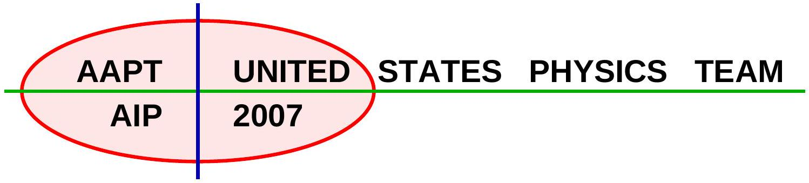

## Solutions to Problems

## Part A

Question 1

a. There is a high degree of symmetry present. Points $b , c$, and $e$ are at the same potential; similarly, points $d , f$, and $g$ are at the same potential. The circuit then reduces to a series connection of three parallel resistor clusters.
The three parallel clusters have effective resistances of $1 \Omega , 8 / 5 \Omega$, and $1 / 3 \Omega$. The effective resistance of the circuit is then $44 / 15 \Omega$.
b. After a long time no current will flow through the branches of the circuits containing capacitors. The circuit then reduces to a parallel connection of three series resistor clusters.
The effective resistance of the circuit is $4 \Omega$, the current through the circuit is then
$$
\begin{equation*}
( 12 \mathrm {~V} ) / ( 4 \Omega ) = 3 \mathrm {~A} . \tag{A1-1}
\end{equation*}
$$
The three branches are identical; each then carries 1 A.
The potential drop across each capacitor is the same as the potential drop across the $8 \Omega$ resistors, so
$$
\begin{equation*}
V _ { C } = ( 1 \mathrm {~A} ) ( 8 \Omega ) = 8 \mathrm {~V} . \tag{A1-2}
\end{equation*}
$$
Finally, the charge on each capacitor is
$$
\begin{equation*}
Q = ( 15 \mu \mathrm {~F} ) ( 8 \mathrm {~V} ) = 120 \mu \mathrm { C } . \tag{A1-3}
\end{equation*}
$$

Question 2
a. Two parts, solved individually.

i. Isochoric compression:
$$
\begin{equation*}
\frac { P _ { f } } { P _ { i } } = \frac { T _ { f } } { T _ { i } } , \tag{A2-1}
\end{equation*}
$$
so
$$
\begin{equation*}
T = \frac { P _ { c r } } { P _ { 0 } } T _ { 0 } . \tag{A2-2}
\end{equation*}
$$

ii. Adiabatic compression:
$$
\begin{equation*}
P V ^ { \gamma } = \mathrm { const } , \tag{A2-3}
\end{equation*}
$$
where $\gamma = C _ { P } / C _ { V } = \left( C _ { V } + 1 \right) / C _ { V } = 5 / 3$ for a monatomic gas. Consequently
$$
\begin{equation*}
P _ { 0 } L _ { 0 } ^ { \gamma } = P _ { c r } L ^ { \gamma } , \tag{A2-4}
\end{equation*}
$$
and then
$$
\begin{equation*}
L = L _ { 0 } \left( \frac { P _ { 0 } } { P _ { c r } } \right) ^ { 5 / 3 } . \tag{A2-5}
\end{equation*}
$$
b. The normal pressure on the bullet comes from
$$
\begin{equation*}
P = \frac { \delta r } { r _ { c } } E . \tag{A2-6}
\end{equation*}
$$
Therefore, the normal force on the bullet is
$$
\begin{equation*}
F _ { N } = \frac { \delta r } { r _ { c } } E \times \left( 2 \pi r _ { c } h \right) , \tag{A2-7}
\end{equation*}
$$
and finally the force of friction is $\mu F _ { N }$. The force due to the pressure difference between the inside of the barrel and the outside must equal the normal force, so
$$
\begin{equation*}
\left( \pi r _ { c } ^ { 2 } \right) \left( P _ { c r } - P _ { 0 } \right) = 2 \pi h \mu \delta r E , \tag{A2-8}
\end{equation*}
$$
and then
$$
\begin{equation*}
P _ { c r } = P _ { 0 } + \frac { 2 \mu E h } { r _ { c } ^ { 2 } } \delta r . \tag{A2-9}
\end{equation*}
$$

## Question 3

a. If the sphere has radius $r$, it has charge
$$
\begin{equation*}
q = \frac { 4 } { 3 } \pi \rho r ^ { 3 } \tag{A3-1}
\end{equation*}
$$
and thus its surface is at electrostatic potential
$$
\begin{equation*}
V = \frac { q } { 4 \pi \epsilon _ { 0 } r } = \frac { \rho r ^ { 2 } } { 3 \epsilon _ { 0 } } \tag{A3-2}
\end{equation*}
$$
To increase the radius by $d r$, an additional charge $d q = 4 \pi r ^ { 2 } d r$ must be brought in from infinity, requiring work
$$
\begin{equation*}
d U = V d q = \frac { 4 \pi r ^ { 4 } \rho ^ { 2 } } { 3 \epsilon _ { 0 } } d r \tag{A3-3}
\end{equation*}
$$
Thus to grow the sphere from $r = 0$ to $r = R$ requires
$$
\begin{equation*}
U = \int _ { 0 } ^ { R } \frac { 4 \pi r ^ { 4 } \rho ^ { 2 } } { 3 \epsilon _ { 0 } } d r = \frac { 4 \pi R ^ { 5 } \rho ^ { 2 } } { 15 \epsilon _ { 0 } } \tag{A3-4}
\end{equation*}
$$

b. Each drop has volume $V _ { d } = \frac { 4 } { 3 } \pi R ^ { 3 }$, so the number of drops is
$$
\begin{equation*}
n = \frac { V _ { f } } { V _ { d } } = \frac { V _ { f } } { \frac { 4 } { 3 } \pi R ^ { 3 } } \tag{A3-5}
\end{equation*}
$$
Since we are ignoring inter-drop forces, the total energy of the drops is simply the sum of the energies of each individual drop:
$$
\begin{equation*}
U _ { e , \text { tot } } = n U = \frac { V _ { f } } { \frac { 4 } { 3 } \pi R ^ { 3 } } \frac { 4 \pi R ^ { 5 } \rho ^ { 2 } } { 15 \epsilon _ { 0 } } = \frac { R ^ { 2 } \rho ^ { 2 } } { 5 \epsilon _ { 0 } } V _ { f } \tag{A3-6}
\end{equation*}
$$
c. Each drop has surface area $4 \pi R ^ { 2 }$ and thus surface tension energy $4 \pi R ^ { 2 } \gamma$. As before, the total energy due to surface tension is just the sum of the energies of the individual drops:
$$
\begin{equation*}
U _ { s , t o t } = 4 \pi R ^ { 2 } \gamma n = 4 \pi R ^ { 2 } \gamma \frac { V _ { f } } { \frac { 4 } { 3 } \pi R ^ { 3 } } = \frac { 3 \gamma } { R } V _ { f } \tag{A3-7}
\end{equation*}
$$
d. The total potential energy from both sources is
$$
\begin{equation*}
U _ { t o t } = \left( \frac { R ^ { 2 } \rho ^ { 2 } } { 5 \epsilon _ { 0 } } + \frac { 3 \gamma } { R } \right) V _ { f } \tag{A3-8}
\end{equation*}
$$
Equilibrium is reached when the total energy is a minimum; since $U \rightarrow \infty$ at both $R \rightarrow 0$ and $R \rightarrow \infty$, it must have an interior minimum.
$$
\begin{equation*}
\frac { d } { d R } U _ { t o t } = \left( \frac { 2 R \rho ^ { 2 } } { 5 \epsilon _ { 0 } } - \frac { 3 \gamma } { R ^ { 2 } } \right) V _ { f } \tag{A3-9}
\end{equation*}
$$
Setting this equal to zero,
$$
\begin{gather*}
\frac { 2 R \rho ^ { 2 } } { 5 \epsilon _ { 0 } } = \frac { 3 \gamma } { R ^ { 2 } }  \tag{A3-10}\\
R ^ { 3 } = \frac { 15 \gamma \epsilon _ { 0 } } { 2 \rho ^ { 2 } }  \tag{A3-11}\\
R = \left( \frac { 15 \gamma \epsilon _ { 0 } } { 2 \rho ^ { 2 } } \right) ^ { \frac { 1 } { 3 } } \tag{A3-12}
\end{gather*}
$$

## Question 4

a. The electric field between the plates is given by $E = V / d$. The force on the charged ball is then $F = E q = V q / d$. The acceleration of the ball is $a = V q / m d$.
Kinematics gives us $d = a t ^ { 2 } / 2$ for the time of flight. So
$$
\begin{equation*}
t = \sqrt { 2 d / a } = \sqrt { 2 m d ^ { 2 } / q V } . \tag{A4-1}
\end{equation*}
$$
b. The kinetic energy collected by a ball will be $K = q V$ as it moves between the plates. That's what will be dissipated.

c. The current is given by $I = \Delta Q / \Delta t$. The total number of balls is $N = n _ { 0 } A$, where $A$ is the surface area of a plate. The charge $\Delta Q$ is then $\Delta Q = n _ { 0 } q A$, so the current is
$$
\begin{equation*}
I = \frac { \Delta Q } { \Delta t } = \frac { n _ { 0 } q A } { \sqrt { 2 m d ^ { 2 } / q V } } . \tag{A4-2}
\end{equation*}
$$
We can't stop here, since this is not in terms of the allowed variables. The problem is $A$ and $d$, but since $C = \epsilon _ { 0 } A / d$, we have
$$
\begin{align*}
I & = \frac { n _ { 0 } q A } { \sqrt { 2 m d ^ { 2 } / q V } }  \tag{A4-3}\\
& = \frac { A } { d } n _ { 0 } q \sqrt { \frac { q V } { 2 m } }  \tag{A4-4}\\
& = \frac { C } { \epsilon _ { 0 } } n _ { 0 } q \sqrt { \frac { q V } { 2 m } } . \tag{A4-5}
\end{align*}
$$
d. $R = V / I$, so
$$
\begin{equation*}
R = \frac { V } { I } = \frac { \epsilon _ { 0 } V } { C n _ { 0 } q } \sqrt { \frac { 2 m } { q V } } . \tag{A4-6}
\end{equation*}
$$
We can simplify, slightly, with
$$
\begin{equation*}
R = \frac { \epsilon _ { 0 } } { C n _ { 0 } q } \sqrt { \frac { 2 m V } { q } } . \tag{A4-7}
\end{equation*}
$$
e. $P = V I$, so
$$
\begin{equation*}
P = V \frac { C } { \epsilon _ { 0 } } n _ { 0 } q \sqrt { \frac { q V } { 2 m } } = \sqrt { \frac { \epsilon _ { 0 } ^ { 2 } n _ { 0 } ^ { 2 } C ^ { 2 } q ^ { 3 } V ^ { 3 } } { 2 m } } . \tag{A4-8}
\end{equation*}
$$

## Part B

Question 1

a. To not slip, from a free-body diagram, we must have
$$
\begin{equation*}
\mu m g \cos \theta \geq m g \sin \theta \tag{B1-1}
\end{equation*}
$$
so
$$
\begin{equation*}
\mu \geq \tan \theta . \tag{B1-2}
\end{equation*}
$$
Therefore $\mu _ { c } = \tan \theta$ and hence
$$
\begin{equation*}
\mu = \frac { \tan \theta } { 2 } . \tag{B1-3}
\end{equation*}
$$
b. In one cycle the energy input into the system is
$$
\begin{equation*}
M g L \sin \theta , \tag{B1-4}
\end{equation*}
$$
the energy of the block dropping.

The energy loss on the way up is

$$
\begin{equation*}
L \mu m g \cos \theta \tag{B1-5}
\end{equation*}
$$

and the energy loss on the way down is

$$
\begin{equation*}
L \mu ( m + M ) g \cos \theta \tag{B1-6}
\end{equation*}
$$

Thus

$$
\begin{equation*}
M g L \sin \theta = L \mu m g \cos \theta + L \mu ( m + M ) g \cos \theta \tag{B1-7}
\end{equation*}
$$

and since $2 \mu \cos \theta = \sin \theta$,

$$
\begin{align*}
M & = \frac { m } { 2 } + \frac { m + M } { 2 }  \tag{B1-8}\\
& = 2 m  \tag{B1-9}\\
R & = M / m = 2 \tag{B1-10}
\end{align*}
$$

c. The period of a mass $m$ oscillating on a spring of spring constant $k$ is
$$
\begin{equation*}
T = 2 \pi \sqrt { \frac { m } { k } } . \tag{B1-11}
\end{equation*}
$$
In this case, the friction force is constant on both the up and down trips, and so each trip is simple harmonic (with different equilibrium points). Hence
$$
\begin{align*}
T _ { 0 } & = \pi \sqrt { \frac { m } { k } } + \pi \sqrt { \frac { 3 m } { k } } ,  \tag{B1-12}\\
T ^ { \prime } & = 2 \pi \sqrt { \frac { m } { k } } ,  \tag{B1-13}\\
T _ { 0 } / T ^ { \prime } & = \frac { 1 + \sqrt { 3 } } { 2 } . \tag{B1-14}
\end{align*}
$$

d. As mentioned in part (c), both the up and down trips are simple harmonic, this time with a mass of $m$ both ways. The equilibrium points for the two trips are different, however. On the up trip, the equilibrium point is clearly at a distance $L / 2$ from $B$, since the plate stops at both $B$ and $A$ and hence those are the endpoints of the oscillation and the equilibrium is halfway between. For the trip down, the equilibrium point will shift by a distance $y$ such that

$$
\begin{equation*}
k y = 2 \mu m g \cos \theta = m g \sin \theta \tag{B1-15}
\end{equation*}
$$

because $2 \mu m g \cos \theta$ is the difference between the friction forces on the trip up and the trip down.

The place where the plate finally comes to a stop is the first place that is at the end of an oscillation (either up or down) and where the total force being exerted by gravity and the spring is less than the maximal force of friction. For that to happen, the plate needs to not have gone past the other equilibrium point during that oscillation.
So we start by determining where the endpoints of the oscillations are. For the first trip up these are $B$ and $A$. For the following trip down, the plate stops at a distance of $( 2 m g \sin \theta ) / k$ from $B$ (because the equilibrium shifts up by $( m g \sin \theta ) / k$. For the following trip up, the

plate stops a distance $L - ( 2 m g \sin \theta ) / k$ from $B$, since the equilibrium point is again in the middle of the incline. And so forth.

Thus the stopping points are located at

$$
\begin{equation*}
n ( 2 m g \sin \theta ) / k \text { and } L - n ( 2 m g \sin \theta ) / k \tag{B1-16}
\end{equation*}
$$

for integer $n$. The plate will stop permanently once either

$$
\begin{equation*}
n ( 2 m g \sin ) / k > L / 2 \tag{B1-17}
\end{equation*}
$$

or

$$
\begin{equation*}
L - n ( 2 m g \sin \theta ) / k < L / 2 + ( m g \sin \theta ) / k , \tag{B1-18}
\end{equation*}
$$

whichever happens first. (The first condition corresponds to going down and ending up above the midpoint at the end of the down trip, the second condition corresponds to going up and stopping below the upper equilibrium.) The second condition can be rewritten as

$$
\begin{equation*}
\left( n + \frac { 1 } { 2 } \right) ( 2 m g \sin \theta ) / k > L / 2 . \tag{B1-19}
\end{equation*}
$$

Question 2
a. Magnetic Moments

i. From Coulomb's Law,
$$
\begin{equation*}
F = \frac { e ^ { 2 } } { 4 \pi \epsilon _ { 0 } R ^ { 2 } } \tag{B2-1}
\end{equation*}
$$
ii. For circular motion,
$$
\begin{equation*}
F = \frac { m _ { e } v ^ { 2 } } { R } = m _ { e } R \omega _ { 0 } ^ { 2 } , \tag{B2-2}
\end{equation*}
$$
The force is provided by the Coulomb force, so
$$
\begin{align*}
m _ { e } R \omega _ { 0 } ^ { 2 } & = \frac { e ^ { 2 } } { 4 \pi \epsilon _ { 0 } R ^ { 2 } } ,  \tag{B2-3}\\
\omega _ { 0 } & = \sqrt { \frac { e ^ { 2 } } { 4 \pi \epsilon _ { 0 } m _ { e } R ^ { 3 } } } \tag{B2-4}
\end{align*}
$$
iii. From the law of Biot and Savart,
$$
\begin{align*}
\overrightarrow { B _ { e } } & = \frac { \mu _ { 0 } i } { 4 \pi } \oint \frac { d \vec { s } \times \vec { r } } { r ^ { 3 } } ,  \tag{B2-5}\\
B _ { e } & = \frac { \mu _ { 0 } i } { 4 \pi } 2 \pi R \frac { R } { \left( z ^ { 2 } + r ^ { 2 } \right) ^ { 3 / 2 } } ,  \tag{B2-6}\\
& \approx \frac { \mu _ { 0 } i R ^ { 2 } } { 2 z ^ { 3 } } . \tag{B2-7}
\end{align*}
$$
For the current, $i$, we can write
$$
\begin{equation*}
i = \frac { q } { t } = \frac { e \omega _ { 0 } } { 2 \pi } . \tag{B2-8}
\end{equation*}
$$
Then
$$
\begin{equation*}
B _ { e } = \frac { \mu _ { 0 } e \omega _ { 0 } R ^ { 2 } } { 4 \pi z ^ { 3 } } . \tag{B2-9}
\end{equation*}
$$
Copyright ©2007 American Association of Physics Teachers

iv. By substitution,
$$
\begin{equation*}
m = \frac { e \omega _ { 0 } R } { 2 } . \tag{B2-10}
\end{equation*}
$$
b. Diamagnetism
    i. If half go one way and half go the other, $M = 0$.

ii. Additional force from magnetism,

$$
\begin{equation*}
F _ { B } = q v B _ { 0 } = e R \omega B _ { 0 } \tag{B2-11}
\end{equation*}
$$

modifies previous central force problem to give

$$
\begin{equation*}
m _ { e } R \omega ^ { 2 } = \frac { e ^ { 2 } } { 4 \pi \epsilon _ { 0 } R ^ { 2 } } \pm e R \omega _ { 0 } B _ { 0 } , \tag{B2-12}
\end{equation*}
$$

where the positive sign corresponds to anticlockwise motion, the negative to clockwise motion.
A little math,

$$
\begin{align*}
m _ { e } R \left( \omega ^ { 2 } - \omega _ { 0 } ^ { 2 } \right) & = \pm e R \omega B _ { 0 }  \tag{B2-13}\\
m _ { e } \left( \omega - \omega _ { 0 } \right) \left( \omega + \omega _ { 0 } \right) & = \pm e \omega B _ { 0 }  \tag{B2-14}\\
m _ { e } ( \Delta \omega ) \left( 2 \omega _ { 0 } \right) & = \pm e \omega _ { 0 } B _ { 0 } \tag{B2-15}
\end{align*}
$$

where in the last line we have used the approximation $\omega \approx \omega _ { 0 }$. Then

$$
\begin{equation*}
\Delta \omega = \pm \frac { e B _ { 0 } } { 2 m _ { e } } . \tag{B2-16}
\end{equation*}
$$

iii. The emf is given by
$$
\begin{equation*}
\mathcal { E } = n \frac { \Delta \Phi } { \Delta t } = \frac { \Delta n } { \Delta t } \Phi , \tag{B2-17}
\end{equation*}
$$
but $\Delta n / \Delta t$ is a measure of the number of turns made by the electron in a time interval $\Delta t$, so
$$
\begin{equation*}
\frac { \Delta n } { \Delta t } = \frac { \omega _ { 0 } R } { 2 \pi R } = \frac { \omega _ { 0 } } { 2 \pi } . \tag{B2-18}
\end{equation*}
$$
Then
$$
\begin{equation*}
\mathcal { E } = \frac { \omega _ { 0 } } { 2 \pi } B _ { 0 } \pi R ^ { 2 } = \frac { 1 } { 2 } \omega _ { 0 } b _ { 0 } R ^ { 2 } . \tag{B2-19}
\end{equation*}
$$

iv. The change in kinetic energy is given by

$$
\begin{align*}
\Delta K & = \Delta \left( \frac { 1 } { 2 } m _ { e } \omega ^ { 2 } R ^ { 2 } \right) ,  \tag{B2-20}\\
& = m _ { e } R ^ { 2 } \omega \Delta \omega ,  \tag{B2-21}\\
& \approx m _ { e } R ^ { 2 } \omega _ { 0 } \Delta \omega ,  \tag{B2-22}\\
& = m _ { e } \omega _ { 0 } R ^ { 2 } \left( \pm \frac { e B _ { 0 } } { 2 m _ { e } } \right) ,  \tag{B2-23}\\
& = e \mathcal { E } . \tag{B2-24}
\end{align*}
$$

v. $\Delta M = N \delta m$, where $N$ is the number of atoms, and $\Delta m$ the change in magnetic moment in each. The change is
$$
\begin{align*}
\Delta m & = \Delta \left( \frac { e \omega _ { 0 } R } { 2 } \right) .  \tag{B2-25}\\
& = \frac { e R } { 2 } \Delta \omega ,  \tag{B2-26}\\
& = \frac { e ^ { 2 } R ^ { 2 } B _ { 0 } } { 4 m _ { e } } , \tag{B2-27}
\end{align*}
$$
so
$$
\begin{equation*}
\Delta M = N \frac { e ^ { 2 } R ^ { 2 } B _ { 0 } } { 4 m _ { e } } . \tag{B2-28}
\end{equation*}
$$
vi. Repelled, by Lenz's law.
