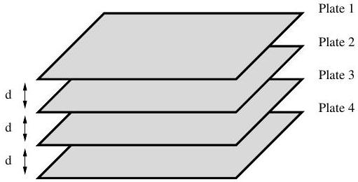
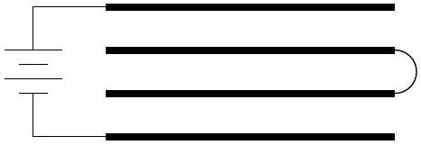
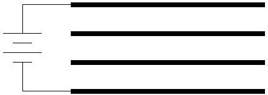
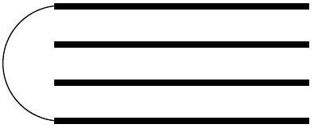
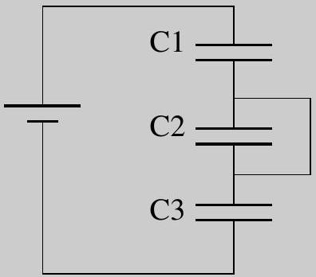
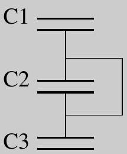
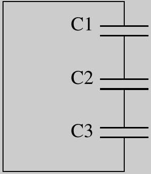
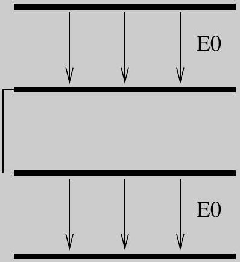
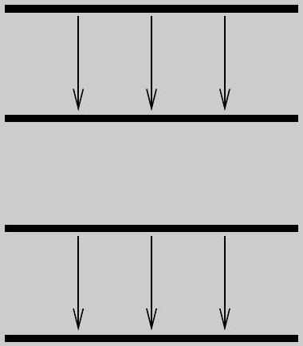
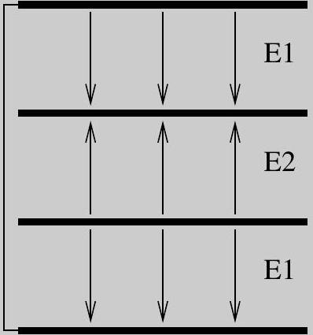

## Question A1

Four square metal plates of area $A$ are arranged at an even spacing $d$ as shown in the diagram. (Assume that $A \gg d ^ { 2 }$.)

Plates 1 and 4 are first connected to a voltage source of magnitude $V _ { 0 }$, with plate 1 positive; plates 2 and 3 are then connected together with a wire. The wire is subsequently removed. Finally, the voltage source attached between plates 1 and 4 is replaced with a wire. The steps are summarized in the diagrams below.

Step 1

Step 2

Step 3

Find the resulting potential difference $\Delta V _ { 12 }$ between plates 1 and 2; like wise find $\Delta V _ { 23 }$ and $\Delta V _ { 34 }$, defined similarly.

Assume, in each case, that a positive potential difference means that the top plate is at a higher potential than the bottom plate.

## Solution

We treat the plates as three capacitors in series. Each has an identical capacitance $C$. The figure below then show the three steps.

Since $C _ { 2 }$ is shorted out originally, then effectively there are only two capacitors in series, so the voltage drop across each is $V _ { 0 } / 2$, where the a positive potential difference means that the top plate of any given capacitor is positive. The top plate of $C _ { 1 }$ will then have a positive charge of $q _ { 0 } = C V _ { 0 } / 2$. Note that this means that the bottom plate of the top capacitor will have a negative charge of $- q _ { 0 }$. Removing the shorting wire across $C _ { 2 }$ will not change the charges or potential drops across the other two capacitors. Removing the source $V _ { 0 }$ will also make no difference.

Shorting the top plate of $C _ { 1 }$ with the bottom plate of $C _ { 3 }$ will make a difference. Positive charge will flow out of top plate of $C _ { 1 }$ into the bottom plate of $C _ { 3 }$. Also, negative charge will flow out of the bottom plate of $C _ { 1 }$ into the top plate of $C _ { 2 }$. The result is that $C _ { 1 }$ will acquire a potential difference of $V _ { 1 } , C _ { 2 }$ a potential

difference of $V _ { 2 }$, and $C _ { 3 }$ a potential difference of $V _ { 3 }$. Let the final charge on the top plate of each capacitor also be labeled as $q _ { 1 } , q _ { 2 }$, and $q _ { 3 }$.

The last figure implies that

$$
V _ { 1 } + V _ { 2 } + V _ { 3 } = 0 .
$$

By symmetry, we have

$$
V _ { 1 } = V _ { 3 } .
$$

so

$$
2 V _ { 1 } = - V _ { 2 } .
$$

By charge conservation between the bottom plate of $C _ { 1 }$ and the top plate of $C _ { 2 }$ we have

$$
- q _ { 0 } = - q _ { 1 } + q _ { 2 } .
$$

But $q = C V$, so

$$
- \frac { 1 } { 2 } V _ { 0 } = - V _ { 1 } + V _ { 2 }
$$

Combining the above we get

$$
\begin{aligned}
- \frac { 1 } { 2 } V _ { 0 } & = \frac { 1 } { 2 } V _ { 2 } + V _ { 2 } , \\
- \frac { 1 } { 3 } V _ { 0 } & = V _ { 2 } .
\end{aligned}
$$

Finally, solving for $V _ { 1 }$, we get $V _ { 1 } = V _ { 0 } / 6$.
Alternatively, we could focus on the plate arrangement and the fact that across a boundary $\left| \Delta E _ { \perp } \right| =$ $\left| \sigma / \epsilon _ { 0 } \right|$, a consequence of Gauss's Law. Also, we have, for parallel plate configurations, $| \Delta V | = | E d |$. Since $\epsilon _ { 0 }$ and $d$ are the same for each of the three regions, it is sufficient to simply look at the electric fields.

In the first picture we require that $2 E _ { 0 } = V _ { 0 } / d$. The charge density on the second plate requires that $\Delta E = E _ { 0 }$. In the last picture we have $2 E _ { 1 } + E _ { 2 } = 0$, since the potential between the top plate and the bottom plate is zero. But we also have, on the second plate, $\Delta E = E _ { 1 } - E _ { 2 }$. Combining, $E _ { 0 } = - \frac { 1 } { 2 } E _ { 2 } - E _ { 2 } = - \frac { 3 } { 2 } E _ { 2 }$, and therefore $V _ { 2 } = - \frac { 1 } { 3 } V _ { 0 }$, and $V _ { 1 } = V _ { 0 } / 6$.
