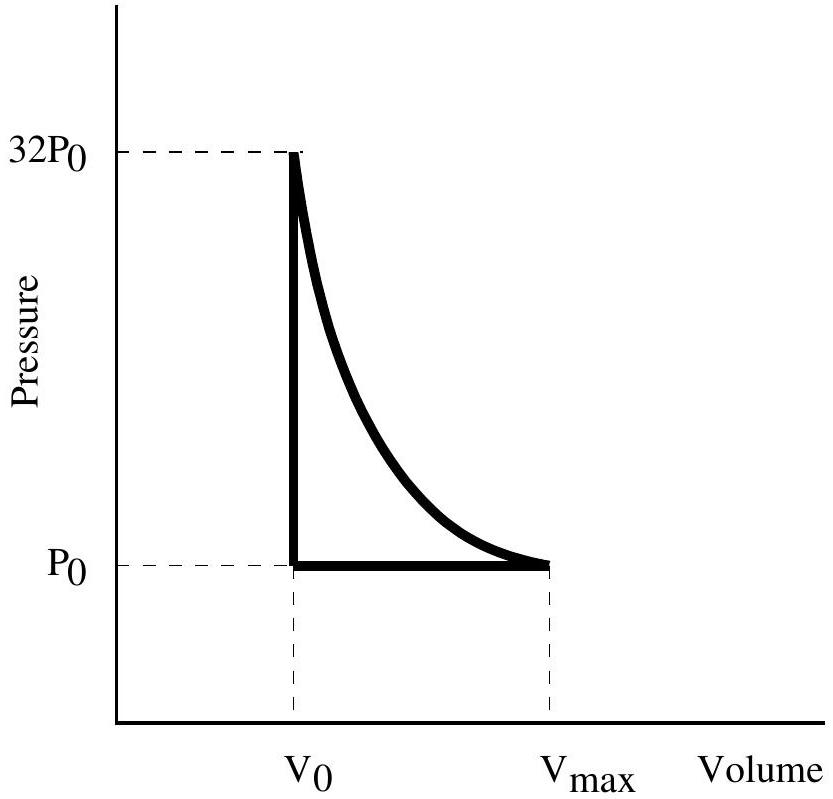

## Question A2

A simple heat engine consists of a moveable piston in a cylinder filled with an ideal monatomic gas. Initially the gas in the cylinder is at a pressure $P _ { 0 }$ and volume $V _ { 0 }$. The gas is slowly heated at constant volume. Once the pressure reaches $32 P _ { 0 }$ the piston is released, allowing the gas to expand so that no heat either enters or escapes the gas as the piston moves. Once the pressure has returned to $P _ { 0 }$ the outside of the cylinder is cooled back to the original temperature, keeping the pressure constant. For the monatomic ideal gas you should assume that the molar heat capacity at constant volume is given by $C _ { V } = \frac { 3 } { 2 } R$, where $R$ is the ideal

gas constant. You may express your answers in fractional form or as decimals. If you choose decimals, keep three significant figures in your calculations. The diagram below is not necessarily drawn to scale.

a. Let $V _ { \text {max } }$ be the maximum volume achieved by the gas during the cycle. What is $V _ { \text {max } }$ in terms of $V _ { 0 }$ ? If you are unable to solve this part of the problem, you may express your answers to the remaining parts in terms of $V _ { \text {max } }$ without further loss of points.
b. In terms of $P _ { 0 }$ and $V _ { 0 }$ determine the heat added to the gas during a complete cycle.
c. In terms of $P _ { 0 }$ and $V _ { 0 }$ determine the heat removed from the gas during a complete cycle.
d. What is the efficiency of this cycle?

## Solution

a. Using the fact that $P V ^ { \gamma }$ is constant on an adiabat,
$$
V _ { \max } = V _ { 0 } ( 32 ) ^ { 1 / \gamma } = 8 V _ { 0 }
$$
where we used $\gamma = 5 / 3$ for a monatomic gas.
b. The heat is added during the initial heating phase, where
$$
Q _ { \text {in } } = C _ { V } \Delta T = \frac { 3 } { 2 } n R \Delta T = \frac { 3 } { 2 } n R \left( 32 T _ { 0 } - T _ { 0 } \right)
$$
where we used $P \propto T$ at constant volume. Finally, using the ideal gas law $P _ { 0 } V _ { 0 } = n R T _ { 0 }$,
$$
Q _ { \mathrm { in } } = \frac { 93 } { 2 } P _ { 0 } V _ { 0 } .
$$
c. The heat is removed during the final cooling at constant pressure, where
$$
Q _ { \mathrm { out } } = C _ { P } \Delta T = \frac { 5 } { 2 } n R \Delta T = \frac { 5 } { 2 } n R \left( 8 T _ { 0 } - T _ { 0 } \right)
$$
where we used $T \propto V$ at constant pressure. Again by the ideal gas law,
$$
Q _ { \mathrm { out } } = \frac { 35 } { 2 } P _ { 0 } V _ { 0 } .
$$

d. The efficiency is
$$
\eta = \frac { W } { Q _ { \text {in } } } = \frac { Q _ { \text {in } } - Q _ { \text {out } } } { Q _ { \text {in } } } = \frac { 58 } { 93 } .
$$
