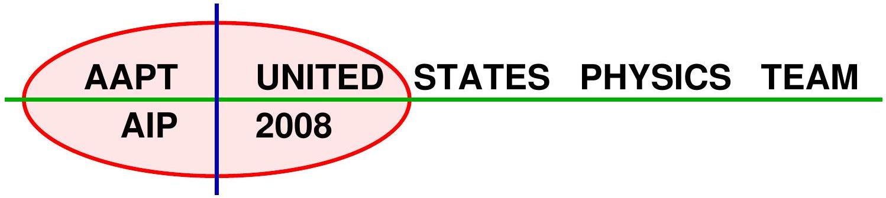
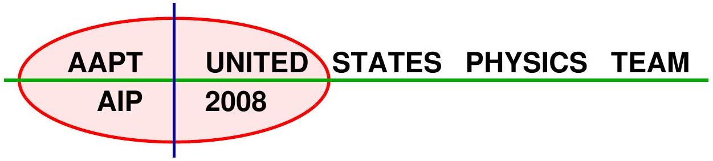
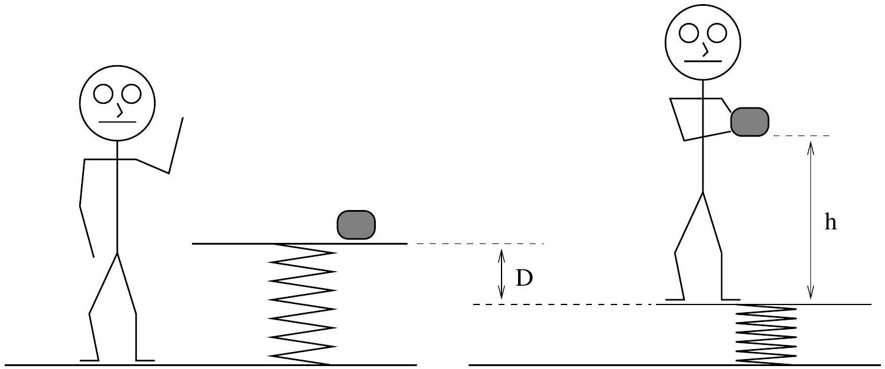
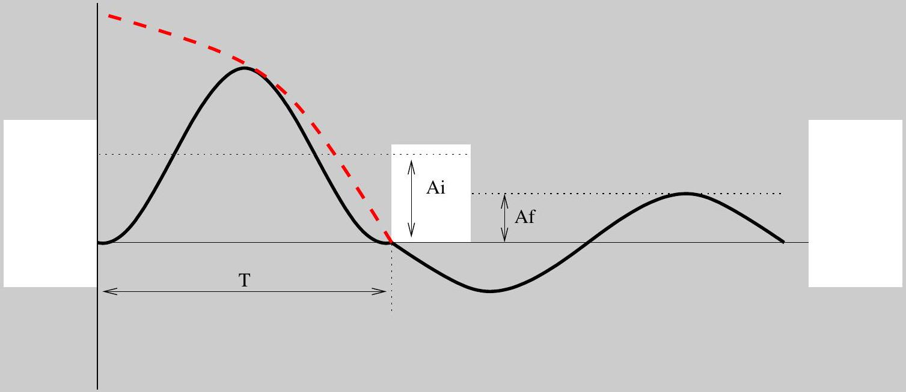
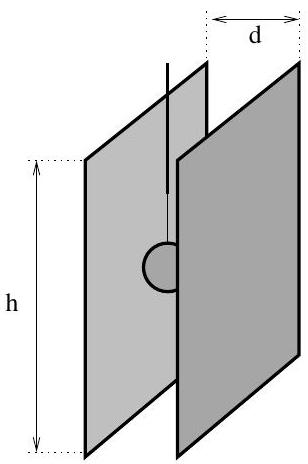
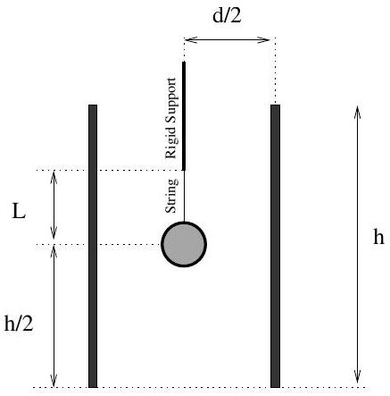
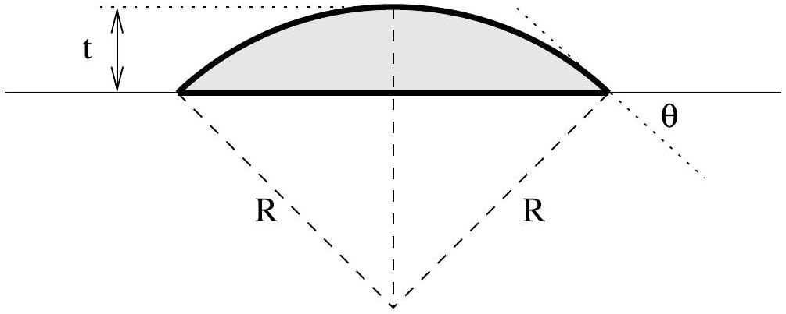

## Semifinal Exam

## DO NOT DISTRIBUTE THIS PAGE

## Important Instructions for the Exam Supervisor

- This examination consists of three parts.
- Part A has four questions and is allowed 90 minutes.
- Part B has two questions and is allowed 90 minutes.
- Part C has one question and is allowed 20 minutes. The answer for Part C will not be used for team selection, but will be used for special recognition from the Optical Society of America.
- The first page that follows is a cover sheet. Examinees may keep the cover sheet for all three parts of the exam.
- The three parts are then identified by the center header on each page. Examinees are only allowed to do one part at a time, and may not work on other parts, even if they have time remaining.
- Allow 90 minutes to complete part A. Do not let students look at part B or part C. Collect the answers to part A before allowing the students to begin part B. Examinees are allowed a 10 to 15 minutes break between parts A and B.
- Allow 90 minutes to complete part B. Do not let students look at part C or go back to part A. Collect the answers to part B before allowing the students to begin part C. Examinees are allowed a 10 to 15 minutes break between parts B and C.
- Allow 20 minutes to complete part C. This part is optional; scores on part C will not be used to select the US Team. Students may not go back to part A or B.
- Ideally the test supervisor will divide the question paper into 4 parts: the cover sheet (page 2), part A (pages 3-7), part B (pages 8-10), and part C (page 11). Students should be provided the parts individually, although they may keep the cover sheet.
- The supervisor must collect all examination questions, including the cover sheet, at the end of the exam, as well as any scratch paper used by the students. Examinees may not take the exam questions. The examination questions may be returned to the students after March 31, 2008.
- Students are allowed calculators, but they may not use symbolic math, programming, or graphic features of these calculators.
- Please provide the students with graph paper.

## Semifinal Exam

## INSTRUCTIONS

## DO NOT OPEN THIS TEST UNTIL YOU ARE TOLD TO BEGIN

- Work Part A first. You have 90 minutes to complete all four problems. Each question is worth 25 points. Do not look at parts B or C during this time.
- After you have completed Part A you may take a break.
- Then work Part B. You have 90 minutes to complete both problems. Each question is worth 50 points. Do not look at parts A or C during this time.
- Show all your work. Partial credit will be given.
- Start each question on a new sheet of paper. Put your school ID number, your name, the question number and the page number/total pages for this problem, in the upper right hand corner of each page. For example,

School ID \#
Doe, Jamie
A1-1/3

- A hand-held calculator may be used. Its memory must be cleared of data and programs. You may use only the basic functions found on a simple scientific calculator. Calculators may not be shared. Cell phones, PDA's or cameras may not be used during the exam or while the exam papers are present. You may not use any tables, books, or collections of formulas.
- Questions with the same point value are not necessarily of the same difficulty.
- Part C is an optional part of the test. You will be given 20 additional minutes to complete part C. Your score on part C will not affect the selection for the US Team, but can be used for special prizes and recognition to be awarded by the Optical Society of America.
- In order to maintain exam security, do not communicate any information about the questions (or their answers/solutions) on this contest until after March 31, 2008.

Possibly Useful Information. You may use this sheet for all three parts of the exam.

$$
\begin{array} { l l }
g = 9.8 \mathrm {~N} / \mathrm { kg } & G = 6.67 \times 10 ^ { - 11 } \mathrm {~N} \cdot \mathrm {~m} ^ { 2 } / \mathrm { kg } ^ { 2 } \\
k = 1 / 4 \pi \epsilon _ { 0 } = 8.99 \times 10 ^ { 9 } \mathrm {~N} \cdot \mathrm {~m} ^ { 2 } / \mathrm { C } ^ { 2 } & k _ { \mathrm { m } } = \mu _ { 0 } / 4 \pi = 10 ^ { - 7 } \mathrm {~T} \cdot \mathrm {~m} / \mathrm { A } \\
c = 3.00 \times 10 ^ { 8 } \mathrm {~m} / \mathrm { s } & k _ { \mathrm { B } } = 1.38 \times 10 ^ { - 23 } \mathrm {~J} / \mathrm { K } \\
N _ { \mathrm { A } } = 6.02 \times 10 ^ { 23 } ( \mathrm {~mol} ) ^ { - 1 } & R = N _ { \mathrm { A } } k _ { \mathrm { B } } = 8.31 \mathrm {~J} / ( \mathrm { mol } \cdot \mathrm {~K} ) \\
\sigma = 5.67 \times 10 ^ { - 8 } \mathrm {~J} / \left( \mathrm { s } \cdot \mathrm {~m} ^ { 2 } \cdot \mathrm {~K} \right) & e = 1.602 \times 10 ^ { - 19 } \mathrm { C } \\
1 \mathrm { eV } = 1.602 \times 10 ^ { - 19 } \mathrm {~J} & h = 6.63 \times 10 ^ { - 34 } \mathrm {~J} \cdot \mathrm {~s} = 4.14 \times 10 ^ { - 15 } \mathrm { eV } \cdot \mathrm {~s} \\
m _ { e } = 9.109 \times 10 ^ { - 31 } \mathrm {~kg} = 0.511 \mathrm { MeV } / \mathrm { c } ^ { 2 } & ( 1 + x ) ^ { n } \approx 1 + n x \text { for } | x | \ll 1 \\
\sin \theta \approx \theta - \frac { 1 } { 6 } \theta ^ { 3 } \text { for } | \theta | \ll 1 & \cos \theta \approx 1 - \frac { 1 } { 2 } \theta ^ { 2 } \text { for } | \theta | \ll 1
\end{array}
$$

## Part A

## Question A1

Four square metal plates of area $A$ are arranged at an even spacing $d$ as shown in the diagram. (Assume that $A \gg d ^ { 2 }$.)

Plates 1 and 4 are first connected to a voltage source of magnitude $V _ { 0 }$, with plate 1 positive; plates 2 and 3 are then connected together with a wire. The wire is subsequently removed. Finally, the voltage source attached between plates 1 and 4 is replaced with a wire. The steps are summarized in the diagrams below.

Step 1

Step 2

Step 3

Find the resulting potential difference $\Delta V _ { 12 }$ between plates 1 and 2; like wise find $\Delta V _ { 23 }$ and $\Delta V _ { 34 }$, defined similarly.

Assume, in each case, that a positive potential difference means that the top plate is at a higher potential than the bottom plate.

## Solution

We treat the plates as three capacitors in series. Each has an identical capacitance $C$. The figure below then show the three steps.

Since $C _ { 2 }$ is shorted out originally, then effectively there are only two capacitors in series, so the voltage drop across each is $V _ { 0 } / 2$, where the a positive potential difference means that the top plate of any given capacitor is positive. The top plate of $C _ { 1 }$ will then have a positive charge of $q _ { 0 } = C V _ { 0 } / 2$. Note that this means that the bottom plate of the top capacitor will have a negative charge of $- q _ { 0 }$. Removing the shorting wire across $C _ { 2 }$ will not change the charges or potential drops across the other two capacitors. Removing the source $V _ { 0 }$ will also make no difference.

Shorting the top plate of $C _ { 1 }$ with the bottom plate of $C _ { 3 }$ will make a difference. Positive charge will flow out of top plate of $C _ { 1 }$ into the bottom plate of $C _ { 3 }$. Also, negative charge will flow out of the bottom plate of $C _ { 1 }$ into the top plate of $C _ { 2 }$. The result is that $C _ { 1 }$ will acquire a potential difference of $V _ { 1 } , C _ { 2 }$ a potential

difference of $V _ { 2 }$, and $C _ { 3 }$ a potential difference of $V _ { 3 }$. Let the final charge on the top plate of each capacitor also be labeled as $q _ { 1 } , q _ { 2 }$, and $q _ { 3 }$.

The last figure implies that

$$
V _ { 1 } + V _ { 2 } + V _ { 3 } = 0 .
$$

By symmetry, we have

$$
V _ { 1 } = V _ { 3 } .
$$

so

$$
2 V _ { 1 } = - V _ { 2 } .
$$

By charge conservation between the bottom plate of $C _ { 1 }$ and the top plate of $C _ { 2 }$ we have

$$
- q _ { 0 } = - q _ { 1 } + q _ { 2 } .
$$

But $q = C V$, so

$$
- \frac { 1 } { 2 } V _ { 0 } = - V _ { 1 } + V _ { 2 }
$$

Combining the above we get

$$
\begin{aligned}
- \frac { 1 } { 2 } V _ { 0 } & = \frac { 1 } { 2 } V _ { 2 } + V _ { 2 } , \\
- \frac { 1 } { 3 } V _ { 0 } & = V _ { 2 } .
\end{aligned}
$$

Finally, solving for $V _ { 1 }$, we get $V _ { 1 } = V _ { 0 } / 6$.
Alternatively, we could focus on the plate arrangement and the fact that across a boundary $\left| \Delta E _ { \perp } \right| =$ $\left| \sigma / \epsilon _ { 0 } \right|$, a consequence of Gauss's Law. Also, we have, for parallel plate configurations, $| \Delta V | = | E d |$. Since $\epsilon _ { 0 }$ and $d$ are the same for each of the three regions, it is sufficient to simply look at the electric fields.

In the first picture we require that $2 E _ { 0 } = V _ { 0 } / d$. The charge density on the second plate requires that $\Delta E = E _ { 0 }$. In the last picture we have $2 E _ { 1 } + E _ { 2 } = 0$, since the potential between the top plate and the bottom plate is zero. But we also have, on the second plate, $\Delta E = E _ { 1 } - E _ { 2 }$. Combining, $E _ { 0 } = - \frac { 1 } { 2 } E _ { 2 } - E _ { 2 } = - \frac { 3 } { 2 } E _ { 2 }$, and therefore $V _ { 2 } = - \frac { 1 } { 3 } V _ { 0 }$, and $V _ { 1 } = V _ { 0 } / 6$.

## Question A2

A simple heat engine consists of a moveable piston in a cylinder filled with an ideal monatomic gas. Initially the gas in the cylinder is at a pressure $P _ { 0 }$ and volume $V _ { 0 }$. The gas is slowly heated at constant volume. Once the pressure reaches $32 P _ { 0 }$ the piston is released, allowing the gas to expand so that no heat either enters or escapes the gas as the piston moves. Once the pressure has returned to $P _ { 0 }$ the outside of the cylinder is cooled back to the original temperature, keeping the pressure constant. For the monatomic ideal gas you should assume that the molar heat capacity at constant volume is given by $C _ { V } = \frac { 3 } { 2 } R$, where $R$ is the ideal

gas constant. You may express your answers in fractional form or as decimals. If you choose decimals, keep three significant figures in your calculations. The diagram below is not necessarily drawn to scale.

a. Let $V _ { \text {max } }$ be the maximum volume achieved by the gas during the cycle. What is $V _ { \text {max } }$ in terms of $V _ { 0 }$ ? If you are unable to solve this part of the problem, you may express your answers to the remaining parts in terms of $V _ { \text {max } }$ without further loss of points.
b. In terms of $P _ { 0 }$ and $V _ { 0 }$ determine the heat added to the gas during a complete cycle.
c. In terms of $P _ { 0 }$ and $V _ { 0 }$ determine the heat removed from the gas during a complete cycle.
d. What is the efficiency of this cycle?

## Solution

a. Using the fact that $P V ^ { \gamma }$ is constant on an adiabat,
$$
V _ { \max } = V _ { 0 } ( 32 ) ^ { 1 / \gamma } = 8 V _ { 0 }
$$
where we used $\gamma = 5 / 3$ for a monatomic gas.
b. The heat is added during the initial heating phase, where
$$
Q _ { \text {in } } = C _ { V } \Delta T = \frac { 3 } { 2 } n R \Delta T = \frac { 3 } { 2 } n R \left( 32 T _ { 0 } - T _ { 0 } \right)
$$
where we used $P \propto T$ at constant volume. Finally, using the ideal gas law $P _ { 0 } V _ { 0 } = n R T _ { 0 }$,
$$
Q _ { \mathrm { in } } = \frac { 93 } { 2 } P _ { 0 } V _ { 0 } .
$$
c. The heat is removed during the final cooling at constant pressure, where
$$
Q _ { \mathrm { out } } = C _ { P } \Delta T = \frac { 5 } { 2 } n R \Delta T = \frac { 5 } { 2 } n R \left( 8 T _ { 0 } - T _ { 0 } \right)
$$
where we used $T \propto V$ at constant pressure. Again by the ideal gas law,
$$
Q _ { \mathrm { out } } = \frac { 35 } { 2 } P _ { 0 } V _ { 0 } .
$$

d. The efficiency is
$$
\eta = \frac { W } { Q _ { \text {in } } } = \frac { Q _ { \text {in } } - Q _ { \text {out } } } { Q _ { \text {in } } } = \frac { 58 } { 93 } .
$$

## Question A3

A certain planet of radius $R$ is composed of a uniform material that, through radioactive decay, generates a net power $P$. This results in a temperature differential between the inside and outside of the planet as heat is transfered from the interior to the surface.

The rate of heat transfer is governed by the thermal conductivity. The thermal conductivity of a material is a measure of how quickly heat flows through that material in response to a temperature gradient. Specifically, consider a thin slab of material of area $A$ and thickness $\Delta x$ where one surface is hotter than the other by an amount $\Delta T$. Suppose that an amount of heat $\Delta Q$ flows through the slab in a time $\Delta t$. The thermal conductivity $k$ of the material is then

$$
k = \frac { \Delta Q } { \Delta t } \frac { 1 } { A } \frac { \Delta x } { \Delta T } .
$$

It is found that $k$ is approximately constant for many materials; assume that it is constant for the planet.
For the following assume that the planet is in a steady state; temperature might depend on position, but does not depend on time.

a. Find an expression for the temperature of the surface of the planet assuming blackbody radiation, an emissivity of 1 , and no radiation incident on the planet surface. You may express your answer in terms of any of the above variables and the Stephan-Boltzmann constant $\sigma$.
b. Find an expression for the temperature difference between the surface of the planet and the center of the planet. You may express your answer in terms of any of the above variables; you do not need to answer part (a) to be able to answer this part.

## Solution

a. The Stefan-Boltzmann law states that
$$
P = \sigma A T _ { s } ^ { 4 }
$$
where $A$ is the surface area of the planet, and $T _ { s }$ the temperature at the surface. Then
$$
T _ { s } = \left( \frac { P } { 4 \pi \sigma R ^ { 2 } } \right) ^ { 1 / 4 } .
$$
b. By symmetry, the temperature depends only on the distance from the center. Then the definition of $k$ gives for a spherical shell of thickness $d r$
$$
k = \frac { \Delta Q } { \Delta t } \frac { 1 } { 4 \pi r ^ { 2 } } \frac { d r } { d T } .
$$
The heat through the shell depends on the power radiated from within the shell. Since the planet is uniform, this depends on the volume according to
$$
\frac { \Delta Q } { \Delta t } = P \frac { \frac { 4 } { 3 } \pi r ^ { 3 } } { \frac { 4 } { 3 } \pi R ^ { 3 } } = P \frac { r ^ { 3 } } { R ^ { 3 } }
$$

so that rearrangement yields

$$
d T = \frac { P } { 4 \pi k R ^ { 3 } } r d r
$$

Integrating between the center and the surface,

$$
\Delta T = \frac { P } { 8 \pi k R } .
$$

## Question A4

A tape recorder playing a single tone of frequency $f _ { 0 }$ is dropped from rest at a height $h$. You stand directly underneath the tape recorder and measure the frequency observed as a function of time. Here $t = 0 \mathrm {~s}$ is the time at which the tape recorder was dropped.

| $t ( \mathrm {~s} )$ | $f ( \mathrm {~Hz} )$ |
| :--- | :--- |
| 2.0 | 581 |
| 4.0 | 619 |
| 6.0 | 665 |
| 8.0 | 723 |
| 10.0 | 801 |

The acceleration due to gravity is $g = 9.80 \mathrm {~m} / \mathrm { s } ^ { 2 }$ and the speed of sound in air is $v _ { \text {snd } } = 340 \mathrm {~m} / \mathrm { s }$. Ignore air resistance. You might need to use the Doppler shift formula for co-linear motion of sources and observers in still air,

$$
f = f _ { 0 } \frac { v _ { \mathrm { snd } } \pm v _ { \mathrm { obs } } } { v _ { \mathrm { snd } } \pm v _ { \mathrm { src } } }
$$

where $f _ { 0 }$ is the emitted frequency as determined by the source, $f$ is the frequency as detected by the observer, and $v _ { \text {snd } } , v _ { \text {src } }$, and $v _ { \text {obs } }$ are the speed of sound in air, the speed of the source, and the speed of the observer. The positive and negative signs are dependent upon the relative directions of the motions of the source and the observer.

a. Determine the frequency measured on the ground at time $t$, in terms of $f _ { 0 } , g , h$, and $v _ { \text {snd } }$. Consider only the case where the falling tape recorder doesn't exceed the speed of sound $v _ { \text {snd } }$.
b. Verify graphically that your result is consistent with the provided data.
c. What (numerically) is the frequency played by the tape recorder?
d. From what height $h$ was the tape recorder dropped?

## Solution

a. The position of the tape recorder above the ground at a time $t$ is given by
$$
y = h - \frac { 1 } { 2 } g t ^ { 2 }
$$
and the speed of the tape recorder is given by
$$
v _ { \mathrm { src } } = - g t
$$

The observer "hears" the sound emitted from the tape recorder a time $\delta t$ earlier, since it takes time for the sound to travel to the listener. In this case,

$$
y = v _ { \mathrm { snd } } \delta t
$$

So at time $t$ the listener is hearing the tape recorder when it had emitted at time $t ^ { \prime } = t - \delta t$, or

$$
t ^ { \prime } = t - \frac { h } { v _ { \mathrm { snd } } } + \frac { g } { 2 v _ { \mathrm { snd } } } \left( t ^ { \prime } \right) ^ { 2 }
$$

Solve this for $t ^ { \prime }$, first by rearranging,

$$
\frac { g } { 2 } \left( t ^ { \prime } \right) ^ { 2 } - v _ { \mathrm { snd } } t ^ { \prime } + \left( v _ { \mathrm { snd } } t - h \right) = 0
$$

and the by applying the quadratic formula

$$
t ^ { \prime } = \frac { v _ { \mathrm { snd } } \pm \sqrt { v _ { \mathrm { snd } } { } ^ { 2 } + 2 g h - 2 g v _ { \mathrm { snd } } t } } { g } .
$$

In the limit of small $h$ and large $v _ { \text {snd } }$, this reduces to the expected $t ^ { \prime } = t$ if one keeps the negative result. Consequently,

$$
v _ { \mathrm { src } } = \sqrt { v _ { \mathrm { snd } } { } ^ { 2 } + 2 g h - 2 g v _ { \mathrm { snd } } t } - v _ { \mathrm { snd } }
$$

gives the velocity of that source had when it emitted the sound heard at time $t$. This result is negative, indicating motion down, and toward the observer, so one must use the positive sign in the denominator of the Doppler shift formula. Applying the Doppler shift formula,

$$
f = f _ { 0 } \frac { v _ { \mathrm { snd } } } { \sqrt { v _ { \mathrm { snd } } 2 + 2 g h - 2 g v _ { \mathrm { snd } } t } } .
$$

b.First, note that in the limit of large $v _ { \text {snd } }$ and small $h , f$ reduces to

$$
f = f _ { 0 } \left( 1 + \frac { g } { v _ { \mathrm { snd } } } t \right) .
$$

However, this is too inaccurate an approximation to get a reasonable answer. Keeping to the exact expression, we can rearrange it as

$$
\frac { 1 } { f ^ { 2 } } = \frac { 1 } { f _ { 0 } { } ^ { 2 } } \left( 1 + \frac { 2 g h } { v _ { \mathrm { snd } } { } ^ { 2 } } - \frac { 2 g } { v _ { \mathrm { snd } } } t \right)
$$

which would graph as a straight line by plotting $t$ horizontally and $1 / f ^ { 2 }$ vertically. The slope and intercept are

$$
- \frac { 2 g } { v _ { \mathrm { snd } } f _ { 0 } ^ { 2 } } , \quad \frac { 1 } { f _ { 0 } ^ { 2 } } \left( 1 + \frac { 2 g h } { v _ { \mathrm { snd } } ^ { 2 } } \right)
$$

respectively. Now we may plot the following data:

| $t ( \mathrm {~s} )$ | $f ( \mathrm {~Hz} )$ | $1 / f ^ { 2 } \left( \times 10 ^ { - 6 } \mathrm {~s} ^ { 2 } \right)$ |
| :--- | :--- | :--- |
| 2.0 | 581 | 2.96 |
| 4.0 | 619 | 2.61 |
| 6.0 | 665 | 2.26 |
| 8.0 | 723 | 1.91 |
| 10.0 | 801 | 1.56 |

When graphed, this indeed produces a line.

c. The slope is $- 1.75 \times 10 ^ { - 7 } \mathrm {~s}$. Then
$$
f _ { 0 } = \sqrt { \frac { 2 ( 9.8 ) } { \left( 1.75 \times 10 ^ { - 7 } \right) ( 340 ) } } \mathrm { Hz } = 574 \mathrm {~Hz} .
$$
d. The intercept is $3.31 \times 10 ^ { - 6 } \mathrm {~s} ^ { 2 }$. This yields a height
$$
h = ( 340 ) \frac { ( 3.31 ) } { ( 0.175 ) } - \frac { ( 340 ) ^ { 2 } } { 2 ( 9.8 ) } = 533 \mathrm {~m} .
$$
Clearly, an impressive building, and a more impressive tape recorder, that it could be heard from such a distance!

## STOP: Do Not Continue to Part B

If there is still time remaining for Part A, you should review your work for Part A, but do not continue to Part B until instructed by your exam supervisor.

## Part B

## Question B1

A platform is attached to the ground by an ideal spring of constant $k$; both the spring and the platform have negligible mass, assume that your mass is $m _ { p }$. Sitting on the platform is a rather large lump of clay of mass $m _ { c } = r m _ { p }$. You then gently step onto the platform, and the platform settles down to a new equilibrium position, a vertical distance $D$ below the original position. Throughout the problem assume that you never loose contact with the platform.

a. You then slowly pick up the lump of clay and hold it a height $h$ above the platform. Upon releasing the clay you and the platform will oscillate up and down; you notice that the clay strikes the platform after the platform has completed exactly one oscillation. Determine the numerical value of the ratio $h / D$.
b. Assume the resulting collision between the clay and the platform is completely inelastic. Find the ratio of the amplitude of the oscillation of the platform before the collision $\left( A _ { \mathrm { i } } \right)$ and the amplitude of the oscillations of the platform after the collision $\left( A _ { \mathrm { f } } \right)$. Determine $A _ { \mathrm { f } } / A _ { \mathrm { i } }$ in terms of the mass ratio $r$ and any necessary numerical constants.
c. Sketch a graph of the position of the platform as a function of time, with $t = 0$ corresponding to the moment when the clay is dropped. Show one complete oscillation after the clay has collided with the platform. It is not necessary to use graph paper.
d. The above experiment is only possible if the mass ratio $r$ is less than some critical value $r _ { c }$. Otherwise, despite the clay having been dropped from the height determined in part (a), the oscillating platform will hit the clay before the platform has completed one full oscillation. On your graph in part (c) sketch the position of the clay as a function of time relative to the position of the platform for the mass ratio $r = r _ { c }$.

## Solution

a. Stepping on the platform will lower it a distance $D$. This means that the spring constant of the platform spring is given by
$$
k D = m _ { p } g .
$$
If the lump of clay is removed, then the equilibrium position of the platform would rise a distance $A$ given by
$$
k A = m _ { c } g .
$$

This would also be the amplitude of the oscillations after the clay is released, so

$$
A _ { i } = \frac { m _ { c } g } { k } .
$$

The time for a complete oscillation is

$$
T = 2 \pi \sqrt { \frac { m _ { p } } { k } } .
$$

If the clay falls a distance $h$, then

$$
h = \frac { 1 } { 2 } g T ^ { 2 } = 2 \pi ^ { 2 } g \frac { m _ { p } } { k } = 2 \pi ^ { 2 } D .
$$

b. When the plate is at the stating point it is at rest. The clay will hit it with a speed given by
$$
v _ { 0 } = g T .
$$
Conservation of momentum in an inelastic collision will then result in a final speed of the clay and platform system of
$$
v _ { f } = v _ { 0 } \frac { m _ { c } } { m _ { c } + m _ { p } } .
$$
The kinetic energy just after collision will be
$$
K = \frac { 1 } { 2 } \left( m _ { c } + m _ { p } \right) v _ { f } ^ { 2 } .
$$
Then the amplitude of the resulting oscillations will be given by
$$
\frac { 1 } { 2 } k A _ { f } ^ { 2 } = \frac { 1 } { 2 } \left( m _ { c } + m _ { p } \right) v _ { f } ^ { 2 }
$$
which implies
$$
A _ { f } = v _ { f } \sqrt { \frac { m _ { c } + m _ { p } } { k } } .
$$
Combining the equations,
$$
\begin{aligned}
\frac { A _ { f } } { A _ { i } } & = \frac { v _ { f } } { A _ { i } } \sqrt { \frac { m _ { c } + m _ { p } } { k } } \\
& = \frac { v _ { 0 } } { A _ { i } } \frac { m _ { c } } { m _ { c } + m _ { p } } \cdot \sqrt { \frac { m _ { c } + m _ { p } } { k } } \\
& = \frac { g T k } { m _ { c } g } \frac { m _ { c } } { m _ { c } + m _ { p } } \cdot \sqrt { \frac { m _ { c } + m _ { p } } { k } } \\
& = T \sqrt { \frac { k } { m _ { p } + m _ { c } } } \\
& = 2 \pi \sqrt { \frac { m _ { p } } { m _ { p } + m _ { c } } } .
\end{aligned}
$$
c. The graph is shown below.

d. This is shown as a dashed red line above. The crucial feature is that the clay's trajectory is tangent to the platform's at some point.

## Question B2

Consider a parallel plate capacitor with the plates vertical. The plates of the capacitor are rigidly supported in place. The distance between the plates is $d$. The plates have height $h$ and area $A \gg d ^ { 2 }$. Assume throughout this problem that the force of air resistance may be neglected; however, the force of gravity cannot be neglected. Neglect any edge effects as well as any magnetic effects.

a. A small metal ball with a mass $M$ and a charge $q$ is suspended from a string of length $L$ that is tied to a rigid support. When the capacitor is not charged, the metal ball is located at the center of the capacitor- at a distance $d / 2$ from both plates and at a height $h / 2$ above the bottom edge of the plates. If instead a constant potential difference $V _ { 0 }$ is applied across the plates, the string will make an angle $\theta _ { 0 }$ to the vertical when the metal ball is in equilibrium.
    i. Determine $\theta _ { 0 }$ in terms of the given quantities and fundamental constants.
    ii. The metal ball is then lifted until it makes an angle $\theta$ to the vertical where $\theta$ is only slightly greater than $\theta _ { 0 }$. The metal ball is then released from rest. Show that the resulting motion is simple harmonic motion and find the period of the oscillations in terms of the given quantities and fundamental constants.

iii. When the ball is at rest in the equilibrium position $\theta _ { 0 }$, the string is cut. What is the maximum value for $V _ { 0 }$ so that the ball will not hit one of the plates before exiting? Express your answer in terms of the given quantities and fundamental constants.
b. Suppose instead that the ball of mass $M$ and charge $q$ is released from rest at a point halfway between the plates at a time $t = 0$. Now, an AC potential difference $V ( t ) = V _ { 0 } \sin \omega t$ is also placed across the capacitor. The ball may hit one of the plates before it falls (under the influence of gravity) out of the region between the plates. If $V _ { 0 }$ is sufficiently large, this will only occur for some range of angular frequencies $\omega _ { \text {min } } < \omega < \omega _ { \text {max } }$. You may assume that $\omega _ { \text {min } } \ll \sqrt { g / h }$ and $\omega _ { \text {max } } \gg \sqrt { g / h }$. Making these assumptions, find expressions for $\omega _ { \text {min } }$ and $\omega _ { \text {max } }$ in terms of the given quantities and/or fundamental constants.
c. Assume that the region between the plates is not quite a vacuum, but instead humid air with a uniform resistivity $\rho$. Ignore any effects because of the motion of the ball, and assume that the humid air doesn't change the capacitance of the original system.
    i. Determine the resistance between the plates.
    ii. If the plates are originally charged to a constant potential source $V _ { 0 }$, and then the potential is removed, how much time is required for the potential difference between the plates to decrease to a value of $V _ { 0 } / e$, where $\ln e = 1$ ?
    iii. If the plates are instead connected to an AC potential source so that the potential difference across the plates is $V _ { 0 } \sin \omega t$, determine the amplitude $I _ { 0 }$ of the alternating current through the potential source.

## Solution

a. i. The electric field between the plates is $E = V _ { 0 } / d$. In equilibrium, the horizontal and vertical components of the tension balance the electrostatic and gravitational forces. Consequently,
$$
\tan \theta _ { 0 } = \frac { q V _ { 0 } } { M g d } .
$$
    ii. The simplest way to see this is to note that the electric field, for the purpose of this metal ball alone, acts like an effective extra horizontal contribution to the gravitational field. The system is thus a simple pendulum experiencing tilted gravity, which we know performs simple harmonic motion for small amplitudes. Then
$$
T = 2 \pi \sqrt { \frac { L } { g _ { \mathrm { eff } } } } = 2 \pi \sqrt { \frac { L } { \sqrt { g ^ { 2 } + \left( q V _ { 0 } / M d \right) ^ { 2 } } } } = 2 \pi \sqrt { \frac { L \cos \theta _ { 0 } } { g } } .
$$
    iii. Upon cutting the string the ball will move in a straight line, tangent to the angle the string originally made. So it will leave the region between the plates a distance
$$
x _ { 1 } = ( L + h / 2 ) \tan \theta _ { 0 }
$$
away from the center line. Setting this equal to $d / 2$ and solving for $V _ { 0 }$ gives
$$
V _ { 0 } = \frac { M g d ^ { 2 } } { ( 2 L + h ) q } .
$$
b. The ball will experience an oscillating force in the $x$ direction of
$$
F _ { E } = \frac { V _ { 0 } } { d } \sin \omega t
$$

Hence, the $x$ component of the acceleration will be

$$
a _ { x } = \frac { q V _ { 0 } } { M d } \sin \omega t .
$$

The ball is released from rest, so this can be directly integrated to give the $x$ component of the velocity,

$$
v _ { x } = \frac { q V _ { 0 } } { M d \omega } ( 1 - \cos \omega t ) .
$$

This can be integrated again to find the position relative to the center, which we will define as $x = 0$,

$$
x = \frac { q V _ { 0 } } { M d \omega } \left( t - \frac { 1 } { \omega } \sin \omega t \right) .
$$

The ball hits one of the plates if this value exceeds $d / 2$ while it is still in the region between the plates. It exits this region when $t = \sqrt { h / g }$.
For $\omega _ { \text {min } }$, we may perform a small angle approximation,

$$
\sin \omega t \approx \omega t - \frac { 1 } { 6 } \omega ^ { 3 } t ^ { 3 }
$$

yielding

$$
\frac { M d ^ { 2 } \omega } { 2 q V _ { 0 } } = \frac { 1 } { 6 } \omega ^ { 2 } t ^ { 3 } \quad \Rightarrow \quad \omega _ { \min } = \frac { 3 M d ^ { 2 } } { q V _ { 0 } } \sqrt { g ^ { 3 } / h ^ { 3 } } .
$$

As for $\omega _ { \text {max } }$, we may neglect the $( \sin \omega t ) / \omega$ term entirely, for

$$
\frac { M d ^ { 2 } \omega } { 2 q V _ { 0 } } = t \quad \Rightarrow \quad \omega _ { \max } = \frac { 2 q V _ { 0 } } { M d ^ { 2 } } \sqrt { h / g } .
$$

At higher frequencies the ball will miss, falling out of the plates before it hits either side.

c. i. The resistance between the plates is given by
$$
R = \rho d / h ^ { 2 } .
$$
    ii. This is an $R C$ circuit, with characteristic time
$$
\tau = R C = \rho \frac { d } { h ^ { 2 } } \epsilon _ { 0 } h ^ { 2 } d = \rho \epsilon _ { 0 }
$$
    iii. The AC circuit is effectively a capacitor in parallel with a resistor. The current through each is ninety degrees out of phase, so if the magnitudes of the current through the capacitor $I _ { C }$ and the resistor $I _ { R }$ are known, then
$$
I _ { 0 } = \sqrt { I _ { C } ^ { 2 } + I _ { R } ^ { 2 } } .
$$
Since the devices are in parallel, the potential drop across either are equal. We have
$$
I _ { R } = V _ { 0 } / R , \quad I _ { C } = V _ { 0 } / \left| Z _ { C } \right| = \omega C V _ { 0 } .
$$
Then
$$
I _ { 0 } = V _ { 0 } \sqrt { \frac { 1 } { R ^ { 2 } } + \omega ^ { 2 } C ^ { 2 } } = \frac { V _ { 0 } } { R } \sqrt { 1 + ( \omega R C ) ^ { 2 } } = \frac { V _ { 0 } h ^ { 2 } } { \rho d } \sqrt { 1 + \left( \omega \rho \epsilon _ { 0 } \right) ^ { 2 } } .
$$

## STOP: Do Not Continue to Part C

If there is still time remaining for Part B, you should review your work for Part B, but do not continue to Part C until instructed by your exam supervisor. You may not return to Part A

## Optical Society of America Bonus Question

Researchers have a developed a lens made of liquid. The spherical lens consists of a droplet of transparent liquid resting on a electrically controllable surface. When the voltage of the surface is changed, the droplet itself changes shape; it either tries to "ball-up" more strongly or it becomes flatter. Figure 1 is a sketch of the liquid lens and several parameters that describe it, including the thickness of the lens $( t )$, the radius of curvature of the top surface $( R )$ and the contact angle $( \theta )$, which represents the angle between the flat surface beneath the droplet and the tangent to the curved surface at the point of contact.

a. When a certain voltage is applied, both the contact angle and lens thickness increase (and the lens becomes more curved). In this case, is the liquid attracted or repelled by the surface?
b. Express the contact angle as a function of $R$ and $t$.
c. The total volume of the liquid lens is an important parameter because as the liquid lens changes shape, its volume is conserved. Calculate the volume of the lens as a function of $R$ and $t$.
d. Use your result to part (b) to eliminate the variable $t$ from your expression for the volume and find $V ( R , \theta )$.
e. By changing the voltage on the control surface, the contact angle, $\theta$, can be changed, which in turn changes the focal length of the lens, $f$. The lensmaker's formula can be used to calculate the focal length and is given by
$$
\frac { 1 } { f } = \left( n _ { \text {liquid } } - n _ { \text {air } } \right) \left( \frac { 1 } { R _ { 1 } } - \frac { 1 } { R _ { 2 } } \right) ,
$$
where $n _ { \text {liquid } }$ and $n _ { \text {air } }$ are the refractive indices of the liquid in the lens and air around it, and $R _ { 1 }$ and $R _ { 2 }$ are the radii of curvature of the two surfaces of the lens. In figure 1, $R _ { 1 }$ is the curved face and $R _ { 2 }$ is the flat face. Use the lensmaker's formula to calculate the focal length of the lens in terms of the total volume of the liquid, the contact angle, and the relevant refractive indices.
Sidenote: liquid lenses are interesting because they are electrically controllable, variable focus lenses that can be very compact. People are working on putting them into cell phone cameras for ultracompact zoom lenses. For more information on this type of liquid lens, see T. Krupenkin, S. Yang, and P. Mach, "Tunable liquid microlens," Appl. Phys. Lett. 82, 316-318 (2003).

## Solution

a. Because the center of mass of the liquid rises, it is repelled by the surface.
b. The angle $\theta$ is also the angle between the vertical and the radii drawn above, so $\cos \theta = 1 - t / R$.
c. Let $z$ be the vertical distance from the top of the surface. Then
$$
V = \int _ { 0 } ^ { t } \pi r ^ { 2 } d z = \int _ { 0 } ^ { t } \pi \left( 2 R z - z ^ { 2 } \right) d z = \pi \left( R t ^ { 2 } - t ^ { 3 } / 3 \right)
$$

d. By rearranging, we have $t / R = 1 - \cos \theta$. Thus,
$$
V = \frac { \pi R ^ { 3 } } { 3 } ( t / R ) ^ { 2 } ( 3 - t / R ) = \frac { \pi R ^ { 3 } } { 3 } ( 1 - \cos \theta ) ^ { 2 } ( 2 + \cos \theta ) = \frac { \pi R ^ { 3 } } { 3 } \left( \cos ^ { 3 } \theta - 3 \cos \theta + 2 \right) .
$$
e. The radius of curvature of the flat face is $R _ { 2 } = \infty$, and $R _ { 1 } = R$, so
$$
f = \frac { R } { n _ { \text {liquid } } - n _ { \text {air } } } = \frac { 1 } { n _ { \text {liquid } } - n _ { \text {air } } } \left( \frac { 3 V } { \pi \left( \cos ^ { 3 } \theta - 3 \cos \theta + 2 \right) } \right) ^ { 1 / 3 } .
$$
This matches equation (3) of the cited paper.
