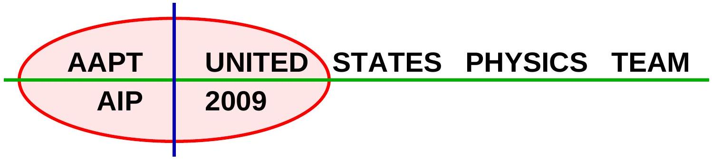
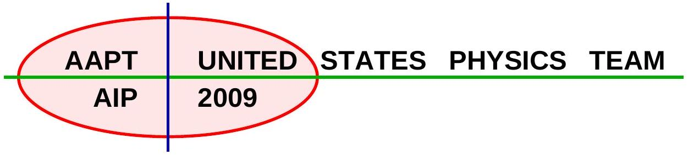
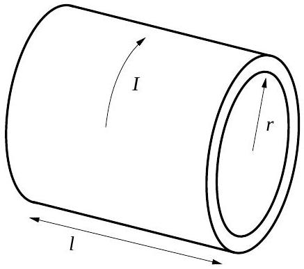
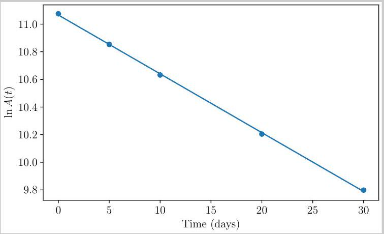
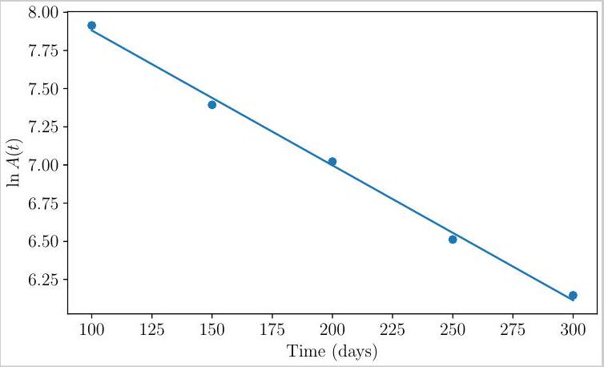
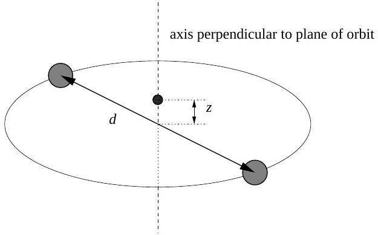
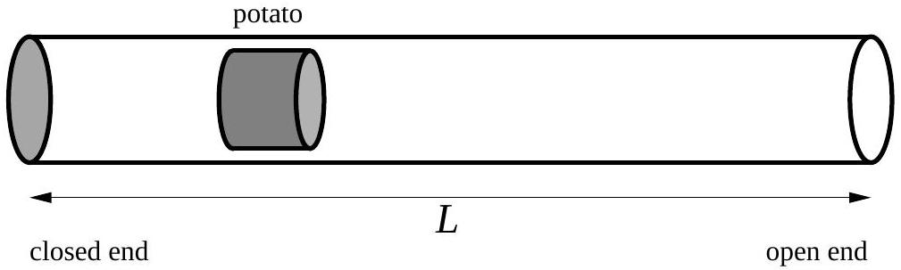
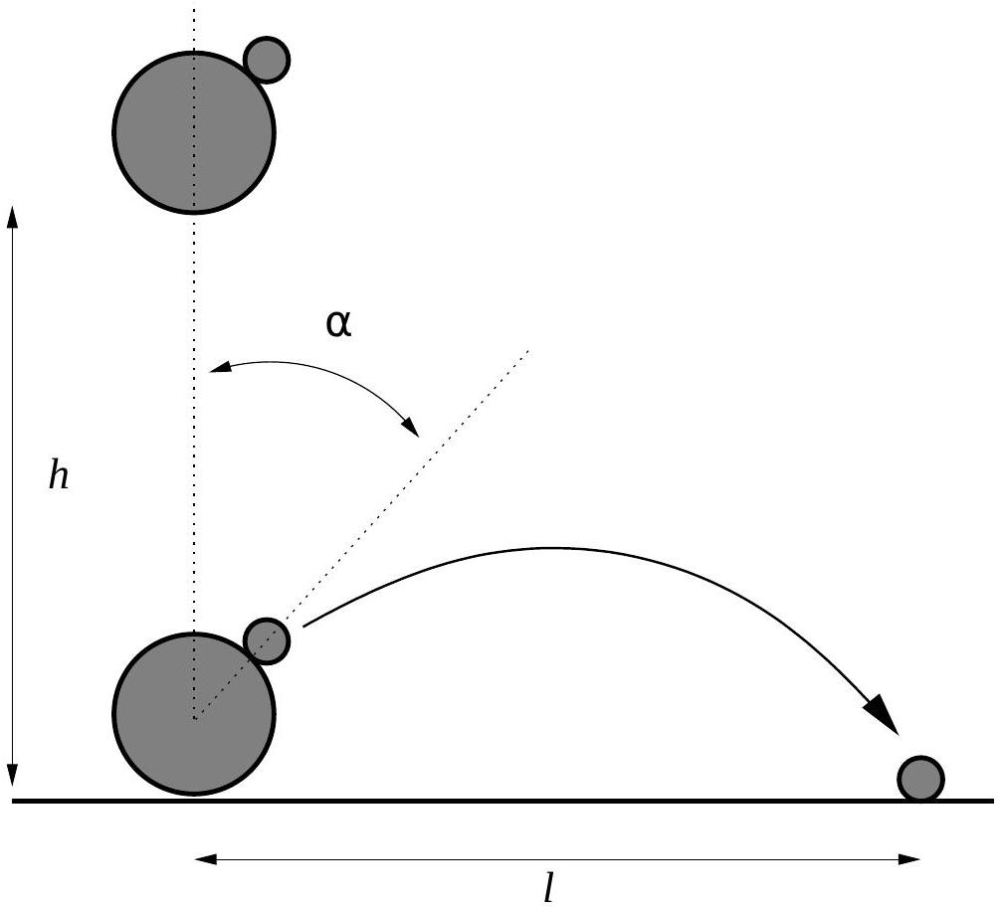
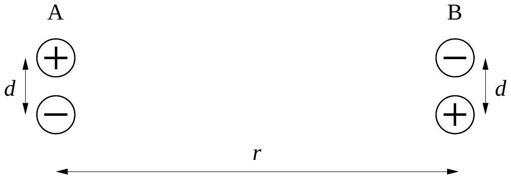

## Semifinal Exam

## DO NOT DISTRIBUTE THIS PAGE

## Important Instructions for the Exam Supervisor

- This examination consists of two parts.
- Part A has four questions and is allowed 90 minutes.
- Part B has two questions and is allowed 90 minutes.
- The first page that follows is a cover sheet. Examinees may keep the cover sheet for both parts of the exam.
- The parts are then identified by the center header on each page. Examinees are only allowed to do one part at a time, and may not work on other parts, even if they have time remaining.
- Allow 90 minutes to complete Part A. Do not let students look at Part B. Collect the answers to Part A before allowing the examinee to begin Part B. Examinees are allowed a 10 to 15 minutes break between parts A and B.
- Allow 90 minutes to complete Part B. Do not let students go back to Part A.
- Ideally the test supervisor will divide the question paper into 3 parts: the cover sheet (page 2), Part A (pages 3-4), and Part B (pages 6-7). Examinees should be provided parts A and B individually, although they may keep the cover sheet.
- The supervisor must collect all examination questions, including the cover sheet, at the end of the exam, as well as any scratch paper used by the examinees. Examinees may not take the exam questions. The examination questions may be returned to the students after March 31, 2009.
- Examinees are allowed calculators, but they may not use symbolic math, programming, or graphic features of these calculators. Calculators may not be shared and their memory must be cleared of data and programs. Cell phones, PDA's or cameras may not be used during the exam or while the exam papers are present. Examinees may not use any tables, books, or collections of formulas.
- Please provide the examinees with graph paper for Part A.

## Semifinal Exam   INSTRUCTIONS

## DO NOT OPEN THIS TEST UNTIL YOU ARE TOLD TO BEGIN

- Work Part A first. You have 90 minutes to complete all four problems. Each question is worth 25 points. Do not look at Part B during this time.
- After you have completed Part A you may take a break.
- Then work Part B. You have 90 minutes to complete both problems. Each question is worth 50 points. Do not look at Part A during this time.
- Show all your work. Partial credit will be given. Do not write on the back of any page. Do not write anything that you wish graded on the question sheets.
- Start each question on a new sheet of paper. Put your school ID number, your name, the question number and the page number/total pages for this problem, in the upper right hand corner of each page. For example,
School ID \#
Doe, Jamie
A1-1/3
- A hand-held calculator may be used. Its memory must be cleared of data and programs. You may use only the basic functions found on a simple scientific calculator. Calculators may not be shared. Cell phones, PDA's or cameras may not be used during the exam or while the exam papers are present. You may not use any tables, books, or collections of formulas.
- Questions with the same point value are not necessarily of the same difficulty.
- In order to maintain exam security, do not communicate any information about the questions (or their answers/solutions) on this contest until after March 31, 2009.

Possibly Useful Information. You may use this sheet for both parts of the exam.

$$
\begin{array} { l l }
g = 9.8 \mathrm {~N} / \mathrm { kg } & G = 6.67 \times 10 ^ { - 11 } \mathrm {~N} \cdot \mathrm {~m} ^ { 2 } / \mathrm { kg } ^ { 2 } \\
k = 1 / 4 \pi \epsilon _ { 0 } = 8.99 \times 10 ^ { 9 } \mathrm {~N} \cdot \mathrm {~m} ^ { 2 } / \mathrm { C } ^ { 2 } & k _ { \mathrm { m } } = \mu _ { 0 } / 4 \pi = 10 ^ { - 7 } \mathrm {~T} \cdot \mathrm {~m} / \mathrm { A } \\
c = 3.00 \times 10 ^ { 8 } \mathrm {~m} / \mathrm { s } & k _ { \mathrm { B } } = 1.38 \times 10 ^ { - 23 } \mathrm {~J} / \mathrm { K } \\
N _ { \mathrm { A } } = 6.02 \times 10 ^ { 23 } ( \mathrm {~mol} ) ^ { - 1 } & R = N _ { \mathrm { A } } k _ { \mathrm { B } } = 8.31 \mathrm {~J} / ( \mathrm { mol } \cdot \mathrm {~K} ) \\
\sigma = 5.67 \times 10 ^ { - 8 } \mathrm {~J} / \left( \mathrm { s } \cdot \mathrm {~m} ^ { 2 } \cdot \mathrm {~K} ^ { 4 } \right) & e = 1.602 \times 10 ^ { - 19 } \mathrm { C } \\
1 \mathrm { eV } = 1.602 \times 10 ^ { - 19 } \mathrm {~J} & h = 6.63 \times 10 ^ { - 34 } \mathrm {~J} \cdot \mathrm {~s} = 4.14 \times 10 ^ { - 15 } \mathrm { eV } \cdot \mathrm {~s} \\
m _ { e } = 9.109 \times 10 ^ { - 31 } \mathrm {~kg} = 0.511 \mathrm { MeV } / \mathrm { c } ^ { 2 } & ( 1 + x ) ^ { n } \approx 1 + n x \text { for } | x | \ll 1 \\
\sin \theta \approx \theta - \frac { 1 } { 6 } \theta ^ { 3 } \text { for } | \theta | \ll 1 & \cos \theta \approx 1 - \frac { 1 } { 2 } \theta ^ { 2 } \text { for } | \theta | \ll 1
\end{array}
$$

Copyright ©2009 American Association of Physics Teachers

## Part A

Question A1
A hollow cylinder has length $l$, radius $r$, and thickness $d$, where $l \gg r \gg d$, and is made of a material with resistivity $\rho$. A time-varying current $I$ flows through the cylinder in the tangential direction. Assume the current is always uniformly distributed along the length of the cylinder. The cylinder is fixed so that it cannot move; assume that there are no externally generated magnetic fields during the time considered for the problems below.

a. What is the magnetic field strength $B$ inside the cylinder in terms of $I$, the dimensions of the cylinder, and fundamental constants?
b. Relate the $\operatorname { emf } \mathcal { E }$ developed along the circumference of the cylinder to the rate of change of the current $\frac { d I } { d t }$, the dimensions of the cylinder, and fundamental constants.
c. Relate $\mathcal { E }$ to the current $I$, the resistivity $\rho$, and the dimensions of the cylinder.
d. The current at $t = 0$ is $I _ { 0 }$. What is the current $I ( t )$ for $t > 0$ ?

## Solution

a. The magnetic field through the inside of the cylinder is given by
$$
B = \mu _ { 0 } I / l
$$
by Ampere's law.
b. The magnetic flux is
$$
\Phi _ { B } = B A = \pi \mu _ { 0 } r ^ { 2 } I / l .
$$
The inductance is then
$$
L = \Phi _ { B } / I = \pi \mu _ { 0 } r ^ { 2 } / l
$$
and the induced emf is
$$
\mathcal { E } = - L \frac { d I } { d t } = - \frac { \pi \mu _ { 0 } r ^ { 2 } } { l } \frac { d I } { d t } .
$$

c. This induced emf will be driving the current, so
$$
\mathcal { E } = I R
$$
where $R$ is the resistance, given by
$$
R = \frac { \rho L } { A }
$$
where $L$ is the circumference $2 \pi r$, and the area $A$ is the cross sectional area $l d$ of the conductor. Therefore,
$$
\mathcal { E } = I \rho \frac { 2 \pi r } { l d } .
$$
d. Combining the above, we get a differential equation,
$$
I \rho \frac { 2 \pi r } { l d } = - \frac { \pi \mu _ { 0 } r ^ { 2 } } { l } \frac { d I } { d t }
$$
which can be written more simply as
$$
\frac { d I } { d t } = - \alpha I , \quad \alpha = \frac { 2 \rho } { \mu _ { 0 } r d } .
$$
The solution is then
$$
I ( t ) = I ( 0 ) e ^ { - \alpha t } .
$$

## Question A2

A mixture of ${ } ^ { 32 } \mathrm { P }$ and ${ } ^ { 35 } \mathrm {~S}$ (two beta emitters widely used in biochemical research) is placed next to a detector and allowed to decay, resulting in the data below. The detector has equal sensitivity to the beta particles emitted by each isotope, and both isotopes decay into stable daughters.

You should analyze the data graphically. Error estimates are not required.

| Day | Activity | Day | Activity | Day | Activity |
| :--- | :--- | :--- | :--- | :--- | :--- |
| 0 | 64557 | 40 | 12441 | 200 | 1121 |
| 5 | 51714 | 60 | 6385 | 250 | 673 |
| 10 | 41444 | 80 | 3855 | 300 | 467 |
| 20 | 27020 | 100 | 2734 |  |  |
| 30 | 18003 | 150 | 1626 |  |  |

a. Determine the half-life of each isotope. ${ } ^ { 35 } \mathrm {~S}$ has a significantly longer half-life than ${ } ^ { 32 } \mathrm { P }$.
b. Determine the ratio of the number of ${ } ^ { 32 } \mathrm { P }$ atoms to the number of ${ } ^ { 35 } \mathrm {~S}$ atoms in the original sample.

## Solution

a. The number of each isotope decays exponentially, $N ( t ) = N _ { S , 0 } 2 ^ { - t / t _ { S } } + N _ { P , 0 } 2 ^ { - t / t _ { P } }$ where $t _ { S }$ and $t _ { P }$ are the half-lives, and $N _ { S , 0 }$ and $N _ { P , 0 }$ are the initial abundances. Because the detector is equally likely to detect any beta particle emitted in a decay, the total activity is proportional to the decay rate,

$$
A ( t ) \propto - \frac { d N } { d t } \propto \frac { N _ { S , 0 } } { t _ { S } } 2 ^ { - t / t _ { S } } + \frac { N _ { P , 0 } } { t _ { P } } 2 ^ { - t / t _ { P } } .
$$

We know that $t _ { S } \gg t _ { P }$, which implies that after a long time, decays of ${ } ^ { 35 } \mathrm {~S}$ will dominate, since by then almost all the ${ } ^ { 32 } \mathrm { P }$ has decayed away. On the other hand, the decay rate of ${ } ^ { 35 } \mathrm {~S}$ is suppressed by a factor of $t _ { S }$, which means that at early times, decays of ${ } ^ { 32 } \mathrm { P }$ dominate.

Therefore, we can find the individual half-lives by fitting a single decaying exponential to the data, at both early and late times, which is equivalent to fitting a line to a plot of $\ln A ( t )$ versus $t$. For the early times, we choose the first five data points; for the late times, we choose the last five data points. The results are shown below.

The slopes of these lines, in the units used in the plots, are -0.043 and -0.0088, and they should be equal to $- ( \ln 2 ) / t _ { P }$ and $- ( \ln 2 ) / t _ { S }$, respectively. This gives half-lives $t _ { P } = 16$ days and $t _ { S } = 78$ days. Any answer within 10\% of these values is reasonably good.

b. Because the activity is dominated by ${ } ^ { 32 } \mathrm { P }$ at the beginning and ${ } ^ { 35 } \mathrm {~S}$ at the end,
$$
\frac { A ( 300 \text { days } ) } { A ( 0 \text { days } ) } = \frac { N _ { S , 0 } 2 ^ { - ( 300 \text { days } ) / t _ { S } } / t _ { S } } { N _ { P , 0 } / t _ { P } }
$$
which means that
$$
\frac { N _ { P , 0 } } { N _ { S , 0 } } = \frac { A ( 0 \text { days } ) } { A ( 300 \text { days } ) } \frac { t _ { P } } { t _ { S } } 2 ^ { - ( 300 \text { days } ) / t _ { S } } = 2.0 .
$$
Since this final result depends sensitively on your values of $t _ { P }$ and $t _ { S }$, any answer within 25\% is acceptable.

## Question A3

Two stars, each of mass $M$ and separated by a distance $d$, orbit about their center of mass. A planetoid of mass $m ( m \ll M )$ moves along the axis of this system perpendicular to the orbital plane.

Let $T _ { p }$ be the period of simple harmonic motion for the planetoid for small displacements from the center of mass along the $z$-axis, and let $T _ { s }$ be the period of motion for the two stars. Determine the ratio $T _ { p } / T _ { s }$.

This problem was adapted from a problem by French in Newtonian Mechanics.

## Solution

The stars orbit about their center of mass, in circles of radius $R = d / 2$. Setting the gravitational force to the centripetal force,

$$
F = \frac { M v ^ { 2 } } { R } = M \frac { 4 \pi ^ { 2 } R } { T _ { s } ^ { 2 } } = G \frac { M ^ { 2 } } { d ^ { 2 } }
$$

and solving for the orbital period $T _ { s }$ gives

$$
T _ { s } = 2 \pi \sqrt { \frac { d ^ { 3 } } { 2 G M } } = 4 \pi \sqrt { \frac { R ^ { 3 } } { G M } } .
$$

Now let the planetoid be a distance $z$ above the plane. The distance to either star is $\sqrt { R ^ { 2 } + z ^ { 2 } }$. Only the part of the force that is perpendicular to the plane survives the vector addition, so the net force is

$$
F = 2 \frac { G m M } { R ^ { 2 } + z ^ { 2 } } \frac { z } { \sqrt { R ^ { 2 } + z ^ { 2 } } }
$$

This expression is exact, but if $z \ll d$ we have

$$
F \approx 2 \frac { G m M } { R ^ { 3 } } z
$$

by the binomial theorem. This is a linear restoring force, so the planetoid will execute simple harmonic motion with period

$$
T _ { p } = 2 \pi \sqrt { \frac { m } { k } }
$$

where $k$ is the effective force constant, so

$$
T _ { p } = 2 \pi \sqrt { \frac { R ^ { 3 } } { 2 G M } }
$$

which gives the answer,

$$
\frac { T _ { p } } { T _ { s } } = \frac { 1 } { 2 \sqrt { 2 } } .
$$

## Question A4

A potato gun fires a potato horizontally down a half-open cylinder of cross-sectional area $A$. When the gun is fired, the potato slug is at rest, the volume between the end of the cylinder and the potato is $V _ { 0 }$, and the pressure of the gas in this volume is $P _ { 0 }$. The atmospheric pressure is $P _ { \text {atm } }$, where $P _ { 0 } > P _ { \text {atm } }$. The gas in the cylinder is diatomic; this means that $C _ { \mathrm { v } } = 5 R / 2$ and $C _ { \mathrm { p } } = 7 R / 2$. The potato moves down the cylinder quickly enough that no heat is transferred to the gas. Friction between the potato and the barrel is negligible and no gas leaks around the potato.

The parameters $P _ { 0 } , P _ { \text {atm } } , V _ { 0 }$, and $A$ are fixed, but the overall length $L$ of the barrel may be varied.

a. What is the maximum kinetic energy $E _ { \text {max } }$ with which the potato can exit the barrel? Express your answer in terms of $P _ { 0 } , P _ { \text {atm } }$, and $V _ { 0 }$.
b. What is the length $L$ in this case? Express your answer in terms of $P _ { 0 } , P _ { \text {atm } } , V _ { 0 }$, and $A$.

## Solution

a. The potato will accelerate if the pressure inside the cylinder is greater than the external air pressure. Therefore, maximum energy will be transferred to the potato if the cylinder is exactly long enough for the final pressure inside the cylinder to be $P _ { \text {atm } }$.
The energy of an ideal diatomic gas is given by
$$
C _ { v } n R T = C _ { v } P V
$$
by the ideal gas law. Maximum energy is delivered to the potato when the final pressure is atmospheric, so the work done by the gas on the potato is
$$
C _ { v } \left( P _ { 0 } V _ { 0 } - P _ { \mathrm { atm } } V _ { f } \right)
$$
But the potato is moving against air, so the total energy given to the potato is
$$
E _ { \max } = C _ { v } \left( P _ { 0 } V _ { 0 } - P _ { \mathrm { atm } } V _ { f } \right) - P _ { \mathrm { atm } } \left( V _ { f } - V _ { 0 } \right) .
$$
Since $P V ^ { \gamma }$ is constant during adiabatic expansion,
$$
V _ { f } = V _ { 0 } \left( \frac { P _ { 0 } } { P _ { \mathrm { atm } } } \right) ^ { 1 / \gamma }
$$
where $\gamma = C _ { p } / C _ { v }$. Plugging this in, we have
$$
E _ { \max } = \frac { 5 } { 2 } P _ { 0 } V _ { 0 } - \frac { 7 } { 2 } P _ { \mathrm { atm } } V _ { f } + P _ { \mathrm { atm } } V _ { 0 } = \left( \frac { 5 } { 2 } P _ { 0 } + P _ { \mathrm { atm } } - \frac { 7 } { 2 } P _ { \mathrm { atm } } ^ { 2 / 7 } P _ { 0 } ^ { 5 / 7 } \right) V _ { 0 } .
$$

b. The length of the tube is simply
$$
L = \frac { V _ { f } } { A } = \frac { V _ { 0 } } { A } \left( \frac { P _ { 0 } } { P _ { \mathrm { atm } } } \right) ^ { 5 / 7 } .
$$

## STOP: Do Not Continue to Part B

If there is still time remaining for Part A, you should review your work for Part A, but do not continue to Part B until instructed by your exam supervisor.

## Part B

## Question B1

A bowling ball and a golf ball are dropped together onto a flat surface from a height $h$. The bowling ball is much more massive than the golf ball, and both have radii much less than $h$. The bowling ball collides with the surface and immediately thereafter with the golf ball; the balls are dropped so that all motion is vertical before the second collision, and the golf ball hits the bowling ball at an angle $\alpha$ from its uppermost point, as shown in the diagram. All collisions are perfectly elastic, and there is no surface friction between the bowling ball and the golf ball.

After the collision the golf ball travels in the absence of air resistance and lands a distance $l$ away. The height $h$ is fixed, but $\alpha$ may be varied. What is the maximum possible value of $l$, and at what angle $\alpha$ is it achieved?

You may present your results as decimals, but remember that you are not allowed to use graphical or algebraic functions of your calculator.

## Solution

Both balls arrive at the surface with a speed $v _ { 0 }$, which we can determine as usual via conservation of energy:

$$
\frac { 1 } { 2 } m v _ { 0 } ^ { 2 } = m g h \quad \Rightarrow \quad v _ { 0 } = \sqrt { 2 g h } .
$$

After the bowling ball collides with the surface, it is traveling upwards at $v _ { 0 }$ and the golf ball is traveling downwards at $v _ { 0 }$. The subsequent collision is most easily understood in the reference frame of the bowling ball; in this frame, the golf ball is traveling downwards at $2 v _ { 0 }$ and the bowling

ball is stationary. Since the bowling ball is very massive compared to the golf ball, the golf ball will rebound at the same speed $2 v _ { 0 }$. Since there is no surface friction, the angle of reflection will be equal to the angle of incidence. Therefore the golf ball will emerge at an angle $2 \alpha$ to the vertical.

In the bowling ball's reference frame, the golf ball emerges with horizontal velocity $2 v _ { 0 } \sin 2 \alpha$ and upward vertical velocity $2 v _ { 0 } \cos 2 \alpha$. Transforming these back to the original frame of reference, we obtain the initial conditions for the golf ball's projectile motion,

$$
v _ { x } = 2 v _ { 0 } \sin 2 \alpha , \quad v _ { y } = 2 v _ { 0 } \cos 2 \alpha + v _ { 0 } .
$$

The time of flight $t$ of the golf ball is given by

$$
t = \frac { 2 v _ { y } } { g }
$$

and therefore the range is

$$
l = v _ { x } t = \frac { 2 v _ { x } v _ { y } } { g }
$$

Combining with our previous result,

$$
l = \frac { 2 } { g } \left( 2 v _ { 0 } \sin 2 \alpha \right) \left( 2 v _ { 0 } \cos 2 \alpha + v _ { 0 } \right) = \frac { 8 v _ { 0 } ^ { 2 } } { g } \sin 2 \alpha \left( \cos 2 \alpha + \frac { 1 } { 2 } \right) .
$$

For convenience we set $\beta = 2 \alpha$. Inserting the expression for $v _ { 0 }$,

$$
l = 16 h \sin \beta \left( \cos \beta + \frac { 1 } { 2 } \right) \Rightarrow \frac { d l } { d \beta } = 16 h \left[ \cos \beta \left( \cos \beta + \frac { 1 } { 2 } \right) - \sin ^ { 2 } \beta \right]
$$

Setting this to zero to find the maximum,

$$
\cos ^ { 2 } \beta - \sin ^ { 2 } \beta + \frac { 1 } { 2 } \cos \beta = 0
$$

This can be rewritten as a quadratic in $\cos \beta$,

$$
2 \cos ^ { 2 } \beta + \frac { 1 } { 2 } \cos \beta - 1 = 0 \Rightarrow \cos \beta = \frac { - \frac { 1 } { 2 } \pm \sqrt { \frac { 1 } { 4 } - 8 } } { 4 } .
$$

Taking the positive root,

$$
\cos \beta = \frac { \sqrt { 33 } - 1 } { 8 } = 0.593 , \quad \sin \beta = \sqrt { 1 - \cos ^ { 2 } \beta } = 0.805 .
$$

So at maximum,

$$
l = 16 h \cdot 0.805 \cdot \left( 0.593 + \frac { 1 } { 2 } \right) = 14.08 h
$$

which occurs at

$$
\cos 2 \alpha = 0.593 \quad \Rightarrow \quad \alpha = 0.468 = 26.8 ^ { \circ } .
$$

## Question B2

An electric dipole consists of two charges of equal magnitude $q$ and opposite sign, held rigidly apart by a distance $d$. The dipole moment is defined by $p = q d$.

Now consider two identical, oppositely oriented electric dipoles, separated by a distance $r$, as shown in the diagram.

a. It is convenient when considering the interaction between the dipoles to choose the zero of potential energy such that the potential energy is zero when the dipoles are very far apart from each other. Using this convention, write an exact expression for the potential energy of this arrangement in terms of $q , d , r$, and fundamental constants.
b. Assume that $d \ll r$. Give an approximation of your expression for the potential energy to lowest order in $d$. Rewrite this approximation in terms of only $p , r$, and fundamental constants.
c. What is the force (magnitude and direction) exerted on one dipole by the other? Continue to make the assumption that $d \ll r$, and again express your result in terms of only $p , r$, and fundamental constants.
d. What is the electric field near dipole B produced by dipole A? Continue to make the assumption that $d \ll r$ and express your result in terms of only $p , r$, and fundamental constants.

## Solution

a. There are two $+ q / - q$ pairs separated by a distance $d$, each having potential energy
$$
- \frac { q ^ { 2 } } { 4 \pi \epsilon _ { 0 } d }
$$
There are two $+ q / - q$ pairs separated by a distance $r$, each having potential energy
$$
- \frac { q ^ { 2 } } { 4 \pi \epsilon _ { 0 } r }
$$
There are a $+ q / + q$ pair and a $- q / - q$ pair separated by a distance $\sqrt { r ^ { 2 } + d ^ { 2 } }$, each having potential energy
$$
\frac { q ^ { 2 } } { 4 \pi \epsilon _ { 0 } \sqrt { r ^ { 2 } + d ^ { 2 } } }
$$

Note that the latter two terms go to zero as $r$ becomes large, whereas the first term is not dependent on $r$. Thus the given zero convention will include only the latter two terms,
$$
U = \frac { q ^ { 2 } } { 4 \pi \epsilon _ { 0 } } \left( - \frac { 2 } { r } + \frac { 2 } { \sqrt { r ^ { 2 } + d ^ { 2 } } } \right) .
$$
b. Rearranging the result above, we have
$$
U = \frac { 2 q ^ { 2 } } { 4 \pi \epsilon _ { 0 } r } \left( \frac { 1 } { \sqrt { 1 + \left( \frac { d } { r } \right) ^ { 2 } } } - 1 \right)
$$
Using the binomial approximation $( 1 + x ) ^ { n } \approx 1 + n x$,
$$
U \approx \frac { 2 q ^ { 2 } } { 4 \pi \epsilon _ { 0 } r } \left( 1 - \frac { 1 } { 2 } \left( \frac { d } { r } \right) ^ { 2 } - 1 \right) = - \frac { q ^ { 2 } d ^ { 2 } } { 4 \pi \epsilon _ { 0 } r ^ { 3 } } = - \frac { p ^ { 2 } } { 4 \pi \epsilon _ { 0 } r ^ { 3 } } .
$$
c. We can infer by symmetry that the force must point along the line separating the dipoles. Since the potential energy decreases with decreasing distance, the force is attractive. Its magnitude can be determined by taking the derivative of the potential energy:
$$
F = - \frac { d U } { d r } = - 3 \frac { p ^ { 2 } } { 4 \pi \epsilon _ { 0 } r ^ { 4 } }
$$
with the negative sign confirming that the force is attractive.
One can also use an approach analogous to the previous one, i.e. write down the force exactly and use a binomial approximation as above. One must take care to account for the fact that the force between like-signed charges is not exactly in the same direction as that between opposite-signed charges.
d. The electric field near dipole B produced by dipole A is directed approximately downward. Its magnitude is exactly
$$
E = \frac { q } { 4 \pi \epsilon _ { 0 } } \frac { 2 } { r ^ { 2 } + ( d / 2 ) ^ { 2 } } \sin \left( \frac { d } { 2 r } \right) .
$$
Using $d \ll r$ and the small angle approximation $\sin \theta \approx \theta$, we have
$$
E \approx \frac { p } { 4 \pi \epsilon _ { 0 } r ^ { 3 } }
$$
where we neglected all higher-order terms in $d / r$.
Note that at this level of accuracy, the force on dipole B would be exactly zero. In order to extend this calculation to get the answer to part c, we would have to account for the fact that the electric fields at the two charges in dipole B do not point exactly downward. This is a smaller effect than what we've found in this part, which is why the answer to part (c) falls off as $1 / r ^ { 4 }$ while the answer here falls off as $1 / r ^ { 3 }$.
