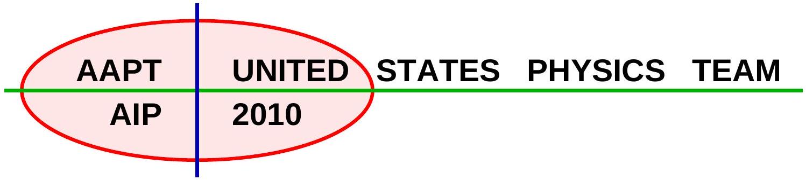
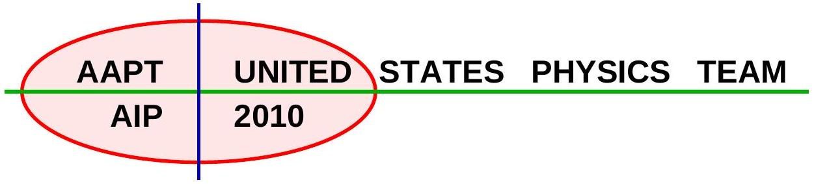
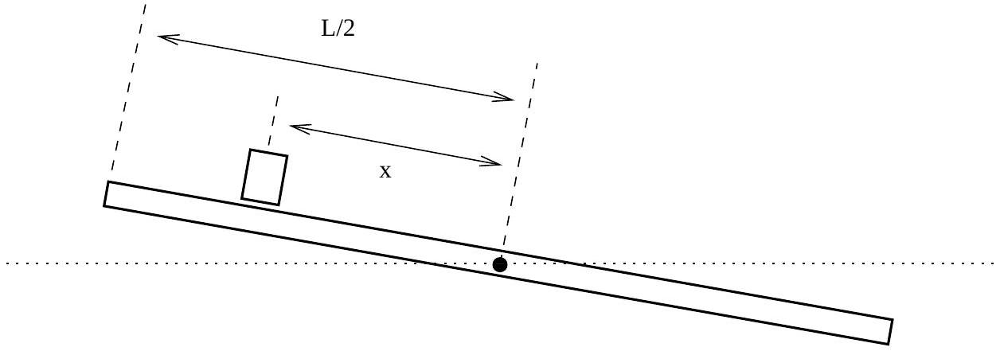
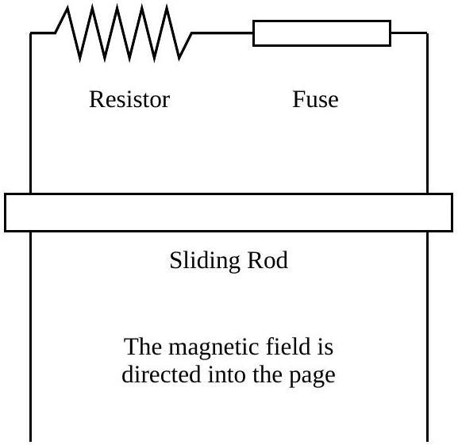

## Semifinal Exam

## DO NOT DISTRIBUTE THIS PAGE

## Important Instructions for the Exam Supervisor

- This examination consists of two parts.
- Part A has four questions and is allowed 90 minutes.
- Part B has two questions and is allowed 90 minutes.
- The first page that follows is a cover sheet. Examinees may keep the cover sheet for both parts of the exam.
- The parts are then identified by the center header on each page. Examinees are only allowed to do one part at a time, and may not work on other parts, even if they have time remaining.
- Allow 90 minutes to complete Part A. Do not let students look at Part B. Collect the answers to Part A before allowing the examinee to begin Part B. Examinees are allowed a 10 to 15 minutes break between parts A and B.
- Allow 90 minutes to complete Part B. Do not let students go back to Part A.
- Ideally the test supervisor will divide the question paper into 3 parts: the cover sheet (page 2), Part A (pages 3-4), and Part B (pages 6-7). Examinees should be provided parts A and B individually, although they may keep the cover sheet.
- The supervisor must collect all examination questions, including the cover sheet, at the end of the exam, as well as any scratch paper used by the examinees. Examinees may not take the exam questions. The examination questions may be returned to the students after March 31, 2010.
- Examinees are allowed calculators, but they may not use symbolic math, programming, or graphic features of these calculators. Calculators may not be shared and their memory must be cleared of data and programs. Cell phones, PDA's or cameras may not be used during the exam or while the exam papers are present. Examinees may not use any tables, books, or collections of formulas.

## Semifinal Exam   INSTRUCTIONS

## DO NOT OPEN THIS TEST UNTIL YOU ARE TOLD TO BEGIN

- Work Part A first. You have 90 minutes to complete all four problems. Each question is worth 25 points. Do not look at Part B during this time.
- After you have completed Part A you may take a break.
- Then work Part B. You have 90 minutes to complete both problems. Each question is worth 50 points. Do not look at Part A during this time.
- Show all your work. Partial credit will be given. Do not write on the back of any page. Do not write anything that you wish graded on the question sheets.
- Start each question on a new sheet of paper. Put your school ID number, your name, the question number and the page number/total pages for this problem, in the upper right hand corner of each page. For example,
School ID \#
Doe, Jamie
A1-1/3
- A hand-held calculator may be used. Its memory must be cleared of data and programs. You may use only the basic functions found on a simple scientific calculator. Calculators may not be shared. Cell phones, PDA's or cameras may not be used during the exam or while the exam papers are present. You may not use any tables, books, or collections of formulas.
- Questions with the same point value are not necessarily of the same difficulty.
- In order to maintain exam security, do not communicate any information about the questions (or their answers/solutions) on this contest until after March 31, 2010.

Possibly Useful Information. You may use this sheet for both parts of the exam.

$$
\begin{array} { l l }
g = 9.8 \mathrm {~N} / \mathrm { kg } & G = 6.67 \times 10 ^ { - 11 } \mathrm {~N} \cdot \mathrm {~m} ^ { 2 } / \mathrm { kg } ^ { 2 } \\
k = 1 / 4 \pi \epsilon _ { 0 } = 8.99 \times 10 ^ { 9 } \mathrm {~N} \cdot \mathrm {~m} ^ { 2 } / \mathrm { C } ^ { 2 } & k _ { \mathrm { m } } = \mu _ { 0 } / 4 \pi = 10 ^ { - 7 } \mathrm {~T} \cdot \mathrm {~m} / \mathrm { A } \\
c = 3.00 \times 10 ^ { 8 } \mathrm {~m} / \mathrm { s } & k _ { \mathrm { B } } = 1.38 \times 10 ^ { - 23 } \mathrm {~J} / \mathrm { K } \\
N _ { \mathrm { A } } = 6.02 \times 10 ^ { 23 } ( \mathrm {~mol} ) ^ { - 1 } & R = N _ { \mathrm { A } } k _ { \mathrm { B } } = 8.31 \mathrm {~J} / ( \mathrm { mol } \cdot \mathrm {~K} ) \\
\sigma = 5.67 \times 10 ^ { - 8 } \mathrm {~J} / \left( \mathrm { s } \cdot \mathrm {~m} ^ { 2 } \cdot \mathrm {~K} ^ { 4 } \right) & e = 1.602 \times 10 ^ { - 19 } \mathrm { C } \\
1 \mathrm { eV } = 1.602 \times 10 ^ { - 19 } \mathrm {~J} & h = 6.63 \times 10 ^ { - 34 } \mathrm {~J} \cdot \mathrm {~s} = 4.14 \times 10 ^ { - 15 } \mathrm { eV } \cdot \mathrm {~s} \\
m _ { e } = 9.109 \times 10 ^ { - 31 } \mathrm {~kg} = 0.511 \mathrm { MeV } / \mathrm { c } ^ { 2 } & ( 1 + x ) ^ { n } \approx 1 + n x \text { for } | x | \ll 1 \\
\sin \theta \approx \theta - \frac { 1 } { 6 } \theta ^ { 3 } \text { for } | \theta | \ll 1 & \cos \theta \approx 1 - \frac { 1 } { 2 } \theta ^ { 2 } \text { for } | \theta | \ll 1
\end{array}
$$

## Part A

Question A1
An object of mass $m$ is sitting at the northernmost edge of a stationary merry-go-round of radius $R$. The merry-go-round begins rotating clockwise (as seen from above) with constant angular acceleration of $\alpha$. The coefficient of static friction between the object and the merry-go-round is $\mu _ { s }$.

a. Derive an expression for the magnitude of the object's velocity at the instant when it slides off the merry-go-round in terms of $\mu _ { s } , R , \alpha$, and any necessary fundamental constants.
b. For this problem assume that $\mu _ { s } = 0.5 , \alpha = 0.2 \mathrm { rad } / \mathrm { s } ^ { 2 }$, and $R = 4 \mathrm {~m}$. At what angle, as measured clockwise from north, is the direction of the object's velocity at the instant when it slides off the merry-go-round? Report your answer to the nearest degree in the range 0 to 360°.

## Solution

a. The maximum possible acceleration provided by friction is $\mu _ { s } g$. The object will begin to slide once the acceleration exceeds this. We have
$$
a = \sqrt { a _ { r } ^ { 2 } + a _ { t } ^ { 2 } } , \quad a _ { t } = \alpha R , \quad a _ { r } = \omega ^ { 2 } R
$$
where $a _ { t }$ is the tangential acceleration and $a _ { r }$ is the centripetal acceleration. Plugging in,
$$
\alpha ^ { 2 } R ^ { 2 } + \omega ^ { 4 } R ^ { 2 } = \mu _ { s } ^ { 2 } g ^ { 2 }
$$
and using $\omega = \alpha t$ and solving for $t$, we find
$$
t = \sqrt { \frac { 1 } { \alpha } \sqrt { \frac { \mu _ { s } ^ { 2 } g ^ { 2 } } { \alpha ^ { 2 } R ^ { 2 } } - 1 } }
$$
When the object slides off, it has a tangential velocity $v = R \omega$, so
$$
v = R \alpha t = \sqrt { R \sqrt { \mu _ { s } ^ { 2 } g ^ { 2 } - \alpha ^ { 2 } R ^ { 2 } } } .
$$
b. The angular position of the object is $\theta = \alpha t ^ { 2 } / 2$, so
$$
\theta = \frac { 1 } { 2 \alpha R } \sqrt { \mu _ { s } { } ^ { 2 } g ^ { 2 } - \alpha ^ { 2 } R ^ { 2 } } .
$$
Plugging in the numbers, we find
$$
\theta = \frac { 1 } { 2 ( 0.2 ) ( 4 ) } \sqrt { ( 0.5 ) ^ { 2 } ( 9.8 ) ^ { 2 } - ( 0.2 ) ^ { 2 } ( 4 ) ^ { 2 } } = 3.021 \mathrm { rad } = 173 ^ { \circ } .
$$
The velocity of the object is rotated 90° relative to the position, so the answer is 263°.

Question A2
A spherical shell of inner radius $a$ and outer radius $b$ is made of a material of resistivity $\rho$ and negligible dielectric activity. A single point charge $q _ { 0 }$ is located at the center of the shell. At time $t = 0$ all of the material of the shell is electrically neutral, including both the inner and outer surfaces. What is the total charge on the outer surface of the shell as a function of time for $t > 0$ ? Ignore any effects due to magnetism or radiation; do not assume that $b - a$ is small.

## Solution

The material of the shell will remain electrically neutral, although a charge $- Q$ will build up on the inner surface while a charge of $+ Q$ will build up on the outer surface. By spherical symmetry and Gauss's law, the electric field in the material of the shell is

$$
E = \frac { 1 } { 4 \pi \epsilon _ { 0 } } \frac { q _ { 0 } - Q ( t ) } { r ^ { 2 } } .
$$

This will cause a current density

$$
J = \frac { E } { \rho } = \frac { 1 } { 4 \pi \epsilon _ { 0 } \rho } \frac { q _ { 0 } - Q ( t ) } { r ^ { 2 } }
$$

at a radius $r$, and therefore a net current of

$$
I = \left( 4 \pi r ^ { 2 } \right) J = \frac { q _ { 0 } - Q ( t ) } { \epsilon _ { 0 } \rho }
$$

Since $I = d Q / d t$, we may separate and integrate for

$$
\frac { d Q } { q _ { 0 } - Q } = \frac { d t } { \epsilon _ { 0 } \rho } \Rightarrow \log \left( \frac { q _ { 0 } } { q _ { 0 } - Q } \right) = \frac { t } { \epsilon _ { 0 } \rho }
$$

where we used the initial condition $Q ( 0 ) = 0$ to set the integration constant. Solving for $Q ( t )$ gives

$$
Q ( t ) = q _ { 0 } \left( 1 - e ^ { - t / \epsilon _ { 0 } \rho } \right) .
$$

Question A3
A cylindrical pipe contains a movable piston that traps 2.00 mols of air. Originally, the air is at one atmosphere of pressure, a volume $V _ { 0 }$, and at a temperature of $T _ { 0 } = 298 \mathrm {~K}$. First (process A) the air in the cylinder is compressed at constant temperature to a volume of $\frac { 1 } { 4 } V _ { 0 }$. Then (process B) the air is allowed to expand adiabatically to a volume of $V = 15.0 \mathrm {~L}$. After this (process C) this piston is withdrawn allowing the gas to expand to the original volume $V _ { 0 }$ while maintaining a constant temperature. Finally (process D) while maintaining a fixed volume, the gas is allowed to return to the original temperature $T _ { 0 }$. Assume air is a diatomic ideal gas, no air flows into, or out of, the pipe at any time, and that the temperature outside the remains constant always. Possibly useful information: $C _ { p } = \frac { 7 } { 2 } R , C _ { v } = \frac { 5 } { 2 } R , 1 \mathrm {~atm} = 1.01 \times 10 ^ { 5 } \mathrm {~Pa}$.
a. Draw a P-V diagram of the whole process.

Copyright ©2010 American Association of Physics Teachers

b. How much work is done on the trapped air during process A?
c. What is the temperature of the air at the end of process B?

## Solution

a. The diagram consists of an isotherm, an adiabat, an isotherm, and an isochore.
b. For a gas compressed from a volume $V _ { 0 }$ to $V _ { 1 } = V _ { 0 } / 4$, the work done on the gas is
$$
W = n R T \log \frac { V _ { 0 } } { V _ { 1 } }
$$
Then the answer is
$$
W = 2 \mathrm { mols } \cdot 8.31 \frac { \mathrm {~J} } { \mathrm {~mol} \cdot \mathrm {~K} } \cdot 298 \mathrm {~K} \cdot \log 4 = 6870 \mathrm {~J} .
$$
c. During an adiabatic process, $P V ^ { \gamma }$ is conserved. Combining this with the ideal gas law, $T V ^ { \gamma - 1 }$ is conserved. Therefore, the temperature after process B is
$$
T _ { 2 } = T _ { 0 } \left( \frac { V _ { 1 } } { V } \right) ^ { \gamma - 1 }
$$
where $V _ { 1 }$ is the volume after process A. Using the ideal gas law,
$$
V _ { 0 } = \frac { n R T _ { 0 } } { P _ { 0 } } = \frac { 2 \mathrm { mols } \cdot 8.31 \frac { \mathrm {~J} } { \mathrm {~mol} \cdot \mathrm {~K} } \cdot 298 \mathrm {~K} } { 1.01 \cdot 10 ^ { 5 } \mathrm {~Pa} } = 0.0490 \mathrm {~m} ^ { 3 } .
$$
Thus, the two relevant volumes here are
$$
V = 15.0 \mathrm {~L} = 15.0 \mathrm {~L} \cdot \frac { 10 ^ { 3 } \mathrm {~mL} } { 1 \mathrm {~L} } \cdot \frac { 1 \mathrm {~cm} ^ { 3 } } { 1 \mathrm {~mL} } \cdot \frac { 1 \mathrm {~m} ^ { 3 } } { 10 ^ { 6 } \mathrm {~cm} ^ { 3 } } = 0.0150 \mathrm {~m} ^ { 3 } , \quad V _ { 1 } = \frac { 1 } { 4 } V _ { 0 } = 0.0123 \mathrm {~m} ^ { 3 }
$$
and plugging in gives
$$
T _ { 2 } = 298 \mathrm {~K} \left( \frac { 0.0123 } { 0.0150 } \right) ^ { \frac { 2 } { 5 } } = 275 \mathrm {~K}
$$
where we used $\gamma = C _ { p } / C _ { v } = 7 / 5$.

## Question A4

The energy radiated by the Sun is generated primarily by the fusion of hydrogen into helium-4. In stars the size of the Sun, the primary mechanism by which fusion takes place is the proton-proton chain. The chain begins with the following reactions:

$$
\begin{gather*}
2 \mathrm { p } \rightarrow \mathbf { X } _ { 1 } + \mathrm { e } ^ { + } + \mathbf { X } _ { 2 } ( 0.42 \mathrm { MeV } )  \tag{A4-1}\\
\mathrm { p } + \mathbf { X } _ { 1 } \rightarrow \mathbf { X } _ { 3 } + \gamma ( 5.49 \mathrm { MeV } ) \tag{A4-2}
\end{gather*}
$$

Copyright ©2010 American Association of Physics Teachers

The amounts listed in parentheses are the total kinetic energy carried by the products, including gamma rays. p is a proton, $\mathrm { e } ^ { + }$is a positron, $\gamma$ is a gamma ray, and $\mathbf { X } _ { 1 } , \mathbf { X } _ { 2 }$, and $\mathbf { X } _ { 3 }$ are particles for you to identify.

The density of electrons in the Sun's core is sufficient that the positron is annihilated almost immediately, releasing an energy $x$ :

$$
\begin{equation*}
\mathrm { e } ^ { + } + \mathrm { e } ^ { - } \rightarrow 2 \gamma ( x ) \tag{A4-3}
\end{equation*}
$$

Subsequently, two major processes occur simultaneously. The "pp I branch" is the single reaction

$$
\begin{equation*}
2 \mathbf { X } _ { 3 } \rightarrow { } ^ { 4 } \mathrm { He } + 2 \mathbf { X } _ { 4 } ( y ) , \tag{A4-4}
\end{equation*}
$$

which releases an energy $y$. The "pp II branch" consists of three reactions:

$$
\begin{gather*}
\mathbf { X } _ { 3 } + { } ^ { 4 } \mathrm { He } \rightarrow \mathbf { X } _ { 5 } + \gamma  \tag{A4-5}\\
\mathbf { X } _ { 5 } + \mathrm { e } ^ { - } \rightarrow \mathbf { X } _ { 6 } + \mathbf { X } _ { 7 } ( z )  \tag{A4-6}\\
\mathbf { X } _ { 6 } + \mathbf { X } _ { 4 } \rightarrow 2 { } ^ { 4 } \mathrm { He } \tag{A4-7}
\end{gather*}
$$

where $z$ is the energy released in step A4-6.

a. Identify $\mathbf { X } _ { 1 }$ through $\mathbf { X } _ { 7 }$. $\mathbf { X } _ { 2 }$ and $\mathbf { X } _ { 7 }$ are neutral particles of negligible mass. It is useful to know that the first few elements, in order of atomic number, are H, He, Li, Be, B, C, N, O.
b. The mass of the electron is $0.51 \mathrm { MeV } / \mathrm { c } ^ { 2 }$, the mass of the proton is $938.27 \mathrm { MeV } / \mathrm { c } ^ { 2 }$, and the mass of the helium-4 nucleus is $3727.38 \mathrm { MeV } / \mathrm { c } ^ { 2 }$. Find the energy released during the production of one helium-4 nucleus, including the kinetic energy of all products and all energy carried by gamma rays.
c. Find the unknown energies $x$ and $y$ above.
d. Step (A4-6) does not proceed as follows because there is insufficient energy.
$$
\mathbf { X } _ { 5 } \rightarrow \mathbf { X } _ { 6 } + \mathrm { e } ^ { + } + \mathbf { X } _ { 7 }
$$
What constraint does this fact place on $z$ ?
e. In which of the reaction steps is the energy carried by any given product the same every time the step occurs? Assume that the kinetic energy carried in by the reactants in each step is negligible, and that the products are in the ground state.

## Solution

a. We know that in all nuclear processes, total charge is conserved, lepton number (electrons plus neutrinos minus positrons minus antineutrinos), and baryon number (neutrons plus protons) are conserved. As $X _ { 2 }$ is a neutral particle of negligible mass, $X _ { 1 }$ must have charge +1 and contain two baryons. Thus it is ${ } ^ { 2 } \mathrm { H } . X _ { 2 }$ is then a neutral particle with lepton number +1 and is an electron neutrino.
Similar reasoning shows that $X _ { 3 }$ is ${ } ^ { 3 } \mathrm { He } , X _ { 4 }$ is a proton (i.e. $\left. { } ^ { 1 } \mathrm { H } \right) , X _ { 5 }$ is ${ } ^ { 7 } \mathrm { Be } , X _ { 6 }$ is ${ } ^ { 7 } \mathrm { Li }$, and $X _ { 7 }$ is an electron neutrino.

b. The overall reaction (not including gamma rays) is
$$
4 \mathrm { p } + 2 \mathrm { e } ^ { - } \rightarrow { } ^ { 4 } \mathrm { He } + 2 \nu _ { e }
$$
as can be seen from conservation considerations or by combining the given reactions. The energy released is the difference in mass between the reactants and the products; using the given values, this is 26.72 MeV .
c. $x$ is simply twice the mass of the electron, 1.02 MeV. To compute $y$, note that we can sum the other known energies to obtain the result from the previous problem:
$$
2 ( 0.42 \mathrm { MeV } + 5.49 \mathrm { MeV } + 1.02 \mathrm { MeV } ) + y = 26.72 \mathrm { MeV }
$$
where the factor of 2 arises because two ${ } ^ { 3 } \mathrm { He }$ are produced in the course of the combined reaction. Solving, $y = 12.86 \mathrm { MeV }$.
d. The forbidden reaction produces an energy of $z - 2 ( 0.51 \mathrm { MeV } )$, as it differs from the naturally occurring one by the consumption of one fewer electron and the production of an additional positron. Since it is forbidden, $z < 1.02 \mathrm { MeV }$.
e. Reactions with two products have a single set of product energies, while those with three or more products produce a spectrum of output energies. Students may quote this result; alternatively, observe that in a two-product reaction the conservation of momentum and of energy give two equations in the two unknowns, fixing their values, whereas there are insufficient equations in the case of three or more products.
The reactions with only two products are (A4-2), (A4-3), (A4-5), (A4-6), and (A4-7).

## STOP: Do Not Continue to Part B

If there is still time remaining for Part A, you should review your work for Part A, but do not continue to Part B until instructed by your exam supervisor.

## Part B

## Question B1

A thin plank of mass $M$ and length $L$ rotates about a pivot at its center. A block of mass $m \ll M$ slides on the top of the plank. The system moves without friction. Initially, the plank makes an angle $\theta _ { 0 }$ with the horizontal, the block is at the upper end of the plank, and the system is at rest. Throughout the problem you may assume that $\theta \ll 1$, and that the physical dimensions of the block are much, much smaller than the length of the plank.

Let $x$ be the displacement of the block along the plank, as measured from the pivot, and let $\theta$ be the angle between the plank and the horizontal. You may assume that centripetal acceleration of the block is negligible compared with the linear acceleration of the block up and down the plank.

a. For a certain value of $\theta _ { 0 } , x = k \theta$ throughout the motion, where $k$ is a constant. What is this value of $\theta _ { 0 }$ ? Express your answer in terms of $M , m$, and any fundamental constants that you require.
b. Given that $\theta _ { 0 }$ takes this special value, what is the period of oscillation of the system? Express your answer in terms of $M , m$, and any fundamental constants that you require.
c. Determine the maximum value of the ratio between the centripetal acceleration of the block and the linear acceleration of the block along the plank, writing your answer in terms of $m$ and $M$, therefore justifying our approximation.

## Solution

a. The moment of inertia of the plank about its pivot is
$$
I = \frac { 1 } { 12 } M L ^ { 2 }
$$
and it is acceptable to simply write this down. The magnitude of the torque on the plank is
$$
\tau = m g x \cos \theta \approx m g x
$$
so the angular acceleration is
$$
\alpha = - \frac { m g } { I } x .
$$

We may neglect the rotational inertia of the block, since $m \ll M$. Next, the linear acceleration of the block is

$$
a = - g \sin \theta \approx - g \theta .
$$

It looks like we've derived two copies of the simple harmonic oscillator equation. However, the position of the block determines the linear restoring force for the plank, while the angular position of the plank determines the linear restoring force for the board. Hence the general solution will not look anything like simple harmonic motion; instead the block will most likely fall off the plank. The block and plank will only oscillate together for one special value of $\theta _ { 0 }$.
To find this special value, suppose $x = k \theta$ throughout. Then

$$
k = \frac { L } { 2 \theta _ { 0 } } .
$$

Differentiating, we have $a = k \alpha$. Using these to eliminate $x$ and $a$ above, we have

$$
\alpha = - \frac { g } { k } \theta , \quad \alpha = - \frac { m g k } { I } \theta .
$$

This is only self-consistent if the coefficients are equal, so

$$
\frac { g } { k } = \frac { m g k } { I } \Rightarrow \theta _ { 0 } = \sqrt { \frac { 3 m } { M } } .
$$

b. Referring to one of our previous equations,
$$
\omega ^ { 2 } = \frac { g } { k } = \frac { 2 g } { L } \sqrt { \frac { 3 m } { M } }
$$
and the period of the motion is
$$
T = \frac { 2 \pi } { \omega } .
$$
One can trivially simplify to get an explicit expression for $T$, though this isn't necessary.
c. The centripetal acceleration is
$$
a _ { c } = x \left( \frac { d \theta } { d t } \right) ^ { 2 } = x \theta _ { 0 } ^ { 2 } \omega ^ { 2 } \sin ^ { 2 } \omega t .
$$
Now $a = - x \omega ^ { 2 }$, so the ratio is
$$
\frac { a _ { c } } { a } = \theta _ { 0 } ^ { 2 } \sin ^ { 2 } \omega t \leq \theta _ { 0 } ^ { 2 } = \frac { 3 m } { M }
$$
which is indeed always small. If we did account for the centripetal acceleration, then there still would be a value for $\theta _ { 0 }$ where the block and plank oscillate together, but the motion would not be precisely simple harmonic, and the equations would be too complicated to solve.

## Question B2

These three parts can be answered independently.

a. One pair of ends of two long, parallel wires are connected by a resistor, $R = 0.25 \Omega$, and a fuse that will break instantaneously if 5 amperes of current pass through it. The other pair of ends are unconnected. A conducting rod of mass $m$ is free to slide along the wires under the influence of gravity. The wires are separated by 30 cm, and the rod starts out 10 cm from the resistor and fuse. The whole system is placed in a uniform, constant magnetic field of $B = 1.2 \mathrm {~T}$ as shown in the figure. The resistance of the rod and the wires is negligible. When the rod is released it falls under the influence of gravity, but never loses contact with the long parallel wires.

    i. What is the smallest mass needed to break the fuse?
    ii. How fast is the mass moving when the fuse breaks?
b. A fuse is composed of a cylindrical wire with length $L$ and radius $r \ll L$. The resistivity (not resistance!) of the fuse is small, and given by $\rho _ { \mathrm { f } }$. Assume that a uniform current $I$ flows through the fuse. Write your answers below in terms of $L , r , \rho _ { \mathrm { f } } , I$, and any fundamental constants.
    i. What is the magnitude and direction of the electric field on the surface of the fuse wire?
    ii. What is the magnitude and direction of the magnetic field on the surface of the fuse wire?
    iii. The Poynting vector, $\overrightarrow { \mathbf { S } }$ is a measure of the rate of electromagnetic energy flow through a unit surface area; the vector gives the direction of the energy flow. Since $\overrightarrow { \mathbf { S } } = \frac { 1 } { \mu _ { 0 } } \overrightarrow { \mathbf { E } } \times \overrightarrow { \mathbf { B } }$, where $\mu _ { 0 }$ is the permeability of free space and and $\overrightarrow { \mathbf { E } }$ and $\overrightarrow { \mathbf { B } }$ are the electric and magnetic field vectors, find the magnitude and direction of the Poynting vector associated with the current in the fuse wire.
c. A fuse will break when it reaches its melting point. We know from modern physics that a hot object will radiate energy (approximately) according to the black body law $P = \sigma A T ^ { 4 }$, where $T$ is the temperature in Kelvin, $A$ the surface area, and $\sigma$ is the Stefan-Boltzmann constant. If $T _ { \mathrm { f } } = 500 \mathrm {~K}$ is the melting point of the metal for the fuse wire, with resistivity $\rho _ { \mathrm { f } } = 120 \mathrm { n } \Omega \cdot \mathrm { m }$, and $I _ { \mathrm { f } } = 5$ A is the desired breaking current, what should be the radius of the wire $r$ ?

## Solution

a. i. As the rod accelerates downward, the rate of change in flux increases, increasing the emf and hence the current through the fuse. This produces an upward force on the rod, so if the fuse were indestructible, the rod would eventually reach terminal velocity. Hence the smallest mass that can break the fuse is the one which breaks it just as it reaches terminal velocity.
The maximal possible force on the rod comes when the fuse is about to break,
$$
F = I L B = ( 5.0 \mathrm {~A} ) ( 0.3 \mathrm {~m} ) ( 1.2 \mathrm {~T} ) = 1.8 \mathrm {~N} .
$$
This force must be exerted at terminal velocity, so its magnitude is $m g$, and
$$
m = \frac { F } { g } = 0.18 \mathrm {~kg} .
$$
    ii. We must relate the force on the rod to the rod's velocity. The emf in the circuit is
$$
\mathcal { E } = \frac { d \Phi _ { B } } { d t } = B L v
$$
where $v$ is the speed of the rod, so using Ohm's law,
$$
F = \frac { \mathcal { E } L B } { R } = \frac { B ^ { 2 } L ^ { 2 } v } { R } .
$$
Rearranging to solve for $v$, we have
$$
v = \frac { F R } { B ^ { 2 } L ^ { 2 } } = \frac { ( 1.8 \mathrm {~N} ) ( 0.25 \Omega ) } { ( 1.2 \mathrm {~T} ) ^ { 2 } ( 0.3 \mathrm {~m} ) ^ { 2 } } = 3.5 \mathrm {~m} / \mathrm { s } .
$$
b. i. The electric field is responsible for pushing current through the fuse, so it must be directed along the fuse. The resistance of the fuse is
$$
R _ { f } = \frac { \rho _ { f } L } { \pi r ^ { 2 } } .
$$
By the definition of the electric field, $E = V _ { f } / L$ where $V _ { f }$ is the voltage across the fuse. By Ohm's law we have
$$
E = \frac { I R _ { f } } { L } = \frac { I \rho _ { f } } { \pi r ^ { 2 } } .
$$
    ii. By Ampere's law, the magnetic field is
$$
B = \frac { \mu _ { 0 } } { 2 \pi } \frac { I } { }
$$
and it points along the circumference.

iii. Since the electric and magnetic fields are perpendicular, the magnitude of the Poynting vector is
$$
S = \frac { 1 } { \mu _ { 0 } } E B = \frac { I ^ { 2 } \rho _ { f } } { 2 \pi ^ { 2 } r ^ { 3 } } .
$$
Using the right-hand rule, it is directed into the fuse wire, explaining why it heats up. Indeed, according to this analysis the total power delivered to the fuse is
$$
P = ( 2 \pi r L ) S = \frac { I ^ { 2 } \rho _ { f } L } { \pi r ^ { 3 } }
$$
which is precisely equal to $I ^ { 2 } R _ { f }$.
c. At thermal equilibrium, we have
$$
\sigma T ^ { 4 } = \frac { I ^ { 2 } \rho _ { f } } { 2 \pi ^ { 2 } r ^ { 3 } } .
$$
Setting $T$ to $T _ { f }$ and $I$ to $I _ { f }$, and solving for $r$,
$$
r = \sqrt [ 3 ] { \frac { ( 5 \mathrm {~A} ) ^ { 2 } \left( 120 \times 10 ^ { - 9 } \Omega \cdot \mathrm {~m} \right) } { 2 \pi ^ { 2 } \left( 5.67 \times 10 ^ { - 8 } \mathrm {~J} / \left( \mathrm { s } \cdot \mathrm {~m} ^ { 2 } \cdot \mathrm {~K} ^ { 4 } \right) \right) ( 500 \mathrm {~K} ) ^ { 4 } } } = 0.35 \mathrm {~mm} .
$$
