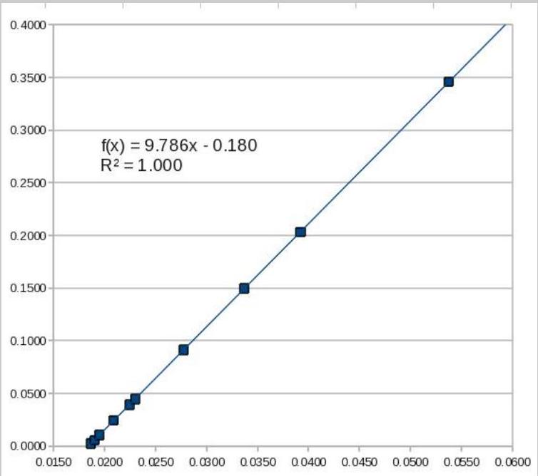

## Question A2

A thin, uniform rod of length $L$ and mass $M = 0.258 \mathrm {~kg}$ is suspended from a point a distance $R$ away from its center of mass. When the end of the rod is displaced slightly and released it executes simple harmonic oscillation. The period, $T$, of the oscillation is timed using an electronic timer. The following data is recorded for the period as a function of $R$. What is the local value of $g$ ? Do not assume it is the canonical value of $9.8 \mathrm {~m} / \mathrm { s } ^ { 2 }$. What is the length, $L$, of the rod? No estimation

of error in either value is required. The moment of inertia of a rod about its center of mass is $( 1 / 12 ) M L ^ { 2 }$.

| $R$ (m) | $T$ (s) |
| :--- | :--- |
| 0.050 | 3.842 |
| 0.075 | 3.164 |
| 0.102 | 2.747 |
| 0.156 | 2.301 |
| 0.198 | 2.115 |

| $R$ (m) | $T$ (s) |
| :--- | :--- |
| 0.211 | 2.074 |
| 0.302 | 1.905 |
| 0.387 | 1.855 |
| 0.451 | 1.853 |
| 0.588 | 1.900 |

You must show your work to obtain full credit. If you use graphical techniques then you must plot the graph; if you use linear regression techniques then you must show all of the formulae and associated workings used to obtain your result.

## Solution

Using the parallel axis theorem, the period of such a physical pendulum is

$$
T = 2 \pi \sqrt { \frac { I } { m g R } } = 2 \pi \sqrt { \frac { R ^ { 2 } + L ^ { 2 } / 12 } { g R } } .
$$

We can rearrange this into the linear form

$$
y = m x + b , \quad y = R ^ { 2 } , \quad x = \frac { T ^ { 2 } R } { 4 \pi ^ { 2 } } , \quad m = g , \quad b = - \frac { L ^ { 2 } } { 12 } .
$$

Filling out a data table, we get

| $R$ | $T$ | $T ^ { 2 } R / 4 \pi ^ { 2 }$ | $R ^ { 2 }$ |
| :--- | :--- | :--- | :--- |
| 0.050 | 3.842 | 0.0187 | 0.0025 |
| 0.075 | 3.164 | 0.0190 | 0.0056 |
| 0.102 | 2.747 | 0.0195 | 0.0104 |
| 0.156 | 2.301 | 0.0209 | 0.0243 |
| 0.198 | 2.115 | 0.0224 | 0.0392 |
| 0.211 | 2.074 | 0.0230 | 0.0445 |
| 0.302 | 1.905 | 0.0278 | 0.0912 |
| 0.387 | 1.855 | 0.0337 | 0.1498 |
| 0.451 | 1.853 | 0.0392 | 0.2034 |
| 0.588 | 1.900 | 0.0538 | 0.3457 |

The graph of $T ^ { 2 } R / 4 \pi ^ { 2 }$ versus $R ^ { 2 }$ is a line with slope $g$ and intercept $- L ^ { 2 } / 12$, which should be plotted on graph paper.

Looking at the graph, we read off the results

$$
g = 9.79 \mathrm {~m} / \mathrm { s } ^ { 2 } , \quad L = 1.47 \mathrm {~m} .
$$

Also note that most of the first few data points are not useful. To get full credit, only the five useful data points had to be used.
