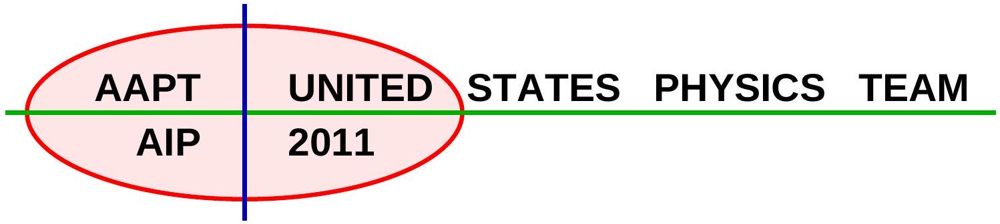
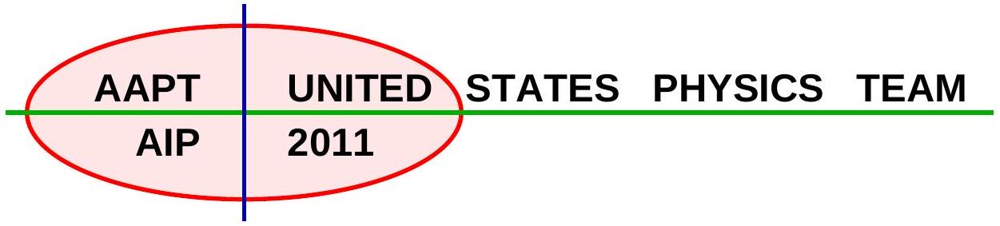
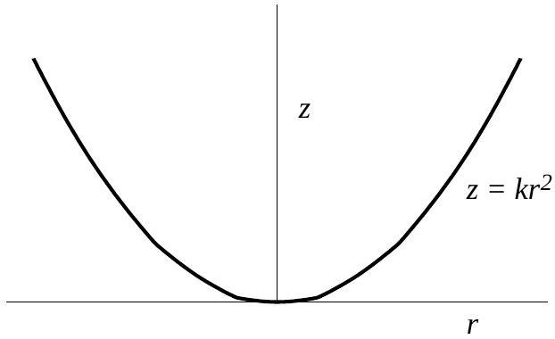
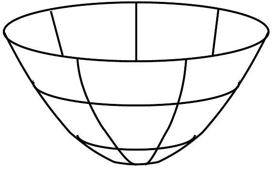

## Semifinal Exam

## DO NOT DISTRIBUTE THIS PAGE

## Important Instructions for the Exam Supervisor

- This examination consists of two parts.
- Part A has four questions and is allowed 90 minutes.
- Part B has two questions and is allowed 90 minutes.
- The first page that follows is a cover sheet. Examinees may keep the cover sheet for both parts of the exam.
- The parts are then identified by the center header on each page. Examinees are only allowed to do one part at a time, and may not work on other parts, even if they have time remaining.
- Allow 90 minutes to complete Part A. Do not let students look at Part B. Collect the answers to Part A before allowing the examinee to begin Part B. Examinees are allowed a 10 to 15 minutes break between parts A and B.
- Allow 90 minutes to complete Part B. Do not let students go back to Part A.
- Ideally the test supervisor will divide the question paper into 3 parts: the cover sheet (page 2), Part A (pages 3-4), and Part B (pages 6-7). Examinees should be provided parts A and B individually, although they may keep the cover sheet.
- The supervisor must collect all examination questions, including the cover sheet, at the end of the exam, as well as any scratch paper used by the examinees. Examinees may not take the exam questions. The examination questions may be returned to the students after March 31, 2011.
- Examinees are allowed calculators, but they may not use symbolic math, programming, or graphic features of these calculators. Calculators may not be shared and their memory must be cleared of data and programs. Cell phones, PDA's or cameras may not be used during the exam or while the exam papers are present. Examinees may not use any tables, books, or collections of formulas.
- Please provide the examinees with graph paper for Part A.

## Semifinal Exam   INSTRUCTIONS

## DO NOT OPEN THIS TEST UNTIL YOU ARE TOLD TO BEGIN

- Work Part A first. You have 90 minutes to complete all four problems. Each question is worth 25 points. Do not look at Part B during this time.
- After you have completed Part A you may take a break.
- Then work Part B. You have 90 minutes to complete both problems. Each question is worth 50 points. Do not look at Part A during this time.
- Show all your work. Partial credit will be given. Do not write on the back of any page. Do not write anything that you wish graded on the question sheets.
- Start each question on a new sheet of paper. Put your AAPT ID number, your name, the question number and the page number/total pages for this problem, in the upper right hand corner of each page. For example,
$$
\begin{gathered}
\text { AAPT ID \# } \\
\text { Doe, Jamie } \\
\text { A1-1/3 }
\end{gathered}
$$
- A hand-held calculator may be used. Its memory must be cleared of data and programs. You may use only the basic functions found on a simple scientific calculator. Calculators may not be shared. Cell phones, PDA's or cameras may not be used during the exam or while the exam papers are present. You may not use any tables, books, or collections of formulas.
- Questions with the same point value are not necessarily of the same difficulty.
- In order to maintain exam security, do not communicate any information about the questions (or their answers/solutions) on this contest until after April 1, 2011.

Possibly Useful Information. You may use this sheet for both parts of the exam.

$$
\begin{array} { l l }
g = 9.8 \mathrm {~N} / \mathrm { kg } & G = 6.67 \times 10 ^ { - 11 } \mathrm {~N} \cdot \mathrm {~m} ^ { 2 } / \mathrm { kg } ^ { 2 } \\
k = 1 / 4 \pi \epsilon _ { 0 } = 8.99 \times 10 ^ { 9 } \mathrm {~N} \cdot \mathrm {~m} ^ { 2 } / \mathrm { C } ^ { 2 } & k _ { \mathrm { m } } = \mu _ { 0 } / 4 \pi = 10 ^ { - 7 } \mathrm {~T} \cdot \mathrm {~m} / \mathrm { A } \\
c = 3.00 \times 10 ^ { 8 } \mathrm {~m} / \mathrm { s } & k _ { \mathrm { B } } = 1.38 \times 10 ^ { - 23 } \mathrm {~J} / \mathrm { K } \\
N _ { \mathrm { A } } = 6.02 \times 10 ^ { 23 } ( \mathrm {~mol} ) ^ { - 1 } & R = N _ { \mathrm { A } } k _ { \mathrm { B } } = 8.31 \mathrm {~J} / ( \mathrm { mol } \cdot \mathrm {~K} ) \\
\sigma = 5.67 \times 10 ^ { - 8 } \mathrm {~J} / \left( \mathrm { s } \cdot \mathrm {~m} ^ { 2 } \cdot \mathrm {~K} ^ { 4 } \right) & e = 1.602 \times 10 ^ { - 19 } \mathrm { C } \\
1 \mathrm { eV } = 1.602 \times 10 ^ { - 19 } \mathrm {~J} & h = 6.63 \times 10 ^ { - 34 } \mathrm {~J} \cdot \mathrm {~s} = 4.14 \times 10 ^ { - 15 } \mathrm { eV } \cdot \mathrm {~s} \\
m _ { e } = 9.109 \times 10 ^ { - 31 } \mathrm {~kg} = 0.511 \mathrm { MeV } / \mathrm { c } ^ { 2 } & ( 1 + x ) ^ { n } \approx 1 + n x \text { for } | x | \ll 1 \\
\sin \theta \approx \theta - \frac { 1 } { 6 } \theta ^ { 3 } \text { for } | \theta | \ll 1 & \cos \theta \approx 1 - \frac { 1 } { 2 } \theta ^ { 2 } \text { for } | \theta | \ll 1
\end{array}
$$

## Part A

## Question A1

Single bubble sonoluminescence occurs when sound waves cause a bubble suspended in a fluid to collapse so that the gas trapped inside increases in temperature enough to emit light. The bubble actually undergoes a series of expansions and collapses caused by the sound wave pressure variations.

We now consider a simplified model of a bubble undergoing sonoluminescence. Assume the bubble is originally at atmospheric pressure $P _ { 0 } = 101 \mathrm { kPa }$. When the pressure in the fluid surrounding the bubble is decreased, the bubble expands isothermally to a radius of $36.0 \mu \mathrm {~m}$. When the pressure increases again, the bubble collapses to a radius of $4.50 \mu \mathrm {~m}$ so quickly that no heat can escape. Between the collapse and subsequent expansion, the bubble undergoes isochoric (constant volume) cooling back to its original pressure and temperature. For a bubble containing a monatomic gas, suspended in water of $T = 293 \mathrm {~K}$, find

a. the number of moles of gas in the bubble,
b. the pressure after the expansion,
c. the pressure after collapse,
d. the temperature after the collapse, and
e. the total work done on the bubble during the whole process.

You may find the following useful: the specific heat capacity at constant volume is $C _ { V } = 3 R / 2$ and the ratio of specific heat at constant pressure to constant volume is $\gamma = 5 / 3$ for a monatomic gas.

## Solution

a. The most important thing in problems like this is to keep track of all the variables carefully. Let the initial pressure, volume, and temperature be $P _ { 0 } , V _ { 0 }$, and $T _ { 0 } = T$. The steps are:
    i. Isothermal expansion, after which we have $P _ { 1 } , V _ { 1 }$, and $T _ { 1 } = T _ { 0 }$.
    ii. Adiabatic collapse, after which we have $P _ { 2 } , V _ { 2 }$, and $T _ { 2 }$.
    iii. Isochoric cooling, to return to the initial state. This implies $V _ { 2 } = V _ { 0 }$.

In all cases the bubble contains an ideal monatomic gas, so

$$
P _ { i } V _ { i } = n R T _ { i } .
$$

We are also given the volumes

$$
V _ { 0 } = \frac { 4 } { 3 } \pi ( 4.50 \mu \mathrm {~m} ) ^ { 3 } = 3.82 \times 10 ^ { - 16 } \mathrm {~m} ^ { 3 } , \quad V _ { 0 } = \frac { 4 } { 3 } \pi ( 36.0 \mu \mathrm {~m} ) ^ { 3 } = 1.95 \times 10 ^ { - 13 } \mathrm {~m} ^ { 3 }
$$

In particular, we have

$$
n = \frac { P _ { 0 } V _ { 0 } } { R T _ { 0 } } = 1.58 \times 10 ^ { - 14 } \mathrm {~mol} .
$$

b. During an isothermal expansion, $P V$ is constant by the ideal gas law. Thus
$$
P _ { 1 } = \frac { P _ { 0 } V _ { 0 } } { V _ { 1 } } = 197 \mathrm {~Pa} .
$$
c. During an adiabatic process, $P V ^ { \gamma }$ is constant where here $\gamma = 5 / 3$, so
$$
P _ { 2 } = \frac { P _ { 1 } V _ { 1 } ^ { \gamma } } { V _ { 2 } ^ { \gamma } } = 6.46 \times 10 ^ { 6 } \mathrm {~Pa} .
$$
d. To find the temperature after collapse, we can use the ideal gas law again,
$$
T _ { 2 } = \frac { P _ { 2 } V _ { 2 } } { n R } = 1.88 \times 10 ^ { 4 } \mathrm {~K} .
$$
e. The work done on the bubble is $d W = - P d V$. During an isothermal expansion, we have
$$
\int P d V = n R T \int \frac { d V } { V } = n R T \log \frac { V _ { f } } { V _ { i } }
$$
so the work done on the bubble during the isothermal expansion is
$$
W _ { 1 } = - n R T \log \frac { V _ { 1 } } { V _ { 0 } } = - 2.40 \times 10 ^ { - 10 } \mathrm {~J} .
$$
During the adiabatic collapse, it is easiest to find the work done on the bubble using the first law of thermodynamics, $\Delta E = Q + W$. Since the process is adiabatic, $Q = 0$, so
$$
W _ { 2 } = \Delta E = n C _ { V } \Delta T = \frac { 3 n R } { 2 } \left( T _ { 2 } - T _ { 1 } \right) = 3.64 \times 10 ^ { - 9 } \mathrm {~J}
$$
where we used the fat that $C _ { V } = 3 R / 2$ for a monatomic gas. There is no work done during the isochoric process, so the total work done on the bubble is
$$
W = 3.40 \times 10 ^ { - 9 } \mathrm {~J} .
$$
Since the process is cyclic, this energy must have been radiated away by the bubble, in a flash of light. Note that the final (positive) sign is important. Some textbooks define $d W$ to be the work done on the bubble, while some define it to be the work done by the bubble. Depending on the conventions used, there may be some extra signs in intermediate steps, but the final answer doesn't depend on the convention.

## Question A2

A thin, uniform rod of length $L$ and mass $M = 0.258 \mathrm {~kg}$ is suspended from a point a distance $R$ away from its center of mass. When the end of the rod is displaced slightly and released it executes simple harmonic oscillation. The period, $T$, of the oscillation is timed using an electronic timer. The following data is recorded for the period as a function of $R$. What is the local value of $g$ ? Do not assume it is the canonical value of $9.8 \mathrm {~m} / \mathrm { s } ^ { 2 }$. What is the length, $L$, of the rod? No estimation

of error in either value is required. The moment of inertia of a rod about its center of mass is $( 1 / 12 ) M L ^ { 2 }$.

| $R$ (m) | $T$ (s) |
| :--- | :--- |
| 0.050 | 3.842 |
| 0.075 | 3.164 |
| 0.102 | 2.747 |
| 0.156 | 2.301 |
| 0.198 | 2.115 |

| $R$ (m) | $T$ (s) |
| :--- | :--- |
| 0.211 | 2.074 |
| 0.302 | 1.905 |
| 0.387 | 1.855 |
| 0.451 | 1.853 |
| 0.588 | 1.900 |

You must show your work to obtain full credit. If you use graphical techniques then you must plot the graph; if you use linear regression techniques then you must show all of the formulae and associated workings used to obtain your result.

## Solution

Using the parallel axis theorem, the period of such a physical pendulum is

$$
T = 2 \pi \sqrt { \frac { I } { m g R } } = 2 \pi \sqrt { \frac { R ^ { 2 } + L ^ { 2 } / 12 } { g R } } .
$$

We can rearrange this into the linear form

$$
y = m x + b , \quad y = R ^ { 2 } , \quad x = \frac { T ^ { 2 } R } { 4 \pi ^ { 2 } } , \quad m = g , \quad b = - \frac { L ^ { 2 } } { 12 } .
$$

Filling out a data table, we get

| $R$ | $T$ | $T ^ { 2 } R / 4 \pi ^ { 2 }$ | $R ^ { 2 }$ |
| :--- | :--- | :--- | :--- |
| 0.050 | 3.842 | 0.0187 | 0.0025 |
| 0.075 | 3.164 | 0.0190 | 0.0056 |
| 0.102 | 2.747 | 0.0195 | 0.0104 |
| 0.156 | 2.301 | 0.0209 | 0.0243 |
| 0.198 | 2.115 | 0.0224 | 0.0392 |
| 0.211 | 2.074 | 0.0230 | 0.0445 |
| 0.302 | 1.905 | 0.0278 | 0.0912 |
| 0.387 | 1.855 | 0.0337 | 0.1498 |
| 0.451 | 1.853 | 0.0392 | 0.2034 |
| 0.588 | 1.900 | 0.0538 | 0.3457 |

The graph of $T ^ { 2 } R / 4 \pi ^ { 2 }$ versus $R ^ { 2 }$ is a line with slope $g$ and intercept $- L ^ { 2 } / 12$, which should be plotted on graph paper.

Looking at the graph, we read off the results

$$
g = 9.79 \mathrm {~m} / \mathrm { s } ^ { 2 } , \quad L = 1.47 \mathrm {~m} .
$$

Also note that most of the first few data points are not useful. To get full credit, only the five useful data points had to be used.

## Question A3

A light bulb has a solid cylindrical filament of length $L$ and radius $a$, and consumes power $P$. You are to design a new light bulb, using a cylindrical filament of the same material, operating at the same voltage, and emitting the same spectrum of light, which will consume power $n P$. What are the length and radius of the new filament? Assume that the temperature of the filament is approximately uniform across its cross-section; the filament doesn't emit light from the ends; and energy loss due to convection is minimal.

## Solution

Since the new bulb emits the same spectrum of light, the emitted power is simply proportional to the surface area, where we ignore the surface area of the ends as directed,

$$
P \propto 2 \pi a L \propto a L .
$$

If the resistivity of the filament is $\rho$, the resistance is

$$
R = \frac { \rho L } { A } = \frac { \rho L } { \pi a ^ { 2 } } .
$$

Therefore, the power is also given by

$$
P = \frac { V ^ { 2 } } { R } = \frac { V ^ { 2 } \pi a ^ { 2 } } { \rho L } \propto \frac { a ^ { 2 } } { L } .
$$

Thus if the new power is $n P$, we may only satisfy both equations if the new radius and length are

$$
a ^ { \prime } = n ^ { 2 / 3 } a , \quad L ^ { \prime } = n ^ { 1 / 3 } L .
$$

If the powers given by the two equations were not equal, we would have a contradiction. This indicates that it is impossible to keep the bulb emitting the same spectrum using the same voltage. Supposing we did keep the voltage the same, the filament would burn hotter or cooler than before, changing the spectrum of the light.

## Question A4

In this problem we consider a simplified model of the electromagnetic radiation inside a cubical box of side length $L$. In this model, the electric field has spatial dependence

$$
E ( x , y , z ) = E _ { 0 } \sin \left( k _ { x } x \right) \sin \left( k _ { y } y \right) \sin \left( k _ { z } z \right)
$$

where one corner of the box lies at the origin and the box is aligned with the $x , y$, and $z$ axes. Let $h$ be Planck's constant, $k _ { B }$ be Boltzmann's constant, and $c$ be the speed of light.

a. The electric field must be zero everywhere at the sides of the box. What condition does this impose on $k _ { x } , k _ { y }$, and $k _ { z }$ ? (Assume that any of these may be negative, and include cases where one or more of the $k _ { i }$ is zero, even though this causes $E$ to be zero.)
b. In the model, each permitted value of the triple $\left( k _ { x } , k _ { y } , k _ { z } \right)$ corresponds to a quantum state. These states can be visualized in a state space, which is a notional three-dimensional space with axes corresponding to $k _ { x } , k _ { y }$, and $k _ { z }$. How many states occupy a volume $s$ of state space, if $s$ is large enough that the discreteness of the states can be ignored?
c. Each quantum state, in turn, may be occupied by photons with frequency $\omega = \frac { f } { 2 \pi } = c | \mathbf { k } |$, where
$$
| \mathbf { k } | = \sqrt { k _ { x } ^ { 2 } + k _ { y } ^ { 2 } + k _ { z } ^ { 2 } }
$$
In the model, if the temperature inside the box is $T$, no photon may have energy greater than $k _ { B } T$. What is the shape of the region in state space corresponding to occupied states?
d. As a final approximation, assume that each occupied state contains exactly one photon. What is the total energy of the photons in the box, in terms of $h , k _ { B } , c , T$, and the volume of the box $V$ ? Again, assume that the temperature is high enough that there are a very large number of occupied states. (Hint: divide state space into thin regions corresponding to photons of the same energy.)

Note that while many details of this model are extremely inaccurate, the final result is correct except for a numerical factor.

## Solution

a. The boundary conditions require $\sin \left( k _ { x } L \right) = 0$, so that
$$
k _ { x } L = n _ { x } \pi
$$
for any integer $n _ { x }$, with similar conditions for $k _ { y }$ and $k _ { z }$.
b. In the abstract state space, the states are spaced a distance $\pi / L$ apart. Each can therefore be thought of as occupying volume $\pi ^ { 3 } / L ^ { 3 }$, and the number of states in the volume $s$ is
$$
N = \frac { L ^ { 3 } s } { \pi ^ { 3 } } .
$$
c. A photon's energy is $E = \hbar \omega = \hbar c | \mathbf { k } |$, where $\hbar = h / 2 \pi$. Thus the occupied states obey
$$
\hbar c | \mathbf { k } | \leq k _ { B } T .
$$
This corresponds to a ball of radius $k _ { \max } = k _ { B } T / \hbar c$ in state space centered at the origin.
d. Naively, we would have to perform a triple integral over state space. However, the energy of a photon depends only on its distance |k| from the origin in state space. Hence we can integrate over spherical shells. Consider a shell bounded by radii $k$ and $k + d k$. The volume of this region is
$$
d s = 4 \pi k ^ { 2 } d k .
$$
Each state in this region contains a single photon with energy $\hbar c k$, so the shell yields energy
$$
d E = \hbar c k \frac { L ^ { 3 } } { \pi ^ { 3 } } d s = \frac { 4 } { \pi ^ { 2 } } \hbar c L ^ { 3 } k ^ { 3 } d k
$$
From our work above, $k$ ranges from zero to $k _ { \max }$, so the total energy is
$$
E = \frac { 4 } { \pi ^ { 2 } } \hbar c L ^ { 3 } \int _ { 0 } ^ { k _ { \max } } k ^ { 3 } d k = \frac { \hbar c L ^ { 3 } } { \pi ^ { 2 } } k _ { \max } ^ { 4 }
$$
Substituting $V = L ^ { 3 }$ and $h = 2 \pi \hbar$, this simplifies to
$$
E = \frac { 8 \pi k _ { B } ^ { 4 } } { h ^ { 3 } c ^ { 3 } } V T ^ { 4 }
$$
Note that everything has come out right, including the $T ^ { 4 }$ factor seen in the Stefan-Boltzmann law, though the numerical prefactor is wrong.

## STOP: Do Not Continue to Part B

If there is still time remaining for Part A, you should review your work for Part A, but do not continue to Part B until instructed by your exam supervisor.

## Part B

## Question B1

An AC power line cable transmits electrical power using a sinusoidal waveform with frequency 60 Hz. The load receives an RMS voltage of 500 kV and requires 1000 MW of average power. For this problem, consider only the cable carrying current in one of the two directions, and ignore effects due to capacitance or inductance between the cable and with the ground.

a. Suppose that the load on the power line cable is a residential area that behaves like a pure resistor.
    i. What is the RMS current carried in the cable?
    ii. The cable has diameter 3 cm, is 500 km long, and is made of aluminum with resistivity $2.8 \times 10 ^ { - 8 } \Omega \cdot \mathrm {~m}$. How much power is lost in the wire?
b. A local rancher thinks he might be able to extract electrical power from the cable using electromagnetic induction. The rancher constructs a rectangular loop of length $a$ and width $b < a$, consisting of $N$ turns of wire. One edge of the loop is to be placed on the ground; the wire is straight and runs parallel to the ground at a height $h > a$. Write the current in the wire as $I = I _ { 0 } \sin \omega t$, and assume the return wire is far away.
    i. Determine an expression for the magnitude of the magnetic field at a distance $r$ from the power line cable in terms of $I , r$, and fundamental constants.
    ii. Where should the loop be placed, and how should it be oriented, to maximize the induced emf in the loop?
    iii. Assuming the loop is placed in this way, determine an expression for the emf induced in the loop (as a function of time) in terms of any or all of $I _ { 0 } , h , a , b , N , \omega , t$, and fundamental constants.
    iv. Suppose that $a = 5 \mathrm {~m} , b = 2 \mathrm {~m}$, and $h = 100 \mathrm {~m}$. How many turns of wire $N$ does the rancher need to generate an RMS emf of 120 V?
c. The load at the end of the power line cable changes to include a manufacturing plant with a large number of electric motors. While the average power consumed remains the same, it now behaves like a resistor in parallel with a 0.25 H inductor.
    i. Does the power lost in the power line cable increase, decrease, or stay the same? (You need not calculate the new value explicitly, but you should show some work to defend your answer.)
    ii. The power company wishes to make the load behave as it originally did by installing a capacitor in parallel with the load. What should be its capacitance?

## Solution

a. i. Because the load is purely resistive, the average power is simply
$$
P = I _ { \mathrm { rms } } V _ { \mathrm { rms } }
$$
so
$$
I _ { \mathrm { rms } } = \frac { P } { V _ { \mathrm { rms } } } = 2000 \mathrm {~A} .
$$
    ii. The cross-sectional area of the wire is $A = \pi r ^ { 2 } = 7.07 \times 10 ^ { - 4 } \mathrm {~m} ^ { 2 }$, so its resistance is
$$
R = \frac { \rho L } { A } = 19.8 \Omega
$$
The power loss is then
$$
P = I ^ { 2 } R = 79.2 \mathrm { MW } .
$$
b. i. The field is perpendicular to the wire and to the radius, and from Ampere's Law
$$
\oint \mathbf { B } \cdot d \mathbf { s } = \mu _ { 0 } I
$$
The integral evaluates to $( 2 \pi r ) B$, giving
$$
B = \frac { \mu _ { 0 } I } { 2 \pi r } .
$$
This well-known result can also be written down without justification.
    ii. The induced emf is proportional to the rate of change of the flux through the loop. Since the time dependence of the magnetic field is uniform across space, the rate of change of flux is maximized by maximizing the flux itself. This in turn can be accomplished by maximizing the field in the loop and ensuring that it is normal to the loop. Because the field gets stronger closer to the wire, the loop should be directly below the wire, and since the field is horizontal and perpendicular to the wire at this location, the loop should be vertical and parallel to the wire. Finally, again because the field gets stronger closer to the wire, the long edge of the loop should be vertical.
In summary, the loop should be placed vertically, parallel to the wire and directly beneath it, with the long edge (of length $a$ ) vertical.
    iii. Faraday's law states
$$
\mathcal { E } = N \frac { d \Phi _ { B } } { d t }
$$
where we have dropped the sign, which is not important, and $\Phi _ { B }$ is the magnetic flux through a single loop. The flux is
$$
\Phi _ { B } = \int \mathbf { B } \cdot d \mathbf { A } = b \int _ { h - a } ^ { h } B ( r ) d r
$$
where we have divided the loop into strips of radial width $d r$ and length $b$. Plugging in the result of part (i),
$$
\Phi _ { B } = b \int _ { h - a } ^ { h } \frac { \mu _ { 0 } I } { 2 \pi r } d r = \frac { \mu _ { 0 } I b } { 2 \pi } \log \frac { h } { h - a } .
$$

The time dependence comes only from the current,
$$
\frac { d I } { d t } = \omega I _ { 0 } \cos \omega t .
$$
Therefore, we have
$$
\mathcal { E } = \frac { N \mu _ { 0 } b } { 2 \pi } \log \frac { h } { h - a } I _ { 0 } \omega \cos \omega t .
$$
iv. The RMS value of $I _ { 0 } \cos \omega t$ is simply $I _ { \text {rms } }$, so taking the RMS value of both sides,
$$
\mathcal { E } _ { \mathrm { rms } } = \frac { N \mu _ { 0 } b } { 2 \pi } \log \frac { h } { h - a } \omega I _ { \mathrm { rms } } = N \mu _ { 0 } b f \log \frac { h } { h - a } I _ { \mathrm { rms } }
$$
where we used $f = \omega / 2 \pi$. Plugging in the numbers, we have
$$
\mu _ { 0 } b f \log \frac { h } { h - a } I _ { \mathrm { rms } } = 0.0155 \mathrm {~V}
$$
so the required number of turns is
$$
N = 7760 .
$$
c. i. The inductor adds a new component of the current in the wire which is 90° out of phase with the voltage. The rms current is increased, so the power lost in the wire increases. This can also be shown more formally using complex impedances. Ohm's law is
$$
V = I Z
$$
where both $V$ and $I$ are complex numbers, with their relative phase indicating the relative phase of the voltage and current. Without the inductance, $Z = R$. With the inductance, the two impedances add in parallel,
$$
Z = \left( \frac { 1 } { R } + \frac { 1 } { i \omega L } \right) ^ { - 1 }
$$
Since $| Z |$ is lower and $V$ remains the same, $| I |$ increases, as argued above.
    ii. The most straightforward method is to use complex impedances. We wish to cancel the imaginary component supplied by the inductor, so we need
$$
\frac { 1 } { i \omega L } + i \omega C = 0
$$
since they are in parallel. This is equivalent to
$$
\omega = \frac { 1 } { \sqrt { L C } }
$$
so that
$$
C = \frac { 1 } { \omega ^ { 2 } L } = 28.1 \mu \mathrm {~F} .
$$
One can also arrive at this result without complex impedances. No external current is needed to make an LC circuit oscillate at its natural frequency; current simply sloshes back and forth between the inductor and capacitor, without any going through the power cable. Hence if the power cable frequency matches the natural frequency of the LC circuit, the LC circuit will not affect the current in the cable; the load behaves as if there were no LC circuit present at all. This gives the condition $\omega = 1 / \sqrt { L C }$ as above.

## Question B2

A particle is constrained to move on the inner surface of a frictionless parabolic bowl whose crosssection has equation $z = k r ^ { 2 }$. The particle begins at a height $z _ { 0 }$ above the bottom of the bowl with a horizontal velocity $v _ { 0 }$ along the surface of the bowl. The acceleration due to gravity is $g$.

a. For a particular value of horizontal velocity $v _ { 0 }$, which we will name $v _ { h }$, the particle moves in a horizontal circle. What is $v _ { h }$ in terms of $g , z _ { 0 }$, and/or $k$ ?
b. Suppose that the initial horizontal velocity is now $v _ { 0 } > v _ { h }$. What is the maximum height reached by the particle, in terms of $v _ { 0 } , z _ { 0 } , g$ and/or $k$ ?
c. Suppose that the particle now begins at a height $z _ { 0 }$ above the bottom of the bowl with an initial velocity $v _ { 0 } = 0$.
    i. Assuming that $z _ { 0 }$ is small enough so that the motion can be approximated as simple harmonic, find the period of the motion in terms any or all of the mass of the particle $m , g , z _ { 0 }$, and/or $k$.
    ii. Assuming that $z _ { 0 }$ is not small, will the actual period of motion be greater than, less than, or equal to your simple harmonic approximation above? (You need not calculate the new value explicitly, but you should show some work to defend your answer.)

## Solution

a. Let the radius of the bowl at height $z _ { 0 }$ be $r _ { 0 }$ and let the angle made by the bowl's surface to the horizontal at that height be $\theta$.
Two forces act on the particle: the normal force and gravity. If the particle moves in a horizontal circle, the vertical components of these forces cancel, and the horizontal component of the normal force is the centripetal force. Then
$$
N \sin \theta = \frac { m v _ { h } ^ { 2 } } { r _ { 0 } } , \quad N \cos \theta = m g .
$$
Combining these,
$$
\tan \theta = \frac { v _ { h } ^ { 2 } } { g r _ { 0 } } .
$$
Now $\tan \theta$ is the slope of the bowl $d z / d r = 2 k r _ { 0 }$, so
$$
2 k r _ { 0 } = \frac { v _ { h } ^ { 2 } } { g r _ { 0 } }
$$

Using $z _ { 0 } = k r _ { 0 } ^ { 2 }$ and solving for $v _ { h }$ gives
$$
v _ { h } = \sqrt { 2 g z _ { 0 } }
$$
b. Let the maximum height be $z$, let the radius of the bowl at this point be $r$, and let the speed of the particle at this point be $v$. By conservation of energy,
$$
\frac { 1 } { 2 } m v _ { 0 } ^ { 2 } + m g z _ { 0 } = \frac { 1 } { 2 } m v ^ { 2 } + m g z .
$$
The two forces acting on the particle never exert a torque in the $z$-direction, so the $z$ component of the angular momentum is conserved. Furthermore, at both the initial and final heights, the velocity of the particle is perpendicular to the $z$-axis, so
$$
m v _ { 0 } r _ { 0 } = m v r \quad \Rightarrow \quad v = v _ { 0 } \frac { r _ { 0 } } { r } .
$$
Using the equation of the bowl,
$$
v = v _ { 0 } \sqrt { \frac { z _ { 0 } } { z } } .
$$
Using this to eliminate $v$ in the energy conservation equation, we find a quadratic in $z$,
$$
z ^ { 2 } - \left( \frac { v _ { 0 } ^ { 2 } } { 2 g } + z _ { 0 } \right) z + \frac { v _ { 0 } ^ { 2 } } { 2 g } z _ { 0 } = 0 .
$$
The roots of this quadratic sum to $z _ { 0 } + v _ { 0 } ^ { 2 } / 2 g$, and there is a root $z = z _ { 0 }$ corresponding to the initial condition, so the desired root is
$$
z = \frac { v _ { 0 } ^ { 2 } } { 2 g } .
$$
The two roots are equal when $v _ { 0 } = v _ { h }$, providing an alternate solution to part (a).
c. i. We present a force-based approach and an energy-based approach. In each case, let $r$ be the radial position of the particle, so that $z = k r ^ { 2 }$ is the height of the particle above the bottom of the bowl.
Let the angle of the bowl's surface to the horizontal be $\theta$. Because $z _ { 0 }$ is small,
$$
\sin \theta \approx \theta \approx \tan \theta = \frac { d z } { d r } = 2 k r
$$
and $\cos \theta \approx 1$. Moreover, since $z _ { 0 }$ is small, the centripetal acceleration is negligible, so we can consider only the tangential acceleration. Since the force tangential to the bowl is $m g \sin \theta$, this is $a = g \sin \theta$. The radial acceleration $a _ { r }$ is
$$
a _ { r } = - a \cos \theta = - g \cos \theta \sin \theta .
$$
Then in the small- $z$ approximation,
$$
a _ { r } \approx - g \tan \theta = - 2 k r g .
$$

This is simple harmonic motion with $\omega = \sqrt { 2 k g }$ and hence period

$$
T = \frac { 2 \pi } { \sqrt { 2 k g } }
$$

The energy-based approach begins with the total energy

$$
E = \frac { 1 } { 2 } m v ^ { 2 } + m g z .
$$

The velocity $v$ is given by

$$
v ^ { 2 } = \left( \frac { d r } { d t } \right) ^ { 2 } + \left( \frac { d z } { d t } \right) ^ { 2 } .
$$

Because $z$ is small, $\frac { d z } { d t } \ll \frac { d r } { d t }$, and we conclude that

$$
E = \frac { 1 } { 2 } m \left( \frac { d r } { d t } \right) ^ { 2 } + m g k r ^ { 2 }
$$

By conservation of energy,

$$
0 = \frac { d E } { d t } = m \frac { d r } { d t } \frac { d ^ { 2 } r } { d t ^ { 2 } } + 2 m g k r \frac { d r } { d t }
$$

which implies that

$$
0 = \frac { d ^ { 2 } r } { d t ^ { 2 } } + 2 k r g
$$

which is the same equation as before.

ii. The period is greater than the simple harmonic period. In the force-based approach, we found
$$
a _ { r } = - g \cos \theta \sin \theta
$$
and approximated it as
$$
a _ { r } = - g \tan \theta .
$$
Since $\cos \theta \sin \theta < \tan \theta$, this is an overestimate, so the period is actually larger.
In the energy-based approach, we dropped a positive term in the formula for the speed $v$ as expressed in terms of $\frac { d r } { d t }$. Therefore we overestimated $\frac { d r } { d t }$, and again the particle takes longer to reach the origin in reality than it does in the approximation.
