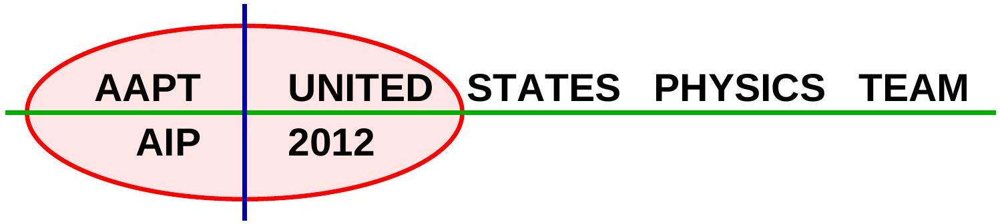
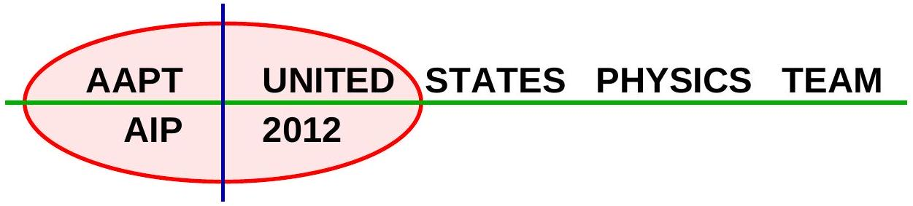
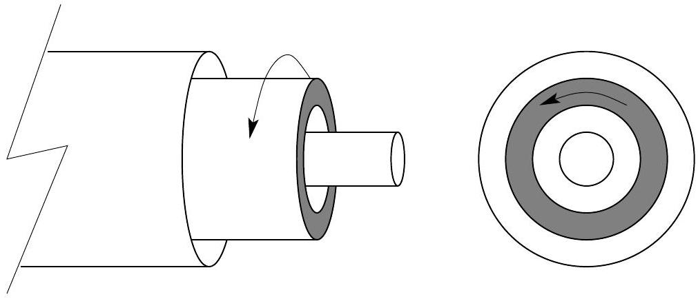
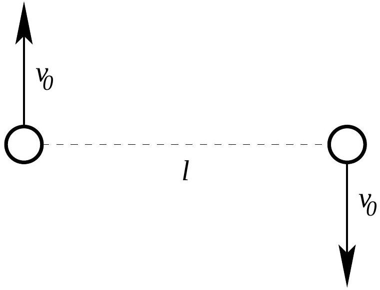

## Semifinal Exam

## DO NOT DISTRIBUTE THIS PAGE

## Important Instructions for the Exam Supervisor

- This examination consists of two parts.
- Part A has four questions and is allowed 90 minutes.
- Part B has two questions and is allowed 90 minutes.
- The first page that follows is a cover sheet. Examinees may keep the cover sheet for both parts of the exam.
- The parts are then identified by the center header on each page. Examinees are only allowed to do one part at a time, and may not work on other parts, even if they have time remaining.
- Allow 90 minutes to complete Part A. Do not let students look at Part B. Collect the answers to Part A before allowing the examinee to begin Part B. Examinees are allowed a 10 to 15 minute break between parts A and B.
- Allow 90 minutes to complete Part B. Do not let students go back to Part A.
- Ideally the test supervisor will divide the question paper into 3 parts: the cover sheet (page 2), Part A (pages 3-4), and Part B (pages 6-7). Examinees should be provided parts A and B individually, although they may keep the cover sheet.
- The supervisor must collect all examination questions, including the cover sheet, at the end of the exam, as well as any scratch paper used by the examinees. Examinees may not take the exam questions. The examination questions may be returned to the students after April 1, 2012.
- Examinees are allowed calculators, but they may not use symbolic math, programming, or graphic features of these calculators. Calculators may not be shared and their memory must be cleared of data and programs. Cell phones, PDA's or cameras may not be used during the exam or while the exam papers are present. Examinees may not use any tables, books, or collections of formulas.
- Please provide the examinees with graph paper for Part A.

## Semifinal Exam   INSTRUCTIONS

## DO NOT OPEN THIS TEST UNTIL YOU ARE TOLD TO BEGIN

- Work Part A first. You have 90 minutes to complete all four problems. Each question is worth 25 points. Do not look at Part B during this time.
- After you have completed Part A you may take a break.
- Then work Part B. You have 90 minutes to complete both problems. Each question is worth 50 points. Do not look at Part A during this time.
- Show all your work. Partial credit will be given. Do not write on the back of any page. Do not write anything that you wish graded on the question sheets.
- Start each question on a new sheet of paper. Put your AAPT ID number, your name, the question number and the page number/total pages for this problem, in the upper right hand corner of each page. For example,
$$
\begin{gathered}
\text { AAPT ID \# } \\
\text { Doe, Jamie } \\
\text { A1-1/3 }
\end{gathered}
$$
- A hand-held calculator may be used. Its memory must be cleared of data and programs. You may use only the basic functions found on a simple scientific calculator. Calculators may not be shared. Cell phones, PDA's or cameras may not be used during the exam or while the exam papers are present. You may not use any tables, books, or collections of formulas.
- Questions with the same point value are not necessarily of the same difficulty.
- In order to maintain exam security, do not communicate any information about the questions (or their answers/solutions) on this contest until after April 1, 2012.

Possibly Useful Information. You may use this sheet for both parts of the exam.

$$
\begin{array} { l l }
g = 9.8 \mathrm {~N} / \mathrm { kg } & G = 6.67 \times 10 ^ { - 11 } \mathrm {~N} \cdot \mathrm {~m} ^ { 2 } / \mathrm { kg } ^ { 2 } \\
k = 1 / 4 \pi \epsilon _ { 0 } = 8.99 \times 10 ^ { 9 } \mathrm {~N} \cdot \mathrm {~m} ^ { 2 } / \mathrm { C } ^ { 2 } & k _ { \mathrm { m } } = \mu _ { 0 } / 4 \pi = 10 ^ { - 7 } \mathrm {~T} \cdot \mathrm {~m} / \mathrm { A } \\
c = 3.00 \times 10 ^ { 8 } \mathrm {~m} / \mathrm { s } & k _ { \mathrm { B } } = 1.38 \times 10 ^ { - 23 } \mathrm {~J} / \mathrm { K } \\
N _ { \mathrm { A } } = 6.02 \times 10 ^ { 23 } ( \mathrm {~mol} ) ^ { - 1 } & R = N _ { \mathrm { A } } k _ { \mathrm { B } } = 8.31 \mathrm {~J} / ( \mathrm { mol } \cdot \mathrm {~K} ) \\
\sigma = 5.67 \times 10 ^ { - 8 } \mathrm {~J} / \left( \mathrm { s } \cdot \mathrm {~m} ^ { 2 } \cdot \mathrm {~K} ^ { 4 } \right) & e = 1.602 \times 10 ^ { - 19 } \mathrm { C } \\
1 \mathrm { eV } = 1.602 \times 10 ^ { - 19 } \mathrm {~J} & h = 6.63 \times 10 ^ { - 34 } \mathrm {~J} \cdot \mathrm {~s} = 4.14 \times 10 ^ { - 15 } \mathrm { eV } \cdot \mathrm {~s} \\
m _ { e } = 9.109 \times 10 ^ { - 31 } \mathrm {~kg} = 0.511 \mathrm { MeV } / \mathrm { c } ^ { 2 } & ( 1 + x ) ^ { n } \approx 1 + n x \text { for } | x | \ll 1 \\
\sin \theta \approx \theta - \frac { 1 } { 6 } \theta ^ { 3 } \text { for } | \theta | \ll 1 & \cos \theta \approx 1 - \frac { 1 } { 2 } \theta ^ { 2 } \text { for } | \theta | \ll 1
\end{array}
$$

## Part A

Question A1
A newly discovered subatomic particle, the $S$ meson, has a mass $M$. When at rest, it lives for exactly $\tau = 3 \times 10 ^ { - 8 }$ seconds before decaying into two identical particles called $P$ mesons (peons?) that each have a mass of $\alpha M$.

a. In a reference frame where the S meson is at rest, determine
    i. the kinetic energy,
    ii. the momentum, and
    iii. the velocity

of each P meson particle in terms of $M , \alpha$, the speed of light $c$, and any numerical constants.

b. In a reference frame where the S meson travels 9 meters between creation and decay, determine
    i. the velocity and
    ii. kinetic energy of the S meson.

Write the answers in terms of $M$, the speed of light $c$, and any numerical constants.

## Solution

a. Let $K , p$, and $v$ be the kinetic energy, momentum, and velocity of each P meson.
    i. We apply energy conservation,
$$
M c ^ { 2 } = 2 \left( K + \alpha M c ^ { 2 } \right) \quad \Rightarrow \quad K = \left( \frac { 1 } { 2 } - \alpha \right) M c ^ { 2 } .
$$
    ii. Note that each P meson has a total energy of $E = M c ^ { 2 } / 2$. The energy and momentum of a particle of mass $m$ must always satisfy
$$
E ^ { 2 } = p ^ { 2 } c ^ { 2 } + m ^ { 2 } c ^ { 4 }
$$
which in this case gives
$$
\frac { M ^ { 2 } c ^ { 4 } } { 4 } = p ^ { 2 } c ^ { 2 } + \alpha ^ { 2 } M ^ { 2 } c ^ { 4 } \Rightarrow p = M c \sqrt { \frac { 1 } { 4 } - \alpha ^ { 2 } } .
$$
    iii. The relativistic momentum and energy for a particle of mass $m$ satisfy
$$
p = \gamma m v , \quad E = \gamma m c ^ { 2 } \Rightarrow v = \frac { p c ^ { 2 } } { E } .
$$
Then in this particular case we have
$$
v = c \sqrt { 1 - 4 \alpha ^ { 2 } } .
$$

b. i. By ordinary kinematics, we have
$$
d = v t = v \gamma \tau , \quad \gamma = 1 / \sqrt { 1 - v ^ { 2 } / c ^ { 2 } }
$$
where $\gamma$ is the time dilation factor. Now we have to solve for $v$. Defining $\alpha = d / c \tau$,
$$
\alpha = \frac { v } { \sqrt { c ^ { 2 } - v ^ { 2 } } } \quad \Rightarrow \quad \alpha ^ { 2 } = \frac { v ^ { 2 } } { c ^ { 2 } - v ^ { 2 } } = \frac { 1 } { 1 - v ^ { 2 } / c ^ { 2 } } - 1 .
$$
Solving for $v$ gives
$$
v = \frac { c } { \sqrt { 1 + \alpha ^ { - 2 } } } .
$$
Plugging in the numbers, we find $\alpha = 1$, so $v = c / \sqrt { 2 }$.
    ii. Using the result of the previous part, we find $\gamma = \sqrt { 2 }$. The kinetic energy is just the total energy minus the mass-energy, so
$$
K = \gamma M c ^ { 2 } - M c ^ { 2 } = ( \sqrt { 2 } - 1 ) M c ^ { 2 } .
$$

## Question A2

An ideal (but not necessarily perfect monatomic) gas undergoes the following cycle.

- The gas starts at pressure $P _ { 0 }$, volume $V _ { 0 }$ and temperature $T _ { 0 }$.
- The gas is heated at constant volume to a pressure $\alpha P _ { 0 }$, where $\alpha > 1$.
- The gas is then allowed to expand adiabatically (no heat is transferred to or from the gas) to pressure $P _ { 0 }$
- The gas is cooled at constant pressure back to the original state.

The adiabatic constant $\gamma$ is defined in terms of the specific heat at constant pressure $C _ { p }$ and the specific heat at constant volume $C _ { v }$ by the ratio $\gamma = C _ { p } / C _ { v }$.

a. Determine the efficiency of this cycle in terms of $\alpha$ and the adiabatic constant $\gamma$. As a reminder, efficiency is defined as the ratio of work out divided by heat in.
b.A lab worker makes measurements of the temperature and pressure of the gas during the adiabatic process. The results, in terms of $T _ { 0 }$ and $P _ { 0 }$ are

| Pressure | units of $P _ { 0 }$ | 1.21 | 1.41 | 1.59 | 1.73 | 2.14 |
| :--- | :--- | :--- | :--- | :--- | :--- | :--- |
| Temperature | units of $T _ { 0 }$ | 2.11 | 2.21 | 2.28 | 2.34 | 2.49 |

Plot an appropriate graph from this data that can be used to determine the adiabatic constant.
c. What is $\gamma$ for this gas?

## Solution

a. Label the end points as 0,1 , and 2 . The ideal gas law yields $T _ { 1 } = \alpha T _ { 0 }$. The quantity $P V ^ { \gamma }$ is conserved along the adiabatic process $1 \rightarrow 2$, so
$$
P _ { 1 } V _ { 1 } ^ { \gamma } = P _ { 2 } V _ { 2 } ^ { \gamma } = \frac { 1 } { \alpha } P _ { 1 } V _ { 2 } ^ { \gamma } \Rightarrow V _ { 2 } = V _ { 1 } \alpha ^ { 1 / \gamma } = V _ { 0 } \alpha ^ { 1 / \gamma } .
$$
Again using the ideal gas law
$$
T _ { 2 } = \alpha ^ { 1 / \gamma } T _ { 0 } .
$$
Now, heat enters the gas during the isochoric process $0 \rightarrow 1$, so
$$
Q _ { \mathrm { in } } = n C _ { v } \Delta T = n C _ { v } ( \alpha - 1 ) T _ { 0 } .
$$
Heat exits the system during the process $2 \rightarrow 0$, so
$$
Q _ { \text {out } } = n C _ { p } \Delta T = n C _ { p } \left( \alpha ^ { 1 / \gamma } - 1 \right) T _ { 0 } .
$$
The work done is the difference,
$$
W = Q _ { \text {in } } - Q _ { \text {out } } = n C _ { v } ( \alpha - 1 ) T _ { 0 } - n C _ { p } \left( \alpha ^ { 1 / \gamma } - 1 \right) T _ { 0 }
$$
and the efficiency is then
$$
\eta = \frac { W } { Q _ { \mathrm { in } } } = \frac { C _ { v } ( \alpha - 1 ) - C _ { p } \left( \alpha ^ { 1 / \gamma } - 1 \right) } { C _ { v } ( \alpha - 1 ) } = 1 - \gamma \frac { \alpha ^ { 1 / \gamma } - 1 } { \alpha - 1 }
$$
where we used the definition $\gamma = C _ { p } / C _ { v }$.

b. For an adiabatic process, the quantity
$$
P V ^ { \gamma } \left( \frac { T } { P V } \right) ^ { \gamma } = P ^ { 1 - \gamma } T ^ { \gamma }
$$
is constant, which implies that
$$
P \propto T ^ { \gamma / ( \gamma - 1 ) } .
$$
Thus, if we make a graph with $\log T$ on the horizontal axis and $\log P$ on the vertical, we will find a line with slope $\gamma / ( \gamma - 1 )$. To get full credit, all five data points should be plotted and used, though one can get an approximate result with just two.
c. Using the data given, we find a slope of about 3.5, giving $\gamma \approx 1.4$, as expected for a diatomic gas. Note that credit will not be given for simply writing this number down; some degree of data analysis is necessary.

## Question A3

This problem inspired by the 2008 Guangdong Province Physics Olympiad
Two infinitely long concentric hollow cylinders have radii $a$ and $4 a$. Both cylinders are insulators; the inner cylinder has a uniformly distributed charge per length of $+ \lambda$; the outer cylinder has a uniformly distributed charge per length of $- \lambda$.

An infinitely long dielectric cylinder with permittivity $\epsilon = \kappa \epsilon _ { 0 }$, where $\kappa$ is the dielectric constant, has a inner radius $2 a$ and outer radius $3 a$ is also concentric with the insulating cylinders. The dielectric cylinder is rotating about its axis with an angular velocity $\omega \ll c / a$, where $c$ is the speed of light. Assume that the permeability of the dielectric cylinder and the space between the cylinders is that of free space, $\mu _ { 0 }$.

a. Determine the electric field for all regions.
b. Determine the magnetic field for all regions.

## Solution

a. Consider a Gaussian cylinder of radius $r$ and length $l$ centered on the cylinder axis. The electric field is radial, so Gauss's Law states that
$$
\oint \mathbf { E } \cdot d \mathbf { A } = \frac { q _ { \text {in } } } { \epsilon _ { 0 } } \Rightarrow 2 \pi r E l = \frac { \lambda _ { \text {in } } l } { \epsilon _ { 0 } }
$$
where $\lambda _ { \text {in } }$ is the linear charge density enclosed in the cylinder, so
$$
\mathbf { E } = \frac { \lambda _ { \text {in } } } { 2 \pi r \epsilon _ { 0 } } \hat { \mathbf { r } } .
$$
The field due to the hollow cylinders alone is therefore
$$
\mathbf { E } _ { \text {applied } } = \frac { \lambda } { 2 \pi r \epsilon _ { 0 } } \hat { \mathbf { r } } \times \begin{cases} 0 & r < a \\ 1 & a < r < 4 a \\ 0 & r > 4 a \end{cases}
$$
However, the field within the dielectric is reduced by a factor $\kappa$, so that in total
$$
\mathbf { E } = \frac { \lambda } { 2 \pi r \epsilon _ { 0 } } \hat { \mathbf { r } } \times \begin{cases} 0 & r < a \\ 1 & a < r < 2 a \\ 1 / \kappa & 2 a < r < 3 a \\ 1 & 3 < r < 4 a \\ 0 & r > 4 a \end{cases}
$$

b. We can apply the results of the previous section to obtain the enclosed charge density $\lambda _ { \text {in } }$ as a function of radius,
$$
\lambda _ { \mathrm { in } } = \begin{cases} 0 & r < a \\ \lambda & a < r < 2 a \\ \lambda / \kappa & 2 a < r < 3 a \\ \lambda & 3 < r < 4 a \\ 0 & r > 4 a \end{cases}
$$
Defining
$$
\lambda _ { i } = \left( 1 - \frac { 1 } { \kappa } \right) \lambda
$$
we conclude that a charge density $- \lambda _ { i }$ exists on the inner surface of the dielectric, a charge density $\lambda _ { i }$ exists on the outer surface, and there is no charge on the interior.
As with the case of a very long solenoid, we expect the magnetic field to be entirely parallel to the cylinder axis $\hat { \mathbf { z } }$, and to go to zero for large $r$. Consider an Amperian loop of length $l$ extending along a radius, the inner side of which is at radius $r$ and the outer side of which is at a very large radius. We have on this loop
$$
\oint \mathbf { B } \cdot d \mathbf { l } = \mu _ { 0 } I _ { \mathrm { in } } .
$$
Letting $B$ be the magnitude of the magnetic field at radius $r$, we find
$$
B = \frac { \mu _ { 0 } I _ { \text {in } } } { l } .
$$
For $r > 3 a , I _ { \text {in } } = 0$, since the charge on the hollow cylinders is not moving. For $2 a < r < 3 a$, the loop now encloses the outer surface of the dielectric. In time $\frac { 2 \pi } { \omega }$ a charge $\lambda _ { i } l$ passes through the loop, so the current due to the outer surface is
$$
I _ { \mathrm { out } } = \frac { \lambda _ { i } l \omega } { 2 \pi }
$$
and thus this is $I _ { \text {in } }$ for $2 a < r < 3 a$. For $r < 2 a$, the loop now encloses both surfaces of the dielectric; the inner surface contributes a current that exactly cancels the outer one, so again $I _ { \text {in } } = 0$. Putting this together,
$$
\mathbf { B } = \frac { \mu _ { 0 } \omega \lambda _ { i } } { 2 \pi } \hat { \mathbf { z } } \times \begin{cases} 0 & r < 2 a \\ 1 & 2 a < r < 3 a \\ 0 & r > 3 a \end{cases}
$$

## Question A4

Two masses $m$ separated by a distance $l$ are given initial velocities $v _ { 0 }$ as shown in the diagram. The masses interact only through universal gravitation.

a. Under what conditions will the masses eventually collide?
b. Under what conditions will the masses follow circular orbits of diameter $l$ ?
c. Under what conditions will the masses follow closed orbits?
d. What is the minimum distance achieved between the masses along their path?

## Solution

a. Intuitively, it is impossible for the masses to collide unless $v _ { 0 } = 0$, by angular momentum conservation.
It's okay to simply write this down, but it's worth taking a closer look, as this intuitive argument is not true for all central forces. By angular momentum conservation, $v r$ is constant where $r$ is the radial separation and $v$ is the tangential velocity. Therefore, the kinetic energy of the particles diverges as $E \propto v ^ { 2 } \propto 1 / r ^ { 2 }$ as the masses get closer together. But the potential energy only falls as $V \propto - 1 / r$, i.e. it diverges negatively slower than the kinetic energy diverges positively. Thus by energy conservation, it is impossible for the masses to collide unless $L = 0$, for this particular potential.
b. In this case, the masses undergo uniform circular motion with radius $l / 2$ and speed $v _ { 0 }$, so that
$$
\frac { G m ^ { 2 } } { l ^ { 2 } } = \frac { m v _ { 0 } ^ { 2 } } { l / 2 } \Rightarrow \frac { G m } { v _ { 0 } ^ { 2 } l } = 2 .
$$
c. The masses follow closed orbits if they do not have enough energy to escape to infinity, i.e. if the total energy of the system is negative,
$$
E = 2 \cdot \frac { 1 } { 2 } m v _ { 0 } ^ { 2 } - \frac { G m ^ { 2 } } { l } < 0 \quad \Rightarrow \quad \frac { G m } { v _ { 0 } ^ { 2 } l } > 1 .
$$

d. Note that the masses will always move symmetrically about the center of mass. Thus, in order to be at minimum separation, their velocities must be perpendicular to the line joining them (and will be oppositely directed). Let the minimum separation be $d$, and let the speed of each mass at minimum separation be $v$. The angular momentum is then
$$
L = 2 m v \frac { d } { 2 } = m v d
$$
The initial angular momentum is likewise $m v _ { 0 } l$, so by conservation of angular momentum
$$
v = v _ { 0 } \frac { l } { d } .
$$
By conservation of energy,
$$
2 \cdot \frac { 1 } { 2 } m v _ { 0 } ^ { 2 } - \frac { G m ^ { 2 } } { l } = 2 \cdot \frac { 1 } { 2 } m v ^ { 2 } - \frac { G m ^ { 2 } } { d }
$$
which simplifies to
$$
v _ { 0 } ^ { 2 } - \frac { G m } { l } = v ^ { 2 } - \frac { G m } { d } .
$$
Combining these,
$$
v _ { 0 } ^ { 2 } - \frac { G m } { l } = v _ { 0 } ^ { 2 } \frac { l ^ { 2 } } { d ^ { 2 } } - \frac { G m } { d } .
$$
Defining the parameter $\alpha = G m / v _ { 0 } ^ { 2 } l$, this simplifies to
$$
( 1 - \alpha ) \left( \frac { d } { l } \right) ^ { 2 } + \alpha \left( \frac { d } { l } \right) - 1 = 0
$$
This quadratic has the solutions
$$
d = l \quad \text { or } \quad d = \frac { l } { \alpha - 1 } .
$$
The second root is physically sensible only if $\alpha > 1$, and it is the smaller one only if $\alpha > 2$. Note that both of these results make sense in light of parts (b) and (c). Then the minimum separation is
$$
d = \begin{cases} l & \alpha \leq 2 \\ l / ( \alpha - 1 ) & \alpha > 2 \end{cases}
$$

## STOP: Do Not Continue to Part B

If there is still time remaining for Part A, you should review your work for Part A, but do not continue to Part B until instructed by your exam supervisor.

## Part B

## Question B1

A particle of mass $m$ moves under a force similar to that of an ideal spring, except that the force repels the particle from the origin:

$$
F = + m \alpha ^ { 2 } x
$$

In simple harmonic motion, the position of the particle as a function of time can be written

$$
x ( t ) = A \cos \omega t + B \sin \omega t
$$

Likewise, in the present case we have

$$
x ( t ) = A f _ { 1 } ( t ) + B f _ { 2 } ( t )
$$

for some appropriate functions $f _ { 1 }$ and $f _ { 2 }$.

a. $f _ { 1 } ( t )$ and $f _ { 2 } ( t )$ can be chosen to have the form $e ^ { r t }$. What are the two appropriate values of $r$ ?
b. Suppose that the particle begins at position $x ( 0 ) = x _ { 0 }$ and with velocity $v ( 0 ) = 0$. What is $x ( t )$ ?
c. A second, identical particle begins at position $x ( 0 ) = 0$ with velocity $v ( 0 ) = v _ { 0 }$. The second particle becomes closer and closer to the first particle as time goes on. What is $v _ { 0 }$ ?

## Solution

a. Newton's second law gives
$$
\frac { d ^ { 2 } x } { d t ^ { 2 } } - \alpha ^ { 2 } x = 0
$$
As with the case of simple harmonic motion, we solve the differential equation using a trial function, in this case $x ( t ) = A e ^ { r t }$. (This may look a bit ad hoc, but it's actually quite general; exponentials are essentially the general solution for any linear differential equation.) Then
$$
\frac { d ^ { 2 } } { d t ^ { 2 } } \left( A e ^ { r t } \right) - \alpha ^ { 2 } A e ^ { r t } = r ^ { 2 } A e ^ { r t } - \alpha ^ { 2 } A e ^ { r t } = 0
$$
which implies that $r = \pm \alpha$.
b. Since the differential equation is linear in $x$, the general solution is a superposition of our two solutions,
$$
x ( t ) = A e ^ { \alpha t } + B e ^ { - \alpha t }
$$
which implies
$$
v ( t ) = \alpha A e ^ { \alpha t } - \alpha B e ^ { - \alpha t } .
$$
Inserting our initial values,
$$
x ( 0 ) = A + B = x _ { 0 } , \quad v ( 0 ) = \alpha A - \alpha B = 0 .
$$

These equations have solution

$$
A = B = \frac { x _ { 0 } } { 2 }
$$

and therefore

$$
x ( t ) = \frac { x _ { 0 } } { 2 } \left( e ^ { \alpha t } + e ^ { - \alpha t } \right)
$$

c. This time our initial values are

$$
x ( 0 ) = A + B = 0 , \quad v ( 0 ) = \alpha A - \alpha B = v _ { 0 }
$$

with solution

$$
A = \frac { v _ { 0 } } { 2 \alpha } , \quad B = - \frac { v _ { 0 } } { 2 \alpha } .
$$

Therefore,

$$
x ( t ) = \frac { v _ { 0 } } { 2 \alpha } \left( e ^ { \alpha t } - e ^ { - \alpha t } \right) .
$$

After a long time, the exponentially decaying term will become negligible. Thus, the second particle will approach the first particle if the coefficient of the exponentially growing term matches, so

$$
v _ { 0 } = \alpha x _ { 0 } .
$$

## Question B2

For this problem, assume the existence of a hypothetical particle known as a magnetic monopole. Such a particle would have a "magnetic charge" $q _ { m }$, and in analogy to an electrically charged particle would produce a radially directed magnetic field of magnitude

$$
B = \frac { \mu _ { 0 } } { 4 \pi } \frac { q _ { m } } { r ^ { 2 } }
$$

and be subject to a force (in the absence of electric fields)

$$
F = q _ { m } B
$$

A magnetic monopole of mass $m$ and magnetic charge $q _ { m }$ is constrained to move on a vertical, nonmagnetic, insulating, frictionless U-shaped track. At the bottom of the track is a wire loop whose radius $b$ is much smaller than the width of the "U" of the track. The section of track near the loop can thus be approximated as a long straight line. The wire that makes up the loop has radius $a \ll b$ and resistivity $\rho$. The monopole is released from rest a height $H$ above the bottom of the track.

Ignore the self-inductance of the loop, and assume that the monopole passes through the loop many times before coming to a rest.

a. Suppose the monopole is a distance $x$ from the center of the loop. What is the magnetic flux $\Phi _ { B }$ through the loop?
b. Suppose in addition that the monopole is traveling at a velocity $v$. What is the $\operatorname { emf } \mathcal { E }$ in the loop?
c. Find the change in speed $\Delta v$ of the monopole on one trip through the loop.
d. How many times does the monopole pass through the loop before coming to a rest?
e. Alternate Approach: You may, instead, opt to find the above answers to within a dimensionless multiplicative constant (like $\frac { 2 } { 3 }$ or $\pi ^ { 2 }$ ). If you only do this approach, you will be able to earn up to 60\% of the possible score for each part of this question.

You might want to make use of the integral

$$
\int _ { - \infty } ^ { \infty } \frac { 1 } { \left( 1 + u ^ { 2 } \right) ^ { 3 } } d u = \frac { 3 \pi } { 8 }
$$

or the integral

$$
\int _ { 0 } ^ { \pi } \sin ^ { 4 } \theta d \theta = \frac { 3 \pi } { 8 }
$$

## Solution

a. The most direct way is to calculate the flux through a flat, circular surface bounded by the loop. However, by Gauss's law the flux will remain the same if we deform this surface, as long as we keep its boundary the same and don't hit the monopole. The easiest way is to deform the surface so it is part of a sphere of radius $r = \sqrt { b ^ { 2 } + x ^ { 2 } }$ centered at the monopole.
Work in spherical coordinates, where $\theta$ is the angle to the $x$-axis and $\phi$ is the azimuthal angle. The loop itself is at $\theta _ { 0 } = \tan ^ { - 1 } ( b / x )$, so
$$
\Phi _ { B } = \frac { \mu _ { 0 } } { 4 \pi } \frac { q _ { m } } { r ^ { 2 } } \int _ { 0 } ^ { 2 \pi } d \phi \int _ { 0 } ^ { \theta _ { 0 } } r ^ { 2 } \sin \theta d \theta = \frac { \mu _ { 0 } q _ { m } } { 2 } \left( 1 - \cos \left( \theta _ { 0 } \right) \right)
$$
We can easily check this by limiting cases: for small $x$ we have $\mu _ { 0 } q _ { m } / 2$, i.e. half of the total flux, while for large $x$ we have zero flux.
This form is acceptable, but we can also write it explicitly in terms of $x$. By drawing a right triangle, we have
$$
\sin \theta _ { 0 } = \frac { b } { r } , \quad \cos \theta _ { 0 } = \frac { x } { r }
$$
which gives
$$
\Phi _ { B } = \frac { \mu _ { 0 } q _ { m } } { 2 } \left( 1 - \frac { x } { \sqrt { b ^ { 2 } + x ^ { 2 } } } \right) .
$$
We will use the variable $\theta _ { 0 }$ in the parts below, dropping the subscript.
b. Since $\mathcal { E } = - d \Phi _ { B } / d t$, differentiating both sides of the above result gives
$$
\mathcal { E } = \frac { \mu _ { 0 } q _ { m } v } { 2 } \frac { b ^ { 2 } } { \left( b ^ { 2 } + x ^ { 2 } \right) ^ { 3 / 2 } } = \frac { \mu _ { 0 } q _ { m } v } { 2 b } \sin ^ { 3 } \theta
$$
where we used the chain rule, with $v = d x / d t$. Either form is acceptable.
c. Consider the force of the magnetic field produced by the current $I$ in the loop on the monopole. We use the Biot-Savart law,
$$
\mathbf { B } = \frac { \mu _ { 0 } I } { 4 \pi } \int \frac { d \mathbf { s } \times \mathbf { r } } { r ^ { 3 } }
$$
where r is a vector from the monopole to a point on the rim, $d \mathbf { s }$ integrates along the loop, and $r = \sqrt { b ^ { 2 } + x ^ { 2 } }$ as before. Since $d \mathbf { s } \times \mathbf { r } = r \sin \theta d s$, the integral gives
$$
B = \frac { \mu _ { 0 } I } { 4 \pi } \frac { 2 \pi b \sin \theta } { r ^ { 2 } } = \frac { \mu _ { 0 } I } { 2 b } \sin ^ { 3 } \theta .
$$
The force on the monopole is $F = q _ { m } B$, so the acceleration is
$$
a = \frac { q _ { m } B } { m } .
$$
The current $I$ is related to $\mathcal { E }$ by Ohm's law, $\mathcal { E } = I R$, where we'll compute $R$ later. Then
$$
a = \frac { \mu _ { 0 } ^ { 2 } q _ { m } ^ { 2 } v } { 4 b ^ { 2 } m R } \sin ^ { 6 } \theta
$$
The change in speed in one trip is
$$
\Delta v = \int a d t \approx \frac { 1 } { v } \int _ { - \infty } ^ { \infty } a d x = \frac { 1 } { v } \int _ { 0 } ^ { \pi } a \frac { d x } { d \theta } d \theta = - \frac { b } { v } \int _ { 0 } ^ { \pi } \frac { a } { \sin ^ { 2 } \theta } d \theta
$$

where we approximated $v$ as constant throughout one trip and the bottom of the track as an infinite straight line. Plugging in our result for $a$ and using the second provided integral,

$$
\Delta v = - \frac { \mu _ { 0 } ^ { 2 } q _ { m } ^ { 2 } } { 4 b m R } \int _ { 0 } ^ { \pi } \sin ^ { 4 } \theta d \theta = - \frac { 3 \pi } { 32 } \frac { \mu _ { 0 } ^ { 2 } q _ { m } ^ { 2 } } { b m R }
$$

Finally, we need to find $R$. Since $a \ll b$, the loop is approximately a long cylindrical wire, so

$$
R = \rho \frac { 2 \pi b } { \pi a ^ { 2 } }
$$

which gives the final result

$$
\Delta v = - \frac { 3 \pi } { 64 } \frac { \mu _ { 0 } ^ { 2 } q _ { m } ^ { 2 } a ^ { 2 } } { b ^ { 2 } m \rho } .
$$

We haven't kept track of the signs very carefully; all that matters is that $\Delta v$ is negative, as it must be by Lenz's law.

The problem can also be solved by energy conservation, finding the energy dissipated in the loop every trip by integrating $P = \mathcal { E } ^ { 2 } / R$ over time, then relating that to the change in the monopole's kinetic energy, $\Delta K \approx m v \Delta v$.
If we had kept the integral above over $d x$, we would instead have to use the first provided integral. Incidentally, these integrals aren't too hard to derive. The first is related to the second by $u$-substitution; for the second, note that

$$
\int _ { 0 } ^ { \pi } \sin ^ { 4 } \theta d \theta = \int _ { 0 } ^ { \pi } \left( \frac { e ^ { i \theta } - e ^ { - i \theta } } { 2 i } \right) ^ { 4 } d \theta
$$

All of the terms in the expansion integrate to zero, by periodicity, except for the constant term. Then the integral is

$$
\frac { 1 } { 16 } \binom { 4 } { 2 } \int _ { 0 } ^ { \pi } d \theta = \frac { 3 \pi } { 8 }
$$

as stated.

d. The initial speed is $\sqrt { 2 g H }$ by energy conservation, so
$$
N = \frac { \sqrt { 2 g H } } { \Delta v } = \frac { 64 \sqrt { 2 } } { 3 \pi } \frac { b ^ { 2 } m \rho \sqrt { g H } } { \mu _ { 0 } ^ { 2 } q _ { m } ^ { 2 } a ^ { 2 } } .
$$
