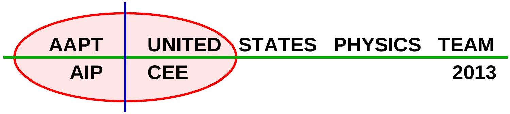
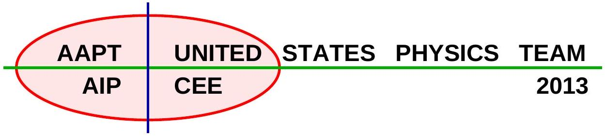
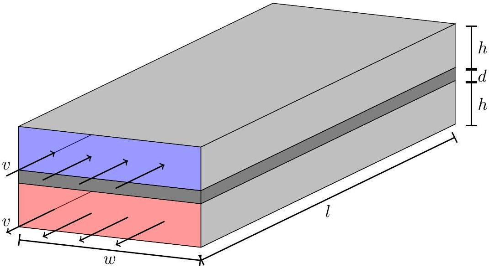
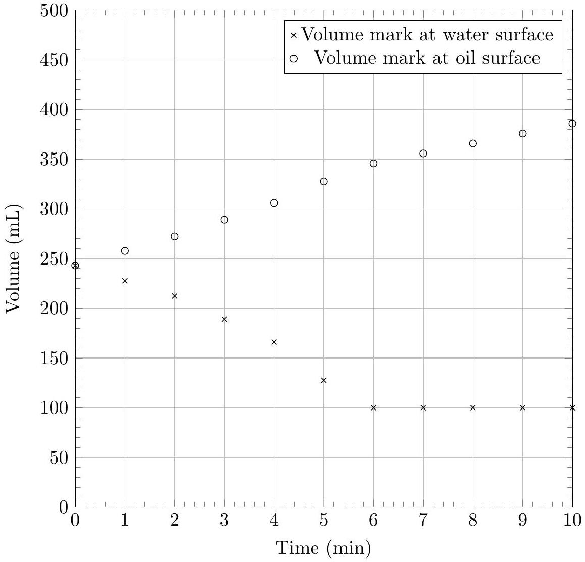
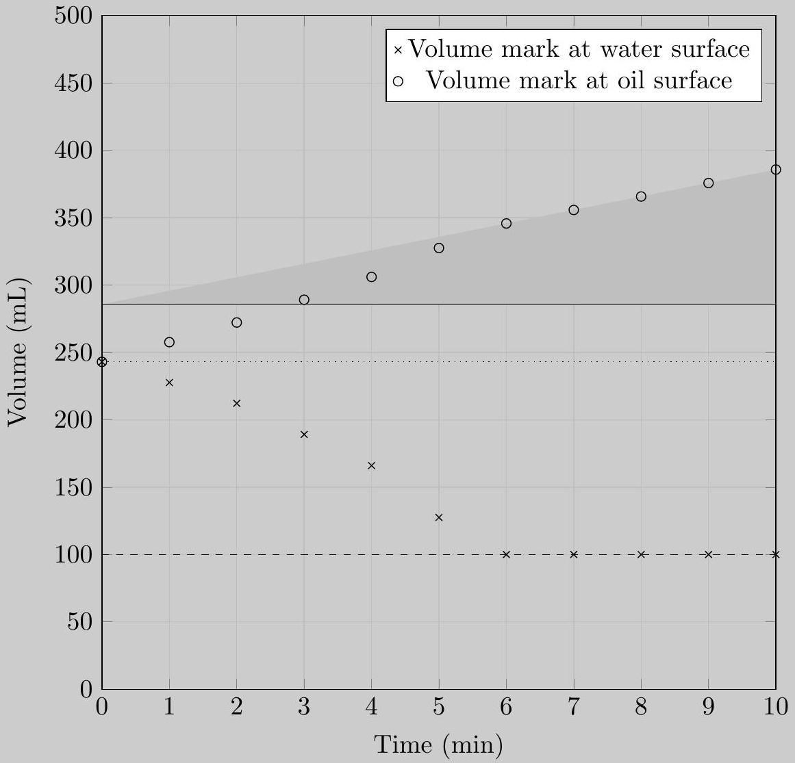
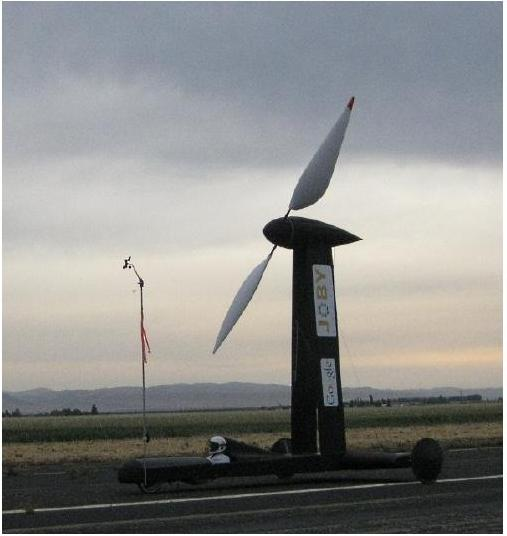
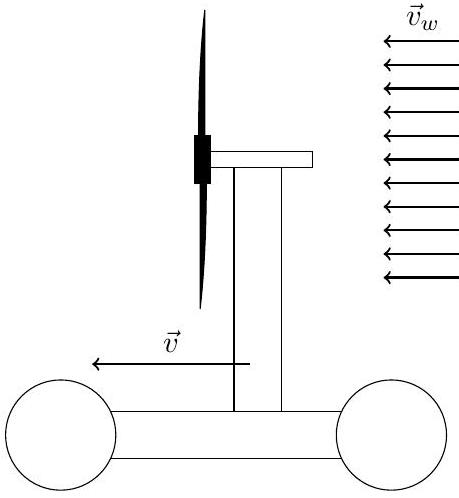
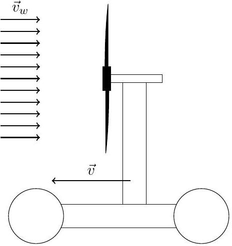

## Semifinal Exam

## DO NOT DISTRIBUTE THIS PAGE

## Important Instructions for the Exam Supervisor

- This examination consists of two parts.
- Part A has four questions and is allowed 90 minutes.
- Part B has two questions and is allowed 90 minutes.
- The first page that follows is a cover sheet. Examinees may keep the cover sheet for both parts of the exam.
- The parts are then identified by the center header on each page. Examinees are only allowed to do one part at a time, and may not work on other parts, even if they have time remaining.
- Allow 90 minutes to complete Part A. Do not let students look at Part B. Collect the answers to Part A before allowing the examinee to begin Part B. Examinees are allowed a 10 to 15 minutes break between parts A and B.
- Allow 90 minutes to complete Part B. Do not let students go back to Part A.
- Ideally the test supervisor will divide the question paper into 3 parts: the cover sheet (page 2), Part A (pages 3-9), and Part B (pages 10-16). Examinees should be provided parts A and B individually, although they may keep the cover sheet.
- The supervisor must collect all examination questions, including the cover sheet, at the end of the exam, as well as any scratch paper used by the examinees. Examinees may not take the exam questions. The examination questions may be returned to the students after April 1, 2013.
- Examinees are allowed calculators, but they may not use symbolic math, programming, or graphic features of these calculators. Calculators may not be shared and their memory must be cleared of data and programs. Cell phones, PDA's or cameras may not be used during the exam or while the exam papers are present. Examinees may not use any tables, books, or collections of formulas.
- Please provide the examinees with graph paper for Part A. A straight edge or ruler could also be useful.

## Semifinal Exam   INSTRUCTIONS

## DO NOT OPEN THIS TEST UNTIL YOU ARE TOLD TO BEGIN

- Work Part A first. You have 90 minutes to complete all four problems. Each question is worth 25 points. Do not look at Part B during this time.
- After you have completed Part A you may take a break.
- Then work Part B. You have 90 minutes to complete both problems. Each question is worth 50 points. Do not look at Part A during this time.
- Show all your work. Partial credit will be given. Do not write on the back of any page. Do not write anything that you wish graded on the question sheets.
- Start each question on a new sheet of paper. Put your AAPT ID number, your name, the question number and the page number/total pages for this problem, in the upper right hand corner of each page. For example,
$$
\begin{gathered}
\text { AAPT ID \# } \\
\text { Doe, Jamie } \\
\text { A1-1/3 }
\end{gathered}
$$
- A hand-held calculator may be used. Its memory must be cleared of data and programs. You may use only the basic functions found on a simple scientific calculator. Calculators may not be shared. Cell phones, PDA's or cameras may not be used during the exam or while the exam papers are present. You may not use any tables, books, or collections of formulas.
- Questions with the same point value are not necessarily of the same difficulty.
- In order to maintain exam security, do not communicate any information about the questions (or their answers/solutions) on this contest until after April 1, 2013.

Possibly Useful Information. You may use this sheet for both parts of the exam.

$$
\begin{array} { l l }
g = 9.8 \mathrm {~N} / \mathrm { kg } & G = 6.67 \times 10 ^ { - 11 } \mathrm {~N} \cdot \mathrm {~m} ^ { 2 } / \mathrm { kg } ^ { 2 } \\
k = 1 / 4 \pi \epsilon _ { 0 } = 8.99 \times 10 ^ { 9 } \mathrm {~N} \cdot \mathrm {~m} ^ { 2 } / \mathrm { C } ^ { 2 } & k _ { \mathrm { m } } = \mu _ { 0 } / 4 \pi = 10 ^ { - 7 } \mathrm {~T} \cdot \mathrm {~m} / \mathrm { A } \\
c = 3.00 \times 10 ^ { 8 } \mathrm {~m} / \mathrm { s } & k _ { \mathrm { B } } = 1.38 \times 10 ^ { - 23 } \mathrm {~J} / \mathrm { K } \\
N _ { \mathrm { A } } = 6.02 \times 10 ^ { 23 } ( \mathrm {~mol} ) ^ { - 1 } & R = N _ { \mathrm { A } } k _ { \mathrm { B } } = 8.31 \mathrm {~J} / ( \mathrm { mol } \cdot \mathrm {~K} ) \\
\sigma = 5.67 \times 10 ^ { - 8 } \mathrm {~J} / \left( \mathrm { s } \cdot \mathrm {~m} ^ { 2 } \cdot \mathrm {~K} ^ { 4 } \right) & e = 1.602 \times 10 ^ { - 19 } \mathrm { C } \\
1 \mathrm { eV } = 1.602 \times 10 ^ { - 19 } \mathrm {~J} & h = 6.63 \times 10 ^ { - 34 } \mathrm {~J} \cdot \mathrm {~s} = 4.14 \times 10 ^ { - 15 } \mathrm { eV } \cdot \mathrm {~s} \\
m _ { e } = 9.109 \times 10 ^ { - 31 } \mathrm {~kg} = 0.511 \mathrm { MeV } / \mathrm { c } ^ { 2 } & ( 1 + x ) ^ { n } \approx 1 + n x \text { for } | x | \ll 1 \\
\sin \theta \approx \theta - \frac { 1 } { 6 } \theta ^ { 3 } \text { for } | \theta | \ll 1 & \cos \theta \approx 1 - \frac { 1 } { 2 } \theta ^ { 2 } \text { for } | \theta | \ll 1
\end{array}
$$

## Part A

## Question A1

The flow of heat through a material can be described via the thermal conductivity $\kappa$. If the two faces of a slab of material with thermal conductivity $\kappa$, area $A$, and thickness $d$ are held at temperatures differing by $\Delta T$, the thermal power $P$ transferred through the slab is

$$
P = \frac { \kappa A \Delta T } { d }
$$

A heat exchanger is a device which transfers heat between a hot fluid and a cold fluid; they are common in industrial applications such as power plants and heating systems. The heat exchanger shown below consists of two rectangular tubes of length $l$, width $w$, and height $h$. The tubes are separated by a metal wall of thickness $d$ and thermal conductivity $\kappa$. Originally hot fluid flows through the lower tube at a speed $v$ from right to left, and originally cold fluid flows through the upper tube in the opposite direction (left to right) at the same speed. The heat capacity per unit volume of both fluids is $c$.

The hot fluid enters the heat exchanger at a higher temperature than the cold fluid; the difference between the temperatures of the entering fluids is $\Delta T _ { i }$. When the fluids exit the heat exchanger the difference has been reduced to $\Delta T _ { f }$. (It is possible for the exiting originally cold fluid to have a higher temperature than the exiting originally hot fluid, in which case $\Delta T _ { f } < 0$.)

Assume that the temperature in each pipe depends only on the lengthwise position, and consider transfer of heat only due to conduction in the metal and due to the bulk movement of fluid. Under the assumptions in this problem, while the temperature of each fluid varies along the length of the exchanger, the temperature difference across the wall is the same everywhere. You need not prove this.

Find $\Delta T _ { f }$ in terms of the other given parameters.

## Solution

To see why the temperature difference across the wall is the same everywhere along the wall, note that at every point along the wall, the warmer fluid on one side transfers energy to the colder

fluid on the other. Since the heat capacities are equal, the temperature of the warmer fluid drops at the same rate the temperature of the colder fluid rises. But since the fluids move at the same speed in opposite directions, this means the temperature difference is constant.

Suppose this temperature difference is $\Delta T _ { w }$. Since the total area of the wall is $l w$, the power transferred across the wall is

$$
P = \frac { \kappa l w } { d } \Delta T _ { w }
$$

In a time $d t$, the energy transferred is therefore

$$
d E = \frac { \kappa l w } { d } \Delta T _ { w } d t .
$$

Meanwhile, suppose the red fluid enters at temperature $T _ { r }$ and the blue fluid at temperature $T _ { b }$. The red fluid exits at temperature $T _ { b } + \Delta T _ { w }$, so the overall temperature change of the red fluid is

$$
\Delta T _ { r } = T _ { r } - \left( T _ { b } + \Delta T _ { w } \right) = \Delta T _ { i } - \Delta T _ { w }
$$

In a time $d t$, a volume of red fluid $v w h d t$ enters the pipe, and the same volume leaves, with a temperature $\Delta T _ { r }$ higher. Then the total energy transferred to the red fluid is

$$
d E = v w h c d t \Delta T _ { r } = v w h c \left( \Delta T _ { i } - \Delta T _ { w } \right) d t .
$$

We would get the same equation if we considered the blue fluid, as expected by energy conservation. However, this requires vwhc to be the same for both fluids. If this were not true, we would instead get a contradiction, reflecting the fact that $\Delta T _ { w }$ could not be constant.

Equating our two expressions for $d E$ gives

$$
\frac { \kappa l w } { d } \Delta T _ { w } = v w h c \left( \Delta T _ { i } - \Delta T _ { w } \right) \quad \Rightarrow \quad \Delta T _ { w } = \frac { \Delta T _ { i } } { 1 + \alpha } , \quad \alpha = \frac { \kappa l } { d v h c } .
$$

Because the red fluid exits at $T _ { b } + \Delta T _ { w }$ and the blue fluid exits at $T _ { r } - \Delta T _ { w }$,

$$
\Delta T _ { f } = \left( T _ { b } + \Delta T _ { w } \right) - \left( T _ { r } - \Delta T _ { w } \right) = - \Delta T _ { i } + 2 \Delta T _ { w } = \Delta T _ { i } \left( \frac { 2 } { 1 + \alpha } - 1 \right)
$$

The performance of the heat exchanger is determined by the dimensionless parameter $\alpha$.
There are several ways we can check this result. We can check if $\alpha$ is correct by dimensional analysis or common sense; for example, it's clear that a long pipe improves performance. We also see that in the limit of poor performance, $\alpha \rightarrow 0$, we find no heat exchange at all, $\Delta T _ { f } = \Delta T _ { i }$. The best possible performance, attained for $\alpha \rightarrow \infty$, is $\Delta T _ { f } = - \Delta T _ { i }$, a complete reversal of the temperatures of the fluids. This is much better than the best possible performance if the two fluids moved the same direction, which would be $\Delta T _ { f } = 0$. The general idea here is called countercurrent heat exchange, and it appears in both biology and practical engineering.

Question A2
A solid round object of radius $R$ can roll down an incline that makes an angle $\theta$ with the horizontal. Assume that the rotational inertia about an axis through the center of mass is given by $I = \beta m R ^ { 2 }$. The coefficient of kinetic and static friction between the object and the incline is $\mu$. The object moves from rest through a vertical distance $h$.

a. If the angle of the incline is sufficiently large, then the object will slip and roll; if the angle of the incline is sufficiently small, then the object with roll without slipping. Determine the angle $\theta _ { c }$ that separates the two types of motion.
b. Derive expressions for the linear acceleration of the object down the ramp in the case of
    i. Rolling without slipping, and
    ii. Rolling and slipping.

## Solution

a. Answering this question essentially requires answering part (b) first. As the object rolls down the incline, the torque about the center of mass is
$$
\tau = R f
$$
where $f$ is the friction force. Then the angular acceleration is
$$
\alpha = \frac { \tau } { I } = \frac { f } { \beta m R } .
$$
The linear acceleration of the object satisfies
$$
m a = m g \sin \theta - f .
$$
Now suppose the object is rolling without slipping. Then $a = \alpha R = f / \beta m$, and combining our equations gives
$$
m a = m g \sin \theta - \beta m a \quad \Rightarrow \quad a = \frac { g \sin \theta } { 1 + \beta } .
$$
Then the friction force is
$$
f = \beta m a = \frac { \beta m g \sin \theta } { 1 + \beta } .
$$
The critical angle for slipping is the angle where $f$ is equal to the maximum possible static friction force, $f = \mu m g \cos \theta$. Combining and solving gives
$$
\tan \theta _ { c } = \mu \left( 1 + \frac { 1 } { \beta } \right) .
$$
b. i. As found above, the acceleration is
$$
a = \frac { g \sin \theta } { 1 + \beta } .
$$
    ii. In this case, the friction force is equal to the kinetic friction, $f = \mu m g \cos \theta$. Then
$$
m a = m g \sin \theta - \mu m g \cos \theta \quad \Rightarrow \quad a = g ( \sin \theta - \mu \cos \theta ) .
$$
Note that $a$, as a function of $\theta$, is continuous at the angle $\theta _ { c }$. This is because we took the coefficients of kinetic and static friction to be equal.

Question A3
A beam of muons is maintained in a circular orbit by a uniform magnetic field. Neglect energy loss due to electromagnetic radiation.

The mass of the muon is $1.88 \times 10 ^ { - 28 } \mathrm {~kg}$, its charge is $- 1.602 \times 10 ^ { - 19 } \mathrm { C }$, and its half-life is $1.523 \mu \mathrm {~s}$.

a. The speed of the muons is much less than the speed of light. It is found that half of the muons decay during each full orbit. What is the magnitude of the magnetic field?
b. The experiment is repeated with the same magnetic field, but the speed of the muons is increased; it is no longer much less than the speed of light. Does the fraction of muons which decay during each full orbit increase, decrease, or stay the same?
The following facts about special relativity may be useful:
    - The Lorentz factor for a particle moving at speed $v$ is
$$
\gamma = \frac { 1 } { \sqrt { 1 - v ^ { 2 } / c ^ { 2 } } }
$$
    - The Lorentz factor gives the magnitude of time dilation; that is, a clock moving at speed $v$ in a given reference frame runs slow by a factor $\gamma$ in that frame.
    - The momentum of a particle is given by
$$
\vec { p } = \gamma m \vec { v }
$$
where $m$ does not depend on $v$.
    - The Lorentz force law in the form
$$
\frac { d \vec { p } } { d t } = q ( \vec { E } + \vec { v } \times \vec { B } )
$$
continues to hold.

## Solution

a. The muons perform uniform circular motion, so we have
$$
a = \frac { v ^ { 2 } } { r } , \quad 2 \pi r = v T
$$
where $T$ is the period of motion. Solving for $T$ gives
$$
T = \frac { 2 \pi v } { a } .
$$
Newton's second law is
$$
\frac { d \mathbf { p } } { d t } = q \mathbf { v } \times \mathbf { B } = m \mathbf { a }
$$
and taking magnitudes gives $a = q v B / m$. Then
$$
T = \frac { 2 \pi m } { q B } \Rightarrow B = \frac { 2 \pi m } { q T _ { 1 / 2 } } = 4.85 \mathrm { mT }
$$
where we used $T = T _ { 1 / 2 }$, the half-life of the muon.

b. The first two lines above still hold, since they follow from ordinary geometry. Since the speed is constant, $\gamma$ is constant, and Newton's second law is now
$$
\frac { d \mathbf { p } } { d t } = q \mathbf { v } \times \mathbf { B } = \gamma m \mathbf { a }
$$
so taking magnitudes gives $a = q v B / \gamma m$. Then the period is a factor of $\gamma$ larger,
$$
T = \gamma \frac { 2 \pi m } { q B } = \gamma T _ { 1 / 2 }
$$
However, the muons experience time dilation, so in the lab frame, half of them decay in time $\gamma T _ { 1 / 2 }$. Then the same fraction of muons decays per orbit, i.e. one half.

## Question A4

A graduated cylinder is partially filled with water; a rubber duck floats at the surface. Oil is poured into the graduated cylinder at a slow, constant rate, and the volume marks corresponding to the surface of the water and the surface of the oil are recorded as a function of time.

Water has a density of 1.00 g/mL; the density of air is negligible, as are surface effects. Find the density of the oil.

## Solution

As the oil is poured in, more and more of the weight of the duck is supported by oil, and it rises out of the water, reducing the water level. Eventually this stops, either because the duck is fully submerged in oil or because it is floating entirely above the water; there is not sufficient information to tell which. At all times, the weight of the water that is no longer displaced equals the weight of the newly displaced oil,

$$
\rho _ { o } g \Delta V _ { o } = \rho _ { w } g \Delta V _ { w } .
$$

With this understanding many approaches are possible; we illustrate one. The change in the volume of displaced water is easily read off the graph as the distance between the dotted and dashed lines; it is 143 mL . Finding the volume of displaced oil requires us to take into account the increasing amount of oil in the cylinder. We know there is no oil at $t = 0$, because the oil level and water level coincide, and we know that the rate of change of the oil level for $t > 6 \mathrm {~min}$ is the pour rate, because the water level is not changing. Extrapolating to $t = 0$ we conclude that the volume of oil in the container at any time is given by the height of the shaded region. The volume of displaced oil is thus the distance between the solid and dashed lines, 186 mL . The density of the oil is thus

$$
\rho _ { o } = \rho _ { w } \frac { \Delta V _ { w } } { \Delta V _ { o } } = ( 1.00 \mathrm {~g} / \mathrm { mL } ) \frac { 143 \mathrm {~mL} } { 186 \mathrm {~mL} } = 0.77 \mathrm {~g} / \mathrm { mL } .
$$

Note there is not enough information to find the density of the duck.

## STOP: Do Not Continue to Part B

If there is still time remaining for Part A, you should review your work for Part A, but do not continue to Part B until instructed by your exam supervisor.

## Part B

## Question B1

Shown below is the Blackbird, a vehicle built in 2009.
There is no source of stored energy such as a battery or gasoline engine; all of the power used to move the car comes from the wind. The only important mechanism in the car is a gearbox that can transfer power between the wheels and the propeller.

The Blackbird was driven both directly downwind and directly upwind, as shown below. In each case the car remained exactly parallel (or anti-parallel) to the wind without turning. The tests were conducted on level ground, in steady, uniform wind, and continued long enough to reach the steady state.

Source: fasterthanthewind.org

Downwind

Upwind

When driving downwind, the builders claim that they were able to drive "faster than the wind": that is, with $| \vec { v } | > \left| \vec { v } _ { w } \right|$, so that the car experienced a relative headwind while traveling. Commenters on the Internet claimed, often angrily, that this was physically impossible and that the Blackbird was a hoax. Some commenters also claimed that the upwind case was physically impossible.

a. Consider first the downwind faster than the wind case.
    - Is the motion actually possible as claimed? If not, offer a brief explanation!
    - If the motion is possible, is power transferred from the propeller to the wheels or vice versa?
    - If the motion is possible, what ground speed is attained? For this question, suppose that when transferring power in either direction between the propeller and the wheels, a fraction $\alpha$ of the useful work is lost; let the wind speed be $v _ { w }$. Neglect all other losses of energy.
b. Answer the previous questions for the upwind case.

## Solution

Both modes are possible as claimed. The solution uses the idea of "center of mass (CoM) power", which we will review below for interested readers; the solution itself starts on the next page. For simplicity, we will work in one dimension.

If a particle moves with speed $v _ { 1 }$ and experiences a force $F$, then the rate of change of its kinetic energy is

$$
P _ { 1 } = F v _ { 1 } .
$$

Suppose this force is exerted by an interaction with a second particle, which moves with speed $v ^ { \prime }$. The rate of change of its kinetic energy is

$$
P _ { 2 } = - F v _ { 2 }
$$

by Newton's third law, and the total is

$$
P = P _ { 1 } + P _ { 2 } = F v _ { 1 } - F v _ { 2 } = F v _ { r }
$$

where $v _ { r }$ is the relative velocity. If we move into a different reference frame, both $P _ { 1 }$ and $P _ { 2 }$ change, but $P$ stays the same, as all frames agree on the relative velocity.

This is straightforward, but it becomes more subtle when applied to a system more complicated than a particle. The speed $v$ becomes the speed of the point of application of the force, while the power $P$ must be generalized to include internal energy. We will write the energy of a system as $E = E _ { \mathrm { cm } } + E _ { \text {int } }$, where the "center of mass energy" $E _ { \mathrm { cm } } = M v _ { \mathrm { cm } } ^ { 2 } / 2$ is the kinetic energy associated with the motion of the CoM, and $E _ { \text {int } }$ accounts for everything else, such as the rotational energy of a wheel or propeller.

As an example, consider an accelerating bicycle. The force that pushes the bicycle forward is the friction force with the ground. However, if the wheels are rolling without slipping, then at every moment, the relative velocity between the ground and the part of the wheel touching the ground is exactly zero. Thus the power is zero, so $E$ is constant. This is because the increase in $E _ { \mathrm { cm } }$ is compensated by a decrease in the chemical energy of the cyclist, accounted for in $E _ { \text {int } }$. Thus energy arguments appear to tell us nothing useful about the motion of the bicycle. Similarly, energy arguments tell us nothing definite about the Blackbird's wheels or propellers.

It is more useful here to use "center of mass power". This concept is not covered in most textbooks, but interested readers can consult section 13.5 of Halliday, Resnick, and Krane, $5 { } ^ { \text {th } }$ edition. The idea behind CoM power is that the CoM of a system satisfies

$$
F = M a _ { \mathrm { cm } }
$$

where $F$ is the total force on the system. This is essentially the same equation as we would have for a single particle of mass $m$, so by the same proof of the work-kinetic energy theory for particles,

$$
P _ { \mathrm { cm } } = F v _ { \mathrm { cm } } , \quad P _ { \mathrm { cm } } = \frac { d E _ { \mathrm { cm } } } { d t } .
$$

The CoM power $P _ { \mathrm { cm } }$ only contributes to the CoM energy. Crucially, it only depends on the velocity of the center of mass, not on any other details of the system.

Now consider two systems interacting by a force $F$, whose centers of mass move at a relative velocity of $v _ { r }$. By the same argument as above, the net CoM power is

$$
P _ { \mathrm { cm } } = F v _ { r } .
$$

By conservation of energy, this change in CoM energy must be compensated by an opposite change in the internal energy.

Now we turn to the analysis of the downwind case. We take all velocities to be positive. In the steady state, the velocity of the Blackbird is constant, so the force $F$ on the propeller is balanced by a force $- F$ on the wheels. For the system of the propellers and air, we have

$$
P _ { \mathrm { cm } } = F \left( v - v _ { w } \right) .
$$

By energy conservation, the internal energy of the propellers and air must change at the rate

$$
P _ { \text {prop } } = F \left( v _ { w } - v \right) .
$$

Since we have assumed no extraneous energy losses, the internal energy of the air doesn't increase at all, so this is just the change in the internal energy of the propeller. By similar reasoning, the internal energy of the wheels and ground must change at the rate

$$
P _ { \text {wheel } } = F v
$$

and again, since there are no extraneous energy losses, this is the rate of change of the internal energy of the wheels.

Now we determine the sign of $F$. If the Blackbird moves downwind faster than the wind, $v > v _ { w }$, then $P _ { \text {wheel } }$ and $P _ { \text {prop } }$ have opposite signs, with $\left| P _ { \text {wheel } } \right| > \left| P _ { \text {prop } } \right|$. Thus, the force $F$ should be positive, in the direction of the wind, so that $P _ { \text {wheel } }$ is positive and $P _ { \text {prop } }$ is negative. That is, power is transferred from the wheels to the propeller. In general, power should always be produced by the force with the larger relative velocity.

In the steady state the total internal energy of the Blackbird is constant, so

$$
\left| P _ { \text {prop } } \right| = ( 1 - \alpha ) P _ { \text {wheel } } \Rightarrow v = v _ { w } / \alpha .
$$

With sufficiently low energy loss, any speed is possible.
The argument here is somewhat counterintuitive. A tempting (but incorrect) counterargument is that, since the internal energy of the Blackbird ultimately comes from a decrease in the centerof-mass energy of the air, which is slowed down by the propeller, the internal energy must always be supplied by the propeller. One way to see this argument doesn't work is to note that in the reference frame where the air is still and the ground is moving, the same argument would suggest that internal energy must always be supplied by the wheels. The point is that changes of centerof-mass energy are completely different in different reference frames, as mentioned above. They cannot be used to determine the direction of flow of internal energy, which does not depend on the reference frame. In all frames, the force of the wind slows the rotation of the propeller, and hence power must be transferred from the wheels to the propeller.

We now consider the upwind case. We'll keep all the sign conventions the same, except we'll take $v$ be the leftward speed of the Blackbird. Then

$$
P _ { \text {prop } } = F \left( v + v _ { w } \right) , \quad P _ { \text {wheel } } = - F v .
$$

Since $\left| P _ { \text {prop } } \right| > \left| P _ { \text {wheel } } \right|$, power is transferred from the propeller to the wheels, and we again have $F > 0$, i.e. in both cases the force on the propeller is in the direction of the wind, as expected. The energy balance equation is

$$
\left| P _ { \text {wheel } } \right| = ( 1 - \alpha ) P _ { \text {prop } } \quad \Rightarrow \quad v = v _ { w } \left( \frac { 1 } { \alpha } - 1 \right) .
$$

Again, with sufficiently low energy loss, any speed is possible.

## Question B2

This problem concerns three situations involving the transfer of energy into a region of space by electromagnetic fields. In the first case, that energy is stored in the kinetic energy of a charged object; in the second and third cases, the energy is stored in an electric or magnetic field.

In general, whenever an electric and a magnetic field are at an angle to each other, energy is transferred; for example, this principle is the reason electromagnetic radiation transfers energy. The power transferred per unit area is given by the Poynting vector:

$$
\vec { S } = \frac { 1 } { \mu _ { 0 } } \vec { E } \times \vec { B }
$$

In each part of this problem, the last subpart asks you to verify that the rate of energy transfer agrees with the formula for the Poynting vector. Therefore, you should not use the formula for the Poynting vector before the last subpart!

a. A long, insulating cylindrical rod has radius $R$ and carries a uniform volume charge density $\rho$. A uniform external electric field $E$ exists in the direction of its axis. The rod moves in the direction of its axis at speed $v$.
    i. What is the power per unit length $\mathcal { P }$ delivered to the rod?
    ii. What is the magnetic field $B$ at the surface of the rod? Draw the direction on a diagram.
    iii. Compute the Poynting vector, draw its direction on a diagram, and verify that it agrees with the rate of energy transfer.
b. A parallel plate capacitor consists of two discs of radius $R$ separated by a distance $d \ll R$. The capacitor carries charge $Q$, and is being charged by a small, constant current $I$.
    i. What is the power $P$ delivered to the capacitor?
    ii. What is the magnetic field $B$ just inside the edge of the capacitor? Draw the direction on a diagram. (Ignore fringing effects in the electric field for this calculation.)
    iii. Compute the Poynting vector, draw its direction on a diagram, and verify that it agrees with the rate of energy transfer.
c. A long solenoid of radius $R$ has $\mathcal { N }$ turns of wire per unit length. The solenoid carries current $I$, and this current is increased at a small, constant rate $\frac { d I } { d t }$.
    i. What is the power per unit length $\mathcal { P }$ delivered to the solenoid?
    ii. What is the electric field $E$ just inside the surface of the solenoid? Draw its direction on a diagram.
    iii. Compute the Poynting vector, draw its direction on a diagram, and verify that it agrees with the rate of energy transfer.

## Solution

a. i. A length $l$ of the rod has charge $q = \pi R ^ { 2 } l \rho$; the force on it is $F = q E$ and the power delivered is $P = F v$. Combining these,
$$
P = \pi R ^ { 2 } l \rho E v , \quad \mathcal { P } = \pi R ^ { 2 } \rho E v .
$$
    ii. The length $l$ of the rod moves past a point in a time $t = \frac { l } { v }$, so the current carried by the rod is
$$
I = \frac { q } { t } = \pi R ^ { 2 } \rho v .
$$
Applying Ampere's law to a loop of radius $R$,
$$
\begin{gathered}
\oint \mathbf { B } \cdot d \mathbf { l } = \mu _ { 0 } I _ { e n c } \\
2 \pi R B = \mu _ { 0 } \pi R ^ { 2 } \rho v \Rightarrow B = \frac { 1 } { 2 } \mu _ { 0 } R \rho v
\end{gathered}
$$
The field is circumferential as given by the right-hand rule.
    iii. The electric and magnetic fields are perpendicular, so the Poynting vector has magnitude
$$
S = \frac { 1 } { \mu _ { 0 } } E B = \frac { 1 } { 2 } R \rho v E .
$$
A quick application of the right hand rule indicates that it points inward along the surface of the cylinder, as it ought. The cylinder has area per unit length $2 \pi r$, so the rate of energy transfer per unit length is
$$
\mathcal { P } = 2 \pi r S = \pi R ^ { 2 } \rho v E
$$
in agreement with the previous result.
b. i. The capacitance is given by the standard parallel-plate capacitor formula,
$$
C = \frac { \epsilon _ { 0 } \pi R ^ { 2 } } { d } .
$$
The voltage on the capacitor is thus
$$
V = \frac { Q } { C } = \frac { Q d } { \epsilon _ { 0 } \pi R ^ { 2 } }
$$
and the power is
$$
P = I V = \frac { I Q d } { \epsilon _ { 0 } \pi R ^ { 2 } }
$$
Students may choose instead to apply the formula for the volume energy density,
$$
\mathcal { U } = \frac { 1 } { 2 } \epsilon _ { 0 } E ^ { 2 } .
$$
    ii. Consider an Amperian loop encircling the edge of the capacitor, and use a flat Gaussian surface through the center of the capacitor. The electric field here is perpendicular to the surface and has magnitude
$$
E = \frac { V } { d } = \frac { Q } { \epsilon _ { 0 } \pi R ^ { 2 } } .
$$

The electric flux through the surface is thus

$$
\phi _ { E } = \pi R ^ { 2 } E = \frac { Q } { \epsilon _ { 0 } } .
$$

This can also be determined directly using Gauss's law and appropriate symmetries. There is no current through the surface, so from Ampere's law

$$
\begin{gathered}
\oint \mathbf { B } \cdot d \mathbf { l } = \mu _ { 0 } \epsilon _ { 0 } \frac { d \phi _ { E } } { d t } \\
2 \pi R B = \mu _ { 0 } \frac { d Q } { d t } \Rightarrow B = \frac { \mu _ { 0 } I } { 2 \pi R }
\end{gathered}
$$

The field is circumferential as given by the right-hand rule.
Note that we could instead use a curved Gaussian surface that avoids the center of the capacitor and intersects one of the charging wires! In this case we have directly

$$
\oint \mathbf { B } \cdot d \mathbf { l } = \mu _ { 0 } I
$$

and the calculation proceeds as before.

iii. The electric and magnetic fields are perpendicular, so again
$$
S = \frac { 1 } { \mu _ { 0 } } E B = \frac { I Q } { 2 \epsilon _ { 0 } \pi ^ { 2 } R ^ { 3 } }
$$
A quick application of the right hand rule indicates that it points inward along the edge of the capacitor, as it ought. The area of this region is $2 \pi R d$, so the power delivered is
$$
P = 2 \pi R d S = \frac { I Q d } { \epsilon _ { 0 } \pi R ^ { 2 } }
$$
in agreement with the previous result.
c. i. Suppose that the solenoid has length $l$. The inductance is
$$
L = \mu _ { 0 } \mathcal { N } ^ { 2 } \pi R ^ { 2 } l .
$$
Students may quote this formula directly, or derive it as follows. Consider an Amperian loop of length $d$ intersecting the solenoid. This loop encloses $\mathcal { N } d$ turns of wire, so from Ampere's law (remembering that the magnetic field exists entirely within the solenoid)
$$
\begin{gathered}
\oint \mathbf { B } \cdot d \mathbf { l } = \mu _ { 0 } I _ { e n c } \\
B d = \mu _ { 0 } \mathcal { N } d I \Rightarrow B = \mu _ { 0 } \mathcal { N } I
\end{gathered}
$$
There are $\mathcal { N } l$ loops, so the total flux is
$$
\Phi = \mathcal { N } l B \pi R ^ { 2 } = \mu _ { 0 } \mathcal { N } ^ { 2 } I \pi R ^ { 2 } l
$$
and since $\Phi = L I$,
$$
L = \mu _ { 0 } \mathcal { N } ^ { 2 } \pi R ^ { 2 } l
$$

as quoted above.
The voltage across the inductor is thus

$$
V = L \frac { d I } { d t } = \mu _ { 0 } \mathcal { N } ^ { 2 } \pi R ^ { 2 } l \frac { d I } { d t }
$$

and the power delivered is

$$
P = I V = \mu _ { 0 } \mathcal { N } ^ { 2 } \pi R ^ { 2 } l I \frac { d I } { d t }
$$

or, dividing by $l$,

$$
\mathcal { P } = \mu _ { 0 } \mathcal { N } ^ { 2 } \pi R ^ { 2 } I \frac { d I } { d t } .
$$

Students may choose instead to apply the formula for the volume energy density,

$$
\mathcal { U } = \frac { 1 } { 2 \mu _ { 0 } } B ^ { 2 } .
$$

ii. Consider an Amperian loop just inside the surface of the solenoid. From above, the magnetic field through this loop is $B = \mu _ { 0 } \mathcal { N } I$, so
$$
\oint \mathbf { E } \cdot d \mathbf { l } = \frac { d \phi _ { B } } { d t }
$$
$$
2 \pi R E = \mu _ { 0 } \mathcal { N } \pi R ^ { 2 } \frac { d I } { d t } \quad \Rightarrow \quad E = \frac { 1 } { 2 } \mu _ { 0 } \mathcal { N } R \frac { d I } { d t }
$$
The field is circumferential as given by Lenz's law and the right-hand rule.
iii. The electric and magnetic fields are perpendicular, so again
$$
S = \frac { 1 } { \mu _ { 0 } } E B = \frac { 1 } { 2 } \mu _ { 0 } \mathcal { N } ^ { 2 } R I \frac { d I } { d t } .
$$
A quick application of the right hand rule indicates that it points inward towards the axis of the solenoid, as it ought. The area per unit length is just $2 \pi R$, so the power per unit length is
$$
\mathcal { P } = 2 \pi R S = \mu _ { 0 } \mathcal { N } ^ { 2 } \pi R ^ { 2 } I \frac { d I } { d t }
$$
in agreement with the previous result.
