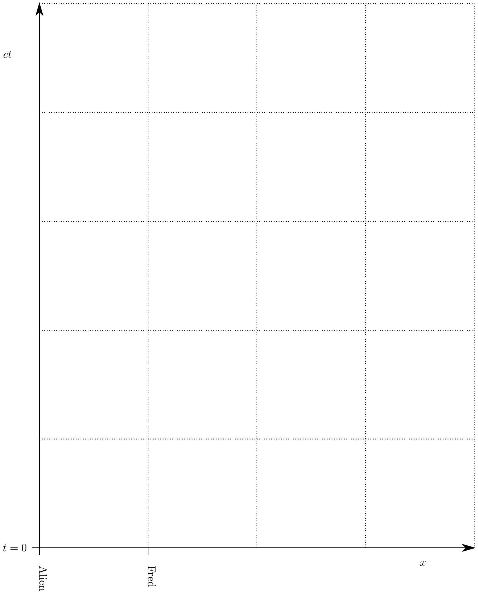
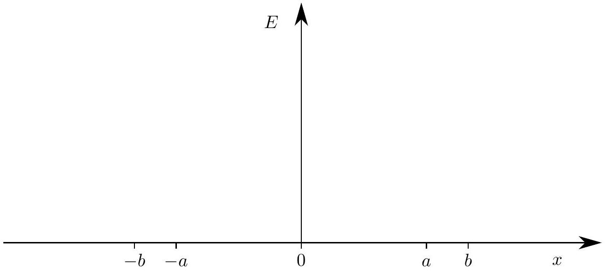
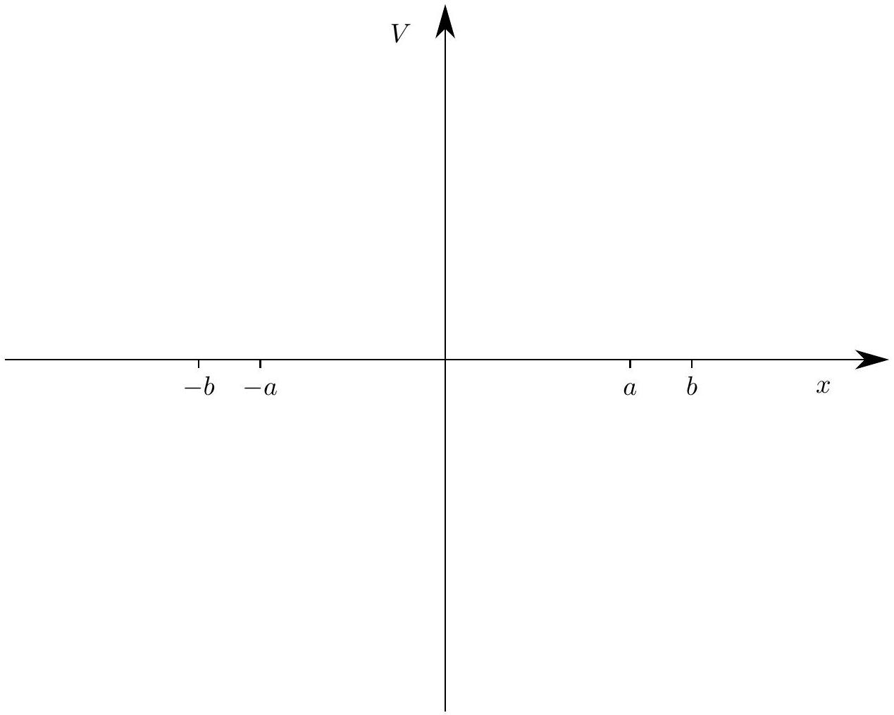
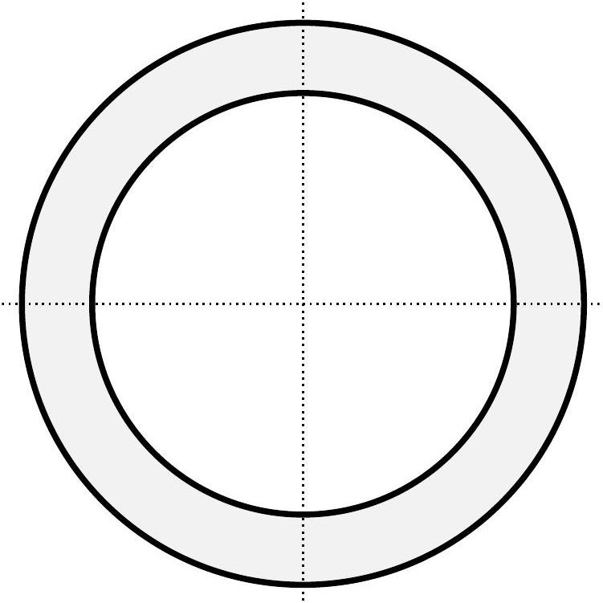

Question B2
In parts a and b of this problem assume that velocities $v$ are much less than the speed of light $c$, and therefore ignore relativistic contraction of lengths or time dilation.

a. An infinite uniform sheet has a surface charge density $\sigma$ and has an infinitesimal thickness. The sheet lies in the $x y$ plane.
    i. Assuming the sheet is at rest, determine the electric field $\tilde { \mathbf { E } }$ (magnitude and direction) above and below the sheet.

## Solution

By symmetry, the fields above and below the sheet are equal in magnitude and directed away from the sheet. By Gauss's Law, using a cylinder of base area $A$,

$$
2 E A = \frac { \sigma A } { \epsilon _ { 0 } } \Rightarrow E = \frac { \sigma } { 2 \epsilon _ { 0 } }
$$

pointing directly away from the sheet in the $z$ direction, or

$$
\mathbf { E } = \frac { \sigma } { 2 \epsilon } \times \begin{cases} \hat { \mathbf { z } } & \text { above the sheet } , \\ - \hat { \mathbf { z } } & \text { below the sheet. } \end{cases}
$$

ii. Assuming the sheet is moving with velocity $\tilde { \mathbf { v } } = v \hat { \mathbf { x } }$ (parallel to the sheet), determine the electric field $\tilde { \mathbf { E } }$ (magnitude and direction) above and below the sheet.

## Solution

The motion does not affect the electric field, so the answer is the same as that of part (i).

iii. Assuming the sheet is moving with velocity $\tilde { \mathbf { v } } = v \hat { \mathbf { x } }$, determine the magnetic field $\tilde { \mathbf { B } }$ (magnitude and direction) above and below the sheet.

## Solution

Assuming $v > 0$, the right-hand rule indicates there is a magnetic field in the $- \tilde { \mathbf { y } }$ direction for $z > 0$ and in the $+ \tilde { \mathbf { y } }$ direction for $z < 0$. From Ampere's law applied to a loop of length $l$ normal to the $\tilde { \mathbf { x } }$ direction,

$$
2 B l = \mu _ { 0 } \sigma v l .
$$

To get the right-hand side, note that in time $t$, an area $v t l$ moves through the loop, so a charge $\sigma v t l$ moves through. Then the current through the loop is $\sigma v l$.
Applying symmetry, we have

$$
\mathbf { B } = \frac { \mu _ { 0 } \sigma v } { 2 } \times \begin{cases} - \hat { \mathbf { y } } & \text { above the sheet } , \\ \hat { \mathbf { y } } & \text { below the sheet. } \end{cases}
$$

iv. Assuming the sheet is moving with velocity $\tilde { \mathbf { v } } = v \hat { \mathbf { z } }$ (perpendicular to the sheet), determine the electric field $\tilde { \mathbf { E } }$ (magnitude and direction) above and below the sheet.

## Solution

Again the motion does not affect the electric field, so the answer is the same as that of part (i).

v. Assuming the sheet is moving with velocity $\tilde { \mathbf { v } } = v \hat { \mathbf { z } }$, determine the magnetic field $\tilde { \mathbf { B } }$ (magnitude and direction) above and below the sheet.

## Solution

Applying Ampere's law and symmetry, there is no magnetic field above and below the sheet.
Interestingly, there's no magnetic field at the sheet either. Consider an Amperian loop of area $A$ in the $x y$ plane as the sheet passes through. The loop experiences a current of the form

$$
A \sigma \delta ( t ) .
$$

But the loop also experiences an oppositely directed change in flux of the form

$$
A \frac { \sigma } { \epsilon _ { 0 } } \delta ( t ) ,
$$

so the right-hand side of Ampere's law, including the displacement current term, remains zero.

b. In a certain region there exists only an electric field $\tilde { \mathbf { E } } = E _ { x } \hat { \mathbf { x } } + E _ { y } \hat { \mathbf { y } } + E _ { z } \hat { \mathbf { z } }$ (and no magnetic field) as measured by an observer at rest. The electric and magnetic fields $\tilde { \mathbf { E } ^ { \prime } }$ and $\tilde { \mathbf { B } ^ { \prime } }$ as measured by observers in motion can be determined entirely from the local value of $\tilde { \mathbf { E } }$, regardless of the charge configuration that may have produced it.
    i. What would be the observed electric field $\tilde { \mathbf { E } } ^ { \prime }$ as measured by an observer moving with velocity $\tilde { \mathbf { v } } = v \hat { \mathbf { z } }$ ?

## Solution

In part (a), we showed that if the electric field was produced by a sheet of charge, then it was unaffected by the motion of an observer. Thus, in general,

$$
\mathbf { E } ^ { \prime } = \mathbf { E } .
$$

ii. What would be the observed magnetic field $\tilde { \mathbf { B } ^ { \prime } }$ as measured by an observer moving with velocity $\tilde { \mathbf { v } } = v \hat { \mathbf { z } }$ ?

## Solution

No magnetic field was created by the motion of the sheet of charge in the direction of the electric field, so the magnetic field in the frame of reference of the moving observer should likewise not depend on the component of the electric field in the direction of motion. When the sheet of charge was moving in the $+ \hat { \mathbf { x } }$ direction, a magnetic field was created in the $- \hat { \mathbf { y } }$ direction; the observer moving in the $+ \hat { \mathbf { x } }$ direction is equivalent to the sheet of charge moving in the $- \hat { \mathbf { x } }$ direction, creating a magnetic field in the $+ \hat { \mathbf { y } }$ direction. That is, an electric field in the $\hat { \mathbf { z } }$ direction causes an observer moving in the $\hat { \mathbf { x } }$ direction to observe a magnetic field in the $\hat { \mathbf { y } } = \hat { \mathbf { z } } \times \hat { \mathbf { x } }$ direction.
Furthermore, the magnitudes of the fields satisfied
$$
B = \mu _ { 0 } \epsilon _ { 0 } v E = \frac { 1 } { c ^ { 2 } } v E .
$$
Combining this with the previous equation,
$$
\mathbf { B } ^ { \prime } = - \frac { 1 } { c ^ { 2 } } \mathbf { v } \times \mathbf { E } = \frac { v } { c ^ { 2 } } \left( E _ { y } \hat { \mathbf { x } } - E _ { x } \hat { \mathbf { y } } \right) .
$$
c. An infinitely long wire wire on the $z$ axis is composed of positive charges with linear charge density $\lambda$ which are at rest, and negative charges with linear charge density $- \lambda$ moving with speed $v$ in the $z$ direction.
    i. Determine the electric field $\tilde { \mathbf { E } }$ (magnitude and direction) at points outside the wire.

## Solution

The wire as a whole is neutral, so there is no electric field outside the wire.

ii. Determine the magnetic field $\tilde { \mathbf { B } }$ (magnitude and direction) at points outside the wire.

## Solution

The current in the wire is $\lambda v$, so Ampere's law yields

$$
B = \mu _ { 0 } \frac { \lambda v } { 2 \pi r }
$$

in the tangential direction. The current is in the $- \hat { \mathbf { z } }$ direction, so by the right-hand rule, the circular B field lines would point clockwise looking in that direction.

iii. Now consider an observer moving with speed $v$ parallel to the $z$ axis so that the negative charges appear to be at rest. There is a symmetry between the electric and magnetic fields such that a variation to your answer to part b can be applied to the magnetic field in this part. You will need to change the multiplicative constant to something dimensionally correct and reverse the sign. Use this fact to find and describe the electric field measured by the moving observer, and comment on your result. (Some familiarity with special relativity can help you verify the direction of your result, but is not necessary to obtain the correct answer.)

Copyright ©2014 American Association of Physics Teachers

## Solution

The result of part (b) was

$$
\mathbf { B } ^ { \prime } = - \frac { 1 } { c ^ { 2 } } \mathbf { v } \times \mathbf { E } .
$$

Exchanging the electric and magnetic fields, reversing the sign, and fixing the dimensions,

$$
\mathbf { E } ^ { \prime } = \mathbf { v } \times \mathbf { B } .
$$

Taking the cross product yields an electric field vector that points outward, with magnitude

$$
E ^ { \prime } = v \mu _ { 0 } \frac { \lambda v } { 2 \pi r } = \frac { \lambda } { 2 \pi \epsilon _ { 0 } r } \frac { v ^ { 2 } } { c ^ { 2 } } .
$$

Physically, this can be explained by length contraction of the positive charges and inverse length contraction of the negative charges, which are now stationary. That is, we have derived a relativistic effect, second-order in $v / c$, from the first-order field transformations! Why wasn't this derivation used to discover relativity the moment Maxwell's equations were written down? We have implicitly assumed that Maxwell's equations are the same in all reference frames, but historically it was thought they were only valid in one frame, the reference frame of the ether. Assuming that Maxwell's equations are indeed the same in all frames yields an invariant speed, the speed of light, leaving inevitably to all of special relativity. Here we've taken one of many possible paths.

## Answer Sheets

Following are answer sheets for some of the graphical portions of the test.

Answer for Part A, Question 3

Space-time graph for accelerated rocket. The positions of Fred and the Alien at $t = 0$ are shown.

Answer for Part A, Question 4

Answer for Part A, Question 4

Answer for Part A, Question 4

Answer for Part A, Question 4

Answer for Part A, Question 4

[^0]:    ${ } ^ { 1 }$ We are using the convention used by Einstein
