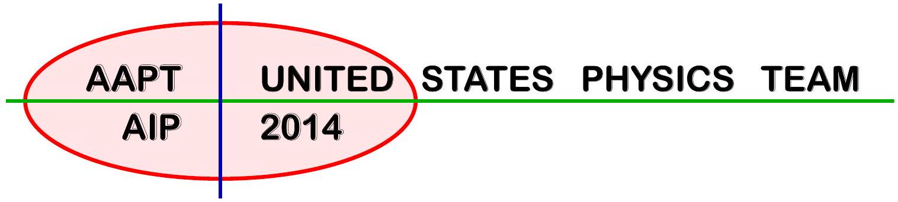

USA Physics Olympiad Exam
DO NOT DISTRIBUTE THIS PAGE
Important Instructions for the Exam Supervisor

- This examination consists of two parts.
- Part A has four questions and is allowed 90 minutes.
- Part B has two questions and is allowed 90 minutes.
- The first page that follows is a cover sheet. Examinees may keep the cover sheet for both parts of the exam.
- The parts are then identified by the center header on each page. Examinees are only allowed to do one part at a time, and may not work on other parts, even if they have time remaining.
- Allow 90 minutes to complete Part A. Do not let students look at Part B. Collect the answers to Part A before allowing the examinee to begin Part B. Examinees are allowed a 10 to 15 minutes break between parts A and B.
- Allow 90 minutes to complete Part B. Do not let students go back to Part A.
- Ideally the test supervisor will divide the question paper into 4 parts: the cover sheet (page 2), Part A (pages 3-15), Part B (pages 17-23), and several answer sheets for two of the questions in part A (pages 25-28). Examinees should be provided parts A and B individually, although they may keep the cover sheet. The answer sheets should be printed single sided!
- The supervisor must collect all examination questions, including the cover sheet, at the end of the exam, as well as any scratch paper used by the examinees. Examinees may not take the exam questions. The examination questions may be returned to the students after April 15, 2014.
- Examinees are allowed calculators, but they may not use symbolic math, programming, or graphic features of these calculators. Calculators may not be shared and their memory must be cleared of data and programs. Cell phones, PDA's or cameras may not be used during the exam or while the exam papers are present. Examinees may not use any tables, books, or collections of formulas.

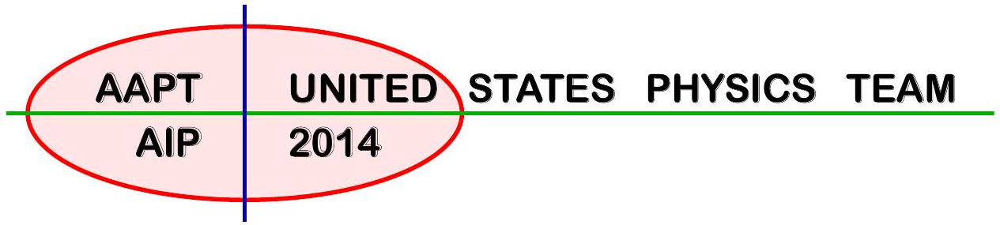

## USA Physics Olympiad Exam INSTRUCTIONS

## DO NOT OPEN THIS TEST UNTIL YOU ARE TOLD TO BEGIN

- Work Part A first. You have 90 minutes to complete all four problems. Each question is worth 25 points. Do not look at Part B during this time.
- After you have completed Part A you may take a break.
- Then work Part B. You have 90 minutes to complete both problems. Each question is worth 50 points. Do not look at Part A during this time.
- Show all your work. Partial credit will be given. Do not write on the back of any page. Do not write anything that you wish graded on the question sheets.
- Start each question on a new sheet of paper. Put your AAPT ID number, your name, the question number and the page number/total pages for this problem, in the upper right hand corner of each page. For example,
$$
\begin{gathered}
\text { AAPT ID } \# \\
\text { Doe, Jamie } \\
\text { A1-1/3 }
\end{gathered}
$$
- A hand-held calculator may be used. Its memory must be cleared of data and programs. You may use only the basic functions found on a simple scientific calculator. Calculators may not be shared. Cell phones, PDA's or cameras may not be used during the exam or while the exam papers are present. You may not use any tables, books, or collections of formulas.
- Questions with the same point value are not necessarily of the same difficulty.
- In order to maintain exam security, do not communicate any information about the questions (or their answers/solutions) on this contest until after April 15, 2014.

Possibly Useful Information. You may use this sheet for both parts of the exam.

$$
\begin{array} { l l }
g = 9.8 \mathrm {~N} / \mathrm { kg } & G = 6.67 \times 10 ^ { - 11 } \mathrm {~N} \cdot \mathrm {~m} ^ { 2 } / \mathrm { kg } ^ { 2 } \\
k = 1 / 4 \pi \epsilon _ { 0 } = 8.99 \times 10 ^ { 9 } \mathrm {~N} \cdot \mathrm {~m} ^ { 2 } / \mathrm { C } ^ { 2 } & k _ { \mathrm { m } } = \mu _ { 0 } / 4 \pi = 10 ^ { - 7 } \mathrm {~T} \cdot \mathrm {~m} / \mathrm { A } \\
c = 3.00 \times 10 ^ { 8 } \mathrm {~m} / \mathrm { s } & k _ { \mathrm { B } } = 1.38 \times 10 ^ { - 23 } \mathrm {~J} / \mathrm { K } \\
N _ { \mathrm { A } } = 6.02 \times 10 ^ { 23 } ( \mathrm {~mol} ) ^ { - 1 } & R = N _ { \mathrm { A } } k _ { \mathrm { B } } = 8.31 \mathrm {~J} / ( \mathrm { mol } \cdot \mathrm {~K} ) \\
\sigma = 5.67 \times 10 ^ { - 8 } \mathrm {~J} / \left( \mathrm { s } \cdot \mathrm {~m} ^ { 2 } \cdot \mathrm {~K} ^ { 4 } \right) & e = 1.602 \times 10 ^ { - 19 } \mathrm { C } \\
1 \mathrm { eV } = 1.602 \times 10 ^ { - 19 } \mathrm {~J} & h = 6.63 \times 10 ^ { - 34 } \mathrm {~J} \cdot \mathrm {~s} = 4.14 \times 10 ^ { - 15 } \mathrm { eV } \cdot \mathrm {~s} \\
m _ { e } = 9.109 \times 10 ^ { - 31 } \mathrm {~kg} = 0.511 \mathrm { MeV } / \mathrm { c } ^ { 2 } & ( 1 + x ) ^ { n } \approx 1 + n x \text { for } | x | \ll 1 \\
\sin \theta \approx \theta - \frac { 1 } { 6 } \theta ^ { 3 } \text { for } | \theta | \ll 1 & \cos \theta \approx 1 - \frac { 1 } { 2 } \theta ^ { 2 } \text { for } | \theta | \ll 1
\end{array}
$$

## Part A

Question A1
Inspired by: http://www.wired.com/wiredscience/2012/04/a-leaning-motorcycle-on-a-vertical-wall/
A unicyclist of total height $h$ goes around a circular track of radius $R$ while leaning inward at an angle $\theta$ to the vertical. The acceleration due to gravity is $g$.

a. Suppose $h \ll R$. What angular velocity $\omega$ must the unicyclist sustain?

## Solution

We work in a frame rotating with angular velocity $\omega$, where the unicyclist is static. Four forces act on the unicyclist: a normal and frictional force at the point of contact, gravity downwards at the center of mass, and a fictitious centrifugal force.
If $h \ll R$, all parts of the unicyclist are at a distance of approximately $R$ from the center of the circle, so the centripetal acceleration of every part of the unicyclist is $\omega ^ { 2 } R$. The centrifugal force can then be taken to act at the center of mass for purposes of computing the torque. If the center of mass is a distance $l$ from the point of contact, the torque about the point of contact is

$$
\tau = m \omega ^ { 2 } R l \cos \theta - m g l \sin \theta
$$

Since the unicyclist is stationary in this frame, $\tau = 0$, and solving for $\omega$ gives

$$
\omega = \sqrt { \frac { g } { R } \tan \theta } .
$$

b. Now model the unicyclist as a uniform rod of length $h$, where $h$ is less than $R$ but not negligible. This refined model introduces a correction to the previous result. What is the new expression for the angular velocity $\omega$ ? Assume that the rod remains in the plane formed by the vertical and radial directions, and that $R$ is measured from the center of the circle to the point of contact at the ground.

## Solution

The centripetal acceleration now varies along the length of the unicyclist. In the rotating frame, the torque about the point of contact is given by

$$
\tau _ { c } = \int \omega ^ { 2 } r z d m
$$

where $r$ is the distance from the center of the circle, $z$ is the height above the ground, and $d m$ is a mass element. Because the mass of the unicyclist is uniformly distributed along a length $h$,

$$
d m = \frac { m } { h } d s
$$

where $s$ is the length along the unicyclist. Then

$$
\tau _ { c } = \int _ { 0 } ^ { h } \omega ^ { 2 } ( R - s \sin \theta ) ( s \cos \theta ) \frac { m } { h } d s = m \omega ^ { 2 } h \cos \theta \left( \frac { R } { 2 } - \frac { h } { 3 } \sin \theta \right) .
$$

Gravity continues to act at the center of mass, a distance $h / 2$ from the point of contact, and in the opposite direction,

$$
\tau _ { g } = - m g \frac { h } { 2 } \sin \theta .
$$

Again, the total torque is zero, so $\tau _ { c } + \tau _ { g } = 0$. Solving for $\omega$ gives

$$
\omega = \sqrt { \left( \frac { g } { R } \tan \theta \right) \left( 1 - \frac { 2 } { 3 } \frac { h } { R } \sin \theta \right) ^ { - 1 } } .
$$

## Question A2

A room air conditioner is modeled as a heat engine run in reverse: an amount of heat $Q _ { L }$ is absorbed from the room at a temperature $T _ { L }$ into cooling coils containing a working gas; this gas is compressed adiabatically to a temperature $T _ { H }$; the gas is compressed isothermally in a coil outside the house, giving off an amount of heat $Q _ { H }$; the gas expands adiabatically back to a temperature $T _ { L }$; and the cycle repeats. An amount of energy $W$ is input into the system every cycle through an electric pump. This model describes the air conditioner with the best possible efficiency.
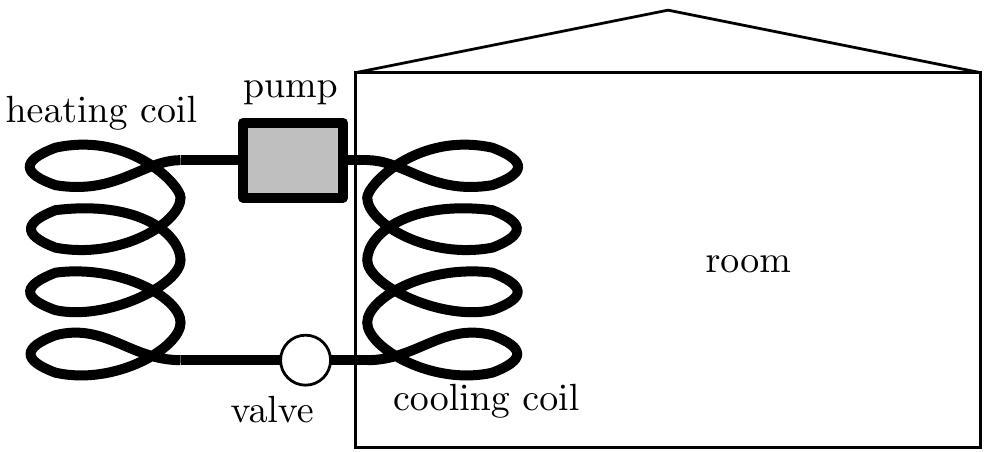

Assume that the outside air temperature is $T _ { H }$ and the inside air temperature is $T _ { L }$. The air-conditioner unit consumes electric power $P$. Assume that the air is sufficiently dry so that no condensation of water occurs in the cooling coils of the air conditioner. Water boils at 373 K and freezes at 273 K at normal atmospheric pressure.

a. Derive an expression for the maximum rate at which heat is removed from the room in terms of the air temperatures $T _ { H } , T _ { L }$, and the power consumed by the air conditioner $P$. Your derivation must refer to the entropy changes that occur in a Carnot cycle in order to receive full marks for this part.

## Solution

The optimal performance is attained by a Carnot cycle running in reverse. Since a Carnot cycle is reversible, it keeps the total entropy of the heat reservoirs constant. The change in entropy for a reservoir of temperature $T$ absorbing heat $Q$ is $\Delta S = Q / T$, so

$$
\frac { Q _ { H } } { T _ { H } } = \frac { Q _ { L } } { T _ { L } } .
$$

Energy conservation states $Q _ { H } = Q _ { L } + W$. Eliminating $Q _ { H }$ and solving for $Q _ { L }$,

$$
Q _ { L } = W \left( \frac { T _ { L } } { T _ { H } - T _ { L } } \right) .
$$

Finally, the rate of heat removal is $Q _ { L } / t$, so dividing both sides by $t$,

$$
\frac { Q _ { L } } { t } = P \left( \frac { T _ { L } } { T _ { H } - T _ { L } } \right) .
$$

b. The room is insulated, but heat still passes into the room at a rate $R = k \Delta T$, where $\Delta T$ is the temperature difference between the inside and the outside of the room and $k$ is a constant. Find the coldest possible temperature of the room in terms of $T _ { H } , k$, and $P$.

## Solution

We equate $k \Delta T$ with the cooling rate $Q _ { L } / t$ found in the previous section. Writing the equation in terms of $T _ { H }$ and $\Delta T = T _ { H } - T _ { L }$,

$$
k \Delta T = P \frac { T _ { L } } { \Delta T } = P \frac { T _ { H } - \Delta T } { \Delta T } .
$$

Rearranging, we have

$$
( \Delta T ) ^ { 2 } = \frac { P } { k } \left( T _ { H } - \Delta T \right)
$$

which is a quadratic in $\Delta T$. Letting $x = P / k$, we have

$$
\Delta T = \frac { x } { 2 } \left( - 1 \pm \sqrt { 1 + 4 T _ { H } / x } \right)
$$

but only the positive root has physical significance. Therefore,

$$
T _ { L } = T _ { H } - \frac { x } { 2 } \left( \sqrt { 1 + 4 T _ { H } / x } - 1 \right) .
$$

c. A typical room has a value of $k = 173 \mathrm {~W} / { } ^ { \circ } \mathrm { C }$. If the outside temperature is 40°C, what minimum power should the air conditioner have to get the inside temperature down to 25°C?

## Solution

From our work above,

$$
P = \frac { k ( \Delta T ) ^ { 2 } } { T _ { L } } = 130 \mathrm {~W} .
$$

A common mistake is to forget to convert Celsius to Kelvin.

Question A3
When studying problems in special relativity it is often the invariant distance $\Delta s$ between two events that is most important, where $\Delta s$ is defined by

$$
( \Delta s ) ^ { 2 } = ( c \Delta t ) ^ { 2 } - \left[ ( \Delta x ) ^ { 2 } + ( \Delta y ) ^ { 2 } + ( \Delta z ) ^ { 2 } \right]
$$

where $c = 3 \times 10 ^ { 8 } \mathrm {~m} / \mathrm { s }$ is the speed of light. ${ } ^ { 1 }$

a. Consider the motion of a projectile launched with initial speed $v _ { 0 }$ at angle of $\theta _ { 0 }$ above the horizontal. Assume that $g$, the acceleration of free fall, is constant for the motion of the projectile.
    i. Derive an expression for the invariant distance of the projectile as a function of time $t$ as measured from the launch, assuming that it is launched at $t = 0$. Express your answer as a function of any or all of $\theta _ { 0 } , v _ { 0 } , c , g$, and $t$.

Solution
Let the particle start at the origin. Then its path satisfies

$$
x = v _ { 0 } t \cos \theta _ { 0 } , \quad z = v _ { 0 } t \sin \theta _ { 0 } - \frac { 1 } { 2 } g t ^ { 2 }
$$

by ordinary kinematics. Then

$$
s ^ { 2 } = ( c t ) ^ { 2 } - \left( v _ { 0 } t \cos \theta _ { 0 } \right) ^ { 2 } - \left( v _ { 0 } t \sin \theta _ { 0 } - \frac { 1 } { 2 } g t ^ { 2 } \right) ^ { 2 }
$$

which can be simplified to

$$
s ^ { 2 } = \left( c ^ { 2 } - v _ { 0 } ^ { 2 } \right) t ^ { 2 } + \frac { 1 } { 2 } g v _ { 0 } \sin \theta _ { 0 } t ^ { 3 } - \frac { 1 } { 4 } g ^ { 2 } t ^ { 4 } .
$$

ii. The radius of curvature of an object's trajectory can be estimated by assuming that the trajectory is part of a circle, determining the distance between the end points, and measuring the maximum height above the straight line that connects the endpoints. Assuming that we mean "invariant distance" as defined above, find the radius of curvature of the projectile's trajectory as a function of any or all of $\theta _ { 0 } , v _ { 0 } , c$, and $g$. Assume that the projectile lands at the same level from which it was launched, and assume that the motion is not relativistic, so $v _ { 0 } \ll c$, and you can neglect terms with $v / c$ compared to terms without.

Solution
Plugging in

$$
t _ { f } = \frac { 2 v _ { 0 } \sin \theta } { g }
$$

[^0]
the invariant distance between the endpoints is approximately
$$
s ^ { 2 } \approx \left( c t _ { f } \right) ^ { 2 } \Rightarrow s \approx 2 c \frac { v _ { 0 } \sin \theta } { g } .
$$
The maximum height above the ground is
$$
z _ { \max } = \frac { \left( v _ { 0 } \sin \theta \right) ^ { 2 } } { 2 g } .
$$
Suppose this path subtends an angle $\theta$ of a circle of radius $R$ in spacetime. Then
$$
s \approx R \theta , \quad z _ { \max } \approx R \left( 1 - \cos \frac { \theta } { 2 } \right) \approx \frac { R \theta ^ { 2 } } { 8 }
$$
and eliminating $\theta$ yields
$$
R \approx \frac { 1 } { 8 } \frac { s ^ { 2 } } { z _ { \max } } = \frac { c ^ { 2 } } { g }
$$
Indeed, if we solved the problem exactly in relativity, we would find that the path of the projectile is a hyperbola in spacetime with semimajor axis $c ^ { 2 } / g$. Here we just computed the radius of curvature near the vertex.
b. A rocket ship far from any gravitational mass is accelerating in the positive $x$ direction at a constant rate $g$, as measured by someone inside the ship. Spaceman Fred at the right end of the rocket aims a laser pointer toward an alien at the left end of the rocket. The two are separated by a distance $d$ such that $d g \ll c ^ { 2 }$; you can safely ignore terms of the form $\left( d g / c ^ { 2 } \right) ^ { 2 }$.
    i. Sketch a graph of the motion of both Fred and the alien on the space-time diagram provided in the answer sheet. The graph is not meant to be drawn to scale. Note that $t$ and $x$ are reversed from a traditional graph. Assume that the rocket has velocity $v = 0$ at time $t = 0$ and is located at position $x = 0$. Clearly indicate any asymptotes, and the slopes of these asymptotes.

## Solution

Since the rocket is constantly accelerating but cannot exceed the speed of light, the curves must asymptote with a slope of one; in an exact analysis we would find they are hyperbolas. However, there is a slight challenge to consider: do Fred and the alien approach the same asymptote, or two different asymptotes?
Since the rocket ship is solid, it maintains the same proper length. Since moving objects are length contracted, it must length contract in our diagram, approaching a length of zero. Indeed, if there were no length contraction, then in the instantaneous rest frame of the ship, the ship would be getting longer and longer, eventually breaking apart.

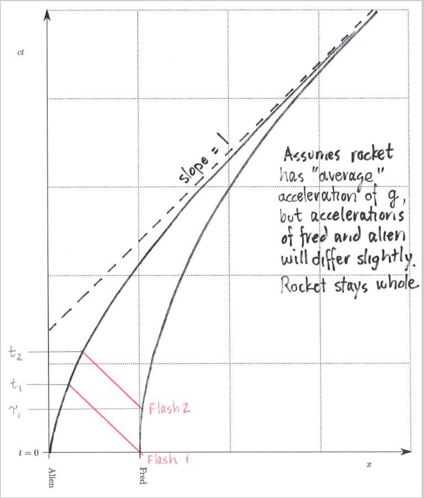

ii. If the frequency of the laser pointer as measured by Fred is $f _ { 1 }$, determine the frequency of the laser pointer as observed by the alien. It is reasonable to assume that $f _ { 1 } \gg c / d$.

## Solution

To solve this problem, we replace the light with a series of discrete flashes, then find how the frequencies of these flashes are seen by Fred and the alien. Let Fred emit a flash of light at time $t = 0$ and a second flash of light at time $t = \tau$, where $\tau$ is very small. Let

the alien see the flashes at times $t _ { 1 }$ and $t _ { 2 }$. Then by ordinary kinematics,

$$
c t _ { 1 } = d - \frac { 1 } { 2 } g t _ { 1 } ^ { 2 } , \quad c \left( t _ { 2 } - \tau \right) = \frac { 1 } { 2 } g \tau ^ { 2 } + d - \frac { 1 } { 2 } g t _ { 2 } ^ { 2 } .
$$

Note that we are ignoring time dilation effects because they are second order in the velocity, and hence second order in $g$.
Now subtracting these equations, we have

$$
c \left( t _ { 2 } - t _ { 1 } - \tau \right) = \frac { g } { 2 } \left( \tau ^ { 2 } + t _ { 1 } ^ { 2 } - t _ { 2 } ^ { 2 } \right) .
$$

Defining $\Delta t = t _ { 2 } - t _ { 1 }$ and simplifying, we have

$$
\Delta t \left( 1 + \frac { g } { 2 c } \left( t _ { 1 } + t _ { 2 } \right) \right) = \tau \left( 1 + \frac { g \tau } { 2 c } \right) \approx \tau
$$

since $\tau$ is extremely small, so

$$
\frac { \tau } { \Delta t } = 1 + \frac { g } { 2 c } \left( t _ { 1 } + t _ { 2 } \right) .
$$

Since we are working to first order in $g$, we may use $t _ { 1 } \approx t _ { 2 } \approx h / c$ on the right-hand side, so

$$
\frac { f _ { \text {Alien } } } { f _ { \text {Fred } } } = \frac { \tau } { \Delta t } \approx 1 + \frac { g h } { c ^ { 2 } } .
$$

By the equivalence principle, this is a derivation of gravitational redshift.
The problem can also be solved by thinking in terms of the ordinary Doppler effect. Consider Fred's frame at time $t = 0$. In this frame, the alien is also stationary. The light takes a time $h / c$ to reach the alien; at this point the alien has picked up a velocity of $g h / c$. Then using the ordinary Doppler shift formula gives a frequency shift of $1 + g h / c ^ { 2 }$ as seen above. This is valid, as all the effects we implicitly ignored were higher order in $g$, but it harder to see this.

## Question A4

A positive point charge $q$ is located inside a neutral hollow spherical conducting shell. The shell has inner radius $a$ and outer radius $b ; b - a$ is not negligible. The shell is centered on the origin.
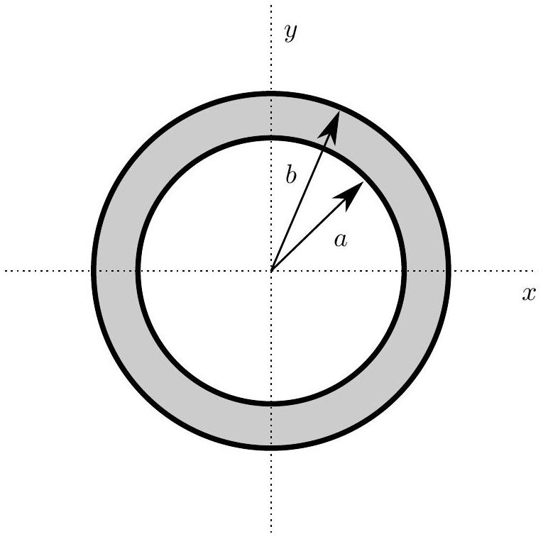

a. Assume that the point charge $q$ is located at the origin in the very center of the shell.
    i. Determine the magnitude of the electric field outside the conducting shell at $x = b$.

## Solution

We apply Gauss's law for a sphere with radius $r > b$ centered about the origin. Since the shell is neutral, the enclosed charge is $q$, so by spherical symmetry

$$
E ( r ) = \frac { q } { 4 \pi \epsilon _ { 0 } r ^ { 2 } }
$$

outside the shell. Just outside the shell, the field is $q / 4 \pi \epsilon _ { 0 } b ^ { 2 }$.

ii. Sketch a graph for the magnitude of the electric field along the $x$ axis on the answer sheet provided.

## Solution

Since the shell is conducting, the electrostatic field is zero inside it. By Gauss's law, this is achieved by having a charge of $- q$ on the inner surface $r = a$ and a charge of $q$ on the outer surface $r = b$, both uniformly distributed.
For $r < a$, we can apply Gauss's law again to conclude $E ( r ) = \frac { q } { 4 \pi \epsilon _ { 0 } r ^ { 2 } }$, just as it is outside the shell.

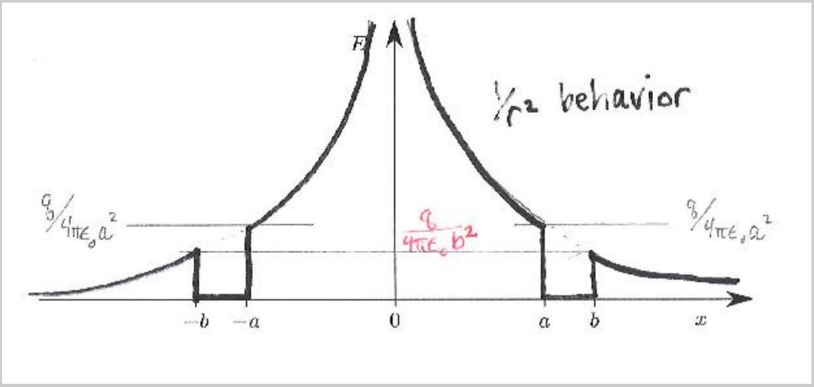
iii. Determine the electric potential at $x = a$.

## Solution

The shell is a conductor, so it is an equipotential surface. Then the potential at $r = a$ is same as the potential at $r = b$. However, outside the shell the field looks just like that of a point charge $q$ at the origin, so

$$
V ( a ) = V ( b ) = \frac { q } { 4 \pi \epsilon _ { 0 } b } .
$$

iv. Sketch a graph for the electric potential along the $x$ axis on the answer sheet provided.

## Solution

As we've shown above, the potential is proportional to $1 / r$ outside $r = b$, and is constant between $r = a$ and $r = b$. Then the potential for $r < a$ is not proportional to $1 / r$. Instead, it is a $1 / r$ curve shifted by a constant, so that the potential is continuous at $r = a$.
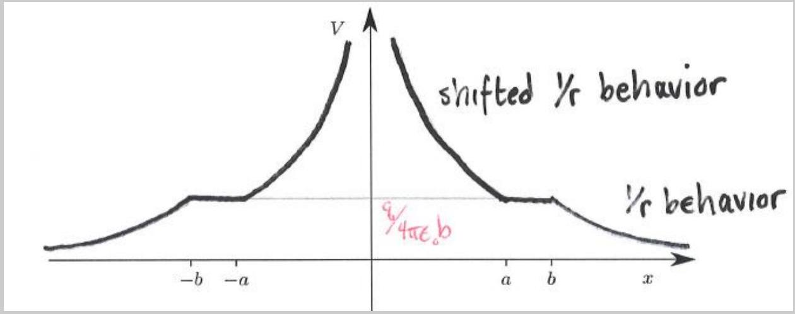

b. Assume that the point charge $q$ is now located on the $x$ axis at a point $x = 2 a / 3$.
    i. Determine the magnitude of the electric field outside the conducting shell at $x = b$.

## Solution

The conducting shell acts like a Faraday cage. As in the previous part, by Gauss's law, we must have a charge of $- q$ on the inner surface, so a charge of $q$ on the outer surface. The charge on the inner surface is distributed non-uniformly to perfectly cancel out the asymmetric field of the point charge; these two contributions sum to exactly zero everywhere outside $r = a$. Then by spherical symmetry, the charges on the outer surface are uniformly distributed.
One might wonder why the charges on the outer and inner surfaces can't both be nonuniformly distributed. A more rigorous argument would appeal to the uniqueness theorems for electrostatics: given the setup we've given, there is only one way to satisfy all the boundary conditions, so the configuration we gave above must be it. The general principle in that in electrostatics, the only information that can be seen across a shielding conducting shell is the total charge.
In any case, by the same logic as in part (a),

$$
E ( r ) = \frac { q } { 4 \pi \epsilon _ { 0 } r ^ { 2 } }
$$

outside the shell. Just outside the shell, the field is $q / 4 \pi \epsilon _ { 0 } b ^ { 2 }$.

ii. Sketch a graph for the magnitude of the electric field along the $x$ axis on the answer sheet provided.

## Solution

For $r < b$, the field is just that of a point charge at the origin, by the shell theorem. The field inside is more complicated because it depends on the distribution of charge on the inner surface; all that is required is that it diverges at $x = 2 a / 3$ and is higher at $x = a$ than $x = - a$.
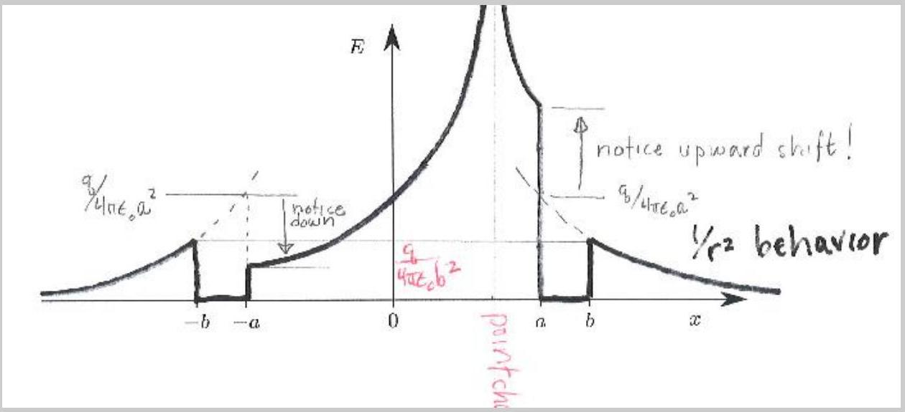

Incidentally, one can find the field for $r < a$ exactly using the method of image charges: for $r < a$, the shielding charges on the inner surface produce the exact same field as a single point charge would. The location of this "image" charge can be found by inverting the original point charge about the circle $r = a$.
iii. Determine the electric potential at $x = a$.

## Solution
By the same logic as in part (a),
$$
V ( a ) = \frac { q } { 4 \pi \epsilon _ { 0 } b } .
$$
iv. Sketch a graph for the electric potential along the $x$ axis on the answer sheet provided.

## Solution
Again, the potential is proportional to $1 / r$ outside $r = b$, and is constant between $r = a$ and $r = b$. The potential inside is more complicated, diverging at $x = 2 a / 3$.
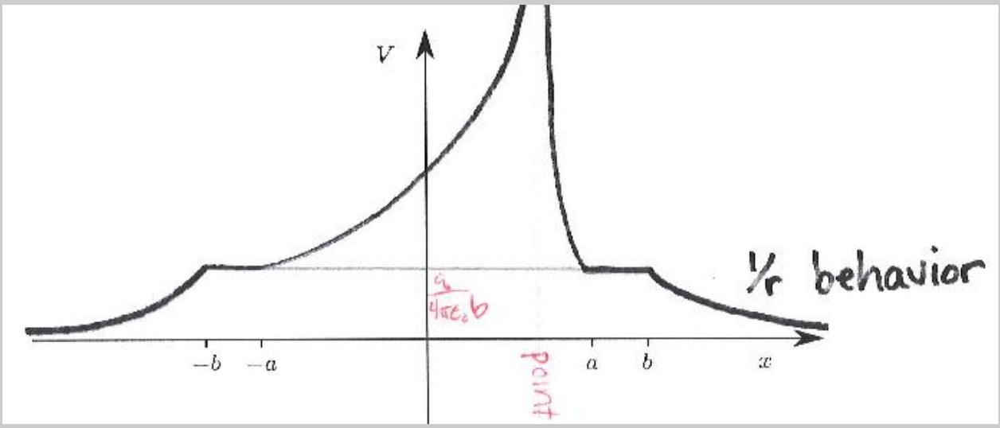
v. Sketch a figure showing the electric field lines (if any) inside, within, and outside the conducting shell on the answer sheet provided. You should show at least eight field lines in any distinct region that has a non-zero field.

## Solution
The field should be spherically symmetric outside the shell, zero within the shell, and nonuniform inside. The field lines should terminate perpendicular to the conductor.

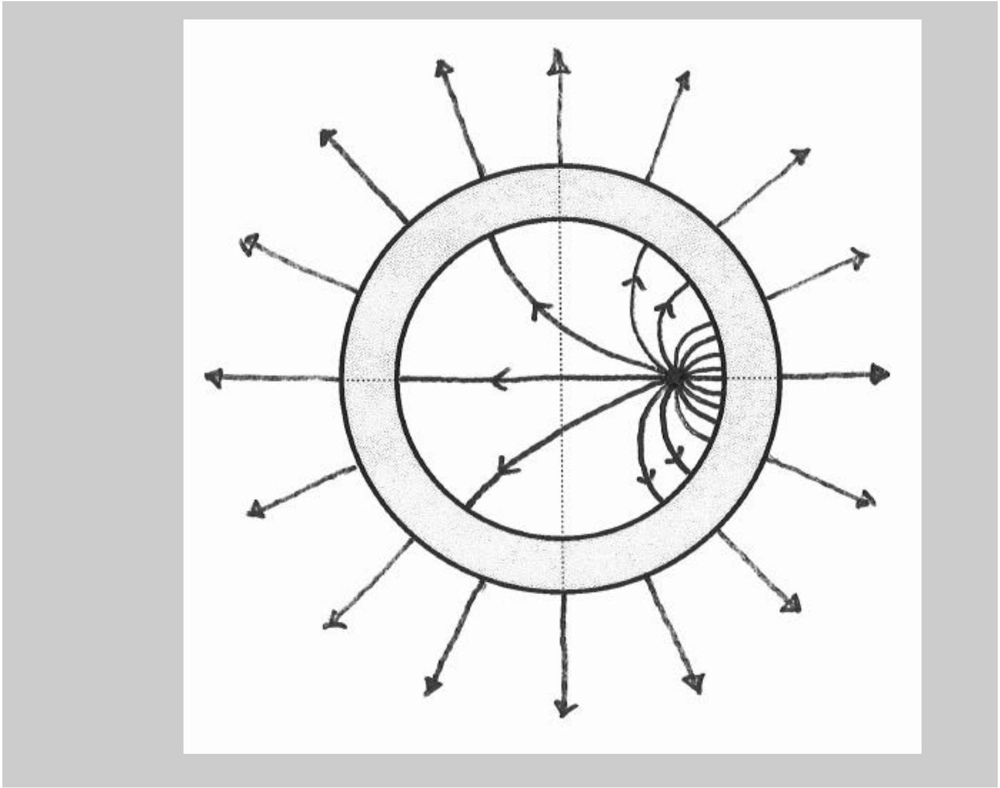

## STOP: Do Not Continue to Part B

If there is still time remaining for Part A, you should review your work for Part A, but do not continue to Part B until instructed by your exam supervisor.

## Part B

## Question B1

A block of mass $M$ has a hole drilled through it so that a ball of mass $m$ can enter horizontally and then pass through the block and exit vertically upward. The ball and block are located on a frictionless surface; the block is originally at rest.
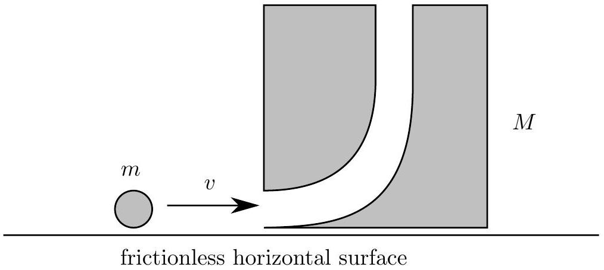

a. Consider the scenario where the ball is traveling horizontally with a speed $v _ { 0 }$. The ball enters the block and is ejected out the top of the block. Assume there are no frictional losses as the ball passes through the block, and the ball rises to a height much higher than the dimensions of the block. The ball then returns to the level of the block, where it enters the top hole and then is ejected from the side hole. Determine the time $t$ for the ball to return to the position where the original collision occurs in terms of the mass ratio $\beta = M / m$, speed $v _ { 0 }$, and acceleration of free fall $g$.

## Solution

After the collision, the ball and block have the same horizontal velocity $v _ { 1 }$. Since the horizontal momentum is conserved,

$$
v _ { 1 } = \frac { m } { m + M } v _ { 0 } .
$$

Let $v _ { 2 }$ be the vertical component of the velocity of the ball immediately after the collision. Since there are no frictional losses, conservation of energy yields

$$
\frac { 1 } { 2 } m v _ { 0 } ^ { 2 } = \frac { 1 } { 2 } M v _ { 1 } ^ { 2 } + \frac { 1 } { 2 } m \left( v _ { 1 } ^ { 2 } + v _ { 2 } ^ { 2 } \right) .
$$

Since the ball rises to a height much higher than the height of the block, the gravitational potential energy is negligible, so we have ignored it. This assumption also means we can ignore the duration of the collision itself in our calculations below.
Plugging in our result for $v _ { 1 }$,

$$
m v _ { 0 } ^ { 2 } - ( M + m ) \left( \frac { m } { m + M } \right) ^ { 2 } v _ { 0 } ^ { 2 } = m v _ { 2 } ^ { 2 } \Rightarrow v _ { 2 } = \sqrt { \frac { M } { m + M } } v _ { 0 } .
$$

The time spent by the ball in the air is

$$
t _ { 1 } = 2 v _ { 2 } / g .
$$

The distance traveled horizontally by the ball while it is in the air is

$$
x = v _ { 1 } t _ { 1 } = \frac { 2 v _ { 1 } v _ { 2 } } { g } = \frac { 2 v _ { 0 } ^ { 2 } } { g } \sqrt { \frac { m ^ { 2 } M } { ( m + M ) ^ { 3 } } } .
$$

The ball then falls back into the block and is ejected horizontally.
Since energy and momentum are conserved from before the first collision and after the second, the final horizontal velocity $v _ { 3 }$ of the ball is given by the result for a perfectly elastic collision,

$$
v _ { 3 } = v _ { 0 } \frac { m - M } { m + M }
$$

as can be derived from the conservation laws. Note that $v _ { 3 }$ is positive for $m > M$. Thus if $\beta \leq 1$, the time $t$ is infinite; the ball never returns to its starting position.
Assuming that $\beta > 1$, the ball must move a distance $x$ towards its original collision point, where we have neglected the time taken for the collisions themselves. Thus the time for the ball to return to its original position horizontally is

$$
t _ { 2 } = - \frac { x } { v _ { 3 } } = \frac { 2 v _ { 0 } } { g } \sqrt { \frac { m ^ { 2 } M } { ( M + m ) ( M - m ) ^ { 2 } } } .
$$

The total time since the first collision is

$$
t = t _ { 1 } + t _ { 2 } = \frac { 2 v _ { 0 } } { g } \sqrt { \frac { M } { m + M } } \left( \frac { M } { M - m } \right) = \frac { 2 v _ { 0 } } { g } \sqrt { \frac { \beta } { 1 + \beta } } \left( \frac { \beta } { \beta - 1 } \right)
$$

where $\beta > 1$.
b. Now consider friction. The ball has moment of inertia $I = \frac { 2 } { 5 } m r ^ { 2 }$ and is originally not rotating. When it enters the hole in the block it rubs against one surface so that when it is ejected upwards the ball is rolling without slipping. To what height does the ball rise above the block?

## Solution

As before, we have

$$
v _ { 1 } = \frac { m } { m + M } v _ { 0 } .
$$

Let $v _ { 4 }$ be the vertical velocity of the ball after the collision; it is less than $v _ { 2 }$ due to the friction force $f$. Friction slows the ball down with an impulse given by

$$
\Delta p = f \Delta t = m \left( v _ { 2 } - v _ { 4 } \right)
$$

while increasing the angular momentum by

$$
\Delta L = \tau \Delta t = r f \Delta t = r \Delta p .
$$

We also know that $\Delta L = I \omega = I v _ { 4 } / r$, so

$$
I v _ { 4 } / r = m r \left( v _ { 2 } - v _ { 4 } \right) \quad \Rightarrow \quad v _ { 4 } = \frac { v _ { 2 } } { 1 + 2 / 5 } .
$$

The vertical velocity of the ball will take it to a height

$$
h = \frac { v _ { 4 } ^ { 2 } } { 2 g } = \frac { v _ { 0 } ^ { 2 } } { 2 g } \frac { 1 } { ( 1 + 2 / 5 ) ^ { 2 } } \frac { M } { m + M } = \frac { v _ { 0 } ^ { 2 } } { 2 g } \frac { 25 } { 49 } \frac { \beta } { 1 + \beta } .
$$

Question B2
In parts a and b of this problem assume that velocities $v$ are much less than the speed of light $c$, and therefore ignore relativistic contraction of lengths or time dilation.

a. An infinite uniform sheet has a surface charge density $\sigma$ and has an infinitesimal thickness. The sheet lies in the $x y$ plane.
    i. Assuming the sheet is at rest, determine the electric field $\tilde { \mathbf { E } }$ (magnitude and direction) above and below the sheet.

## Solution

By symmetry, the fields above and below the sheet are equal in magnitude and directed away from the sheet. By Gauss's Law, using a cylinder of base area $A$,

$$
2 E A = \frac { \sigma A } { \epsilon _ { 0 } } \Rightarrow E = \frac { \sigma } { 2 \epsilon _ { 0 } }
$$

pointing directly away from the sheet in the $z$ direction, or

$$
\mathbf { E } = \frac { \sigma } { 2 \epsilon } \times \begin{cases} \hat { \mathbf { z } } & \text { above the sheet } , \\ - \hat { \mathbf { z } } & \text { below the sheet. } \end{cases}
$$

ii. Assuming the sheet is moving with velocity $\tilde { \mathbf { v } } = v \hat { \mathbf { x } }$ (parallel to the sheet), determine the electric field $\tilde { \mathbf { E } }$ (magnitude and direction) above and below the sheet.

## Solution

The motion does not affect the electric field, so the answer is the same as that of part (i).

iii. Assuming the sheet is moving with velocity $\tilde { \mathbf { v } } = v \hat { \mathbf { x } }$, determine the magnetic field $\tilde { \mathbf { B } }$ (magnitude and direction) above and below the sheet.

## Solution

Assuming $v > 0$, the right-hand rule indicates there is a magnetic field in the $- \tilde { \mathbf { y } }$ direction for $z > 0$ and in the $+ \tilde { \mathbf { y } }$ direction for $z < 0$. From Ampere's law applied to a loop of length $l$ normal to the $\tilde { \mathbf { x } }$ direction,

$$
2 B l = \mu _ { 0 } \sigma v l .
$$

To get the right-hand side, note that in time $t$, an area $v t l$ moves through the loop, so a charge $\sigma v t l$ moves through. Then the current through the loop is $\sigma v l$.
Applying symmetry, we have

$$
\mathbf { B } = \frac { \mu _ { 0 } \sigma v } { 2 } \times \begin{cases} - \hat { \mathbf { y } } & \text { above the sheet } , \\ \hat { \mathbf { y } } & \text { below the sheet. } \end{cases}
$$

iv. Assuming the sheet is moving with velocity $\tilde { \mathbf { v } } = v \hat { \mathbf { z } }$ (perpendicular to the sheet), determine the electric field $\tilde { \mathbf { E } }$ (magnitude and direction) above and below the sheet.

## Solution

Again the motion does not affect the electric field, so the answer is the same as that of part (i).

v. Assuming the sheet is moving with velocity $\tilde { \mathbf { v } } = v \hat { \mathbf { z } }$, determine the magnetic field $\tilde { \mathbf { B } }$ (magnitude and direction) above and below the sheet.

## Solution

Applying Ampere's law and symmetry, there is no magnetic field above and below the sheet.
Interestingly, there's no magnetic field at the sheet either. Consider an Amperian loop of area $A$ in the $x y$ plane as the sheet passes through. The loop experiences a current of the form

$$
A \sigma \delta ( t ) .
$$

But the loop also experiences an oppositely directed change in flux of the form

$$
A \frac { \sigma } { \epsilon _ { 0 } } \delta ( t ) ,
$$

so the right-hand side of Ampere's law, including the displacement current term, remains zero.

b. In a certain region there exists only an electric field $\tilde { \mathbf { E } } = E _ { x } \hat { \mathbf { x } } + E _ { y } \hat { \mathbf { y } } + E _ { z } \hat { \mathbf { z } }$ (and no magnetic field) as measured by an observer at rest. The electric and magnetic fields $\tilde { \mathbf { E } ^ { \prime } }$ and $\tilde { \mathbf { B } ^ { \prime } }$ as measured by observers in motion can be determined entirely from the local value of $\tilde { \mathbf { E } }$, regardless of the charge configuration that may have produced it.
    i. What would be the observed electric field $\tilde { \mathbf { E } } ^ { \prime }$ as measured by an observer moving with velocity $\tilde { \mathbf { v } } = v \hat { \mathbf { z } }$ ?

## Solution

In part (a), we showed that if the electric field was produced by a sheet of charge, then it was unaffected by the motion of an observer. Thus, in general,

$$
\mathbf { E } ^ { \prime } = \mathbf { E } .
$$

ii. What would be the observed magnetic field $\tilde { \mathbf { B } ^ { \prime } }$ as measured by an observer moving with velocity $\tilde { \mathbf { v } } = v \hat { \mathbf { z } }$ ?

## Solution

No magnetic field was created by the motion of the sheet of charge in the direction of the electric field, so the magnetic field in the frame of reference of the moving observer should likewise not depend on the component of the electric field in the direction of motion. When the sheet of charge was moving in the $+ \hat { \mathbf { x } }$ direction, a magnetic field was created in the $- \hat { \mathbf { y } }$ direction; the observer moving in the $+ \hat { \mathbf { x } }$ direction is equivalent to the sheet of charge moving in the $- \hat { \mathbf { x } }$ direction, creating a magnetic field in the $+ \hat { \mathbf { y } }$ direction. That is, an electric field in the $\hat { \mathbf { z } }$ direction causes an observer moving in the $\hat { \mathbf { x } }$ direction to observe a magnetic field in the $\hat { \mathbf { y } } = \hat { \mathbf { z } } \times \hat { \mathbf { x } }$ direction.
Furthermore, the magnitudes of the fields satisfied
$$
B = \mu _ { 0 } \epsilon _ { 0 } v E = \frac { 1 } { c ^ { 2 } } v E .
$$
Combining this with the previous equation,
$$
\mathbf { B } ^ { \prime } = - \frac { 1 } { c ^ { 2 } } \mathbf { v } \times \mathbf { E } = \frac { v } { c ^ { 2 } } \left( E _ { y } \hat { \mathbf { x } } - E _ { x } \hat { \mathbf { y } } \right) .
$$
c. An infinitely long wire wire on the $z$ axis is composed of positive charges with linear charge density $\lambda$ which are at rest, and negative charges with linear charge density $- \lambda$ moving with speed $v$ in the $z$ direction.
    i. Determine the electric field $\tilde { \mathbf { E } }$ (magnitude and direction) at points outside the wire.

## Solution

The wire as a whole is neutral, so there is no electric field outside the wire.

ii. Determine the magnetic field $\tilde { \mathbf { B } }$ (magnitude and direction) at points outside the wire.

## Solution

The current in the wire is $\lambda v$, so Ampere's law yields

$$
B = \mu _ { 0 } \frac { \lambda v } { 2 \pi r }
$$

in the tangential direction. The current is in the $- \hat { \mathbf { z } }$ direction, so by the right-hand rule, the circular B field lines would point clockwise looking in that direction.

iii. Now consider an observer moving with speed $v$ parallel to the $z$ axis so that the negative charges appear to be at rest. There is a symmetry between the electric and magnetic fields such that a variation to your answer to part b can be applied to the magnetic field in this part. You will need to change the multiplicative constant to something dimensionally correct and reverse the sign. Use this fact to find and describe the electric field measured by the moving observer, and comment on your result. (Some familiarity with special relativity can help you verify the direction of your result, but is not necessary to obtain the correct answer.)

Copyright ©2014 American Association of Physics Teachers

## Solution

The result of part (b) was

$$
\mathbf { B } ^ { \prime } = - \frac { 1 } { c ^ { 2 } } \mathbf { v } \times \mathbf { E } .
$$

Exchanging the electric and magnetic fields, reversing the sign, and fixing the dimensions,

$$
\mathbf { E } ^ { \prime } = \mathbf { v } \times \mathbf { B } .
$$

Taking the cross product yields an electric field vector that points outward, with magnitude

$$
E ^ { \prime } = v \mu _ { 0 } \frac { \lambda v } { 2 \pi r } = \frac { \lambda } { 2 \pi \epsilon _ { 0 } r } \frac { v ^ { 2 } } { c ^ { 2 } } .
$$

Physically, this can be explained by length contraction of the positive charges and inverse length contraction of the negative charges, which are now stationary. That is, we have derived a relativistic effect, second-order in $v / c$, from the first-order field transformations! Why wasn't this derivation used to discover relativity the moment Maxwell's equations were written down? We have implicitly assumed that Maxwell's equations are the same in all reference frames, but historically it was thought they were only valid in one frame, the reference frame of the ether. Assuming that Maxwell's equations are indeed the same in all frames yields an invariant speed, the speed of light, leaving inevitably to all of special relativity. Here we've taken one of many possible paths.

## Answer Sheets

Following are answer sheets for some of the graphical portions of the test.

Answer for Part A, Question 3

Space-time graph for accelerated rocket. The positions of Fred and the Alien at $t = 0$ are shown.

Answer for Part A, Question 4

Answer for Part A, Question 4

Answer for Part A, Question 4

Answer for Part A, Question 4

Answer for Part A, Question 4

[^0]:    ${ } ^ { 1 }$ We are using the convention used by Einstein
