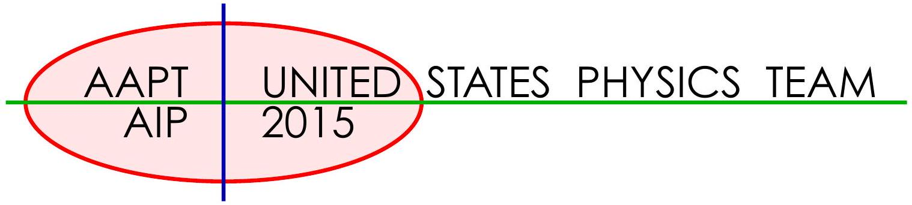

## USA Physics Olympiad Exam

## DO NOT DISTRIBUTE THIS PAGE

## Important Instructions for the Exam Supervisor

- This examination consists of two parts.
- Part A has four questions and is allowed 90 minutes.
- Part B has two questions and is allowed 90 minutes.
- The first page that follows is a cover sheet. Examinees may keep the cover sheet for both parts of the exam.
- The parts are then identified by the center header on each page. Examinees are only allowed to do one part at a time, and may not work on other parts, even if they have time remaining.
- Allow 90 minutes to complete Part A. Do not let students look at Part B. Collect the answers to Part A before allowing the examinee to begin Part B. Examinees are allowed a 10 to 15 minutes break between parts A and B.
- Allow 90 minutes to complete Part B. Do not let students go back to Part A.
- Ideally the test supervisor will divide the question paper into 4 parts: the cover sheet (page 2), Part A (pages 3-13), Part B (pages 15-21), and several answer sheets for one of the questions in Part A (pages 14-14). Examinees should be provided parts A and B individually, although they may keep the cover sheet. The answer sheets should be printed single sided!
- The supervisor must collect all examination questions, including the cover sheet, at the end of the exam, as well as any scratch paper used by the examinees. Examinees may not take the exam questions. The examination questions may be returned to the students after April 15, 2015.
- Examinees are allowed calculators, but they may not use symbolic math, programming, or graphic features of these calculators. Calculators may not be shared and their memory must be cleared of data and programs. Cell phones, PDA's or cameras may not be used during the exam or while the exam papers are present. Examinees may not use any tables, books, or collections of formulas.

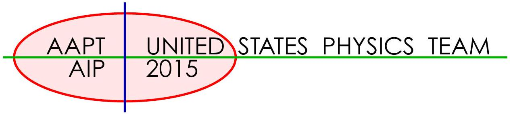

## USA Physics Olympiad Exam INSTRUCTIONS

## DO NOT OPEN THIS TEST UNTIL YOU ARE TOLD TO BEGIN

- Work Part A first. You have 90 minutes to complete all four problems. Each question is worth 25 points. Do not look at Part B during this time.
- After you have completed Part A you may take a break.
- Then work Part B. You have 90 minutes to complete both problems. Each question is worth 50 points. Do not look at Part A during this time.
- Show all your work. Partial credit will be given. Do not write on the back of any page. Do not write anything that you wish graded on the question sheets.
- Start each question on a new sheet of paper. Put your AAPT ID number, your name, the question number and the page number/total pages for this problem, in the upper right hand corner of each page. For example,

AAPT ID \#
Doe, Jamie
A1-1/3

- A hand-held calculator may be used. Its memory must be cleared of data and programs. You may use only the basic functions found on a simple scientific calculator. Calculators may not be shared. Cell phones, PDA's or cameras may not be used during the exam or while the exam papers are present. You may not use any tables, books, or collections of formulas.
- Questions with the same point value are not necessarily of the same difficulty.
- In order to maintain exam security, do not communicate any information about the questions (or their answers/solutions) on this contest until after April 15, 2015.

Possibly Useful Information. You may use this sheet for both parts of the exam.

$$
\begin{array} { l l }
g = 9.8 \mathrm {~N} / \mathrm { kg } & G = 6.67 \times 10 ^ { - 11 } \mathrm {~N} \cdot \mathrm {~m} ^ { 2 } / \mathrm { kg } ^ { 2 } \\
k = 1 / 4 \pi \epsilon _ { 0 } = 8.99 \times 10 ^ { 9 } \mathrm {~N} \cdot \mathrm {~m} ^ { 2 } / \mathrm { C } ^ { 2 } & k _ { \mathrm { m } } = \mu _ { 0 } / 4 \pi = 10 ^ { - 7 } \mathrm {~T} \cdot \mathrm {~m} / \mathrm { A } \\
c = 3.00 \times 10 ^ { 8 } \mathrm {~m} / \mathrm { s } & k _ { \mathrm { B } } = 1.38 \times 10 ^ { - 23 } \mathrm {~J} / \mathrm { K } \\
N _ { \mathrm { A } } = 6.02 \times 10 ^ { 23 } ( \mathrm {~mol} ) ^ { - 1 } & R = N _ { \mathrm { A } } k _ { \mathrm { B } } = 8.31 \mathrm {~J} / ( \mathrm { mol } \cdot \mathrm {~K} ) \\
\sigma = 5.67 \times 10 ^ { - 8 } \mathrm {~J} / \left( \mathrm { s } \cdot \mathrm {~m} ^ { 2 } \cdot \mathrm {~K} ^ { 4 } \right) & e = 1.602 \times 10 ^ { - 19 } \mathrm { C } \\
1 \mathrm { eV } = 1.602 \times 10 ^ { - 19 } \mathrm {~J} & h = 6.63 \times 10 ^ { - 34 } \mathrm {~J} \cdot \mathrm {~s} = 4.14 \times 10 ^ { - 15 } \mathrm { eV } \cdot \mathrm {~s} \\
m _ { e } = 9.109 \times 10 ^ { - 31 } \mathrm {~kg} = 0.511 \mathrm { MeV } / \mathrm { c } ^ { 2 } & ( 1 + x ) ^ { n } \approx 1 + n x \text { for } | x | \ll 1 \\
\sin \theta \approx \theta - \frac { 1 } { 6 } \theta ^ { 3 } \text { for } | \theta | \ll 1 & \cos \theta \approx 1 - \frac { 1 } { 2 } \theta ^ { 2 } \text { for } | \theta | \ll 1
\end{array}
$$

## Part A

## Question A1

Consider a particle of mass $m$ that elastically bounces off of an infinitely hard horizontal surface under the influence of gravity. The total mechanical energy of the particle is $E$ and the acceleration of free fall is $g$. Treat the particle as a point mass and assume the motion is non-relativistic.

a. An estimate for the regime where quantum effects become important can be found by simply considering when the deBroglie wavelength of the particle is on the same order as the height of a bounce. Assuming that the deBroglie wavelength is defined by the maximum momentum of the bouncing particle, determine the value of the energy $E _ { q }$ where quantum effects become important. Write your answer in terms of some or all of $g , m$, and Planck's constant $h$.

## Solution

The de Broglie wavelength is $p = h / \lambda$, so if the height $H$ of the bounce is given by

$$
E = m g H = \frac { p ^ { 2 } } { 2 m }
$$

and $\lambda = H$, then

$$
m g H = \frac { h ^ { 2 } } { 2 m H ^ { 2 } } \quad \Rightarrow \quad H ^ { 3 } = \frac { h ^ { 2 } } { 2 m ^ { 2 } g }
$$

or

$$
E _ { q } = \sqrt [ 3 ] { \frac { 1 } { 2 } m g ^ { 2 } h ^ { 2 } } .
$$

One can also use dimensional analysis to find $E _ { q } \propto \sqrt [ 3 ] { m g ^ { 2 } h ^ { 2 } }$, though this will receive only partial credit.

b. A second approach allows us to develop an estimate for the actual allowed energy levels of a bouncing particle. Assuming that the particle rises to a height $H$, we can write
$$
2 \int _ { 0 } ^ { H } p d x = \left( n + \frac { 1 } { 2 } \right) h
$$
where $p$ is the momentum as a function of height $x$ above the ground, $n$ is a non-negative integer, and $h$ is Planck's constant.
    i. Determine the allowed energies $E _ { n }$ as a function of the integer $n$, and some or all of $g$, $m$, and Planck's constant $h$.
    ii. Numerically determine the minimum energy of a bouncing neutron. The mass of a neutron is $m _ { n } = 1.675 \times 10 ^ { - 27 } \mathrm {~kg} = 940 \mathrm { MeV } / \mathrm { c } ^ { 2 }$; you may express your answer in either Joules or eV.
    iii. Determine the bounce height of one of these minimum energy neutrons.

## Solution

We simply evaluate the given integral,

$$
\begin{aligned}
\left( n + \frac { 1 } { 2 } \right) h & = 2 \int _ { 0 } ^ { H } p d x \\
& = 2 \sqrt { 2 m } \int _ { 0 } ^ { H } \sqrt { E - m g x } d x \\
& = 2 \sqrt { 2 m E } \int _ { 0 } ^ { H } \sqrt { 1 - m g x / E } d x \\
& = 2 \sqrt { 2 m E } \frac { E } { m g } \int _ { 0 } ^ { 1 } \sqrt { 1 - u } d u \\
& = 2 \sqrt { 2 m E } \frac { E } { m g } \int _ { 0 } ^ { 1 } \sqrt { v } d v \\
& = 2 \sqrt { 2 } \frac { E ^ { 3 / 2 } } { \sqrt { m } g } \frac { 2 } { 3 }
\end{aligned}
$$

so

$$
E _ { n } = \sqrt [ 3 ] { \frac { 9 m g ^ { 2 } h ^ { 2 } } { 32 } } \left( n + \frac { 1 } { 2 } \right) ^ { 2 / 3 } .
$$

Solving for the minimum energy we get

$$
E _ { 0 } = \sqrt [ 3 ] { \frac { 9 m g ^ { 2 } h ^ { 2 } } { 128 } } = \sqrt [ 3 ] { \frac { 9 \left( m c ^ { 2 } \right) g ^ { 2 } h ^ { 2 } } { 128 c ^ { 2 } } } = 1.1 \times 10 ^ { - 12 } \mathrm { eV } .
$$

The bounce height is given by

$$
H = \frac { E _ { 0 } } { m g } = 10 \mu \mathrm {~m} .
$$

This is a very measurable distance!

c. Let $E _ { 0 }$ be the minimum energy of the bouncing neutron and $f$ be the frequency of the bounce. Determine an order of magnitude estimate for the ratio $E / f$. It only needs to be accurate to within an order of magnitude or so, but you do need to show work!

## Solution

One can simply use the results found above. A quicker method is dimensional analysis: the only quantity with units of energy times time is $h$ itself, so we must have

$$
E / f \sim h .
$$

A mnemonic to remember the units is the energy-time uncertainty principle $\Delta E \Delta t \sim h$.

## Question A2

Consider the circuit shown below. $I _ { s }$ is a constant current source, meaning that no matter what device is connected between points A and B, the current provided by the constant current source is the same.
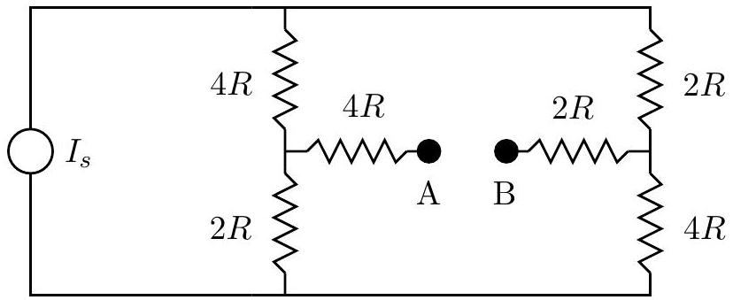

a. Connect an ideal voltmeter between $A$ and $B$. Determine the voltage reading in terms of any or all of $R$ and $I _ { s }$.

## Solution

An ideal voltmeter has infinite resistance, so no current flows between A and B. By symmetry, the same current must flow down each leg, so the current in each leg is $I _ { s } / 2$.
Assume the potential at the bottom is zero. The potential at A is the same as the junction to the left of A, so

$$
V _ { A } = \frac { I _ { s } } { 2 } 2 R = I _ { s } R .
$$

The potential at B is found the same way,

$$
V _ { B } = \frac { I _ { s } } { 2 } 4 R = 2 I _ { s } R .
$$

The difference is

$$
V _ { A } - V _ { B } = - I _ { s } R .
$$

The sign is not important for scoring purposes.

b. Connect instead an ideal ammeter between $A$ and $B$. Determine the current in terms of any or all of $R$ and $I _ { s }$.

## Solution

An ideal ammeter has zero resistance, so we just need to find the current through the effective $6 R$ resistor that connects the two vertical branches. This current will flow to the left.

By symmetry, the current through each vertical resistance of $2 R$ must be the same, as well as the currents through each vertical resistance of $4 R$. This gives the system of equations

$$
\begin{aligned}
I _ { s } & = I _ { 2 } + I _ { 4 } , \\
I _ { 2 } & = I _ { 6 } + I _ { 4 } , \\
I _ { 4 } ( 4 R ) & = I _ { 2 } ( 2 R ) + I _ { 6 } ( 6 R ) .
\end{aligned}
$$

Eliminating $I _ { 2 }$ gives

$$
\begin{aligned}
I _ { s } & = I _ { 6 } + 2 I _ { 4 } , \\
4 I _ { 4 } & = 2 \left( I _ { 6 } + I _ { 4 } \right) + 6 I _ { 6 } .
\end{aligned}
$$

Finally, eliminating $I _ { 4 }$ gives $I _ { 4 } = 4 I _ { 6 }$ and

$$
I _ { 6 } = \frac { 1 } { 9 } I _ { s } .
$$

c. It turns out that it is possible to replace the above circuit with a new circuit as follows:
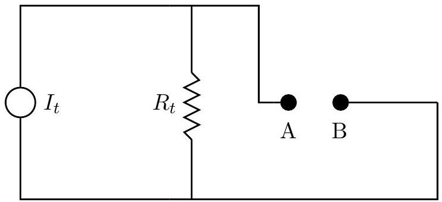
From the point of view of any passive resistance that is connected between A and B the circuits are identical. You don't need to prove this statement, but you do need to find $I _ { t }$ and $R _ { t }$ in terms of any or all of $R$ and $I _ { s }$.

## Solution

We can simply use the previous results. If A and B are shorted, all of the current will flow through AB, so $I _ { t } = I _ { 6 } = I _ { s } / 9$. If the resistance between A and B is infinite, the potential across AB will be $I _ { s } R$, so $R _ { t } = 9 R$. The statement we made above is called Norton's theorem.

## Question A3

A large block of mass $m _ { b }$ is located on a horizontal frictionless surface. A second block of mass $m _ { t }$ is located on top of the first block; the coefficient of friction (both static and kinetic) between the two blocks is given by $\mu$. All surfaces are horizontal; all motion is effectively one dimensional. A spring with spring constant $k$ is connected to the top block only; the spring obeys Hooke's Law equally in both extension and compression. Assume that the top block never falls off of the bottom block; you may assume that the bottom block is very, very long. The top block is moved a distance $A$ away from the equilibrium position and then released from rest.
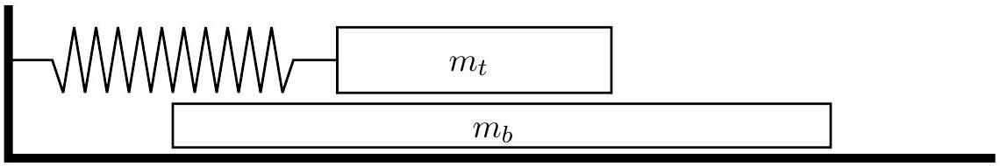

a. Depending on the value of $A$, the motion can be divided into two types: motion that experiences no frictional energy losses and motion that does. Find the value $A _ { c }$ that divides the two motion types. Write your answer in terms of any or all of $\mu$, the acceleration of gravity $g$, the masses $m _ { t }$ and $m _ { b }$, and the spring constant $k$.

## Solution

The maximum possible acceleration of the top block without slipping is $m _ { b } a _ { \max } = \mu m _ { t } g$. If the top block is not slipping then the angular frequency is given by

$$
\omega _ { 2 } = \sqrt { \frac { k } { m _ { t } + m _ { b } } } ,
$$

so

$$
a _ { \max } \geq A \omega _ { 2 } { } ^ { 2 }
$$

or

$$
A _ { c } = \mu g \frac { m _ { t } } { k } \left( 1 + \frac { m _ { t } } { m _ { b } } \right) .
$$

b. Consider now the scenario $A \gg A _ { c }$. In this scenario the amplitude of the oscillation of the top block as measured against the original equilibrium position will change with time. Determine the magnitude of the change in amplitude, $\Delta A$, after one complete oscillation, as a function of any or all of $A , \mu , g$, and the angular frequency of oscillation of the top block $\omega _ { t }$.

## Solution

The energy of an oscillation is approximately equal to

$$
E = \frac { 1 } { 2 } k A ^ { 2 } .
$$

Taking the differential gives the energy loss due to friction,

$$
\Delta E = k A \Delta A .
$$

If $A \gg A _ { c }$, then the top block has almost completed a complete half cycle before the bottom block catches up with it, so the energy lost in half a cycle is approximately

$$
\frac { 1 } { 2 } \Delta E = 2 A f = 2 A \mu m _ { t } g
$$

where $f$ is the friction force. Combining,

$$
4 \mu m _ { t } g = k \Delta A \quad \Rightarrow \quad \Delta A = 4 \frac { \mu m _ { t } g } { k } = 4 \frac { \mu g } { \omega _ { t } ^ { 2 } } .
$$

c. Assume still that $A \gg A _ { c }$. What is the maximum speed of the bottom block during the first complete oscillation cycle of the upper block?

## Solution

The bottom block accelerates according to

$$
a = \mu g \frac { m _ { t } } { m _ { b } } .
$$

Since the bottom block exerts a constant force on the top block, the top block oscillates just as if it were free, but with a shifted equilibrium position for the spring. Hence

$$
\omega _ { t } = \sqrt { k / m _ { t } }
$$

which gives a half period of

$$
t = \pi \sqrt { m _ { t } / k } .
$$

The maximum speed is then

$$
v _ { b } = \pi \mu g \frac { m _ { t } } { m _ { b } } \sqrt { m _ { t } / k }
$$

## Question A4

A heat engine consists of a moveable piston in a vertical cylinder. The piston is held in place by a removable weight placed on top of the piston, but piston stops prevent the piston from sinking below a certain point. The mass of the piston is $m = 40.0 \mathrm {~kg}$, the cross sectional area of the piston is $A = 100 \mathrm {~cm} ^ { 2 }$, and the weight placed on the piston has a mass of $m = 120.0 \mathrm {~kg}$.

Assume that the region around the cylinder and piston is a vacuum, so you don't need to worry about external atmospheric pressure.

- At point A the cylinder volume $V _ { 0 }$ is completely filled with liquid water at a temperature $T _ { 0 } = 320 \mathrm {~K}$ and a pressure $P _ { \min }$ that would be just sufficient to lift the piston alone, except the piston has the additional weight placed on top.
- Heat energy is added to the water by placing the entire cylinder in a hot bath.
- At point B the piston and weight begins to rise.
- At point C the volume of the cylinder reaches $V _ { \text {max } }$ and the temperature reaches 400 K . The heat source is removed; the piston stops rising and is locked in place.
- Heat energy is now removed from the water by placing the entire cylinder in a cold bath.
- At point D the pressure in the cylinder returns to $P _ { \text {min } }$. The added weight is removed; the piston is unlocked and begins to move down.
- The cylinder volume returns to $V _ { 0 }$. The cylinder is removed from the cold bath, the weight is placed back on top of the piston, and the cycle repeats.

Because the liquid water can change to gas, there are several important events that take place

- At point $\mathbf { W }$ the liquid begins changing to gas.
- At point X all of the liquid has changed to gas. This may not occur the same as point C described above.
- At point Y the gas begins to change back into liquid.
- At point Z all of the gas has changed back into liquid.

When in the liquid state you need to know that for water kept at constant volume, a change in temperature $\Delta T$ is related to a change in pressure $\Delta P$ according to

$$
\Delta P \approx \left( 10 ^ { 6 } \mathrm {~Pa} / \mathrm { K } \right) \Delta T
$$

When in the gas state you should assume that water behaves like an ideal gas.

Of relevance to this question is the pressure/temperature phase plot for water, showing the regions where water exists in liquid form or gaseous form. The curve shows the coexistence condition, where water can exist simultaneously as gas or liquid.
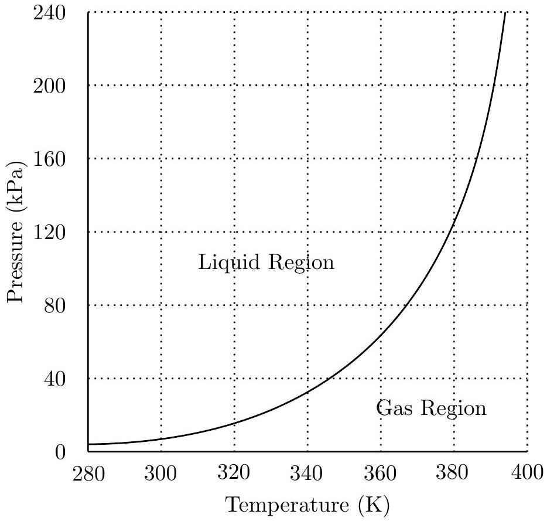

The following graphs should be drawn on the answer sheet provided.

## Solution

Before we get started solving the problem, let's say a bit about where the data in the problem comes from. We are using the Magnus form to approximate the coexistence curve,

$$
P = ( 610.94 \mathrm {~Pa} ) e ^ { 17.625 / ( 1 + 243.04 / T ) }
$$

where $T$ is measured in centigrade. This is closely related to the result that can be derived from the Clausius-Clapeyron equation for ideal gases,

$$
P = P _ { 0 } e ^ { \frac { L } { R } \left( \frac { T - T _ { 0 } } { T T _ { 0 } } \right) }
$$

where we assume the temperature is low compared to the critical temperature and the latent heat $L$ is a constant.

To get $\Delta P / \Delta T$, we used the cyclic chain rule

$$
\left( \frac { \partial P } { \partial T } \right) _ { V } \left( \frac { \partial V } { \partial P } \right) _ { T } \left( \frac { \partial T } { \partial V } \right) _ { P } = - 1
$$

where subscripts indicate what is being held constant. Dropping those for convenience,

$$
\frac { \partial P } { \partial T } = \left( - V \frac { \partial P } { \partial V } \right) \left( \frac { 1 } { V } \frac { \partial V } { \partial T } \right) = \frac { \beta _ { V T } } { \beta _ { P V } } \approx \frac { \left( 6 \times 10 ^ { - 4 } \mathrm {~K} ^ { - 1 } \right) } { \left( 5 \times 10 ^ { - 10 } \mathrm {~Pa} ^ { - 1 } \right) } \approx 10 ^ { 6 } \mathrm {~Pa} / \mathrm { K } .
$$

The specific value is not important; the point is that a very small change in the temperature of the liquid in a fixed volume will result in a very large change in the pressure.

a. Sketch a PT diagram for this cycle on the answer sheet. The coexistence curve for the liquid/gas state is shown. Clearly and accurately label the locations of points B through D and $\mathbf { W }$ through $\mathbf { Z }$ on this cycle.
b. Sketch a PV diagram for this cycle on the answer sheet. You should estimate a reasonable value for $V _ { \text {max } }$, note the scale is logarithmic. Clearly and accurately label the locations of points B through D on this cycle. Provide reasonable approximate locations for points W through $\mathbf { Z }$ on this cycle.

## Solution

The correct graphs are shown below.
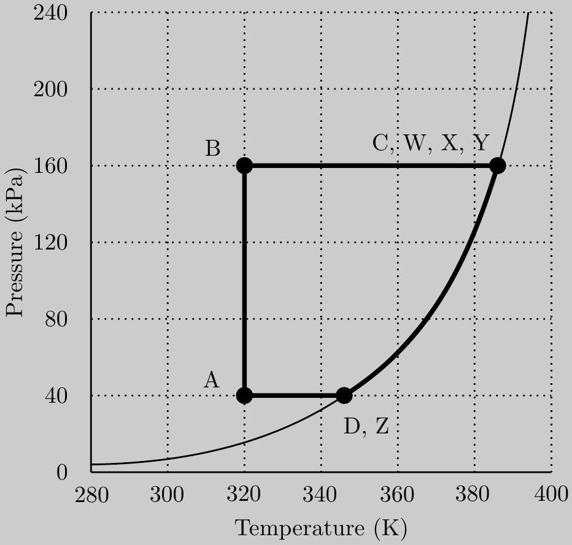

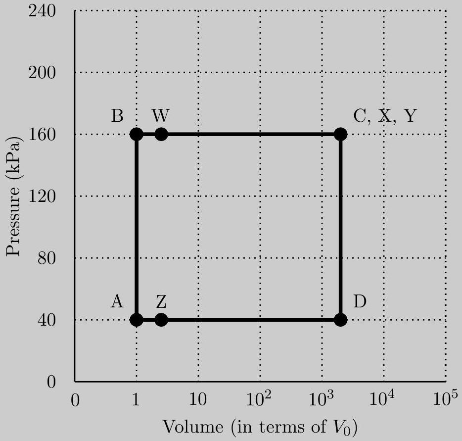

We start by computing pressures. The minimum pressure is attained when only the piston is to be lifted, so

$$
P _ { \min } = \frac { F } { A } = \frac { m g } { A } = \frac { ( 40 \mathrm {~kg} ) \left( 10 \mathrm {~m} / \mathrm { s } ^ { 2 } \right) } { \left( 0.01 \mathrm {~m} ^ { 2 } \right) } = 40 \mathrm { kPa } .
$$

The maximum pressure is attained when lifting the piston with extra weight,

$$
P _ { \max } = \frac { F } { A } = \frac { m g } { A } = \frac { ( 160 \mathrm {~kg} ) \left( 10 \mathrm {~m} / \mathrm { s } ^ { 2 } \right) } { \left( 0.01 \mathrm {~m} ^ { 2 } \right) } = 160 \mathrm { kPa } .
$$

Point A is clearly at $\left( P _ { \min } , T _ { 0 } \right)$ on the PT graph.
For liquid water a small temperature increase results in a large pressure increase, so point B is effectively at the same temperature as point A. Process A → B is therefore essentially isothermal, and it is also a constant volume process.

Afterwards, the pressure is sufficient to lift the piston and weight, so the volume expands at constant pressure for the process $\mathrm { B } \rightarrow \mathrm { C }$. However, liquid cannot change to gas until we reach the coexistence curve. This defines the location of point W . On the PT graph we are "stuck" on the coexistence curve until all the liquid has changed into gas, so X and C are also at the same point.

Upon reaching C the piston is locked in place, fixing the volume, and the cylinder is allowed to cool. To figure out what happens, suppose water vapor obeyed the ideal gas law $P V = n R T$. For a constant volume process, $T \propto P$, so the path would be a straight line towards the origin of the $P T$ diagram. This isn't what happens here, because we run into the coexistence curve, and the pressure is decreased by some of the gas condensing to liquid. Thus during the entire C → D process, we follow the coexistence curve downward; it is impossible to cross it until all of the vapor condenses.

The next process C → D is constant volume, but not isothermal. On the PT graph we follow the coexistence curve to the minimum pressure, at which time the piston is freed and allowed to

lower at constant pressure. Since Z is the point where all of the gas has changed to liquid, it must be on the coexistence curve. On the PV diagram it is just to the right of point A.

There are a few numbers needed on the PV diagram that are not given in the problem. You should know from everyday experience that liquid water will only expand slightly when heated over this temperature range, so point W must be very close to B on the PV diagram. You might also know that the density of liquid water is about 2, 000 times the density of water vapor in these conditions. In terms of grading policy, the points C, X, Y, and D may have volumes in the range $\left[ 1000 V _ { 0 } , 5000 V _ { 0 } \right]$ on the PV diagram for full credit, while points W and Z may have volumes in the range $\left[ V _ { 0 } , 2 V _ { 0 } \right]$ for full credit and $\left[ 2 V _ { 0 } , 5 V _ { 0 } \right]$ for partial credit.

## STOP: Do Not Continue to Part B

If there is still time remaining for Part A, you should review your work for Part A, but do not continue to Part B until instructed by your exam supervisor.

## Part B

## Question B1

This problem is divided into two parts. It is possible to solve these two parts independently, but they are not equally weighted.

a. An ideal rocket when empty of fuel has a mass $m _ { r }$ and will carry a mass of fuel $m _ { f }$. The fuel burns and is ejected with an exhaust speed of $v _ { e }$ relative to the rocket. The fuel burns at a constant mass rate for a total time $T _ { b }$. Ignore gravity; assume the rocket is far from any other body.
    i. Determine an equation for the acceleration of the rocket as a function of time $t$ in terms of any or all of $t , m _ { f } , m _ { r } , v _ { e } , T _ { b }$, and any relevant fundamental constants.

## Solution

Since there are no external forces on the system,

$$
0 = \frac { d p } { d t } = \frac { d m } { d t } v + m \frac { d v } { d t }
$$

which means

$$
a = - \frac { 1 } { m ( t ) } v _ { e } \frac { d m } { d t } = \frac { v _ { e } } { m _ { r } + m _ { f } ( 1 - t / T ) } \frac { m _ { f } } { T } .
$$

ii. Assuming that the rocket starts from rest, determine the final speed of the rocket in terms of any or all of $m _ { r } , m _ { f } , v _ { e } , T _ { b }$, and any relevant fundamental constants.

## Solution

Rearrange the previous result for

$$
\frac { 1 } { v _ { e } } d v = - \frac { 1 } { m } d m
$$

Integrating both sides gives

$$
\frac { 1 } { v _ { e } } v = \ln \left( \frac { m _ { r } + m _ { f } } { m _ { r } } \right) \Rightarrow v = v _ { e } \ln \left( \frac { m _ { r } + m _ { f } } { m _ { r } } \right) .
$$

This result is called the ideal rocket equation.

b. The ship starts out in a circular orbit around the sun very near the Earth and has a goal of moving to a circular orbit around the Sun that is very close to Mars. It will make this transfer in an elliptical orbit as shown in bold in the diagram below. This is accomplished with an initial velocity boost near the Earth $\Delta v _ { 1 }$ and then a second velocity boost near Mars $\Delta v _ { 2 }$. Assume that both of these boosts are from instantaneous impulses, and ignore mass changes in the rocket as well as gravitational attraction to either Earth or Mars. Don't ignore the

Sun! Assume that the Earth and Mars are both in circular orbits around the Sun of radii $R _ { E }$ and $R _ { M } = R _ { E } / \alpha$ respectively. The orbital speeds are $v _ { E }$ and $v _ { M }$ respectively.
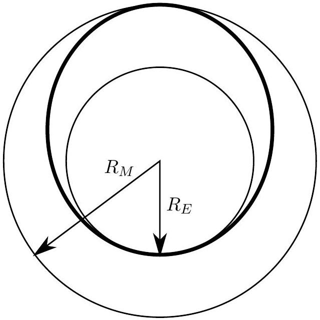

i. Derive an expression for the velocity boost $\Delta v _ { 1 }$ to change the orbit from circular to elliptical. Express your answer in terms of $v _ { E }$ and $\alpha$.

## Solution

First off, for a circular orbit of radius $R _ { c }$, we have

$$
\frac { G M _ { S } } { R _ { c } { } ^ { 2 } } = \frac { v _ { c } { } ^ { 2 } } { R _ { c } }
$$

where $M _ { S }$ is the mass of the sun, so

$$
v _ { E } = \sqrt { \frac { G M _ { S } } { R _ { E } } } , \quad v _ { M } = \sqrt { \frac { G M _ { S } } { R _ { M } } } .
$$

Now consider an elliptical orbit with minimum radius $R _ { 1 }$ and maximum radius $R _ { 2 }$. Energy and angular momentum give

$$
\frac { 1 } { 2 } v ^ { 2 } - \frac { G M _ { S } } { r } = E , \quad v _ { 1 } R _ { 1 } = v _ { 2 } R _ { 2 } .
$$

Combining and eliminating $v _ { 2 }$,

$$
\frac { 1 } { 2 } v _ { 1 } ^ { 2 } - \frac { G M _ { S } } { R _ { 1 } } = \frac { 1 } { 2 } v _ { 1 } ^ { 2 } \left( \frac { R _ { 1 } } { R _ { 2 } } \right) ^ { 2 } - \frac { G M _ { S } } { R _ { 2 } }
$$

which can be solved for $v _ { 1 }$,

$$
\frac { 1 } { 2 } v _ { 1 } ^ { 2 } \left( 1 - \left( \frac { R _ { 1 } } { R _ { 2 } } \right) ^ { 2 } \right) = G M _ { S } \frac { R _ { 2 } - R _ { 1 } } { R _ { 1 } R _ { 2 } } .
$$

Setting $R _ { 1 } = R _ { E }$ and $R _ { 2 } = R _ { M }$, we have $\alpha = R _ { 1 } / R _ { 2 }$, so

$$
\frac { 1 } { 2 } v _ { 1 } ^ { 2 } \left( 1 - \alpha ^ { 2 } \right) = \frac { G M _ { S } } { R _ { 1 } } ( 1 - \alpha ) \quad \Rightarrow \quad v _ { 1 } = v _ { E } \sqrt { \frac { 2 } { 1 + \alpha } } .
$$

As expected, this is greater than $v _ { E }$, and the boost is
$$
\Delta v _ { 1 } = v _ { E } \left( \sqrt { \frac { 2 } { 1 + \alpha } } - 1 \right)
$$
ii. Derive an expression for the velocity boost $\Delta v _ { 2 }$ to change the orbit from elliptical to circular. Express your answer in terms of $v _ { E }$ and $\alpha$.

## Solution

This is similar to the previous part, except we now eliminate $v _ { 1 }$,

$$
\frac { 1 } { 2 } v _ { 2 } ^ { 2 } \left( 1 - ( 1 / \alpha ) ^ { 2 } \right) = \frac { G M _ { S } } { R _ { 2 } } ( 1 - ( 1 / \alpha ) ) \quad \Rightarrow \quad v _ { 2 } = v _ { M } \sqrt { \frac { 2 } { 1 + 1 / \alpha } } .
$$

This is less than $v _ { M }$, so the rocket must receive a second positive boost,

$$
\Delta v _ { 2 } = v _ { M } \left( 1 - \sqrt { \frac { 2 } { 1 + 1 / \alpha } } \right) = v _ { E } \sqrt { \alpha } \left( 1 - \sqrt { \frac { 2 } { 1 + 1 / \alpha } } \right) .
$$

where we used $v _ { M } = v _ { E } \sqrt { \alpha }$.

iii. What is the angular separation between Earth and Mars, as measured from the Sun, at the time of launch so that the rocket will start from Earth and arrive at Mars when it reaches the orbit of Mars? Express your answer in terms of $\alpha$.

## Solution

Kepler's third law gives the time for the orbital transfer,

$$
\frac { T } { T _ { M } } = \frac { 1 } { 2 } \left( \frac { \left( R _ { E } + R _ { M } \right) / 2 } { R _ { M } } \right) ^ { 3 / 2 } = \frac { 1 } { 2 } \left( \frac { \alpha + 1 } { 2 } \right) ^ { 3 / 2 } .
$$

During this time Mars moves through an angle of

$$
2 \pi \frac { T } { T _ { M } } = \pi \left( \frac { \alpha + 1 } { 2 } \right) ^ { 3 / 2 }
$$

while the rocket moves through an angle of $\pi$, so the angular separation from Earth will be

$$
\theta = \pi \left( 1 - \left( \frac { \alpha + 1 } { 2 } \right) ^ { 3 / 2 } \right) .
$$

## Question B2

The nature of magnetic dipoles.

a. A "Gilbert" dipole consists of a pair of magnetic monopoles each with a magnitude $q _ { m }$ but opposite magnetic charges separated by a distance $d$, where $d$ is small. In this case, assume that $- q _ { m }$ is located at $z = 0$ and $+ q _ { m }$ is located at $z = d$.
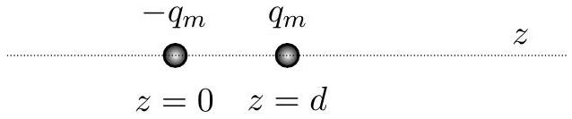
Assume that magnetic monopoles behave like electric monopoles according to a coulomb-like force
$$
F = \frac { \mu _ { 0 } } { 4 \pi } \frac { q _ { m 1 } q _ { m 2 } } { r ^ { 2 } }
$$
and the magnetic field obeys
$$
B = F / q _ { m } .
$$
i. What are the dimensions of the quantity $q _ { m }$ ?

## Solution

By the second expression, $q _ { m }$ must be measured in Newtons per Tesla. But since Tesla are also Newtons per Ampere per meter, then $q _ { m }$ is also measured in Ampere meters.

ii. Write an exact expression for the magnetic field strength $B ( z )$ along the $z$ axis as a function of $z$ for $z > d$. Write your answer in terms of $q _ { m } , d , z$, and any necessary fundamental constants.

## Solution

Adding the two terms,

$$
B ( z ) = - \frac { \mu _ { 0 } } { 4 \pi } \frac { q _ { m } } { z ^ { 2 } } + \frac { \mu _ { 0 } } { 4 \pi } \frac { q _ { m } } { ( z + d ) ^ { 2 } } .
$$

iii. Evaluate this expression in the limit as $d \rightarrow 0$, assuming that the product $q _ { m } d = p _ { m }$ is kept constant, keeping only the lowest non-zero term. Write your answer in terms of $p _ { m } , z$, and any necessary fundamental constants.

## Solution

Simplifying our previous expression,

$$
B ( z ) = \frac { \mu _ { 0 } } { 4 \pi } q _ { m } d \left( \frac { 2 + d / z } { z ( z + d ) ^ { 2 } } \right) .
$$

Thus in the limit $d \rightarrow 0$ we have

$$
B ( z ) = \frac { \mu _ { 0 } } { 2 \pi } \frac { q _ { m } d } { z ^ { 3 } } = \frac { \mu _ { 0 } } { 2 \pi } \frac { p _ { m } } { z ^ { 3 } } .
$$

b. An "Ampère" dipole is a magnetic dipole produced by a current loop $I$ around a circle of radius $r$, where $r$ is small. Assume the that the $z$ axis is the axis of rotational symmetry for the circular loop, and the loop lies in the $x y$ plane at $z = 0$.
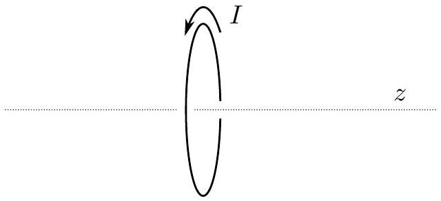
    i. Write an exact expression for the magnetic field strength $B ( z )$ along the $z$ axis as a function of $z$ for $z > 0$. Write your answer in terms of $I , r , z$, and any necessary fundamental constants.

## Solution

Applying the Biot-Savart law, with s the vector from the point on the loop to the point on the $z$ axis,

$$
B ( z ) = \frac { \mu _ { 0 } I } { 4 \pi } \oint \frac { d \mathbf { l } \times \mathbf { s } } { s ^ { 3 } } = \frac { \mu _ { 0 } I } { 4 \pi } \frac { 2 \pi r } { r ^ { 2 } + z ^ { 2 } } \sin \theta
$$

where $\theta$ is the angle between the point on the loop and the center of the loop as measured by the point on the $z$ axis, so

$$
\sin \theta = \frac { r } { \sqrt { r ^ { 2 } + z ^ { 2 } } } .
$$

Then we have

$$
B ( z ) = \frac { \mu _ { 0 } I } { 4 \pi } \frac { 2 \pi r ^ { 2 } } { \left( r ^ { 2 } + z ^ { 2 } \right) ^ { 3 / 2 } } .
$$

ii. Let $k I r ^ { \gamma }$ have dimensions equal to that of the quantity $p _ { m }$ defined above in Part aiii, where $k$ and $\gamma$ are dimensionless constants. Determine the value of $\gamma$.

## Solution

We know $p _ { m }$ must have dimensions of Amperes times meters squared, so $\gamma = 2$.

iii. Evaluate the expression in Part bi in the limit as $r \rightarrow 0$, assuming that the product $k I r ^ { \gamma } = p _ { m } ^ { \prime }$ is kept constant, keeping only the lowest non-zero term. Write your answer in terms of $k , p _ { m } ^ { \prime } , z$, and any necessary fundamental constants.

## Solution

Using our previous result,

$$
B ( z ) = \frac { \mu _ { 0 } I } { 4 \pi } \frac { 2 \pi r ^ { 2 } } { \left( r ^ { 2 } + z ^ { 2 } \right) ^ { 3 / 2 } } \approx \frac { \mu _ { 0 } I } { 2 \pi } \frac { \pi r ^ { 2 } } { z ^ { 3 } } = \frac { \mu _ { 0 } } { 2 \pi } \frac { \pi } { k } \frac { p _ { m } ^ { \prime } } { z ^ { 3 } }
$$

iv. Assuming that the two approaches are equivalent, $p _ { m } = p _ { m } ^ { \prime }$. Determine the constant $k$ in Part bii.

## Solution

By inspection, $k = \pi$.

c. Now we try to compare the two approaches if we model a physical magnet as being composed of densely packed microscopic dipoles.
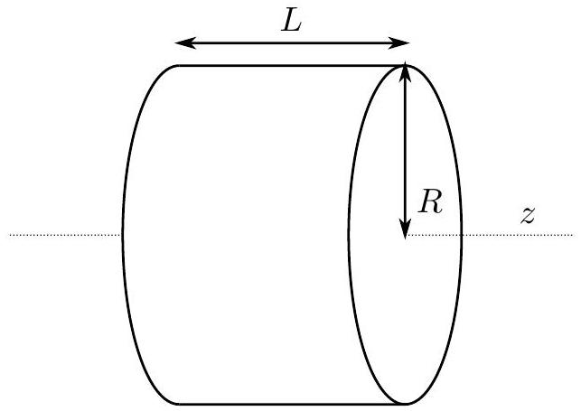
A cylinder of this uniform magnetic material has a radius $R$ and a length $L$. It is composed of $N$ magnetic dipoles that could be either all Ampère type or all Gilbert type. $N$ is a very large number. The axis of rotation of the cylinder and all of the dipoles are all aligned with the $z$ axis and all point in the same direction as defined above so that the magnetic field outside the cylinder is the same in either dipole case as you previously determined. Below is a picture of the two dipole models; they are cubes of side $d \ll R$ and $d \ll L$ with volume $v _ { m } = d ^ { 3 }$.

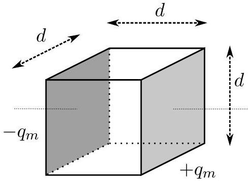
Gilbert Dipole

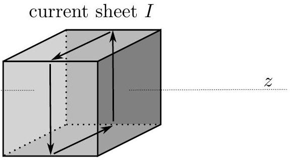
Ampère Dipole

i. Assume that $R \gg L$ and only Gilbert type dipoles, determine the magnitude and direction of $B$ at the center of the cylinder in terms of any or all of $p _ { m } , R , L , v _ { m }$, and any necessary fundamental constants.

## Solution

The monopoles that make up the dipoles cancel out except on the flat surfaces. Then the cylinder acts like a parallel plate capacitor.
If the size of a dipole is $d$, then the surface density of monopole charge is

$$
\sigma _ { m } = q _ { m } / d ^ { 2 } .
$$

Using the analogy with a parallel place capacitor, the magnitude of $B$ is

$$
B = \mu _ { 0 } \sigma _ { m } = \mu _ { 0 } \frac { p _ { m } } { d ^ { 3 } }
$$

and the direction is to the left.
ii. Assume that $R \ll L$ and only Ampère type dipoles, determine the magnitude and direction of $B$ at the center of the cylinder in terms of any or all of $p _ { m } , R , L , v _ { m }$, and any necessary fundamental constants.

## Solution

The currents that make up the dipoles all cancel out except on the cylindrical surfaces. Then the cylinder acts like a solenoid, with

$$
B = \frac { \mu _ { 0 } I } { d }
$$

where $I / d$ is the surface current density. The magnitude of $B$ is

$$
B = \frac { \mu _ { 0 } I } { d } = \mu _ { 0 } \frac { p _ { m } } { d ^ { 3 } }
$$

and the direction is to the right.

## Answer Sheets

Following are answer sheets for some of the graphical portions of the test.

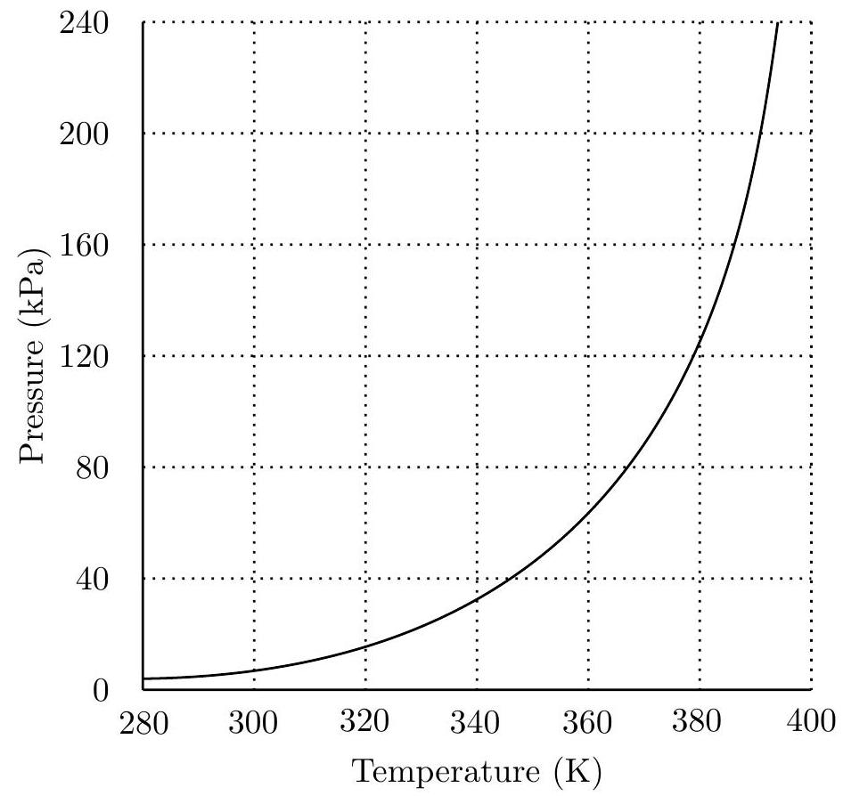
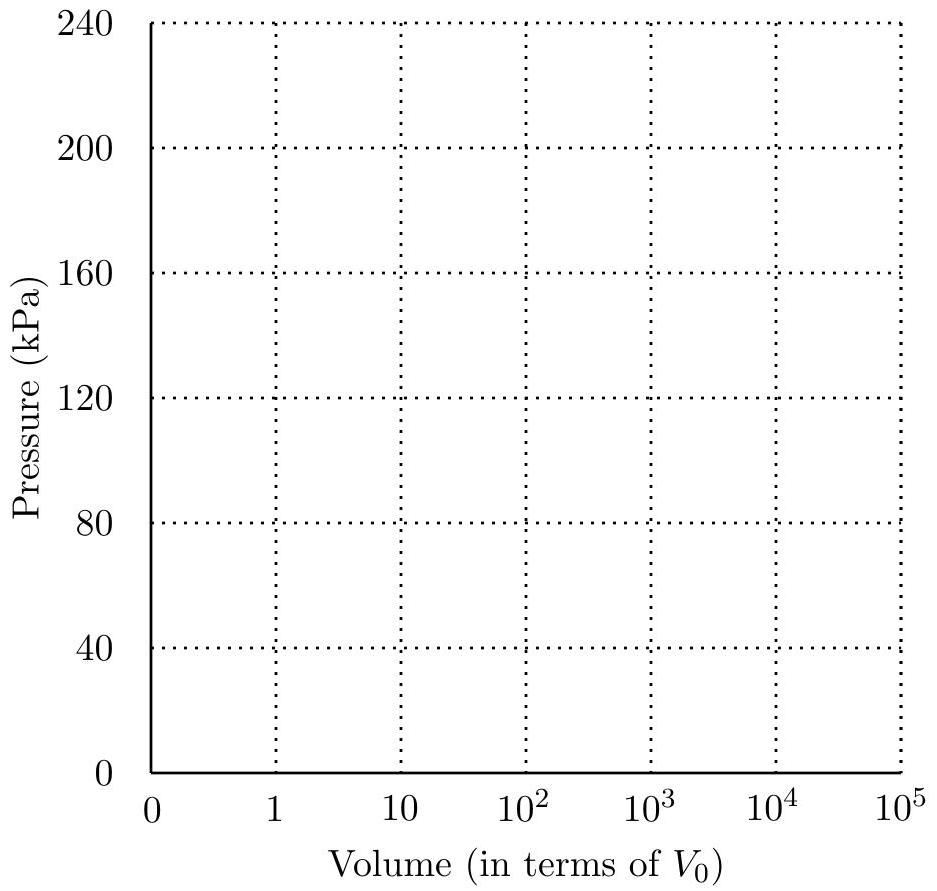
