## USA Physics Olympiad Exam

## DO NOT DISTRIBUTE THIS PAGE

## Important Instructions for the Exam Supervisor

- This examination consists of two parts: Part A has four questions and is allowed 90 minutes; Part B has two questions and is allowed 90 minutes.
- The first page that follows is a cover sheet. Examinees may keep the cover sheet for both parts of the exam.
- The parts are then identified by the center header on each page. Examinees are only allowed to do one part at a time, and may not work on other parts, even if they have time remaining.
- Allow 90 minutes to complete Part A. Do not let students look at Part B. Collect the answers to Part A before allowing the examinee to begin Part B. Examinees are allowed a 10 to 15 minutes break between parts A and B.
- Allow 90 minutes to complete Part B. Do not let students go back to Part A.
- Ideally the test supervisor will divide the question paper into 4 parts: the cover sheet (page 2), Part A (pages 3-12), Part B (pages 14-19), and several answer sheets for one of the questions in Part A (pages 21-22). Examinees should be provided parts A and B individually, although they may keep the cover sheet. The answer sheets should be printed single sided!
- The supervisor must collect all examination questions, including the cover sheet, at the end of the exam, as well as any scratch paper used by the examinees. Examinees may not take the exam questions. The examination questions may be returned to the students after April 15, 2016.
- Examinees are allowed calculators, but they may not use symbolic math, programming, or graphic features of these calculators. Calculators may not be shared and their memory must be cleared of data and programs. Cell phones, PDA's or cameras may not be used during the exam or while the exam papers are present. Examinees may not use any tables, books, or collections of formulas.

## USA Physics Olympiad Exam INSTRUCTIONS

## DO NOT OPEN THIS TEST UNTIL YOU ARE TOLD TO BEGIN

- Work Part A first. You have 90 minutes to complete all four problems. Each question is worth 25 points. Do not look at Part B during this time.
- After you have completed Part A you may take a break.
- Then work Part B. You have 90 minutes to complete both problems. Each question is worth 50 points. Do not look at Part A during this time.
- Show all your work. Partial credit will be given. Do not write on the back of any page. Do not write anything that you wish graded on the question sheets.
- Start each question on a new sheet of paper. Put your AAPT ID number, your name, the question number and the page number/total pages for this problem, in the upper right hand corner of each page. For example,

AAPT ID \#
Doe, Jamie
A1-1/3

- A hand-held calculator may be used. Its memory must be cleared of data and programs. You may use only the basic functions found on a simple scientific calculator. Calculators may not be shared. Cell phones, PDA's or cameras may not be used during the exam or while the exam papers are present. You may not use any tables, books, or collections of formulas.
- Questions with the same point value are not necessarily of the same difficulty.
- In order to maintain exam security, do not communicate any information about the questions (or their answers/solutions) on this contest until after April 15, 2016.

Possibly Useful Information. You may use this sheet for both parts of the exam.

$$
\begin{array} { l l }
g = 9.8 \mathrm {~N} / \mathrm { kg } & G = 6.67 \times 10 ^ { - 11 } \mathrm {~N} \cdot \mathrm {~m} ^ { 2 } / \mathrm { kg } ^ { 2 } \\
k = 1 / 4 \pi \epsilon _ { 0 } = 8.99 \times 10 ^ { 9 } \mathrm {~N} \cdot \mathrm {~m} ^ { 2 } / \mathrm { C } ^ { 2 } & k _ { \mathrm { m } } = \mu _ { 0 } / 4 \pi = 10 ^ { - 7 } \mathrm {~T} \cdot \mathrm {~m} / \mathrm { A } \\
c = 3.00 \times 10 ^ { 8 } \mathrm {~m} / \mathrm { s } & k _ { \mathrm { B } } = 1.38 \times 10 ^ { - 23 } \mathrm {~J} / \mathrm { K } \\
N _ { \mathrm { A } } = 6.02 \times 10 ^ { 23 } ( \mathrm {~mol} ) ^ { - 1 } & R = N _ { \mathrm { A } } k _ { \mathrm { B } } = 8.31 \mathrm {~J} / ( \mathrm { mol } \cdot \mathrm {~K} ) \\
\sigma = 5.67 \times 10 ^ { - 8 } \mathrm {~J} / \left( \mathrm { s } \cdot \mathrm {~m} ^ { 2 } \cdot \mathrm {~K} ^ { 4 } \right) & e = 1.602 \times 10 ^ { - 19 } \mathrm { C } \\
1 \mathrm { eV } = 1.602 \times 10 ^ { - 19 } \mathrm {~J} & h = 6.63 \times 10 ^ { - 34 } \mathrm {~J} \cdot \mathrm {~s} = 4.14 \times 10 ^ { - 15 } \mathrm { eV } \cdot \mathrm {~s} \\
m _ { e } = 9.109 \times 10 ^ { - 31 } \mathrm {~kg} = 0.511 \mathrm { MeV } / \mathrm { c } ^ { 2 } & ( 1 + x ) ^ { n } \approx 1 + n x \text { for } | x | \ll 1 \\
\sin \theta \approx \theta - \frac { 1 } { 6 } \theta ^ { 3 } \text { for } | \theta | \ll 1 & \cos \theta \approx 1 - \frac { 1 } { 2 } \theta ^ { 2 } \text { for } | \theta | \ll 1
\end{array}
$$

## Part A

Question A1
The Doppler effect for a source moving relative to a stationary observer is described by

$$
f = \frac { f _ { 0 } } { 1 - ( v / c ) \cos \theta }
$$

where $f$ is the frequency measured by the observer, $f _ { 0 }$ is the frequency emitted by the source, $v$ is the speed of the source, $c$ is the wave speed, and $\theta$ is the angle between the source velocity and the line between the source and observer. (Thus $\theta = 0$ when the source is moving directly towards the observer and $\theta = \pi$ when moving directly away.)

A sound source of constant frequency travels at a constant velocity past an observer, and the observed frequency is plotted as a function of time:
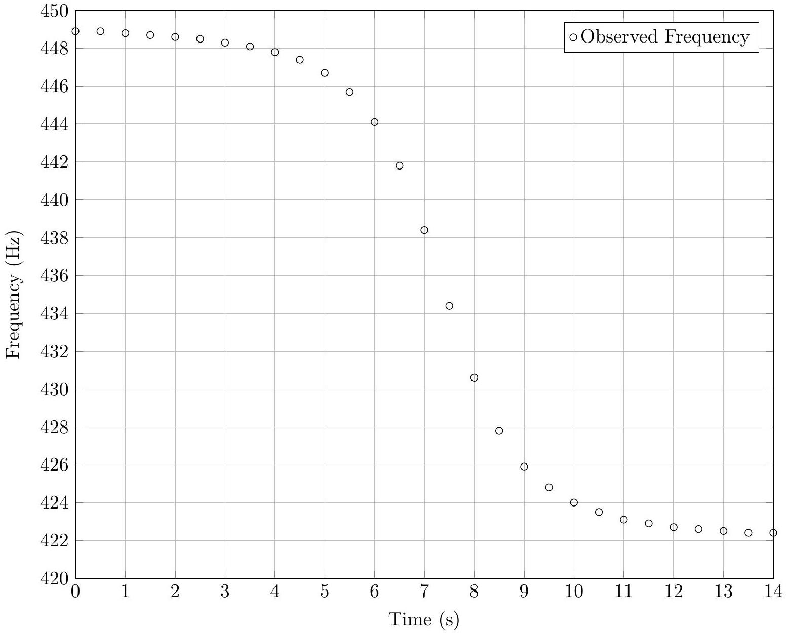

The experiment happens in room temperature air, so the speed of sound is 340 m/s.

a. What is the speed of the source?

## Solution

For $\theta = 0$ we have

$$
f _ { a } \approx f _ { 0 } / ( 1 - v / c )
$$

and for $\theta = \pi$,

$$
f _ { b } = f _ { 0 } / ( 1 + v / c ) .
$$

Read $f _ { a }$ and $f _ { b }$ off the early and late time portions of the graph and use

$$
f _ { a } / f _ { b } = ( 1 + v / c ) / ( 1 - v / c )
$$

giving an answer of $v = 10.7 \mathrm {~m} / \mathrm { s }$.
Alternatively, we can see that $v \ll c$ and approximate

$$
f _ { a } / f _ { b } \approx 1 + 2 v / c
$$

which makes the calculation of $v$ slightly faster. This is acceptable because the error terms are of order $( v / c ) ^ { 2 } \sim 0.1 \%$.
b. What is the smallest distance between the source and the observer?

## Solution

Let $d$ be the (fixed) distance between the observer and the path of the source; let $x$ be the displacement along the path, with $x = 0$ at closest approach. Then for $| x | \ll d$,

$$
\cos \theta \approx \cot \theta = x / d
$$

so we have

$$
f = f _ { 0 } / ( 1 - ( v / c ) ( x / d ) ) \approx f _ { 0 } ( 1 + ( v / c ) ( x / d ) ) .
$$

Taking the time derivative, and noting that $x ^ { \prime }$ is simply $v$,

$$
f ^ { \prime } = f _ { 0 } \left( v ^ { 2 } / c \right) d
$$

Therefore we can read $f ^ { \prime }$ off the center region of the graph. We still need to find $f _ { 0 }$, which we can do using our result from part (a) or simply by averaging $f _ { a }$ and $f _ { b }$, since $v \ll c$, giving $f _ { 0 } = 435 \mathrm {~Hz}$ and an answer of $d = 17.8 \mathrm {~m}$.
There's also a nice trick to speed up this computation. Draw lines at the asymptotic values and through the central data points. The two horizontal lines are $2 f _ { 0 } ( v / c )$ apart in frequency, so the time between their intersections with the third line is simply $2 d / v$.

## Question A2

A student designs a simple integrated circuit device that has two inputs, $V _ { a }$ and $V _ { b }$, and two outputs, $V _ { o }$ and $V _ { g }$. The inputs are effectively connected internally to a single resistor with effectively infinite resistance. The outputs are effectively connected internally to a perfect source of $\operatorname { emf } \mathcal { E }$. The integrated circuit is configured so that $\mathcal { E } = G \left( V _ { a } - V _ { b } \right)$, where $G$ is a very large number somewhere between $10 ^ { 7 }$ and $10 ^ { 9 }$. The circuits below are chosen so that the precise value of $G$ is unimportant. On the left is an internal schematic for the device; on the right is the symbol that is used in circuit diagrams.
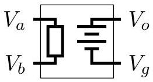
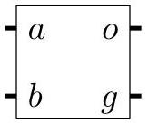

## Solution

The key idea is that if $\mathcal { E }$ is finite, then $V _ { a } \approx V _ { b }$, since $G$ is so large. If we work exactly, then the answers will contain terms like $\left( V _ { b } - V _ { a } \right) / G$ which are negligible. Thus we can find the same answers by just setting $V _ { a } = V _ { b }$.

a. Consider the following circuit. $R _ { 1 } = 8.2 k \Omega$ and $R _ { 2 } = 560 \Omega$ are two resistors. Terminal $g$ and the negative side of $V _ { \text {in } }$ are connected to ground, so both are at a potential of 0 volts. Determine the ratio $V _ { \text {out } } / V _ { \text {in } }$.
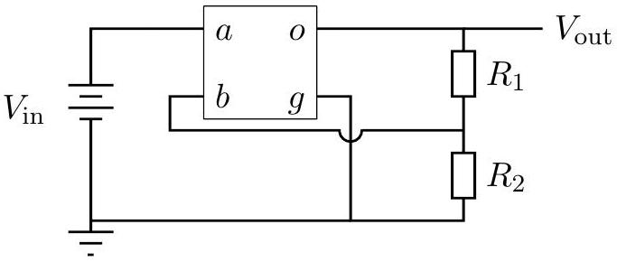

## Solution

For this first part, we will not assume $V _ { a } = V _ { b }$. Since terminal $g$ is grounded, $V _ { g } = 0$ and $V _ { a } = V _ { \text {in } }$, so $V _ { \text {out } } = G \left( V _ { \text {in } } - V _ { b } \right)$. No current runs between $a$ and $b$, so any current through $R _ { 1 }$ also flows through $R _ { 2 }$. Then Ohm's law gives

$$
\frac { V _ { b } } { R _ { 2 } } = \frac { V _ { \text {out } } } { R _ { 1 } + R _ { 2 } } \Rightarrow V _ { \text {out } } = G \left( V _ { \text {in } } - V _ { \text {out } } \frac { R _ { 2 } } { R _ { 1 } + R _ { 2 } } \right)
$$

and solving for $V _ { \text {out } }$ gives

$$
V _ { \text {out } } = V _ { \text {in } } \frac { 1 } { \frac { 1 } { G } + \frac { R _ { 2 } } { R _ { 1 } + R _ { 2 } } } .
$$

But since $G \gg R _ { 1 } / R _ { 2 }$, we can neglect the $1 / G$ term, giving

$$
\frac { V _ { \text {out } } } { V _ { \text {in } } } \approx \frac { R _ { 1 } + R _ { 2 } } { R _ { 2 } } .
$$

This circuit is an amplifier with feedback.

b. Consider the following circuit. All four resistors have identical resistance $R$. Determine $V _ { \text {out } }$ in terms of any or all of $V _ { 1 } , V _ { 2 }$, and $R$.
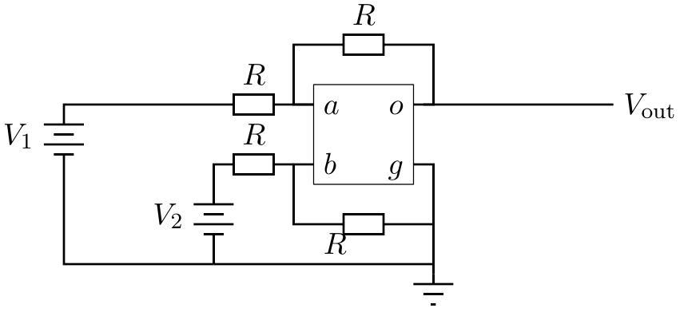

## Solution

For this part, we will assume $V _ { a } = V _ { b }$. Again $V _ { g } = 0$, and if current $I$ flows through the bottom resistor (below the $b$ and $g$ terminals) then $V _ { 2 } = 2 V _ { b }$, since the voltage drop across the bottom two resistors must be equal. Similarly, the voltage drop across the top two resistors is equal, so $V _ { 1 } + V _ { \text {out } } = 2 V _ { a }$. Then

$$
V _ { \text {out } } = 2 V _ { a } - V _ { 1 } = V _ { 2 } - V _ { 1 } .
$$

This circuit is a subtractor.

c. Consider the following circuit. The circuit has a capacitor $C$ and a resistor $R$ with time constant $R C = \tau$. The source on the left provides variable, but bounded voltage. Assume $V _ { \text {in } }$ is a function of time. Determine $V _ { \text {out } }$ as a function of $V _ { \text {in } }$, and any or all of time $t$ and $\tau$.
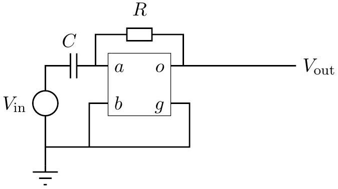

## Solution

We again set $V _ { a } = V _ { b } = 0$. Then the capacitor charge and current satisfy

$$
Q = C V _ { \text {in } } , \quad \dot { Q } = - \frac { V _ { \text {out } } } { R }
$$

where the second result follows from Ohm's law. Then

$$
\frac { V _ { \mathrm { out } } } { R } = - C \frac { d V _ { \mathrm { in } } } { d t } \quad \Rightarrow \quad V _ { \mathrm { out } } = - \tau \frac { d V _ { \mathrm { in } } } { d t } .
$$

This circuit is a differentiator.

## Question A3

Throughout this problem the inertial rest frame of the rod will be referred to as the rod's frame, while the inertial frame of the cylinder will be referred to as the cylinder's frame.

A rod is traveling at a constant speed of $v = \frac { 4 } { 5 } c$ to the right relative to a hollow cylinder. The rod passes through the cylinder, and then out the other side. The left end of the rod aligns with the left end of the cylinder at time $t = 0$ and $x = 0$ in the cylinder's frame and time $t ^ { \prime } = 0$ and $x ^ { \prime } = 0$ in the rod's frame.

The left end of the rod aligns with the left end of the cylinder at the same time as the right end of the rod aligns with the right end of the cylinder in the cylinder's frame; in this reference frame the length of the cylinder is 15 m.

For the following, sketch accurate, scale diagrams of the motions of the ends of the rod and the cylinder on the graphs provided. The horizontal axis corresponds to $x$, the vertical axis corresponds to $c t$, where $c$ is the speed of light. Both the vertical and horizontal gridlines have 5.0 meter spacing.

a. Sketch the world lines of the left end of the rod (RL), left end of the cylinder (CL), right end of the rod (RR), and right end of the cylinder (CR) in the cylinder's frame.
b. Do the same in the rod's frame.
c. On both diagrams clearly indicate the following four events by the letters A, B, C, and D.
A: The left end of the rod is at the same point as the left end of the cylinder
B: The right end of the rod is at the same point as the right end of the cylinder
C: The left end of the rod is at the same point as the right end of the cylinder
D: The right end of the rod is at the same point as the left end of the cylinder
d. At event B a small particle P is emitted that travels to the left at a constant speed $v _ { P } = \frac { 4 } { 5 } c$ in the cylinder's frame.
i. Sketch the world line of P in the cylinder's frame.
ii. Sketch the world line of P in the rod's frame.
e. Now consider the following in the cylinder's frame. The right end of the rod stops instantaneously at event B and emits a flash of light, and the left end of the rod stops instantaneously when the light reaches it. Determine the final length of the rod after it has stopped. You can assume the rod compresses uniformly with no other deformation.

Any computation that you do must be shown on a separate sheet of paper, and not on the graphs. Graphical work that does not have supporting computation might not receive full credit.

## Solution

The graphs are shown below, where the yellow line is the particle P and the green line is the flash of light. Solutions that used Galilean relativity received partial credit, as long as they were self-consistent. The final length of the rod is simply the distance between the line CR and the intersection of RL and the green line, i.e. 25/3 m. There's no need to apply length contraction, as we're already in the rest frame of the rod at this point. Nonetheless, the way we have chosen to stop the rod has squeezed it shorter.

The Cylinder's Frame
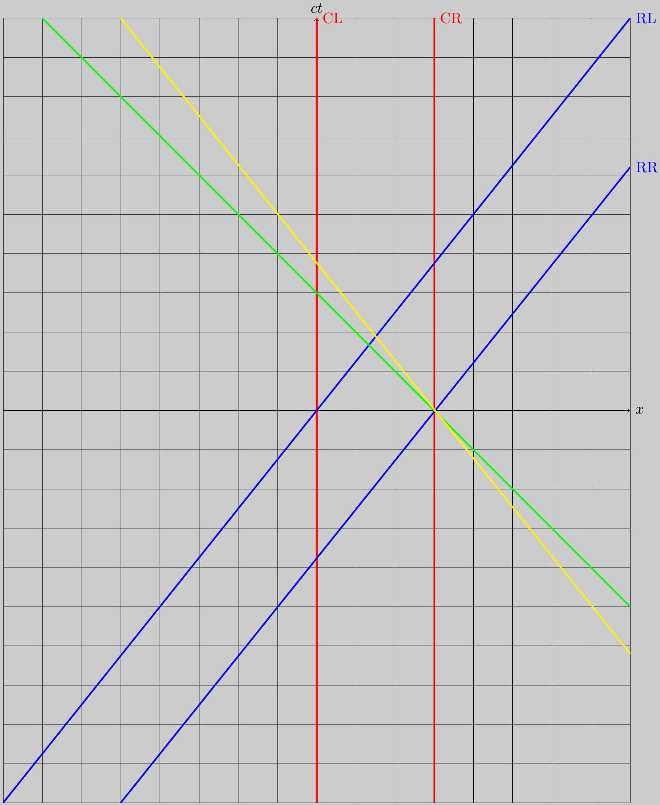

The Rod's Frame
$c t ^ { \prime }$
RL
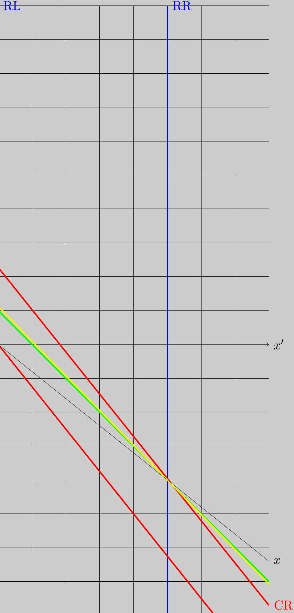

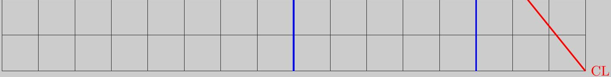

## Question A4

The flow of heat through a material can be described via the thermal conductivity $\kappa$. If the two faces of a slab of material with thermal conductivity $\kappa$, area $A$, and thickness $d$ are held at temperatures differing by $\Delta T$, the thermal power $P$ transferred through the slab is

$$
P = \frac { \kappa A \Delta T } { d }
$$

A large, flat lake in the upper Midwest has a uniform depth of 5.0 meters of water that is covered by a uniform layer of 1.0 cm of ice. Cold air has moved into the region so that the upper surface of the ice is now maintained at a constant temperature of -10 °C by the cold air (an infinitely large constant temperature heat sink). The bottom of the lake remains at a fixed 4.0 °C because of contact with the earth (an infinitely large constant temperature heat source). It is reasonable to assume that heat flow is only in the vertical direction and that there is no convective motion in the water.

a. Determine the initial rate of change in ice thickness.

## Solution

The main effect is that the ice radiates heat into the air due to the temperature gradient through it, and this freezes the water next to the ice. However, there are many other effects that slightly change the answer.

i. There is another contribution to the thermal power from the temperature gradient in the water.
ii. As the water freezes, it lifts the ice above it.
iii. When a layer of water freezes into ice, all of the other water and ice becomes slightly colder.

The first point should be addressed for full credit. To do this, we will calculate both contributions. The water right at the bottom of the ice is at $0 \mathrm { C } ^ { \circ }$. The temperature gradients in the water and ice are both uniform since the system is in quasi-equilibrium; physically, if the temperature gradient were not uniform, there would be a net flow of heat to or away from some regions, quickly making the gradient uniform again.
The temperature gradient in the water is $4 \mathrm { C } ^ { \circ } / 5 \mathrm {~m}$. Multiplying by the conductivity, we get a power of

$$
P _ { w } = \frac { 4 \mathrm { C } ^ { \circ } } { 5 \mathrm {~m} } \frac { 0.57 \mathrm {~W} } { \mathrm { mC } ^ { \circ } } = 0.456 \mathrm {~W} / \mathrm { m } ^ { 2 }
$$

delivered through the water. The same calculation for the ice gives power

$$
P _ { i } = \frac { 10 \mathrm { C } ^ { \circ } } { .01 \mathrm {~m} } \frac { 2.2 \mathrm {~W} } { \mathrm {~m} \cdot \mathrm { C } ^ { \circ } } = 2200 \mathrm {~W} / \mathrm { m } ^ { 2 }
$$

delivered through the ice. Thus $P _ { w }$ is negligible and can be ignored.
Now, each square meter of water directly underneath the ice loses 2200 J of energy per second. That is enough energy to freeze

$$
2200 \mathrm {~W} / ( 330,000 \mathrm {~J} / \mathrm { kg } ) = 6.7 \times 10 ^ { - 3 } \mathrm {~kg} / \mathrm { s }
$$

of water into ice. Converting to volume, we have

$$
\left( 6.7 \times 10 ^ { - 3 } \mathrm {~kg} / \mathrm { s } \right) / \left( 920 \mathrm {~kg} / \mathrm { m } ^ { 3 } \right) = 7.2 \times 10 ^ { - 6 } \mathrm {~m} ^ { 3 } / \mathrm { s }
$$

of ice formed for each square meter of ice, which means the ice is growing at a rate

$$
r = 7.2 \times 10 ^ { - 6 } \mathrm {~m} / \mathrm { s } = 2.6 \mathrm {~cm} / \mathrm { hr } .
$$

Next, we will account for the second and third points; these are not necessary for full credit. First consider the rising of the water. Each square meter of ice initially weighs 9.2 kg. A power of 2200 W is enough to lift this ice about $24 \mathrm {~m} / \mathrm { s }$ against gravity. In reality, the ice is lifted at a much slower rate, so this accounts for a negligible portion of the energy.
The third point requires some more explanation. In an appropriate coordinate system, the temperature profile of the ice is

$$
T ( x , d ) = \left( 1 - \frac { x } { d } \right) \delta T , \quad x \in [ 0 , d ]
$$

where $d$ is the thickness and $\delta T = - 10 \mathrm { C } ^ { \circ }$. As the thickness $d$ increases, all of the ice must decrease slightly in temperature to maintain a linear temperature gradient,

$$
\frac { \partial T } { \partial d } = \frac { x } { d ^ { 2 } } \delta T .
$$

By drawing a graph, one can see this contribution is equal to the heat that would be needed to cool the new ice formed by 5 C°, which gives a 3\% correction to the answer. There is also a similar contribution from cooling the water, which is negligible. Finally, we neglected the sublimation of the ice.

b. Assuming the air stays at the same temperature for a long time, find the equilibrium thickness of the ice.

## Solution

This part is independent of the previous part. For convenience, define $h _ { 0 }$ to be the depth of the lake if all the water were in liquid form. Accounting for the centimeter of ice, $h _ { 0 } = 5.01$ m to the number of significant digits we're using.

The ice will stop getting thicker when the energy flux through the water equals that through the ice,

$$
\frac { \Delta T _ { w } } { h _ { w } } \kappa _ { w } = \frac { \Delta T _ { i } } { h _ { i } } \kappa _ { i } .
$$

Since the thickness of the water is $h _ { w }$, the amount of water that has frozen into ice had a thickness of $h _ { 0 } - h _ { w }$. Setting the mass of water frozen equal to the mass of the ice,

$$
h _ { i } \rho _ { i } = \left( h _ { 0 } - h _ { w } \right) \rho _ { w } \quad \Rightarrow \quad h _ { w } = \frac { h _ { 0 } \rho _ { w } - h _ { i } \rho _ { i } } { \rho _ { w } } .
$$

Plugging this into the previous expression gives

$$
\frac { \Delta T _ { w } \kappa _ { w } \rho _ { w } } { h _ { 0 } \rho _ { w } - h _ { i } \rho _ { i } } = \frac { \Delta T _ { i } \kappa _ { i } } { h _ { i } } .
$$

Solving for $h _ { i }$ and plugging in numbers,

$$
h _ { i } = h _ { 0 } \frac { \Delta T _ { i } \kappa _ { i } \rho _ { w } } { \Delta T _ { w } \kappa _ { w } \rho _ { w } + \Delta T _ { i } \kappa _ { i } \rho _ { i } } = 4.89 \mathrm {~m} .
$$

c. Explain why convective motion can be ignored in the water.

## Solution

Convection occurs when boiling a pot of water because the hot water at the bottom of the pot has lower density than the colder water higher up. This means gravitational energy can be released when that hot, low-density water rises and cold, high-density water falls. When the hot water rises, it releases heat, cools, gets denser, and falls back down again, in a convection cycle. This phenomenon relies on the hotter water having lower density.
However, water reaches its maximum density at $4 \mathrm { C } ^ { \circ }$, so the water at the bottom of the lake, though warmer, is more dense than the water above it. Convection does not occur because moving the water around vertically would not release any gravitational potential energy.

Some important quantities for this problem:

| Specific heat capacity of water | $C _ { \text {water } }$ | $4200 \mathrm {~J} / \left( \mathrm { kg } \cdot \mathrm { C } ^ { \circ } \right)$ |
| :--- | :--- | :--- |
| Specific heat capacity of ice | $C _ { \text {ice } }$ | $2100 \mathrm {~J} / \left( \mathrm { kg } \cdot \mathrm { C } ^ { \circ } \right)$ |
| Thermal conductivity of water | $\kappa _ { \text {water } }$ | 0.57 W/(m • C°) |
| Thermal conductivity of ice | $\kappa _ { \text {ice } }$ | $2.2 \mathrm {~W} / \left( \mathrm { m } \cdot \mathrm { C } ^ { \circ } \right)$ |
| Latent heat of fusion for water | $L _ { \mathrm { f } }$ | $330,000 \mathrm {~J} / \mathrm { kg }$ |
| Density of water | $\rho _ { \text {water } }$ | $999 \mathrm {~kg} / \mathrm { m } ^ { 3 }$ |
| Density of ice | $\rho _ { \text {ice } }$ | $920 \mathrm {~kg} / \mathrm { m } ^ { 3 }$ |

## STOP: Do Not Continue to Part B

If there is still time remaining for Part A, you should review your work for Part A, but do not continue to Part B until instructed by your exam supervisor.

## Part B

## Question B1

A uniform solid spherical ball starts from rest on a loop-the-loop track. It rolls without slipping along the track. However, it does not have enough speed to make it to the top of the loop. From what height $h$ would the ball need to start in order to land at point P directly underneath the top of the loop? Express your answer in terms of $R$, the radius of the loop. Assume that the radius of the ball is very small compared to the radius of the loop, and that there are no energy losses due to friction.
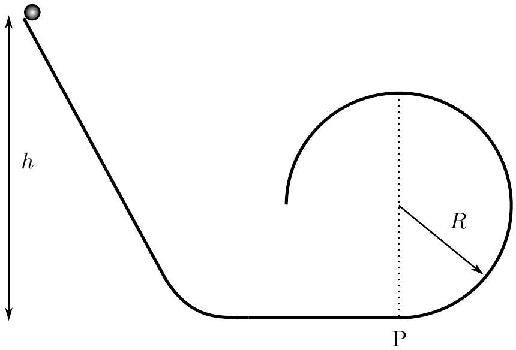

## Solution

We fix the origin at $P$. Assume the ball leaves at an angle $\theta$ away from the vertical. At this point, the $x$ and $y$ coordinates are

$$
x = R \sin \theta , \quad y = R ( 1 + \cos \theta ) .
$$

By energy conservation, we have

$$
m g ( h - y ) = \frac { 1 } { 2 } m v ^ { 2 } + \frac { 1 } { 2 } I \omega ^ { 2 } = \frac { 1 } { 2 } m ( 1 + \beta ) v ^ { 2 }
$$

where $\beta = 2 / 5$, and we used the fact that the ball rolls without slipping.
Let $v$ be the speed of the ball when it leaves the loop. Then its velocity components at that moment are

$$
v _ { x } = - v \cos \theta , \quad v _ { y } = v \sin \theta .
$$

Assuming the ball impacts $P$ at time $t$,

$$
y = \frac { 1 } { 2 } g t ^ { 2 } - v _ { y } t , \quad x = - v _ { x } t .
$$

The second equation yields

$$
t = \frac { R } { v } \frac { \sin \theta } { \cos \theta }
$$

and plugging this into the first equation gives

$$
R + R \cos \theta = \frac { 1 } { 2 } g \left( \frac { R } { v } \frac { \sin \theta } { \cos \theta } \right) ^ { 2 } - v \sin \theta \frac { R } { v } \frac { \sin \theta } { \cos \theta }
$$

which simplifies to

$$
1 + \cos \theta = \frac { g R } { 2 v ^ { 2 } } \frac { \sin ^ { 2 } \theta } { \cos \theta } .
$$

Now, the ball leaves the surface when the normal component of the force of the loop on the ball just drops to zero. This happens when

$$
m g \cos \theta = m \frac { v ^ { 2 } } { R } \quad \Rightarrow \quad \frac { v ^ { 2 } } { g R } = \cos \theta
$$

and plugging this into the previous equation gives

$$
1 + \cos \theta = \frac { 1 } { 2 } \frac { 1 - \cos ^ { 2 } \theta } { \cos ^ { 2 } \theta } \quad \Rightarrow \quad 2 \cos ^ { 2 } \theta = 1 - \cos \theta
$$

This is a quadratic equation with solutions

$$
\cos \theta = \frac { - 1 \pm \sqrt { 1 + 8 } } { 4 } = - \frac { 1 } { 4 } \pm \frac { 3 } { 4 }
$$

Only the positive answer of $\cos \theta = 1 / 2$ is relevant here, though the negative answer is still physical!
Now that we know $\theta$, getting the final answer is straightforward. We combine the energy conservation equation and the condition

$$
m g \cos \theta = m \frac { v ^ { 2 } } { R }
$$

to find

$$
h = 1 + \left( \frac { 1 } { 2 } ( 1 + \beta ) + 1 \right) R \cos \theta = \frac { 37 } { 20 } R .
$$

Question B2

a. A spherical region of space of radius $R$ has a uniform charge density and total charge $+ Q$. An electron of charge $- e$ is free to move inside or outside the sphere, under the influence of the charge density alone. For this first part ignore radiation effects.
    i. Consider a circular orbit for the electron where $r < R$. Determine the period of the orbit $T$ in terms of any or all of $r , R , Q , e$, and any necessary fundamental constants.

## Solution

We apply Gauss's law,

$$
\frac { Q _ { \text {in } } } { \epsilon _ { 0 } } = \oint \overrightarrow { \mathbf { E } } \cdot d \overrightarrow { \mathbf { A } } .
$$

This yields

$$
\frac { Q } { \epsilon _ { 0 } } \frac { r ^ { 3 } } { R ^ { 3 } } = 4 \pi r ^ { 2 } E \Rightarrow E = \frac { Q } { 4 \pi \epsilon _ { 0 } } \frac { r } { R ^ { 3 } }
$$

Since the motion is circular,

$$
m \frac { 4 \pi ^ { 2 } r } { T ^ { 2 } } = e E = \frac { e Q } { 4 \pi \epsilon _ { 0 } } \frac { r } { R ^ { 3 } }
$$

and solving for $T$ gives

$$
T = 2 \pi \sqrt { \frac { 4 \pi \epsilon _ { 0 } m R ^ { 3 } } { e Q } } .
$$

It is independent of $r$ since the motion is simple harmonic.

ii. Consider a circular orbit for the electron where $r > R$. Determine the period of the orbit $T$ in terms of any or all of $r , R , Q , e$, and any necessary fundamental constants.

## Solution

Applying Gauss's law as in the previous part gives

$$
E = \frac { Q } { 4 \pi \epsilon _ { 0 } } \frac { 1 } { r ^ { 2 } }
$$

as expected by the shell theorem; one could also just write this down directly. Using the same circular motion equation,

$$
m \frac { 4 \pi ^ { 2 } r } { T ^ { 2 } } = e \frac { e Q } { 4 \pi \epsilon _ { 0 } } \frac { 1 } { r ^ { 2 } }
$$

and solving for $T$ gives

$$
T = 2 \pi \sqrt { \frac { 4 \pi \epsilon _ { 0 } m r ^ { 3 } } { e Q } } .
$$

It is proportional to $r ^ { 3 / 2 }$ in accordance with Kepler's third law.

iii. Assume the electron starts at rest at $r = 2 R$. Determine the speed of the electron when it passes through the center in terms of any or all of $R , Q , e$, and any necessary fundamental constants.

## Solution

We use the above results to compute the potential difference,

$$
\begin{aligned}
\Delta V & = - \int _ { 2 R } ^ { 0 } \overrightarrow { \mathbf { E } } \cdot d \overrightarrow { \mathbf { s } } , \\
& = \int _ { 2 R } ^ { R } \frac { Q } { 4 \pi \epsilon _ { 0 } } \frac { 1 } { r ^ { 2 } } + \int _ { R } ^ { 0 } \frac { Q } { 4 \pi \epsilon _ { 0 } } \frac { r } { R ^ { 3 } } , \\
& = \frac { Q } { 4 \pi \epsilon _ { 0 } } \left( \frac { - 1 } { 2 R } - \frac { - 1 } { R } + \frac { R ^ { 2 } } { 2 R ^ { 3 } } \right) , \\
& = \frac { Q } { 4 \pi \epsilon _ { 0 } R } .
\end{aligned}
$$

By energy conservation,

$$
v = \sqrt { \frac { 2 } { m } e \Delta V } = \sqrt { \frac { 2 e Q } { 4 \pi \epsilon _ { 0 } m R } } .
$$

b. Accelerating charges radiate. The total power $P$ radiated by charge $q$ with acceleration $a$ is given by
$$
P = C \xi a ^ { n }
$$
where $C$ is a dimensionless numerical constant (which is equal to $1 / 6 \pi ) , \xi$ is a physical constant that is a function only of the charge $q$, the speed of light $c$, and the permittivity of free space $\epsilon _ { 0 }$, and $n$ is a dimensionless constant. Determine $\xi$ and $n$.

## Solution

This is a dimensional analysis problem. The most straightforward method is to write out all the dimensions explicitly. Note that $a$ has dimensions of $[ \mathrm { L } ] / [ \mathrm { T } ] ^ { 2 } , P$ has dimensions of $[ \mathrm { M } ] [ \mathrm { L } ] ^ { 2 } / [ \mathrm { T } ] ^ { 3 } , c$ has dimensions of [L]/[T], $q$ has dimensions of [C], and $\epsilon _ { 0 }$ has dimensions of $[ \mathrm { C } ] ^ { 2 } [ \mathrm {~T} ] ^ { 2 } / [ \mathrm { M } ] [ \mathrm { L } ] ^ { 3 }$. The equation

$$
P = a ^ { \alpha } c ^ { \beta } \epsilon _ { 0 } { } ^ { \gamma } q ^ { \delta }
$$

has dimensions

$$
[ \mathrm { M } ] [ \mathrm { L } ] ^ { 2 } / [ \mathrm { T } ] ^ { 3 } = \left( [ \mathrm { L } ] / [ \mathrm { T } ] ^ { 2 } \right) ^ { \alpha } ( [ \mathrm { L } ] / [ \mathrm { T } ] ) ^ { \beta } \left( [ \mathrm { C } ] ^ { 2 } [ \mathrm {~T} ] ^ { 2 } / [ \mathrm { M } ] [ \mathrm { L } ] ^ { 3 } \right) ^ { \gamma } ( [ \mathrm { C } ] ) ^ { \delta }
$$

Mass is only balanced if $\gamma = - 1$. As a result, charge is balanced if $\delta = 2$. Proceeding similarly for length and time,

$$
P = \frac { 1 } { 6 \pi } a ^ { 2 } c ^ { - 3 } \epsilon _ { 0 } ^ { - 1 } q ^ { 2 }
$$

giving answers of $\xi = q ^ { 2 } / c ^ { 3 } \epsilon _ { 0 }$ and $n = 2$.

c. Consider the electron in the first part, except now take into account radiation. Assume that the orbit remains circular and the orbital radius $r$ changes by an amount $| \Delta r | \ll r$.
    i. Consider a circular orbit for the electron where $r < R$. Determine the change in the orbital radius $\Delta r$ during one orbit in terms of any or all of $r , R , Q , e$ and any necessary fundamental constants. Be very specific about the sign of $\Delta r$.

## Solution

The energy radiated away is given by

$$
\Delta E = - P T
$$

where $T$ is determined in the previous sections.
It is possible to compute the actual energy of each orbit, and it is fairly trivial to do for regions $r > R$, but perhaps there is an easier, more entertaining way. Consider

$$
\Delta E = \Delta K + \Delta U
$$

and for small changes in $r$,

$$
\frac { \Delta U } { \Delta r } \approx - F = \frac { e Q } { 4 \pi \epsilon _ { 0 } } \frac { r } { R ^ { 3 } } .
$$

This implies the potential energy increases with increasing $r$, as expected. Now

$$
\frac { \Delta K } { \Delta r } \approx \frac { d } { d r } \left( \frac { 1 } { 2 } m v ^ { 2 } \right) = \frac { 1 } { 2 } \frac { d } { d r } \left| r \frac { m v ^ { 2 } } { r } \right|
$$

but $m v ^ { 2 } / r = F$, so

$$
\frac { \Delta K } { \Delta r } \approx \frac { 1 } { 2 } \frac { d } { d r } | r F | = \frac { e Q } { 4 \pi \epsilon _ { 0 } } \frac { r } { R ^ { 3 } } .
$$

This implies the kinetic energy increases with increasing $r$, also as expected, as this region acts like a multidimensional simple harmonic oscillator. Combining,

$$
\frac { \Delta E } { \Delta r } \approx 2 \frac { e Q } { 4 \pi \epsilon _ { 0 } } \frac { r } { R ^ { 3 } } = 2 m a
$$

Finally,

$$
\Delta r = - \left( \frac { 1 } { 6 \pi } \frac { a ^ { 2 } } { c ^ { 3 } \epsilon _ { 0 } } e ^ { 2 } \right) \left( 2 \pi \sqrt { \frac { 4 \pi \epsilon _ { 0 } m R ^ { 3 } } { e Q } } \right) \left( \frac { 1 } { 2 m a } \right) .
$$

Plugging in the value of $a$, this can be simplified to

$$
\Delta r = - \frac { 1 } { 6 } \sqrt { \frac { e ^ { 5 } Q } { 4 \pi \epsilon _ { 0 } { } ^ { 3 } R \left( m c ^ { 2 } \right) ^ { 3 } } } \frac { r } { R } .
$$

Alternatively, we can write the result in terms of dimensionless groups,

$$
\Delta r = - \frac { 2 \pi } { 3 } \left( \frac { e ^ { 2 } } { 4 \pi \epsilon _ { 0 } R m c ^ { 2 } } \right) \sqrt { \frac { e Q } { 4 \pi \epsilon _ { 0 } R m c ^ { 2 } } } r .
$$

ii. Consider a circular orbit for the electron where $r > R$. Determine the change in the orbital radius $\Delta r$ during one orbit in terms of any or all of $r , R , Q , e$ and any necessary fundamental constants. Be very specific about the sign of $\Delta r$.

## Solution

Picking up where we left off,

$$
\frac { \Delta U } { \Delta r } \approx - F = \frac { e Q } { 4 \pi \epsilon _ { 0 } } \frac { 1 } { r ^ { 2 } } .
$$

This implies the potential energy increases with increasing $r$.

$$
\frac { \Delta K } { \Delta r } \approx \frac { 1 } { 2 } \frac { d } { d r } | r F | = \frac { \Delta K } { \Delta r } \approx - \frac { e Q } { 8 \pi \epsilon _ { 0 } } \frac { 1 } { r ^ { 2 } } .
$$

This implies the kinetic energy decreases with increasing $r$, a somewhat nonintuitive but true statement for circular orbits. Combining,

$$
\frac { \Delta E } { \Delta r } \approx \frac { 1 } { 2 } \frac { e Q } { 4 \pi \epsilon _ { 0 } } \frac { r } { R ^ { 3 } } = \frac { m a } { 2 } .
$$

Using the same manipulations as before,

$$
\Delta r = - \left( \frac { 1 } { 6 \pi } \frac { a ^ { 2 } } { c ^ { 3 } \epsilon _ { 0 } } e ^ { 2 } \right) \left( 2 \pi \sqrt { \frac { 4 \pi \epsilon _ { 0 } m r ^ { 3 } } { e Q } } \right) \left( \frac { 2 } { m a } \right) .
$$

Plugging in the value of $a$, this can be simplified to

$$
\Delta r = - \frac { 2 } { 3 } \sqrt { \frac { e ^ { 5 } Q } { 4 \pi \epsilon _ { 0 } ^ { 3 } r \left( m c ^ { 2 } \right) ^ { 3 } } } .
$$

Alternatively, we can write the result in terms of dimensionless groups,

$$
\Delta r = - \frac { 8 \pi } { 3 } \left( \frac { e ^ { 2 } } { 4 \pi \epsilon _ { 0 } R m c ^ { 2 } } \right) \sqrt { \frac { e Q } { 4 \pi \epsilon _ { 0 } R m c ^ { 2 } } } \frac { R ^ { 2 } } { r } .
$$

## Answer Sheets

Following are answer sheets for some of the graphical portions of the test.

The Cylinder's Frame
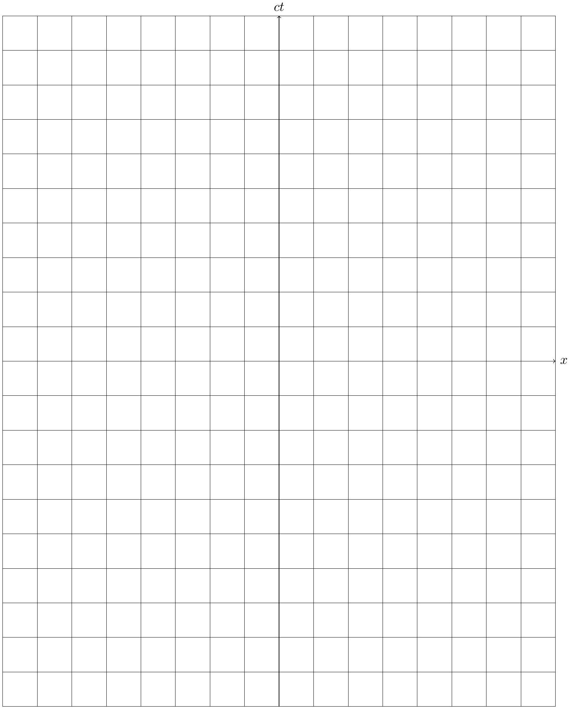

The Rod's Frame ct'
|  |  |  |  |  |  |  |  |  |  |  |  |  |  |  |  |
| :--- | :--- | :--- | :--- | :--- | :--- | :--- | :--- | :--- | :--- | :--- | :--- | :--- | :--- | :--- | :--- |
|  |  |  |  |  |  |  |  |  |  |  |  |  |  |  |  |
|  |  |  |  |  |  |  |  |  |  |  |  |  |  |  |  |
|  |  |  |  |  |  |  |  |  |  |  |  |  |  |  |  |
|  |  |  |  |  |  |  |  |  |  |  |  |  |  |  |  |
|  |  |  |  |  |  |  |  |  |  |  |  |  |  |  |  |
|  |  |  |  |  |  |  |  |  |  |  |  |  |  |  |  |
|  |  |  |  |  |  |  |  |  |  |  |  |  |  |  |  |
|  |  |  |  |  |  |  |  |  |  |  |  |  |  |  |  |
|  |  |  |  |  |  |  |  |  |  |  |  |  |  |  |  |
|  |  |  |  |  |  |  |  |  |  |  |  |  |  |  |  |
|  |  |  |  |  |  |  |  |  |  |  |  |  |  |  |  |
|  |  |  |  |  |  |  |  |  |  |  |  |  |  |  |  |
|  |  |  |  |  |  |  |  |  |  |  |  |  |  |  |  |
|  |  |  |  |  |  |  |  |  |  |  |  |  |  |  |  |
|  |  |  |  |  |  |  |  |  |  |  |  |  |  |  |  |
|  |  |  |  |  |  |  |  |  |  |  |  |  |  |  |  |
|  |  |  |  |  |  |  |  |  |  |  |  |  |  |  |  |
|  |  |  |  |  |  |  |  |  |  |  |  |  |  |  |  |
|  |  |  |  |  |  |  |  |  |  |  |  |  |  |  |  |
