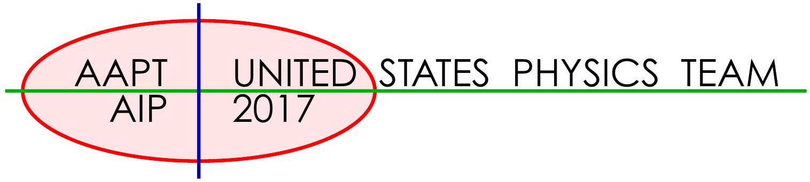

## USA Physics Olympiad Exam

## DO NOT DISTRIBUTE THIS PAGE

## Important Instructions for the Exam Supervisor

- This examination consists of two parts: Part A has four questions and is allowed 90 minutes; Part B has two questions and is allowed 90 minutes.
- The first page that follows is a cover sheet. Examinees may keep the cover sheet for both parts of the exam.
- The parts are then identified by the center header on each page. Examinees are only allowed to do one part at a time, and may not work on other parts, even if they have time remaining.
- Allow 90 minutes to complete Part A. Do not let students look at Part B. Collect the answers to Part A before allowing the examinee to begin Part B. Examinees are allowed a 10 to 15 minutes break between parts A and B.
- Allow 90 minutes to complete Part B. Do not let students go back to Part A.
- Ideally the test supervisor will divide the question paper into 3 parts: the cover sheet (page 2), Part A (pages 3-13), Part B (pages 15-23). Examinees should be provided parts A and B individually, although they may keep the cover sheet. The answer sheets should be printed single sided!
- The supervisor must collect all examination questions, including the cover sheet, at the end of the exam, as well as any scratch paper used by the examinees. Examinees may not take the exam questions. The examination questions may be returned to the students after April 15, 2017.
- Examinees are allowed calculators, but they may not use symbolic math, programming, or graphic features of these calculators. Calculators may not be shared and their memory must be cleared of data and programs. Cell phones, PDA's or cameras may not be used during the exam or while the exam papers are present. Examinees may not use any tables, books, or collections of formulas.

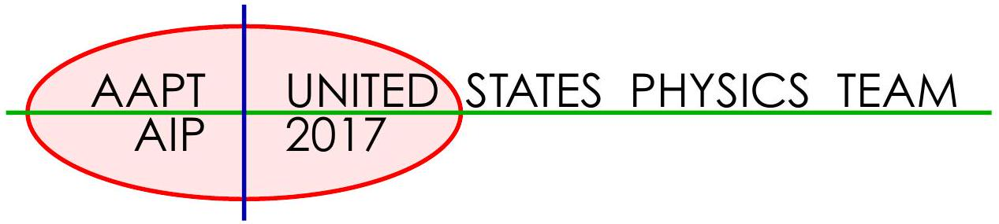

## USA Physics Olympiad Exam   INSTRUCTIONS

## DO NOT OPEN THIS TEST UNTIL YOU ARE TOLD TO BEGIN

- Work Part A first. You have 90 minutes to complete all four problems. Each question is worth 25 points. Do not look at Part B during this time.
- After you have completed Part A you may take a break.
- Then work Part B. You have 90 minutes to complete both problems. Each question is worth 50 points. Do not look at Part A during this time.
- Show all your work. Partial credit will be given. Do not write on the back of any page. Do not write anything that you wish graded on the question sheets.
- Start each question on a new sheet of paper. Put your proctor's AAPT ID, your AAPT ID, your name, the question number and the page number/total pages for this problem, in the upper right hand corner of each page. For example,
Doe, Jamie
student AAPT ID \#
proctor AAPT ID \#
A1-1/3
- A hand-held calculator may be used. Its memory must be cleared of data and programs. You may use only the basic functions found on a simple scientific calculator. Calculators may not be shared. Cell phones, PDA's or cameras may not be used during the exam or while the exam papers are present. You may not use any tables, books, or collections of formulas.
- Questions with the same point value are not necessarily of the same difficulty.
- In order to maintain exam security, do not communicate any information about the questions (or their answers/solutions) on this contest until after April 8, 2017.

Possibly Useful Information. You may use this sheet for both parts of the exam.

$$
\begin{array} { l l }
g = 9.8 \mathrm {~N} / \mathrm { kg } & G = 6.67 \times 10 ^ { - 11 } \mathrm {~N} \cdot \mathrm {~m} ^ { 2 } / \mathrm { kg } ^ { 2 } \\
k = 1 / 4 \pi \epsilon _ { 0 } = 8.99 \times 10 ^ { 9 } \mathrm {~N} \cdot \mathrm {~m} ^ { 2 } / \mathrm { C } ^ { 2 } & k _ { \mathrm { m } } = \mu _ { 0 } / 4 \pi = 10 ^ { - 7 } \mathrm {~T} \cdot \mathrm {~m} / \mathrm { A } \\
c = 3.00 \times 10 ^ { 8 } \mathrm {~m} / \mathrm { s } & k _ { \mathrm { B } } = 1.38 \times 10 ^ { - 23 } \mathrm {~J} / \mathrm { K } \\
N _ { \mathrm { A } } = 6.02 \times 10 ^ { 23 } ( \mathrm {~mol} ) ^ { - 1 } & R = N _ { \mathrm { A } } k _ { \mathrm { B } } = 8.31 \mathrm {~J} / ( \mathrm { mol } \cdot \mathrm {~K} ) \\
\sigma = 5.67 \times 10 ^ { - 8 } \mathrm {~J} / \left( \mathrm { s } \cdot \mathrm {~m} ^ { 2 } \cdot \mathrm {~K} ^ { 4 } \right) & e = 1.602 \times 10 ^ { - 19 } \mathrm { C } \\
1 \mathrm { eV } = 1.602 \times 10 ^ { - 19 } \mathrm {~J} & h = 6.63 \times 10 ^ { - 34 } \mathrm {~J} \cdot \mathrm {~s} = 4.14 \times 10 ^ { - 15 } \mathrm { eV } \cdot \mathrm {~s} \\
m _ { e } = 9.109 \times 10 ^ { - 31 } \mathrm {~kg} = 0.511 \mathrm { MeV } / \mathrm { c } ^ { 2 } & ( 1 + x ) ^ { n } \approx 1 + n x \text { for } | x | \ll 1 \\
m _ { p } = 1.673 \times 10 ^ { - 27 } \mathrm {~kg} = 938 \mathrm { MeV } / \mathrm { c } ^ { 2 } & \ln ( 1 + x ) \approx x \text { for } | x | \ll 1 \\
\sin \theta \approx \theta - \frac { 1 } { 6 } \theta ^ { 3 } \text { for } | \theta | \ll 1 & \cos \theta \approx 1 - \frac { 1 } { 2 } \theta ^ { 2 } \text { for } | \theta | \ll 1
\end{array}
$$

Copyright ©2017 American Association of Physics Teachers

## Part A

## Question A1

A pair of wedges are located on a horizontal surface. The coefficient of friction (both sliding and static) between the wedges is $\mu$, the coefficient of friction between the bottom wedge B and the horizontal surface is $\mu$, and the angle of the wedge is $\theta$. The mass of the top wedge A is $m$, and the mass of the bottom wedge B is $M = 2 m$. A horizontal force $F$ directed to the left is applied to the bottom wedge as shown in the figure.
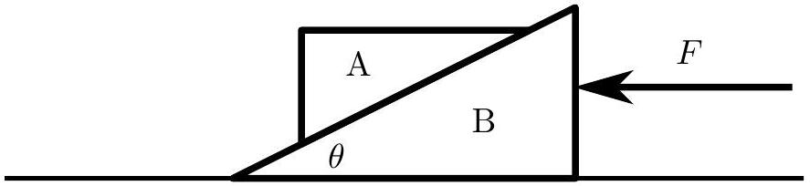

Determine the range of values for $F$ so that the the top wedge does not slip on the bottom wedge. Express your answer(s) in terms of any or all of $m , g , \theta$, and $\mu$.

## Solution

Solution 1. Assume the block does not slip. Considering the horizontal forces on the entire system gives

$$
F - 3 \mu m g = 3 m a \quad \Rightarrow \quad a = \frac { F } { 3 m } - \mu g .
$$

When $F$ is small, the top wedge wants to slide downward, so static friction points up the ramp. Considering the horizontal and vertical forces on the block gives

$$
N \cos \theta + f \sin \theta = m g , \quad N \sin \theta - f \cos \theta = m a .
$$

When the minimal force is applied, the friction is maximal, $f = \mu N$. Eliminating $N$ gives

$$
m a = m g \frac { \sin \theta - \mu \cos \theta } { \cos \theta + \mu \sin \theta }
$$

and plugging in our first equation gives

$$
F _ { \min } = 3 m g \left( \mu + \frac { \sin \theta - \mu \cos \theta } { \cos \theta + \mu \sin \theta } \right) = 3 m g \frac { \left( 1 + \mu ^ { 2 } \right) \tan \theta } { 1 + \mu \tan \theta } .
$$

When $F$ is large, the top wedge wants to slide upward, so static friction points down the ramp, and

$$
N \cos \theta - f \sin \theta = m g , \quad N \sin \theta + f \cos \theta = m a .
$$

Now setting $f = \mu N$ gives

$$
F _ { \max } = 3 m g \left( \mu + \frac { \sin \theta + \mu \cos \theta } { \cos \theta - \mu \sin \theta } \right) = 3 m g \frac { 2 \mu + \left( 1 - \mu ^ { 2 } \right) \tan \theta } { 1 - \mu \tan \theta } .
$$

Therefore, naively the range of forces so that the block will not slip is

$$
F \in \left[ F _ { \min } , F _ { \max } \right] .
$$

However, to get full credit, students must account for two edge cases. First, when $\mu > \tan \theta$, no force is required at all to keep the block in place, so the minimum force is zero. Second, when $\mu > \cot \theta$, the block will not slip up under any circumstances, so there is no maximal force.

Solution 2. The problem can also be solved geometrically. In general, the no slip condition is

$$
\mu > \tan \phi
$$

where $\phi$ is the angle between the vertical and the normal to the plane. Working in the noninertial reference frame of the plane, the fictitious force due to the acceleration is equivalent to a tilting of the gravity vector by an angle

$$
\tan \beta = \frac { a } { g }
$$

where, as in solution 1,

$$
a = \frac { F } { 3 m } - \mu g .
$$

Then the top block will not slip as long as $| \theta - \beta | \leq \phi$. At the minimum acceleration $a _ { \min } , \beta = \theta - \phi$, and taking the tangent of both sides gives

$$
\frac { a _ { \min } } { g } = \frac { \tan \theta - \mu } { 1 + \mu \tan \theta } .
$$

This is only meaningful for $\tan \theta > \mu$, otherwise the answer is simply $a _ { \text {min } } = 0$. At the maximum acceleration $a _ { \text {max } } , \beta = \theta + \phi$, which gives

$$
\frac { a _ { \max } } { g } = \frac { \tan \theta + \mu } { 1 - \mu \tan \theta } .
$$

This is only meaningful for $\cot \theta > \mu$, otherwise the answer is simply $a _ { \max } = \infty$.

## Question A2

Consider two objects with equal heat capacities $C$ and initial temperatures $T _ { 1 }$ and $T _ { 2 }$. A Carnot engine is run using these objects as its hot and cold reservoirs until they are at equal temperatures. Assume that the temperature changes of both the hot and cold reservoirs is very small compared to the temperature during any one cycle of the Carnot engine.

a. Find the final temperature $T _ { f }$ of the two objects, and the total work $W$ done by the engine.

## Solution

Since a Carnot engine is reversible, it produces no entropy,

$$
d S _ { 1 } + d S _ { 2 } = \frac { d Q _ { 1 } } { T _ { 1 } } + \frac { d Q _ { 2 } } { T _ { 2 } } = 0
$$

By the definition of heat capacity, $d Q _ { i } = C d T _ { i }$, so

$$
\frac { d T _ { 1 } } { T _ { 1 } } = - \frac { d T _ { 2 } } { T _ { 2 } } .
$$

Integrating this equation shows that $T _ { 1 } T _ { 2 }$ is constant, so the final temperature is

$$
T _ { f } = \sqrt { T _ { 1 } T _ { 2 } } .
$$

The change in thermal energy of the objects is

$$
C \left( T _ { f } - T _ { 1 } \right) + C \left( T _ { f } - T _ { 2 } \right) = C \left[ 2 \sqrt { T _ { 1 } T _ { 2 } } - T _ { 1 } - T _ { 2 } \right] .
$$

By the First Law of Thermodynamics, the missing energy has been used to do work, so

$$
W = C \left[ T _ { 1 } + T _ { 2 } - 2 \sqrt { T _ { 1 } T _ { 2 } } \right] .
$$

Now consider three objects with equal and constant heat capacity at initial temperatures $T _ { 1 } = 100 \mathrm {~K} , T _ { 2 } = 300 \mathrm {~K}$, and $T _ { 3 } = 300 \mathrm {~K}$. Suppose we wish to raise the temperature of the third object.

To do this, we could run a Carnot engine between the first and second objects, extracting work $W$. This work can then be dissipated as heat to raise the temperature of the third object. Even better, it can be stored and used to run a Carnot engine between the first and third object in reverse, which pumps heat into the third object.

Assume that all work produced by running engines can be stored and used without dissipation.

b. Find the minimum temperature $T _ { L }$ to which the first object can be lowered.

## Solution

By the Second Law of Thermodynamics, we must have $T _ { L } = 100 \mathrm {~K}$. Otherwise, we would have a process whose sole effect was a net transfer of heat from a cold body to a warm one.

c. Find the maximum temperature $T _ { H }$ to which the third object can be raised.

## Solution

The entropy of an object with constant heat capacity is

$$
S = \int \frac { d Q } { T } = C \int \frac { d T } { T } = C \ln T
$$

Since the total entropy remains constant, $T _ { 1 } T _ { 2 } T _ { 3 }$ is constant; this is a direct generalization of the result for $T _ { f }$ found in part (a). Energy is also conserved, as it makes no sense to leave stored energy unused, so $T _ { 1 } + T _ { 2 } + T _ { 3 }$ is constant.

When one object is at temperature $T _ { H }$, the other two must be at the same lower temperature $T _ { 0 }$, or else further work could be extracted from their temperature difference, so

$$
T _ { 1 } + T _ { 2 } + T _ { 3 } = T _ { H } + 2 T _ { 0 } , \quad T _ { 1 } T _ { 2 } T _ { 3 } = T _ { H } T _ { 0 } ^ { 2 } .
$$

Plugging in temperatures with values divided by 100 for convenience, and eliminating $T _ { 0 }$ gives

$$
T _ { H } \left( 7 - T _ { H } \right) ^ { 2 } = 36 .
$$

We know that $T _ { H } = 1$ is one (spurious) solution, since this is the minimum possible final temperature as found in part (b). The other roots are $T _ { H } = 4$ and $T _ { H } = 9$ by the quadratic formula. The solution $T _ { H } = 9$ is impossible by energy conservation, so

$$
T _ { H } = 400 \mathrm {~K} .
$$

It is also possible to solve the problem more explicitly. For example, one can run a Carnot cycle between the first two objects until they are at the same temperature, then run a Carnot cycle in reverse between the last two objects using the stored work. At this point, the first two objects will no longer be at the same temperature, so we can repeat the procedure; this yields an infinite series for $T _ { H }$. Some students did this, and took only the first term of the series. This yields a fairly good approximation of $T _ { H } \approx 395 \mathrm {~K}$.
Another explicit method is to continuously switch between running one Carnot engine forward and another Carnot engine in reverse; this yields three differential equations for $T _ { 1 } , T _ { 2 }$, and $T _ { 3 }$. Solving the equations and setting $T _ { 1 } = T _ { 2 }$ yields $T _ { 3 } = T _ { H }$.

## Question A3

A ship can be thought of as a symmetric arrangement of soft iron. In the presence of an external magnetic field, the soft iron will become magnetized, creating a second, weaker magnetic field. We want to examine the effect of the ship's field on the ship's compass, which will be located in the middle of the ship.

Let the strength of the Earth's magnetic field near the ship be $B _ { e }$, and the orientation of the field be horizontal, pointing directly toward true north.

The Earth's magnetic field $B _ { e }$ will magnetize the ship, which will then create a second magnetic field $B _ { s }$ in the vicinity of the ship's compass given by

$$
\overrightarrow { \mathbf { B } } _ { s } = B _ { e } \left( - K _ { b } \cos \theta \hat { \mathbf { b } } + K _ { s } \sin \theta \hat { \mathbf { s } } \right)
$$

where $K _ { b }$ and $K _ { s }$ are positive constants, $\theta$ is the angle between the heading of the ship and magnetic north, measured clockwise, $\hat { \mathbf { b } }$ and $\hat { \mathbf { s } }$ are unit vectors pointing in the forward direction of the ship (bow) and directly right of the forward direction (starboard), respectively.

Because of the ship's magnetic field, the ship's compass will no longer necessarily point North.

a. Derive an expression for the deviation of the compass, $\delta \theta$, from north as a function of $K _ { b }$, $K _ { s }$, and $\theta$.

## Solution

We add the fields to get the local field. The northward component is

$$
B _ { \text {north } } = B _ { e } - B _ { e } K _ { b } \cos \theta \cos \theta - B _ { e } K _ { s } \sin \theta \sin \theta
$$

while the eastward component is

$$
B _ { \text {east } } = - B _ { e } K _ { b } \sin \theta \cos \theta + B _ { e } K _ { s } \cos \theta \sin \theta
$$

The deviation is given by

$$
\tan \delta \theta = \left( K _ { s } - K _ { b } \right) \frac { \sin \theta \cos \theta } { 1 - K _ { b } \cos ^ { 2 } \theta - K _ { s } \sin ^ { 2 } \theta } .
$$

This form is particularly nice, because as we'll see below, $K _ { b }$ and $K _ { s }$ are small enough to ignore in the denominator.

b. Assuming that $K _ { b }$ and $K _ { s }$ are both much smaller than one, at what heading(s) $\theta$ will the deviation $\delta \theta$ be largest?

## Solution

By inspection, $\theta = 45 ^ { \circ }$ will yield the largest deviation. It's also acceptable to list 45°, 135°, $225 ^ { \circ }$, and $315 ^ { \circ }$.

A pair of iron balls placed in the same horizontal plane as the compass but a distance $d$ away can be used to help correct for the error caused by the induced magnetism of the ship.

A binnacle, protecting the ship's compass in the center, with two soft iron spheres to help correct for errors in the compass heading. The use of the spheres was suggested by Lord Kelvin.

Just like the ship, the iron balls will become magnetic because of the Earth's field $B _ { e }$. As spheres, the balls will individually act like dipoles. A dipole can be thought of as the field produced by two magnetic monopoles of strength $\pm m$ at two different points.

The magnetic field of a single pole is

$$
\overrightarrow { \mathbf { B } } = \pm m \frac { \hat { \mathbf { r } } } { r ^ { 2 } }
$$

where the positive sign is for a north pole and the negative for a south pole. The dipole magnetic field is the sum of the two fields: a north pole at $y = + a / 2$ and a south pole at $y = - a / 2$, where the $y$ axis is horizontal and pointing north. $a$ is a small distance much smaller than the radius of the iron balls; in general $a = K _ { i } B _ { e }$ where $K _ { i }$ is a constant that depends on the size of the iron sphere.
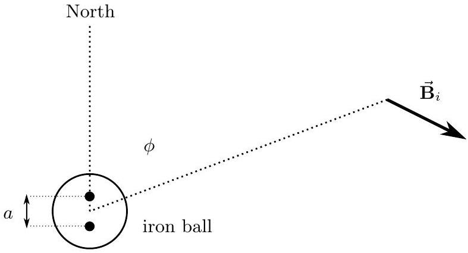

c. Derive an expression for the magnetic field $\overrightarrow { \mathbf { B } } _ { i }$ from the iron a distance $d \gg a$ from the center of the ball. Note that there will be a component directed radially away from the ball and a Copyright ©2017 American Association of Physics Teachers

component directed tangent to a circle of radius $d$ around the ball, so using polar coordinates is recommended.

## Solution

This problem is not nearly as difficult as it looks.
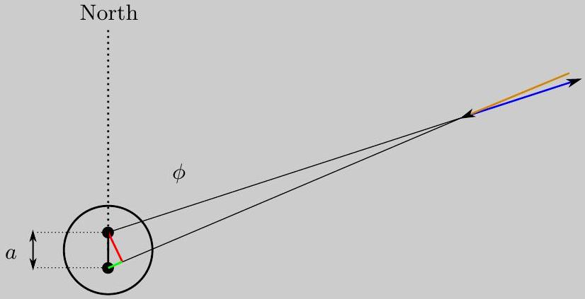
Consider the colored triangle above. The black side has length $a$. The angle between the green and black sides is $\phi$, so the length of the red side is $a \sin \phi$ and the length of the green side is $a \cos \phi$.

The magnetic field strength from one magnetic pole a distance $d$ away is given by

$$
B = \pm m \frac { 1 } { d ^ { 2 } }
$$

The sum of the two fields has two components. The angular component is a measure of the "opening" of the triangle formed by the two vectors, and since the two vectors basically have the same length, we can use similar triangles to conclude

$$
\frac { a \sin \phi } { d } \approx \frac { B _ { \phi } } { B } \Rightarrow B _ { \phi } = m \frac { a } { d ^ { 3 } } \sin \phi = B _ { e } \frac { m K _ { i } } { d ^ { 3 } } \sin \phi .
$$

As expected, this component vanishes for $\phi = 0$.
The radial component is given by the difference in the lengths of the two field vectors, or

$$
B _ { r } = m \left( \frac { 1 } { d ^ { 2 } } - \frac { 1 } { ( d + x ) ^ { 2 } } \right) = \frac { m } { d ^ { 2 } } \left( 1 - \frac { 1 } { ( 1 + x / d ) ^ { 2 } } \right) \approx \frac { m } { d ^ { 2 } } \frac { 2 x } { d }
$$

where $x = a \cos \phi$ is the length of the green side, so

$$
B _ { r } = 2 B _ { e } \frac { m K _ { i } } { d ^ { 3 } } \cos \phi .
$$

That wasn't so bad, was it?

d. If placed directly to the right and left of the ship compass, the iron balls can be located at a distance $d$ to cancel out the error in the magnetic heading for any angle(s) where $\delta \theta$ is largest. Assuming that this is done, find the resulting expression for the combined deviation $\delta \theta$ due to the ship and the balls for the magnetic heading for all angles $\theta$.

## Solution

Note that the two iron balls create a magnetic field near the compass that behaves like that of the ship as a whole. There is a component directed toward the bow given by

$$
B _ { b } = - 2 B _ { \theta } \propto \sin \phi \propto \cos \theta
$$

and a component directed toward the starboard given by

$$
B _ { s } = 2 B _ { r } \propto \cos \phi \propto \sin \theta
$$

where the factors of 2 are because there are two balls. Note that $\theta$ is the ship heading while $\phi$ is the angle between North and the location of the compass relative to one of the balls. Thus, if the field is corrected for the maximum angles it will necessarily cancel out the induced ship field for all of the angles, so that

$$
\delta \theta = 0
$$

for all $\theta$. Effectively, this means placing the balls to make $K _ { b } = K _ { s }$.

Question A4
Relativistic particles obey the mass energy relation

$$
E ^ { 2 } = ( p c ) ^ { 2 } + \left( m c ^ { 2 } \right) ^ { 2 }
$$

where $E$ is the relativistic energy of the particle, $p$ is the relativistic momentum, $m$ is the mass, and $c$ is the speed of light.

A proton with mass $m _ { p }$ and energy $E _ { p }$ collides head on with a photon which is massless and has energy $E _ { b }$. The two combine and form a new particle with mass $m _ { \Delta }$ called $\Delta$, or "delta". It is a one dimensional collision that conserves both relativistic energy and relativistic momentum.
a. Determine $E _ { p }$ in terms of $m _ { p } , m _ { \Delta }$, and $E _ { b }$. You may assume that $E _ { b }$ is small.

## Solution

Solution 1. We can solve the problem exactly, approximating only in the last step. This certainly isn't necessary; we do this to illustrate a useful technique. We set $c = 1$ throughout, and transform to an inertial frame where the proton is initially at rest. Before the collision,

$$
E _ { p } = m _ { p } , \quad E _ { \gamma } = \left| p _ { \gamma } \right| .
$$

For the $\Delta$ particle, we have the usual relativistic relation

$$
E _ { \Delta } ^ { 2 } = p _ { \Delta } ^ { 2 } + m _ { \Delta } ^ { 2 } .
$$

By energy-momentum conservation,

$$
E _ { p } + E _ { \gamma } = E _ { \Delta } , \quad p _ { \gamma } = p _ { \Delta } .
$$

Combining these results gives

$$
\left( m _ { p } + E _ { \gamma } \right) ^ { 2 } = E _ { \gamma } ^ { 2 } + m _ { \Delta } ^ { 2 } \quad \Rightarrow \quad E _ { \gamma } = \frac { m _ { \Delta } ^ { 2 } - m _ { p } ^ { 2 } } { 2 m _ { p } } .
$$

Now we need to transform back to the original frame, where the energy of the photon is $E _ { b }$. We can use the Lorentz transformation for this, but it's a little easier to realize that $E = h f$ for photons, and apply the Doppler shift. Then

$$
\alpha \equiv \frac { E _ { b } } { E _ { \gamma } } = \sqrt { \frac { 1 - \beta } { 1 + \beta } }
$$

where $\beta$ is the velocity parameter of the proton in the inertial frame where the photon has energy $E _ { b }$. Solving for $\beta$ in terms of the energy ratio $\alpha$,

$$
\beta = \frac { 1 - \alpha ^ { 2 } } { 1 + \alpha ^ { 2 } } .
$$

To calculate the proton energy, we need the Lorentz factor,

$$
\gamma = \frac { 1 } { \sqrt { 1 - \beta ^ { 2 } } } = \frac { 1 + \alpha ^ { 2 } } { 2 \alpha }
$$

Then the proton energy in the original frame is

$$
E _ { p } = \gamma m _ { p } = \frac { m _ { p } } { 2 } \left( \alpha + \frac { 1 } { \alpha } \right) = \frac { m _ { p } } { 2 } \left( \frac { 2 m _ { p } E _ { b } } { m _ { \Delta } ^ { 2 } - m _ { p } ^ { 2 } } + \frac { m _ { \Delta } ^ { 2 } - m _ { p } ^ { 2 } } { 2 m _ { p } E _ { b } } \right)
$$

which is the exact answer.
At this point, we can approximate. The second term is much larger than the first, so

$$
E _ { p } \approx \frac { m _ { \Delta } ^ { 2 } - m _ { p } ^ { 2 } } { 4 E _ { b } }
$$

which was the required answer for this problem.

Solution 2. We now show another method that approximates throughout. We'll do everything in the lab frame, so the symbols in this solution don't mean the same things they did in solution 1. In the lab frame, energy-momentum conservation gives

$$
p _ { p } - p _ { b } = p _ { \Delta } , \quad E _ { p } + E _ { b } = E _ { \Delta } .
$$

Squaring both expressions and dropping $E _ { b } ^ { 2 }$ terms, since $E _ { b }$ is small,

$$
p _ { p } ^ { 2 } - 2 p _ { p } p _ { b } \approx p _ { \Delta } ^ { 2 } , \quad E _ { p } ^ { 2 } + 2 E _ { p } E _ { b } \approx E _ { \Delta } ^ { 2 }
$$

Subtracting these equations gives

$$
m _ { p } ^ { 2 } + 2 E _ { p } E _ { b } + 2 p _ { p } E _ { b } = m _ { \Delta } ^ { 2 } \Rightarrow E _ { p } + p _ { p } = \frac { m _ { \Delta } ^ { 2 } - m _ { p } ^ { 2 } } { 2 E _ { b } } .
$$

Since $E _ { b }$ is small, this quantity must be large. But this means the protons are ultrarelativistic, so $E _ { p } \approx p _ { p }$, giving

$$
E _ { p } \approx \frac { m _ { \Delta } ^ { 2 } - m _ { p } ^ { 2 } } { 4 E _ { b } }
$$

as desired.

b. In this case, the photon energy $E _ { b }$ is that of the cosmic background radiation, which is an EM wave with wavelength 1.06 mm. Determine the energy of the photons, writing your answer in electron volts.

## Solution

Plugging in the numbers gives

$$
E = \frac { h c } { \lambda } = 0.00112 \mathrm { eV } .
$$

c. Assuming this value for $E _ { b }$, what is the energy of the proton, in electron volts, that will allow the above reaction? This sets an upper limit on the energy of cosmic rays. The mass of the Copyright ©2017 American Association of Physics Teachers

proton is given by $m _ { p } c ^ { 2 } = 938 \mathrm { MeV }$ and the mass of the $\Delta$ is given by $m _ { \Delta } c ^ { 2 } = 1232 \mathrm { MeV }$.

## Solution

Restoring the factors of $c$ and plugging in the numbers gives

$$
E _ { p } = 1.4 \times 10 ^ { 20 } \mathrm { eV } .
$$

This is known as the GZK bound for cosmic rays.

The following relationships may be useful in solving this problem:

$$
\begin{array} { l l }
\text { velocity parameter } & \beta = \frac { v } { c } \\
\text { Lorentz factor } & \gamma = \frac { 1 } { \sqrt { 1 - \beta ^ { 2 } } } \\
\text { relativistic momentum } & p = \gamma \beta m c \\
\text { relativistic energy } & E = \gamma m c ^ { 2 } \\
\text { relativistic doppler shift } & \frac { f } { f _ { 0 } } = \sqrt { \frac { 1 - \beta } { 1 + \beta } }
\end{array}
$$

## STOP: Do Not Continue to Part B

If there is still time remaining for Part A, you should review your work for Part A, but do not continue to Part B until instructed by your exam supervisor.

## Part B

## Question B1

Suppose a domino stands upright on a table. It has height $h$, thickness $t$, width $w$ (as shown below), and mass $m$. The domino is free to rotate about its edges, but will not slide across the table.
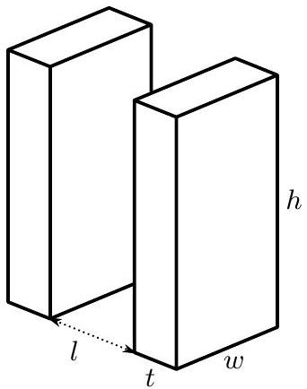
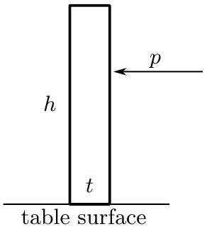

a. Suppose we give the domino a sharp, horizontal impulsive push with total momentum $p$.
    i. At what height $H$ above the table is the impulse $p$ required to topple the domino smallest?
    ii. What is the minimum value of $p$ to topple the domino?

## Solution

First we'll look for the height $H$ at which we should push to topple the domino with the least momentum. A convenient method is to look at the angular momentum in the domino because this is easy to calculate and describes rotational motion. Because the push is horizontal, the moment arm of the push (about the domino's rotational axis) is purely vertical. That means the angular momentum of the push is $p H$, where $p$ is the momentum imparted and $H$ is the height of the push. There is some minimum angular momentum $L _ { \text {min } }$ to topple the domino, so we set $L _ { \text {min } } = p H$. The bigger $H$, the smaller $p$, so we should choose the largest possible $H$. In other words, we should push at the very top of the domino, $H = h$. While we're on this part, note that if the push weren't constrained to be horizontal, the push could be a little bit smaller since the moment arm could be the entire diagonal of the thin edge of the domino.
Next we calculate the minimum $p$ using energy. As the domino rotates, it converts kinetic energy to potential energy, so we'll calculate both. The domino's potential energy is greatest when its center of mass is directly over the contact point of the domino and the table. That height is half the diagonal of the domino, so the distance from the contact point to the center of the domino is $\frac { 1 } { 2 } \sqrt { t ^ { 2 } + h ^ { 2 } }$. From the push until it reaches this point, the domino's potential energy increases by

$$
\Delta U = \frac { 1 } { 2 } m g \left( \sqrt { t ^ { 2 } + h ^ { 2 } } - h \right) .
$$

Then the domino topples. By conservation of energy, $\Delta U$ is how much rotational kinetic energy the domino must have begun with.
Next we find the kinetic energy using the rotational kinetic energy formula, $T = L ^ { 2 } / 2 I$. The moment of inertia of the domino about its contact point with the table is $I = \frac { 1 } { 3 } m \left( h ^ { 2 } + t ^ { 2 } \right)$.

You can find this with an integral, or if you know the moment of inertia about the center $\left( \frac { 1 } { 12 } m \left( h ^ { 2 } + t ^ { 2 } \right) \right)$, you can use the parallel axis theorem. We know the momentum $L = p h$, so the kinetic energy is

$$
T = \frac { 1 } { 2 } \frac { L ^ { 2 } } { I } = \frac { 1 } { 2 } \frac { ( p h ) ^ { 2 } } { ( 1 / 3 ) m \left( h ^ { 2 } + t ^ { 2 } \right) } = \frac { 3 } { 2 } \frac { p ^ { 2 } h ^ { 2 } } { m \left( h ^ { 2 } + t ^ { 2 } \right) } .
$$

Setting the initial kinetic energy equal to the gain in potential energy and solving for $p$,

$$
p _ { \min } = \frac { 1 } { \sqrt { 3 } } \frac { m } { h } \sqrt { g \left( \sqrt { t ^ { 2 } + h ^ { 2 } } - h \right) \left( h ^ { 2 } + t ^ { 2 } \right) } .
$$

b. Next, imagine a long row of dominoes with equal spacing $l$ between the nearest sides of any pair of adjacent dominos, as shown above. When a domino topples, it collides with the next domino in the row. Imagine this collision to be completely inelastic. What fraction of the total kinetic energy is lost in the collision of the first domino with the second domino?

## Solution

Right after the collision, the dominoes touch at a height $\sqrt { h ^ { 2 } - l ^ { 2 } }$ above the table. The second domino is vertical, while the first is rotated so that the angle between its leading edge and the table is $\theta = \arccos ( l / h )$. Let the dominoes' angular velocities be $\omega _ { 1 }$ and $\omega _ { 2 }$ respectively. After the dominoes collide, they stick together. If we take the two parts of the dominoes that are in contact, they must have the same horizontal velocity component in order for the dominoes to stay in contact. For the first domino, this velocity is $\omega _ { 1 } h \sin \theta = \omega _ { 1 } \sqrt { h ^ { 2 } - l ^ { 2 } }$. For the second domino it is $\omega _ { 2 }$ times the height of the impact point, so $\omega _ { 2 } \sqrt { h ^ { 2 } - l ^ { 2 } }$. Because these velocity components must be equal, $\omega _ { 1 } = \omega _ { 2 }$.

This means the dominoes have the same angular momentum as each other, measured relative to their respective rotation axes. If we look at the collision, the forces between the dominoes are purely horizontal because the dominoes' faces are frictionless, so they only exert normal forces. The second domino is vertical, so all its normal forces are purely horizontal. These horizontal normal forces exchange angular momentum between the two dominoes. They have the same moment arm (i.e. the height of the collision), so the amount of angular momentum transferred out of the first domino is equal to the amount gained by the second domino, both measured relative to the dominoes' respective rotation axes. Because the dominoes are identical and have the same angular velocity, they have the same angular momentum. This means each domino has half as much angular momentum about its rotation axis as the first domino had just before the collision. (Note that forces from the table cannot change the angular momentum of the dominoes about their respective rotational axes because such forces have zero moment arm, so only the inter-domino forces need to be examined here.)
Kinetic energy scales with the square of angular momentum, so each domino has a quarter as much kinetic energy after the collision as the first domino had before it. That means the total kinetic energy after the collision is half what it was before the collision. The fraction of kinetic energy lost is one half.

c. After the collision, the dominoes rotate in such a way so that they always remain in contact. Assume that there is no friction between the dominoes and the first domino was given the smallest possible push such that it toppled. What is the minimum $l$ such that the second domino will topple?
You may work to lowest nontrivial order in the angles through which the dominoes have rotated. Equivalently, you may approximate $t , l \ll h$.

## Solution

As in part (a), we will find the highest potential energy of the system and make sure the initial kinetic energy is high enough to get the system to that point.
At any time after the collision, let us call the angle that the first domino has rotated past its point of highest potential energy $\alpha$, and the angle that the second domino has rotated past its point of highest potential energy $\beta$. Also, let's call the angle a domino rotates from its standing position up to its point of highest potential energy $\phi$, so the dominoes have rotated $\phi + \alpha$ and $\phi + \beta$ respectively.
The dominoes need to be in contact. The top right corner of the first domino has moved horizontally a distance $h \sin ( \phi + \alpha )$ which we will approximate as $h ( \phi + \alpha )$ using the small angle approximation. The top left corner of the second domino moves horizontally forward by $h \sin ( \phi + \beta ) + t ( 1 - \cos ( \phi + \beta ) )$. We ignore the cosine term as second order in the rotation angle and approximate this as $h ( \phi + \beta )$.
The $y$-coordinate of the upper right corner of the first domino is $h ( 1 - \cos ( \phi + \alpha ) ) \approx h$. The $y$-coordinate of the upper left corner of the second domino is $h ( 1 - \cos ( \phi + \beta ) ) + t \sin ( \phi + \beta ) \approx$ $h + t ( \phi + \beta )$ There is a first-order difference in $y$-coordinates of the two corners, but this means the difference in $x$ coordinate between the top left corner of the second domino and the top right corner of the first domino is second-order in the rotation angles. We conclude that to first order

$$
h ( \phi + \alpha ) = l + h ( \phi + \beta ) \quad \Rightarrow \quad \alpha = \frac { l } { h } + \beta
$$

because this condition puts the top right corner of the first domino at the same position as the top left of the second domino.
The potential energy of the first domino, setting zero potential energy to be when the domino is upright, is $U _ { 1 } = \Delta U \left( 1 - ( \alpha / \phi ) ^ { 2 } \right)$ to second order in $\alpha$, and for the second domino, $U _ { 2 } =$ $\Delta U \left( 1 - ( \beta / \phi ) ^ { 2 } \right)$. These figures come from fitting a quadratic whose peak is when the center of mass is above the rotation point and which is zero when the domino is upright. The total potential energy is $U _ { 1 } + U _ { 2 }$, and using the relation between $\alpha$ and $\beta$, it is minimized for

$$
\beta _ { \max } = - \frac { l } { 2 h } .
$$

In other words, the second domino is as far away from rotating to the top of arc as the first domino has rotated past the top of its arc. This gives a maximum potential energy

$$
U _ { \max } = 2 \Delta U \left( 1 - \frac { l ^ { 2 } } { 4 t ^ { 2 } } \right)
$$

where we have used the approximation $\phi \approx t / h$.

At impact, $U _ { \text {impact } } \approx \Delta U \left( - l ^ { 2 } / t ^ { 2 } + 2 l / t \right)$. Before impact, the kinetic energy is $\Delta U - U _ { \text {impact } }$ because the maximum potential energy before impact was $\Delta U$, and the kinetic energy was zero there. The kinetic energy just after the collision is then $\left( \Delta U - U _ { \text {impact } } \right) / 2$. Setting this equal to the potential energy gain as the two dominoes rotate to their highest potential energy $U _ { \text {max } }$,

$$
\frac { 1 } { 2 } \left( \Delta U - U _ { \text {impact } } \right) = U _ { \max } - U _ { \text {impact } }
$$

or

$$
\frac { 1 } { 2 } \Delta U = U _ { \max } - \frac { 1 } { 2 } U _ { \mathrm { impact } }
$$

Plugging in the earlier expressions for all these gives

$$
\frac { 1 } { 2 } \Delta U = 2 \Delta U \left( 1 - \frac { l ^ { 2 } } { 4 t ^ { 2 } } \right) - \Delta U \left( \frac { l } { t } - \frac { l ^ { 2 } } { 2 t ^ { 2 } } \right)
$$

and solving this yields

$$
l = \frac { 3 } { 2 } t
$$

to first order in $t$.

d. A row of toppling dominoes can be considered to have a propagation speed of the length $l + t$ divided by the time between successive collisions. When the first domino is given a minimal push just large enough to topple and start a chain reaction of toppling dominoes, the speed increases with each domino, but approaches an asymptotic speed $v$.

Suppose there is a row of dominoes on another planet. These dominoes have the same density as the dominoes previously considered, but are twice as tall, wide, and thick, and placed with a spacing of $2 l$ between them. If this row of dominoes topples with the same asymptotic speed $v$ previously found, what is the local gravitational acceleration on this planet?

## Solution

This part is independent of the others and requires only dimensional analysis. The speed $v$ can depend on $g , h , w , l$. To get a quantity with dimensions $\left[ L T ^ { - 1 } \right]$, we must take

$$
v = c \sqrt { g L }
$$

where $L$ is some length made from $h , w$, and $l$. On the new planet, $v$ is the same and $L$ is twice as much, so $g$ must be half as great on the new planet.

## Question B2

Beloit College has a "homemade" 500 kV VanDeGraff proton accelerator, designed and constructed by the students and faculty.

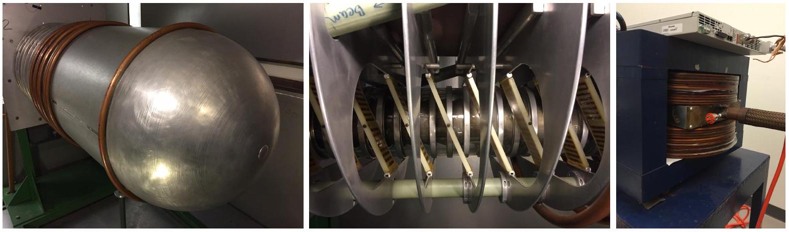
Accelerator dome (assume it is a sphere); accelerating column; bending electromagnet

The accelerator dome, an aluminum sphere of radius $a = 0.50$ meters, is charged by a rubber belt with width $w = 10 \mathrm {~cm}$ that moves with speed $v _ { b } = 20 \mathrm {~m} / \mathrm { s }$. The accelerating column consists of 20 metal rings separated by glass rings; the rings are connected in series with $500 \mathrm { M } \Omega$ resistors. The proton beam has a current of $25 \mu \mathrm {~A}$ and is accelerated through 500 kV and then passes through a tuning electromagnet. The electromagnet consists of wound copper pipe as a conductor. The electromagnet effectively creates a uniform field $B$ inside a circular region of radius $b = 10 \mathrm {~cm}$ and zero outside that region.

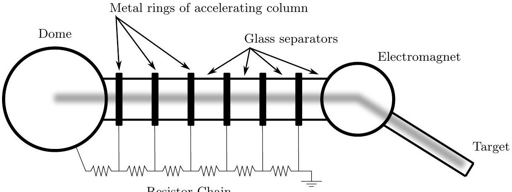
Only six of the 20 metals rings and resistors are shown in the figure. The fuzzy grey path is the path taken by the protons as they are accelerated from the dome, through the electromagnet, into the target.

a. Assuming the dome is charged to 500 kV, determine the strength of the electric field at the surface of the dome.

\section*{Solution}
The electric potential is given by
$$
V = \frac { q } { 4 \pi \epsilon _ { 0 } a }
$$
and the electric field is given by
$$
E = \frac { q } { 4 \pi \epsilon _ { 0 } a ^ { 2 } }
$$

so
$$
E = \frac { V } { a } = 10 ^ { 6 } \mathrm {~V} / \mathrm { m } .
$$
b. Assuming the proton beam is off, determine the time constant for the accelerating dome (the time it takes for the charge on the dome to decrease to $1 / e \approx 1 / 3$ of the initial value.

## Solution

The time constant is given by

$$
\tau = R C
$$

where

$$
C = Q / V = 4 \pi \epsilon _ { 0 } a = 5.56 \times 10 ^ { - 11 } \mathrm {~F}
$$

and

$$
R = 20 r _ { 0 } = 10 ^ { 10 } \Omega
$$

so

$$
\tau = R C = 0.556 \mathrm {~s} .
$$

c. Assuming the $25 \mu \mathrm {~A}$ proton beam is on, determine the surface charge density that must be sprayed onto the charging belt in order to maintain a steady charge of 500 kV on the dome.

## Solution

There are several ways the dome can discharge, two of which are along the resistors and the proton beam. We will ignore any other path.
At 500 kV , the current through the resistor chain is $50 \mu \mathrm {~A}$, from $V = I R$. So the total current $I$ needed to be supplied to the dome is $75 \mu \mathrm {~A}$. This is sprayed onto the belt, which moves at a rate of

$$
\frac { \delta A } { \Delta t } = v _ { b } w
$$

so the necessary surface charge density is

$$
\sigma = \frac { I } { v _ { b } w } = \frac { ( 75 \mu \mathrm { C } / \mathrm { s } ) } { ( 20 \mathrm {~m} / \mathrm { s } ) ( 0.10 \mathrm {~m} ) } = 37.5 \mu \mathrm { C } / \mathrm { m } ^ { 2 } .
$$

d. The proton beam enters the electromagnet and is deflected by an angle $\theta = 10 ^ { \circ }$. Determine the magnetic field strength.
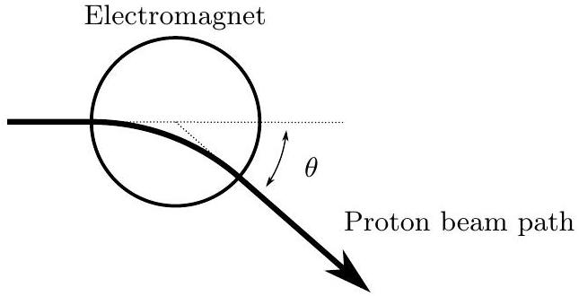

## Solution

Start with $F = q v B$ where $F$ is the force on the protons, and $v$ the velocity. The protons are non-relativistic, so

$$
\frac { 1 } { 2 } m v ^ { 2 } = q V
$$

They move in a circle of radius $r$ inside the field, given by

$$
\frac { m v ^ { 2 } } { r } = q v B .
$$

Combining these equations gives

$$
r = \frac { m v } { q B } = \frac { m } { q B } \sqrt { \frac { 2 q V } { m } } = \frac { 1 } { B } \sqrt { \frac { 2 m V } { q } } .
$$

Solving for the magnetic field strength,

$$
B = \frac { 1 } { r } \sqrt { \frac { 2 m V } { q } } .
$$

To relate this to the angle, we need to do some geometry. Sketch two circles, one of radius $b$, the other of radius $r$, that intersect perpendicular to each other, as in the diagram above. Then drawing a triangle gives

$$
\tan \frac { \theta } { 2 } = \frac { b } { x } .
$$

Combining our results, the answer is

$$
B = \frac { \tan \theta / 2 } { b } \sqrt { \frac { 2 m V } { q } } = 0.0894 \mathrm {~T} .
$$

e. The electromagnet is composed of layers of spiral wound copper pipe; the pipe has inner diameter $d _ { i } = 0.40 \mathrm {~cm}$ and outer diameter $d _ { o } = 0.50 \mathrm {~cm}$. The copper pipe is wound into this flat spiral that has an inner diameter $D _ { i } = 20 \mathrm {~cm}$ and outer diameter $D _ { o } = 50 \mathrm {~cm}$. Assuming the pipe almost touches in the spiral winding, determine the length $L$ in one spiral.

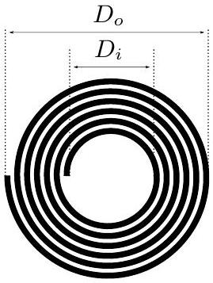

## Solution

Treat the problem as two dimensional. The area of the spiral is

$$
A = \frac { \pi } { 4 } \left( D _ { o } ^ { 2 } - D _ { i } ^ { 2 } \right) .
$$

The area of the pipe is

$$
A = L d _ { o } .
$$

Equating and solving,

$$
L = \frac { \pi \left( D _ { o } ^ { 2 } - D _ { i } ^ { 2 } \right) } { 4 d _ { o } } = 33 \mathrm {~m} .
$$

f. Hollow pipe is used instead of solid conductors in order to allow for cooling of the magnet. If the resistivity of copper is $\rho = 1.7 \times 10 ^ { - 8 } \Omega \cdot \mathrm {~m}$, determine the electrical resistance of one spiral.

## Solution

We have

$$
r _ { s } = \frac { \rho L } { A }
$$

where $A$ is the cross sectional area of the pipe, or

$$
A = \frac { \pi } { 4 } \left( d _ { o } ^ { 2 } - d _ { i } ^ { 2 } \right) = 7.1 \times 10 ^ { - 6 } \mathrm {~m} ^ { 2 }
$$

Combining, we have

$$
r _ { s } = \frac { \rho } { d } \frac { D _ { o } ^ { 2 } - D _ { i } ^ { 2 } } { d _ { o } ^ { 2 } - d _ { i } ^ { 2 } } = 0.079 \Omega .
$$

g. There are $N = 24$ coils stacked on top of each other. Tap water with an initial temperature of $T _ { c } = 18 ^ { \circ } \mathrm { C }$ enters the spiral through the copper pipe to keep it from over heating; the water exits at a temperature of $T _ { h } = 31 ^ { \circ } \mathrm { C }$. The copper pipe carries a direct 45 Amp current in order to generate the necessary magnetic field. At what rate must the cooling water flow be provided to the electromagnet? Express your answer in liters per second with only one significant digit. The specific heat capacity of water is $4200 \mathrm {~J} / { } ^ { \circ } \mathrm { C } \cdot \mathrm { kg }$; the density of water is $1000 \mathrm {~kg} / \mathrm { m } ^ { 3 }$.

## Solution

The rate of heat generation in the coils is given by

$$
P = I ^ { 2 } R = I ^ { 2 } N r _ { s } = 3850 \mathrm {~W} .
$$

This must be dissipated via the increase in water temperature,

$$
P = C \Delta T Q
$$

where $C$ is the specific heat capacity in liters, and $Q$ is the flow rate in liters per second. But since one liter of water is one kilogram, we can use either $C$. Combining, we have

$$
Q = \frac { I ^ { 2 } N r } { C \Delta T } = 0.07 \mathrm { l } / \mathrm { s } .
$$

h. The protons are fired at a target consisting of Fluorine atoms $( Z = 9 )$. What is the distance of closest approach to the center of the Fluorine nuclei for the protons? You can assume that the Fluorine does not move.

## Solution

Conservation of energy gives

$$
q V = \frac { 1 } { 4 \pi \epsilon _ { 0 } } \frac { Z q ^ { 2 } } { r }
$$

where $r$ is the radius of closest approach. Then

$$
r = \frac { 1 } { 4 \pi \epsilon _ { 0 } } \frac { Z q } { V } = 2.59 \times 10 ^ { - 14 } \mathrm {~m}
$$

Since this is about the size of a Fluorine nucleus, we can potentially get a nuclear reaction. Actually, the important reaction occurs at about 380 kV .

## Exam Statistics

| Question | A1 | A2 | A3 | A4 | B1 | B2 | Total |
| :--- | :--- | :--- | :--- | :--- | :--- | :--- | :--- |
| Mean | 11 | 3 | 5 | 6 | 12 | 15 | 53 |
| Standard Deviation | 7 | 4 | 5 | 7 | 10 | 14 | 29 |
| Maximum | 25 | 21 | 25 | 25 | 42 | 50 | 163 |
| Upper Quartile | 18 | 4 | 9 | 8 | 18 | 26 | 73 |
| Median | 10 | 2 | 5 | 5 | 10 | 12 | 49 |
| Lower Quartile | 4 | 0 | 0 | 0 | 3 | 1 | 30 |
| Minimum | 0 | 0 | 0 | 0 | 0 | 0 | 5 |

Some Trivia:

- California had 121 test takers
- New Jersey had 42
- Texas had 38
- Florida, Illinois, Massachusetts, Maryland, New York, and Virginia each had between one dozen and two dozen test takers
- Alabama, Alaska, Colorado, Idaho, Iowa, Louisiana, Montana, North Dakota, South Dakota, and Wyoming did not have a test taker this year.
