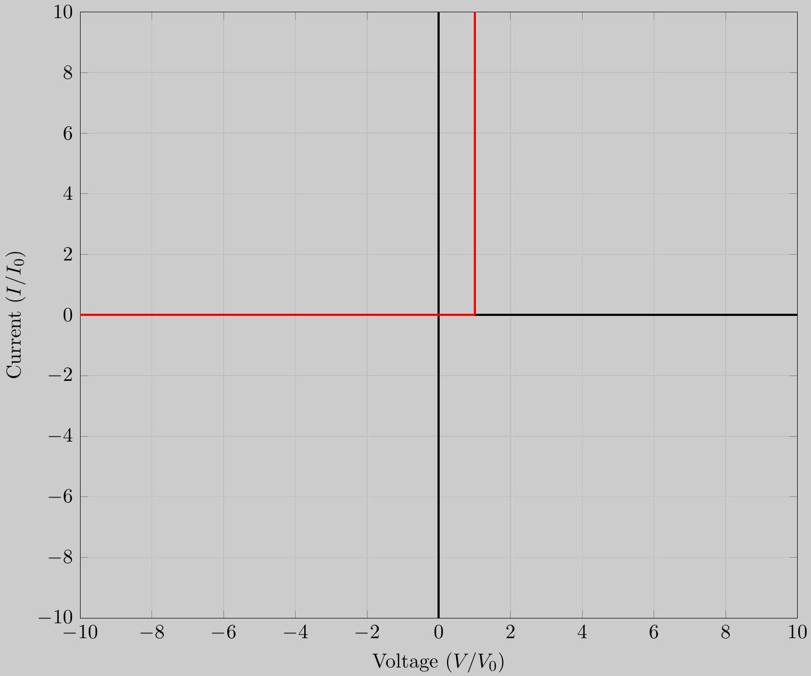
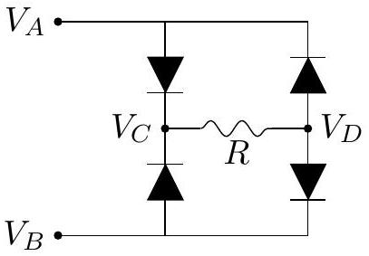
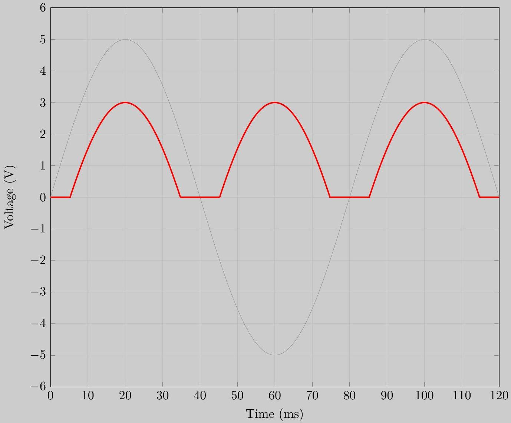
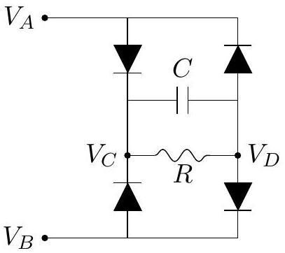
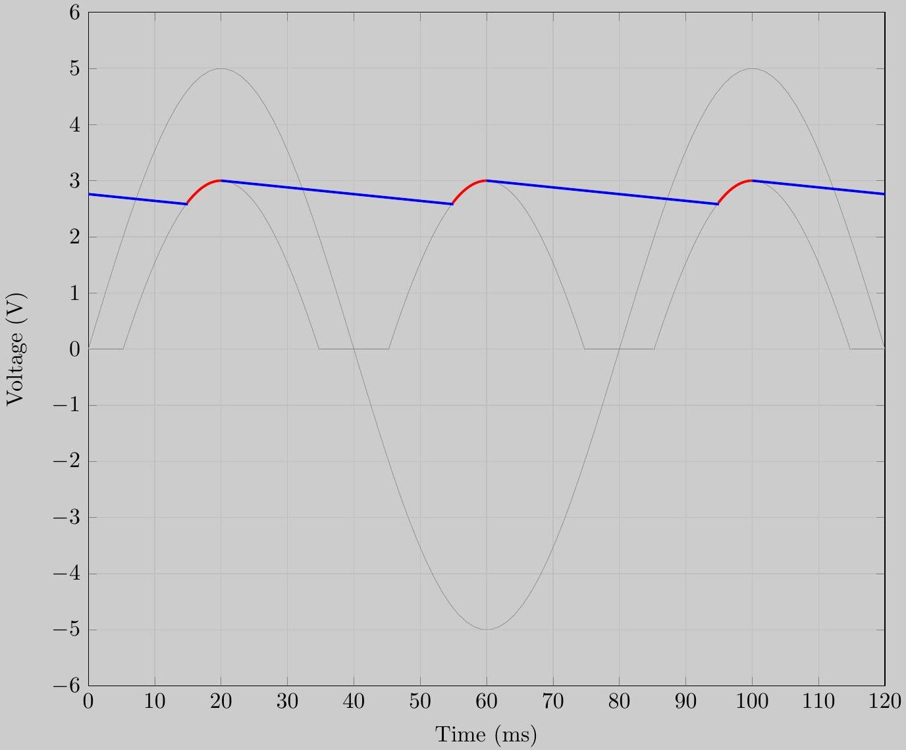
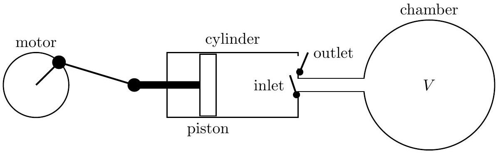
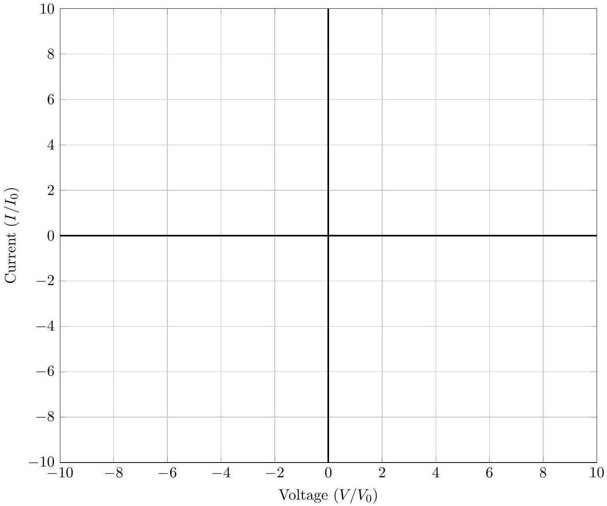
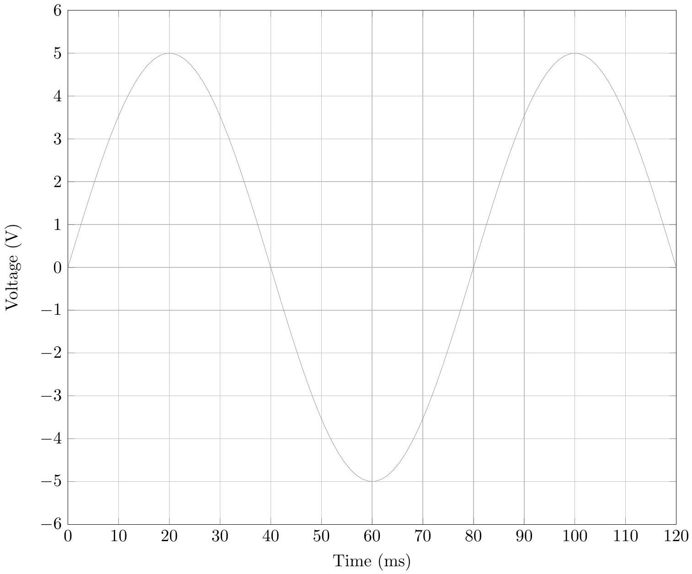

## USA Physics Olympiad Exam

## DO NOT DISTRIBUTE THIS PAGE

## Important Instructions for the Exam Supervisor

- This examination consists of two parts: Part A has three questions and is allowed 90 minutes; Part B also has three questions and is allowed 90 minutes.
- The first page that follows is a cover sheet. Examinees may keep the cover sheet for both parts of the exam.
- The parts are then identified by the center header on each page. Examinees are only allowed to do one part at a time, and may not work on other parts, even if they have time remaining.
- Allow 90 minutes to complete Part A. Do not let students look at Part B. Collect the answers to Part A before allowing the examinee to begin Part B. Examinees are allowed a 10 to 15 minutes break between parts A and B.
- Allow 90 minutes to complete Part B. Do not let students go back to Part A.
- Ideally the test supervisor will divide the question paper into 3 parts: the cover sheet (page 2), Part A (pages 3-10), Part B (pages 12-18), and several answer sheets for one of the questions in Part A (pages 20-22). Examinees should be provided parts A and B individually, although they may keep the cover sheet. The answer sheets should be printed single sided!
- The supervisor must collect all examination questions, including the cover sheet, at the end of the exam, as well as any scratch paper used by the examinees. Examinees may not take the exam questions. The examination questions may be returned to the students after April 21, 2018.
- Examinees are allowed calculators, but they may not use symbolic math, programming, or graphic features of these calculators. Calculators may not be shared and their memory must be cleared of data and programs. Cell phones, PDA's or cameras may not be used during the exam or while the exam papers are present. Examinees may not use any tables, books, or collections of formulas.

## USA Physics Olympiad Exam   INSTRUCTIONS

## DO NOT OPEN THIS TEST UNTIL YOU ARE TOLD TO BEGIN

- Work Part A first. You have 90 minutes to complete all three problems. Each question is worth 25 points. Do not look at Part B during this time.
- After you have completed Part A you may take a break.
- Then work Part B. You have 90 minutes to complete three problems. Each question is worth 25 points. Do not look at Part A during this time.
- Show all your work. Partial credit will be given. Do not write on the back of any page. Do not write anything that you wish graded on the question sheets.
- Start each question on a new sheet of paper. Put your AAPT ID number, your proctor's AAPT ID number, the question number and the page number/total pages for this problem, in the upper right hand corner of each page. For example,
Student AAPT ID \#
Proctor AAPT ID \#
A1-1/3
- A hand-held calculator may be used. Its memory must be cleared of data and programs. You may use only the basic functions found on a simple scientific calculator. Calculators may not be shared. Cell phones, PDA's or cameras may not be used during the exam or while the exam papers are present. You may not use any tables, books, or collections of formulas.
- Questions with the same point value are not necessarily of the same difficulty.
- In order to maintain exam security, do not communicate any information about the questions (or their answers/solutions) on this contest until after April 13, 2018.

Possibly Useful Information. You may use this sheet for both parts of the exam.

$$
\begin{array} { l l }
g = 9.8 \mathrm {~N} / \mathrm { kg } & G = 6.67 \times 10 ^ { - 11 } \mathrm {~N} \cdot \mathrm {~m} ^ { 2 } / \mathrm { kg } ^ { 2 } \\
k = 1 / 4 \pi \epsilon _ { 0 } = 8.99 \times 10 ^ { 9 } \mathrm {~N} \cdot \mathrm {~m} ^ { 2 } / \mathrm { C } ^ { 2 } & k _ { \mathrm { m } } = \mu _ { 0 } / 4 \pi = 10 ^ { - 7 } \mathrm {~T} \cdot \mathrm {~m} / \mathrm { A } \\
c = 3.00 \times 10 ^ { 8 } \mathrm {~m} / \mathrm { s } & k _ { \mathrm { B } } = 1.38 \times 10 ^ { - 23 } \mathrm {~J} / \mathrm { K } \\
N _ { \mathrm { A } } = 6.02 \times 10 ^ { 23 } ( \mathrm {~mol} ) ^ { - 1 } & R = N _ { \mathrm { A } } k _ { \mathrm { B } } = 8.31 \mathrm {~J} / ( \mathrm { mol } \cdot \mathrm {~K} ) \\
\sigma = 5.67 \times 10 ^ { - 8 } \mathrm {~J} / \left( \mathrm { s } \cdot \mathrm {~m} ^ { 2 } \cdot \mathrm {~K} ^ { 4 } \right) & e = 1.602 \times 10 ^ { - 19 } \mathrm { C } \\
1 \mathrm { eV } = 1.602 \times 10 ^ { - 19 } \mathrm {~J} & h = 6.63 \times 10 ^ { - 34 } \mathrm {~J} \cdot \mathrm {~s} = 4.14 \times 10 ^ { - 15 } \mathrm { eV } \cdot \mathrm {~s} \\
m _ { e } = 9.109 \times 10 ^ { - 31 } \mathrm {~kg} = 0.511 \mathrm { MeV } / \mathrm { c } ^ { 2 } & ( 1 + x ) ^ { n } \approx 1 + n x \text { for } | x | \ll 1 \\
\sin \theta \approx \theta - \frac { 1 } { 6 } \theta ^ { 3 } \text { for } | \theta | \ll 1 & \cos \theta \approx 1 - \frac { 1 } { 2 } \theta ^ { 2 } \text { for } | \theta | \ll 1
\end{array}
$$

Copyright ©2018 American Association of Physics Teachers

## Part A

Question A1

a. Suppose you drop a block of mass $m$ vertically onto a fixed ramp with angle $\theta$ with coefficient of static and kinetic friction $\mu$. The block is dropped in such a way that it does not rotate after colliding with the ramp. Throughout this problem, assume the time of the collision is negligible.
    i. Suppose the block's speed just before it hits the ramp is $v$ and the block slides down the ramp immediately after impact. What is the speed of the block right after the collision?

## Solution

During the collision, the block receives impulses from the normal force, friction, and gravity. Since the collision is very short, the impulse due to gravity is negligible. Let $p _ { N }$ and $p _ { F }$ be the magnitudes of the impulses from the normal force and friction force.
Since the block stays on the ramp after the collision, its final momentum is parallel to the ramp. Then the normal force must completely eliminate the block's initial momentum perpendicular to the ramp, so

$$
p _ { N } = m v \cos \theta .
$$

Since the block still moves after the collision,

$$
p _ { F } = \mu p _ { N } .
$$

The block's initial momentum parallel to the ramp is $m v \sin \theta$, so

$$
m v \sin \theta - p _ { F } = m u ,
$$

where $u$ is the final speed of the block. Solving for $u$ gives

$$
u = v ( \sin \theta - \mu \cos \theta ) .
$$

ii. What is the minimum $\mu$ such that the speed of the block right after the collision is 0?
Solution
We set $u = 0$ to obtain
$$
\mu = \tan \theta .
$$
Note that this is simply the no-slip condition for a block resting on an inclined plane! This is because in both cases, equality is achieved when the normal force and maximal friction force sum to a purely vertical force.
b. Now suppose you drop a sphere with mass $m$, radius $R$ and moment of inertia $\beta m R ^ { 2 }$ vertically onto the same fixed ramp such that it reaches the ramp with speed $v$.

i. Suppose the sphere immediately begins to roll without slipping. What is the new speed of the sphere in this case?

## Solution

If the sphere immediately begins to roll without slipping, we can calculate the frictional impulse independently of the normal impulse. We have

$$
m v \sin \theta - p _ { F } = m u .
$$

The frictional impulse is responsible for the sphere's rotation, so its angular momentum about its center of mass is $L = p _ { F } R$. But we also know that

$$
L = \beta m R ^ { 2 } \omega = \beta m R u .
$$

Then

$$
p _ { F } = \beta m u .
$$

Substituting into the previous expression gives

$$
m v \sin \theta = ( 1 + \beta ) m u \quad \Rightarrow \quad u = \frac { v \sin \theta } { 1 + \beta } .
$$

ii. What is the minimum coefficient of friction such that the sphere rolls without slipping immediately after the collision?

## Solution

As in part (a), the normal impulse is $p _ { N } = m v \cos \theta$ and the maximal frictional impulse is $p _ { F } = \mu p _ { N }$. From the previous part, we need

$$
p _ { F } = \frac { \beta m v \sin \theta } { 1 + \beta }
$$

and equating these expressions gives

$$
\mu = \frac { \beta \tan \theta } { 1 + \beta } .
$$

Question A2
For this problem, graphical answers should be drawn on the answer sheets graphs provided. Supporting work is to be written on blank answer sheets. Incorrect graphs without supporting work will receive no partial credit.

The current $I$ as a function of voltage $V$ for a certain electrical device is

$$
I = I _ { 0 } e ^ { - q V _ { 0 } / k _ { B } T } \left( e ^ { q V / k _ { B } T } - 1 \right)
$$

where $q$ is the magnitude of the charge on an electron, $k _ { B }$ is Boltzmann's constant, and $T$ is the absolute temperature. $I _ { 0 }$ and $V _ { 0 }$ are non-zero positive constants. Throughout this problem assume low temperature values $k _ { B } T \ll q V _ { 0 }$.

a. On the answer sheets, sketch a graph of the current versus voltage for low temperature values $k _ { B } T \ll q V _ { 0 }$, clearly indicating any asymptotic behavior.

Solution

The current is simply proportional to $e ^ { q V / k _ { B } T } - 1$, which is a shifted exponential. Then $I$ always has the same sign as $V$, and vanishes when $V$ vanishes. The current grows quickly for high $V$ and approaches a constant for low $V$.
This answer is acceptable, but we can use the condition $k _ { B } T \ll q V _ { 0 }$ to simplify the graph. For negative $V$, we have

$$
I / I _ { 0 } \approx e ^ { - q V _ { 0 } / k _ { B } T }
$$

which is extremely small. For positive $V$, we have

$$
I / I _ { 0 } \approx e ^ { q \left( V - V _ { 0 } \right) / k _ { B } T }
$$

which is extremely small when $V < V _ { 0 }$ and extremely large when $V > V _ { 0 }$. Then

$$
\frac { I } { I _ { 0 } } \approx \begin{cases} 0 & V < V _ { 0 } \\ \infty & V > V _ { 0 } \end{cases}
$$

as shown below. Accounting for finite temperature, which is not necessary for full credit, simply rounds the corners in all of the graphs.

Shown is a schematic for the device. Positive voltage means that the electric potential of the left hand side of the device is higher than the right hand side. For this device, $I _ { 0 } = 25 \mu \mathrm {~A}$ and $V _ { 0 } = 1.0 \mathrm {~V}$.

$$
V _ { L } \cdot \Delta \cdot V _ { R }
$$

Below is a circuit made up of these elements. The voltage supplied the circuit is sinusoidal, $V _ { A B } = V _ { A } - V _ { B } = V _ { s } \sin \omega t$, and is also shown on answer sheets. The resistance is $R = 5.0 \Omega$ and $V _ { s } = 5.0 \mathrm {~V}$.

b. Sketch the potential difference $V _ { C D } = V _ { C } - V _ { D }$ as a function of time on the answer sheet. For your convenience, $V _ { A B }$ is shown in light gray. Assume that $V _ { A B }$ has been running for a long time.

## Solution

When $\left| V _ { A B } \right| < 2 V _ { 0 }$, no current flows. When $\left| V _ { A B } \right| > 2 V _ { 0 }$, current begins to flow, with each diode subtracting a potential difference of $V _ { 0 }$. Note that the current flows in the same direction for both positive and negative $V _ { A B }$. This device is a rectifier.

A capacitor is connected to the circuit as shown below. The capacitance is $C = 50 \mathrm { mF }$.

c. Sketch the new potential difference $V _ { C D } = V _ { C } - V _ { D }$ as a function of time on the answer sheet. For your convenience, $V _ { A B }$ is shown in light gray. Assume that $V _ { A B }$ has been running for a long time.

## Solution

Let the voltage on the capacitor be $V _ { s }$. Whenever $\left| V _ { A B } \right| \geq V _ { s } + 2 V _ { 0 }$, current flows through the diodes, charging the capacitor up to voltage $\left| V _ { A B } \right| - 2 V _ { 0 }$. Whenever $\left| V _ { A B } \right| < V _ { s } + 2 V _ { 0 }$, no current flows through the diodes, and the capacitor and resistor simply discharge as an RC circuit with time constant $R C = 250 \mathrm {~ms}$.

Since $R C$ is much longer than the timescale on the answer sheets, the discharge is approximately linear, with

$$
\frac { d V _ { s } } { d t } = \frac { 1.0 \mathrm {~V} } { 83.3 \mathrm {~ms} } .
$$

Thus the capacitor charges completely to 3.0 V every cycle, then discharges approximately linearly by about a half volt during the reminder of the cycle. On the graph we show charging as red and discharging as blue.

## Question A3

A vacuum system consists of a chamber of volume $V$ connected to a vacuum pump that is a cylinder with a piston that moves left and right. The minimum volume in the pump cylinder is $V _ { 0 }$, and the maximum volume in the cylinder is $V _ { 0 } + \Delta V$. You should assume that $\Delta V \ll V$.

The cylinder has two valves. The inlet valve opens when the pressure inside the cylinder is lower than the pressure in the chamber, but closes when the piston moves to the right. The outlet valve opens when the pressure inside the cylinder is greater than atmospheric pressure $P _ { a }$, and closes when the piston moves to the left. A motor drives the piston to move back and forth. The piston moves at such a rate that heat is not conducted in or out of the gas contained in the cylinder during the pumping cycle. One complete cycle takes a time $\Delta t$. You should assume that $\Delta t$ is a very small quantity, but $\Delta V / \Delta t = R$ is finite. The gas in the chamber is ideal monatomic and remains at a fixed temperature of $T _ { a }$.

Start with assumption that $V _ { 0 } = 0$ and there are no leaks in the system.

a. At $t = 0$ the pressure inside the chamber is $P _ { a }$. Find an equation for the pressure at a later time $t$.

## Solution

During each cycle, the system sucks gas out of the chamber and pushes it into the atmosphere. Since $V _ { 0 } = 0$, the inlet valve opens the moment the piston starts moving to the left. When the piston is all the way to the left, a fraction $\Delta V / ( V + \Delta V )$ of the gas is in the cylinder. As the piston moves to the right, all of this gas is pushed out, so after a single cycle,

$$
P _ { f } = P _ { i } \left( \frac { V } { V + \Delta V } \right)
$$

and in general,

$$
P ( t ) = P _ { a } \left( \frac { V } { V + \Delta V } \right) ^ { t / \Delta t } .
$$

While this is technically correct, it can be simplified significantly. Write

$$
P ( t ) = P _ { a } \left( 1 + \frac { \Delta V } { V } \right) ^ { - t / \Delta t } = P _ { a } \left( ( 1 + x ) ^ { 1 / x } \right) ^ { - R t / V }
$$

where $x = \Delta V / V \ll 1$. Then using the definition of $e$,

$$
e = \lim _ { x \rightarrow 0 } ( 1 + x ) ^ { 1 / x }
$$

we have

$$
P ( t ) = P _ { a } e ^ { - R t / V } .
$$

b. Find an expression for the temperature of the gas as it is emitted from the pump cylinder into the atmosphere. Your answer may depend on time.

## Solution

When the piston is all the way to the left, the pressure is $P ( t )$ and the temperature is $T _ { a }$. As the piston moves to the right, the gas is adiabatically compressed until its pressure reaches $P _ { a }$ and the outlet valve opens. Since $P V ^ { \gamma }$ is constant during adiabatic compression and $P V / T$ is constant by the ideal gas law,

$$
T _ { \text {out } } ( t ) = T _ { a } \left( \frac { P _ { a } } { P ( t ) } \right) ^ { 1 - 1 / \gamma } = T _ { a } \left( \frac { P _ { a } } { P ( t ) } \right) ^ { 2 / 5 } = T _ { a } e ^ { 2 R t / 5 V }
$$

where we used $\gamma = 5 / 3$ for a monatomic ideal gas.

For the remainder of this problem $0 < V _ { 0 } < \Delta V \ll V$.

c. Find an expression for the minimum possible pressure in the chamber, $P _ { \text {min } }$.

## Solution

Since $V _ { 0 } > 0$, the inlet valve will not open immediately when the piston begins moving to the left; instead it will open once the pressure in the cylinder equals the pressure in the chamber. Since the expansion of the cylinder is adiabatic, $P V ^ { \gamma }$ is constant, so

$$
P _ { \min } = P _ { a } \left( \frac { V _ { 0 } } { V _ { 0 } + \Delta V } \right) ^ { \gamma } = P _ { a } \left( 1 + \frac { \Delta V } { V _ { 0 } } \right) ^ { - \gamma } .
$$

## STOP: Do Not Continue to Part B

If there is still time remaining for Part A, you should review your work for Part A, but do not continue to Part B until instructed by your exam supervisor.

## Part B

## Question B1

The electric potential at the center of a cube with uniform charge density $\rho$ and side length $a$ is

$$
\Phi \approx \frac { 0.1894 \rho a ^ { 2 } } { \epsilon _ { 0 } } .
$$

You do not need to derive this. ${ } ^ { 1 }$
For the entirety of this problem, any computed numerical constants should be written to three significant figures.

a. What is the electric potential at a corner of the same cube? Write your answer in terms of $\rho , a , \epsilon _ { 0 }$, and any necessary numerical constants.

## Solution

By dimensional analysis, the answer takes the form

$$
\Phi _ { c } ( a , \rho ) \approx \frac { C \rho a ^ { 2 } } { \epsilon _ { 0 } }
$$

for a dimensionless constant $C$. Note that a cube of side length $a$ consists of 8 cubes of side length $a / 2$, each with a corner at the center of the larger cube. Then

$$
\frac { 0.1894 \rho a ^ { 2 } } { \epsilon _ { 0 } } = 8 \frac { C \rho ( a / 2 ) ^ { 2 } } { \epsilon _ { 0 } }
$$

so $C = 0.1894 / 2 = 0.0947$.

b. What is the electric potential at the tip of a pyramid with a square base of side length $a$, height $a / 2$, and uniform charge density $\rho$ ? Write your answer in terms of $\rho , a , \epsilon _ { 0 }$, and any necessary numerical constants.

## Solution

A cube of side length $a$ consists of 6 such pyramids. Then we simply compute 0.1894/6 for

$$
\Phi _ { p } ( a , \rho ) \approx \frac { 0.0316 \rho a ^ { 2 } } { \epsilon _ { 0 } }
$$

c. What is the electric potential due to a square plate with side length $a$ of uniform charge density $\sigma$ at a height $a / 2$ above its center? Write your answer in terms of $\sigma , a , \epsilon _ { 0 }$, and any necessary numerical constants.
[^0]

## Solution

Let the potential due to such a square be $\Phi _ { s } ( a , \sigma )$. Note that adding a square plate of infinitesimal thickness $d z$ and side length $a$ to a square pyramid with base side length $a$ and height $a / 2$ yields a square pyramid with base side length $a + 2 d z$ and height $a / 2 + d z$.
The surface charge density of a square plate with thickness $d z$ and volume charge density $\rho$ is $\sigma = \rho d z$. Then by the principle of superposition,

$$
\Phi _ { s } ( a , \rho d z ) = \Phi _ { p } ( a + 2 d z , \rho ) - \Phi _ { p } ( a , \rho ) \approx \frac { 0.0316 \rho \left( ( a + 2 d z ) ^ { 2 } - a ^ { 2 } \right) } { \epsilon _ { 0 } } = \frac { 0.126 a \rho d z } { \epsilon _ { 0 } } .
$$

so we have

$$
\Phi _ { s } ( a , \sigma ) \approx \frac { 0.126 a \sigma } { \epsilon _ { 0 } } .
$$

d. Let $E ( z )$ be the electric field at a height $z$ above the center of a square with charge density $\sigma$ and side length $a$. If the electric potential at the center of the square is approximately $\frac { 0.281 a \sigma } { \epsilon _ { 0 } }$, estimate $E ( a / 2 )$ by assuming that $E ( z )$ is linear in $z$ for $0 < z < a / 2$. Write your answer in terms of $\sigma , a , \epsilon _ { 0 }$, and any necessary numerical constants.

## Solution

The potential difference between height 0 and $a / 2$ is

$$
\Delta \Phi = ( 0.281 - 0.126 ) \frac { a \sigma } { \epsilon _ { 0 } } = \frac { 0.155 a \sigma } { \epsilon _ { 0 } } .
$$

On the other hand, we have

$$
\Delta \Phi = \int _ { 0 } ^ { a / 2 } E ( z ) d z \approx \frac { a } { 2 } \frac { E ( 0 ) + E ( a / 2 ) } { 2 }
$$

where we approximated $E ( z )$ as linear, and $E ( 0 ) = \sigma / 2 \epsilon _ { 0 }$ by Gauss's law. Solving for $E ( a / 2 )$,

$$
E ( a / 2 ) \approx \frac { 0.119 \sigma } { \epsilon _ { 0 } }
$$

where the last significant digit is not important. Incidentally, the actual value is exactly $\sigma / 6 \epsilon _ { 0 }$, and this fact has a slick calculation-free proof.

Question B2
In this problem, use a particle-like model of photons: they propagate in straight lines and obey the law of reflection, but are subject to the quantum uncertainty principle. You may use small-angle approximations throughout the problem.

A photon with wavelength $\lambda$ has traveled from a distant star to a telescope mirror, which has a circular cross-section with radius $R$ and a focal length $f \gg R$. The path of the photon is nearly aligned to the axis of the mirror, but has some slight uncertainty $\Delta \theta$. The photon reflects off the mirror and travels to a detector, where it is absorbed by a particular pixel on a charge-coupled device (CCD).

Suppose the telescope mirror is manufactured so that photons coming in parallel to each other are focused to the same pixel on the CCD, regardless of where they hit the mirror. Then all small cross-sectional areas of the mirror are equally likely to include the point of reflection for a photon.

a. Find the standard deviation $\Delta r$ of the distribution for $r$, the distance from the center of the telescope mirror to the point of reflection of the photon.

## Solution

The square of the standard deviation is the variance, so

$$
( \Delta r ) ^ { 2 } = \left\langle r ^ { 2 } \right\rangle - \langle r \rangle ^ { 2 } .
$$

Computing the average value of $r ^ { 2 }$ is mathematically the exact same thing as computing the moment of inertia of a uniform disk; we have

$$
\left\langle r ^ { 2 } \right\rangle = \frac { 1 } { \pi R ^ { 2 } } \int _ { 0 } ^ { R } r ^ { 2 } ( 2 \pi r d r ) = \frac { 1 } { 2 } R ^ { 2 }
$$

Similarly, the average value of $r$ is

$$
\langle r \rangle = \frac { 1 } { \pi R ^ { 2 } } \int _ { 0 } ^ { R } r ( 2 \pi r d r ) = \frac { 2 } { 3 } R .
$$

Then we have

$$
\Delta r = \frac { R } { \sqrt { 18 } } .
$$

b. Use the uncertainty principle, $\Delta r \Delta p _ { r } \geq \hbar / 2$, to place a bound on how accurately we can know the angle of the photon from the axis of the telescope. Give your answer in terms of $R$ and $\lambda$. If you were unable to solve part a, you may also give your answer in terms of $\Delta r$.

## Solution

We have

$$
\Delta p _ { r } \approx p \Delta \theta = \frac { h } { \lambda } \Delta \theta .
$$

Applying the uncertainty principle, we have

$$
\Delta \theta \geq \frac { \sqrt { 18 } \lambda } { 4 \pi R } .
$$

Since the factors of $\hbar$ canceled out, this is really a classical calculation; one could get a similar result by considering classical diffraction from a circular aperture.

c. Suppose we want to build a telescope that can tell with high probability whether a photon it detected from Alpha Centauri A came the left half or right half of the star. Approximately how large would a telescope have to be to achieve this? Alpha Centauri A is approximately $4 \times 10 ^ { 16 } \mathrm {~m}$ from Earth and has a radius approximately $7 \times 10 ^ { 8 } \mathrm {~m}$. Assume visible light with $\lambda = 500 \mathrm {~nm}$.

## Solution

We need $\Delta \theta$ to be much smaller than the actual angular separation, or

$$
\Delta \theta \ll \frac { 7 \times 10 ^ { 8 } \mathrm {~m} } { 4 \times 10 ^ { 16 } \mathrm {~m} } \approx 2 \times 10 ^ { - 8 } .
$$

This means that

$$
R \approx \frac { \sqrt { 18 } \lambda } { 4 \pi \Delta \theta } \gg \frac { \sqrt { 18 } \left( 5 \times 10 ^ { - 7 } \mathrm {~m} \right) } { 4 \pi \left( 2 \times 10 ^ { - 8 } \right) } = 8.4 \mathrm {~m}
$$

Question B3
Radiation pressure from the sun is responsible for cleaning out the inner solar system of small particles.

a. The force of radiation on a spherical particle of radius $r$ is given by
$$
F = P Q \pi r ^ { 2 }
$$
where $P$ is the radiation pressure and $Q$ is a dimensionless quality factor that depends on the relative size of the particle $r$ and the wavelength of light $\lambda$. Throughout this problem assume that the sun emits a single wavelength $\lambda _ { \text {max } }$; unless told otherwise, leave your answers in terms of symbolic variables.
    i. Given that the total power radiated from the sun is given by $L _ { \odot }$, find an expression for the radiation pressure a distance $R$ from the sun.

## Solution

We will assume that light from the sun is completely absorbed, and then re-radiated as blackbody isotropically. In that case,

$$
P = \frac { I } { c } = \frac { L _ { \odot } } { 4 \pi R ^ { 2 } c } .
$$

The relationship between the pressure $P$ and the energy density $I$ can be derived from the equation $p = E / c$ for photons, or simply postulated by dimensional analysis, since there is no other relevant speed.
Alternatively, this relation can be derived using classical electromagnetism, though this was not required. For a plane wave, the momentum density (i.e. pressure) of the electromagnetic field is $P = \epsilon _ { 0 } | \mathbf { E } \times \mathbf { B } |$, while the energy density is $I = | \mathbf { S } | / c$ where $\mathbf { S } = \mathbf { E } \times \mathbf { B } / \mu _ { 0 }$. Then $P = I / c$ since $c ^ { 2 } = 1 / \epsilon _ { 0 } \mu _ { 0 }$.

ii. Assuming that the particle has a density $\rho$, derive an expression for the ratio $\frac { F _ { \text {radiation } } } { F _ { \text {gravity } } }$ in terms of $L _ { \odot }$, mass of sun $M _ { \odot } , \rho$, particle radius $r$, and quality factor $Q$.

## Solution

We have

$$
F _ { \text {gravity } } = \frac { G M _ { \odot } } { R ^ { 2 } } \frac { 4 } { 3 } \pi \rho r ^ { 3 } , \quad F _ { \text {radiation } } = \frac { L _ { \odot } } { 4 \pi R ^ { 2 } c } Q \pi r ^ { 2 } = \frac { L _ { \odot } } { 4 R ^ { 2 } c } Q r ^ { 2 }
$$

which gives

$$
\frac { F _ { \text {radiation } } } { F _ { \text {gravity } } } = \frac { 3 L _ { \odot } } { 16 \pi G c M _ { \odot } \rho } \frac { Q } { r } .
$$

iii. The quality factor is given by one of the following
    - If $r \ll \lambda , Q \sim ( r / \lambda ) ^ { 2 }$

Copyright ©2018 American Association of Physics Teachers

- If $r \sim \lambda , Q \sim 1$.
- If $r \gg \lambda , Q = 1$

Considering the three possible particle sizes, which is most likely to be blown away by the solar radiation pressure?

## Solution

In order to be blown away, the ratio should be greater than one. Since it is independent of distance from the sun, if it is blown away, it will be blown away at any distance. For $r \gg \lambda$, the ratio is proportional to $1 / r$, so smaller particles are more likely to be blown away. For $r \ll \lambda$, the ratio is proportional to $r$, so larger particles are more likely to be blown away. Thus particles of size near $\lambda$ are most likely to be blown away, and even then, only if the density is small enough.

b. The Poynting-Robertson effect acts as another mechanism for cleaning out the solar system.
    i. Assume that a particle is in a circular orbit around the sun. Find the speed of the particle $v$ in terms of $M _ { \odot }$, distance from sun $R$, and any other fundamental constants.

## Solution

Using the circular motion equation

$$
\frac { G M _ { \odot } } { R ^ { 2 } } = \frac { v ^ { 2 } } { R }
$$

we have

$$
v = \sqrt { \frac { G M _ { \odot } } { R } } .
$$

ii. Because the particle is moving, the radiation force is not directed directly away from the sun. Find the torque $\tau$ on the particle because of radiation pressure. You may assume that $v \ll c$.

## Solution

Work in the reference frame of the particle. In this frame, the radiation hits the particle at an angle $\theta = v / c$ from the radial direction. The particle then re-emits the radiation isotropically, contributing no additional radiation pressure. (We ignore relativistic effects because they occur at second order in $v / c$, while the effect we care about is first order.) The tangential component of the force is

$$
F = \frac { v } { c } \frac { L _ { \odot } } { 4 \pi R ^ { 2 } c } Q \pi r ^ { 2 } = \frac { v } { c } \frac { L _ { \odot } } { 4 R ^ { 2 } c } Q r ^ { 2 }
$$

so

$$
\tau = - \frac { v } { c } \frac { L _ { \odot } } { 4 R c } Q r ^ { 2 }
$$

where the negative sign is because this tends to decrease the angular momentum.
The problem can also be solved in the reference frame of the Sun. In this frame, the radiation hits the particle radially, but the particle does not re-emit the radiation isotropically since it is moving; instead the radiation is Doppler shifted. This eventually leads to the same result, after a much more complicated calculation.
iii. Since $\tau = d L / d t$, the angular momentum $L$ of the particle changes with time. As such, develop a differential equation to find $d R / d t$, the rate of change of the radial location of the particle. You may assume the orbit is always quasi circular.

## Solution

The angular momentum is

$$
L = m v R = \frac { 4 } { 3 } \pi \rho r ^ { 3 } \sqrt { \frac { G M _ { \odot } } { R } } R = \frac { 4 } { 3 } \pi \rho r ^ { 3 } \sqrt { G M _ { \odot } R } .
$$

Differentiating both sides with respect to time,

$$
- \frac { v } { c } \frac { L _ { \odot } } { 4 R c } Q r ^ { 2 } = \frac { 4 } { 3 } \pi \rho r ^ { 3 } \sqrt { \frac { G M _ { \odot } } { R } } \frac { 1 } { 2 } \frac { d R } { d t }
$$

which simplifies to

$$
- \frac { 1 } { c ^ { 2 } } \frac { L _ { \odot } } { R } Q = \frac { 8 } { 3 } \pi \rho r \frac { d R } { d t } .
$$

iv. Develop an expression for the time required to remove particles of size $r \approx 1 \mathrm {~cm}$ and density $\rho \approx 1000 \mathrm {~kg} / \mathrm { m } ^ { 3 }$ originally in circular orbits at a distance $R = R _ { \text {earth } }$, and use the numbers below to simplify your expression.

## Solution

Integrating both sides,

$$
T \frac { L _ { \odot } Q } { c ^ { 2 } } = \frac { 4 } { 3 } \pi \rho r R ^ { 2 } .
$$

Since $r \gg \lambda$, we have $Q = 1$ and

$$
T = \frac { 4 } { 3 } \frac { \pi c ^ { 2 } } { L _ { \odot } } \rho r R ^ { 2 } \approx 2 \times 10 ^ { 14 } \mathrm {~s} \approx 7 \times 10 ^ { 6 } \mathrm { y }
$$

Some useful constants include

$$
\begin{array} { r r r }
M _ { \odot } & = & 1.989 \times 10 ^ { 30 } \mathrm {~kg} \\
L _ { \odot } & = & 3.828 \times 10 ^ { 26 } \mathrm {~W} \\
R _ { \text {earth } } & = & 1.5 \times 10 ^ { 11 } \mathrm {~m} \\
\lambda _ { \max } & = & 500 \mathrm {~nm}
\end{array}
$$

Copyright ©2018 American Association of Physics Teachers

## Answer Sheets

Following are answer sheets for some of the graphical portions of the test.

Student AAPT ID \#:

Proctor AAPT ID \#:
Question A2

a. Sketch a graph of the current versus voltage for low temperature values $k _ { B } T \ll q V _ { 0 }$, clearly indicating any asymptotic behavior.

Student AAPT ID \#:

Proctor AAPT ID \#:
Question A2

b. Sketch the potential difference $V _ { C D } = V _ { C } - V _ { D }$ as a function of time. For your convenience, $V _ { A B }$ is shown in light gray. Assume that $V _ { A B }$ has been running for a long time. There is no capacitor in this circuit!

Student AAPT ID \#:

Proctor AAPT ID \#:
Question A2

c. Sketch the potential difference $V _ { C D } = V _ { C } - V _ { D }$ as a function of time. For your convenience, $V _ { A B }$ is shown in light gray. Assume that $V _ { A B }$ has been running for a long time. There is a capacitor in this circuit!

[^0]:    ${ } ^ { 1 }$ See https://arxiv.org/pdf/chem-ph/9508002.pdf for more details if you are interested.
