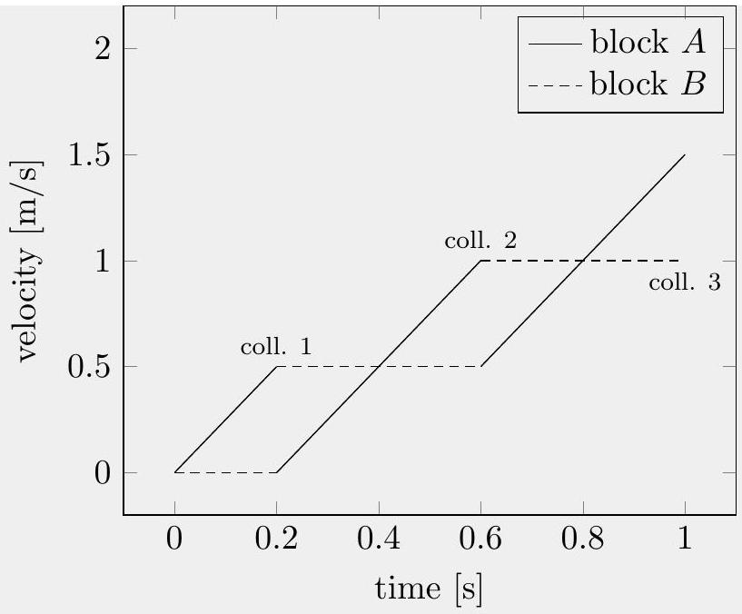
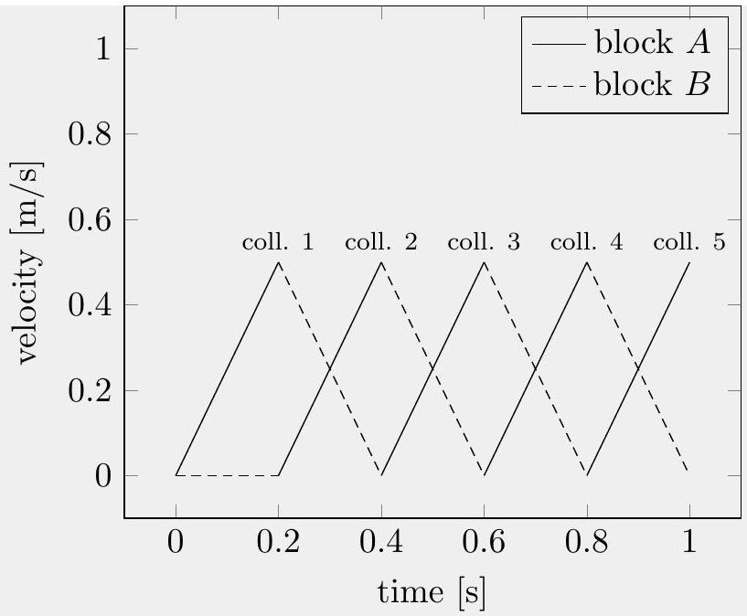

## Question A1

## Collision Course

Two blocks, $A$ and $B$, of the same mass are on a fixed inclined plane, which makes a 30° angle with the horizontal. At time $t = 0 , A$ is a distance $\ell = 5 \mathrm {~cm}$ along the incline above $B$, and both blocks are at rest. Suppose the coefficients of static and kinetic friction between the blocks and the incline are

$$
\mu _ { A } = \frac { \sqrt { 3 } } { 6 } , \quad \mu _ { B } = \frac { \sqrt { 3 } } { 3 } ,
$$

and that the blocks collide perfectly elastically. Let $v _ { A } ( t )$ and $v _ { B } ( t )$ be the speeds of the blocks down the incline. For this problem, use $g = 10 \mathrm {~m} / \mathrm { s } ^ { 2 }$, assume both blocks stay on the incline for the entire time, and neglect the sizes of the blocks.

a. Graph the functions $v _ { A } ( t )$ and $v _ { B } ( t )$ for $t$ from 0 to 1 second on the provided answer sheet, with a solid and dashed line respectively. Mark the times at which collisions occur.

## Solution

Draw a free-body diagram for both blocks and we can find that the acceleration of $A$ points down along the incline: $a _ { A } = g \sin \theta - \mu _ { A } g \cos \theta = \frac { 1 } { 2 } g - \frac { 1 } { 4 } g = 2.5 \mathrm {~m} / \mathrm { s } ^ { 2 }$. Similarly, $a _ { B } = g \sin \theta - \mu _ { B } g \cos \theta = 0$.
Let's first look at a qualitative picture of the collisions: When $A$ slides down the incline before colliding with $B$, it moves with acceleration. When the blocks collide, the total momentum of the system is conserved. Because $m _ { A } = m _ { B }$, the blocks exchange velocity, and thus $B$ slides down with constant velocity. After a momentary stop, $A$ will again accelerate down the incline, and catches up with $B$, and another collision occurs.

Quantitatively, the first collision happens when $A$ travels $\ell = 5 \mathrm {~cm} = 0.05 \mathrm {~m}$.

$$
t _ { 1 } = \sqrt { 2 \ell / a _ { A } } = 0.2 \mathrm {~s} ; \quad v _ { A 1 } = a _ { A } t _ { 1 } = 0.5 \mathrm {~m} / \mathrm { s }
$$

This is when $A$ and $B$ first collide. Then $B$ moves down the incline at constant velocity $v _ { B } = v _ { A _ { 1 } } = 0.5 \mathrm {~m} / \mathrm { s }$, while $A$ starts from rest and accelerates down the incline with $a _ { A } =$ $2.5 \mathrm {~m} / \mathrm { s } ^ { 2 }$, until catches up with $B$ at $t _ { 2 } = 0.6 \mathrm {~s}$. At that point,

$$
v _ { A 2 } = a _ { A } \left( t _ { 2 } - t _ { 1 } \right) = 1 \mathrm {~m} / \mathrm { s }
$$

Using a similar approach, we can find that at $t _ { 3 } = 1 \mathrm {~s}$.
Graphically, the $v _ { A / B } ( t )$ graphs during the first second are included below.

b. Derive an expression for the total distance block $A$ has moved from its original position right after its $n ^ { \text {th } }$ collision, in terms of $\ell$ and $n$.

## Solution

The easiest way to calculate the total distance after $n$ collisions is through the graph, namely the area enclosed by the blue line: When $n = 1$, the distance traveled is $d _ { A } ( 1 ) = \ell$, for $n = 2 , d _ { A } ( 2 ) = d _ { A } ( 1 ) + 4 \ell$, and so on, so

$$
d _ { A } ( n ) = \ell + 4 \ell + 8 \ell + \ldots + ( n - 1 ) \times 4 \ell = \ell \left( 2 n ^ { 2 } - 2 n + 1 \right) .
$$

Now suppose that the coefficient of block $B$ is instead $\mu _ { B } = \sqrt { 3 } / 2$, while $\mu _ { A } = \sqrt { 3 } / 6$ remains the same.

c. Again, graph the functions $v _ { A } ( t )$ and $v _ { B } ( t )$ for $t$ from 0 to 1 second on the provided answer sheet, with a solid and dashed line respectively. Mark the times at which collisions occur.

## Solution

In this case, $a _ { B } = - g / 4$. In other words, friction is larger than the component of gravity. Once $B$ moves, friction acts to stop it.
In this case, $A$ will again move down the incline and hit $B$ with $v _ { A 1 } = 0.5 \mathrm {~m} / \mathrm { s }$ at $t _ { 1 } = 0.2 \mathrm {~s}$. As $C$ moves with a deceleration of $g / 4 , A$ accelerates with the same magnitude, colliding again at $t _ { 2 } = 2 t _ { 1 }$, and the process repeats. The relevant graphs are shown below.

d. At time $t = 1 \mathrm {~s}$, how far has block $A$ moved from its original position?
Solution
Again, using the graph, it is easy to see that at $t = 1 \mathrm {~s} , A$ just finished the 5th collision, and the total distance it moved is: $5 \ell = 25 \mathrm {~cm}$.
