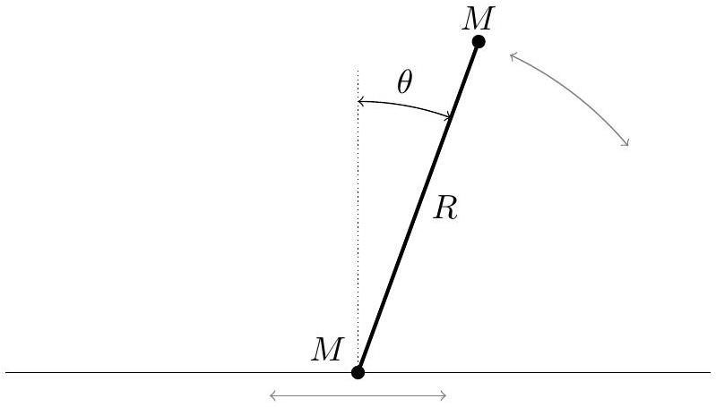
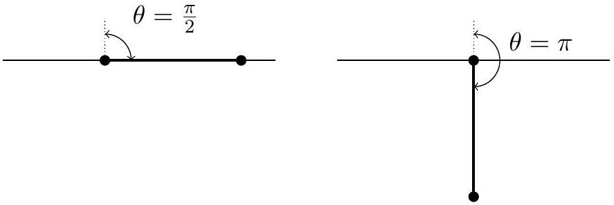
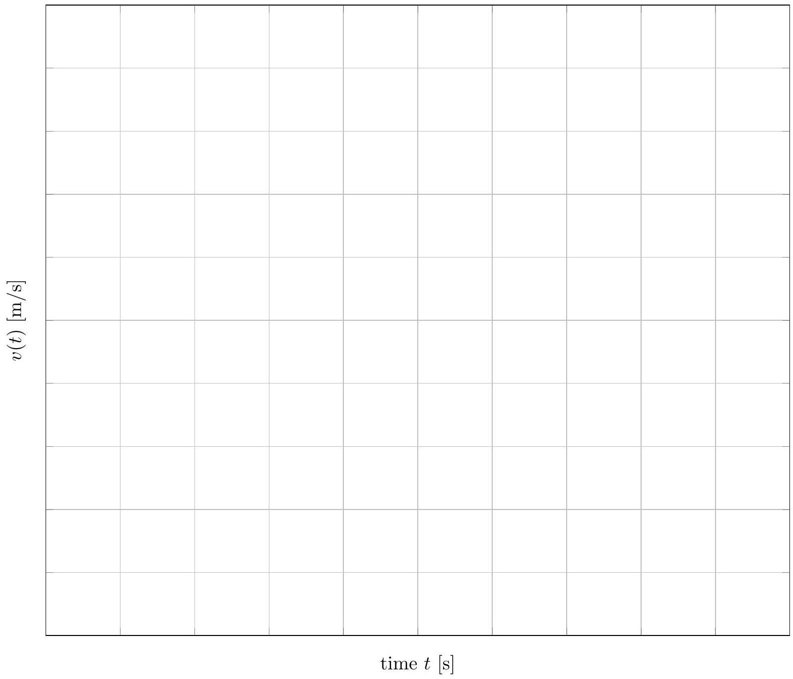

## Question B3

## Pitfall

A bead is placed on a horizontal rail, along which it can slide frictionlessly. It is attached to the end of a rigid, massless rod of length $R$. A ball is attached at the other end. Both the bead and the ball have mass $M$. The system is initially stationary, with the ball directly above the bead. The ball is then given an infinitesimal push, parallel to the rail.

Assume that the rod and ball are designed in such a way (not shown explicitly in the diagram) so that they can pass through the rail without hitting it. In other words, the rail only constrains the motion of the bead. Two subsequent states of the system are shown below.

a. Derive an expression for the force in the rod when it is horizontal, as shown at left above, and indicate whether it is tension or compression.

## Solution

Since this problem is subtle, we will present multiple solutions.
First solution: The motion of the rod can be decomposed as a superposition of rotation about the center of mass, and translation of the center of mass. We claim that the bead is stationary at this moment. To see this, note that the bead cannot have a vertical velocity component since it is fixed to the rod. Moreover, it cannot have a horizontal velocity component, because since the system experiences no external forces in the horizontal direction, the motion of the center of mass has no horizontal component.
Therefore, the bead is stationary, and since the released gravitational potential energy is $M g R$, the speed $v$ of the ball obeys

$$
\frac { 1 } { 2 } M v ^ { 2 } = M g R \quad \Rightarrow \quad v = \sqrt { 2 g R } .
$$

The motion of the system consists of a downward speed $v / 2$ of the center of mass, superposed

on a rotation about the center of mass which gives the masses speed $v / 2$.
Now consider the forces on the ball. The only horizontal force on the ball is the force in the rod, so we need to find the horizontal acceleration of the ball. Part of this is due to the centripetal force associated with the rotational motion,

$$
F = \frac { M ( v / 2 ) ^ { 2 } } { R / 2 } = M g .
$$

Another part of the ball's acceleration is due to the acceleration of the center of mass, but this is purely vertical and hence irrelevant here. A third part is due to the angular acceleration about the center of mass, but this also is associated with a vertical acceleration of the ball and hence irrelevant. Thus the force in the rod is just a tension

$$
T = M g .
$$

A common pitfall to think of the motion of the system as pure rotation about the bead, giving the incorrect answer $F = M v ^ { 2 } / R = 2 M g$. The reason this is incorrect is that, while it correctly describes the instantaneous velocity, to compute the acceleration one must also account for the acceleration of the instantaneous pivot point, which is not located at the bead for general times. It is possible to do this, but the computation is much more involved.

Second solution: While the first solution required only two lines of algebra, it also required careful reasoning. Here we present a more complicated, but more straightforward alternative. Let $x$ be the horizontal position of the bead. The position of the ball is

$$
\mathbf { r } = ( x + R \sin \theta , R \cos \theta ) .
$$

By conservation of momentum, the center of mass must be at the same horizontal position as it started, so

$$
2 x + R \sin \theta = 0 .
$$

Therefore, the position of the ball is

$$
\mathbf { r } = ( ( R / 2 ) \sin \theta , R \cos \theta ) .
$$

That is, it follows an ellipse whose major axis is twice the minor axis.
Differentiating this twice, the acceleration of the ball is

$$
a _ { x } = \frac { R } { 2 } \left( \alpha \cos \theta - \omega ^ { 2 } \sin \theta \right) , \quad a _ { y } = - R \left( \alpha \sin \theta + \omega ^ { 2 } \cos \theta \right) .
$$

In this case, $\theta = 90 ^ { \circ }$ and we are only interested in $a _ { x }$, giving

$$
a _ { x } = - \frac { R \omega ^ { 2 } } { 2 } .
$$

At this point, one needs to find $\omega ( \theta )$ using conservation of energy. Plugging in the result from either part (c) below or the first solution above gives $a _ { x } = - g$, which indicates a force of $M g$ to the left, and hence a tension in the rod. Incidentally, yet another solution is to

use $F = M v ^ { 2 } / R$ where $R$ is the instantaneous radius of curvature of the ellipse, which may be computed directly.
Third solution: We can work in the noninertial reference frame of the bead. In this frame, the ball simply rotates around the bead, with the naive centripetal force
$$
F = \frac { M v ^ { 2 } } { R } = 2 M g .
$$
However, since the tension accelerates the bead to the right, there is a fictitious force of magnitude $T$ pulling the ball to the left in this frame. The real tension force and the fictitious force add up to the centripetal force, so $T + T = F$, giving $T = M g$.
b. Derive an expression for the force in the rod when the ball is directly below the bead, as shown at right above, and indicate whether it is tension or compression.

## Solution

First solution: At this point the released gravitational potential energy is $2 M g R$, and both masses are moving horizontally with speed $v$, where

$$
2 \frac { 1 } { 2 } M v ^ { 2 } = 2 M g R \quad \Rightarrow \quad v = \sqrt { 2 g R } .
$$

Work in the frame moving to the right with speed $v$. In this frame the bead is stationary and the ball has velocity $2 v$ and is instantaneously rotating about the bead, so it must be experiencing a centripetal force

$$
\frac { M ( 2 v ) ^ { 2 } } { R } = 8 M g .
$$

Unlike in part (a), there are no additional contribution from the acceleration of the rotation center, because the bead can only ever accelerate horizontally, and the force in the rod at this moment is vertical. Since the ball also experiences a downward force of $M g$ due to gravity, the force in the rod is a tension

$$
T = 9 M g .
$$

Second solution: We can also solve the problem using the algebraic approach. Following what we found in the second solution to part (a),

$$
a _ { y } = - R \left( \alpha \sin \theta + \omega ^ { 2 } \cos \theta \right) = R \omega ^ { 2 } .
$$

Plugging in the result for $\omega ^ { 2 }$, one finds

$$
a _ { y } = 8 g
$$

which, as before, indicates a tension of $T = 9 M g$.
Third solution: Work in the original frame, where the masses are instantaneously rotating about the midpoint of the rod. Because of this motion, the ball must be experiencing a

centripetal force

$$
\frac { M v ^ { 2 } } { R / 2 } = 4 M g .
$$

This makes answering $5 M g$ a tempting pitfall; to get the right answer, we must also account for the vertical acceleration of the center of mass. The height of the center of mass is $y _ { \mathrm { CM } } = ( R / 2 ) \cos \theta$, so

$$
a _ { \mathrm { CM } } = \frac { d } { d t } \left( - \frac { R } { 2 } \omega \sin \theta \right) = - \frac { R } { 2 } \left( \omega ^ { 2 } \cos \theta + \alpha \sin \theta \right) .
$$

At this point, $\sin \theta = 0$ and $\cos \theta = - 1$, so

$$
a _ { \mathrm { CM } } = \frac { R } { 2 } \omega ^ { 2 } = \frac { v ^ { 2 } } { R / 2 } = 4 g
$$

where we used $v = \omega ( R / 2 )$. Therefore, the total upward acceleration of the ball is $8 g$, as we found earlier, so the force in the rod is a tension $T = 9 M g$.

In summary, there are many valid ways to arrive at the correct answers of $M g$ and $9 M g$, but all of them require careful thought. When this exam was given, only about 2\% of students successfully found these answers.

c. Let $\theta$ be the angle the rod makes with the vertical, so that the rod begins at $\theta = 0$. Find the angular velocity $\omega = d \theta / d t$ as a function of $\theta$.

## Solution

The height of the ball is $R \cos \theta$, so the released gravitational potential energy is

$$
M g R ( 1 - \cos \theta ) .
$$

The kinetic energy may be decomposed into rotation about the center of mass and translation of the center of mass; this translation is purely vertical by conservation of momentum. The vertical speed of the center of mass is $( R / 2 ) \omega \sin \theta$, so the kinetic energy is

$$
\frac { 1 } { 2 } I \omega ^ { 2 } + \frac { 1 } { 2 } ( 2 M ) v _ { \mathrm { CM } } ^ { 2 } = \frac { 1 } { 4 } M R ^ { 2 } \omega ^ { 2 } + \frac { 1 } { 4 } M R ^ { 2 } \omega ^ { 2 } \sin ^ { 2 } \theta .
$$

Equating these two expressions and simplifying gives

$$
\omega ^ { 2 } = \frac { 4 g } { R } \frac { 1 - \cos \theta } { 1 + \sin ^ { 2 } \theta } .
$$

Some students instead treated the motion of the bead and ball separately; this can lead to the correct answer, but it is easy to make a mistake. Another common route was to apply Lagrangian mechanics, solving the Euler-Lagrange equations, or equivalently to solve the $F = m a$ equations. These are quite complicated, and nobody managed to integrate them to get the correct answer.

## Answer Sheets

Following are answer sheets for the graphing portion of Problem A1.

Student AAPT ID \#:

Proctor AAPT ID \#:
A1: Collision Course
(a)

| [s/uu] (7) ${ } ^ { a }$   E.EDED |  |  |  |  |  |  |  |  |  |  |
| :--- | :--- | :--- | :--- | :--- | :--- | :--- | :--- | :--- | :--- | :--- |
|  |  |  |  |  |  |  |  |  |  |  |
|  |  |  |  |  |  |  |  |  |  |  |
|  |  |  |  |  |  |  |  |  |  |  |
|  |  |  |  |  |  |  |  |  |  |  |
|  |  |  |  |  |  |  |  |  |  |  |
|  |  |  |  |  |  |  |  |  |  |  |
|  |  |  |  |  |  |  |  |  |  |  |
|  |  |  |  |  |  |  |  |  |  |  |
|  |  |  |  |  |  |  |  |  |  |  |
|  | time $t$ [s] |  |  |  |  |  |  |  |  |  |  |

Student AAPT ID \#:

Proctor AAPT ID \#:

(c)

[^0]:    ${ } ^ { 1 }$ This question inspired by De Vos, Alexis, and Guust Flater, American Journal of Physics 59.8 (1991): 751-754.

[^1]:    ${ } ^ { 2 }$ This question inspired by Partenskii and Jordan, Physical Review E 80, 011112 (2009).
