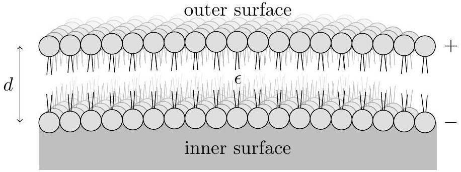
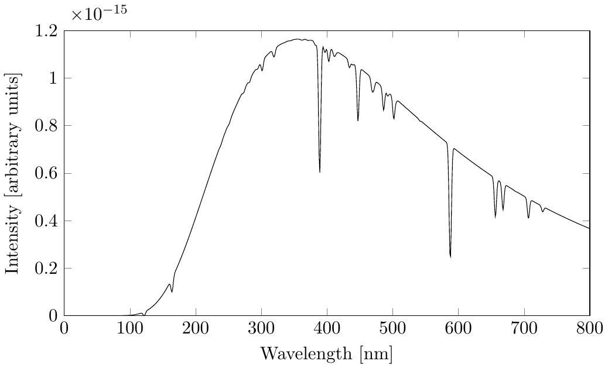

USA Physics Olympiad Exam
DO NOT DISTRIBUTE THIS PAGE
Important Instructions for the Exam Supervisor

- This examination consists of two parts. Part A has three questions and is allowed 90 minutes. Part B also has three questions and is allowed 90 minutes.
- Divide the exam paper into 4 parts: the instructions (pages 2-3), Part A (pages 4-12), Part B (pages 14-23), and answer sheets for one of the questions in Part A (pages 25-26). The exam should be printed single-sided to facilitate dividing the test and scanning the answer sheets.
- Provide students with the instructions for the competition (pages 2-3). Students can keep the pages for both parts of the exam, as they contain a reference list of physical constants.
- Provide students with blank sheets of paper as scratch paper. Students are not allowed to bring their own papers.
- Then provide students with Part A and the associated answer sheets, and allow 90 minutes to complete Part A. Do not give students Part B during this time, even if they finish with time remaining. At the end of the 90 minutes, collect the solutions to Part A along with the answer sheets and questions.
- Students are allowed a 10 to 15 minute break between Parts A and B. Then allow 90 minutes to complete Part B. Do not let students go back to Part A.
- At the end of the exam, the supervisor must collect all papers, including the questions, the instructions, and any scratch paper used by the students. Students may not take the exam questions. The examination questions may be returned to the students after April 8th, 2019.
- Students are allowed calculators, but they may not use symbolic math, programming, or graphical features of these calculators. Calculators may not be shared and their memory must be cleared of data and programs. Cell phones, PDAs, or cameras may not be used during the exam or while the exam papers are present. Students may not use any tables, books, or collections of formulas.

We acknowledge the following people for their contributions to this year's exam (in alphabetical order):
JiaJia Dong, Abijith Krishnan, Brian Skinner, and Kevin Zhou.

USA Physics Olympiad Exam
Instructions for the Student
DO NOT OPEN THIS TEST UNTIL YOU ARE TOLD TO BEGIN

- At the beginning of the exam, you shall be provided with the instruction sheets, blank papers (both for your answers and scratch work), and the exam packet.
- Work on Part A first. You have 90 minutes to complete three problems. Each question is worth 25 points, but they are not necessarily of the same difficulty. Do not look at Part B during this time.
- After you have completed Part A you may take a break. You may consider checking your answers to Part A with the remaining time as you will not be allowed to return to Part A once you start Part B.
- Then work on Part B. You have 90 minutes to complete three problems. Each question is worth 25 points. Do not look at Part A during this time.
- Show your work and reasoning. Partial credit will be given if you make your reasoning clear. Do not write on the back of any page. Further guidance is given on the next page.
- A hand-held calculator may be used. Its memory must be cleared of data and programs. You may use only the basic functions found on a simple scientific calculator. Calculators may not be shared. Cell phones, PDAs or cameras may not be used during the exam or while the exam papers are present. You may not use any tables, books, or collections of formulas.
- In order to maintain exam security, do not communicate any information about the questions of this exam, or their solutions until after April 8th, 2019.

Possibly useful information. You may use this sheet for both parts of the exam.

$$
\begin{aligned}
& g = 9.8 \mathrm {~N} / \mathrm { kg } \\
& k = 1 / 4 \pi \epsilon _ { 0 } = 8.99 \times 10 ^ { 9 } \mathrm {~N} \cdot \mathrm {~m} ^ { 2 } / \mathrm { C } ^ { 2 } \\
& c = 3.00 \times 10 ^ { 8 } \mathrm {~m} / \mathrm { s } \\
& N _ { \mathrm { A } } = 6.02 \times 10 ^ { 23 } ( \mathrm {~mol} ) ^ { - 1 } \\
& \sigma = 5.67 \times 10 ^ { - 8 } \mathrm {~J} / \left( \mathrm { s } \cdot \mathrm {~m} ^ { 2 } \cdot \mathrm {~K} ^ { 4 } \right) \\
& 1 \mathrm { eV } = 1.602 \times 10 ^ { - 19 } \mathrm {~J} \\
& m _ { e } = 9.109 \times 10 ^ { - 31 } \mathrm {~kg} = 0.511 \mathrm { MeV } / \mathrm { c } ^ { 2 } \\
& \sin \theta \approx \theta - \theta ^ { 3 } / 6 \text { for } | \theta | \ll 1
\end{aligned}
$$

$$
\begin{aligned}
& G = 6.67 \times 10 ^ { - 11 } \mathrm {~N} \cdot \mathrm {~m} ^ { 2 } / \mathrm { kg } ^ { 2 } \\
& k _ { \mathrm { m } } = \mu _ { 0 } / 4 \pi = 10 ^ { - 7 } \mathrm {~T} \cdot \mathrm {~m} / \mathrm { A } \\
& k _ { \mathrm { B } } = 1.38 \times 10 ^ { - 23 } \mathrm {~J} / \mathrm { K } \\
& R = N _ { \mathrm { A } } k _ { \mathrm { B } } = 8.31 \mathrm {~J} / ( \mathrm { mol } \cdot \mathrm {~K} ) \\
& e = 1.602 \times 10 ^ { - 19 } \mathrm { C } \\
& h = 6.63 \times 10 ^ { - 34 } \mathrm {~J} \cdot \mathrm {~s} = 4.14 \times 10 ^ { - 15 } \mathrm { eV } \cdot \mathrm {~s} \\
& ( 1 + x ) ^ { n } \approx 1 + n x \text { for } | x | \ll 1 \\
& \cos \theta \approx 1 - \theta ^ { 2 } / 2 \text { for } | \theta | \ll 1
\end{aligned}
$$

Following is some further guidance on formatting your solutions. Start each question on a new sheet of paper. Put your AAPT ID number, your proctor's AAPT ID number, the problem number and the page number and total number of pages for this problem, in the upper right hand corner of each page. As an example, the second page of your solution to B3 might look as follows.
student AAPT \#29485
proctor AAPT \#1038
B3: 2/2

Remember to also write the AAPT ID numbers on the provided answer sheets. Write singlesided to facilitate scanning. You may use either pencil or pen, but in either case, make sure to write sufficiently clearly so your work will be legible after scanning. To preserve anonymity of grading, do not write your name on any sheet.

End of Instructions for the Student

DO NOT OPEN THIS TEST UNTIL YOU ARE TOLD TO BEGIN

Copyright ©2019 American Association of Physics Teachers

## Part A

## Question A1

## Collision Course

Two blocks, $A$ and $B$, of the same mass are on a fixed inclined plane, which makes a 30° angle with the horizontal. At time $t = 0 , A$ is a distance $\ell = 5 \mathrm {~cm}$ along the incline above $B$, and both blocks are at rest. Suppose the coefficients of static and kinetic friction between the blocks and the incline are

$$
\mu _ { A } = \frac { \sqrt { 3 } } { 6 } , \quad \mu _ { B } = \frac { \sqrt { 3 } } { 3 } ,
$$

and that the blocks collide perfectly elastically. Let $v _ { A } ( t )$ and $v _ { B } ( t )$ be the speeds of the blocks down the incline. For this problem, use $g = 10 \mathrm {~m} / \mathrm { s } ^ { 2 }$, assume both blocks stay on the incline for the entire time, and neglect the sizes of the blocks.

a. Graph the functions $v _ { A } ( t )$ and $v _ { B } ( t )$ for $t$ from 0 to 1 second on the provided answer sheet, with a solid and dashed line respectively. Mark the times at which collisions occur.

## Solution

Draw a free-body diagram for both blocks and we can find that the acceleration of $A$ points down along the incline: $a _ { A } = g \sin \theta - \mu _ { A } g \cos \theta = \frac { 1 } { 2 } g - \frac { 1 } { 4 } g = 2.5 \mathrm {~m} / \mathrm { s } ^ { 2 }$. Similarly, $a _ { B } = g \sin \theta - \mu _ { B } g \cos \theta = 0$.
Let's first look at a qualitative picture of the collisions: When $A$ slides down the incline before colliding with $B$, it moves with acceleration. When the blocks collide, the total momentum of the system is conserved. Because $m _ { A } = m _ { B }$, the blocks exchange velocity, and thus $B$ slides down with constant velocity. After a momentary stop, $A$ will again accelerate down the incline, and catches up with $B$, and another collision occurs.

Quantitatively, the first collision happens when $A$ travels $\ell = 5 \mathrm {~cm} = 0.05 \mathrm {~m}$.

$$
t _ { 1 } = \sqrt { 2 \ell / a _ { A } } = 0.2 \mathrm {~s} ; \quad v _ { A 1 } = a _ { A } t _ { 1 } = 0.5 \mathrm {~m} / \mathrm { s }
$$

This is when $A$ and $B$ first collide. Then $B$ moves down the incline at constant velocity $v _ { B } = v _ { A _ { 1 } } = 0.5 \mathrm {~m} / \mathrm { s }$, while $A$ starts from rest and accelerates down the incline with $a _ { A } =$ $2.5 \mathrm {~m} / \mathrm { s } ^ { 2 }$, until catches up with $B$ at $t _ { 2 } = 0.6 \mathrm {~s}$. At that point,

$$
v _ { A 2 } = a _ { A } \left( t _ { 2 } - t _ { 1 } \right) = 1 \mathrm {~m} / \mathrm { s }
$$

Using a similar approach, we can find that at $t _ { 3 } = 1 \mathrm {~s}$.
Graphically, the $v _ { A / B } ( t )$ graphs during the first second are included below.

b. Derive an expression for the total distance block $A$ has moved from its original position right after its $n ^ { \text {th } }$ collision, in terms of $\ell$ and $n$.

## Solution

The easiest way to calculate the total distance after $n$ collisions is through the graph, namely the area enclosed by the blue line: When $n = 1$, the distance traveled is $d _ { A } ( 1 ) = \ell$, for $n = 2 , d _ { A } ( 2 ) = d _ { A } ( 1 ) + 4 \ell$, and so on, so

$$
d _ { A } ( n ) = \ell + 4 \ell + 8 \ell + \ldots + ( n - 1 ) \times 4 \ell = \ell \left( 2 n ^ { 2 } - 2 n + 1 \right) .
$$

Now suppose that the coefficient of block $B$ is instead $\mu _ { B } = \sqrt { 3 } / 2$, while $\mu _ { A } = \sqrt { 3 } / 6$ remains the same.

c. Again, graph the functions $v _ { A } ( t )$ and $v _ { B } ( t )$ for $t$ from 0 to 1 second on the provided answer sheet, with a solid and dashed line respectively. Mark the times at which collisions occur.

## Solution

In this case, $a _ { B } = - g / 4$. In other words, friction is larger than the component of gravity. Once $B$ moves, friction acts to stop it.
In this case, $A$ will again move down the incline and hit $B$ with $v _ { A 1 } = 0.5 \mathrm {~m} / \mathrm { s }$ at $t _ { 1 } = 0.2 \mathrm {~s}$. As $C$ moves with a deceleration of $g / 4 , A$ accelerates with the same magnitude, colliding again at $t _ { 2 } = 2 t _ { 1 }$, and the process repeats. The relevant graphs are shown below.

d. At time $t = 1 \mathrm {~s}$, how far has block $A$ moved from its original position?
Solution
Again, using the graph, it is easy to see that at $t = 1 \mathrm {~s} , A$ just finished the 5th collision, and the total distance it moved is: $5 \ell = 25 \mathrm {~cm}$.

Question A2
Green Revolution ${ } ^ { 1 }$
In this problem, we will investigate a simple thermodynamic model for the conversion of solar energy into wind. Consider a planet of radius $R$, and assume that it rotates so that the same side always faces the Sun. The bright side facing the Sun has a constant uniform temperature $T _ { 1 }$, while the dark side has a constant uniform temperature $T _ { 2 }$. The orbit radius of the planet is $R _ { 0 }$, the Sun has temperature $T _ { s }$, and the radius of the Sun is $R _ { s }$. Assume that outer space has zero temperature, and treat all objects as ideal blackbodies.

a. Find the solar power $P$ received by the bright side of the planet. (Hint: the Stefan-Boltzmann law states that the power emitted by a blackbody with area $A$ is $\sigma A T ^ { 4 }$.)

Solution
The intensity of solar radiation at the surface of the sun is $\sigma T _ { s } ^ { 4 }$, so the intensity at the planet's orbit radius is

$$
I = \sigma T _ { s } ^ { 4 } \frac { R _ { s } ^ { 2 } } { R _ { 0 } ^ { 2 } } .
$$

The area subtended by the planet is $\pi R ^ { 2 }$, so

$$
P = \pi \sigma T _ { s } ^ { 4 } \frac { R ^ { 2 } R _ { s } ^ { 2 } } { R _ { 0 } ^ { 2 } } .
$$

In order to keep both $T _ { 1 }$ and $T _ { 2 }$ constant, heat must be continually transferred from the bright side to the dark side. By viewing the two hemispheres as the two reservoirs of a reversible heat engine, work can be performed from this temperature difference, which appears in the form of wind power. For simplicity, we assume all of this power is immediately captured and stored by windmills.

b. The equilibrium temperature ratio $T _ { 2 } / T _ { 1 }$ depends on the heat transfer rate between the hemispheres. Find the minimum and maximum possible values of $T _ { 2 } / T _ { 1 }$. In each case, what is the wind power $P _ { w }$ produced?

Solution
The minimum value is simply zero; in this case zero heat is transferred to the dark side of the planet. Since no heat is transferred, the heat engine can't run, so $P _ { w } = 0$. (To show this a bit more carefully, note that the entropy exhausted by the heat engine is $Q _ { 2 } / T _ { 2 } \propto T _ { 2 } ^ { 3 }$ by the Stefan-Boltzmann law. In the limit $T _ { 2 } \rightarrow 0$, the entropy out goes to zero, so the entropy in and hence the heat intake also goes to zero.)

The maximum value is $T _ { 2 } / T _ { 1 } = 1$. It cannot be any higher by the second law of thermodynamics. In this case, there is no temperature difference, so the heat engine has zero efficiency and $P _ { w } = 0$. Power $P / 2$ is simply transferred from the bright side to the dark side as heat.

c. Find the wind power $P _ { w }$ in terms of $P$ and the temperature ratio $T _ { 2 } / T _ { 1 }$.
[^0]

## Solution

Let heat be transferred from the bright side at a rate $Q _ { 1 }$ and transferred to the dark side at a rate $Q _ { 2 }$. Then by conservation of energy,

$$
Q _ { 1 } = P _ { w } + Q _ { 2 } .
$$

Since the two hemispheres have constant temperatures, energy balance for each gives

$$
P = Q _ { 1 } + \left( 2 \pi R ^ { 2 } \sigma \right) T _ { 1 } ^ { 4 } , \quad Q _ { 2 } = A T _ { 2 } ^ { 4 } .
$$

Finally, since the engine is reversible,

$$
\frac { Q _ { 1 } } { T _ { 1 } } = \frac { Q _ { 2 } } { T _ { 2 } } .
$$

By combining the first three equations, and defining $x = T _ { 2 } / T _ { 1 }$, we have

$$
P _ { w } = Q _ { 1 } - Q _ { 2 } = P - \left( 2 \pi R ^ { 2 } \sigma \right) \left( T _ { 1 } ^ { 4 } + T _ { 2 } ^ { 4 } \right) = P - \left( 2 \pi R ^ { 2 } \sigma \right) T _ { 1 } ^ { 4 } \left( 1 + x ^ { 4 } \right) .
$$

This is not yet in terms of $P$ and $x$, so now we use the reversibility condition,

$$
\frac { P - A T _ { 1 } ^ { 4 } } { T _ { 1 } } = \frac { A T _ { 2 } ^ { 4 } } { T _ { 2 } }
$$

which simplifies to

$$
P = \left( 2 \pi R ^ { 2 } \sigma \right) \left( T _ { 1 } ^ { 4 } + T _ { 1 } T _ { 2 } ^ { 3 } \right) = \left( 2 \pi R ^ { 2 } \sigma \right) T _ { 1 } ^ { 4 } \left( 1 + x ^ { 3 } \right) .
$$

Plugging this in above, we find

$$
P _ { w } = P - \frac { P } { 1 + x ^ { 3 } } \left( 1 + x ^ { 4 } \right) = \frac { x ^ { 3 } ( 1 - x ) } { 1 + x ^ { 3 } } P .
$$

d. Estimate the maximum possible value of $P _ { w }$ as a fraction of $P$, to one significant figure. Briefly explain how you obtained this estimate.

## Solution

There are many ways to get the required answer. For example, by sketching the function, one can see that there is a unique maximum at an intermediate value of $x$, and furthermore that this maximum is at $x > 0.5$, because of the rapid rise of the $x ^ { 3 }$ factor. One could then compute $P _ { w } / P$ with a calculator at a few trial values such as $x = 0.5,0.7,0.9$, which are already enough to get the desired accuracy.
The optimum value is $x = 0.69$, at which point

$$
P _ { w } ^ { \max } = 0.077 P .
$$

Hence in this model, at most 7.7\% of solar energy can be converted into wind energy. Any answer within 15\% of this value was accepted.

Question A3
Electric Slide
Two large parallel plates of area $A$ are placed at $x = 0$ and $x = d \ll \sqrt { A }$ in a semiconductor medium. The plate at $x = 0$ is grounded, and the plate at $x = d$ is at a fixed potential $- V _ { 0 }$, where $V _ { 0 } > 0$. Particles of positive charge $q$ flow between the two plates. You may neglect any dielectric effects of the medium.

a. For large $V _ { 0 }$, the velocity of the positive charges is determined by a strong drag force, so that
$$
v = \mu E
$$
where $E$ is the local electric field and $\mu$ is the charge mobility.
    i. In the steady state, there is a nonzero but time-independent density of charges between the two plates. Let the charge density at position $x$ be $\rho ( x )$. Use charge conservation to find a relationship between $\rho ( x ) , v ( x )$, and their derivatives.

Solution
In the steady state, the current is the same everywhere. Consider the region $( x , x + d x )$. The time it takes for the charge in the second region to leave is $\frac { \mathrm { d } x } { v ( x ) }$. The amount of charge that leaves is $\rho A \mathrm {~d} x$. The current is thus given by $\rho A v$, so $\rho v$ is constant. Alternatively, one can write this as

$$
v \frac { \mathrm {~d} \rho } { \mathrm {~d} x } + \rho \frac { \mathrm { d } v } { \mathrm {~d} x } = 0 .
$$

Both forms were accepted.

ii. Let $V ( x )$ be the electric potential at $x$. Derive an expression relating $\rho ( x ) , V ( x )$, and their derivatives. (Hint: start by using Gauss's law to relate the charge density $\rho ( x )$ to the derivative of the electric field $E ( x )$.)

Solution
Let us find an expression for the electric field at position $x$. The position $x$ is effectively in between two uniform sheets of charge density. The sheet on the left has charge density $\int _ { 0 } ^ { x } \rho \mathrm {~d} x + \sigma _ { 0 }$, where $\sigma _ { 0 }$ is the charge density on the left plate, and the sheet on the right has charge density $\int _ { x } ^ { d } \rho \mathrm {~d} x + \sigma _ { d }$, where $\sigma _ { d }$ is the charge density on the left plate. Then, the electric field is given by

$$
E = \sigma _ { 0 } / \left( 2 \epsilon _ { 0 } \right) + \int _ { 0 } ^ { x } \rho / \left( 2 \epsilon _ { 0 } \right) \mathrm { d } x - \int _ { x } ^ { d } \rho / \left( 2 \epsilon _ { 0 } \right) \mathrm { d } x - \sigma _ { d } / \left( 2 \epsilon _ { 0 } \right) .
$$

Then, by the Fundamental Theorem of Calculus

$$
\frac { d E } { d x } = \frac { \rho } { \epsilon _ { 0 } } ,
$$

so
$$
\frac { d ^ { 2 } V } { d x ^ { 2 } } = - \frac { \rho } { \epsilon _ { 0 } } .
$$
This can also be derived from the differential form of Gauss's Law more easily and is known as Poisson's equation.
iii. Suppose that in the steady state, conditions have been established so that $V ( x )$ is proportional to $x ^ { b }$, where $b$ is an exponent you must find, and the current is nonzero. Derive an expression for the current in terms of $V _ { 0 }$ and the other given parameters.

## Solution

We have that

$$
\rho \frac { d v } { d x } + v \frac { d \rho } { d x } = 0
$$

and now that $v = - \mu \frac { d V } { d x }$, so substituting in Poisson's equation gives us that

$$
\left( \frac { d ^ { 2 } V } { d x ^ { 2 } } \right) ^ { 2 } + \frac { d V } { d x } \left( \frac { d ^ { 3 } V } { d x ^ { 3 } } \right) = 0 .
$$

Using $V ( x ) = - V _ { 0 } ( x / d ) ^ { b }$ gives

$$
b ( b - 1 ) b ( b - 1 ) = - b b ( b - 1 ) ( b - 2 ) .
$$

The solution with $b = 0$ cannot satisfy the boundary conditions, while $b = 1$ has zero current. Assuming $b$ is neither of these values, we have $b - 1 = - ( b - 2 )$, so $b = 3 / 2$. Substituting gives

$$
v = - \frac { 3 V _ { 0 } \mu x ^ { 1 / 2 } } { 2 d ^ { 3 / 2 } }
$$

and

$$
\rho = - \frac { 3 V _ { 0 } \epsilon _ { 0 } } { 4 d ^ { 3 / 2 } x ^ { 1 / 2 } } ,
$$

so

$$
I = \rho A v = \frac { 9 \epsilon _ { 0 } \mu A V _ { 0 } ^ { 2 } } { 8 d ^ { 3 } } ,
$$

with the current flowing from left to right.

b. For small $V _ { 0 }$, the positive charges move by diffusion. The current due to diffusion is given by Fick's Law,
$$
I = - A D \frac { \mathrm {~d} \rho } { \mathrm {~d} x } .
$$
Here, $D$ is the diffusion constant, which you can assume to be described by the Einstein relation
$$
D = \frac { \mu k _ { B } T } { q } ,
$$
where $T$ is the temperature of the system.

i. Assume that in the steady state, conditions have been established so that a nonzero, steady current flows, and the electric potential again satisfies $V ( x ) \propto x ^ { b ^ { \prime } }$, where $b ^ { \prime }$ is another exponent you must find. Derive an expression for the current in terms of $V _ { 0 }$ and the other given parameters.

## Solution

We again have that $V ( x ) = V _ { 0 } ( x / d ) ^ { b }$. Note that from Poisson's equation, $\frac { d \rho } { d x } = - \epsilon _ { 0 } \frac { d ^ { 3 } V } { d x ^ { 3 } }$, so we need $b = 3$ for this expression to be constant. Therefore,

$$
I = \frac { 6 \mu k _ { B } T A \epsilon _ { 0 } V _ { 0 } } { q d ^ { 3 } } .
$$

ii. At roughly what voltage $V _ { 0 }$ does the system transition from this regime to the high voltage regime of the previous part?

## Solution

We find the crossover voltage by equating our answers in previous parts, to get

$$
\frac { 6 \mu k _ { B } T A \epsilon _ { 0 } V _ { 0 } } { q d ^ { 3 } } = \frac { 9 \epsilon _ { 0 } \mu A V _ { 0 } ^ { 2 } } { 8 d ^ { 3 } } ,
$$

or

$$
V _ { 0 } = \frac { 16 k _ { B } T } { 3 q } .
$$

## STOP: Do Not Continue to Part B

If there is still time remaining for Part A, you should review your work for Part A, but do not continue to Part B until instructed by your exam supervisor.

Once you start Part B, you will not be able to return to Part A.

## Part B

## Question B1

## Strain in the Membrane ${ } ^ { 2 }$

The wall of a neuron is made from an elastic membrane, which resists compression in the same way as a spring. It has an effective spring constant $k$ and an equilibrium thickness $d _ { 0 }$. Assume that the membrane has a very large area $A$ and negligible curvature.

The neuron has "ion pumps" that can move ions across the membrane. In the resulting charged state, positive and negative ionic charge is arranged uniformly along the outer and inner surfaces of the membrane, respectively. The permittivity of the membrane is $\epsilon$.

a. Suppose that, after some amount of work is done by the ion pumps, the charges on the outer and inner surfaces are $Q$ and $- Q$, respectively. What is the thickness $d$ of the membrane?

## Solution

One charge layer by itself creates an electric field $E _ { 1 } = Q / ( 2 \epsilon A )$ in each direction. So the force between the two sides of the membrane $F _ { E } = Q E _ { 1 } = Q ^ { 2 } / ( 2 \epsilon A )$.
This electric force is balanced by the spring force $F _ { s } = k x$, where $x = d _ { 0 } - d$. Equating these two forces and solving for $d$ gives gives

$$
d = d _ { 0 } - \frac { Q ^ { 2 } } { 2 \epsilon A k } .
$$

b. Derive an expression for the voltage difference $V$ between the outer and inner surfaces of the membrane in terms of $Q$ and the other parameters given.

## Solution

The electric field inside the membrane (as produced by both the left and right plates) is $E = Q / \left( \epsilon _ { 0 } \kappa A \right)$. So the voltage between them is

$$
V = E d = \frac { Q } { \epsilon A } d .
$$

[^1]
Inserting the expression for $Q$ from part (a) gives

$$
V = \frac { Q } { \epsilon A } \left( d _ { 0 } - \frac { Q ^ { 2 } } { 2 \epsilon A k } \right) .
$$

This equation implies that as the charge $Q$ is increased, the voltage first increases and then decreases again.

c. Suppose that the ion pumps are first turned on in the uncharged state, and the membrane is charged very slowly (quasistatically). The pumps will only turn off when the voltage difference across the membrane becomes larger than a particular value $V _ { \text {th } }$. How large must the spring constant $k$ be so that the ion pumps turn off before the membrane collapses?

## Solution

The voltage $V$ first increases and then decreases as a function of $Q$, which implies that there is a maximum voltage $V _ { \text {max } }$ to which the membrane can be charged. This voltage can be found by taking the derivative $d V / d Q$ and setting it equal to zero. This procedure gives

$$
V _ { \max } = \sqrt { \frac { k d _ { 0 } ^ { 3 } } { \epsilon A } } \left( \frac { 2 } { 3 } \right) ^ { 3 / 2 } .
$$

The corresponding charge at the maximum voltage is given by

$$
Q _ { \mathrm { V } \text { max } } ^ { 2 } = \frac { 2 } { 3 } \epsilon A k d _ { 0 } .
$$

For the ion pumps to turn off, we must have $V _ { \text {max } } > V _ { \text {th } }$. Otherwise the pumps will continue to move charge across the membrane until it collapses. Setting $V _ { \text {max } } > V _ { \text {th } }$ and solving for $k$ gives

$$
k > \left( \frac { 3 } { 2 } \right) ^ { 3 } \frac { V _ { \mathrm { th } } ^ { 2 } \epsilon A } { d _ { 0 } ^ { 3 } } .
$$

d. How much work is done by the ion pumps in each of the following situations? Express your answers in terms of $k$ and $d _ { 0 }$.
    i. $k$ is infinitesimally larger than the value derived in part (c).

## Solution

If $k$ is larger than the value in part (c), then the threshold voltage $V _ { \text {th } } > V _ { \text {max } }$, and the ion pumps turn off before the membrane thickness $d$ reaches zero. The work $W$ done by the ion pumps is equal to the potential energy of the system relative to the uncharged state (with $Q = 0$ and $d = 0$ ). That is, $W = \frac { 1 } { 2 } k x ^ { 2 } + Q ^ { 2 } / ( 2 C )$, where $C = \epsilon A / d$ is the capacitance of the membrane. Writing this equation in terms of $Q$ gives $W = Q ^ { 2 } d _ { 0 } / ( 2 \epsilon A ) - Q ^ { 4 } / \left( 8 \epsilon ^ { 2 } A ^ { 2 } k \right)$.
$k$ being infinitesimally larger than the critical value means that the ion pumps turn off just as the voltage maximum $V _ { \text {th } }$ is reached. At this point the charge $Q$ approaches

$Q _ { \text {Vmax } }$, derived in the previous answer. Inserting the value into the expression for $W$ gives

$$
W = \frac { 5 } { 18 } k d _ { 0 } ^ { 2 } .
$$

ii. $k$ is infinitesimally smaller than the value derived in part (c).

## Solution

If $k$ is smaller than the value in part (c), then the threshold voltage is larger than the stopping voltage $V _ { \text {th } }$, and the ion pumps continue to work until the membrane collapses to $d = 0$. At this point there is no electrostatic energy in the membrane (the membrane capacitance is infinite), and

$$
W = \frac { 1 } { 2 } k d _ { 0 } ^ { 2 } .
$$

Assume in each case that the membrane thickness $d$ cannot become negative.

## Question B2

## Stellar Black Box

Scientists have recently detected a new star, the MAR-Kappa. The star is almost a perfect blackbody, and its measured light spectrum is shown below.

The total measured light intensity from MAR-Kappa is $I = 1.12 \times 10 ^ { - 8 } \mathrm {~W} / \mathrm { m } ^ { 2 }$. The mass of MAR-Kappa is estimated to be $3.5 \times 10 ^ { 30 } \mathrm {~kg}$. It is stationary relative to the sun. You may find the Stefan-Boltzmann law useful, which states the power emitted by a blackbody with area $A$ is $\sigma A T ^ { 4 }$.

## Solution

Note: because a range of answers were accepted for part (a), credit was given for later subparts if they were consistent with the value given in part (a).

a. The spectrum of wavelengths $\lambda$ emitted from a blackbody only depends on $h , c , k _ { B } , \lambda$, and $T$. Given that the sun has a surface temperature of 5778 K and peak emission at 500 nm , what is the approximate surface temperature of MAR-Kappa?

## Solution

By dimensional analysis, we have two energy scales $- h c / \lambda$ and $k _ { B } T$. Then, we have that $h c / \lambda _ { \text {max } } \propto k _ { B } T$. The diagram has a peak around 360 nm , so, because $\lambda \propto T ^ { - 1 }$, we see a peak around 8030 K. We accepted any answer within ±500 K of 8000 K.

b. The "lines" in the spectrum result from atoms in the star absorbing specific wavelengths of the emitted light. One contribution to the width of the spectral lines is the Doppler shift associated with the thermal motion of the atoms in the star. The spectral line at $\lambda = 389 \mathrm {~nm}$ is due to helium. Estimate to within an order of magnitude the thermal broadening $\Delta \lambda$ of this line. The mass of a helium atom is $6.65 \times 10 ^ { - 27 } \mathrm {~kg}$.

## Solution

The rms velocity of the atoms in the star, in the direction towards Earth, is about $\sqrt { \frac { k _ { B } T } { m } } =$ $4080 \mathrm {~m} / \mathrm { s }$. The red shift is thus $\frac { v } { c } \approx 1.4 \times 10 ^ { - 5 }$, and so $\Delta \mathrm { 人 } \approx 5.3 \times 10 ^ { - 3 } \mathrm {~nm}$. This thermal broadening is very insignificant.

c. Over the course of a year, MAR-Kappa appears to oscillate between two positions in the background night sky, which are an angular distance of $1.6 \times 10 ^ { - 6 }$ rad apart. How far away is MAR-Kappa? Assume that MAR-Kappa lies in the same plane as the Earth's orbit, which is circular with radius $1.5 \times 10 ^ { 11 } \mathrm {~m}$.

## Solution

This is a parallax effect, as shown in the below diagram:

The angle Earth makes with MAR-Kappa is the angular shift it makes in the night sky. Then we have that $D = R _ { E S } / ( \theta / 2 ) = 1.9 \times 10 ^ { 17 } \mathrm {~m}$.

d. What is the radius of MAR-Kappa?

## Solution
The luminosity (total power given off by the star) is given by
$$
4 \pi D ^ { 2 } I = L = 4 \pi \left( 1.9 \times 10 ^ { 17 } \mathrm {~m} \right) ^ { 2 } \cdot \left( 1.12 \times 10 ^ { - 8 } \mathrm {~W} / \mathrm { m } ^ { 2 } \right) = 5.1 \times 10 ^ { 27 } \mathrm {~W} ,
$$
with $D$ the distance from Earth to MAR-Kappa. The radius of the star is given by $\sqrt { L / \left( 4 \pi \sigma T ^ { 4 } \right) } = 1.3 \times 10 ^ { 9 } \mathrm {~m}$.

Over the course of some time, you observe that the star's intensity periodically dips from $I$ to $\left( 1 - 10 ^ { - 5 } \right) I$ and then rises back to $I$, with period $t$. One possible explanation for this observation is that an exoplanet is orbiting the star and blocking the starlight for some time.

e. Estimate the exoplanet's radius, assuming that it is much closer to the star than to the Earth.

## Solution
The planet is sufficiently close to the star that we can just take the ratio of areas. Then, $R _ { p } ^ { 2 } / R _ { s } ^ { 2 } = 10 ^ { - 5 }$, so $R _ { p } = 10 ^ { - 2.5 } R _ { s } = 4.1 \times 10 ^ { 6 } \mathrm {~m}$.
f. Assume the exoplanet is a blackbody with uniform temperature in a circular orbit around the star. What must $t$ be so that the planet has a temperature of 250 K? (If this were true, and the planet had an appropriate atmosphere, the temperature would increase enough to support life.) Copyright ©2019 American Association of Physics Teachers

## Solution

Suppose the planet is $r$ away from the star. Then, the power from the star absorbed by the planet is

$$
\frac { L \left( \pi R _ { p } ^ { 2 } \right) } { 4 \pi r ^ { 2 } } = \frac { L R _ { p } ^ { 2 } } { 4 r ^ { 2 } } .
$$

The planet radiates heat with power $4 \pi R _ { p } ^ { 2 } \sigma T _ { p } ^ { 4 }$. Setting the two equal gives $\frac { L } { 16 \pi r ^ { 2 } } = \sigma T _ { p } ^ { 4 }$. Then,

$$
r = \frac { 1 } { 4 T _ { p } ^ { 2 } } \sqrt { \frac { L } { \pi \sigma } } = 6.75 \times 10 ^ { 11 } \mathrm {~m} .
$$

Recall that for a circular orbit,

$$
v = \sqrt { \frac { M _ { S } G } { r } } ,
$$

so

$$
\frac { 2 \pi r } { t } = \sqrt { \frac { M _ { S } G } { r } } .
$$

Therefore,

$$
t = 2 \pi \sqrt { \frac { r ^ { 3 } } { M _ { S } G } } = 7.3 \mathrm { yr }
$$

## Question B3

## Pitfall

A bead is placed on a horizontal rail, along which it can slide frictionlessly. It is attached to the end of a rigid, massless rod of length $R$. A ball is attached at the other end. Both the bead and the ball have mass $M$. The system is initially stationary, with the ball directly above the bead. The ball is then given an infinitesimal push, parallel to the rail.

Assume that the rod and ball are designed in such a way (not shown explicitly in the diagram) so that they can pass through the rail without hitting it. In other words, the rail only constrains the motion of the bead. Two subsequent states of the system are shown below.

a. Derive an expression for the force in the rod when it is horizontal, as shown at left above, and indicate whether it is tension or compression.

## Solution

Since this problem is subtle, we will present multiple solutions.
First solution: The motion of the rod can be decomposed as a superposition of rotation about the center of mass, and translation of the center of mass. We claim that the bead is stationary at this moment. To see this, note that the bead cannot have a vertical velocity component since it is fixed to the rod. Moreover, it cannot have a horizontal velocity component, because since the system experiences no external forces in the horizontal direction, the motion of the center of mass has no horizontal component.
Therefore, the bead is stationary, and since the released gravitational potential energy is $M g R$, the speed $v$ of the ball obeys

$$
\frac { 1 } { 2 } M v ^ { 2 } = M g R \quad \Rightarrow \quad v = \sqrt { 2 g R } .
$$

The motion of the system consists of a downward speed $v / 2$ of the center of mass, superposed

on a rotation about the center of mass which gives the masses speed $v / 2$.
Now consider the forces on the ball. The only horizontal force on the ball is the force in the rod, so we need to find the horizontal acceleration of the ball. Part of this is due to the centripetal force associated with the rotational motion,

$$
F = \frac { M ( v / 2 ) ^ { 2 } } { R / 2 } = M g .
$$

Another part of the ball's acceleration is due to the acceleration of the center of mass, but this is purely vertical and hence irrelevant here. A third part is due to the angular acceleration about the center of mass, but this also is associated with a vertical acceleration of the ball and hence irrelevant. Thus the force in the rod is just a tension

$$
T = M g .
$$

A common pitfall to think of the motion of the system as pure rotation about the bead, giving the incorrect answer $F = M v ^ { 2 } / R = 2 M g$. The reason this is incorrect is that, while it correctly describes the instantaneous velocity, to compute the acceleration one must also account for the acceleration of the instantaneous pivot point, which is not located at the bead for general times. It is possible to do this, but the computation is much more involved.

Second solution: While the first solution required only two lines of algebra, it also required careful reasoning. Here we present a more complicated, but more straightforward alternative. Let $x$ be the horizontal position of the bead. The position of the ball is

$$
\mathbf { r } = ( x + R \sin \theta , R \cos \theta ) .
$$

By conservation of momentum, the center of mass must be at the same horizontal position as it started, so

$$
2 x + R \sin \theta = 0 .
$$

Therefore, the position of the ball is

$$
\mathbf { r } = ( ( R / 2 ) \sin \theta , R \cos \theta ) .
$$

That is, it follows an ellipse whose major axis is twice the minor axis.
Differentiating this twice, the acceleration of the ball is

$$
a _ { x } = \frac { R } { 2 } \left( \alpha \cos \theta - \omega ^ { 2 } \sin \theta \right) , \quad a _ { y } = - R \left( \alpha \sin \theta + \omega ^ { 2 } \cos \theta \right) .
$$

In this case, $\theta = 90 ^ { \circ }$ and we are only interested in $a _ { x }$, giving

$$
a _ { x } = - \frac { R \omega ^ { 2 } } { 2 } .
$$

At this point, one needs to find $\omega ( \theta )$ using conservation of energy. Plugging in the result from either part (c) below or the first solution above gives $a _ { x } = - g$, which indicates a force of $M g$ to the left, and hence a tension in the rod. Incidentally, yet another solution is to

use $F = M v ^ { 2 } / R$ where $R$ is the instantaneous radius of curvature of the ellipse, which may be computed directly.
Third solution: We can work in the noninertial reference frame of the bead. In this frame, the ball simply rotates around the bead, with the naive centripetal force
$$
F = \frac { M v ^ { 2 } } { R } = 2 M g .
$$
However, since the tension accelerates the bead to the right, there is a fictitious force of magnitude $T$ pulling the ball to the left in this frame. The real tension force and the fictitious force add up to the centripetal force, so $T + T = F$, giving $T = M g$.
b. Derive an expression for the force in the rod when the ball is directly below the bead, as shown at right above, and indicate whether it is tension or compression.

## Solution

First solution: At this point the released gravitational potential energy is $2 M g R$, and both masses are moving horizontally with speed $v$, where

$$
2 \frac { 1 } { 2 } M v ^ { 2 } = 2 M g R \quad \Rightarrow \quad v = \sqrt { 2 g R } .
$$

Work in the frame moving to the right with speed $v$. In this frame the bead is stationary and the ball has velocity $2 v$ and is instantaneously rotating about the bead, so it must be experiencing a centripetal force

$$
\frac { M ( 2 v ) ^ { 2 } } { R } = 8 M g .
$$

Unlike in part (a), there are no additional contribution from the acceleration of the rotation center, because the bead can only ever accelerate horizontally, and the force in the rod at this moment is vertical. Since the ball also experiences a downward force of $M g$ due to gravity, the force in the rod is a tension

$$
T = 9 M g .
$$

Second solution: We can also solve the problem using the algebraic approach. Following what we found in the second solution to part (a),

$$
a _ { y } = - R \left( \alpha \sin \theta + \omega ^ { 2 } \cos \theta \right) = R \omega ^ { 2 } .
$$

Plugging in the result for $\omega ^ { 2 }$, one finds

$$
a _ { y } = 8 g
$$

which, as before, indicates a tension of $T = 9 M g$.
Third solution: Work in the original frame, where the masses are instantaneously rotating about the midpoint of the rod. Because of this motion, the ball must be experiencing a

centripetal force

$$
\frac { M v ^ { 2 } } { R / 2 } = 4 M g .
$$

This makes answering $5 M g$ a tempting pitfall; to get the right answer, we must also account for the vertical acceleration of the center of mass. The height of the center of mass is $y _ { \mathrm { CM } } = ( R / 2 ) \cos \theta$, so

$$
a _ { \mathrm { CM } } = \frac { d } { d t } \left( - \frac { R } { 2 } \omega \sin \theta \right) = - \frac { R } { 2 } \left( \omega ^ { 2 } \cos \theta + \alpha \sin \theta \right) .
$$

At this point, $\sin \theta = 0$ and $\cos \theta = - 1$, so

$$
a _ { \mathrm { CM } } = \frac { R } { 2 } \omega ^ { 2 } = \frac { v ^ { 2 } } { R / 2 } = 4 g
$$

where we used $v = \omega ( R / 2 )$. Therefore, the total upward acceleration of the ball is $8 g$, as we found earlier, so the force in the rod is a tension $T = 9 M g$.

In summary, there are many valid ways to arrive at the correct answers of $M g$ and $9 M g$, but all of them require careful thought. When this exam was given, only about 2\% of students successfully found these answers.

c. Let $\theta$ be the angle the rod makes with the vertical, so that the rod begins at $\theta = 0$. Find the angular velocity $\omega = d \theta / d t$ as a function of $\theta$.

## Solution

The height of the ball is $R \cos \theta$, so the released gravitational potential energy is

$$
M g R ( 1 - \cos \theta ) .
$$

The kinetic energy may be decomposed into rotation about the center of mass and translation of the center of mass; this translation is purely vertical by conservation of momentum. The vertical speed of the center of mass is $( R / 2 ) \omega \sin \theta$, so the kinetic energy is

$$
\frac { 1 } { 2 } I \omega ^ { 2 } + \frac { 1 } { 2 } ( 2 M ) v _ { \mathrm { CM } } ^ { 2 } = \frac { 1 } { 4 } M R ^ { 2 } \omega ^ { 2 } + \frac { 1 } { 4 } M R ^ { 2 } \omega ^ { 2 } \sin ^ { 2 } \theta .
$$

Equating these two expressions and simplifying gives

$$
\omega ^ { 2 } = \frac { 4 g } { R } \frac { 1 - \cos \theta } { 1 + \sin ^ { 2 } \theta } .
$$

Some students instead treated the motion of the bead and ball separately; this can lead to the correct answer, but it is easy to make a mistake. Another common route was to apply Lagrangian mechanics, solving the Euler-Lagrange equations, or equivalently to solve the $F = m a$ equations. These are quite complicated, and nobody managed to integrate them to get the correct answer.

## Answer Sheets

Following are answer sheets for the graphing portion of Problem A1.

Student AAPT ID \#:

Proctor AAPT ID \#:
A1: Collision Course
(a)

| [s/uu] (7) ${ } ^ { a }$   E.EDED |  |  |  |  |  |  |  |  |  |  |
| :--- | :--- | :--- | :--- | :--- | :--- | :--- | :--- | :--- | :--- | :--- |
|  |  |  |  |  |  |  |  |  |  |  |
|  |  |  |  |  |  |  |  |  |  |  |
|  |  |  |  |  |  |  |  |  |  |  |
|  |  |  |  |  |  |  |  |  |  |  |
|  |  |  |  |  |  |  |  |  |  |  |
|  |  |  |  |  |  |  |  |  |  |  |
|  |  |  |  |  |  |  |  |  |  |  |
|  |  |  |  |  |  |  |  |  |  |  |
|  |  |  |  |  |  |  |  |  |  |  |
|  | time $t$ [s] |  |  |  |  |  |  |  |  |  |  |

Student AAPT ID \#:

Proctor AAPT ID \#:

(c)

[^0]:    ${ } ^ { 1 }$ This question inspired by De Vos, Alexis, and Guust Flater, American Journal of Physics 59.8 (1991): 751-754.

[^1]:    ${ } ^ { 2 }$ This question inspired by Partenskii and Jordan, Physical Review E 80, 011112 (2009).
