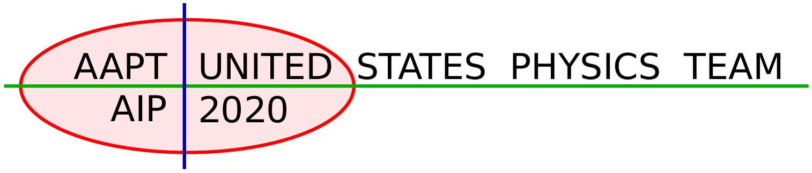
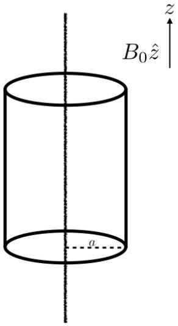
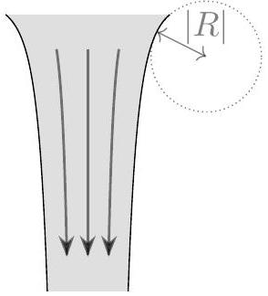
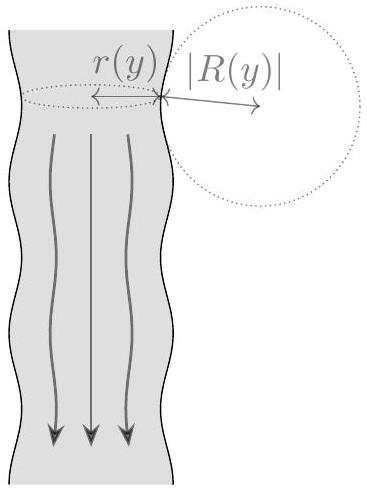
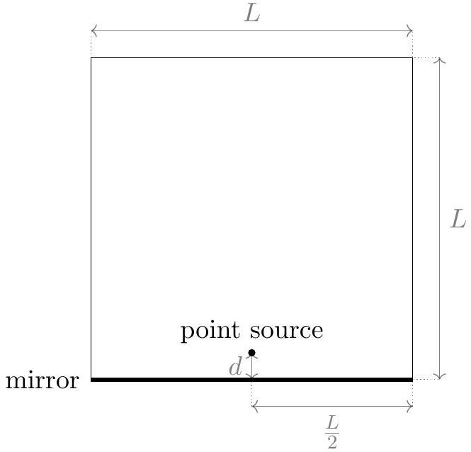
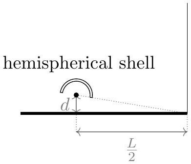

## USA Physics Olympiad Exam

## Information about USAPhO Test

- This examination consists of two parts and six problems. Ordinarily, you will be given 90 minutes to complete Part A, take a 10-15 minute break, and return to complete Part B in 90 minutes.
You may choose to observe the above guideline if you'd like to practice for future USAPhO tests.
- Ordinarily, you are allowed calculators, but they are not allowed to use symbolic math, programming, or graphical features of these calculators. Calculators must not be shared and their memory must be cleared of data and programs. Cell phones, smart watches, PDAs, or cameras cannot be used during the exam or while the exam papers are present. Students are not allowed to bring any tables, books, or collections of formulas.
You may choose to observe the above guideline if you'd like to practice for future USAPhO tests.

Thank you for participating USAPhO this year under such extraordinary circumstances. We hope that you and your family stay safe, and that you continue to encourage more students like you to study physics and try out $F = m a$ test hosted by AAPT.

We acknowledge the following people for their contributions to this year's exam (in alphabetical order):
Ariel Amir, JiaJia Dong, Mark Eichenlaub, Abijith Krishnan, Kye W. Shi, and Mike Winer.

## Part A

## Question A1

## Braking up

An infinitely long wire with linear charge density $- \lambda$ lies along the $z$-axis. An infinitely long insulating cylindrical shell of radius $a$ is concentric with the wire and can rotate freely about the $z$-axis. The shell has moment of inertia per unit length $I$. Charge is uniformly distributed on the shell, with surface charge density $\frac { \lambda } { 2 \pi a }$.

The system is immersed in an external magnetic field $B _ { 0 } \hat { \mathbf { z } }$, and is initially at rest. Starting at $t = 0$, the external magnetic field is slowly reduced to zero over a time $T \gg a / c$, where $c$ is the speed of light.

a. Find an expression of the final angular velocity $\omega$ of the cylinder in terms of the symbols given and other constants.

## Solution

From Faraday's law, you can find the induced electric field inside the cylinder at a distance $r$ from the wire:

$$
\begin{align*}
\oint \vec { E } _ { \mathrm { ind } } \cdot d \vec { \ell } & = - \frac { d \Phi _ { B } } { d t }  \tag{A1-1}\\
E _ { \mathrm { ind } } ( r ) & = - \frac { r } { 2 } \frac { d B } { d t } \tag{A1-2}
\end{align*}
$$

This induced field exerts a torque on the cylinder, causing it to rotate:

$$
\begin{align*}
\tau & = 2 \pi a \cdot \frac { \lambda } { 2 \pi a } \cdot E _ { \mathrm { ind } } ( a ) \cdot a = I \cdot \frac { d \omega } { d t }  \tag{A1-3}\\
& \Rightarrow \frac { d \omega } { d t } = - \frac { \lambda a ^ { 2 } } { 2 I } \cdot \frac { d B } { d t } \tag{A1-4}
\end{align*}
$$

Integrate on both sides, and noting that $\omega ( t = 0 ) = 0$, we have:

$$
\begin{equation*}
\omega ( T ) = - \frac { \lambda a ^ { 2 } } { 2 I } \left( B ( T ) - B _ { 0 } \right) \tag{A1-5}
\end{equation*}
$$

It is important to note that $B ( T ) \neq 0$. Even though the external field decreases to zero, the now-rotating charged cylinder generates a magnetic field. Using Ampere's Law, you can find at $t = T$, the magnetic field is:

$$
\begin{gather*}
\oint \vec { B } _ { \mathrm { ind } } \cdot d \vec { \ell } = \mu _ { 0 } I _ { \mathrm { enc } } ,  \tag{A1-6}\\
\text { where } I _ { \mathrm { enc } } = \frac { \lambda } { 2 \pi a } \cdot \omega ( T ) \cdot a  \tag{A1-7}\\
\Rightarrow B ( T ) = \mu _ { 0 } \frac { \lambda } { 4 \pi ^ { 2 } a } \omega ( T ) \tag{A1-8}
\end{gather*}
$$

Combining equations (A1-5) and (A1-8), we have:

$$
\omega ( T ) = \frac { \frac { \lambda a ^ { 2 } } { 2 I } B _ { 0 } } { 1 + \mu _ { 0 } \frac { \lambda ^ { 2 } a } { 8 \pi I } }
$$

b. You may be surprised that the expression you find above is not zero! However, the electric and magnetic fields can have angular momentum. Analogous to the "regular" angular momentum definition, the EM field angular momentum per unit volume at a displacement r from the axis of rotation is:
$$
\mathcal { L } ( \mathbf { r } ) = \mathbf { r } \times \mathcal { P } ( \mathbf { r } ) .
$$
$\mathcal { P } ( \mathbf { r } )$ is a vector analogous to momentum, given by
$$
\mathcal { P } ( \mathbf { r } ) = \alpha \cdot ( \mathbf { E } ( \mathbf { r } ) \times \mathbf { B } ( \mathbf { r } ) ) .
$$
where $\alpha$ is some proportionality constant. Find an expression for $\alpha$ in terms of given variables and fundamental constants.

## Solution

The electric field inside the cylindrical shell is given by $\mathbf { E } ( r ) = - \frac { \lambda } { 2 \pi \epsilon _ { 0 } r } \hat { \mathbf { r } }$ inward. The magnetic field is given by $B ( t ) \hat { \mathbf { z } }$. Then:

$$
\mathcal { P } ( \mathbf { r } ) = \alpha \frac { \lambda B ( t ) } { 2 \pi \epsilon _ { 0 } r } \hat { \theta }
$$

The angular momentum per unit volume is then:

$$
\mathcal { L } ( \mathbf { r } ) = - \alpha \frac { \lambda } { 2 \pi \epsilon _ { 0 } } \hat { \mathbf { z } }
$$

The angular momentum per unit length is then:

$$
\mathbf { L } = - \frac { \alpha \lambda B ( t ) a ^ { 2 } } { 2 } \hat { \mathbf { z } }
$$

Comparing this to Equation (A1-5) shows that $\alpha = \epsilon _ { 0 }$.

## Question A2

## Swoosh!

In 1851, Léon Foucault built a pendulum 67 metres tall with a 28-kg weight. He connected it to the top of the Panthéon in Paris with a bearing that enabled it to freely change its plane of oscillation. Because of the Earth's rotation, the plane of oscillation slowly moved over time: if we imagine a large horizontal clock under the pendulum, if initially the oscillations went from " 12 " to " 6 ", later on they would move to the "3-9" plane, for example, as shown in the figure below. Perhaps surprisingly, the time it took the oscillations to go back to their original plane is longer than 12 hours. In this problem we will investigate why this is the case, and what the shape the pendulum traces out.

Figure 1: Left: A schematic of Foucault's pendulum. Right: The pendulum motion projected on a horizontal plane in the rotating lab frame.

First, consider the case of a Foucault pendulum installed precisely at the North Pole, with length $l$. We denote $\sqrt { g / l } = \omega$. The angular velocity of the Earth is $\Omega$.

John is an observer looking at the pendulum from a fixed point in space. At $t = 0$, he sees the pendulum at position $( A , 0 )$ and with velocity $( 0 , V )$ in the $x - y$ (horizontal) plane.

a. For John, what are the approximate equations describing the motion of the pendulum in the $x - y$ plane? You may assume that the amplitude of the oscillations is small. We define the coordinates of the pendulum at rest as $( 0,0 )$.

## Solution

John's reference frame is inertial and the point of attachment stationary, so this is a freemoving pendulum obeying simple harmonic motion in each axis:

$$
\begin{equation*}
a _ { x } + \omega ^ { 2 } x = 0 ; a _ { y } + \omega ^ { 2 } y = 0 , \tag{A2-1}
\end{equation*}
$$

b. What will the coordinates $x , y$ in Jonh's frame be at a later time $t$ ?

## Solution

The solution to Eq.(A2-1) is the familiar simple harmonic motion. In general, if the displacement is $r = A \cos \omega t$, then the velocity is $v = - A \omega \sin \omega t$. Using the inital conditions

provided, we have:
$$
\begin{equation*}
x ( t ) = A \cos ( \omega t ) ; y ( t ) = \frac { V } { \omega } \sin ( \omega t ) . \tag{A2-2}
\end{equation*}
$$
Note that this corresponds to an ellipse.
c. Ella, an observer resides at the North Pole, is also looking at the pendulum. What are the coordinates, $\tilde { x } ( t )$ and $\tilde { y } ( t )$, as observed by Ella? Assume that at time $t = 0$, the coordinate systems of John's and Ella's overlap.

## Solution

In the rotating frame, we have $\tilde { x } = x \cos ( \Omega t ) + y \sin ( \Omega t ) , \tilde { y } = - x \sin ( \Omega t ) + y \cos ( \Omega t )$ (with $2 \pi / \Omega = 24 \mathrm { hrs } )$. Plugging in the form of $x ( t )$ and $y ( t )$ we find:

$$
\begin{equation*}
\tilde { x } = A \cos ( \omega t ) \cos ( \Omega t ) + \frac { V } { \omega } \sin ( \omega t ) \sin ( \Omega t ) , \tag{A2-3}
\end{equation*}
$$

and:

$$
\begin{equation*}
\tilde { y } = - A \cos ( \omega t ) \sin ( \Omega t ) + \frac { V } { \omega } \sin ( \omega t ) \cos ( \Omega t ) . \tag{A2-4}
\end{equation*}
$$

d. What is the speed of the pendulum bob observed by Ella at $t = 0$ ?

## Solution

In John's frame, the velocity at this time is $( 0 , V )$. To get the velocity in Ella's frame, we can either take the derivative of the result of part (c) directly, or transform the velocity obtained in John's frame to Ella's frame, not forgetting to add the term $- \Omega A$ to the initial velocity in the $y$ axis. This gives

$$
\begin{equation*}
\tilde { v } _ { x } \approx ( V - \Omega A ) \sin ( \Omega t ) ; \tilde { v } _ { y } = ( V - \Omega A ) \cos ( \Omega t ) . \tag{A2-5}
\end{equation*}
$$

At $t = 0 , \tilde { v } _ { x } = 0$ and $\tilde { v } _ { y } = V - \Omega A$.

e. Find the initial conditions for $A , V$, such that as measured in Ella's frame:
    i. the pendulum passes precisely through its resting position.

## Solution

Considering the motion in John's frame, clearly the pendulum will pass through the resting position if and only if $V = 0$.

ii. it has a "spike" at the points of maximal amplitude (see figure below) instead of a "rounded" trajectory.

Figure 2: Two possible trajectories with "spike" (left) and more "rounded" (right).

## Solution

To have a spike, we need the velocity to vanish at the extremal points in Ella's frame. This gives the condition:

$$
\begin{equation*}
V = \Omega A . \tag{A2-6}
\end{equation*}
$$

Note that in Ella's frame, this implies releasing the pendulum from rest at some amplitude.

In a rotating frame, a fictitious force known as the Coriolis force acts on the particles. For Foucault's pendulum, the Coriolis force acts primarily in the horizontal plane, in a direction perpendicular to the velocity of the mass in the Earth's frame with magnitude:

$$
\begin{equation*}
F = 2 m \Omega v \cdot \sin \theta , \tag{A2-7}
\end{equation*}
$$

where $m$ and $v$ are the pendulum's mass and its velocity, and $\theta$ the latitude ( $90 ^ { \circ }$ for the North Pole). Note that when the velocity changes sign, so does the Coriolis force.

f. How long would it take for the plane of oscillation of Foucault's pendulum to return to its initial value in Paris, which has a latitude of about 49°.

## Solution

Since the expression for the Coriolis force only depends on the combination $\Omega \sin ( \theta )$, and since the solution at the North Pole must be $\pi / \Omega = 12$ hours, the time at a general latitude must be:

$$
\begin{equation*}
T = \frac { \pi } { \Omega \sin ( \theta ) } . \tag{A2-8}
\end{equation*}
$$

For Paris, the time is about 16 hours.

Question A3
Spin Cycle
Cosmonaut Carla is preparing for the Intergalactic 5000 race. She practices for her race on her handy race track of radius $R$, carrying a stopwatch with her. Her racecar maintains a constant speed $v$ during her practices. For this problem, you can assume that $v > 0.1 c$, where $c$ is the speed of light.
a. How much time elapses on Carla's stopwatch with each revolution?

Solution
From time dilation, her clock ticks slower by a factor $\gamma$. Therefore, each revolution takes

$$
\frac { 2 \pi R } { \gamma v } = \frac { 2 \pi R \sqrt { 1 - v ^ { 2 } / c ^ { 2 } } } { v }
$$

when measured by Carla's stopwatch.

Carla decides to do a fun experiment during her training. She places two stationary clocks down: Clock A at the center of the race track, i.e. the origin; and Clock B at a point on the race track denoted as $( R , 0 )$. She then begins her training.

For parts (b) through (d), we define Carla's inertial reference frame (CIRF) as an inertial reference frame in which Carla is momentarily at rest, and which has the same origin of coordinates as the lab frame. Thus, CIRF is a new inertial frame each moment. The times on the clocks and stopwatch are all calibrated such that they all read 0 in CIRF when she passes by Clock $B$ for the first time.
b. In the lab frame (the reference frame of the clocks, which are at rest), what is the offset between Clock $A$ and Clock $B$ ?

Solution
Carla's motion is perpendicular to the displacement between Clock $A$ and Clock $B$ when they are synchronized in CIRF. Therefore, the simultaneous synchronization in CIRF is also simultaneous in the lab frame. Thus, the offset is 0.

To understand why this offset is 0, you can also imagine placing an lightbulb halfway between the two clocks and having it send a light pulse at some known time. In both Carla's frame and the lab frame, the light pulse reaches the two clocks simultaneously.
c. If Carla's stopwatch measures an elapsed time $\tau$, what does Clock A measure in CIRF?

Solution
By symmetry, the speed at which the center clock ticks according to CIRF cannot change. In one revolution, Carla's stopwatch measures $\frac { 2 \pi R \sqrt { 1 - v ^ { 2 } / c ^ { 2 } } } { v }$, while the center clock measures $\frac { 2 \pi R } { v }$. Then,

$$
t _ { A } ( \tau ) = \frac { \tau } { \sqrt { 1 - v ^ { 2 } / c ^ { 2 } } }
$$

d. If Carla's stopwatch measures an elapsed time $\tau$, what does Clock B measure in CIRF?

## Solution

The readings on Clock B and on Clock A are not necessarily identical once Carla moves through the circle (because her motion becomes more parallel with the displacement between the two clocks, and thus simultaneity is lost).
Suppose Carla is at $( R \cos \theta , R \sin \theta )$, so her velocity is given by $( - v \sin \theta , v \cos \theta )$. Suppose we place a light bulb between the two clocks and having it propagate a light pulse. In the lab frame, the light pulse reaches the two clocks simultaneously. In CIRF, the math is a little more complicated.
We first rotate our lab coordinates so that $\hat { \mathbf { a } } = - \sin \theta \hat { \mathbf { x } } + \cos \theta \hat { \mathbf { y } }$, and $\hat { \mathbf { b } } = \cos \theta \hat { \mathbf { x } } + \sin \theta \hat { \mathbf { y } }$. We now give the coordinates of the clocks and bulb in the rotated lab frame: Clock A, $( a , b ) = ( 0,0 )$; Clock B, $( a , b ) = ( - R \sin \theta , R \cos \theta )$; bulb, $( a , b ) = ( - R \sin \theta , R \cos \theta ) / 2$. In the lab frame, a light pulse is emitted at

$$
t = 0 , a = - ( R / 2 ) \sin \theta , b = ( R / 2 ) \cos \theta .
$$

The light pulse reaches Clock A at

$$
t = R / 2 , a = 0 , b = 0 ,
$$

and Clock B at

$$
t = R / 2 , a = - R \sin \theta , b = R \cos \theta .
$$

Under a Lorentz tranformation from the lab frame to CIRF, we have that the light pulse reaches Clock $A$ at $t ^ { \prime } = \gamma R / 2$ and Clock $B$ at $t ^ { \prime } = \gamma R / 2 + \gamma v R \sin \theta$. Thus, Clock $B$ reads the same time as Clock $A$ with offset $\gamma v R \sin \theta$ in the reference frame moving at $v _ { a } = v$, $v _ { b } = 0$. Note that Clock $A$ ticks slower by a factor of $\gamma$ in this frame. Therefore, the time on clock $B$ is $v R \sin \theta$ behind the time on clock $A$.

Then,

$$
t _ { B } ( \tau ) = t _ { A } ( \tau ) - v R \sin \theta = \frac { \tau } { \sqrt { 1 - v ^ { 2 } / c ^ { 2 } } } - v R \sin \theta
$$

(This is the answer we expect from the rear clock ahead effect!) Finally, we use that $\theta = \omega \tau$ and $\omega = \frac { 2 \pi } { T }$, where $T$ is the period in Carla's frame. Then,

$$
t _ { B } ( \tau ) = \frac { \tau } { \sqrt { 1 - v ^ { 2 } / c ^ { 2 } } } - \frac { v R } { c ^ { 2 } } \sin \left( \frac { v \tau } { R \sqrt { 1 - v ^ { 2 } / c ^ { 2 } } } \right) .
$$

## Part B

Question B1
String Cheese

a. When a faucet is turned on, a stream of water flows down with initial speed $v _ { 0 }$ at the spout. For this problem, we define $y$ to be the vertical coordinate with its positive direction pointing up.
Assuming the water speed is only affected by gravity as the water falls, find the speed of water $v ( y )$ at height $y$. Define the zero of $y$ such that the equation for $v ^ { 2 }$ has only one term and find $y _ { 0 }$, the height of the spout.

Solution
We can use energy conservation to answer this question. For a bit of water with mass $m$, the total energy $E$ is the sum of the kinetic and gravitational potential energies,

$$
\begin{equation*}
E = \frac { 1 } { 2 } m v ^ { 2 } + m g y . \tag{B1-1}
\end{equation*}
$$

(With this sign convention, $g \approx 10 \mathrm {~m} / \mathrm { s } ^ { 2 }$ is positive. As $y$ decreases, so does the potential energy.)

As the bit of water falls, its energy remains constant, and is equal to the initial value of

$$
\begin{equation*}
E = \frac { 1 } { 2 } m v _ { 0 } ^ { 2 } + m g y _ { 0 } . \tag{B1-2}
\end{equation*}
$$

Equating eliminating $E$ from equations B1-1 and B1-2, we have

$$
\frac { 1 } { 2 } m v ^ { 2 } + m g y = \frac { 1 } { 2 } m v _ { 0 } ^ { 2 } + m g y _ { 0 } ,
$$

and solving for $v$, we get

$$
v = \sqrt { v _ { 0 } ^ { 2 } + 2 g \left( y _ { 0 } - y \right) }
$$

The equation for $v ^ { 2 }$ has three terms, but we were asked to choose the zero of $y$ such that there is only one. Evidently, two of the terms must cancel, and these must be the two constant terms, since the final term varies with $y$.
That means we need

$$
v _ { 0 } ^ { 2 } + 2 g y _ { 0 } = 0 .
$$

Solving for $y _ { 0 }$, the vertical position of the spout is

$$
y _ { 0 } = \frac { - v _ { 0 } ^ { 2 } } { 2 g }
$$

With this choice of the zero of $y$, the equation for $v$ simplifies to

$$
\begin{equation*}
v = \sqrt { - 2 g y } . \tag{B1-3}
\end{equation*}
$$

We note that the result of this equation is real because $y < 0$ at the spout, and decreases as the water falls, so this equation shows that $v$ is real and increases as the water falls.

b. Assume that the stream of water falling from the faucet is cylindrically symmetric about a vertical axis through the center of the stream. Also assume that the volume of water per unit time exiting the spout is constant, and that the shape of the stream of water is constant over time.
In this case, the radius $r$ of the stream of water is a function of vertical position $y$. Let the radius at the faucet be $r _ { 0 }$. Using your result from part (a), find $r ( y )$.
If $r ( y )$ is not constant, it implies that the water has some radial velocity during its fall, in contradiction to our assumptions in part (a) that the motion is purely vertical. You may assume throughout the problem that any such radial velocity is negligibly small.

## Solution

The same volume of water must fall through any horizontal cross-section of the stream each second because water doesn't disappear during its fall, and its density if constant. That volume per unit time $Q$ is the cross-sectional area of the stream multiplied by the speed of the water in the vertical direction. As an equation,

$$
\begin{equation*}
Q = v \pi r ^ { 2 } . \tag{B1-4}
\end{equation*}
$$

$Q$ is the same at all $y$, and is equal to its initial value of

$$
\begin{equation*}
Q = v _ { 0 } \pi r _ { 0 } ^ { 2 } . \tag{B1-5}
\end{equation*}
$$

Eliminating $Q$ from B1-4 and B1-5 and solving for $r$ gives

$$
r = r _ { 0 } \sqrt { \frac { v _ { 0 } } { v } } .
$$

Plugging in our equation B1-3 for $v$,

$$
r = r _ { 0 } \sqrt [ 4 ] { \frac { v _ { 0 } ^ { 2 } } { - 2 g y } } .
$$

c. The water-air interface has some surface tension, $\sigma$. The effect of surface tension is to change the pressure in the stream according to the Young-Laplace equation,
$$
\Delta P = \sigma \left( \frac { 1 } { r } + \frac { 1 } { R } \right) ,
$$

where $\Delta P$ is the difference in pressure between the stream and the atmosphere and $R$ is the radius of curvature of the vertical profile of the stream, visualized below. ( $R < 0$ for the stream of water; the radius of curvature would be positive only if the stream profile curved inwards.)

For this part of the problem, we assume that $| R | \gg | r |$, so that the curvature of the vertical profile of the stream can be ignored. Also assume that water is incompressible.
Accounting for the pressure in the stream, find a new equation relating for $r ( y )$ in terms of $\sigma , r _ { 0 } , v _ { 0 }$, and $\rho$, the density of water. You do not need to solve the equation for $r$.

## Solution

Our conservation of energy approach from part (b) needs to be modified to account for the work done against pressure. As we look further down in the stream, the radius is smaller. This means the pressure is higher there, and the water is slowed compared to when we assumed only gravity acted on the water.

The result of accounting for changes in pressure in a flow where no energy is dissipated is the Bernoulli equation,

$$
\frac { 1 } { 2 } \rho v ^ { 2 } + \rho g y + P = \frac { 1 } { 2 } \rho v _ { 0 } ^ { 2 } + \rho g y _ { 0 } + P _ { 0 }
$$

where $P _ { 0 }$ is the pressure in the stream at the spout.
Using the Young-Laplace equation to replace $P$ and $P _ { 0 }$, we have

$$
\frac { 1 } { 2 } \rho v ^ { 2 } + \rho g y + \frac { \sigma } { r } = \frac { 1 } { 2 } \rho v _ { 0 } ^ { 2 } + \rho g y _ { 0 } + \frac { \sigma } { r _ { 0 } } .
$$

If we substitute in $y _ { 0 } = - \frac { v _ { 0 } ^ { 2 } } { 2 g }$ and $v = v _ { 0 } \frac { r _ { 0 } ^ { 2 } } { r ^ { 2 } }$, this becomes

$$
\frac { 1 } { 2 } \rho v _ { 0 } ^ { 2 } \frac { r _ { 0 } ^ { 4 } } { r ^ { 4 } } + \rho g y + \frac { \sigma } { r } = \frac { 1 } { 2 } \rho v _ { 0 } ^ { 2 } - \rho g \frac { v _ { 0 } ^ { 2 } } { 2 g } + \frac { \sigma } { r _ { 0 } } .
$$

This may be simplified to

$$
\frac { 1 } { 2 } \rho v _ { 0 } ^ { 2 } \frac { r _ { 0 } ^ { 4 } } { r ^ { 4 } } + \rho g y = \sigma \left( \frac { 1 } { r _ { 0 } } - \frac { 1 } { r } \right)
$$

d. After falling for some distance, the water stream usually breaks into smaller droplets. This occurs because small random perturbations to the shape of the stream grow over time, eventually breaking the stream into apart.

For the rest of this problem we ignore the change in the radius of the stream due to changing speed of the water, as considered earlier. Instead, we examine small random variations in the radius of the stream.

Random variations can be broken down into a sum of sinusoidal variations in stream radius, each with a different wavenumber $k$. We can analyze these different sinusoidal variations independently.
Consider a stream of water whose radius obeys

$$
r ( y ) = r _ { 0 } + A \cos ( k y ) ,
$$

where $A \ll r _ { 0 }$ is the perturbation amplitude. To analyze such a stream, it is sufficient to consider only the thickest and thinnest parts of the stream.
Accounting for both sources of curvature, find a condition on $r _ { 0 }$ and $k$ such that the size of perturbations increases with time.

## Solution

If the size of the perturbation increases with time, water must be flowing from the thin parts of the stream to the thick parts. For that to happen, the pressure needs to be higher in the thin parts of the stream than in the thick parts of the stream so that the pressure gradient will force water towards the thick parts, eventually breaking the stream into droplets.
We consider a small patch with side lengths $h$ on the surface of the stream at the thinnest part of the stream. The pressure is

$$
\Delta P _ { \mathrm { thin } } = \sigma \left( \frac { 1 } { r _ { \mathrm { thin } } } + \frac { 1 } { R _ { \mathrm { thin } } } \right) .
$$

And at the thickest part of the stream,

$$
\Delta P _ { \text {thick } } = \sigma \left( \frac { 1 } { r _ { \text {thick } } } + \frac { 1 } { R _ { \text {thick } } } \right) .
$$

We are looking for the wavenumbers such that

$$
\Delta P _ { \text {thin } } > \Delta P _ { \text {thick } } .
$$

Using the Young-Laplace equation, this becomes

$$
\sigma \left( \frac { 1 } { r _ { \text {thin } } } + \frac { 1 } { R _ { \text {thin } } } \right) > \sigma \left( \frac { 1 } { r _ { \text {thick } } } + \frac { 1 } { R _ { \text {thick } } } \right) .
$$

Dropping the common factor $\sigma$,

$$
\left( \frac { 1 } { r _ { \text {thin } } } + \frac { 1 } { R _ { \text {thin } } } \right) > \left( \frac { 1 } { r _ { \text {thick } } } + \frac { 1 } { R _ { \text {thick } } } \right) .
$$

To simplify this further, we will need to find $r$ and $R$ in terms of $A$ and $k$, the variables given in the problem statement.
$r$ is the thickness of the stream, which from the equation given, varies sinusoidally. So

$$
\begin{aligned}
r _ { \text {thin } } & = r _ { 0 } - A . \\
r _ { \text {thick } } & = r _ { 0 } + A .
\end{aligned}
$$

We are going to need $\frac { 1 } { r }$ to use in the Young Laplace equation, so we make the approximations

$$
\begin{gathered}
\frac { 1 } { r _ { \text {thin } } } \approx \frac { 1 } { r _ { 0 } } + \frac { A } { r _ { 0 } ^ { 2 } } . \\
\frac { 1 } { r _ { \text {thick } } } \approx \frac { 1 } { r _ { 0 } } - \frac { A } { r _ { 0 } ^ { 2 } } .
\end{gathered}
$$

(To find these, recall $\frac { 1 } { 1 - \epsilon } \approx 1 + \epsilon$ for small $\epsilon$.)
The inequality now becomes

$$
\frac { 1 } { r _ { 0 } } + \frac { A } { r _ { 0 } ^ { 2 } } + \frac { 1 } { R _ { \text {thin } } } > \frac { 1 } { r _ { 0 } } - \frac { A } { r _ { 0 } ^ { 2 } } + \frac { 1 } { R _ { \text {thick } } } .
$$

This simplifies to

$$
\frac { 2 A } { r _ { 0 } ^ { 2 } } > \frac { 1 } { R _ { \text {thick } } } - \frac { 1 } { R _ { \text {thin } } } .
$$

Next we need to determine the radius of curvature $R$ of the sinusoidal as a function of $k$ and $A$.

To do this, we compare the sinusoidal function and a circle at small deviations from the thickest part of the stream.
Recall that, for small $\theta$,

$$
\cos \theta \approx 1 - \frac { 1 } { 2 } \theta ^ { 2 } ,
$$

which means that for small $x$,

$$
y _ { \mathrm { sinusoidal } } = A \cos ( k x ) \approx A \left( 1 - \frac { 1 } { 2 } k ^ { 2 } x ^ { 2 } \right) .
$$

Next we consider a circle of radius $R$. If a particle moves along such a circle at speed $v$, its acceleration is $v ^ { 2 } / R$. This means that if the particle moves forward for a short time $t$, it moves forward a distance $v t$ and falls a distance $\frac { 1 } { 2 } \frac { v ^ { 2 } } { R } t ^ { 2 }$. If we set $v t = x$, then the $y$ position of the particle is given by

$$
y _ { \mathrm { circle } } \approx y _ { 0 } - \frac { 1 } { 2 } \frac { x ^ { 2 } } { R }
$$

Comparing $y _ { \text {circle } }$ and $y _ { \text {sinusoidal } }$, they give the same motion if $A k ^ { 2 } = \frac { 1 } { R }$.
Then

$$
\begin{aligned}
& \frac { 1 } { R _ { \text {thin } } } = - A k ^ { 2 } . \\
& \frac { 1 } { R _ { \text {thick } } } = A k ^ { 2 } .
\end{aligned}
$$

Putting these into the inequality,

$$
\frac { 2 A } { r _ { 0 } ^ { 2 } } > 2 A k ^ { 2 } .
$$

This simplifies to

$$
k < \frac { 1 } { r _ { 0 } } .
$$

So the perturbations will grow as long as they have a wavenumber greater than one over the radius, or equivalently when the wavelength of the perturbation is longer than the circumference of the stream.

This result was discovered experimentally by Plateau and derived theoretically by Rayleigh. The breaking up of a stream into droplets is called the Plateau-Rayleigh instability.

## Question B2

## Mirror Mirror on the Wall

Consider a square room with side length $L$. The bottom wall of the room is a perfect mirror.* A perfect monochromatic point source with wavelength $\lambda$ is placed a distance $d$ above the center of the mirror, where $\lambda \ll d \ll L$.

*Remember that the phase of light reflected by a mirror changes by 180°.

a. On the right wall, an interference pattern emerges. What is the distance $y$ between the bottom corner and the closest bright fringe above it? Hint: you may assume $\lambda \ll y \ll L$ as well.

## Solution

This setup is essentially a double-slit experiment with the second slit being the image of the point source on the other side of the mirror, with the additional phase shift from the mirror. The distance between the source and a spot $y$ on the wall is given by $\sqrt { ( d - y ) ^ { 2 } + ( L / 2 ) ^ { 2 } }$ and the distance between the image and a spot $y$ is given by $\sqrt { ( d + y ) ^ { 2 } + ( L / 2 ) ^ { 2 } }$. Subtracting the two distances and adding in the phase shift gives us approximately

$$
L / 2 \left( \frac { 2 ( d + y ) ^ { 2 } } { L ^ { 2 } } - \frac { 2 ( d - y ) ^ { 2 } } { L ^ { 2 } } \right) + \lambda / 2 .
$$

This distance must be a multiple of $\lambda$ for interference to occur. Then,

$$
\frac { 4 d y } { L } + \lambda / 2 = m \lambda .
$$

Substituting $m = 1$ gives us $y = \frac { \lambda L } { 8 d }$.

b. You plan on running an experiment to determine $\lambda$ in a room with $L = 40 \mathrm {~m}$, and you know that $\lambda$ is between 550 and 750 nm. You will measure $d$ and $y _ { 10 }$ (the distance of the tenth fringe from the corner) with the same ruler (with markings of 1 mm ). At what $d$ should you place the point source to minimize your error in your $\lambda$ measurement? Roughly what is that minimum error?

## Solution

Our error is given by

$$
\frac { \Delta \lambda } { \lambda } = \sqrt { \left( \frac { \Delta d } { d } \right) ^ { 2 } + \left( \frac { \Delta y _ { 10 } } { y _ { 10 } } \right) ^ { 2 } } .
$$

Note that $\Delta d = \Delta y _ { 10 } \sim 0.5 \mathrm {~mm}$. From earlier, note that after substituting $m = 10$, $y _ { 10 } = \frac { 19 \lambda L } { 8 d }$.
If we assume that $\lambda \sim 650 \mathrm {~nm}$, note that

$$
y _ { 10 } d = 6.2 \times 10 ^ { - 5 } \mathrm {~m} ^ { 2 } .
$$

Choosing $d = y _ { 10 }$ minimizes our error, so we get that $d = y _ { 10 } = 8 \mathrm {~mm}$. Then, $\Delta \lambda \approx 60 \mathrm {~nm}$.
Note: Accept any reasonable uncertainty in tick spacing ~ 0.5 mm or ~ 1 mm.

c. Now suppose we place a transparent hemispherical shell of thickness $s$ and index of refraction $n$ over the source such that all light from the source that directly strikes the right wall passes through the shell, and all light from the source that strikes the mirror first does not pass through the shell.

At what $y$ is the fringe closest to the bottom-most corner now? (You may find it convenient to use $\lfloor x \rfloor$, the largest integer below $x$.) What is the spacing between the fringes now? Ignore any reflections or diffraction from the hemispherical shell.

## Solution

Now the optical distance between the source and a spot $y$ on the wall is increased by $( n - 1 ) s$. Then, we need

$$
\frac { 4 d y } { L } - ( n - 1 ) s + \lambda / 2 = m \lambda .
$$

To minimize $y$, we take $m$ to be $- \left\lfloor \frac { ( n - 1 ) s } { \lambda } - \frac { 1 } { 2 } \right\rfloor$. Then,

$$
y = \frac { L } { 4 d } \left( ( n - 1 ) s - \lambda \left\lfloor \frac { ( n - 1 ) s } { \lambda } - \frac { 1 } { 2 } \right\rfloor - \frac { \lambda } { 2 } \right) .
$$

Because $( n - 1 ) s$ is just an offset, the spacing between the fringes does not change, i.e., the spacing is still $\lambda L / ( 4 d )$.

d. Now, suppose the hemispherical shell is removed, and we instead observe the interference pattern on the top wall. To the nearest integer, what is the total number of fringes that appear on the top wall? You may assume that $d \ll L$.

## Solution

Now, the distance between the source and a spot $x$ on the wall is given by $\sqrt { ( L - d ) ^ { 2 } + x ^ { 2 } }$ and the distance between the image and a spot on the wall is $\sqrt { ( L + d ) ^ { 2 } + x ^ { 2 } } + \lambda / 2$. We do not assume $x \ll L$ this time. Subtracting the two distances gives us roughly

$$
\sqrt { L ^ { 2 } + x ^ { 2 } } \sqrt { 1 + \frac { 2 d L } { L ^ { 2 } + x ^ { 2 } } } - \sqrt { L ^ { 2 } + x ^ { 2 } } \sqrt { 1 - \frac { 2 d L } { L ^ { 2 } + x ^ { 2 } } } + \lambda / 2 = m \lambda .
$$

Taylor expanding gives us

$$
\frac { 2 d L } { \sqrt { L ^ { 2 } + x ^ { 2 } } } = ( m - 1 / 2 ) \lambda .
$$

Then,

$$
x = \pm L \sqrt { \frac { 4 d ^ { 2 } } { ( m - 1 / 2 ) ^ { 2 } \lambda ^ { 2 } } - 1 } .
$$

For $x$ to be physical, we require that $m - 1 / 2 \leq 2 d / \lambda$.
The maximum allowed $x$ is $L / 2$. Then,

$$
\sqrt { \frac { 4 d ^ { 2 } } { ( m - 1 / 2 ) ^ { 2 } \lambda ^ { 2 } } - 1 } \leq \frac { 1 } { 2 } ,
$$

so

$$
\frac { 4 d ^ { 2 } } { ( m - 1 / 2 ) ^ { 2 } \lambda ^ { 2 } } \leq \frac { 5 } { 4 }
$$

Thus, we have that

$$
m - 1 / 2 \geq \frac { 4 d } { \sqrt { 5 } \lambda } .
$$

Then, the number of fringes is

$$
2 \cdot \frac { 2 d } { \lambda } \left( 1 - \frac { 2 } { \sqrt { 5 } } \right) ,
$$

where the extra factor of 2 comes from there being two sides to the interference pattern.

Question B3
Real Expansion
Consider a "real" monatomic gas consisting of $N$ atoms of negligible volume and mass $m$ in equilibrium inside a closed cubical container of volume $V$. In this "real" gas, the attractive forces between atoms is small but not negligible. Because these atoms have negligible volume, you can assume that the atoms do not collide with each other for the entirety of the problem.

a. Consider an atom in the interior of this container of volume $V$. Suppose the potential energy of the interaction is given by
$$
u ( r ) = \begin{cases} 0 & r < d \\ - \epsilon \left( \frac { d } { r } \right) ^ { 6 } & r \geq d \end{cases}
$$
where $d \ll V ^ { 1 / 3 }$ is the minimum allowed distance between two atoms. Assume the gas is uniformly distributed within the container, what is the average potential energy of this atom? Write your answer in terms of $a ^ { \prime } = \frac { 2 \pi d ^ { 3 } \epsilon } { 3 } , N$, and $V$.

Solution
The density of the gas is given by $N / V$. In a spherical shell of radius $r$ and thickness $\Delta r$, there are $\left( 4 \pi r ^ { 2 } \Delta r \right) N / V$ atoms. The potential energy is given by

$$
\Delta U = - \left( 4 \pi r ^ { 2 } \Delta r \right) N / V \epsilon d ^ { 6 } / r ^ { 6 } .
$$

Then, the total potential energy is given by

$$
U = \int _ { d } ^ { \infty } - \left( 4 \pi r ^ { 2 } \mathrm {~d} r \right) N / V \epsilon d ^ { 6 } / r ^ { 6 } = - 2 a ^ { \prime } N / V
$$

b. What is the average potential energy of an atom near the boundary of the box? Assume that there is no interaction between atoms near the boundary and the box itself.

Solution
Now only half of the shell of radius $r$ is full of gas, and the other half is outside of the box. This mean that the potential energy is lessened by a factor of two, to $- a ^ { \prime } N / V$.

c. Using Bernoulli's law $P + U + \rho v ^ { 2 } / 2 =$ constant, with pressure $P$, potential energy density $U$, mass density $\rho$ and fluid velocity $v$, what is the pressure at the boundary of the box? Assume the interior pressure is given by the ideal gas law.

Solution
The potential energy density difference is $- a ^ { \prime } \frac { N ^ { 2 } } { V ^ { 2 } }$. Since there is no velocity difference, this is also the pressure difference. If the pressure on the interior is $\frac { N k T } { V }$, then the pressure on

the box is $\frac { N k T } { V } - a ^ { \prime } \frac { N ^ { 2 } } { V ^ { 2 } }$
d. Assuming most atoms are in the interior of the box, what is the total energy of the atoms in the box?

## Solution

The total kinetic energy is $\frac { 3 } { 2 } N k T$. The total potential energy is $- a ^ { \prime } N ^ { 2 } / V$ (we drop a factor of two to avoid double-counting). So the total energy is $\frac { 3 } { 2 } N k T - a ^ { \prime } N ^ { 2 } / V$.

Now consider an insulated partitioned container with two sections, each of volume $V$. We fill one side of the container with $N$ atoms of this "real" gas at temperature $T$, which the other side being a vacuum. We then quickly remove the partition and let the gas expand to fill the entirety of the partitioned container. During this expansion, the energy of the gas remains unchanged.

e. What is the final temperature of the gas after the expansion?

## Solution

Naively, we might say that the total potential energy of the gas is $- 2 a ^ { \prime } N ^ { 2 } / V$, but to avoid double-counting, we divide by 2 and instead arrive at $- a ^ { \prime } N ^ { 2 } / V$. Then, the quantity

$$
E = \frac { 3 } { 2 } N k _ { B } T - \frac { a ^ { \prime } N ^ { 2 } } { V }
$$

is conserved. Therefore,

$$
T ^ { \prime } = T - \frac { a ^ { \prime } N } { 3 k _ { B } V } .
$$

f. What is the increase in the entropy of the universe as a result of the free expansion? Give your answer to first order in $\frac { a ^ { \prime } N } { V k _ { B } T }$.

## Solution

The entropy of the surroundings do not increase as a result of the free expansion (no heat is dumped to the surroundings, and the surroundings remain in thermal equilibrium). However, the entropy of the gas does increase because the gas is momentarily not in equilibrium. Therefore, we just have to compute the increase in entropy of the gas.

Because entropy is a state function, we compute this change in entropy by constructing a reversible process between the initial and final states of the expansion, and computing the change in entropy for this process. Consider constant energy reversible expansion of this gas. For this process, the work done by the gas is equal to the heat the gas takes in. Therefore,

$$
\mathrm { d } S = \frac { p \mathrm {~d} v } { t } ,
$$

where we use lowercase letters to denote the quantities during the reversible expansion.
Recall that

$$
p v + \frac { a ^ { \prime } N ^ { 2 } } { v } = N k _ { B } t .
$$

If the energy of the system is $E$, then,

$$
\frac { 3 } { 2 } p v + \frac { 3 a ^ { \prime } N ^ { 2 } } { 2 v } - \frac { a ^ { \prime } N ^ { 2 } } { v } = E .
$$

Then,

$$
p = \frac { 2 E } { 3 v } - \frac { a ^ { \prime } N ^ { 2 } } { 3 v ^ { 2 } } .
$$

From our expression of energy,

$$
t = \frac { 2 } { 3 } \frac { E + a ^ { \prime } N ^ { 2 } / v } { N k _ { B } } .
$$

Then,

$$
\Delta S = \int _ { V } ^ { 2 V } \frac { E N k _ { B } } { E v + a ^ { \prime } N ^ { 2 } } - \frac { a ^ { \prime } N ^ { 3 } k _ { B } } { 2 \left( E v ^ { 2 } + a ^ { \prime } N ^ { 2 } v \right) } \mathrm { d } v .
$$

Taylor expanding gives us

$$
\Delta S = \int _ { V } ^ { 2 V } \frac { N k _ { B } } { v } - \frac { 3 a ^ { \prime } N ^ { 3 } k _ { B } } { 2 E v ^ { 2 } } \mathrm {~d} v .
$$

Integrating gives us

$$
\Delta S = N k _ { B } \log 2 - \frac { 3 a ^ { \prime } N ^ { 3 } k _ { B } } { 4 E V } .
$$

Using that $E \approx 3 / 2 N k _ { B } T$, we arrive at

$$
\Delta S = N k _ { B } \log 2 - \frac { a ^ { \prime } N ^ { 2 } } { 2 V T } .
$$
