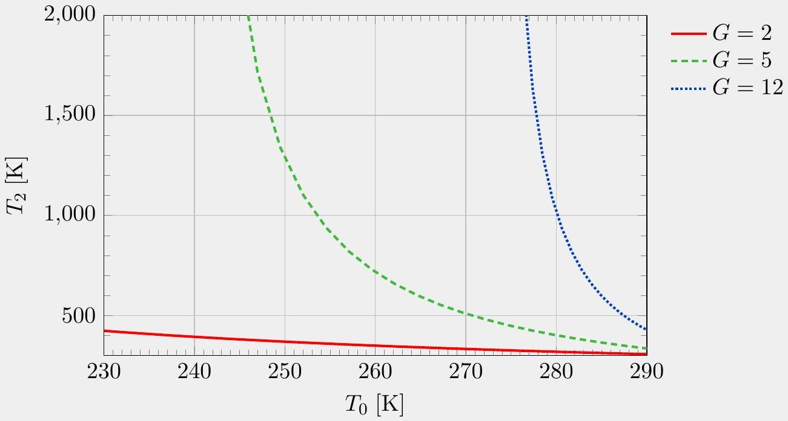

## Question B2

## Hot Pocket

This question consists of two independent parts.

a. It's winter and you want to keep warm. The temperature is $T _ { 0 } = 263 \mathrm {~K}$ outside and $T _ { 1 } = 290 \mathrm {~K}$ in your room. You have started a fire, which acts as a hot reservoir at temperature $T _ { 2 } = 1800 \mathrm {~K}$.
You want to add a small amount of heat $d Q _ { 1 }$ to your room. The simplest method would be to extract heat $- d Q _ { 2 , \text { dump } } = d Q _ { 1 }$ from the fire and directly transfer it to your room. However, it is possible to heat your room more efficiently. Suppose that you can exchange heat between any pair of reservoirs. You cannot use any external source of work, such as the electrical grid, but the work extracted from running heat engines can be stored and used without dissipation.
    i. What is the minimum heat extraction $- d Q _ { 2 , \text { min } }$ required by the laws of thermodynamics to heat up the room by $d Q _ { 1 }$ ?

## Solution

The second law of thermodynamics implies that, no matter what you do, you must have $\mathrm { d } S _ { \text {universe } } \geq 0$, and if your process is to be as efficient as possible, we can assume it is reversible, so

$$
\mathrm { d } S _ { \text {universe; reversible } } = 0 .
$$

If we do extract any work while allowing heat to transfer between reservoirs, we will later use that work to transfer more heat. So in the entire process, there are only heat transfers, and by conservation of energy,

$$
\mathrm { d } Q _ { 0 } + \mathrm { d } Q _ { 1 } + \mathrm { d } Q _ { 2 } = 0 .
$$

The entropy change associated with each reversible heat transfer is $d S = d Q / T$, so our assumption of zero entropy production becomes

$$
\frac { \mathrm { d } Q _ { 0 } } { T _ { 0 } } + \frac { \mathrm { d } Q _ { 1 } } { T _ { 1 } } + \frac { \mathrm { d } Q _ { 2 } } { T _ { 2 } } = 0 .
$$

By combining these equations, we can eliminate $d Q _ { 0 }$ and solve for $d Q _ { 2 }$, giving

$$
- \mathrm { d } Q _ { 2 ; \min } = \frac { T _ { 2 } } { T _ { 1 } } \frac { T _ { 1 } - T _ { 0 } } { T _ { 2 } - T _ { 0 } } \mathrm {~d} Q _ { 1 } .
$$

For the provided numbers, this happens to be about $0.11 d Q _ { 1 }$. That is, a heat pump can be much more efficient than direct heating. This problem was inspired by Jaynes, E. T, "Note on thermal heating efficiency.", American Journal of Physics 71.2 (2003): 180-182. (You can also solve the problem by considering an explicit procedure using Carnot engines. But since Carnot engines are reversible, all such procedures will just give the same answer.)

ii. Let the "efficiency gain" be the ratio $G = d Q _ { 2 , \text { dump } } / d Q _ { 2 , \text { min } }$. Assuming $T _ { 1 }$ is fixed at 298 K, make a graph whose axes are $T _ { 0 }$ and $T _ { 2 }$, where $T _ { 0 }$ varies from 230 K to 290 K , and $T _ { 2 }$ varies from 300 K to 2000 K . On the graph, sketch curves corresponding to gain $G = 2$, 5, and 12.

## Solution

Your graph should look qualitatively like this:

The intuition for the curves is that the efficiency gain becomes high when $T _ { 1 }$ gets close to $T _ { 0 }$, and it becomes low when $T _ { 2 }$ gets close to $T _ { 0 }$.

b. When the air at the bottom of a container is heated, it becomes less dense than the surrounding air and rises. Simultaneously, cooler air falls downward. This process of net upward heat transfer is known as convection.
Consider a closed, rectangular box of height $h$ filled with air initially of uniform temperature $T _ { 0 }$. Next, suppose the bottom of the box is heated so that the air there instantly reaches temperature $T _ { 0 } + \Delta T$. The hot parcel of air at the bottom rises upward until it hits the top of the box, where its temperature is instantly reduced to $T _ { 0 }$.
You may neglect any heat transfer and friction between the parcel of air and the surrounding air, and assume that the temperature difference is not too large. In addition, you may assume the height $h$ is small enough so that the pressure $P _ { 0 }$ and density $\rho _ { 0 }$ of the surrounding air are very nearly constant throughout the container. More precisely, assume that $\rho _ { 0 } g h / P _ { 0 } \ll \Delta T / T _ { 0 } \ll 1$. Express your answers in terms of $P _ { 0 } , g , h , \Delta T$, and $T _ { 0 }$.
    i. As a parcel of air moves upward, it accelerates. Find a rough estimate for the average speed $v _ { 0 }$ during its upward motion.

## Solution

The temperature of the air is higher than its surroundings by a fractional amount of order $\Delta T / T$. Thus, by the ideal gas law, the density is lower than its surroundings by a fraction of order $\Delta T / T$, which means the upward acceleration due to the buoyant force is of order $a = g \Delta T / T$. Since this is roughly uniformly accelerated motion, $v _ { 0 } ^ { 2 } \propto a h$,

which implies

$$
v _ { 0 } \sim \sqrt { g h \frac { \Delta T } { T _ { 0 } } } .
$$

Note that because $d P / d z = - \rho g$ in hydrostatic equilibrium, the pressure of the surrounding air varies between the bottom and top of the container, by a fractional amount of order $\rho _ { 0 } g h / P _ { 0 }$. But since we assumed $\rho _ { 0 } g h / P _ { 0 } \ll \Delta T / T _ { 0 }$, we can neglect this effect.
ii. In the steady state, warm parcels of air are continuously moving upward from the bottom, and cold parcels of air are continuously moving downward from the top. Find a rough estimate for the net rate of upward energy transfer per area.

## Solution

The extra energy carried by a parcel of gas is

$$
n C _ { p } \Delta T \sim n R \Delta T \sim P _ { 0 } V \frac { \Delta T } { T _ { 0 } }
$$

where $V$ is the volume of the parcel. The net volume of warm air transported upward per unit time is of order $A v _ { 0 }$, where $A$ is the cross-sectional area of the box. Thus, the average power per area is roughly

$$
P _ { 0 } v _ { 0 } \frac { \Delta T } { T _ { 0 } } \sim P _ { 0 } \sqrt { g h } \left( \frac { \Delta T } { T _ { 0 } } \right) ^ { 3 / 2 } .
$$

This is a simplified version of the mixing length theory of convection, which is essential for modeling the interiors of stars.
