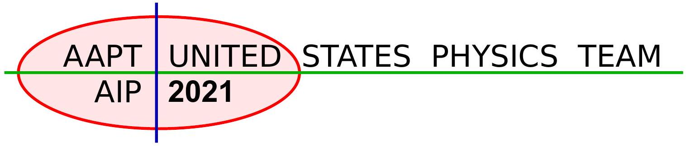
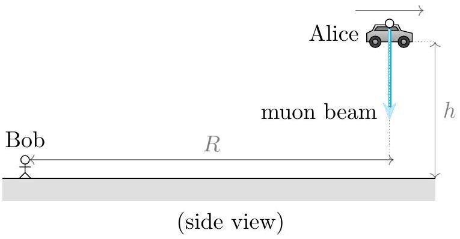
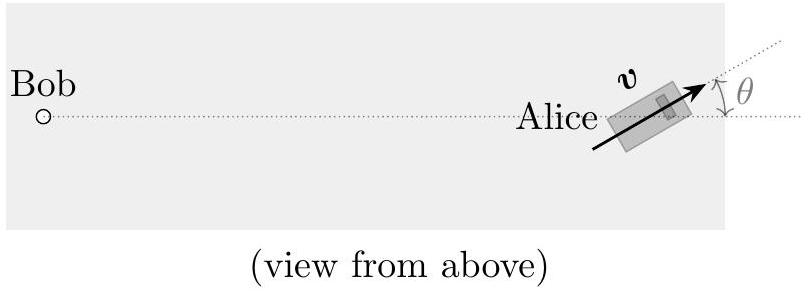
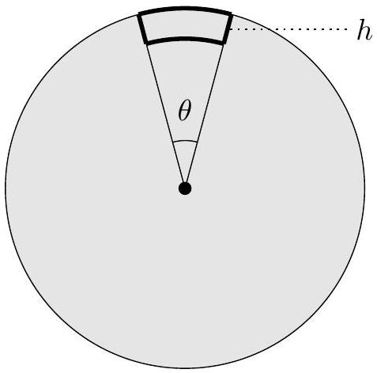
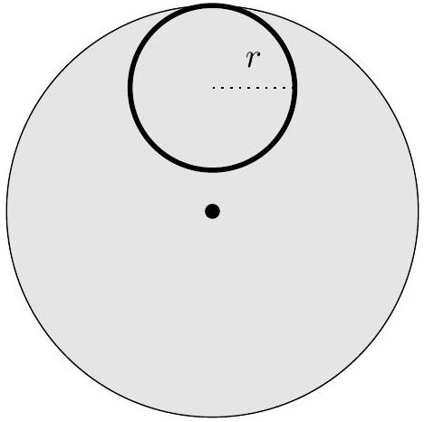
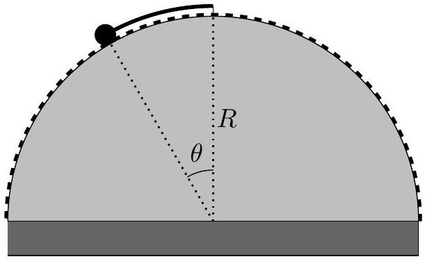
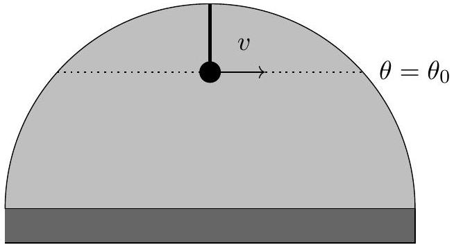
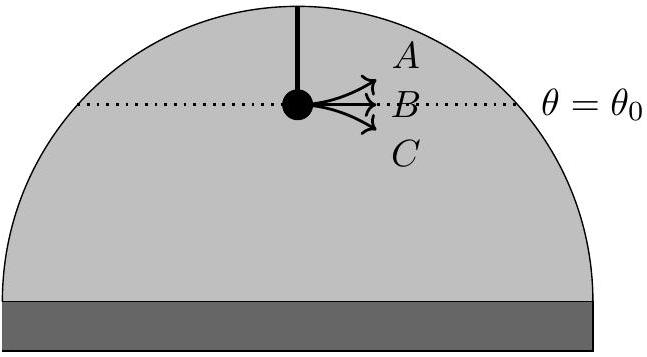
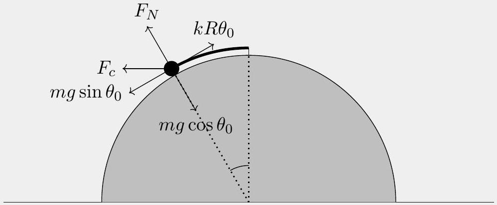
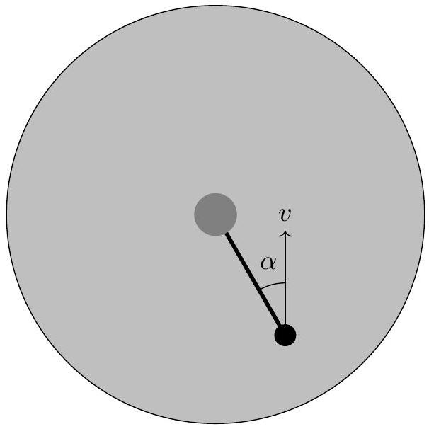

## USA Physics Olympiad Exam

## Information About The 2021 USAPhO

- The 2021 USAPhO consists of two 90-minute parts taking place on two separate days:
    - Part A: Monday, April 19 from 4:00 pm to 5:30 pm Eastern Time
    - Part B: Wednesday, April 21 from 4:00 pm to 5:30 pm Eastern Time

The exam is hosted by AAPT on the platform provided by Art of Problem Solving.

- This year, we require the exam to be proctored by either your high school science/physics teacher, or your parent/guardian.
- Before you start the exam, make sure you are provided with blank paper, both for your answers and scratch work, writing utensils, a hand-held scientific calculator with memory and programs erased, and a computer for you to log into the USAPhO testing page. Then agree to the Honor Policy, and download the USAPhO exam papers.
- At the end of the exam, you have 20 minutes to upload solutions to all of the problems for that part. For each problem, scan or photograph each page of your solution, combine them into a single PDF file, and upload them on the testing platform.
- USAPhO graders are not responsible for missing pages or illegible handwriting. No later submissions will be accepted.

Thank you for participating in the USAPhO this year under such extraordinary circumstances. We hope that you and your family stay safe, and that you continue to encourage more students like you to study physics and try out the $F = m a$ exam hosted by AAPT.

We acknowledge the following people for their contributions to this year's exam (in alphabetical order):
JiaJia Dong, Mark Eichenlaub, Abijith Krishnan, Kye W. Shi, Brian Skinner, Mike Winer, and Kevin Zhou.

## Part A

## Question A1

## Toffee Pudding

A box of mass $m$ is at rest on a horizontal floor. The coefficients of static and kinetic friction between the box and the floor are $\mu _ { 0 }$ and $\mu$ (less than $\mu _ { 0 }$ ), respectively. One end of a spring with spring constant $k$ is attached to the right side of the box, and the spring is initially held at its relaxed length. The other end of the spring is pulled horizontally to the right with constant velocity $v _ { 0 }$. As a result, the box will move in fits and starts. Assume the box does not tip over.

a. Calculate the distance $s$ that the spring is stretched beyond its rest length when the box is just about to start moving.

## Solution

This is when the spring force equals the maximal static friction, $k s = \mu _ { 0 } m g$, so $s = \mu _ { 0 } m g / k$.

b. Let the box start at $x = 0$, and let $t = 0$ be the time the box first starts moving. Find the acceleration of the box in terms of $x , t , v _ { 0 } , s$, and the other parameters, while the box is moving.

## Solution

The net stretching of the spring is $s + v _ { 0 } t - x$, leading to a rightward force $k s$. When the box is moving, it is always moving to the right, so the kinetic friction force $\mu m g$ is always in the leftward direction, which means

$$
m a = k \left( s + v _ { 0 } t - x \right) - \mu m g
$$

which means

$$
a = \frac { k } { m } \left( s + v _ { 0 } t - x \right) - \mu g .
$$

The position of the box as a function of time $t$ as defined in part (b) is

$$
x ( t ) = \frac { v _ { 0 } } { \omega } ( \omega t - \sin \omega t ) + ( 1 - r ) s ( 1 - \cos \omega t ) ,
$$

where $\omega = \sqrt { k / m }$ and $r = \mu / \mu _ { 0 }$. This expression applies as long as the box is still moving, and you can use it in the parts below. Express all your answers in terms of $v _ { 0 } , \omega , s$, and $r$.

c. Find the time $t _ { 0 }$ when the box stops for the first time.

## Solution

Taking the derivative, the velocity of the box is

$$
v = v _ { 0 } ( 1 - \cos \omega t ) + ( 1 - r ) \operatorname { s } \omega \sin \omega t .
$$

The box stops when this is equal to zero for the first time. There are several ways to

evaluate this condition. First, we can use half-angle identities to find

$$
0 = 2 v _ { 0 } \sin ^ { 2 } \frac { \omega t } { 2 } + 2 ( 1 - r ) s \omega \sin \frac { \omega t } { 2 } \cos \frac { \omega t } { 2 } .
$$

As a result, the box stops when

$$
\tan \frac { \omega t } { 2 } = - \frac { ( 1 - r ) s \omega } { v _ { 0 } } .
$$

Using a basic property of the tangent function,

$$
\tan \left( \pi - \frac { \omega t } { 2 } \right) = \frac { ( 1 - r ) s \omega } { v _ { 0 } } .
$$

Solving for $t$, we conclude that

$$
t _ { 0 } = \frac { 2 \pi - 2 \alpha } { \omega } , \quad \alpha = \tan ^ { - 1 } \frac { ( 1 - r ) s \omega } { v _ { 0 } } .
$$

Note that we cancelled a factor of $\sin ( \omega t / 2 )$, which has a zero at $t = 2 \pi / \omega$. However, this is a larger time than the one we just found, so it is irrelevant.
Another way to arrive at the answer is to rewrite the original condition as

$$
1 = \cos \omega t - \tan \alpha \sin \omega t .
$$

Squaring both sides and using some trigonometric identities gives

$$
\tan \omega t = - \frac { 2 \tan \alpha } { 1 - \tan ^ { 2 } \alpha } .
$$

This can then be further simplified using the tangent half-angle identity, upon which we recover the same result as above.
d. For what values of $r$ will the spring always be at least as long as its rest length?

## Solution

The spring is stretched by $\Delta \ell = s + v _ { 0 } t - x$. Inserting the solution for $x$, we have

$$
\Delta \ell = r s + \frac { v _ { 0 } } { \omega } \sin \omega t + ( 1 - r ) s \cos \omega t .
$$

The most convenient way to write this is to use the sine addition formula in reverse, getting

$$
\Delta \ell = r s + \frac { v _ { 0 } } { \omega \cos \alpha } \sin ( \omega t + \alpha ) .
$$

The minimum stretch thus occurs when

$$
\omega t + \alpha = \frac { 3 \pi } { 2 } .
$$

Of course, we should check that this time is before the box stops; comparing with the answer to part (c) shows that it is. For the spring to always be as long as its rest length, we need the stretch at this time to be nonnegative,

$$
r s - \frac { v _ { 0 } } { \omega \cos \alpha } \geq 0 .
$$

Solving the triangle, we have

$$
\cos \alpha = \frac { v _ { 0 } } { \sqrt { v _ { 0 } ^ { 2 } + ( ( 1 - r ) s \omega ) ^ { 2 } } } .
$$

Plugging this in and simplifying gives the answer,

$$
r \geq \frac { 1 } { 2 } \left( 1 + \left( \frac { v _ { 0 } } { s \omega } \right) ^ { 2 } \right) .
$$

Note that if $v _ { 0 } / s \omega$ is too large, then it is impossible to satisfy this condition, since we need to have $r < 1$.
e. After the box stops, how long will it stay at rest before starting to move again?

## Solution

Using a result we found in part (d), the stretch is

$$
\Delta \ell = r s + \frac { v _ { 0 } } { \omega \cos \alpha } \sin \left( \omega t _ { 0 } + \alpha \right)
$$

when the box stops. Plugging in the value of $t _ { 0 }$ found in part (c),

$$
\Delta \ell = r s + \frac { v _ { 0 } } { \omega \cos \alpha } \sin ( 2 \pi - \alpha ) = r s - \frac { v _ { 0 } } { \omega } \tan \alpha = ( 2 r - 1 ) s .
$$

The box starts to move again when the stretch becomes $s$, so the time is

$$
\frac { s - ( 2 r - 1 ) s } { v _ { 0 } } = \frac { 2 ( 1 - r ) s } { v _ { 0 } } .
$$

The pattern of motion investigated in this problem is known as "stick-slip" and occurs in many practical contexts.

Question A2
Flashlight
Alice the Mad Scientist, travelling in her flying car at height $h$ above the ground, shoots a beam of muons at the ground. Bob, observing from the ground at distance $R \gg h$ from Alice's car, decides to check some facts about special relativity. Assume the muons travel extremely close to the speed of light in Alice's frame.

a. Alice's car flies at horizontal speed $v = \beta c$. Alice shoots her muon beam straight down, in her reference frame. Express your answers in terms of $\beta , h , R$ and fundamental constants.
    i. What is the horizontal velocity of the muons in Bob's reference frame?

Solution
The muons were fired straight down in Alice's frame, so in Bob's frame their horizontal velocity is the same as Alice's, $v = \beta c$.
One way to see this is to imagine Alice was carrying a vertical pole with her. In her reference frame, the muons travel along the length of the pole. This must remain true in any frame, so in Bob's frame the muons must have the same horizontal velocity as Alice.

ii. What is the vertical velocity of the muons in Bob's reference frame?

Solution
The muons have speed $c$ and horizontal velocity $v = \beta c$, so they have vertical velocity $c \sqrt { 1 - \beta ^ { 2 } }$ by the Pythagorean theorem.

iii. How long does it take the muons to reach the ground in Bob's reference frame?

Solution
The time is the height divided by the vertical velocity of the muons,

$$
\Delta t = \frac { h } { c \sqrt { 1 - \beta ^ { 2 } } } .
$$

Alice's velocity $v$ is directed an angle $\theta$ away from Bob. For the rest of the problem, you may additionally express your answers in terms of $\theta$.

Copyright ©2021 American Association of Physics Teachers

b. In Bob's reference frame, how much time is there between when he sees Alice first fire the beam, and when he sees the beam first hit the ground? (Hint: remember to account for the travel time of light to Bob's eyes.)

## Solution

In Bob's frame, during the time the muons take to reach the ground, Alice's car moves a distance $\Delta r = ( v \Delta t ) \cos \theta$ away from Bob, which means the light from the muons hitting the ground takes an extra time $( \Delta r ) / c$ to reach Bob. Thus, the time interval Bob sees, with his eyes, is

$$
\Delta t + \frac { v \cos \theta } { c } \Delta t = \frac { h } { c } \frac { 1 + \beta \cos \theta } { \sqrt { 1 - \beta ^ { 2 } } } .
$$

c. In this part, suppose that $\beta = 1 / 2$. Does there exist a value of $\theta$ so that the time it takes the muons to hit the ground in Alice's frame is equal to the time taken according to Bob's eyes, in Bob's frame? If so, find the value of $\theta$ in degrees. If not, briefly explain why not.

## Solution

This will be true if

$$
\frac { h } { c \sqrt { 1 - \beta ^ { 2 } } } ( 1 + \beta \cos \theta ) = \frac { h } { c } .
$$

Solving for $\theta$, we find

$$
\theta = \cos ^ { - 1 } \left( \sqrt { \beta ^ { - 2 } - 1 } - \beta ^ { - 1 } \right) .
$$

This has a solution as long as the argument of the inverse cosine is less than 1. In the case $\beta = 0.5$, it is, and the result is

$$
\theta = 105.5 ^ { \circ } .
$$

That is, this value of $\beta$ is low enough so that the motion of Alice towards Bob can make up for the time dilation effect.

d. Suppose Alice is carrying a radio transmitter set to frequency $f$. To what frequency would Bob have to set his radio receiver in order to receive Alice's transmission?

## Solution

The key point is that all the logic in part (b) still works, if we replace Bob's eyes with the radio receiver. Since the frequency of a wave is the inverse of the time between maxima,

$$
f ^ { \prime } = \frac { \sqrt { 1 - \beta ^ { 2 } } } { 1 + \beta \cos \theta } f
$$

This is the two-dimensional relativistic Doppler shift, and the secret point of this problem was to derive it in a simple way.

## Question A3

## Electroneering

An electron is a particle with charge $- q$, mass $m$, and magnetic moment $\mu$. In this problem we will explore whether a classical model consistent with these properties can also explain the rest energy $E _ { 0 } = m c ^ { 2 }$ of the electron.

Let us describe the electron as a thin spherical shell with uniformly distributed charge and radius $R$. Recall that the magnetic moment of a closed, planar loop of current is always equal to the product of the current and the area of the loop. For the electron, a magnetic moment can be created by making the sphere rotate around an axis passing through its center.

a. If no point on the sphere's surface can travel faster than the speed of light (in the frame of the sphere's center of mass), what is the maximum magnetic moment that the sphere can have? You may use the integral:
$$
\int _ { 0 } ^ { \pi } \sin ^ { 3 } \theta d \theta = \frac { 4 } { 3 }
$$

## Solution

A point on the sphere's equator moves at a speed $\omega R$, where $\omega$ is the angular velocity of rotation. Setting $\omega R = c$ gives $\omega = c / R$.

The spinning sphere can be thought of as a stack of infinitesimal current loops, all of which have a magnetic moment pointing in the same direction. Consider making a thin, circular slice of the sphere's surface, corresponding to polar angles in the range $( \theta , \theta + d \theta )$. This slice has a radius $R \sin \theta$, so that the surface area of the slice is

$$
d s = 2 \pi R \sin \theta R d \theta .
$$

The charge of the slice is

$$
d Q = - \frac { q d s } { 4 \pi R ^ { 2 } } = - \frac { q \sin \theta } { 2 } .
$$

Since the charge $d Q$ moves around the rotation axis one time per period $T = 2 \pi / \omega$, the corresponding current is

$$
d I = \frac { d Q } { T } = - \frac { \omega q \sin \theta } { 4 \pi } .
$$

The magnitude of the magnetic moment of this slice is

$$
d \mu = \pi ( R \sin \theta ) ^ { 2 } | d I | = \frac { 1 } { 4 } q \omega R ^ { 2 } \sin ^ { 3 } \theta d \theta .
$$

Using the provided integral, the total magnetic moment is

$$
\mu = \int _ { 0 } ^ { \pi } \frac { 1 } { 4 } q \omega R ^ { 2 } \sin ^ { 3 } \theta d \theta = \frac { 1 } { 3 } q c R
$$

If you weren't able to do this, you could also have given the answer $\mu \sim q c R$, which can be derived by dimensional analysis, for partial credit.
Alternative solution: Note that for a uniformly charged ring of mass $d m$, charge $d q$, and radius $r$, rotating with angular velocity $\omega$, the ratio of the magnetic moment and the

angular momentum is

$$
\frac { \mu } { L } = \frac { \pi r ^ { 2 } ( \omega d q / 2 \pi ) } { \left( r ^ { 2 } d m \right) \omega } = \frac { 1 } { 2 } \frac { d q } { d m } .
$$

The ratio is independent of $r$ and $\omega$. Since the sphere can be decomposed into such rings, the total magnetic moment and total angular momentum must have the same ratio,

$$
\frac { \mu } { L } = \frac { 1 } { 2 } \frac { q } { m } .
$$

Finally, we know that $L = ( 2 / 3 ) m R ^ { 2 } \omega$ for a spherical shell. Plugging this in and using $\omega = c / R$ gives $\mu = q c R / 3$ as before, but with no integration required.

b. The electron's magnetic moment is known to be $\mu = q \hbar / 2 m$, where $\hbar$ is the reduced Planck constant. In this model, what is the minimum possible radius of the electron? Express your answer in terms of $m$ and fundamental constants.

## Solution

Since the magnetic moment is fixed, and we want the radius to be small, we want the electron to be spinning as fast as possible. Thus, the magnetic moment has the value found in part (a), and equating this to the known value gives

$$
R = \frac { 3 } { 2 } \frac { \hbar } { m c } .
$$

Again, you can get $R \sim \hbar / m c$ by dimensional analysis.

c. Assuming the radius is the value you found in part (b), how much energy is stored in the electric field of the electron? Express your answer in terms of $E _ { 0 } = m c ^ { 2 }$ and the fine structure constant,
$$
\alpha = \frac { q ^ { 2 } } { 4 \pi \epsilon _ { 0 } \hbar c } \approx \frac { 1 } { 137 } .
$$

## Solution

For a collection of charges, the total energy stored in the electrostatic field is

$$
U _ { E } = \frac { 1 } { 2 } \sum _ { i } q _ { i } V _ { i }
$$

where $V _ { i }$ is the electric potential at $q _ { i }$. In this case, the total charge is $q$, and all of the charge is at potential $q / 4 \pi \epsilon _ { 0 } R$, so

$$
U _ { E } = \frac { q ^ { 2 } } { 8 \pi \epsilon _ { 0 } R } .
$$

Using the result of part (b),

$$
U _ { E } = \frac { 1 } { 3 } \alpha E _ { 0 } .
$$

Note that you can't get this answer by dimensional analysis alone, since $\alpha$ is dimensionless. (However, if you found $R$ by dimensional analysis, and additionally reasoned that $U _ { E }$ could

depend only on $q , \epsilon _ { 0 }$, and $R$, then you could derive $U _ { E } \sim \alpha E _ { 0 }$, for partial credit.)

d. Roughly estimate the total energy stored in the magnetic field of the electron, in terms of $E _ { 0 }$ and $\alpha$. (Hint: one way to do this is to suppose the magnetic field has roughly constant magnitude inside the sphere and is negligible outside of it, then estimate the field inside the sphere.)

## Solution

Following the hint, we can estimate

$$
U _ { B } \sim \frac { B _ { 0 } ^ { 2 } } { 2 \mu _ { 0 } } \left( \frac { 4 } { 3 } \pi R ^ { 3 } \right)
$$

where $B _ { 0 }$ is the typical magnetic field inside the sphere. Actually finding the value of $B _ { 0 }$ would require doing some complicated integrals. To get a rough estimate, note that if we replaced the sphere with a ring of charge, then at the center of the ring,

$$
B _ { 0 } \sim \frac { \mu _ { 0 } I } { R } \sim \frac { \mu _ { 0 } q c } { R ^ { 2 } } .
$$

Thus, we have

$$
U _ { B } \sim \frac { 1 } { \mu _ { 0 } } \left( \frac { \mu _ { 0 } q c } { R ^ { 2 } } \right) ^ { 2 } R ^ { 3 } \sim \frac { \mu _ { 0 } q ^ { 2 } c ^ { 2 } } { R } \sim \frac { \mu _ { 0 } m c ^ { 3 } q ^ { 2 } } { \hbar } .
$$

To get this in terms of the fine structure constant, we use $c ^ { 2 } = 1 / \mu _ { 0 } \epsilon _ { 0 }$, giving

$$
U _ { B } \sim m c ^ { 2 } \frac { q ^ { 2 } } { \epsilon _ { 0 } \hbar c } \sim \alpha E _ { 0 } .
$$

An even faster way to get this result is to note that in general, the energy stored in magnetic fields tends to be a factor of order $( v / c ) ^ { 2 }$ smaller than the energy stored in electric fields, where $v$ is the speed of the charge. In this problem the charge is all moving relativistically, so we must have $U _ { B } \sim U _ { E }$.

e. How does your estimate for the total energy in the electric and magnetic fields compare to $E _ { 0 }$ ?

## Solution

Both $U _ { E }$ and $U _ { B }$ are much smaller than $E _ { 0 }$, by a factor of $\alpha \ll 1$. Thus, this classical model cannot explain the origin of the electron's rest energy.
There were many attempts to make classical models of the electron in the early $20 { } ^ { \text {th } }$ century, but they all ran into difficulties like this one. For more on this subject, see chapter II-28 of the Feynman lectures.

In parts (a) and (b), you can also give your answers up to a dimensionless multiplicative constant for partial credit.

## Part B

## Question B1

## Disk Jockey

A disk of uniform mass density, mass $M$, and radius $R$ sits at rest on a frictionless floor. The disk is attached to the floor by a frictionless pivot at its center, which keeps the center of the disk in place, but allows the disk to rotate freely. An ant of mass $m \ll M$ is initially standing on the edge of the disk; you may give your answers to leading order in $m / M$.

a. The ant walks an angular displacement $\theta$ along the edge of the disk. Then it walks radially inward by a distance $h \ll R$, tangentially through an angular displacement $- \theta$, then back to its starting point on the disk. Assume the ant walks with constant speed $v$.

Through what net angle does the disk rotate throughout this process, to leading order in $h / R$ ?

## Solution

During the first leg of the trip, the disk has angular velocity

$$
\omega = - \frac { 2 m v } { M R }
$$

by conservation of angular momentum. Thus, the disk rotates through an angle

$$
\phi _ { 1 } = - \frac { 2 m v } { M R } \frac { \theta R } { v } = - \frac { 2 m \theta } { M }
$$

to leading order in $m / M$. (Here we have neglected the fact that the disk rotates under the ant as it is walking, somewhat reducing the distance it has to walk; this changes the answer only to higher order in $m / M$. The exact answer is a more complicated function of $m / M$. By going to "leading order", we mean we are expanding that exact answer in a series in $m / M$, such as with the binomial theorem, and keeping only the first nonzero term.)
When the ant is moving radially, $\omega = 0$, so no rotation occurs. On the last leg of the trip, the disk has angular velocity

$$
\omega = \frac { 2 m v ( R - h ) } { M R ^ { 2 } }
$$

which means the disk rotates through an angle

$$
\phi _ { 2 } = \frac { 2 m v ( R - h ) } { M R ^ { 2 } } \frac { \theta ( R - h ) } { v } = \frac { 2 m \theta } { M } \left( 1 - \frac { h } { R } \right) ^ { 2 } .
$$

The net rotation is

$$
\phi _ { 1 } + \phi _ { 2 } = \frac { 2 m \theta } { M } \left( \left( 1 - \frac { h } { R } \right) ^ { 2 } - 1 \right) \approx - \frac { 4 m } { M } \frac { h \theta } { R } .
$$

The sign is not important since it is convention-dependent. (Solutions that were not fully approximated were also accepted; however, not approximating early dramatically increases the amount of work you have to do.)
Incidentally, you might have thought the answer had to be zero, by angular momentum conservation. After all, when a system has zero total linear momentum, its center of mass can't move. But this problem shows that systems with zero total angular momentum can perform net rotations, which is the reason, e.g. that a falling cat can always land on its feet. In more advanced physics, this would be described by saying the constraint on the disc's motion coming from angular momentum conservation is not holonomic.

b. Now suppose the ant walks with speed $v$ along a circle of radius $r$, tangent to its starting point.

Through what net angle does the disk rotate?

## Solution

There are many ways to do this problem, so we'll give a selection, starting with a straightforward solution and then considering some increasingly elegant solutions.
First solution: The overall rotation angle of the disk is

$$
\phi = \int \omega d t = \frac { 2 } { M R ^ { 2 } } \int L d t = \frac { 2 m } { M R ^ { 2 } } \int \mathbf { r } \times \mathbf { v } d t
$$

where we again work to leading order in $m / M$, and r and v are the position and velocity of the ant. The coordinates of a point on the circle are given by

$$
( r \sin \theta , ( R - r ) + r \cos \theta ) .
$$

If the speed of the ant is $v$, the velocity is given by

$$
( v \cos \theta , - v \sin \theta ) .
$$

To evaluate the angular momentum, note that

$$
| \mathbf { v } \times \mathbf { r } | = v r \cos ^ { 2 } \theta + v r \sin ^ { 2 } \theta + v ( R - r ) \cos \theta = v r + v ( R - r ) \cos \theta .
$$

Thus, we have

$$
L = m v ( r + ( R - r ) \cos \theta ) .
$$

Plugging this into the time integral above,

$$
\phi = \int \frac { 2 m v } { M R ^ { 2 } } ( r + ( R - r ) \cos ( \theta ( t ) ) ) \mathrm { d } t .
$$

Changing this to an integral over $\theta$ using $d \theta = v d t / r$,

$$
\phi = \int _ { 0 } ^ { 2 \pi } \frac { 2 m r } { M R ^ { 2 } } ( r + ( R - r ) \cos ( \theta ( t ) ) ) \mathrm { d } \theta = \frac { 4 m } { M } \frac { \pi r ^ { 2 } } { R ^ { 2 } } .
$$

Of course, the problem could also be solved by parameterizing the ant's path in a different way, such as by using polar coordinates with the origin at the center of the disk. The way we set it up here is the simplest, since it makes the integral easy. (For most students, the hardest part was finding a compact expression for $L$. A common mistake was assuming $L = m v _ { x } r$ or a variant thereof.)
Second solution: The net effect on the disk of one ant going in the circular path is the same as two ants going along the path, each with half the mass, and thus the same as four ants each with a quarter the mass, and so on. By repeating this logic, we can thus replace the ant with a ring of radius $r$ and mass $m$ of uniform density, which rotates around once. Therefore, the rotation angle is

$$
\phi = 2 \pi \frac { I _ { \text {disk } } } { I _ { \text {ring } } } = 2 \pi \frac { m r ^ { 2 } } { M R ^ { 2 } / 2 } = \frac { 4 m } { M } \frac { \pi r ^ { 2 } } { R ^ { 2 } } .
$$

This is very simple, though it's a trick that only works for a circular trajectory.
Third solution: Starting from the first line of the first solution, we notice that

$$
\int \mathbf { r } \times \mathbf { v } d t = \int \mathbf { r } \times d \mathbf { r } = 2 A
$$

where $A$ is the area of the ant's trajectory. Thus, we have

$$
\phi = \frac { 4 m } { M } \frac { A } { R ^ { 2 } } = \frac { 4 m } { M } \frac { \pi r ^ { 2 } } { R ^ { 2 } } .
$$

This makes it clear why the answer had to be simple in general: the angle can only depend on a geometric property of the ant's trajectory, namely its area. This kind of phenomenon occurs in many fields of physics, and is generally known as a geometric phase.

Fourth solution: We can decompose the circle into a stack of thin rectangles. The effect of a single ant going around the circle is the same as the effect of one ant going around each rectangle. But by slightly generalizing your result in part (a), you can show that the net rotation due to each rectangle is $( 4 m / M ) \left( d A / R ^ { 2 } \right)$ where $d A$ is the area of that rectangle. Summing the areas gives the answer. Like the third solution, this works for any ant trajectory, and it makes it clear why it was the area of the trajectory that mattered.

## Question B2

## Hot Pocket

This question consists of two independent parts.

a. It's winter and you want to keep warm. The temperature is $T _ { 0 } = 263 \mathrm {~K}$ outside and $T _ { 1 } = 290 \mathrm {~K}$ in your room. You have started a fire, which acts as a hot reservoir at temperature $T _ { 2 } = 1800 \mathrm {~K}$.
You want to add a small amount of heat $d Q _ { 1 }$ to your room. The simplest method would be to extract heat $- d Q _ { 2 , \text { dump } } = d Q _ { 1 }$ from the fire and directly transfer it to your room. However, it is possible to heat your room more efficiently. Suppose that you can exchange heat between any pair of reservoirs. You cannot use any external source of work, such as the electrical grid, but the work extracted from running heat engines can be stored and used without dissipation.
    i. What is the minimum heat extraction $- d Q _ { 2 , \text { min } }$ required by the laws of thermodynamics to heat up the room by $d Q _ { 1 }$ ?

## Solution

The second law of thermodynamics implies that, no matter what you do, you must have $\mathrm { d } S _ { \text {universe } } \geq 0$, and if your process is to be as efficient as possible, we can assume it is reversible, so

$$
\mathrm { d } S _ { \text {universe; reversible } } = 0 .
$$

If we do extract any work while allowing heat to transfer between reservoirs, we will later use that work to transfer more heat. So in the entire process, there are only heat transfers, and by conservation of energy,

$$
\mathrm { d } Q _ { 0 } + \mathrm { d } Q _ { 1 } + \mathrm { d } Q _ { 2 } = 0 .
$$

The entropy change associated with each reversible heat transfer is $d S = d Q / T$, so our assumption of zero entropy production becomes

$$
\frac { \mathrm { d } Q _ { 0 } } { T _ { 0 } } + \frac { \mathrm { d } Q _ { 1 } } { T _ { 1 } } + \frac { \mathrm { d } Q _ { 2 } } { T _ { 2 } } = 0 .
$$

By combining these equations, we can eliminate $d Q _ { 0 }$ and solve for $d Q _ { 2 }$, giving

$$
- \mathrm { d } Q _ { 2 ; \min } = \frac { T _ { 2 } } { T _ { 1 } } \frac { T _ { 1 } - T _ { 0 } } { T _ { 2 } - T _ { 0 } } \mathrm {~d} Q _ { 1 } .
$$

For the provided numbers, this happens to be about $0.11 d Q _ { 1 }$. That is, a heat pump can be much more efficient than direct heating. This problem was inspired by Jaynes, E. T, "Note on thermal heating efficiency.", American Journal of Physics 71.2 (2003): 180-182. (You can also solve the problem by considering an explicit procedure using Carnot engines. But since Carnot engines are reversible, all such procedures will just give the same answer.)

ii. Let the "efficiency gain" be the ratio $G = d Q _ { 2 , \text { dump } } / d Q _ { 2 , \text { min } }$. Assuming $T _ { 1 }$ is fixed at 298 K, make a graph whose axes are $T _ { 0 }$ and $T _ { 2 }$, where $T _ { 0 }$ varies from 230 K to 290 K , and $T _ { 2 }$ varies from 300 K to 2000 K . On the graph, sketch curves corresponding to gain $G = 2$, 5, and 12.

## Solution

Your graph should look qualitatively like this:

The intuition for the curves is that the efficiency gain becomes high when $T _ { 1 }$ gets close to $T _ { 0 }$, and it becomes low when $T _ { 2 }$ gets close to $T _ { 0 }$.

b. When the air at the bottom of a container is heated, it becomes less dense than the surrounding air and rises. Simultaneously, cooler air falls downward. This process of net upward heat transfer is known as convection.
Consider a closed, rectangular box of height $h$ filled with air initially of uniform temperature $T _ { 0 }$. Next, suppose the bottom of the box is heated so that the air there instantly reaches temperature $T _ { 0 } + \Delta T$. The hot parcel of air at the bottom rises upward until it hits the top of the box, where its temperature is instantly reduced to $T _ { 0 }$.
You may neglect any heat transfer and friction between the parcel of air and the surrounding air, and assume that the temperature difference is not too large. In addition, you may assume the height $h$ is small enough so that the pressure $P _ { 0 }$ and density $\rho _ { 0 }$ of the surrounding air are very nearly constant throughout the container. More precisely, assume that $\rho _ { 0 } g h / P _ { 0 } \ll \Delta T / T _ { 0 } \ll 1$. Express your answers in terms of $P _ { 0 } , g , h , \Delta T$, and $T _ { 0 }$.
    i. As a parcel of air moves upward, it accelerates. Find a rough estimate for the average speed $v _ { 0 }$ during its upward motion.

## Solution

The temperature of the air is higher than its surroundings by a fractional amount of order $\Delta T / T$. Thus, by the ideal gas law, the density is lower than its surroundings by a fraction of order $\Delta T / T$, which means the upward acceleration due to the buoyant force is of order $a = g \Delta T / T$. Since this is roughly uniformly accelerated motion, $v _ { 0 } ^ { 2 } \propto a h$,

which implies

$$
v _ { 0 } \sim \sqrt { g h \frac { \Delta T } { T _ { 0 } } } .
$$

Note that because $d P / d z = - \rho g$ in hydrostatic equilibrium, the pressure of the surrounding air varies between the bottom and top of the container, by a fractional amount of order $\rho _ { 0 } g h / P _ { 0 }$. But since we assumed $\rho _ { 0 } g h / P _ { 0 } \ll \Delta T / T _ { 0 }$, we can neglect this effect.
ii. In the steady state, warm parcels of air are continuously moving upward from the bottom, and cold parcels of air are continuously moving downward from the top. Find a rough estimate for the net rate of upward energy transfer per area.

## Solution

The extra energy carried by a parcel of gas is

$$
n C _ { p } \Delta T \sim n R \Delta T \sim P _ { 0 } V \frac { \Delta T } { T _ { 0 } }
$$

where $V$ is the volume of the parcel. The net volume of warm air transported upward per unit time is of order $A v _ { 0 }$, where $A$ is the cross-sectional area of the box. Thus, the average power per area is roughly

$$
P _ { 0 } v _ { 0 } \frac { \Delta T } { T _ { 0 } } \sim P _ { 0 } \sqrt { g h } \left( \frac { \Delta T } { T _ { 0 } } \right) ^ { 3 / 2 } .
$$

This is a simplified version of the mixing length theory of convection, which is essential for modeling the interiors of stars.

## Question B3

## The Mad Hatter

A frictionless hemisphere of radius $R$ is fixed on top of a flat cylinder. One end of a spring with zero relaxed length and spring constant $k$ (i.e. the force from the spring when stretched to length $\ell$ is $- k \ell$ ) is fixed to the top of the hemisphere. Its other end is attached to a point mass of mass $m$.

a.The number and nature of the equilibrium points on the hemisphere depends on the value of the spring constant $k$. Consider the semicircular arc shown above as a dashed line, which is parameterized by angles in the range $- \pi / 2 \leq \theta \leq \pi / 2$. Make a table indicating the number of equilibrium points on the arc, and the number that are stable, for each range of $k$ values. A blank table for your reference is given below. (You may need more or fewer rows than shown.)

| Range of $k \left( k _ { \text {min } } < k < k _ { \text {max } } \right)$ | \# of Equilibria | \# of Stable Equilibria |
| :--- | :--- | :--- |
| $0 < k <$ ? |  |  |
|  |  |  |
|  |  |  |
| $? < k < \infty$ |  |  |

## Solution

The spring force attracts the mass toward the top of the hemisphere, whereas the gravitational force tends to pull it away.
For very small $k$, the spring force is negligible compared to the gravitational force for $| \theta | < \pi / 2$. For these $k$ values, we only have one unstable equilibrium at the top of the hemisphere due to the gravitational force being zero there.

For some large enough value of $k$, the spring force at $\pi / 2$ exactly compensates for the gravitational force - this marks the end of the first regime. In this next regime, we still have an unstable equilibrium at the top of the hemisphere - because the spring force only compensates for the gravitational force for larger $\theta$. Additionally, we have two equilibria at $0 < \left| \theta ^ { \star } \right| < \pi / 2$. These equilibria must be stable because for $\theta < \theta ^ { \star }$, the gravitational force is stronger than the spring force and forces the mass toward $\theta ^ { \star }$, whereas the opposite holds for $\theta > \theta ^ { \star }$, and the mass is again forced toward $\theta ^ { \star }$. Thus, we have three total equilibria (two stable, one unstable).
Finally, for sufficiently large $k$ the spring force is stronger than the gravitational force even for arbitrarily small $\theta$, and so we have just one stable equilibrium point at the top of the hemisphere in this third regime.
We now compute the two critical points for us to fill out the table. The first critical point

is given by the balancing of the two forces at $\theta = \pi / 2$, so we compute

$$
m g \sin \pi / 2 = k _ { 1 } R ( \pi / 2 ) \Longrightarrow k _ { 1 } = \frac { 2 m g } { \pi R } .
$$

The second critical point is given by the balancing of the two forces for $\theta \ll 1$, so we compute

$$
m g \sin \theta \approx m g \theta = k _ { 2 } R \theta \Longrightarrow k _ { 2 } = m g / R .
$$

We thus get the following table:

| Range of $k$ values ( $k _ { \text {min } } < k < k _ { \text {max } }$ ) | \# of Equilibria | \# of Stable Equilibria |
| :--- | :--- | :--- |
| $0 < k < 2 m g / ( \pi R )$ | 1 | 0 |
| $2 m g / ( \pi R ) < k < m g / R$ | 3 | 2 |
| $m g / R < k < \infty$ | 1 | 1 |

Notice that the system is symmetric under flipping $\theta \rightarrow - \theta$. Thus, one could incorrectly guess that the only possible equilibrium point is $\theta = 0$ by symmetry. In fact, when $k$ is in the right range, we get a pair of new equilibrium points at opposite $\theta$, which map to each other under symmetry. This kind of situation, where the overall setup is still symmetric but the individual equilibrium points are not, is called spontaneous symmetry breaking.

For the rest of the problem, suppose the value of $k$ is such that the mass begins at stable equilibrium on the surface of the hemisphere at angle $\theta _ { 0 }$. The mass can move on the two-dimensional surface of the hemisphere, but a radially-inward external force prevents it from jumping off the surface.

b. At $t = 0$, the mass is given a speed $v$ along a line of constant latitude $\theta = \theta _ { 0 }$.

    i. Indicate which of the following trajectories the mass takes for a short time after $t = 0$ and briefly explain your reasoning. The differences between the paths are exaggerated.

## Solution

The correct path is option $C$. Several explanations would work here. Here are two.

- If we go to the rotating frame of reference, there is an outward centrifugal force that the mass experiences, pushing it down the sphere.
- For the mass to go in a circle around the sphere, the spring force not only has to compensate for the gravitational force but also must provide centripetal acceleration. Therefore, the spring must get longer.
ii. What is the total radial force (i.e., normal to the surface of the hemisphere) on the mass at $t = 0$ ? Express your answer in terms of $m , v , R , g$, and $\theta _ { 0 }$.

## Solution

We draw a free-body diagram. It is helpful to draw the diagram in the noninertial reference frame that revolves around the central axis of the hemisphere with speed $v$ at the location of the mass.

Here, $F _ { c } = \frac { m v ^ { 2 } } { R \sin \theta _ { 0 } }$ is the centrifugal force, and $F _ { r }$ is the radial force from the hemisphere. The forces in the radial direction must balance for the mass to be constrained to the surface of the sphere. Thus,

$$
F _ { r } + F _ { c } ^ { \perp } = m g \cos \theta _ { 0 } .
$$

The perpendicular part of the centrifugal force is $F _ { c } \sin \theta _ { 0 }$. so we get

$$
F _ { r } = m g \cos \theta _ { 0 } - \frac { m v ^ { 2 } } { R } .
$$

Incidentally, there's a simple way to understand why the second term has to be exactly $m v ^ { 2 } / R$. Consider decomposing the total force on the mass into radial and tangential parts. The radial part simply keeps the mass on the hemisphere; in the absence of a tangential force, the mass would travel in a great circle of radius $R$. Adding a tangential force deflects the mass away from this great circle trajectory, but doesn't change the radial force required, so the net radial force always has to be $m v ^ { 2 } / R$ inward.
Note: The phrase "total radial force" could also validly be interpreted as the net radial force. Thus, we accepted both $m g \cos \theta _ { 0 } - m v ^ { 2 } / R$ and $- m v ^ { 2 } / R$.

c. A cylinder of radius $r \ll R \theta _ { 0 }$ is placed on top of the sphere. Suppose the mass is launched at an angle $\alpha$ away from the direction of the spring's displacement with kinetic energy $K$, as shown.

Copyright ©2021 American Association of Physics Teachers

What is the maximum angle $\alpha _ { \text {max } }$ at which the mass can be launched such that it can still hit the cylinder? Express your answer in terms of $K , m , g , \theta _ { 0 } , r$, and $R$. You may assume $K$ is large enough for the mass to reach the cylinder for $\alpha = 0$.

(view from above)

## Solution

The initial energy of the system is given by

$$
m g R \cos \theta _ { 0 } + \frac { 1 } { 2 } k R ^ { 2 } \theta _ { 0 } ^ { 2 } + K .
$$

Suppose the mass is launched with speed $v$. Then, the speed in the $\theta$ direction is $v \cos \alpha$ and the speed in the $\phi$ direction is $v \sin \alpha$, and therefore, the $z$-component of the angular momentum of the mass is

$$
L = m v \sin \alpha ( R \sin \theta ) .
$$

We now compute the distance of closest approach. If the distance of closest approach is equal to $r$ (as it does for $\alpha _ { \text {max } }$, then at $r$, the motion of the mass has no inward component, and the speed of the object at $r$ is given by conservation of angular momentum:

$$
m u r = m v \sin \alpha ( R \sin \theta ) \Longrightarrow u = \frac { v \sin \alpha ( R \sin \theta ) } { r } \text {. }
$$

Because $r \ll R$, at the point of closest approach, the energy of the system is roughly

$$
m g R + \frac { 1 } { 2 } m u ^ { 2 } \approx m g R + \frac { 1 } { 2 } \frac { m v ^ { 2 } \sin ^ { 2 } \alpha R ^ { 2 } \sin ^ { 2 } \theta } { r ^ { 2 } } \approx m g R + K \left( \frac { \alpha ^ { 2 } R ^ { 2 } \sin ^ { 2 } \theta } { r ^ { 2 } } \right) .
$$

Equating with the initial energy gives us

$$
m g R \cos \theta _ { 0 } + \frac { 1 } { 2 } k R ^ { 2 } \theta _ { 0 } ^ { 2 } + K = m g R + K \left( \frac { \alpha ^ { 2 } R ^ { 2 } \sin ^ { 2 } \theta } { r ^ { 2 } } \right) .
$$

Before finishing the calculation, we now compute the required $k$ for the object to be at equilibrium (since our answer cannot contain $k$ ). Setting $k R \theta _ { 0 } = m g \sin \theta _ { 0 }$ gives us $k =$

$\frac { m g \sin \theta _ { 0 } } { R \theta _ { 0 } }$. Then,

$$
m g R \cos \theta _ { 0 } + \frac { 1 } { 2 } m g R \theta _ { 0 } \sin \theta _ { 0 } + K = m g R + K \left( \frac { \alpha ^ { 2 } R ^ { 2 } \sin ^ { 2 } \theta _ { 0 } } { r ^ { 2 } } \right) .
$$

Solving for $\alpha$ gives us

$$
\alpha = \frac { r } { R \sin \theta _ { 0 } } \sqrt { 1 - \frac { m g R \left( 1 - \cos \theta _ { 0 } \right) - ( 1 / 2 ) m g R \theta _ { 0 } \sin \theta _ { 0 } } { K } } .
$$

Solving for $\alpha$ without using the small angle approximation for $\alpha$ also earned full credit. (The answer $\alpha = \pi$, which is technically also correct, earned partial credit.)
