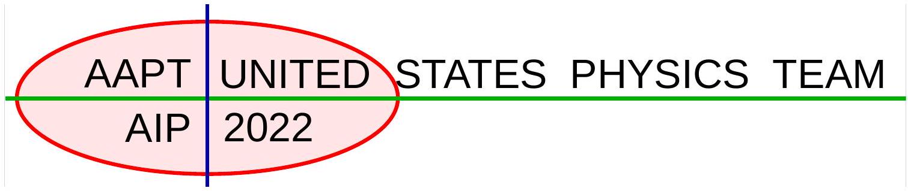
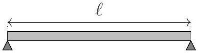
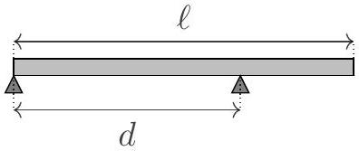
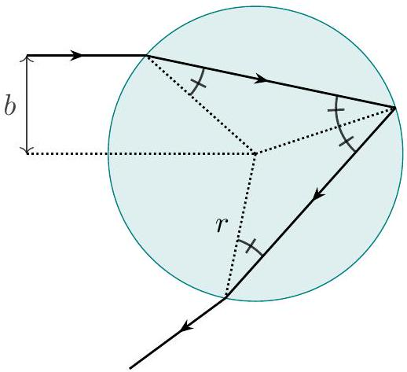
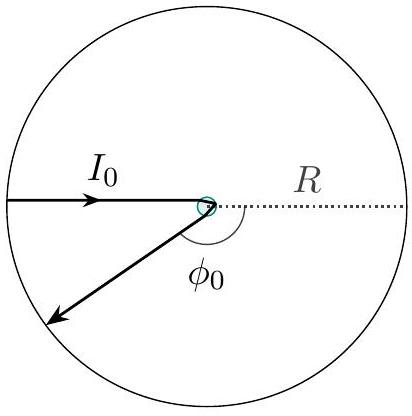
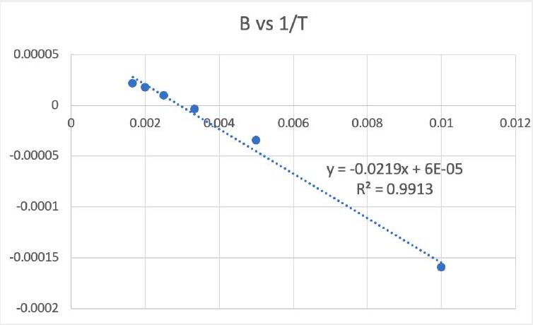

USA Physics Olympiad Exam
DO NOT DISTRIBUTE THIS PAGE
Important Instructions for the Exam Supervisor

- This examination has two parts. Part A has three questions and lasts for 90 minutes. Part B also has three questions and lasts for 90 minutes.
- For each student, print out one copy of the exam and one copy of the answer sheets. Print everything single-sided, and do not staple anything. Divide the exam into the instructions (pages 2-3), Part A questions (pages 4-13), and Part B questions (pages 14-22).
- Begin by giving students the instructions and all of the answer sheets. Let the students read the instructions and fill out their information on the answer sheets. They can keep the instructions for both parts of the exam. Also give students blank sheets of paper to use as scratch paper throughout the exam.
- Students may bring calculators, but they may not use symbolic math, programming, or graphing features of these calculators. Calculators may not be shared, and their memory must be cleared of data and programs. Cell phones or other electronics may not be used during the exam or while the exam papers are present. Students may not use books or other references.
- To start the exam, give students the Part A questions, and allow 90 minutes to complete Part A. Do not give students Part B during this time, even if they finish with time remaining. At the end of the 90 minutes, collect the Part A questions and answer sheets.
- Then give students a 5 to 10 minute break. Then give them the Part B questions, and allow 90 minutes to complete Part B. Do not let students go back to Part A.
- At the end of the exam, collect everything, including the questions, the instructions, the answer sheets, and the scratch paper. Students may not keep the exam questions, but they may be returned to the students after April 19th, 2022.
- After the exam, sort each student's answer sheets by page number. Scan every answer sheet, including blank ones.

We acknowledge the following people for their contributions to this year's exam (in alphabetical order):
Tengiz Bibilashvilli, Abijith Krishnan, Brian Skinner, and Kevin Zhou.

## USA Physics Olympiad Exam

## Instructions for the Student

- You should receive these instructions, the table on the next page, answer sheets, and blank paper for scratch work. Read this page carefully before the exam begins.
- You may use a calculator, but its memory must be cleared of data and programs, and you may not use symbolic math, programming, or graphing features. Calculators may not be shared. Cell phones or other electronics may not be used during the exam or while the exam papers are present. You may not use books or other outside references.
- When the exam begins, your proctor will give you the questions for Part A. You will have 90 minutes to complete three problems. Each question is worth 25 points, but they are not necessarily of the same difficulty. If you finish all of the questions, you may check your work, but you may not look at Part B during this time.
- After 90 minutes, your proctor will collect the questions and answer sheets for Part A. You may then take a short break.
- Then you will work on Part B. You have 90 minutes to complete three problems. Each question is worth 25 points. Do not look at Part A during this time. When the exam ends, you must return all papers to the proctor, including the exam questions.
- Do not discuss the questions of this exam, or their solutions, until after April 19th, 2022. Violations of this rule may result in disqualification.

Below are instructions for writing your solutions.

- This year, all of your solutions will be written on official answer sheets. Nothing outside these answer sheets will be graded. Before the exam begins, write your name, student AAPT number, and proctor AAPT number as directed on the answer sheets.
- There are several answer sheets per problem. If you run out of space for a problem, you may use the extra answer sheets, which are at the end of the answer sheet packet. To ensure this work is graded, you must indicate, at the bottom of your last answer sheet for that problem, that you are using these extra answer sheets.
- Only write within the frame of each answer sheet. To simplify grading, we recommend drawing a box around your final answer for each subpart. You should organize your work linearly and briefly explain your reasoning, which will help you earn partial credit. You may use either pencil or pen, but sure to write clearly so your work will be legible after scanning.
- You may have to fit a line to data, which you can plot on the answer sheet with grid lines. You may use a ruler, pencil, pen, or piece of paper as a straightedge.

## Reference table of possibly useful information

$$
\begin{array} { l l }
g = 9.8 \mathrm {~N} / \mathrm { kg } & G = 6.67 \times 10 ^ { - 11 } \mathrm {~N} \cdot \mathrm {~m} ^ { 2 } / \mathrm { kg } ^ { 2 } \\
k = 1 / 4 \pi \epsilon _ { 0 } = 8.99 \times 10 ^ { 9 } \mathrm {~N} \cdot \mathrm {~m} ^ { 2 } / \mathrm { C } ^ { 2 } & k _ { \mathrm { m } } = \mu _ { 0 } / 4 \pi = 10 ^ { - 7 } \mathrm {~T} \cdot \mathrm {~m} / \mathrm { A } \\
c = 3.00 \times 10 ^ { 8 } \mathrm {~m} / \mathrm { s } & k _ { \mathrm { B } } = 1.38 \times 10 ^ { - 23 } \mathrm {~J} / \mathrm { K } \\
N _ { \mathrm { A } } = 6.02 \times 10 ^ { 23 } ( \mathrm {~mol} ) ^ { - 1 } & R = N _ { \mathrm { A } } k _ { \mathrm { B } } = 8.31 \mathrm {~J} / ( \mathrm { mol } \cdot \mathrm {~K} ) \\
\sigma = 5.67 \times 10 ^ { - 8 } \mathrm {~J} / \left( \mathrm { s } \cdot \mathrm {~m} ^ { 2 } \cdot \mathrm {~K} ^ { 4 } \right) & e = 1.602 \times 10 ^ { - 19 } \mathrm { C } \\
1 \mathrm { eV } = 1.602 \times 10 ^ { - 19 } \mathrm {~J} & h = 6.63 \times 10 ^ { - 34 } \mathrm {~J} \cdot \mathrm {~s} = 4.14 \times 10 ^ { - 15 } \mathrm { eV } \cdot \mathrm {~s} \\
m _ { e } = 9.109 \times 10 ^ { - 31 } \mathrm {~kg} = 0.511 \mathrm { MeV } / \mathrm { c } ^ { 2 } & ( 1 + x ) ^ { n } \approx 1 + n x \text { for } | x | \ll 1 \\
\sin \theta \approx \theta - \theta ^ { 3 } / 6 \text { for } | \theta | \ll 1 & \cos \theta \approx 1 - \theta ^ { 2 } / 2 \text { for } | \theta | \ll 1
\end{array}
$$

You may use this sheet for both parts of the exam.

End of Instructions for the Student

DO NOT OPEN THIS TEST UNTIL YOU ARE TOLD TO BEGIN

Copyright ©2022 American Association of Physics Teachers

## Part A

## Question A1

## Moment of Clarity

Hold your pencil horizontally by its tip. To keep it still, you will have to exert a combination of forces on its bottom and top. These forces can be viewed as a superposition of a net upward force, and a pair of opposite forces. The former ensures the forces on the pencil are balanced, while the latter provides a torque, called the bending moment, which ensures the torques on the pencil are balanced. Since the bending moment arises from a pair of opposite forces, it doesn't depend on the choice of origin.

a. Consider a rod of length $\ell$ and mass per length $\lambda$. What is the bending moment you must exert to hold the rod horizontally at its end?

## Solution

Balance torques about the end of the rod. The weight is $\lambda g \ell$, applied uniformly along the rod, so the torque due to gravity is $\lambda g \ell ^ { 2 } / 2$. This can only be balanced by the bending moment, so it is $\lambda g \ell ^ { 2 } / 2$.

Just as each piece of a string exerts a tension on neighboring pieces in equilibrium, each piece of a solid rod also exerts a bending moment on its neighbors. For thin rods under heavy loads, this bending moment can be the limiting factor that causes them to break.

Suppose a rod is supported at both ends, so that it forms a bridge, as shown at left above. Assume the supports are simple, so that they only provide an upward force, and no bending moment. In equilibrium, a bending moment will appear throughout the rod. The magnitude of the maximum bending moment the rod can exert at any point without breaking is $M _ { 0 }$, and the length of the rod is $\ell$. The bridge is loaded uniformly, with a mass per length of $\lambda$ (including its own mass).

b. Find the maximum possible value of $\lambda$ before the bridge collapses.

## Solution

Placing the origin at the left support, consider the system consisting of the points on the rod at $0 < x < x _ { 0 }$. The external forces are:

- An upward force $\lambda g \ell / 2$ at the left end, due to the left support.
- A weight of $\lambda g x _ { 0 }$.
- An upward force $\lambda g \left( x _ { 0 } - \ell / 2 \right)$ at the right end, due to the rest of the rod.

Now consider balancing torques on this system about $x = x _ { 0 }$. The external torques are:

- A clockwise torque $\lambda g \ell x _ { 0 } / 2$ due to the left support.

- A counterclockwise torque $\lambda g x _ { 0 } ^ { 2 } / 2$ due to the weight.
- A bending moment $M \left( x _ { 0 } \right)$ due to the rest of the rod.

For torque balance, the bending moment must be

$$
M \left( x _ { 0 } \right) = \frac { \lambda g x _ { 0 } ^ { 2 } } { 2 } - \frac { \lambda g \ell x _ { 0 } } { 2 } = \frac { \lambda g x _ { 0 } \left( x _ { 0 } - \ell \right) } { 2 } .
$$

The rod is most likely to break where $M$ is the largest, which occurs at the center, so

$$
M _ { 0 } = \frac { \lambda g ( \ell / 2 ) ^ { 2 } } { 2 } .
$$

Solving for $\lambda$ gives

$$
\lambda = \frac { 8 M _ { 0 } } { g \ell ^ { 2 } } .
$$

c. Now suppose that one support remains at the left end, while the other is a distance $d > \ell / 2$ away from the left end, as shown at right above. In static equilibrium, find the bending moment $M \left( x _ { 0 } \right)$ at a distance $x _ { 0 } < d$ from the left end.

## Solution

To keep the expressions simple, let $W = \lambda g \ell$ be the weight of the rod. By balancing torques about the left end of the rod, the external forces on the entire rod are

- A weight force $W$.
- An upward force $W \ell / 2 d$ from the right support.
- An upward force $W - W \ell / 2 d$ from the left support.

Note that the reason we specified $d > \ell / 2$ is because otherwise, the force from the left support would become negative, in which case the bridge would tip over to the right.
Now consider the system consisting of the points on the rod with $0 < x < x _ { 0 }$, where $x _ { 0 } < d$. To balance the forces, the upward force from the rest of the rod must be

$$
F _ { r } = W \left( \frac { x _ { 0 } } { \ell } + \frac { \ell } { 2 d } - 1 \right) .
$$

The external torques on this system, about the left end, are

- A counterclockwise torque $W x _ { 0 } ^ { 2 } / 2 \ell$ due to the weight.
- A clockwise torque $F _ { r } x _ { 0 }$ due to the rest of the rod.
- A bending moment $M \left( x _ { 0 } \right)$ due to the rest of the rod.

Balancing the torques thus gives

$$
M \left( x _ { 0 } \right) = - W \left( \frac { x _ { 0 } ^ { 2 } } { 2 \ell } + \frac { \ell x _ { 0 } } { 2 d } - x _ { 0 } \right) = - \lambda g \left( \frac { x _ { 0 } ^ { 2 } } { 2 } + \frac { \ell ^ { 2 } x _ { 0 } } { 2 d } - x _ { 0 } \ell \right) .
$$

The sign of $M$ is convention-dependent, so either sign is acceptable.
d. Find the value of $d$ that maximizes the load $\lambda$ that the bridge can take before collapsing.

## Solution

If the bridge doesn't collapse, then the magnitude of the bending moment must be less than $M _ { 0 }$ everywhere throughout the rod. Consider how the bending moment varies as one moves from the left end of the rod to the right. It begins at zero at $x _ { 0 } = 0$, then reaches a positive maximum somewhere between the two supports, when $M ^ { \prime } \left( x _ { 0 } \right)$ vanishes. This occurs when

$$
x _ { 0 } = \ell - \frac { \ell ^ { 2 } } { 2 d }
$$

and which point there is a bending moment of

$$
M _ { 1 } = \frac { \lambda g } { 2 } \left( \ell - \frac { \ell ^ { 2 } } { 2 d } \right) ^ { 2 } .
$$

As a check, we recover the answer to part (b) when $d = \ell$.
Continuing rightward, the bending moment decreases, passes through zero at some point $x _ { 0 } < d$, and then becomes negative. (This change in sign is necessary to support the part of the rod hanging to the right of the right support.) At $x = d$, the bending moment does not change discontinuously, because the supports provide no bending moment. It then smoothly returns to zero as $x _ { 0 }$ approaches $\ell$. Therefore, the most negative value of the bending moment occurs at $x _ { 0 } = d$, giving a bending moment of magnitude

$$
M _ { 2 } = - M ( d ) = \frac { \lambda g } { 2 } ( \ell - d ) ^ { 2 } .
$$

As another check, this matches the answer to part (a) for a rod of length $\ell - d$.
As we move the right support closer to the center, the middle of the bridge becomes more stable, since $M _ { 1 }$ decreases. At the same time, $M _ { 2 }$ increases, because more of the bridge is hanging off the edge of the right support. The bridge will not collapse as long as both of these quantities are less than $M _ { 0 }$. Thus, when the right support is placed most efficiently, both of them will become equal to $M _ { 0 }$ just before the bridge collapses, which means we should have $M _ { 1 } = M _ { 2 }$. Equating them yields

$$
1 - \frac { \ell } { 2 d } = 1 - \frac { d } { \ell }
$$

which gives the answer,

$$
d = \frac { \ell } { \sqrt { 2 } } .
$$

## Question A2

## Death Metal

A droplet of liquid metal has constant mass density and constant surface tension $\sigma$, which causes it to form into a sphere of radius $R$. (Throughout this problem, you may neglect gravity.) A thin wire is inserted into the droplet and connected to an electric current source which slowly charges the droplet. There is a critical value of the charge, $Q _ { 0 }$, that causes the droplet to split in half. Each half takes half the total charge, $Q _ { 0 } / 2$, and half the mass of the original droplet. The "ejected half" is repelled far away from the other half, which remains in contact with the wire.

a. For simplicity, assume the droplet splits as soon as the final state (after the droplet has split in half and the two halves are well separated) has a lower total energy than that of the initial, single droplet. What is the value of $Q _ { 0 }$ ? Give your answer in terms of a dimensionless constant $A$ multiplied by a product of powers of $\sigma , R$, and the vacuum permittivity $\epsilon _ { 0 }$, and give the numeric value of $A$ to three significant figures.

## Solution

Note that $\sigma$ has units of energy/length ${ } ^ { 2 } , R$ has units of length, and $\epsilon _ { 0 }$ has units of charge ${ } ^ { 2 }$ /(energy × length). There is only one combination with dimensions of charge, so we must have

$$
Q _ { 0 } = A \sqrt { \epsilon _ { 0 } \sigma R ^ { 3 } } .
$$

To find the value of $A$, note that a droplet of radius $R$ and charge $Q _ { 0 }$ has a surface tension energy $4 \pi R ^ { 2 } \sigma$ and an electrostatic energy $Q _ { 0 } ^ { 2 } / 2 C$, where $C = 4 \pi \epsilon _ { 0 } R$ is the capacitance of a conducting sphere relative to infinity. Thus, the total energy of the drop is

$$
E _ { 0 } = 4 \pi \sigma R ^ { 2 } + \frac { Q _ { 0 } ^ { 2 } } { 8 \pi \epsilon _ { 0 } R } .
$$

When the droplet splits, the new halves both have charge $Q _ { 0 } / 2$ and a radius $R _ { 1 } = R / 2 ^ { 1 / 3 }$, since the total volume stays the same. The total energy of each of the halves is thus

$$
E _ { 1 } = 4 \pi \sigma R _ { 1 } ^ { 2 } + \frac { \left( Q _ { 0 } / 2 \right) ^ { 2 } } { 8 \pi \epsilon _ { 0 } R _ { 1 } } .
$$

Setting $E _ { 0 } = 2 E _ { 1 }$ and solving for $Q _ { 0 }$ gives

$$
A = 8 \pi \sqrt { \frac { 2 ^ { 1 / 3 } - 1 } { 2 - 2 ^ { 1 / 3 } } } \approx 14.9 .
$$

This model of the instability of a charged liquid drop is not exactly accurate, and was chosen to keep the problem simple. In reality, it isn't enough for the final state to have lower energy; the repulsive electrostatic force needs to exceed the surface tension force, or else the bubble can't get to this state of lower energy. Accounting for this requires a different calculation, first performed by Lord Rayleigh in 1882, which gives the "Rayleigh limit" of $A = 8 \pi \approx 25.1$. Students who successfully derived this result also received full credit for part (a).

b. As more charge is added to the droplet by the current source, it continues to split in half repeatedly. What is the charge $q _ { n }$ on the $n ^ { \text {th } }$ ejected droplet? Give your answer in terms of $Q _ { 0 }$.

## Solution

Consider the situation just before the $n ^ { \text {th } }$ split. At this point, the initial droplet has split in half $n - 1$ times, so it has a volume that is $2 ^ { n - 1 }$ times smaller than the original volume, and thus a radius $R _ { n - 1 } = R / 2 ^ { ( n - 1 ) / 3 }$. By part (a), the charge required to split this drop is

$$
Q _ { n } = A \sqrt { \epsilon _ { 0 } \sigma R _ { n - 1 } ^ { 3 } } = \frac { Q _ { 0 } } { 2 ^ { ( n - 1 ) / 2 } } .
$$

Once the split happens, the $n ^ { \text {th } }$ ejected droplet takes half of this charge, so

$$
q _ { n } = \frac { Q _ { n } } { 2 } = \frac { Q _ { 0 } } { 2 ^ { ( n + 1 ) / 2 } } .
$$

Also note that the radius of this droplet is $R _ { n } = R / 2 ^ { n / 3 }$.

c. In the limit where all of the initial mass of the droplet has been ejected, what is the total work done by the current source? Give your answer in terms of a dimensionless constant $B$ multiplied by a product of powers of $\sigma , R$, and $\epsilon _ { 0 }$, and give the numeric value of $B$ to three significant figures.

## Solution

By dimensional analysis, the total work $W$ done by the voltage source must be

$$
W = B \sigma R ^ { 2 } .
$$

The work $W$ is equal to the difference between the energy $E _ { f }$ of the final state, where there are many small droplets that have been dispersed to far away, and the energy $E _ { i } = 4 \pi \sigma R ^ { 2 }$ of the initial, uncharged droplet. The final energy includes the surface tension and electrostatic energy of all the small droplets, which have radius $R _ { n }$ and charge $q _ { n }$ found in the previous problem. This means that the final energy is

$$
\begin{aligned}
E _ { f } & = \sum _ { n = 1 } ^ { \infty } \left( 4 \pi \sigma R _ { n } ^ { 2 } + \frac { q _ { n } ^ { 2 } } { 8 \pi \epsilon _ { 0 } R _ { n } } \right) \\
& = 4 \pi \sigma R ^ { 2 } \sum _ { n = 1 } ^ { \infty } \frac { 1 } { 2 ^ { 2 n / 3 } } + \frac { Q _ { 0 } ^ { 2 } } { 16 \pi R _ { 0 } \epsilon _ { 0 } } \sum _ { n = 1 } ^ { \infty } \frac { 1 } { 2 ^ { 2 n / 3 } } \\
& = 4 \pi \sigma R ^ { 2 } \left( 1 + \frac { A ^ { 2 } } { 64 \pi ^ { 2 } } \right) \sum _ { n = 1 } ^ { \infty } \frac { 1 } { 2 ^ { 2 n / 3 } } \\
& = 4 \pi \sigma R ^ { 2 } \left( 1 + \frac { A ^ { 2 } } { 64 \pi ^ { 2 } } \right) \frac { 1 } { 2 ^ { 2 / 3 } - 1 } = 4 \pi \sigma R ^ { 2 } \times 2.30 .
\end{aligned}
$$

Here we have inserted the results found in part (b), then used the result of part (a) and summed the geometric series. Thus,

$$
W = E _ { f } - E _ { i } \approx \left( 4 \pi \sigma R ^ { 2 } \right) \times 1.30 = 16.3 \sigma R ^ { 2 } .
$$

## Question A3

## Rainbow Road

In geometric optics, a caustic is a bright curve of light that appears when many incoming light rays are focused in the same outgoing direction. The most famous example of a caustic is a rainbow, which occurs when light interacts with spherical water droplets. Consider a spherical liquid droplet of radius $r$ with index of refraction $1 < n < 2$, suspended in air with index of refraction $n = 1$.

a. Consider a light ray that enters the droplet with impact parameter $b$, reflects once off the inside surface of the droplet, then exits, as shown at left below. Give your answers in terms of the dimensionless impact parameter $x = b / r$. (Hint: the four marked angles are congruent.)

    i. Find the angle by which the light ray is deflected at the first refraction.
    ii. Find the angle by which the light ray is deflected at the reflection.
    iii. Find the angle by which the light ray is deflected at the second refraction.

The sum of these three quantities is the net deflection angle $\phi ( x )$. (The light can also reflect inside more than once, or never enter at all, but for simplicity we will ignore these other paths.)

## Solution

The angle the incoming light ray makes with to the normal of the droplet is $\theta _ { 1 } = \arcsin ( x )$. By Snell's law, the angle to the normal inside the droplet is $\theta _ { 2 } = \arcsin ( x / n )$.

i. The first refraction causes a deflection of $\theta _ { 1 } - \theta _ { 2 }$.
ii. The reflection keeps the angle to the normal the same, and causes a deflection of $\pi - 2 \theta _ { 2 }$.
iii. At this point, the angle to the normal is still $\theta _ { 2 }$, and by Snell's law, it reverts to $\theta _ { 1 }$ outside the droplet. This causes a deflection of $\theta _ { 1 } - \theta _ { 2 }$, with the same sign as in part (i).

Thus, we conclude

$$
\phi ( x ) = \pi - 4 \theta _ { 2 } + 2 \theta _ { 1 } = \pi - 4 \arcsin ( x / n ) + 2 \arcsin ( x ) .
$$

The definition of $\phi$ is convention-dependent, so answers that differed by a minus sign and/or a factor of $2 \pi$ were also accepted.

b. Next, we consider when caustics form in general. Suppose the droplet is uniformly illuminated by parallel light rays of intensity $I _ { 0 }$, and sits at the center of a spherical screen of radius $R \gg r$, as shown at right above. Consider the light that enters near dimensionless impact parameter $x _ { 0 }$, and exits near angle $\phi _ { 0 } = \phi \left( x _ { 0 } \right)$.
    i. What is the power incident on the droplet at $x _ { 0 } \leq x \leq x _ { 0 } + d x$ ?

## Solution

The region with impact parameters in this region is a thin annulus with radius $r x$ and cross-sectional width $r d x$. Then, the power is

$$
2 \pi \left( I _ { 0 } r ^ { 2 } \right) x _ { 0 } | d x | .
$$

ii. What is the area on the screen illuminated by the outgoing rays, at $\phi _ { 0 } \leq \phi \leq \phi _ { 0 } + d \phi$ ?

## Solution

By similar reasoning to the previous part, the area is

$$
d A = 2 \pi R ^ { 2 } \sin \phi | d \phi | .
$$

iii. A caustic occurs when the intensity of light on the screen diverges. Assume that $\phi _ { 0 } \neq 0$ and $\phi _ { 0 } \neq \pi$. Under what conditions does light incident at $x _ { 0 }$ lead to a caustic at $\phi _ { 0 }$ ? Express your answer as a condition on the function $\phi ( x )$.

## Solution

By dividing our two answers, the intensity on the screen is

$$
I ( \phi ) = \frac { I _ { 0 } r ^ { 2 } } { R ^ { 2 } } \frac { x } { | d \phi / d x | \sin \phi } .
$$

This diverges when the denominator becomes zero, which in this case only occurs when $d \phi / d x$ vanishes. That is, a caustic will occur at $\phi _ { 0 } = \phi ( x )$ if

$$
\phi ^ { \prime } \left( x _ { 0 } \right) = 0 .
$$

Intuitively, this condition means that a broad range of incoming light rays end up focused on a narrow curve on the screen.
c. Find the angle $\phi _ { 0 }$ of the rainbow in terms of $n$. (Hint: the derivative of $\arcsin ( x )$ is $1 / \sqrt { 1 - x ^ { 2 } }$.)

## Solution

The condition for a caustic is $\phi ^ { \prime } \left( x _ { 0 } \right) = 0$, which implies

$$
\frac { 2 } { \sqrt { 1 - x _ { 0 } ^ { 2 } } } - \frac { 4 } { \sqrt { n ^ { 2 } - x _ { 0 } ^ { 2 } } } = 0
$$

Solving for $x _ { 0 }$ gives

$$
x _ { 0 } = \sqrt { \frac { 4 - n ^ { 2 } } { 3 } } .
$$

In particular, this implies that a caustic will appear for the entire range of $n$ considered in this problem. Now, substituting this back into $\phi ( x )$ gives

$$
\phi _ { 0 } = \pi - 4 \arcsin \left( \sqrt { \frac { 4 - n ^ { 2 } } { 3 n ^ { 2 } } } \right) + 2 \arcsin \left( \sqrt { \frac { 4 - n ^ { 2 } } { 3 } } \right) .
$$

d. For water, the index of refraction of red light is 1.331, and the index of refraction of blue light is 1.340. Find the angular width of the rainbow on the screen and give your answer in degrees.

## Solution

Substituting these two indices of refraction into the above equation and subtracting the results yields 1.30°.

e. A glory is an optical phenomenon which involves light scattered directly backward, at $\phi = \pi$, leading to an apparent halo around the shadow of an observer's head. For what values of $n$ is there a caustic at $\phi = \pi$ ? Can glories from water droplets be explained in terms of caustics?

## Solution

Referring to our answer above, we have a caustic whenever the denominator $| d \phi / d x | \sin \phi$ vanishes, and $\sin \phi$ vanishes for $\phi = \pi$. Therefore, we will have a caustic at $\phi = \pi$ as long as light can be reflected backwards at all, i.e. whenever there is a solution to $\phi ( x ) = \pi$. That is because at this angle, all the outgoing light is directed at a single point on the screen.
We thus need to solve

$$
\arcsin ( x ) = 2 \arcsin ( x / n ) .
$$

Taking the sine of both sides and using the double angle formula gives

$$
x = 2 ( x / n ) \cos ( \arcsin ( x / n ) ) = \frac { 2 x \sqrt { n ^ { 2 } - x ^ { 2 } } } { n ^ { 2 } } .
$$

Solving for $n$ gives

$$
n = \frac { \sqrt { 2 } x } { \sqrt { 1 - \sqrt { 1 - x ^ { 2 } } } }
$$

As the impact parameter $x$ yielding the backward caustic ranges from 0 to 1 , the value of $n$ ranges from a minimum of 2 to a minimum of $\sqrt { 2 }$. Thus,

$$
\sqrt { 2 } < n < 2 .
$$

The index of refraction of water is outside this range, so glories from water droplets cannot be explained in terms of caustics. The reason glories are visible is still under debate, though all proposed mechanisms rely on the wave nature of light. For example, one proposed

solution invoking "light tunneling" is explored in this paper. This problem was inspired by Berry, Contemporary Physics 56:1 (2015): 2-16.

## STOP: Do Not Continue to Part B

If there is still time remaining for Part A, you should review your work for Part A, but do not continue to Part B until instructed by your exam supervisor.

Once you start Part B, you will not be able to return to Part A.

## Part B

## Question B1

## Virial Reality

The ideal gas law states that $P V _ { m } = R T$, where $V _ { m } = V / n$ is the volume per mole of gas. However, any real gas will exhibit deviations from the ideal gas law, described by the virial expansion,

$$
P V _ { m } = R T \left( 1 + \frac { B ( T ) } { V _ { m } } + \frac { C ( T ) } { V _ { m } ^ { 2 } } + \ldots \right) .
$$

For gases with low density, the higher-order terms are negligible, so in this problem we will neglect all of the temperature-dependent terms in parentheses except for $B ( T ) / V _ { m }$. The table below shows measurements of $B$ for nitrogen gas $\left( N _ { 2 } \right)$ at atmospheric pressure, $P = 1.01 \times 10 ^ { 5 } \mathrm {~Pa}$.

$$
\begin{array} { c c }
T ( \mathrm {~K} ) & B \left( \mathrm {~cm} ^ { 3 } / \mathrm { mol } \right) \\
\hline 100 & - 160 \\
200 & - 35 \\
300 & - 4.2 \\
400 & 9.0 \\
500 & 16.9 \\
600 & 21.3
\end{array}
$$

a. According to the ideal gas law, what is the value of $V _ { m }$ at temperatures 100 K, 300 K, and 600 K? Give your answers in SI units.

## Solution

Plugging in the values and converting to $\mathrm { m } ^ { 3 } / \mathrm { mol }$ gives

$$
V _ { m } = \frac { R T } { P } = \begin{cases} 8.23 \times 10 ^ { - 3 } \mathrm {~m} ^ { 3 } / \mathrm { mol } & T = 100 \mathrm {~K} \\ 2.47 \times 10 ^ { - 2 } \mathrm {~m} ^ { 3 } / \mathrm { mol } & T = 300 \mathrm {~K} \\ 4.94 \times 10 ^ { - 2 } \mathrm {~m} ^ { 3 } / \mathrm { mol } & T = 600 \mathrm {~K} \end{cases}
$$

b. What is the percentage change in $V _ { m }$ at these temperatures if one accounts for $B ( T )$ ?

## Solution
The fractional change in volume is
$$
\frac { \Delta V _ { m } } { V _ { m } } \approx \frac { B ( T ) } { V _ { m } } \approx \begin{cases} - 1.9 \% & T = 100 \mathrm {~K} \\ - 0.02 \% & T = 300 \mathrm {~K} \\ 0.04 \% & T = 600 \mathrm {~K} \end{cases}
$$
c. In 1910, van der Waals was awarded the Nobel Prize for formulating the equation
$$
\left( P + \frac { a } { V _ { m } ^ { 2 } } \right) \left( V _ { m } - b \right) = R T
$$
which accurately describes many real gases. According to this equation, what is the form of $B ( T )$ ? You may assume that $b \ll V _ { m }$.

## Solution

We have

$$
P + \frac { a } { V _ { m } ^ { 2 } } = \frac { R T } { V _ { m } - b } \approx \frac { R T } { V _ { m } } \left( 1 + \frac { b } { V _ { m } } \right) .
$$

Rearranging yields

$$
P V _ { m } \approx R T \left( 1 + \frac { b } { V _ { m } } - \frac { a } { V _ { m } R T } \right)
$$

from which we conclude

$$
B ( T ) = b - \frac { a } { R T } .
$$

d. Using the data above, extract the values of $a$ and $b$. Give your answers in SI units.

## Solution

First, we convert the data points to SI units, giving

| $T ( \mathrm {~K} )$ | $B \left( \mathrm {~m} ^ { 3 } / \mathrm { mol } \right)$ |
| :--- | :--- |
| 100 | $- 1.6 \times 10 ^ { - 4 }$ |
| 200 | $- 3.5 \times 10 ^ { - 5 }$ |
| 300 | $- 4.2 \times 10 ^ { - 6 }$ |
| 400 | $9.0 \times 10 ^ { - 6 }$ |
| 500 | $1.69 \times 10 ^ { - 5 }$ |
| 600 | $2.13 \times 10 ^ { - 5 }$ |

Now, plotting $B$ versus $1 / T$, the slope is $- a / R$ and the $y$-intercept is $b$.

The final result is

$$
a = 0.18 \mathrm {~J} \mathrm {~m} ^ { 3 } / \mathrm { mol } ^ { 2 } , \quad b = 6 \times 10 ^ { - 5 } \mathrm {~m} ^ { 3 } / \mathrm { mol } .
$$

Any answer within 20\% of this is acceptable.
e. In this problem, we have neglected terms in the virial expansion beyond $B ( T )$, which is a good approximation as long as the volume correction due to $B ( T )$ itself is small. Assuming the van der Waals equation holds, numerically estimate the temperature range within which the volume correction due to $B ( T )$ is at most 10\%, for nitrogen gas at atmospheric pressure.

Copyright ©2022 American Association of Physics Teachers

## Solution

We are looking for the temperature range where

$$
| B ( T ) | \lesssim \frac { V _ { m } } { 10 } \approx \frac { R T } { 10 P } .
$$

At high temperatures, $B ( T )$ always yields a small correction for nitrogen at atmospheric pressure. At low temperatures, $B ( T )$ is dominated by the $- a / R T$ term, so we require

$$
T \gtrsim \frac { \sqrt { 10 P a } } { R } = 50 \mathrm {~K} .
$$

Any answer within 25\% of this is acceptable.

Question B2
Broken Vase
A uniformly charged ring of radius $d$ has total charge $Q$ and is fixed in place. A point charge $- q$ of mass $m$ is placed at its center. Both $Q$ and $q$ are positive. As a result, if the point charge is given a small velocity along the ring's axis of symmetry, it will oscillate about the ring's center.

a. Find the period $T$ of the oscillations.
Solution
Suppose the charge is displaced by a small distance $\Delta x$. The horizontal component of the electric field of the ring, at the charge, is
$$
E _ { x } \approx E \frac { \Delta x } { d } = \frac { Q } { 4 \pi \epsilon _ { 0 } d ^ { 3 } } \Delta x .
$$
The restoring force is linear in $\Delta x$, so it acts like a spring with spring constant
$$
k = \frac { Q q } { 4 \pi \epsilon _ { 0 } d ^ { 3 } } .
$$
Thus, the period of oscillation is
$$
T = 2 \pi \sqrt { \frac { m } { k } } = \sqrt { \frac { 16 \pi ^ { 3 } \epsilon _ { 0 } m d ^ { 3 } } { Q q } } .
$$

For the rest of the problem, we will consider this situation in a reference frame where the ring is moving along its axis of symmetry with a constant speed $v$, which may be comparable to the speed of light $c$. In this frame, the ring and point charge have charge $Q ^ { \prime }$ and $q ^ { \prime }$, and the point charge still oscillates about the ring's center.

b. What is the period $T ^ { \prime }$ of oscillation of the point charge in this frame?
Solution
By directly applying time dilation to the answer of part (a),
$$
T ^ { \prime } = \gamma T = \frac { 1 } { \sqrt { 1 - v ^ { 2 } / c ^ { 2 } } } \sqrt { \frac { 16 \pi ^ { 3 } \epsilon _ { 0 } m d ^ { 3 } } { Q q } } .
$$
c. When the charge is a small distance $\Delta x$ from the center of the ring, find the restoring force in terms of $q ^ { \prime } , Q ^ { \prime } , v , d , \Delta x$, and fundamental constants.

Solution
The position of the charge, relative to each charge in the ring, is at $\theta \approx 90 ^ { \circ }$. Thus, using

the provided information, we have
$$
E _ { x } \approx \frac { Q ^ { \prime } } { 4 \pi \epsilon _ { 0 } d ^ { 2 } } \frac { 1 - v ^ { 2 } / c ^ { 2 } } { \left( 1 - v ^ { 2 } / c ^ { 2 } \right) ^ { 3 / 2 } } \sin \theta .
$$
Thus, the restoring force is
$$
F = - \frac { Q ^ { \prime } q ^ { \prime } } { 4 \pi \epsilon _ { 0 } d ^ { 3 } } \frac { 1 } { \sqrt { 1 - v ^ { 2 } / c ^ { 2 } } } \Delta x .
$$
d. Suppose the restoring force has the form $F = - k \Delta x$. Find the period of the resulting oscillations in terms of $k , m , v$, and fundamental constants.

## Solution

By the definition of force given in the information below, we have

$$
F = \frac { d p } { d t } = m \frac { d } { d t } \left( \frac { v } { \sqrt { 1 - v ^ { 2 } / c ^ { 2 } } } \right) .
$$

Carrying out the derivative and simplifying gives

$$
F = \frac { m } { \left( 1 - v ^ { 2 } / c ^ { 2 } \right) ^ { 3 / 2 } } \frac { d v } { d t } = - k \Delta x
$$

For small oscillations, the velocity is always approximately equal to the original velocity $v$. Thus, the motion is still simple harmonic, except that the mass is effectively

$$
m _ { \mathrm { eff } } = \frac { m } { \left( 1 - v ^ { 2 } / c ^ { 2 } \right) ^ { 3 / 2 } } .
$$

Thus, we conclude

$$
T ^ { \prime } = 2 \pi \sqrt { \frac { m _ { \mathrm { eff } } } { k } } = 2 \pi \sqrt { \frac { m } { k } \frac { 1 } { \left( 1 - v ^ { 2 } / c ^ { 2 } \right) ^ { 3 / 2 } } } .
$$

e. Suppose the electric charge transforms between reference frames as $Q ^ { \prime } = \gamma ^ { n } Q$ and $q ^ { \prime } = \gamma ^ { n } q$. By combining your answers to parts (c) and (d), and comparing to part (b), find the value of $n$.

## Solution

The final result of part (c) tells us that

$$
k = \frac { Q ^ { \prime } q ^ { \prime } } { 4 \pi \epsilon _ { 0 } d ^ { 3 } } \frac { 1 } { \sqrt { 1 - v ^ { 2 } / c ^ { 2 } } }
$$

Plugging this into the answer to part (d) gives

$$
T ^ { \prime } = \frac { 1 } { \sqrt { 1 - v ^ { 2 } / c ^ { 2 } } } \sqrt { \frac { 16 \pi ^ { 3 } \epsilon _ { 0 } m d ^ { 3 } } { Q ^ { \prime } q ^ { \prime } } } .
$$

This is precisely the same as the answer to part (b) if $Q ^ { \prime } q ^ { \prime } = Q q$, or in other words,

$$
n = 0 .
$$

That is, the electric charge is Lorentz invariant.

To solve this problem, you will need the following results from relativity:

- The Lorentz factor is defined as $\gamma = 1 / \sqrt { 1 - v ^ { 2 } / c ^ { 2 } }$.
- The momentum of a particle is $\mathbf { p } = \gamma m \mathbf { v }$, and $m$ is the same in all frames.
- The electromagnetic force on a charge $q$ is $\mathbf { F } = d \mathbf { p } / d t = q ( \mathbf { E } + \mathbf { v } \times \mathbf { B } )$.
- The electric field of a charge $q$ at the origin with constant velocity $\mathbf { v }$ is radial, with magnitude
$$
E = \frac { q } { 4 \pi \epsilon _ { 0 } r ^ { 2 } } \frac { 1 - v ^ { 2 } / c ^ { 2 } } { \left( 1 - \left( v ^ { 2 } / c ^ { 2 } \right) \sin ^ { 2 } \theta \right) ^ { 3 / 2 } }
$$
where $\theta$ is the angle of r to v.

## Question B3

## Time Crystal

The kinetic energy $E$, momentum $p$, and velocity $v$ of a particle moving in one dimension satisfy

$$
F = \frac { d p } { d t } = \frac { d E } { d x } , \quad v = \frac { d E } { d p }
$$

where $F$ is the external force. For a free particle, the momentum and energy are related by $E = p ^ { 2 } / 2 m$. However, when an electron moves inside a metal, its interactions with the crystal lattice of positively charged ions lead to a different relationship between momentum and energy. All of the above identities still apply, but now suppose that

$$
E ( p ) = V ( 1 - \cos ( p b ) )
$$

where $V$ and $b$ are constants that depend on the metal. This result is inherently quantum mechanical in origin, and as we will see, it leads to some rather strange behavior.

a. First, we investigate the motion of the electron in general.
    i. Find the velocity as a function of $p$.

## Solution

Using the provided identity,

$$
v = \frac { d E } { d p } = V b \sin ( p b ) .
$$

ii. The effective mass $m _ { * }$ of the electron is defined so that it satisfies $F = m _ { * } a$. Find the effective mass as a function of $p$.

## Solution

By definition, we have

$$
\frac { d p } { d t } = m _ { * } \frac { d v } { d t }
$$

so by the chain rule, we conclude

$$
m _ { * } = \left( \frac { d v } { d p } \right) ^ { - 1 } = \frac { 1 } { V b ^ { 2 } } \frac { 1 } { \cos ( p b ) } .
$$

Note that at some points, this mass is negative! Applying a forward force can cause an electron to accelerate backwards, which leads to the strange result we'll find in part b.ii. (This doesn't contradict conservation of momentum, because the forward momentum ends up imparted to the crystal lattice, causing the solid as a whole to recoil.)

b. Now suppose a metal rod of infinite length, aligned with the $x$-axis, contains conducting electrons of charge $- e$, initially with zero momentum. At time $t = 0$, an electric field $\mathbf { E } = E _ { 0 } \hat { \mathbf { x } }$ is turned on, and is experienced by every electron in the rod. Ignore the interactions of the electrons with each other.
    i. For an electron that starts at $x = 0$ at time $t = 0$, find its position $x ( t )$.

## Solution

The momentum is $p = F t = - e E _ { 0 } t$, so using the result of part a.i,

$$
v ( t ) = - V b \sin \left( e E _ { 0 } t b \right) .
$$

Integrating both sides gives

$$
x ( t ) = \frac { V } { e E _ { 0 } } \left( \cos \left( e E _ { 0 } t b \right) - 1 \right) .
$$

ii. If the number of conducting electrons per unit volume is $n$, and the cross-sectional area of the rod is $A$, find the average current in the rod over a long time.

## Solution

The electrons just oscillate, with zero average velocity. Therefore, the average current they supply is zero! This strange phenomenon is called a Bloch oscillation. It doesn't occur in ordinary metals because of the frequent collisions between electrons and ions, considered in the parts below.

iii. Now suppose that every time $\tau$, each electron suffers a collision with the crystal lattice, causing its momentum to reset to zero. In the limit of frequent collisions, $e E _ { 0 } b \tau \ll 1$, find the average current in the rod over a long time.

## Solution

For small times, the velocity is approximately

$$
v ( t ) \approx - \left( e E _ { 0 } V b ^ { 2 } \right) t
$$

where we applied the small angle approximation to the result of part b.i. Thus, if collisions happen every time $\tau$, the average velocity is

$$
\bar { v } = - \frac { 1 } { 2 } \left( e E _ { 0 } V b ^ { 2 } \right) \tau .
$$

Therefore, the average current is

$$
I = - n A e \bar { v } = \frac { 1 } { 2 } n A e ^ { 2 } E _ { 0 } V b ^ { 2 } \tau .
$$

The plus sign makes sense, since it means current flows parallel to the applied field.

iv. If $\tau$ can be freely adjusted, estimate the maximum possible average current in the rod, up to a dimensionless constant.

## Solution

If $\tau$ is small, then more frequent collisions slow down the current, as we showed in part b.iii. But if $\tau$ is very large, then the current cancels itself out due to Bloch oscillations, as we showed in part b.ii. Therefore, the highest possible current occurs when the electrons

have time to accelerate to a substantial fraction of their maximum possible speed $V b$, but collide before their effective mass goes negative. This occurs when

$$
e E _ { 0 } \tau b \sim 1
$$

and gives an average current

$$
I \sim n A e V b .
$$

Some students tried to answer this part using dimensional analysis, but that won't work, since there are 5 variables and only 4 independent dimensions (mass, length, time, and charge). Incidentally, you can find the dimensionless coefficient by solving a simple equation numerically, though this wasn't required.
