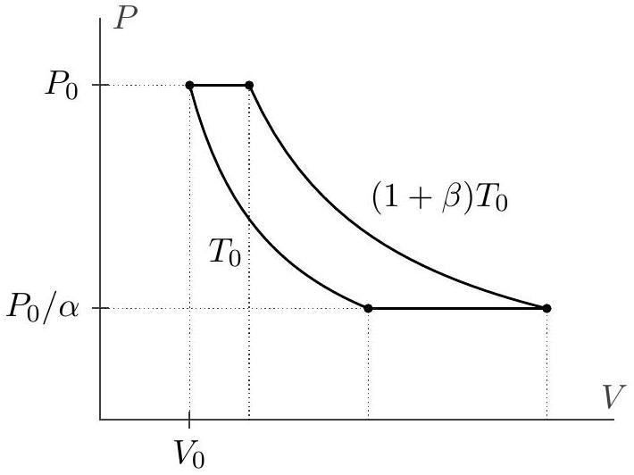
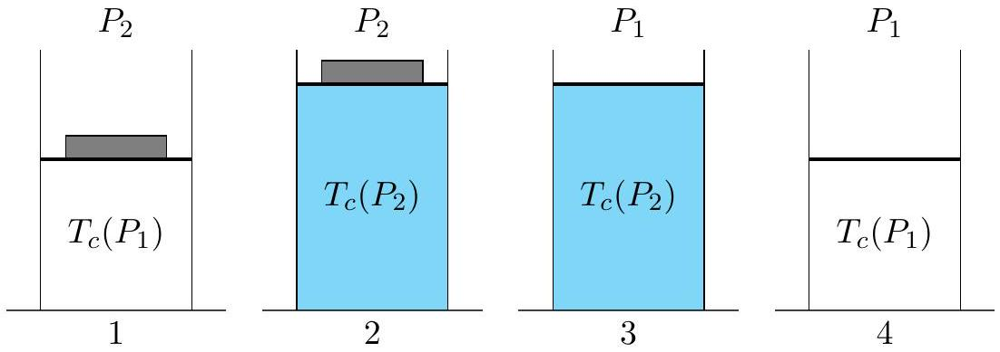

## Question A3

## The Motive Power of Ice

In the Carnot cycle, a gas is heated at constant temperature $T _ { H }$ and cooled at constant temperature $T _ { C }$. Furthermore, no other heat transfer occurs, and all other steps of the cycle are reversible. The laws of thermodynamics state that any such cycle must have efficiency $\eta = W / Q _ { \text {in } } = 1 - \left( T _ { C } / T _ { H } \right)$. Below we will explore two other heat engines, which recover this efficiency in certain limits.

a. Consider the following heat engine involving one mole of ideal monatomic gas. The gas begins at temperature $T _ { 0 }$, pressure $P _ { 0 }$, and volume $V _ { 0 }$, and undergoes four reversible steps.

    1. The gas is expanded at constant pressure until its temperature rises to $( 1 + \beta ) T _ { 0 }$.
    2. The gas is expanded at constant temperature until its pressure falls to $P _ { 0 } / \alpha$.
    3. The gas is contracted at constant pressure until its temperature falls back to $T _ { 0 }$.
    4. The gas is contracted at constant temperature until its pressure rises back to $P _ { 0 }$.
i. Which steps require heat to be transferred to the gas? For each such step, give the total heat input in terms of $P _ { 0 } , V _ { 0 } , \alpha$, and $\beta$.

## Solution

Heat is added to the gas in the first two steps. In the first step, we have heating at constant pressure, which has molar heat capacity $c _ { p } = 5 R / 2$, so

$$
Q _ { 1 } = c _ { p } \Delta T = \frac { 5 } { 2 } R \beta T _ { 0 } = \frac { 5 } { 2 } \beta P _ { 0 } V _ { 0 }
$$

where we used the ideal gas law in the final step. In the second step, the heat added to the gas compensates for the work done while it expands, so

$$
Q _ { 2 } = ( 1 + \beta ) P _ { 0 } V _ { 0 } \ln \frac { V _ { f } } { V _ { i } } = ( 1 + \beta ) P _ { 0 } V _ { 0 } \ln \alpha .
$$

ii. Under what conditions on $\alpha$ and $\beta$ would we expect the efficiency of this heat engine to approach that of a Carnot cycle working between the same maximum and minimum temperatures?

## Solution

Since all the steps are reversible, we recover the Carnot efficiency when almost all the heat transfer happens at the same temperature, i.e. when $Q _ { 1 } \ll Q _ { 2 }$. This holds when

$$
\frac { \beta } { \beta + 1 } \ll \ln \alpha .
$$

We should also consider the other two steps, which have heat transfer

$$
\left| Q _ { 3 } \right| = c _ { p } | \Delta T | = \frac { 5 } { 2 } R \beta T _ { 0 } = \frac { 5 } { 2 } \beta P _ { 0 } V _ { 0 }
$$

and

$$
\left| Q _ { 4 } \right| = P _ { 0 } V _ { 0 } \ln \frac { V _ { f } } { V _ { i } } = P _ { 0 } V _ { 0 } \ln \alpha .
$$

We have $\left| Q _ { 3 } \right| \ll \left| Q _ { 4 } \right|$ when

$$
\beta \ll \ln \alpha
$$

which is stricter than the previous condition. Thus, we recover the Carnot efficiency when $\beta \ll \ln \alpha$.
iii. Find the efficiency of this heat engine for general $\alpha$ and $\beta$.

## Solution

We calculate the net work throughout all four steps,

$$
W = \beta P _ { 0 } V _ { 0 } + ( 1 + \beta ) P _ { 0 } V _ { 0 } \ln \alpha - \beta P _ { 0 } V _ { 0 } - P _ { 0 } V _ { 0 } \ln \alpha
$$

where the first and third terms are just the usual $P \Delta V$ work, and the second and fourth use the form done in an isothermal process. Simplifying gives

$$
W = P _ { 0 } V _ { 0 } \beta \ln \alpha .
$$

Therefore, the efficiency of the process is

$$
\eta = \frac { \beta \ln \alpha } { ( 1 + \beta ) \ln \alpha + 5 \beta / 2 } .
$$

One way to check the answer is to note that the Carnot efficiency would be $\beta / ( 1 + \beta )$. Our general result reduces to this efficiency when the second term in the denominator is negligible, which is precisely the condition we identified in part (b).

The second half of the problem is on the next page.

b. Now consider a heat engine built around the freezing and melting of water, which occurs at a pressure-dependent temperature $T _ { c } ( P )$. Initially, a volume of $V$ of water is squeezed underneath a piston, so that it experiences a total pressure $P _ { 1 }$, and the water is on the edge of freezing, with temperature $T _ { c } \left( P _ { 1 } \right)$. The engine then undergoes four reversible steps.

    1. A mass is slowly placed on the piston, raising the total pressure to $P _ { 2 }$.
    2. The water is cooled to temperature $T _ { c } \left( P _ { 2 } \right)$ and frozen.
    3. The mass is slowly removed from the piston, lowering the pressure back to $P _ { 1 }$.
    4. The ice is heated back to temperature $T _ { c } \left( P _ { 1 } \right)$ and melted.

Assume that water and ice are incompressible, with fixed densities $\rho _ { w }$ and $\rho _ { i }$.

i. What is the net work done by this engine, in terms of $P _ { 1 } , P _ { 2 } , V$, and the densities?

## Solution

The system expands at a pressure $P _ { 2 }$ and contracts at a pressure $P _ { 1 }$, so the net work done is

$$
W = \left( P _ { 2 } - P _ { 1 } \right) \Delta V = \left( P _ { 2 } - P _ { 1 } \right) V \frac { \rho _ { w } - \rho _ { i } } { \rho _ { i } } .
$$

Concretely, this work used to raise the mass, so it could also be calculated as $M g \Delta H$.

ii. Assume the latent heat per unit mass $L$ to melt ice is large, so that freezing and melting account for essentially all of the heat transfer in the cycle. What is the efficiency of the engine, in terms of $P _ { 1 } , P _ { 2 } , L$, and the densities?

## Solution

The heat transferred in is used to melt the ice, $Q _ { \text {in } } = \rho _ { w } V L$, so

$$
\eta = \frac { W } { Q _ { \mathrm { in } } } = \frac { P _ { 2 } - P _ { 1 } } { L } \frac { \rho _ { w } - \rho _ { i } } { \rho _ { w } \rho _ { i } } .
$$

Note that the efficiency can also be expressed as $\eta = 1 - \frac { Q _ { \text {out } } } { Q _ { \text {in } } }$, but in order to find $Q _ { \text {out } }$ directly, we would need to know how to latent heat varies with pressure, which isn't given in the problem.

iii. Since we assumed all heat transfer occurs during melting or freezing, this cycle has the same efficiency as a Carnot cycle. In the limit where $P _ { 1 }$ and $P _ { 2 }$ are very close, use this fact to infer an expression for $d T _ { c } / d P$ in terms of $T _ { c } , L$, and the densities.

## Solution

The Carnot efficiency, for the same high and low temperatures, is

$$
\eta = \frac { T _ { c } \left( P _ { 1 } \right) - T _ { c } \left( P _ { 2 } \right) } { T _ { c } \left( P _ { 1 } \right) } .
$$

Combining this with the result of part (b) gives

$$
\frac { T _ { c } \left( P _ { 2 } \right) - T _ { c } \left( P _ { 1 } \right) } { P _ { 2 } - P _ { 1 } } = - \frac { T _ { c } \left( P _ { 1 } \right) } { L } \frac { \rho _ { w } - \rho _ { i } } { \rho _ { w } \rho _ { i } }
$$

and taking the limit of $P _ { 1 } \approx P _ { 2 }$, the left-hand side becomes a derivative, so

$$
\frac { d T _ { c } } { d P } = - \frac { T _ { c } } { L } \frac { \rho _ { w } - \rho _ { i } } { \rho _ { w } \rho _ { i } } .
$$

This is equivalent to the well-known Clausius-Clapeyron equation, and this heat engine was first devised by the brothers Thomson and Kelvin.

## STOP: Do Not Continue to Part B

If there is still time remaining for Part A, you can review your work for Part A, but do not continue to Part B until instructed by your exam supervisor.

Once you start Part B, you will not be able to return to Part A.

## Part B
