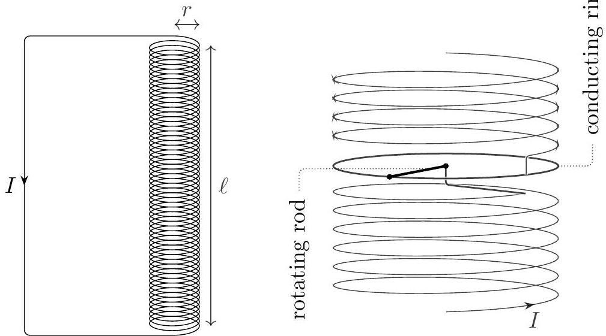

## Question B1

## Electric Roulette

Consider a cylindrical solenoid with radius $r$, length $\ell \gg r$, and $n$ turns per unit length. It is made of one continuous wire, with the top connecting back to the bottom as shown at left.

In the middle of the solenoid, part of the wire is replaced with the assembly shown at right. A uniform conducting rod of mass $m$ and radius $r$ is connected to the bottom half of the solenoid, and is free to rotate about the solenoid's axis of symmetry. The end of the rod slides on a fixed conducting ring, which is attached to the top half of the solenoid. This assembly and the solenoid form one continuous conductor, carrying total current $I$.

a. What is the inductance of this system? Assume $n r \gg 1$, so that the magnetic field produced by the current in the rod and ring is negligible.

## Solution

The magnetic field produced is $B = \mu _ { 0 } n I$, so the flux through one turn of the solenoid is $\mu _ { 0 } n I \left( \pi r ^ { 2 } \right)$. There are $n \ell$ turns in total, so the inductance is

$$
L = \frac { \Phi } { I } = \mu _ { 0 } n ^ { 2 } \pi r ^ { 2 } \ell .
$$

b. When the rod is within a uniform vertical magnetic field $B$, find the torque it experiences in terms of $I , B$, and $r$.

## Solution

The torque is due to the Lorentz force on the current as it travels radially outward, from the center of the disc towards its edge. Note that only the radial motion of the current contributes to the torque, so we would get the same torque if the current traveled in a

straight line from the center to the rim. In this case, the total torque is
$$
\tau = - \int _ { 0 } ^ { r } I B s d s = - \frac { I B r ^ { 2 } } { 2 }
$$
where the minus sign indicates that the torque tends to slow down the rotation, when $I$ is defined in the direction shown in the figure. (This is consistent with defining positive angular velocity and torque by the right-hand rule; if you defined it the other way around, this equation and several others below would pick up a sign flip. Since we didn't specify the sign convention in the problem text, either set of signs received full credit.)
c. If the rod rotates with angular velocity $\omega$, the electrons inside have a tangential velocity. Find the electromotive force across the rod in terms of $\omega , B$, and $r$.

## Solution

At a radius $s$, the tangential speed is $\omega s$, leading to a radially outward Lorentz force per charge of $\omega s B$. (The electrons also have radial motion, but this does not contribute to the electromotive force; it instead contributes to the torque found in the previous subpart.) The emf is therefore

$$
\mathcal { E } = \int _ { 0 } ^ { r } v B d s = \int _ { 0 } ^ { r } \omega s B d s = \frac { \omega B r ^ { 2 } } { 2 }
$$

Now we will consider the dynamics of this system in some simple situations. For all the parts below, neglect energy losses due to friction, resistance, and radiation.

d. First, suppose the system initially carries no current, and the entire system is inside a uniform external magnetic field $B _ { 0 }$ parallel to the axis of the solenoid. If the rod is given a small initial angular velocity, its angular velocity will oscillate in time. Find the period of these oscillations.

## Solution

Using our results from above, the angular acceleration of the disc is is

$$
\frac { d \omega } { d t } = \frac { \tau } { m r ^ { 2 } / 3 } = - \frac { 3 I B _ { 0 } } { 2 m } .
$$

Kirchoff's loop rule is $\mathcal { E } - L d I / d t = 0$, which implies that

$$
\frac { d I } { d t } = \frac { B _ { 0 } } { 2 \pi \mu _ { 0 } n ^ { 2 } \ell } \omega .
$$

Taking the time derivative of our expression for $d \omega / d t$ gives

$$
\frac { d ^ { 2 } \omega } { d t ^ { 2 } } = - \frac { 3 } { 4 \pi } \frac { B _ { 0 } ^ { 2 } } { \mu _ { 0 } n ^ { 2 } \ell m } \omega
$$

which is a simple harmonic motion equation. The period is therefore
$$
T = 2 \pi \sqrt { \frac { 4 \pi \mu _ { 0 } n ^ { 2 } \ell m } { 3 B _ { 0 } ^ { 2 } } } .
$$
e. Next, suppose there is no external magnetic field, $B _ { 0 } = 0$, and at time $t = 0$, the system carries current $I _ { 0 }$ and the rod has zero angular velocity.
    i. The rod's angular velocity $\omega ( t )$ approaches a value $\omega _ { 0 }$ after a long time. What is $\omega _ { 0 }$ ?

## Solution

The basic equations are similar, except now the magnetic field is sourced by the solenoid itself, so instead of $B = B _ { 0 }$ we now have $B = \mu _ { 0 } n I$. The results are

$$
\frac { d \omega } { d t } = - \frac { 3 \mu _ { 0 } n } { 2 m } I ^ { 2 } , \quad \frac { d I } { d t } = \frac { \omega I } { 2 \pi n \ell } .
$$

Initially $I$ is positive, so $d \omega / d t$ is negative, which then causes $d I / d t$ to be negative. This remains true until $I$ falls to zero, at which point $d I / d t$ and $d \omega / d t$ both remain zero. In other words, the solenoid speeds up the rod until it has given all of its energy to it.
Now that we know this, we can find the answer just using energy conservation,

$$
\frac { 1 } { 2 } \frac { m r ^ { 2 } } { 3 } \omega ^ { 2 } + \frac { 1 } { 2 } L I ^ { 2 } = \frac { 1 } { 2 } L I _ { 0 } ^ { 2 }
$$

This equation is equivalent to

$$
\frac { I ^ { 2 } } { I _ { 0 } ^ { 2 } } + \frac { \omega ^ { 2 } } { \omega _ { 0 } ^ { 2 } } = 1
$$

where

$$
\omega _ { 0 } = - \sqrt { \frac { 3 \pi \mu _ { 0 } \ell } { m } } n I _ { 0 } .
$$

This is the angular velocity attained after a long time, when $I$ approaches zero. Again, the opposite sign would also receive full credit.

ii. Find $\omega ( t ) / \omega _ { 0 }$ in terms of $\omega _ { 0 } , t , n$, and $\ell$. You may use the integrals on the reference sheet.

## Solution

Plugging the energy conservation equation into our equation for $d \omega / d t$, and writing it in terms of $\omega _ { 0 }$, we have

$$
\frac { d \omega } { d t } = - \frac { \omega _ { 0 } ^ { 2 } - \omega ^ { 2 } } { 2 \pi n \ell } .
$$

Separating and integrating yields

$$
\frac { t } { 2 \pi n \ell } = - \int _ { 0 } ^ { \omega } \frac { d \omega ^ { \prime } } { \omega _ { 0 } ^ { 2 } - \omega ^ { \prime 2 } } = - \frac { 1 } { \omega _ { 0 } } \tanh ^ { - 1 } \left( \frac { \omega } { \omega _ { 0 } } \right) .
$$

Solving for $\omega$ gives

$$
\frac { \omega ( t ) } { \omega _ { 0 } } = \tanh \left( \frac { - \omega _ { 0 } t } { 2 \pi n \ell } \right)
$$

which has the right limiting behavior.
