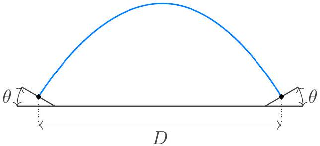
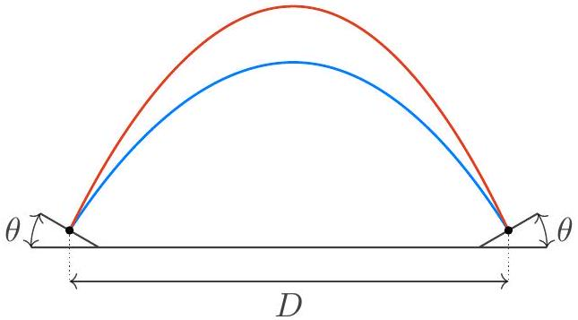
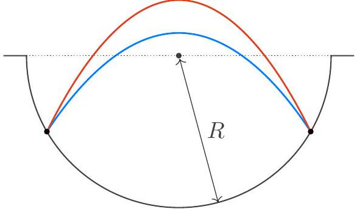

USA Physics Olympiad Exam
DO NOT DISTRIBUTE THIS PAGE
Important Instructions for the Exam Supervisor

- This examination has two parts. Each part has three questions and lasts for 90 minutes.
- For each student, print out one copy of the exam and one copy of the answer sheets. Print everything single-sided, and do not staple anything. Divide the exam into the instructions (pages 2-3), Part A questions (pages 4-14), and Part B questions (pages 15-24).
- Begin by giving students the instructions and all of the answer sheets. Let the students read the instructions and fill out their information on the answer sheets. They can keep the instructions for both parts of the exam. Also give students blank sheets of paper to use as scratch paper throughout the exam.
- Students may bring calculators, but they may not use symbolic math, programming, or graphing features of these calculators. Calculators may not be shared, and their memory must be cleared of data and programs. Cell phones or other electronics may not be used during the exam or while the exam papers are present. Students may not use books or other references.
- To start the exam, give students the Part A questions, and allow 90 minutes to complete Part A. Do not give students Part B during this time, even if they finish with time remaining. At the end of the 90 minutes, collect the Part A questions and answer sheets.
- Then give students a 5 to 10 minute break. Then give them the Part B questions, and allow 90 minutes to complete Part B. Do not let students go back to Part A.
- At the end of the exam, collect everything, including the questions, the instructions, the answer sheets, and the scratch paper. Students may not keep the exam questions. Everything can be returned to the students after April 19th, 2023.
- After the exam, sort each student's answer sheets by page number. Scan every answer sheet, including blank ones.

We acknowledge the following people for their contributions to this year's exam (in alphabetical order):
Tengiz Bibilashvili, Kellan Colburn, Samuel Gebretsadkan, Abi Krishnan, Natalie LeBaron, Kye Shi, Brian Skinner, and Kevin Zhou.

## USA Physics Olympiad Exam

## Instructions for the Student

- You should receive these instructions, the reference table on the next page, answer sheets, and blank paper for scratch work. Read this page carefully before the exam begins.
- You may use a calculator, but its memory must be cleared of data and programs, and you may not use symbolic math, programming, or graphing features. Calculators may not be shared. Cell phones or other electronics may not be used during the exam or while the exam papers are present. You may not use books or other outside references.
- When the exam begins, your proctor will give you the questions for Part A. You will have 90 minutes to complete three problems. Each question is worth 25 points, but they are not necessarily of the same difficulty. If you finish all of the questions, you may check your work, but you may not look at Part B during this time.
- After 90 minutes, your proctor will collect the questions and answer sheets for Part A. You may then take a short break.
- Then you will work on Part B. You have 90 minutes to complete three problems. Each question is worth 25 points. Do not look at Part A during this time. When the exam ends, you must return all papers to the proctor, including the exam questions.
- Do not discuss the questions of this exam, or their solutions, until after April 19th, 2023. Violations of this rule may result in disqualification.

Below are instructions for writing your solutions.

- All of your solutions must be written on the official answer sheets. Nothing outside these answer sheets will be graded. Before the exam begins, write your name, student AAPT number, and proctor AAPT number as directed on the answer sheets.
- There are several answer sheets per problem. If you run out of space for a problem, you may use the extra answer sheets, which are at the end of the answer sheet packet. To ensure this work is graded, you must indicate, at the bottom of your last answer sheet for that problem, that you are using these extra answer sheets.
- Only write within the frame of each answer sheet. To simplify grading, we recommend drawing a box around your final answer for each subpart. You should organize your work linearly and briefly explain your reasoning, which will help you earn partial credit. You may use either pencil or pen, but sure to write clearly so your work will be legible after scanning.

## Reference table of possibly useful information

$$
\begin{array} { l l }
g = 9.8 \mathrm {~N} / \mathrm { kg } & G = 6.67 \times 10 ^ { - 11 } \mathrm {~N} \cdot \mathrm {~m} ^ { 2 } / \mathrm { kg } ^ { 2 } \\
k = 1 / 4 \pi \epsilon _ { 0 } = 8.99 \times 10 ^ { 9 } \mathrm {~N} \cdot \mathrm {~m} ^ { 2 } / \mathrm { C } ^ { 2 } & k _ { \mathrm { m } } = \mu _ { 0 } / 4 \pi = 10 ^ { - 7 } \mathrm {~T} \cdot \mathrm {~m} / \mathrm { A } \\
c = 3.00 \times 10 ^ { 8 } \mathrm {~m} / \mathrm { s } & k _ { \mathrm { B } } = 1.38 \times 10 ^ { - 23 } \mathrm {~J} / \mathrm { K } \\
N _ { \mathrm { A } } = 6.02 \times 10 ^ { 23 } ( \mathrm {~mol} ) ^ { - 1 } & R = N _ { \mathrm { A } } k _ { \mathrm { B } } = 8.31 \mathrm {~J} / ( \mathrm { mol } \cdot \mathrm {~K} ) \\
\sigma = 5.67 \times 10 ^ { - 8 } \mathrm {~J} / \left( \mathrm { s } \cdot \mathrm {~m} ^ { 2 } \cdot \mathrm {~K} ^ { 4 } \right) & e = 1.602 \times 10 ^ { - 19 } \mathrm { C } \\
1 \mathrm { eV } = 1.602 \times 10 ^ { - 19 } \mathrm {~J} & h = 6.63 \times 10 ^ { - 34 } \mathrm {~J} \cdot \mathrm {~s} = 4.14 \times 10 ^ { - 15 } \mathrm { eV } \cdot \mathrm {~s} \\
m _ { e } = 9.109 \times 10 ^ { - 31 } \mathrm {~kg} = 0.511 \mathrm { MeV } / \mathrm { c } ^ { 2 } & ( 1 + x ) ^ { n } \approx 1 + n x \text { for } | x | \ll 1 \\
\sin \theta \approx \theta - \theta ^ { 3 } / 6 \text { for } | \theta | \ll 1 & \cos \theta \approx 1 - \theta ^ { 2 } / 2 \text { for } | \theta | \ll 1
\end{array}
$$

## Possibly useful integrals

$$
\begin{gathered}
\int \frac { d x } { \sqrt { 1 - x ^ { 2 } } } = \sin ^ { - 1 } ( x ) + C \quad \int \frac { d x } { 1 - x ^ { 2 } } = \tanh ^ { - 1 } ( x ) + C \quad \int \frac { d x } { \left( 1 - x ^ { 2 } \right) ^ { 3 / 2 } } = \frac { x } { \sqrt { 1 - x ^ { 2 } } } + C \\
\int \frac { d x } { \sqrt { 1 + x ^ { 2 } } } = \sinh ^ { - 1 } ( x ) + C \quad \int \frac { d x } { 1 + x ^ { 2 } } = \tan ^ { - 1 } ( x ) + C \quad \int \frac { d x } { \left( 1 + x ^ { 2 } \right) ^ { 3 / 2 } } = \frac { x } { \sqrt { 1 + x ^ { 2 } } } + C \\
\int \sqrt { \frac { 1 + x } { 1 - x } } d x = - \sqrt { 1 - x ^ { 2 } } - 2 \sin ^ { - 1 } \left( \sqrt { \frac { 1 - x } { 2 } } \right) + C \\
\int \frac { \sqrt { 1 + x } } { ( 1 - x ) ^ { 3 / 2 } } d x = 2 \sqrt { \frac { 1 + x } { 1 - x } } + 2 \sin ^ { - 1 } \left( \sqrt { \frac { 1 - x } { 2 } } \right) + C \\
\int \frac { d x } { ( 1 - x ) ^ { 3 / 2 } ( 1 + x ) ^ { 1 / 2 } } = \sqrt { \frac { 1 + x } { 1 - x } } + C \\
\int \frac { d x } { ( 1 - x ) ^ { 3 / 2 } ( 1 + x ) ^ { 3 / 2 } } = \frac { x } { \sqrt { 1 - x ^ { 2 } } } + C \\
\int \frac { d x } { ( 1 - x ) ^ { 5 / 2 } ( 1 + x ) ^ { 1 / 2 } } = \frac { ( 2 - x ) \sqrt { 1 + x } } { 3 ( 1 - x ) ^ { 3 / 2 } } + C \\
\int \frac { d x } { ( 1 - x ) ^ { 5 / 2 } ( 1 + x ) ^ { 3 / 2 } } = \frac { 1 + 2 x - 2 x ^ { 2 } } { 3 ( 1 - x ) ^ { 3 / 2 } ( 1 + x ) ^ { 1 / 2 } } + C
\end{gathered}
$$

You may use this sheet for both parts of the exam.

## End of Instructions for the Student

## DO NOT OPEN THIS TEST UNTIL YOU ARE TOLD TO BEGIN

## Copyright ©2023 American Association of Physics Teachers

## Part A

## Question A1

## Circus Act

In this problem we consider a small ball bouncing back and forth between two points. In all parts below, the acceleration of gravity is $g$, collisions are perfectly elastic, air resistance is negligible, and the impact points are at the same height. The diagrams are not drawn to scale.

a. Consider a ball bouncing between two inclined planes, which each make an angle $\theta < 90 ^ { \circ }$ to the horizontal. The ball has speed $v _ { 0 }$ at the impact points, which are separated by a distance $D$.
    i. The ball can bounce back and forth along the same path, as shown.

For what values of $\theta$ is this motion possible? For these values, what is $v _ { 0 }$ ?

## Solution

To go back and forth on the same path, the ball must impact the plane normally, which means that $\theta$ is the angle of its velocity to the vertical. The range of the ball is

$$
D = \frac { v _ { 0 } ^ { 2 } \sin \left( 2 \left( 90 ^ { \circ } - \theta \right) \right) } { g } = \frac { v _ { 0 } ^ { 2 } \sin 2 \theta } { g }
$$

which implies

$$
v _ { 0 } = \sqrt { \frac { g D } { \sin 2 \theta } } .
$$

Evidently, the motion is possible for any $\theta$.

ii. The ball can also take one trajectory while traveling to the right, and a separate trajectory when traveling back. Let $\phi \neq 0$ be the angle between the paths at the impact points.

For what values of $\theta$ and $\phi$ is this motion possible? For these values, what is $v _ { 0 }$ ?

## Solution

The two paths have the same initial speed and the same range, which means the initial angles of the velocity to the horizontal must be $\pi / 4 \pm \phi / 2$. Since the initial and final angles to the normal are equal in the collision, the angle of the planes to the horizontal must be $\theta = 45 ^ { \circ }$. Given this, $\phi$ can take any value in the range $0 < \phi < 90 ^ { \circ }$.
Considering the range yields

$$
D = \frac { v _ { 0 } ^ { 2 } \sin \left( 2 \left( 45 ^ { \circ } + \phi / 2 \right) \right) } { g } = \frac { v _ { 0 } ^ { 2 } \cos \phi } { g }
$$

from which we find

$$
v _ { 0 } = \sqrt { \frac { g D } { \cos \phi } } .
$$

As expected, this reduces to the answer above as $\phi \rightarrow 0$, and becomes infinite as $\phi \rightarrow 90 ^ { \circ }$.

b. Now suppose the ball bounces within a hemispherical well of radius of curvature $R$. As in part a.ii, it alternates between two distinct paths, with flight times $t _ { 1 }$ and $t _ { 2 } \neq t _ { 1 }$.

Find all of the possible values of $R$, in terms of $t _ { 1 }$ and $t _ { 2 }$.

## Solution

From the previous question we know that the slope of the wall $\theta = \frac { \pi } { 4 }$ at the collision points. So $D = R \sqrt { 2 }$.
$x$ displacement with $t _ { 1 }$ is

$$
\begin{equation*}
v _ { 0 } \cos \left( \frac { \pi } { 4 } - \phi / 2 \right) t _ { 1 } = R \sqrt { 2 } \tag{A1-1}
\end{equation*}
$$

$y$-component of velocity in the upper point is 0

$$
v _ { 0 } \sin \left( \frac { \pi } { 4 } + \phi / 2 \right) - g \frac { t _ { 2 } } { 2 } = 0
$$

transforms into

$$
\begin{equation*}
v _ { 0 } \cos \left( \frac { \pi } { 4 } - \phi / 2 \right) = g \frac { t _ { 2 } } { 2 } \tag{A1-2}
\end{equation*}
$$

Dividing (A1-1) by (A1-2) we get

$$
R = \frac { g t _ { 1 } t _ { 2 } } { 2 \sqrt { 2 } } .
$$

Only one $R$ satisfies this, so the answer is unique.

c. Finally, suppose the well has a sinusoidal shape, described by $y ( x ) = - L \sin ( 2 x / L )$. The ball takes two distinct paths with flight times $t _ { 1 }$ and $t _ { 2 } \neq t _ { 1 }$, and the horizontal distance between the impact points is less than $\pi L$. Find all of the possible values of $L$, in terms of $t _ { 1 }$ and $t _ { 2 }$.

## Solution

The slope of the wall $\theta = \frac { \pi } { 4 }$ at the collision points. So $z _ { x } ^ { \prime } = - 1$ for one end and there is a symmetric point on the other point of collision. $- 2 \cos \frac { 2 x } { L } = - 1$ has solutions $x = \pm \frac { \pi L } { 6 }$. So we got two possible values of $L$.

i. Case of $x = \frac { \pi L } { 6 }$ corresponds to $D = \frac { \pi L } { 2 } - \frac { \pi L } { 3 } = \frac { \pi L } { 6 }$
$$
v _ { 0 } \cos \left( \frac { \pi } { 4 } - \phi / 2 \right) t _ { 1 } = \frac { \pi L } { 6 }
$$
and
$$
v _ { 0 } \cos \left( \frac { \pi } { 4 } - \phi / 2 \right) = g \frac { t _ { 2 } } { 2 } .
$$
Combining these two we get
$$
L _ { a } = \frac { 3 g t _ { 1 } t _ { 2 } } { \pi }
$$
ii. Case of $x = - \frac { \pi L } { 6 }$ corresponds to $D = \frac { \pi L } { 2 } + \frac { \pi L } { 3 } = \frac { 5 \pi L } { 6 }$
$$
v _ { 0 } \cos \left( \frac { \pi } { 4 } - \phi / 2 \right) t _ { 1 } = \frac { 5 \pi L } { 6 }
$$
and
$$
v _ { 0 } \cos \left( \frac { \pi } { 4 } - \phi / 2 \right) = g \frac { t _ { 2 } } { 2 } .
$$
Combining these two we get
$$
L _ { b } = \frac { 3 g t _ { 1 } t _ { 2 } } { 5 \pi }
$$

## Question A2

## Time is a Flat Circle

A particle of mass $m$ and negative charge $- q$ is constrained to move in a horizontal plane. In the situations described below, this particle can either oscillate back and forth in a straight line or move in a circle. (These two modes of motion are interesting because they generate linearly and circularly polarized radiation, respectively, but in this problem you may ignore any energy lost to radiation.)

a. A large positive charge $Q \gg q$ is fixed in place a distance $R$ directly below the origin of the plane.
    i. When the particle is a distance $r \ll R$ from the origin, find an approximate expression for its potential energy due to the charge $Q$ to second order in $r / R$, up to an arbitrary constant. You may use this result for the rest of the problem.

## Solution

The potential energy of the particle, relative to infinity, is

$$
V ( r ) = - \frac { q Q } { 4 \pi \epsilon _ { 0 } \sqrt { R ^ { 2 } + r ^ { 2 } } } \approx - \frac { q Q } { 4 \pi \epsilon _ { 0 } R } + \frac { q Q r ^ { 2 } } { 8 \pi \epsilon _ { 0 } R ^ { 3 } }
$$

where we have used the binomial theorem on the square root, since $r \ll R$. The constant doesn't matter, so we could equivalently write this as

$$
V ( r ) \approx \frac { q Q r ^ { 2 } } { 8 \pi \epsilon _ { 0 } R ^ { 3 } } + \text { const. }
$$

ii. If the particle oscillates linearly with amplitude $a \ll R$, what is its angular frequency $\omega _ { \ell }$ ?

## Solution

For simple harmonic motion, the potential energy $V - V _ { 0 } = \frac { 1 } { 2 } k x ^ { 2 }$, where the "spring constant" $k$ is related to the angular frequency of oscillation by $\omega = \sqrt { k / m }$. Reading the value of $k$ from the expression above for $V ( r )$ gives $k = q Q / \left( 4 \pi \epsilon _ { 0 } R ^ { 3 } \right)$, and therefore

$$
\omega _ { \ell } = \sqrt { \frac { q Q } { 4 \pi \epsilon _ { 0 } m R ^ { 3 } } } .
$$

As usual for simple harmonic motion, the amplitude does not alter the frequency.
iii. If the particle performs circular motion with radius $r \ll R$, what is its angular frequency $\omega _ { c }$ ?

## Solution

For a radially symmetric, parabolic potential, a circular orbit can be thought of as simultaneous harmonic oscillation in the $x$ direction and the $y$ direction. Both oscillations have the same angular frequency $\omega _ { \ell }$ as derived in part 1. So the answer is the same:

$$
\omega _ { c } = \sqrt { \frac { q Q } { 4 \pi \epsilon _ { 0 } m R ^ { 3 } } } = \omega _ { \ell } .
$$

Note that the orbit radius does not matter, so long as it is small enough $( r \ll R )$ to still correspond to simple harmonic motion.
b. Now an additional negative charge $- q$ is fixed in place at the origin of the plane.
    i. What is the equilibrium distance $r _ { 0 }$ of the particle from the origin?

## Solution

With the additional charge at the origin, the total potential energy of the particle as a function of $r$ is

$$
V ( r ) = V _ { 0 } + \frac { q Q r ^ { 2 } } { 8 \pi \epsilon _ { 0 } R ^ { 3 } } + \frac { q ^ { 2 } } { 4 \pi \epsilon _ { 0 } r } .
$$

Notice that the potential energy as a function of position has a ring of minima with a certain radius $r _ { 0 }$. When the particle is not in motion, its rest position is somewhere along the ring. The value of $r _ { 0 }$ can be found from $V ^ { \prime } \left( r _ { 0 } \right) = 0$, which gives $r _ { 0 } = R ( q / Q ) ^ { 1 / 3 }$.

ii. If the particle oscillates linearly with amplitude $a \ll r _ { 0 }$, what is its angular frequency $\Omega _ { \ell }$ ? Is it higher or lower than $\omega _ { \ell }$ ?

## Solution

A linear oscillation involves the radius $r$ oscillating around the value $r _ { 0 }$. Taylor expanding the expression for $V ( r )$ in part b.i around $r = r _ { 0 }$ gives

$$
V \approx V \left( r _ { 0 } \right) + \frac { 1 } { 2 } \frac { 3 q Q } { 4 \pi \epsilon _ { 0 } R ^ { 3 } } \delta _ { r } ^ { 2 } ,
$$

where $\delta _ { r } = r - r _ { 0 }$. One can read from this expression the value of the spring constant $k$, which gives for the angular frequency $\omega = \sqrt { k / m }$ the result

$$
\Omega _ { \ell } = \sqrt { \frac { 3 q Q } { 4 \pi \epsilon _ { 0 } m R ^ { 3 } } } = \sqrt { 3 } \omega _ { \ell }
$$

so that $\Omega _ { \ell } > \omega _ { \ell }$. Evidently, adding the charge at the origin slightly stiffens the oscillation in the radial direction.

iii. Now suppose the particle performs circular motion with radius $r = r _ { 0 } + \delta r$, where $\delta r \ll r _ { 0 }$. What is its angular frequency $\Omega _ { c }$, in terms of $\omega _ { c } , r$, and $\delta r$ ? Is it higher or lower than $\omega _ { c }$ ?

## Solution

For circular motion with radius $r + \delta r$ and $\delta r \ll r _ { 0 }$, the orbit is above, but is very close to the bottom of the ring of minima, $r \approx r _ { 0 }$. For such small $\delta r$ the force linearly depends on $r - r _ { 0 }$, as in Hooke's law, with

$$
k = V ^ { \prime \prime } \left( r _ { 0 } \right) = \frac { 3 Q q } { 4 \pi \epsilon _ { 0 } R ^ { 3 } }
$$

Now Newton's second law gives

$$
- k \delta r = - m \Omega _ { c } ^ { 2 } r ,
$$

with $r \approx r _ { 0 }$. This equation has a solution for $\delta r > 0$ (so that the centripetal force is inward):

$$
\Omega _ { c } \approx \omega _ { c } \sqrt { \frac { 3 \delta r } { r _ { 0 } } }
$$

Notice that the orbit frequency now explicitly depends on the orbit radius through $\delta r$. So, unlike in the case of the usual harmonic oscillator, in this case one can generate circularly polarized light with a wide range of frequencies by exciting circular motion with different radii.
Since $\delta r \ll r _ { 0 }$, the angular frequency $\Omega _ { c } \ll \omega _ { c }$, so that adding the charge $- q$ at the origin has made the orbit much slower. Intuitively, this is because the set of potential minima is a "flat circle," so that the orbit frequency can get arbitrarily small for arbitrarily small angular momenta. This is connected to Goldstone's theorem in quantum field theory, which states that spontaneously broken symmetries give rise to low frequency modes.

## Question A3

## The Motive Power of Ice

In the Carnot cycle, a gas is heated at constant temperature $T _ { H }$ and cooled at constant temperature $T _ { C }$. Furthermore, no other heat transfer occurs, and all other steps of the cycle are reversible. The laws of thermodynamics state that any such cycle must have efficiency $\eta = W / Q _ { \text {in } } = 1 - \left( T _ { C } / T _ { H } \right)$. Below we will explore two other heat engines, which recover this efficiency in certain limits.

a. Consider the following heat engine involving one mole of ideal monatomic gas. The gas begins at temperature $T _ { 0 }$, pressure $P _ { 0 }$, and volume $V _ { 0 }$, and undergoes four reversible steps.

    1. The gas is expanded at constant pressure until its temperature rises to $( 1 + \beta ) T _ { 0 }$.
    2. The gas is expanded at constant temperature until its pressure falls to $P _ { 0 } / \alpha$.
    3. The gas is contracted at constant pressure until its temperature falls back to $T _ { 0 }$.
    4. The gas is contracted at constant temperature until its pressure rises back to $P _ { 0 }$.
i. Which steps require heat to be transferred to the gas? For each such step, give the total heat input in terms of $P _ { 0 } , V _ { 0 } , \alpha$, and $\beta$.

## Solution

Heat is added to the gas in the first two steps. In the first step, we have heating at constant pressure, which has molar heat capacity $c _ { p } = 5 R / 2$, so

$$
Q _ { 1 } = c _ { p } \Delta T = \frac { 5 } { 2 } R \beta T _ { 0 } = \frac { 5 } { 2 } \beta P _ { 0 } V _ { 0 }
$$

where we used the ideal gas law in the final step. In the second step, the heat added to the gas compensates for the work done while it expands, so

$$
Q _ { 2 } = ( 1 + \beta ) P _ { 0 } V _ { 0 } \ln \frac { V _ { f } } { V _ { i } } = ( 1 + \beta ) P _ { 0 } V _ { 0 } \ln \alpha .
$$

ii. Under what conditions on $\alpha$ and $\beta$ would we expect the efficiency of this heat engine to approach that of a Carnot cycle working between the same maximum and minimum temperatures?

## Solution

Since all the steps are reversible, we recover the Carnot efficiency when almost all the heat transfer happens at the same temperature, i.e. when $Q _ { 1 } \ll Q _ { 2 }$. This holds when

$$
\frac { \beta } { \beta + 1 } \ll \ln \alpha .
$$

We should also consider the other two steps, which have heat transfer

$$
\left| Q _ { 3 } \right| = c _ { p } | \Delta T | = \frac { 5 } { 2 } R \beta T _ { 0 } = \frac { 5 } { 2 } \beta P _ { 0 } V _ { 0 }
$$

and

$$
\left| Q _ { 4 } \right| = P _ { 0 } V _ { 0 } \ln \frac { V _ { f } } { V _ { i } } = P _ { 0 } V _ { 0 } \ln \alpha .
$$

We have $\left| Q _ { 3 } \right| \ll \left| Q _ { 4 } \right|$ when

$$
\beta \ll \ln \alpha
$$

which is stricter than the previous condition. Thus, we recover the Carnot efficiency when $\beta \ll \ln \alpha$.
iii. Find the efficiency of this heat engine for general $\alpha$ and $\beta$.

## Solution

We calculate the net work throughout all four steps,

$$
W = \beta P _ { 0 } V _ { 0 } + ( 1 + \beta ) P _ { 0 } V _ { 0 } \ln \alpha - \beta P _ { 0 } V _ { 0 } - P _ { 0 } V _ { 0 } \ln \alpha
$$

where the first and third terms are just the usual $P \Delta V$ work, and the second and fourth use the form done in an isothermal process. Simplifying gives

$$
W = P _ { 0 } V _ { 0 } \beta \ln \alpha .
$$

Therefore, the efficiency of the process is

$$
\eta = \frac { \beta \ln \alpha } { ( 1 + \beta ) \ln \alpha + 5 \beta / 2 } .
$$

One way to check the answer is to note that the Carnot efficiency would be $\beta / ( 1 + \beta )$. Our general result reduces to this efficiency when the second term in the denominator is negligible, which is precisely the condition we identified in part (b).

The second half of the problem is on the next page.

b. Now consider a heat engine built around the freezing and melting of water, which occurs at a pressure-dependent temperature $T _ { c } ( P )$. Initially, a volume of $V$ of water is squeezed underneath a piston, so that it experiences a total pressure $P _ { 1 }$, and the water is on the edge of freezing, with temperature $T _ { c } \left( P _ { 1 } \right)$. The engine then undergoes four reversible steps.

    1. A mass is slowly placed on the piston, raising the total pressure to $P _ { 2 }$.
    2. The water is cooled to temperature $T _ { c } \left( P _ { 2 } \right)$ and frozen.
    3. The mass is slowly removed from the piston, lowering the pressure back to $P _ { 1 }$.
    4. The ice is heated back to temperature $T _ { c } \left( P _ { 1 } \right)$ and melted.

Assume that water and ice are incompressible, with fixed densities $\rho _ { w }$ and $\rho _ { i }$.

i. What is the net work done by this engine, in terms of $P _ { 1 } , P _ { 2 } , V$, and the densities?

## Solution

The system expands at a pressure $P _ { 2 }$ and contracts at a pressure $P _ { 1 }$, so the net work done is

$$
W = \left( P _ { 2 } - P _ { 1 } \right) \Delta V = \left( P _ { 2 } - P _ { 1 } \right) V \frac { \rho _ { w } - \rho _ { i } } { \rho _ { i } } .
$$

Concretely, this work used to raise the mass, so it could also be calculated as $M g \Delta H$.

ii. Assume the latent heat per unit mass $L$ to melt ice is large, so that freezing and melting account for essentially all of the heat transfer in the cycle. What is the efficiency of the engine, in terms of $P _ { 1 } , P _ { 2 } , L$, and the densities?

## Solution

The heat transferred in is used to melt the ice, $Q _ { \text {in } } = \rho _ { w } V L$, so

$$
\eta = \frac { W } { Q _ { \mathrm { in } } } = \frac { P _ { 2 } - P _ { 1 } } { L } \frac { \rho _ { w } - \rho _ { i } } { \rho _ { w } \rho _ { i } } .
$$

Note that the efficiency can also be expressed as $\eta = 1 - \frac { Q _ { \text {out } } } { Q _ { \text {in } } }$, but in order to find $Q _ { \text {out } }$ directly, we would need to know how to latent heat varies with pressure, which isn't given in the problem.

iii. Since we assumed all heat transfer occurs during melting or freezing, this cycle has the same efficiency as a Carnot cycle. In the limit where $P _ { 1 }$ and $P _ { 2 }$ are very close, use this fact to infer an expression for $d T _ { c } / d P$ in terms of $T _ { c } , L$, and the densities.

## Solution

The Carnot efficiency, for the same high and low temperatures, is

$$
\eta = \frac { T _ { c } \left( P _ { 1 } \right) - T _ { c } \left( P _ { 2 } \right) } { T _ { c } \left( P _ { 1 } \right) } .
$$

Combining this with the result of part (b) gives

$$
\frac { T _ { c } \left( P _ { 2 } \right) - T _ { c } \left( P _ { 1 } \right) } { P _ { 2 } - P _ { 1 } } = - \frac { T _ { c } \left( P _ { 1 } \right) } { L } \frac { \rho _ { w } - \rho _ { i } } { \rho _ { w } \rho _ { i } }
$$

and taking the limit of $P _ { 1 } \approx P _ { 2 }$, the left-hand side becomes a derivative, so

$$
\frac { d T _ { c } } { d P } = - \frac { T _ { c } } { L } \frac { \rho _ { w } - \rho _ { i } } { \rho _ { w } \rho _ { i } } .
$$

This is equivalent to the well-known Clausius-Clapeyron equation, and this heat engine was first devised by the brothers Thomson and Kelvin.

## STOP: Do Not Continue to Part B

If there is still time remaining for Part A, you can review your work for Part A, but do not continue to Part B until instructed by your exam supervisor.

Once you start Part B, you will not be able to return to Part A.

## Part B

## Question B1

## Electric Roulette

Consider a cylindrical solenoid with radius $r$, length $\ell \gg r$, and $n$ turns per unit length. It is made of one continuous wire, with the top connecting back to the bottom as shown at left.

In the middle of the solenoid, part of the wire is replaced with the assembly shown at right. A uniform conducting rod of mass $m$ and radius $r$ is connected to the bottom half of the solenoid, and is free to rotate about the solenoid's axis of symmetry. The end of the rod slides on a fixed conducting ring, which is attached to the top half of the solenoid. This assembly and the solenoid form one continuous conductor, carrying total current $I$.

a. What is the inductance of this system? Assume $n r \gg 1$, so that the magnetic field produced by the current in the rod and ring is negligible.

## Solution

The magnetic field produced is $B = \mu _ { 0 } n I$, so the flux through one turn of the solenoid is $\mu _ { 0 } n I \left( \pi r ^ { 2 } \right)$. There are $n \ell$ turns in total, so the inductance is

$$
L = \frac { \Phi } { I } = \mu _ { 0 } n ^ { 2 } \pi r ^ { 2 } \ell .
$$

b. When the rod is within a uniform vertical magnetic field $B$, find the torque it experiences in terms of $I , B$, and $r$.

## Solution

The torque is due to the Lorentz force on the current as it travels radially outward, from the center of the disc towards its edge. Note that only the radial motion of the current contributes to the torque, so we would get the same torque if the current traveled in a

straight line from the center to the rim. In this case, the total torque is
$$
\tau = - \int _ { 0 } ^ { r } I B s d s = - \frac { I B r ^ { 2 } } { 2 }
$$
where the minus sign indicates that the torque tends to slow down the rotation, when $I$ is defined in the direction shown in the figure. (This is consistent with defining positive angular velocity and torque by the right-hand rule; if you defined it the other way around, this equation and several others below would pick up a sign flip. Since we didn't specify the sign convention in the problem text, either set of signs received full credit.)
c. If the rod rotates with angular velocity $\omega$, the electrons inside have a tangential velocity. Find the electromotive force across the rod in terms of $\omega , B$, and $r$.

## Solution

At a radius $s$, the tangential speed is $\omega s$, leading to a radially outward Lorentz force per charge of $\omega s B$. (The electrons also have radial motion, but this does not contribute to the electromotive force; it instead contributes to the torque found in the previous subpart.) The emf is therefore

$$
\mathcal { E } = \int _ { 0 } ^ { r } v B d s = \int _ { 0 } ^ { r } \omega s B d s = \frac { \omega B r ^ { 2 } } { 2 }
$$

Now we will consider the dynamics of this system in some simple situations. For all the parts below, neglect energy losses due to friction, resistance, and radiation.

d. First, suppose the system initially carries no current, and the entire system is inside a uniform external magnetic field $B _ { 0 }$ parallel to the axis of the solenoid. If the rod is given a small initial angular velocity, its angular velocity will oscillate in time. Find the period of these oscillations.

## Solution

Using our results from above, the angular acceleration of the disc is is

$$
\frac { d \omega } { d t } = \frac { \tau } { m r ^ { 2 } / 3 } = - \frac { 3 I B _ { 0 } } { 2 m } .
$$

Kirchoff's loop rule is $\mathcal { E } - L d I / d t = 0$, which implies that

$$
\frac { d I } { d t } = \frac { B _ { 0 } } { 2 \pi \mu _ { 0 } n ^ { 2 } \ell } \omega .
$$

Taking the time derivative of our expression for $d \omega / d t$ gives

$$
\frac { d ^ { 2 } \omega } { d t ^ { 2 } } = - \frac { 3 } { 4 \pi } \frac { B _ { 0 } ^ { 2 } } { \mu _ { 0 } n ^ { 2 } \ell m } \omega
$$

which is a simple harmonic motion equation. The period is therefore
$$
T = 2 \pi \sqrt { \frac { 4 \pi \mu _ { 0 } n ^ { 2 } \ell m } { 3 B _ { 0 } ^ { 2 } } } .
$$
e. Next, suppose there is no external magnetic field, $B _ { 0 } = 0$, and at time $t = 0$, the system carries current $I _ { 0 }$ and the rod has zero angular velocity.
    i. The rod's angular velocity $\omega ( t )$ approaches a value $\omega _ { 0 }$ after a long time. What is $\omega _ { 0 }$ ?

## Solution

The basic equations are similar, except now the magnetic field is sourced by the solenoid itself, so instead of $B = B _ { 0 }$ we now have $B = \mu _ { 0 } n I$. The results are

$$
\frac { d \omega } { d t } = - \frac { 3 \mu _ { 0 } n } { 2 m } I ^ { 2 } , \quad \frac { d I } { d t } = \frac { \omega I } { 2 \pi n \ell } .
$$

Initially $I$ is positive, so $d \omega / d t$ is negative, which then causes $d I / d t$ to be negative. This remains true until $I$ falls to zero, at which point $d I / d t$ and $d \omega / d t$ both remain zero. In other words, the solenoid speeds up the rod until it has given all of its energy to it.
Now that we know this, we can find the answer just using energy conservation,

$$
\frac { 1 } { 2 } \frac { m r ^ { 2 } } { 3 } \omega ^ { 2 } + \frac { 1 } { 2 } L I ^ { 2 } = \frac { 1 } { 2 } L I _ { 0 } ^ { 2 }
$$

This equation is equivalent to

$$
\frac { I ^ { 2 } } { I _ { 0 } ^ { 2 } } + \frac { \omega ^ { 2 } } { \omega _ { 0 } ^ { 2 } } = 1
$$

where

$$
\omega _ { 0 } = - \sqrt { \frac { 3 \pi \mu _ { 0 } \ell } { m } } n I _ { 0 } .
$$

This is the angular velocity attained after a long time, when $I$ approaches zero. Again, the opposite sign would also receive full credit.

ii. Find $\omega ( t ) / \omega _ { 0 }$ in terms of $\omega _ { 0 } , t , n$, and $\ell$. You may use the integrals on the reference sheet.

## Solution

Plugging the energy conservation equation into our equation for $d \omega / d t$, and writing it in terms of $\omega _ { 0 }$, we have

$$
\frac { d \omega } { d t } = - \frac { \omega _ { 0 } ^ { 2 } - \omega ^ { 2 } } { 2 \pi n \ell } .
$$

Separating and integrating yields

$$
\frac { t } { 2 \pi n \ell } = - \int _ { 0 } ^ { \omega } \frac { d \omega ^ { \prime } } { \omega _ { 0 } ^ { 2 } - \omega ^ { \prime 2 } } = - \frac { 1 } { \omega _ { 0 } } \tanh ^ { - 1 } \left( \frac { \omega } { \omega _ { 0 } } \right) .
$$

Solving for $\omega$ gives

$$
\frac { \omega ( t ) } { \omega _ { 0 } } = \tanh \left( \frac { - \omega _ { 0 } t } { 2 \pi n \ell } \right)
$$

which has the right limiting behavior.

Question B2
Fast and Furious
A space program wants to accelerate a spaceship of final mass $m = 100 \mathrm {~kg}$ to relativistic speeds to observe distant stars. They have two proposals to evaluate.

a. Their first proposal is to use traditional rocket propulsion. A rocket of initial mass $m _ { 0 }$ and final mass $m$ that expels propellant with exhaust speed $u$ relative to the rocket will reach a speed
$$
v = u \ln \left( \frac { m _ { 0 } } { m } \right) .
$$
Suppose the desired final speed is $v _ { f } = 3 c / 5$. In the subparts below, neglect relativistic effects and give your answers in the form $10 ^ { n }$, where $n$ has at least two significant figures.
    i. If the rocket has exhaust speed $u = 3.5 \mathrm {~km} / \mathrm { s }$, what must its starting mass be in kilograms?
Solution
Plugging in the numbers gives
$$
m _ { 0 } = m e ^ { v _ { f } / u } = 100 \mathrm {~kg} \cdot e ^ { 0.6 \times 3 \times 10 ^ { 8 } / 3.5 \times 10 ^ { 3 } } \approx 10 ^ { 22337 } \mathrm {~kg}
$$
Equivalently, the exponent is $n = 2.2 \times 10 ^ { 4 }$.
    ii. If the propellant is exhausted at rate 7.0 kg/s, how long does the acceleration take, in centuries?
Solution
The result is
$$
t = \frac { m _ { 0 } - m } { 7.0 \mathrm {~kg} / \mathrm { s } } \approx 10 ^ { 22336 } \mathrm {~s} \approx 10 ^ { 22326 } \text { centuries. }
$$
Equivalently, the exponent is $n = 2.2 \times 10 ^ { 4 }$.
    iii. If the energy density of the fuel is $2.0 \times 10 ^ { 7 } \mathrm {~J} / \mathrm { kg }$, how much total energy is required, in Joules?
Solution
The energy required is
$$
E = \left( m _ { 0 } - m \right) \left( 2.0 \times 10 ^ { 7 } \mathrm {~J} \right) = 10 ^ { 22344 } \mathrm {~J} .
$$
Equivalently, the exponent is $n = 2.2 \times 10 ^ { 4 }$. When working with such absurdly large numbers, exponents essentially always stay unchanged.

For the rest of this problem, you should account for special relativity.

b. Another option is to use a spaceship with constant mass $m$, propelled by light produced by lasers on Earth, with total power $P = 6 \times 10 ^ { 12 } \mathrm {~W}$. The light evenly impacts a sail on the spaceship, and reflects off the sail directly back towards the Earth. Neglect the orbital motion of the Earth, and give all your answers in the frame of the Earth.
    i. What is the force on the spaceship when the spaceship has speed $v$ ?
Copyright ©2023 American Association of Physics Teachers

## Solution

Let $\beta = v / c$, where $v$ is the ship's speed, and consider a piece of the beam with total momentum $d p _ { x }$, in the Earth's frame. In the ship's frame, this momentum is $d p _ { x } ^ { \prime } =$ $\gamma ( 1 - \beta ) d p _ { x }$, and after the collision the momentum simply flips sign, $d p _ { x f } ^ { \prime } = - d p _ { x } ^ { \prime }$. Thus, transforming back to the Earth's frame, the final momentum is $d p _ { x f } = - \gamma ^ { 2 } ( 1 - \beta ) ^ { 2 } d p _ { x }$. The change of the spaceship's momentum, still in the Earth's frame, is the difference

$$
d P _ { x } = - \left( d p _ { x f } - d p _ { x } \right) = \frac { 2 } { 1 + \beta } d p _ { x }
$$

To find the force on the spaceship, we need to find the rate at which the beam impacts the spaceship. Accounting for the spaceship's motion, it is $d p _ { x } = \frac { P } { c } ( 1 - \beta ) d t$, so

$$
F = \frac { d P _ { x } } { d t } = \frac { 2 P } { c } \frac { 1 - \beta } { 1 + \beta } .
$$

Alternative solution: In the Earth's frame, if the photons in the incident beam have frequency $f _ { i }$, then they are reflected with frequency

$$
f _ { f } = \sqrt { \frac { 1 - \beta } { 1 + \beta } } \sqrt { \frac { 1 - \beta } { 1 + \beta } } f _ { i } = \frac { 1 - \beta } { 1 + \beta } f _ { i }
$$

where we applied the relativistic Doppler shift formula twice, since the photons are first absorbed by the moving rocket and then reemitted by it. Applying conservation of momentum, and using the fact that the momentum of a photon is related to its energy by $E = h f = p c$, we have

$$
F = \frac { d N } { d t } \frac { h } { c } \left( f _ { i } + f _ { f } \right) = \frac { d N } { d t } \frac { h f _ { i } } { c } \frac { 2 } { 1 + \beta }
$$

where $d N / d t$ is the rate at which photons collide with the sail. It is related to the rate at which photons are emitted from the source on Earth, $d N _ { \mathrm { em } } / d t$, by

$$
\frac { d N } { d t } = ( 1 - \beta ) \frac { d N _ { \mathrm { em } } } { d t } .
$$

Finally, since the power of the laser is $P = \left( d N _ { \mathrm { em } } / d t \right) \left( h f _ { i } \right)$, we have

$$
F = \frac { 2 P } { c } \frac { 1 - \beta } { 1 + \beta } .
$$

ii. How long will it take to accelerate the spaceship to speed $v _ { f } = 3 c / 5$, in seconds? You may use the integrals on the reference sheet.

## Solution

In the Earth's frame, the relativistic momentum of the spaceship obeys

$$
d P _ { x } = m c d \left( \frac { \beta } { \sqrt { 1 - \beta ^ { 2 } } } \right) = m c \frac { d \beta } { \left( 1 - \beta ^ { 2 } \right) ^ { 1.5 } }
$$

Combining this with our expression for the force gives

$$
\frac { 2 P } { m c ^ { 2 } } d t = \frac { d \beta } { ( 1 - \beta ) ^ { 2 } \sqrt { 1 - \beta ^ { 2 } } }
$$

Integrating both sides and using an integral on the reference sheet gives

$$
\frac { 2 P } { m c ^ { 2 } } t = \int _ { 0 } ^ { 0.6 } \frac { d \beta } { ( 1 - \beta ) ^ { 2 } \sqrt { 1 - \beta ^ { 2 } } } = \frac { 5 } { 3 }
$$

Therefore, the time is

$$
t = \frac { 5 m c ^ { 2 } } { 6 P } = \frac { 4.5 \times 10 ^ { 19 } } { 3.6 \times 10 ^ { 13 } } = 1.3 \times 10 ^ { 6 } \mathrm {~s}
$$

iii. At the moment the spaceship reaches this speed, how much total energy has been used to power the lasers, in Joules?

## Solution

The energy is just $5 m c ^ { 2 } / 6$ from the result in the previous problem, so we get $7.5 \times 10 ^ { 18 } \mathrm {~J}$. For reference, the US consumes roughly $10 ^ { 16 } \mathrm {~J}$ of electricity per day. For more discussion of this propulsion method, see this paper.

The following results from relativity may be helpful:

- The Lorentz factor is defined as $\gamma = 1 / \sqrt { 1 - v ^ { 2 } / c ^ { 2 } }$.
- An object of mass $m$ and velocity $\mathbf { v }$ has momentum $\mathbf { p } = \gamma m \mathbf { v }$ and energy $E = \gamma m c ^ { 2 }$. The force is defined by $\mathbf { F } = d \mathbf { p } / d t$.
- The momentum and energy of light are related by $E = p c$.
- In a frame $S ^ { \prime }$ with velocity $v \hat { \mathbf { x } }$ relative to a frame $S$, the energy and momentum are
$$
E ^ { \prime } = \gamma \left( E - v p _ { x } \right) , \quad p _ { x } ^ { \prime } = \gamma \left( p _ { x } - v E / c ^ { 2 } \right) .
$$

## Question B3

## Starry Messengers

In 1987, light from supernova SN1987A was detected by telescopes on Earth. The supernova occurred in the Large Magellanic Cloud, a distance $d = 1.5 \times 10 ^ { 21 } \mathrm {~m}$ away, making it the closest in centuries. Observations of this event tell us a remarkable amount about elementary particles.

a. Both light and neutrinos were produced in the core of the supernova. Neutrinos are elementary particles which interact extremely weakly with ordinary matter. Detectors on Earth saw a few dozen of these neutrinos, in a burst which occurred about $T = 3$ hours before the light arrived.
    i. One explanation of these observations is that the neutrinos' speed $v$ was faster than the speed of light $c$, violating special relativity. If this is the case, find $v - c$ in m/s.

## Solution

If the light took a time $t$ to arrive at the Earth, then $c t = v ( t - T ) = d$. Approximately solving for $v - c$, using the fact that $v$ is very close to $c$, gives

$$
v - c = \frac { c ^ { 2 } T } { d } = 0.65 \mathrm {~m} / \mathrm { s } .
$$

ii. Another explanation is that the light was slowed down by the gas in the solar system, while the neutrinos always moved at speed $c$. Suppose the solar system has a uniform index of refraction $n$ within a radius $D = 10 ^ { 13 } \mathrm {~m}$. What would $n$ have to be to explain the time delay?

## Solution

The time delay is $T = ( n - 1 ) D / c$, and plugging in the numbers gives $n = 1.3$. Given how thin the gas in the solar system is, such a large value is implausible.

Neither of these explanations seem plausible; the modern accepted explanation is that the light was trapped for some time inside the supernova, while the neutrinos were able to leave immediately. Therefore, for the rest of this problem you should assume special relativity holds. The results listed on the previous page may be helpful.

The neutrinos did not all arrive at once. The first arrived with an energy of about $E _ { 1 } = 40 \mathrm { MeV }$, and the last arrived about $t = 10 \mathrm {~s}$ later with an energy of about $E _ { 2 } = 20 \mathrm { MeV }$.

b. One explanation of these observations is that neutrinos have a small mass $m$, so that when they have energy $E \gg m c ^ { 2 }$, their speed $v$ is slightly slower than the speed of light.
i. Find an approximate expression for $c - v$, to leading nontrivial order in $m c ^ { 2 } / E$.

## Solution

We start with the equation for relativistic energy:

$$
E = \gamma m c ^ { 2 }
$$

where $\gamma$ is the Lorentz factor defined as: $\gamma \equiv \frac { 1 } { \sqrt { 1 - \beta ^ { 2 } } }$ where $\beta \equiv \frac { v } { c }$.

Let $\beta = 1 - \delta$, where $\delta \ll 1$. Then,

$$
\gamma \approx \frac { 1 } { \sqrt { 1 - 1 + 2 \delta } } \Longrightarrow \delta \approx \frac { 1 } { 2 \gamma ^ { 2 } } .
$$

Note that $\delta = 1 - v / c$, so

$$
c - v = c \delta \approx \frac { c } { 2 \gamma ^ { 2 } } = \frac { m ^ { 2 } c ^ { 5 } } { 2 E ^ { 2 } }
$$

ii. Using the information above, numerically estimate the neutrino mass $m$, in units of $\mathrm { eV } / c ^ { 2 }$.

## Solution

We compute a relationship between $v _ { 1 }$ and $v _ { 2 }$, the velocities of the first and second set of neutrinos, using the time delay. From the same equation as 1(a),

$$
v _ { 1 } - v _ { 2 } = \frac { 10 \mathrm {~s} \times c ^ { 2 } } { d } = 6 \times 10 ^ { - 4 } \mathrm {~m} / \mathrm { s } .
$$

We have

$$
c - v _ { 1 } \approx \frac { m ^ { 2 } c ^ { 5 } } { 2 E _ { 1 } ^ { 2 } } , \quad c - v _ { 2 } \approx \frac { 2 m ^ { 2 } c ^ { 5 } } { E _ { 1 } ^ { 2 } } .
$$

Then,

$$
v _ { 1 } - v _ { 2 } = \frac { 3 m ^ { 2 } c ^ { 5 } } { 2 E _ { 1 } ^ { 2 } }
$$

Solving for $m$ gives

$$
m = \sqrt { \frac { 2 \left( v _ { 1 } - v _ { 2 } \right) } { 3 c } } \frac { E _ { 1 } } { c ^ { 2 } } = 46 \mathrm { eV } / \mathrm { c } ^ { 2 } .
$$

c. Another explanation is that the neutrinos did not travel in straight lines, but rather were deflected by the intergalactic magnetic field. Suppose this field is uniform, $B = 10 ^ { - 13 } \mathrm {~T}$, and directed perpendicular to the line joining Earth and the supernova, and that neutrinos have charge $q = \epsilon e$.
i. If a neutrino has momentum $p$, then in the presence of the magnetic field, it travels in a circle of radius $r = p / ( q B ) \gg d$, and its path to the Earth has a total length $\ell$. Find an approximate expression for $\ell - d$, to leading nontrivial order in $d / r$.

## Solution

We are computing the difference between the arc length of a small arc and the distance connecting the endpoints. If the arc length is $\ell$, the angle subtended is $\theta = \ell / r$. The distance connecting the end points is

$$
d = 2 r \sin ( \theta / 2 ) = 2 r \sin \left( \frac { \ell } { 2 r } \right) .
$$

Then, Taylor expanding the sine gives

$$
\ell - d \approx \ell - \ell + \frac { \ell ^ { 3 } } { 24 r ^ { 2 } } = \frac { \ell ^ { 3 } } { 24 r ^ { 2 } } \approx \frac { d ^ { 3 } } { 24 r ^ { 2 } }
$$

ii. Using the information above, and assuming the neutrino mass is very small so that the effect in part b is negligible, numerically estimate $\epsilon$.

## Solution

The radius of the path is

$$
r \approx \frac { E } { q B c } .
$$

Substituting gives

$$
\ell _ { 2 } - \ell _ { 1 } = \frac { d ^ { 3 } q ^ { 2 } B ^ { 2 } c ^ { 2 } } { 8 E _ { 1 } ^ { 2 } }
$$

Then,

$$
q = \frac { 2 \sqrt { 2 } E _ { 1 } } { B c d } \left( \frac { \left( \ell _ { 2 } - \ell _ { 1 } \right) } { d } \right) ^ { 1 / 2 } = \frac { 2 \sqrt { 2 } E _ { 1 } } { B c d } \left( \frac { c \Delta t } { d } \right) ^ { 1 / 2 } \approx 3.6 \times 10 ^ { - 15 } e .
$$

Then,

$$
\epsilon \approx 3.6 \times 10 ^ { - 15 } .
$$

Since the effects of a neutrino mass and charge add, and we know neutrinos have mass, this result yields a (very strong) upper bound on the possible charge of a neutrino, which as far as we know could be exactly zero. For more about the physics of SN1987A, see this paper.
