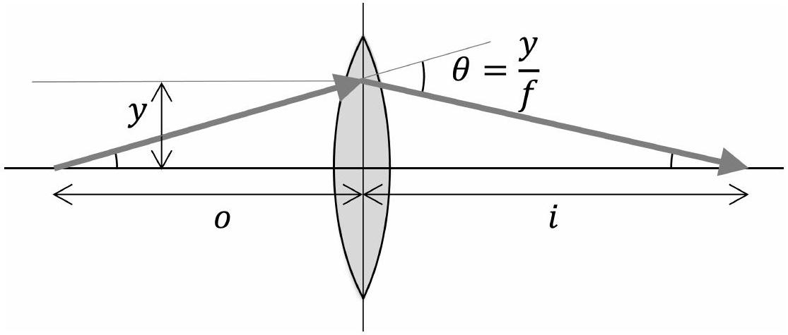

## Question A3

## Tilt Shift

An ideal converging lens of focal length $f$ is centered at $x = y = 0$ with its axis of symmetry aligned with the $x$-axis. A light ray incident at height $y \ll f$ will be tilted inward by an angle $\theta = y / f$. In this problem, we will consider objects at $x = - o$, where $o > f$. The lens will produce a real image of the object at $x = i$, where $1 / o + 1 / i = 1 / f$.

Even for an ideal lens, the image of a finite-sized object will generally be distorted.

a. Consider a pointlike object at $x = - o$ and $y = 0$. If it moves to the right a small distance $\delta _ { x }$, its image moves to the right a distance $m _ { x } \delta _ { x }$. If it moves up a small distance $\delta _ { y }$, its image moves up a distance $m _ { y } \delta _ { y }$. Find $m _ { x }$ and $m _ { y }$ in terms of $i$ and $o$.

## Solution

To compute $m _ { y }$, it suffices to draw a ray going from $\left( - o , \delta _ { y } \right)$ through the center of the lens until it hits the image plane at $x = i$. From similar triangles, we immediately conclude $m _ { y } = - i / o$. To find $m _ { x }$, we take the differential of the lens equation, giving

$$
\frac { d o } { o ^ { 2 } } + \frac { d i } { i ^ { 2 } } = 0 .
$$

The quantity $m _ { x }$ is just $- d i / d o$, so we read off $m _ { x } = i ^ { 2 } / o ^ { 2 }$.

b. Suppose the object is a short stick, tilted an angle $\theta _ { o }$ to the $x$-axis. In terms of $i , o$, and $\theta _ { o }$, what is the angle $\theta _ { i }$ its image makes with the $x$-axis?

## Solution

This follows immediately from the previous part. We have

$$
\tan \theta _ { o } = \frac { \delta _ { y } } { \delta _ { x } } , \quad \tan \theta _ { i } = \frac { m _ { y } \delta _ { y } } { m _ { x } \delta _ { x } }
$$

from which we conclude

$$
\theta _ { i } = \tan ^ { - 1 } \left( - \frac { o } { i } \theta _ { o } \right) .
$$

This is equivalent to the statement that if you extend the stick and its image, then they

will meet at the lens plane $x = 0$, which is called the Scheimpflug principle. It is used in "tilt shift" photography to produce focused images of objects tilted relative to the camera's plane, by tilting the camera's screen.

To produce a simple camera, we put the lens right next to a circular aperture of diameter $D \ll f$, and place a movable screen behind the lens. Suppose the location of the screen is chosen so that light from very distant objects will be focused to a point on the screen.

c. The light from a pointlike object at finite distance $o$ will produce a finite-sized spot of radius $r$ on the screen. Find $r$ in terms of $f , D$, and $o$, assuming $o \gg f$.

## Solution

Such an object produces an image at

$$
i = \frac { o f } { o - f } \approx f + f ^ { 2 } / o
$$

Since we are assuming the camera is focused on infinitely distant objects, the screen is a distance $f$ from the lens, so the image of this object is $f ^ { 2 } / o$ behind the lens. By drawing similar triangles, we conclude $r = D f / ( 2 o )$.
Alternatively, by drawing similar triangles (or by doing a bit more algebra), you can show that this is the exact answer: $r = D / 2 \cdot ( i - f ) / i = D f / ( 2 o )$, without approximating $o \gg f$.

d. If the camera primarily sees light of wavelength $\lambda \ll f , D$, find a rough estimate for the additional spread $r _ { d }$ of any image on the screen due to diffraction, in terms of $f , D$, and $o$.

## Solution

In general, diffraction will spread out light in an angle $\theta \sim \lambda / D$. Thus, it will arrive at the screen spread out by $r _ { d } \sim f \lambda / D$. Any answer within an order of magnitude is acceptable.

e. Assuming the typical numbers $f = 5.0 \mathrm {~cm} , D = 5.0 \mathrm {~mm}$, and $\lambda = 500 \mathrm {~nm}$, find the numeric values of $o$ for which the blurring due to geometric effects exceeds the blurring due to diffraction.

## Solution

Setting our previous two expressions equal gives $o \sim D ^ { 2 } / ( 2 \lambda ) = 25 \mathrm {~m}$. So for objects at distance $o < 25 \mathrm {~m}$, the geometric blurring dominates. Any answer within an order of magnitude is acceptable.

Real photos are noisy because light is made of discrete photons, with energy $E = h c / \lambda$. Suppose the camera is illuminated uniformly with light of intensity $I = 1 \mathrm {~W} / \mathrm { m } ^ { 2 }$, its sensor has $N = 10 ^ { 7 }$ pixels, and every photon passing through the aperture is detected, with equal probability, by one pixel in the sensor. This implies that if the expected number of photons arriving at a pixel on the sensor is $n$, the standard deviation of that number is $\sqrt { n }$.

f. If the aperture opens for time $\tau$ to take a photo, find the numeric value of $\tau$ for which the standard deviation of the brightness of each pixel is 1\% of the mean.

## Solution

On average, the number of photons hitting each pixel is

$$
N _ { \gamma } = \frac { I \tau \left( \pi D ^ { 2 } / 4 \right) } { N E } .
$$

For the standard deviation to be 1\% of the mean, we need $N _ { \gamma }$ to be at least $10 ^ { 4 }$. Plugging in the numbers yields $\tau = 2 \mathrm {~ms}$, which is a typical camera shutter speed in good lighting.

## STOP: Do Not Continue to Part B

If there is still time remaining for Part A, you can review your work for Part A, but do not continue to Part B until instructed by your exam supervisor.

Once you start Part B, you will not be able to return to Part A.

## Part B
