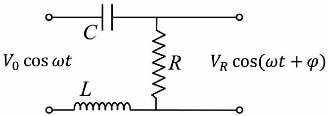

USA Physics Olympiad Exam
DO NOT DISTRIBUTE THIS PAGE
Important Instructions for the Exam Supervisor

- This examination has two parts. Each part has three questions and lasts for 90 minutes.
- For each student, print out one copy of the exam and one copy of the answer sheets. Print everything single-sided, and do not staple anything. Divide the exam into the instructions (pages 2-3), Part A questions (pages 4-12), and Part B questions (pages 13-22). Page 11 is a graph page, in case students wish to use it as an additional page for problem B3.
- Begin by giving students the instructions and all of the answer sheets. Let the students read the instructions and fill out their information on the answer sheets. They can keep the instructions for both parts of the exam. Also give students blank sheets of paper to use as scratch paper throughout the exam.
- Students may bring calculators, but they may not use symbolic math, programming, or graphing features of these calculators. Calculators may not be shared, and their memory must be cleared of data and programs. Cell phones or other electronics may not be used during the exam or while the exam papers are present. Students may not use books or other references.
- To start the exam, collect signed Honesty Policy, give students the Part A questions, and allow 90 minutes to complete Part A. Do not give students Part B during this time, even if they finish with time remaining. At the end of the 90 minutes, collect the Part A questions and answer sheets.
- Then give students a 5 to 10 minute break. Then give them the Part B questions, and allow 90 minutes to complete Part B. Do not let students go back to Part A.
- At the end of the exam, collect everything, including the questions, the instructions, the answer sheets, and the scratch paper. Give them the Honor Code Certification and collect signed Codes. Students may not keep the exam questions.
- After the exam, sort each student's answer sheets by page number. Scan every answer sheet, including blank ones. Everybody may discuss the questions after April 3rd. Until April 19th, hold on to all of the answer sheets in the event that your scans are lost or illegible.

We acknowledge the following people for their contributions to this year's exam (in alphabetical order):
Tengiz Bibilashvili, Kellan Colburn, Natalie LeBaron, Rishab Parthasarathy, Elena Yudovina, and Kevin Zhou.

## USA Physics Olympiad Exam

## Instructions for the Student

- You should receive these instructions, the reference table on the next page, answer sheets, and blank paper for scratch work. Read this page carefully before the exam begins.
- You may use a calculator, but its memory must be cleared of data and programs, and you may not use symbolic math, programming, or graphing features. Calculators may not be shared. Cell phones or other electronics may not be used during the exam or while the exam papers are present. You may not use books or other outside references.
- When the exam begins, your proctor will give you the questions for Part A. You will have 90 minutes to complete three problems. Each question is worth 25 points, but they are not necessarily of the same difficulty. If you finish all of the questions, you may check your work, but you may not look at Part B during this time.
- After 90 minutes, your proctor will collect the questions and answer sheets for Part A. You may then take a short break.
- Then you will work on Part B. You have 90 minutes to complete three problems. Each question is worth 25 points. Do not look at Part A during this time. When the exam ends, you must return all papers to the proctor, including the exam questions.
- Do not discuss the questions of this exam, or their solutions, until April 4. Violations of this rule may result in disqualification.

Below are instructions for writing your solutions.

- All of your solutions must be written on the official answer sheets. Nothing outside these answer sheets will be graded. Before the exam begins, write your name, student AAPT number, and proctor AAPT number as directed on the answer sheets.
- There are several answer sheets per problem. If you run out of space for a problem, you may use the extra answer sheets, which are at the end of the answer sheet packet. To ensure this work is graded, you must indicate, at the bottom of your last answer sheet for that problem, that you are using these extra answer sheets.
- Only write within the frame of each answer sheet. To simplify grading, we recommend drawing a box around your final answer for each subpart. You should organize your work linearly and briefly explain your reasoning, which will help you earn partial credit. You may use either pencil or pen, but sure to write clearly so your work will be legible after scanning.

## Fundamental Constants

$$
\begin{array} { l l }
g = 9.8 \mathrm {~N} / \mathrm { kg } & G = 6.67 \times 10 ^ { - 11 } \mathrm {~N} \cdot \mathrm {~m} ^ { 2 } / \mathrm { kg } ^ { 2 } \\
k = 1 / 4 \pi \epsilon _ { 0 } = 8.99 \times 10 ^ { 9 } \mathrm {~N} \cdot \mathrm {~m} ^ { 2 } / \mathrm { C } ^ { 2 } & k _ { \mathrm { m } } = \mu _ { 0 } / 4 \pi = 10 ^ { - 7 } \mathrm {~T} \cdot \mathrm {~m} / \mathrm { A } \\
c = 3.00 \times 10 ^ { 8 } \mathrm {~m} / \mathrm { s } & k _ { \mathrm { B } } = 1.38 \times 10 ^ { - 23 } \mathrm {~J} / \mathrm { K } \\
N _ { \mathrm { A } } = 6.02 \times 10 ^ { 23 } ( \mathrm {~mol} ) ^ { - 1 } & R = N _ { \mathrm { A } } k _ { \mathrm { B } } = 8.31 \mathrm {~J} / ( \mathrm { mol } \cdot \mathrm {~K} ) \\
\sigma = 5.67 \times 10 ^ { - 8 } \mathrm {~J} / \left( \mathrm { s } \cdot \mathrm {~m} ^ { 2 } \cdot \mathrm {~K} ^ { 4 } \right) & e = 1.602 \times 10 ^ { - 19 } \mathrm { C } \\
1 \mathrm { eV } = 1.602 \times 10 ^ { - 19 } \mathrm {~J} & h = 6.63 \times 10 ^ { - 34 } \mathrm {~J} \cdot \mathrm {~s} = 4.14 \times 10 ^ { - 15 } \mathrm { eV } \cdot \mathrm {~s} \\
m _ { e } = 9.109 \times 10 ^ { - 31 } \mathrm {~kg} = 0.511 \mathrm { MeV } / \mathrm { c } ^ { 2 } &
\end{array}
$$

## Useful Approximations

$$
\begin{aligned}
( 1 + x ) ^ { n } & \approx 1 + n x + n ( n - 1 ) x ^ { 2 } / 2 \text { for } | n x | \ll 1 \\
e ^ { x } & \approx 1 + x + x ^ { 2 } / 2 + x ^ { 3 } / 6 \text { for } | x | \ll 1 \\
\sin \theta & \approx \theta - \theta ^ { 3 } / 6 \text { for } | \theta | \ll 1 \\
\cos \theta & \approx 1 - \theta ^ { 2 } / 2 \text { for } | \theta | \ll 1
\end{aligned}
$$

You may use this sheet for both parts of the exam.

End of Instructions for the Student DO NOT OPEN THIS TEST UNTIL YOU ARE TOLD TO BEGIN

## Part A

## Question A1

## Ping Pong

A thin wire of negligible resistance and total length $D$ is wound to form a thin cylindrical solenoid of length $\ell \ll D$. A conducting sphere of radius $R \ll \ell$ is attached to each end of the solenoid. Initially there is no current in the wire, and the spheres have charges $Q$ and $- Q$. Give all your answers in terms of $R , \ell , D$, and the speed of light $c = 1 / \sqrt { \mu _ { 0 } \epsilon _ { 0 } }$.

a. Assume this system can be modeled as an LC circuit. What is the angular frequency of its oscillations?

## Solution

The capacitance of this system is

$$
C = \frac { Q } { \Delta V } = \frac { Q } { Q / \left( 2 \pi \epsilon _ { 0 } R \right) } \approx 2 \pi \epsilon _ { 0 } R
$$

since the potential on the spheres is approximately $\pm Q / 4 \pi \epsilon _ { 0 } R$. Its inductance can be found by considering the magnetic field energy,

$$
\frac { 1 } { 2 } L I ^ { 2 } = \frac { 1 } { 2 \mu _ { 0 } } \int B ^ { 2 } d V
$$

If the radius of the solenoid is $a$, then $D = 2 \pi a n \ell$, where $n$ is the number of turns per length. Then we have

$$
\int B ^ { 2 } d V = \left( \mu _ { 0 } n I \right) ^ { 2 } \pi a ^ { 2 } \ell = \frac { \mu _ { 0 } I ^ { 2 } D ^ { 2 } } { 4 \pi \ell }
$$

which implies an inductance

$$
L = \frac { \mu _ { 0 } D ^ { 2 } } { 4 \pi \ell } .
$$

The angular frequency of LC oscillations is

$$
\omega = \frac { 1 } { \sqrt { L C } } = \frac { c } { D } \sqrt { \frac { 2 \ell } { R } } .
$$

We weren't told the values of $a$ and $n$, but the dependence on them simply dropped out.

This system loses energy because it emits electromagnetic radiation. Consider an electric dipole consisting of charges $\pm q _ { 0 } \cos ( \omega t )$ separated by distance $d$, whose dipole moment oscillates with amplitude $p _ { 0 } = q _ { 0 } d$. If $d$ is much smaller than the wavelength $\lambda$ of the radiation produced, then it can be shown that the power radiated is roughly (i.e. up to an order-one dimensionless factor)

$$
P \sim \frac { \omega ^ { 4 } p _ { 0 } ^ { 2 } } { \epsilon _ { 0 } c ^ { 3 } } .
$$

For the rest of the problem, your answers only need to be similarly rough estimates.

b. For this setup, the above formula applies if $D \gg D _ { 0 }$. Find a rough estimate for $D _ { 0 }$.

## Solution

The radiation produced has angular frequency $\omega$, so wavelength

$$
\lambda \sim \frac { c } { \omega } \sim D \sqrt { R / \ell } .
$$

The Larmor formula works when $\ell \ll \lambda$, which corresponds to $D \gg D _ { 0 } \sim \sqrt { \ell ^ { 3 } / R }$.
c. Assuming $D \gg D _ { 0 }$, estimate the number of oscillations that occurs until half the energy is lost.

## Solution

The total stored energy is of order

$$
E \sim \frac { Q ^ { 2 } } { C } \sim \frac { Q ^ { 2 } } { \epsilon _ { 0 } R } .
$$

Thus, the typical number $N$ of cycles for the energy to decay is approximately the inverse of the fraction of the energy that is radiated away in each cycle, so

$$
N \sim \frac { E } { P / \omega } \sim \frac { Q ^ { 2 } / \epsilon _ { 0 } R } { \omega ^ { 3 } ( Q \ell ) ^ { 2 } / \epsilon _ { 0 } c ^ { 3 } } \sim \frac { ( c / \omega ) ^ { 3 } } { R \ell ^ { 2 } } \sim \sqrt { \frac { R D ^ { 6 } } { \ell ^ { 7 } } } .
$$

This is roughly the quality factor of the LC circuit. Note that we implicitly assumed above that many oscillations occur before half the energy is lost. This assumption made sense because we know $N \gg \sqrt { R D _ { 0 } ^ { 6 } / \ell ^ { 7 } } \sim \ell / R \gg 1$.
Part (a) of this problem was inspired by problem 19.16 of Zangwill's Modern Electrodynamics. Compared to that problem, we replaced a straight connecting wire with a solenoid, which makes the problem a bit easier, and allows the LC circuit description to work for a broader range of parameters.

Question A2
Stellar Stability
A star in hydrostatic equilibrium has inward gravitational forces balanced by pressure gradients. Though the material in a star is not simply an ideal gas, in many cases its pressure $P$ and density $\rho$ are simply related by $P = K \rho ^ { \gamma }$ for constants $K$ and $\gamma$. Throughout this problem, assume the star is spherically symmetric, its mass is conserved, and relativistic effects can be neglected.

a. A thin shell of the star at radius $r _ { 0 }$ has density $\rho _ { 0 }$ and thickness $\Delta r$, and experiences an inward gravitational field of magnitude $g _ { 0 }$.
    i. What is the pressure difference $\Delta P _ { 0 }$ across the shell in equilibrium?

Solution
The mass of the shell is $m = \rho _ { 0 } A _ { 0 } \Delta r$, where $A _ { 0 } = 4 \pi r _ { 0 } ^ { 2 }$ is its surface area. The total inward gravitational force is $g _ { 0 } m$, and the total outward pressure force is $A _ { 0 } \Delta P _ { 0 }$. Equating them yields

$$
\Delta P _ { 0 } = g _ { 0 } \rho _ { 0 } \Delta r .
$$

ii. Suppose the entire star expands uniformly by a factor $1 + x$, so that the shell now has radius $r = r _ { 0 } ( 1 + x )$. In terms of $\Delta P _ { 0 } , x$, and $\gamma$, what is the new pressure difference across it?

Solution
The density scales as $\rho \propto 1 / ( 1 + x ) ^ { 3 }$, so the pressure everywhere in the star is scaled by the factor $\rho ^ { \gamma } \propto 1 / ( 1 + x ) ^ { 3 \gamma }$. Thus, the new pressure difference is $\Delta P _ { 0 } / ( 1 + x ) ^ { 3 \gamma }$.

iii. By considering the forces on the shell, write an expression for $d ^ { 2 } r / d t ^ { 2 }$ valid when $x$ is small, in terms of $g _ { 0 } , \gamma$, and $x$. For what values of $\gamma$ will the star be stable?

Solution
The radial form of Newton's second law for the shell is

$$
m \frac { d ^ { 2 } r } { d t ^ { 2 } } = F _ { \mathrm { pr } } - F _ { \mathrm { gr } }
$$

where the outward pressure force is

$$
F _ { \mathrm { pr } } = A \Delta P = A _ { 0 } \Delta P _ { 0 } \frac { ( 1 + x ) ^ { 2 } } { ( 1 + x ) ^ { 3 \gamma } }
$$

since area is proportional to $r ^ { 2 }$, and the inward gravitational force is

$$
F _ { \mathrm { gr } } = g m = \frac { g _ { 0 } m } { ( 1 + x ) ^ { 2 } }
$$

since gravity obeys an inverse-square law. Applying part 1(a) and simplifying gives
$$
\frac { d ^ { 2 } r } { d t ^ { 2 } } = g _ { 0 } \left( \frac { ( 1 + x ) ^ { 2 } } { ( 1 + x ) ^ { 3 \gamma } } - \frac { 1 } { ( 1 + x ) ^ { 2 } } \right) \approx g _ { 0 } ( 4 - 3 \gamma ) x .
$$
The star is stable when this is a restoring force, which requires $\gamma > 4 / 3$.

Next, we consider some simple models of stars, where $\gamma$ can be computed.

b. In a giant star, the pressure is $P = P _ { \text {gas } } + P _ { \text {rad } }$, where $P _ { \text {gas } }$ is due to the gas, which obeys the ideal gas law, and $P _ { \text {rad } } \propto T ^ { 4 }$ is due to blackbody radiation. In the star's "radiation zone", $P _ { \text {rad } }$ is much larger than $P _ { \text {gas } }$, but the two have a constant ratio. In this case, what is the value of $\gamma$ ?

## Solution

The density $\rho$ of the star is due to the gas, and the ideal gas law states that $P _ { \text {gas } } \propto \rho T$. On the other hand, if the two pressure contributions have a fixed ratio, then $P _ { \text {gas } } \propto P _ { \text {rad } } \propto T ^ { 4 }$. Combining these results gives $\rho \propto T ^ { 3 }$ and $P \propto T ^ { 4 }$, so that $\gamma = 4 / 3$.

c. A white dwarf is composed of electrons and nuclei. The electrons provide the outward pressure, while the nuclei cancel the electrons' charge, and are responsible for most of the mass density. Consider a region of a white dwarf where the number density of electrons is $n _ { e }$.
    i. The electrons obey the Heisenberg uncertainty principle, $\Delta p \Delta x \gtrsim \hbar$, where $\Delta x$ is the spacing between them, and $\Delta p$ is the typical momentum that quantum mechanics implies they must have. Find a rough estimate for $\Delta p$ in terms of $n _ { e }$ and $\hbar$.

## Solution

The spacing between electrons is $\Delta x \sim n _ { e } ^ { - 1 / 3 }$, so $\Delta p \sim \hbar n _ { e } ^ { 1 / 3 }$.

ii. Using this result, find $\gamma$ for a white dwarf.

## Solution

Since the white dwarf is electrically neutral, the density of nuclei is proportional to the density of electrons, so the mass density $\rho$ is proportional to $n _ { e }$. As for the pressure, basic kinetic theory shows that it scales as the product of the number density $n _ { e }$, the momentum $\Delta p \sim n _ { e } ^ { 1 / 3 }$, and the typical speed $\Delta v \sim \Delta p / m \sim n _ { e } ^ { 1 / 3 }$. Thus, $P \propto n _ { e } ^ { 5 / 3 }$, so $\gamma = 5 / 3$.

iii. A white dwarf has total mass $M$, radius $R$, and a relatively uniform density of order $\rho \sim M / R ^ { 3 }$. The radius is related to the mass by $R \propto M ^ { n }$ for a constant $n$. Find the value of $n$.

## Solution

The pressure at the center is proportional to $G$ and otherwise depends only on $M$ and $R$. Thus, by dimensional analysis, $P \sim G M ^ { 2 } / R ^ { 4 }$. (This argument assumes the density is relatively uniform. By contrast, a typical star has a very large, low-density

envelope surrounding a dense core of radius $R _ { \text {core } } \ll R$, so the correct estimate would be $P \sim G M ^ { 2 } / R _ { \text {core } } ^ { 4 }$. That is, the assumption of relatively uniform density just means that in the dimensional analysis, the only relevant length is the total radius $R$.)
We just showed that the electrons provide pressure $P \propto \rho ^ { 5 / 3 } \sim M ^ { 5 / 3 } / R ^ { 5 }$. Equating these two yields $R \propto M ^ { - 1 / 3 }$, so $n = - 1 / 3$. Perhaps surprisingly, more massive white dwarfs are smaller.

## Question A3

## Tilt Shift

An ideal converging lens of focal length $f$ is centered at $x = y = 0$ with its axis of symmetry aligned with the $x$-axis. A light ray incident at height $y \ll f$ will be tilted inward by an angle $\theta = y / f$. In this problem, we will consider objects at $x = - o$, where $o > f$. The lens will produce a real image of the object at $x = i$, where $1 / o + 1 / i = 1 / f$.

Even for an ideal lens, the image of a finite-sized object will generally be distorted.

a. Consider a pointlike object at $x = - o$ and $y = 0$. If it moves to the right a small distance $\delta _ { x }$, its image moves to the right a distance $m _ { x } \delta _ { x }$. If it moves up a small distance $\delta _ { y }$, its image moves up a distance $m _ { y } \delta _ { y }$. Find $m _ { x }$ and $m _ { y }$ in terms of $i$ and $o$.

## Solution

To compute $m _ { y }$, it suffices to draw a ray going from $\left( - o , \delta _ { y } \right)$ through the center of the lens until it hits the image plane at $x = i$. From similar triangles, we immediately conclude $m _ { y } = - i / o$. To find $m _ { x }$, we take the differential of the lens equation, giving

$$
\frac { d o } { o ^ { 2 } } + \frac { d i } { i ^ { 2 } } = 0 .
$$

The quantity $m _ { x }$ is just $- d i / d o$, so we read off $m _ { x } = i ^ { 2 } / o ^ { 2 }$.

b. Suppose the object is a short stick, tilted an angle $\theta _ { o }$ to the $x$-axis. In terms of $i , o$, and $\theta _ { o }$, what is the angle $\theta _ { i }$ its image makes with the $x$-axis?

## Solution

This follows immediately from the previous part. We have

$$
\tan \theta _ { o } = \frac { \delta _ { y } } { \delta _ { x } } , \quad \tan \theta _ { i } = \frac { m _ { y } \delta _ { y } } { m _ { x } \delta _ { x } }
$$

from which we conclude

$$
\theta _ { i } = \tan ^ { - 1 } \left( - \frac { o } { i } \theta _ { o } \right) .
$$

This is equivalent to the statement that if you extend the stick and its image, then they

will meet at the lens plane $x = 0$, which is called the Scheimpflug principle. It is used in "tilt shift" photography to produce focused images of objects tilted relative to the camera's plane, by tilting the camera's screen.

To produce a simple camera, we put the lens right next to a circular aperture of diameter $D \ll f$, and place a movable screen behind the lens. Suppose the location of the screen is chosen so that light from very distant objects will be focused to a point on the screen.

c. The light from a pointlike object at finite distance $o$ will produce a finite-sized spot of radius $r$ on the screen. Find $r$ in terms of $f , D$, and $o$, assuming $o \gg f$.

## Solution

Such an object produces an image at

$$
i = \frac { o f } { o - f } \approx f + f ^ { 2 } / o
$$

Since we are assuming the camera is focused on infinitely distant objects, the screen is a distance $f$ from the lens, so the image of this object is $f ^ { 2 } / o$ behind the lens. By drawing similar triangles, we conclude $r = D f / ( 2 o )$.
Alternatively, by drawing similar triangles (or by doing a bit more algebra), you can show that this is the exact answer: $r = D / 2 \cdot ( i - f ) / i = D f / ( 2 o )$, without approximating $o \gg f$.

d. If the camera primarily sees light of wavelength $\lambda \ll f , D$, find a rough estimate for the additional spread $r _ { d }$ of any image on the screen due to diffraction, in terms of $f , D$, and $o$.

## Solution

In general, diffraction will spread out light in an angle $\theta \sim \lambda / D$. Thus, it will arrive at the screen spread out by $r _ { d } \sim f \lambda / D$. Any answer within an order of magnitude is acceptable.

e. Assuming the typical numbers $f = 5.0 \mathrm {~cm} , D = 5.0 \mathrm {~mm}$, and $\lambda = 500 \mathrm {~nm}$, find the numeric values of $o$ for which the blurring due to geometric effects exceeds the blurring due to diffraction.

## Solution

Setting our previous two expressions equal gives $o \sim D ^ { 2 } / ( 2 \lambda ) = 25 \mathrm {~m}$. So for objects at distance $o < 25 \mathrm {~m}$, the geometric blurring dominates. Any answer within an order of magnitude is acceptable.

Real photos are noisy because light is made of discrete photons, with energy $E = h c / \lambda$. Suppose the camera is illuminated uniformly with light of intensity $I = 1 \mathrm {~W} / \mathrm { m } ^ { 2 }$, its sensor has $N = 10 ^ { 7 }$ pixels, and every photon passing through the aperture is detected, with equal probability, by one pixel in the sensor. This implies that if the expected number of photons arriving at a pixel on the sensor is $n$, the standard deviation of that number is $\sqrt { n }$.

f. If the aperture opens for time $\tau$ to take a photo, find the numeric value of $\tau$ for which the standard deviation of the brightness of each pixel is 1\% of the mean.

## Solution

On average, the number of photons hitting each pixel is

$$
N _ { \gamma } = \frac { I \tau \left( \pi D ^ { 2 } / 4 \right) } { N E } .
$$

For the standard deviation to be 1\% of the mean, we need $N _ { \gamma }$ to be at least $10 ^ { 4 }$. Plugging in the numbers yields $\tau = 2 \mathrm {~ms}$, which is a typical camera shutter speed in good lighting.

## STOP: Do Not Continue to Part B

If there is still time remaining for Part A, you can review your work for Part A, but do not continue to Part B until instructed by your exam supervisor.

Once you start Part B, you will not be able to return to Part A.

## Part B

## Question B1

## The Muon Shot

In 2023, American particle physicists recommended developing a muon collider to investigate the nature of fundamental particles. Such a collider requires much less space then other options because of the muon's high mass $m$, which makes it easier to accelerate to a very high energy $E \gg m c ^ { 2 }$.

a. When a muon colides head-on with an antimuon, which has the same energy and mass, a new particle of mass $2 E / c ^ { 2 }$ can be produced. If the antimuon was instead at rest, what energy would the muon need to produce such a particle?

## Solution

The shortest solution involves setting $c = 1$ and using four-vectors. In the original situation, the muon and antimuon have four-momenta $p _ { 1 } ^ { \mu }$ and $p _ { 2 } ^ { \mu }$, where

$$
p _ { 1 } \cdot p _ { 2 } = ( E , p ) \cdot ( E , - p ) = E ^ { 2 } + p ^ { 2 } .
$$

To have an equivalent collision where the antimuon is at rest, we boost this configuration to the antimuon's rest frame, where $p _ { 1 } ^ { \prime \mu } = \left( E ^ { \prime } , p ^ { \prime } \right)$ and $p _ { 2 } ^ { \prime \mu } = ( m , 0 )$. The inner product of the four-vectors stays the same, so

$$
p _ { 1 } ^ { \prime } \cdot p _ { 2 } ^ { \prime } = E ^ { \prime } m = p _ { 1 } \cdot p _ { 2 } .
$$

Since $E \gg m$, we have $p ^ { 2 } \approx E ^ { 2 }$, so solving for $E ^ { \prime }$ and restoring the factors of $c$ gives

$$
E ^ { \prime } = \frac { 2 E ^ { 2 } } { m c ^ { 2 } } .
$$

This is much greater than $E$, so it is practical to accelerate the antimuon as well. Incidentally, you can also solve the problem exactly, in which case you'll get

$$
E ^ { \prime } = \frac { 2 E ^ { 2 } } { m c ^ { 2 } } - m c ^ { 2 } \approx \frac { 2 E ^ { 2 } } { m c ^ { 2 } } .
$$

Either answer is acceptable.

Unfortunately, muons and antimuons are unstable, with lifetime $\tau$. That is, if one such particle exists at time $t = 0$, then in its rest frame, the probability it has not decayed by time $t$ is $e ^ { - t / \tau }$.

b. Suppose the muons begin at rest, and are accelerated so that each muon's energy increases at a very large, constant rate $\alpha$ in the lab frame. Find the fraction $f$ of muons that have decayed by the time each muon has energy $E$, assuming $f$ is small.

## Solution

Continuing to set $c = 1$, the energy of the muon in the lab frame is $E ( t ) = \alpha t + m$, but we

also know that $E ( t ) = \gamma ( t ) m$, so that

$$
\gamma = 1 + \frac { \alpha t } { m } .
$$

The acceleration process begins at time $t = 0$, and ends at time $t _ { f } = ( E - m ) / \alpha$. Accounting for time dilation, the amount of time that elapses in the muon's frame is

$$
\tau _ { f } = \int _ { 0 } ^ { t _ { f } } \frac { d t } { \gamma } = \frac { m } { \alpha } \int _ { 0 } ^ { t _ { f } } \frac { 1 } { t + m / \alpha } = \frac { m } { \alpha } \ln \frac { E } { m } .
$$

To relate this to $f$, we note that

$$
f = 1 - e ^ { - \tau _ { f } / \tau } \approx \frac { \tau _ { f } } { \tau }
$$

where the second step uses the assumption that $f$ is small. Therefore,

$$
f = \frac { m c ^ { 2 } } { \alpha \tau } \ln \frac { E } { m c ^ { 2 } }
$$

where we restored the factors of $c$.

The collider produces a "bunch" of muons with energy $E$, uniformly distributed in a thin disc of radius $R = 10 ^ { - 6 } \mathrm {~m}$. It also simultaneously produces a similar "antibunch" of antimuons. For simplicity, model each muon and antimuon as a sphere of radius $r = 10 ^ { - 21 } \mathrm {~m}$, and suppose a muon-antimuon collision occurs whenever two such spheres touch.

c. Initially, the bunch and antibunch each contain $N = 10 ^ { 14 }$ particles. If they immediately collide head-on, what is the average number of muon-antimuon collisions, to one significant figure?

## Solution

Consider one muon and antimuon. A collision occurs when their centers are separated by less than $2 r$. Fixing the location of the muon, the probability that the antimuon is within the appropriate area is approximately $\pi ( 2 r ) ^ { 2 } / \left( \pi R ^ { 2 } \right) = ( 2 r / R ) ^ { 2 }$, since $r \ll R$. Each pair of muons and antimuons has the same chance to collide, so the expected number of collision events is

$$
\left( \frac { 2 r N } { R } \right) ^ { 2 } = 0.04 .
$$

This is much smaller than $N$, which justifies our assumption that the collision events are independent. It might seem odd for the answer to be less than 1, but this is desired, as having many collisions occur at once would make it hard to see what happens in each collision.

d. The bunch travels clockwise along a ring of circumference $\ell = 10 \mathrm {~km}$, while the antibunch travels along the same path in the opposite direction. Assume all particles maintain a constant energy $E = 10 ^ { 5 } m c ^ { 2 }$, and that the muon lifetime is $\tau = 2.2 \times 10 ^ { - 6 } \mathrm {~s}$. To one significant figure, what is the average number of muon-antimuon collisions that occur before all of the particles decay?

## Solution

If the number of particles remaining in the bunch and the antibunch is $N _ { k }$, where $k = 0$ for the first collision, then the expected number of collisions is

$$
\left( \frac { 2 r N } { R } \right) ^ { 2 } \sum _ { k = 0 } ^ { \infty } \left( \frac { N _ { k } } { N } \right) ^ { 2 } .
$$

We found above that only a small number of collisions occurs per bunch-antibunch crossing, so the decrease in $N _ { k }$ over time is almost entirely due to decay. A crossing occurs every time each bunch or antibunch traverses half of the ring, corresponding to a proper time increment

$$
\Delta \tau = \frac { \ell / ( 2 c ) } { 10 ^ { 5 } } = 1.67 \times 10 ^ { - 10 } \mathrm {~s} .
$$

Therefore, since $\tau \gg \Delta \tau$, we have

$$
\sum _ { k = 0 } ^ { \infty } \left( \frac { N _ { k } } { N } \right) ^ { 2 } = \sum _ { k = 0 } ^ { \infty } e ^ { - 2 k \Delta \tau / \tau } = \frac { 1 } { 1 - e ^ { - 2 \Delta \tau / \tau } } \approx \frac { \tau } { 2 \Delta \tau } = 6600 .
$$

The expected total number of collisions is 260, which rounds to 300.
The rough numbers given here correspond to a muon collider which would be able to probe new particles 10 times as heavy as those probed at the existing Large Hadron Collider. Roughly one in a million muon-antimuon collisions yield a Higgs boson, so that an enormous number of them can be produced for detailed study. Remarkably, such a muon collider could be smaller in size than the LHC, while other proposals involving electrons or protons would need to be about 10 times longer. However, given the muon's short lifetime, it may be very hard to create the required focused muon beams. The feasibility of this "muon shot" is currently being investigated by particle physicists around the world.
One of us (TB) thanks Nathaniel Craig, Andrew Fee and Sergo Jindariani for discussions during our work on this problem.

Question B2
Solid Heat
In classical thermodynamics, a solid containing $N$ atoms has a heat capacity $C _ { V } = 3 N k _ { B }$. The two parts of this question are independent. In both parts, we assume the solid has constant volume.

a. In a simple quantum model of a solid, the energy is $E = \hbar \omega m$, where $m$ is the number of quanta and $\omega$ is a constant. Einstein showed that the entropy of such a solid is
$$
\frac { S } { k _ { B } } = ( 3 N + m ) \ln ( 3 N + m ) - m \ln ( m )
$$
up to a constant. According to the first law of thermodynamics, $d E = T d S$ for this system.
i. Find an expression for $m$ in terms of $N$ and the quantity $\alpha = \hbar \omega / k _ { B } T$.

Solution
Writing both sides of $d E = T d S$ in terms of $d m$ gives

$$
d E = \hbar \omega d m
$$

and

$$
T d S = k _ { B } T \ln \left( \frac { 3 N + m } { m } \right) d m
$$

Equating these and solving for $m$ gives

$$
m = \frac { 3 N } { e ^ { \alpha } - 1 } .
$$

ii. We want to see how quantum effects modify the familiar classical result in the limit $\alpha \ll 1$, where the quantum corrections are small. Write an approximate expression for $m$, including terms of order $\alpha$ but neglecting terms of order $\alpha ^ { 2 }$ or higher.

Solution
We Taylor expand the exponential, for

$$
m = \frac { 3 N } { \alpha + \alpha ^ { 2 } / 2 + \alpha ^ { 3 } / 6 + \ldots } = \frac { 3 N } { \alpha } \frac { 1 } { 1 + \alpha / 2 + \alpha ^ { 2 } / 6 + \ldots } .
$$

Since there's a $1 / \alpha$ in front, we need to expand the fraction to order $\alpha ^ { 2 }$, which means we need to use the geometric series formula to second order,

$$
\frac { 1 } { 1 + x } = 1 - x + x ^ { 2 } + \ldots
$$

where here $x = \alpha / 2 + \alpha ^ { 2 } / 6$. This gives the final answer,

$$
m = 3 N \left( \frac { 1 } { \alpha } - \frac { 1 } { 2 } + \frac { \alpha } { 12 } \right)
$$

iii. The heat capacity, with its leading quantum correction, is $C _ { V } \approx 3 N k _ { B } \left( 1 + b \alpha ^ { n } \right)$ for some constants $b$ and $n$. Find the values of $b$ and $n$.

## Solution

The heat capacity is

$$
C _ { V } = \frac { d E } { d T } = \hbar \omega \frac { d m } { d T } \approx 3 N \hbar \omega \frac { d } { d T } \left( \frac { k _ { B } T } { \hbar \omega } - \frac { 1 } { 2 } + \frac { \hbar \omega } { 12 k _ { B } T } \right) .
$$

Carrying out the derivative yields

$$
C _ { V } = 3 N k _ { B } \left( 1 - \frac { \alpha ^ { 2 } } { 12 } \right)
$$

from which we read off $b = - 1 / 12$ and $n = 2$.

b. A vertical cylinder is filled with a monatomic ideal gas, and capped by a movable piston. The temperature is high enough for the piston to be modeled as a classical solid. The gas and piston contain the same number of atoms, but the mass of the gas is negligible compared to that of the piston. Assume the entire cylinder is in vacuum, and that the gas and piston do not transfer heat to their environment, but always remain in thermal equilibrium with each other.
    i. When the piston is in mechanical equilibrium, the column of gas has height $h$ and pressure $P = P _ { 0 }$. At this point, find $d P / d h$ in terms of $P _ { 0 }$ and $h$.

## Solution

If $n$ is the number of moles of gas and solid, then the heat capacity of the gas-piston system, at constant volume and pressure, is

$$
C _ { V } = \frac { 3 } { 2 } n R + 3 n R , \quad C _ { P } = \frac { 5 } { 2 } n R + 3 n R
$$

because the solid does not expand, and hence its contribution to $C _ { P }$ is equal to its contribution to $C _ { V }$. Thus, the adiabatic index is

$$
\gamma = \frac { C _ { P } } { C _ { V } } = \frac { 11 } { 9 } .
$$

Since the system doesn't transfer heat to its environment, the quantity $P V ^ { \gamma }$ remains the same throughout the oscillations, where $V$ is the volume of the gas. Taking the differential of this relation, the pressure in the gas varies as

$$
\frac { d P } { d h } = - \frac { \gamma P _ { 0 } } { h } = - \frac { 11 P _ { 0 } } { 9 h } .
$$

ii. If the piston is given a small vertical impulse, what is the angular frequency of its subsequent oscillations? Give your answer solely in terms of $h$ and the gravitational acceleration $g$.

## Solution

The net force on the piston, as a function of vertical displacement $z$, is

$$
F _ { z } = - \frac { \gamma P _ { 0 } A } { h } z
$$

where $A$ is the piston's cross-sectional area. Newton's second law for the piston is

$$
F _ { z } = m \frac { d ^ { 2 } z } { d t ^ { 2 } }
$$

where $m$ is the mass of the piston. Combining the two previous equations yields simple harmonic motion with

$$
\omega ^ { 2 } = \frac { \gamma P _ { 0 } A } { m h } .
$$

To eliminate the unwanted parameters, we note that since the piston was originally in mechanical equilibrium, we have $P _ { 0 } A = m g$, from which we conclude

$$
\omega = \sqrt { \frac { \gamma g } { h } } = \sqrt { \frac { 11 g } { 9 h } } .
$$

## Question B3

Quality Quest
The quality factor is a dimensionless number which quantifies how efficiently a system stores energy and how strongly it responds on resonance. For a circuit consisting of a capacitor $C$, an inductor $L$, and a small resistance $R$ in series, the resonant frequency is approximately $\omega _ { 0 } = 1 / \sqrt { L C }$, and the quality factor, assumed to be large throughout this problem, is

$$
Q = \frac { 1 } { R } \sqrt { \frac { L } { C } } .
$$

In this problem, we explore several ways to measure $Q$. Uncertainty analysis is not required.

a. Alice measures $Q$ by seeing how oscillations in the circuit damp over time. Suppose that initially, the charge on the capacitor is $q$ and the current is zero. The next time the current is zero, the charge is $- q ( 1 - \delta )$. Find an approximate expression for $\delta$, in terms of $\omega _ { 0 }$ and $Q$.

Solution
In the absence of resistance, the charge on the capacitor and the current are

$$
q _ { C } ( t ) = q \cos \left( \omega _ { 0 } t \right) , \quad I ( t ) = \frac { d q _ { C } ( t ) } { d t } = - q \omega _ { 0 } \sin \left( \omega _ { 0 } t \right) .
$$

The total energy dissipated in the resistor is approximately

$$
\Delta E = \int _ { 0 } ^ { \pi / \omega _ { 0 } } I ( t ) ^ { 2 } R d t = q ^ { 2 } \omega _ { 0 } ^ { 2 } R \int _ { 0 } ^ { \pi / \omega _ { 0 } } \sin ^ { 2 } \left( \omega _ { 0 } t \right) d t = \frac { \pi } { 2 } q ^ { 2 } \omega _ { 0 } R
$$

On the other hand, we also have

$$
\Delta E = \frac { q ^ { 2 } - ( q ( 1 - \delta ) ) ^ { 2 } } { 2 C } \approx \frac { q ^ { 2 } \delta } { C } .
$$

Equating the two yields

$$
\delta = \frac { \pi } { 2 } \omega _ { 0 } R C = \frac { \pi } { 2 Q } .
$$

b. Bob and Charles drive their circuits with a sinusoidal voltage $V ( t ) = V _ { 0 } \cos \omega t$. It can be shown that in the steady state, the voltage across the capacitor oscillates with amplitude
$$
V _ { c } = \frac { V _ { 0 } } { \sqrt { \left( 1 - \omega ^ { 2 } / \omega _ { 0 } ^ { 2 } \right) ^ { 2 } + \left( \omega / \omega _ { 0 } Q \right) ^ { 2 } } } .
$$
The circuits Bob and Charles have are similar, but are not precisely the same.
    i.Bob fixes the value of $V _ { 0 }$ so that the highest value of $V _ { c }$ at any frequency is precisely 10.00 V. His equipment can precisely compare the amplitudes of a small DC and AC voltage. He thus performs two very accurate voltage measurements.

| $\omega ( \mathrm { rad } / \mathrm { s } )$ | 0.0 | 183.3 |
| :--- | :--- | :--- |
| $V _ { c }$ (Volts) | 0.1219 | 0.1219 |

Using this data, find the numeric values of $Q$ and $\omega _ { 0 }$ as accurately as possible.

## Solution

Note that at $\omega = 0$, we simply have $V _ { c } = V _ { 0 }$, while on resonance, we have $V _ { c } = Q V _ { 0 }$. Thus, in this case we can directly read off the quality factor as

$$
Q = \frac { 10.00 } { 0.1219 } = 82.0 .
$$

As for the other data point, it also has $V _ { c } = V _ { 0 }$, which implies

$$
1 = \left( 1 - \omega ^ { 2 } / \omega _ { 0 } ^ { 2 } \right) ^ { 2 } + \left( \omega / \omega _ { 0 } Q \right) ^ { 2 } .
$$

This can be simplified by recognizing a difference of squares, giving

$$
\left( \omega ^ { 2 } / \omega _ { 0 } ^ { 2 } \right) \left( 2 - \omega ^ { 2 } / \omega _ { 0 } ^ { 2 } \right) = \omega ^ { 2 } / \omega _ { 0 } ^ { 2 } Q ^ { 2 }
$$

and solving for $\omega _ { 0 }$ gives

$$
\omega _ { 0 } = \frac { \omega } { \sqrt { 2 - 1 / Q ^ { 2 } } } = 129.6 \mathrm { rad } / \mathrm { s } .
$$

Alternatively, since we know $Q$, we know that the $\left( \omega / \omega _ { 0 } Q \right) ^ { 2 }$ term is negligible, to the precision at which we're working. Simply dropping that term gives $\omega _ { 0 } = \omega / \sqrt { 2 }$, which gives the same numeric answer, up to the four significant figures used in this part.

ii.Charles can precisely tune $\omega$, but cannot precisely measure small voltages. He thus fixes $V _ { 0 }$ to some other value and takes data near the resonance, where $V _ { c }$ is relatively large.

| $\omega ( \mathrm { rad } / \mathrm { s } )$ | 133.0 | 133.5 | 134.0 | 134.5 | 135.0 | 135.5 | 136.0 | 136.5 | 137.0 |
| :--- | :--- | :--- | :--- | :--- | :--- | :--- | :--- | :--- | :--- |
| $V _ { c }$ (Volts) | 3.64 | 4.76 | 6.52 | 8.53 | 8.18 | 6.06 | 4.44 | 3.42 | 2.75 |

Using this data, find the numeric values of $Q$ and $\omega _ { 0 }$ as accurately as possible. (Hint: you may use the graph paper in the answer sheets, but full credit is attainable without graphing. To find $Q$, you should first find $\omega _ { 0 }$, then simplify the equation above using $\omega \approx \omega _ { 0 }$.)

## Solution

The maximum value of $V _ { c }$ is attained at $\omega _ { 0 }$. Looking at the data, we can see that $\omega _ { 0 }$ is between 134.5 and 135.0 rad/s, and slightly closer to the former; we therefore take $\omega _ { 0 } = 134.7 \mathrm { rad } / \mathrm { s }$. This result is already as precise as the precision of the data allows, so there's no point in trying to improve it further. Any answer within 0.1 rad/s is acceptable. The next step is to extract $Q$. Since all the data is taken near resonance, $\omega \approx \omega _ { 0 }$, we have

$$
\frac { V _ { 0 } ^ { 2 } } { V _ { c } ^ { 2 } } = \left( 1 - \omega ^ { 2 } / \omega _ { 0 } ^ { 2 } \right) ^ { 2 } + \left( \omega / \omega _ { 0 } Q \right) ^ { 2 } \approx 4 \left( 1 - \omega / \omega _ { 0 } \right) ^ { 2 } + \frac { 1 } { Q ^ { 2 } } .
$$

We don't know $V _ { 0 } ^ { 2 }$, so we divide through to get

$$
\frac { 1 } { V _ { c } ^ { 2 } } = \frac { 4 } { V _ { 0 } ^ { 2 } } \left( 1 - \omega / \omega _ { 0 } \right) ^ { 2 } + \frac { 1 } { V _ { 0 } ^ { 2 } Q ^ { 2 } } .
$$

So plotting $1 / V _ { c } ^ { 2 }$ vs. $\left( 1 - \omega / \omega _ { 0 } \right) ^ { 2 }$ gives a line with slope $m = 4 / V _ { 0 } ^ { 2 }$ and intercept $b = 1 / V _ { 0 } ^ { 2 } Q ^ { 2 }$, from which we find $Q = \sqrt { m / 4 b }$. It would take too long to apply this to all of the data points, so let's just select one near the resonance and one at the ends, as such a pair yields maximal sensitivity to the slope and intercept.

| $\omega ( \mathrm { rad } / \mathrm { s } )$ | $V _ { c } ( \mathrm {~V} )$ | $\left( 1 - \omega / \omega _ { 0 } \right) ^ { 2 }$ | $1 / V _ { c } ^ { 2 } \left( \mathrm {~V} ^ { - 2 } \right)$ |
| :--- | :--- | :--- | :--- |
| 134.5 | 8.53 | $2.205 \times 10 ^ { - 6 }$ | 0.01374 |
| 137.0 | 2.75 | $2.916 \times 10 ^ { - 4 }$ | 0.1322 |

The slope of this line is $m = 409.3 \mathrm {~V} ^ { - 2 }$, from which we compute an intercept $b =$ $0.01284 \mathrm {~V} ^ { - 2 }$, and a quality factor $Q = 89.3$. This is a very rough analysis, but it gets pretty close to the true answer of $Q = 88.0$.
There are many ways to do this problem. You can get decent accuracy (i.e. within ±10 of the true answer) just by eyeballing the graph. A good result will be within $\pm 3$ of the true answer. The analysis above is more than twice as precise as that, and you can do even better by repeating the analysis using the point at the other end, $\omega = 133.0 \mathrm { rad } / \mathrm { s }$, and averaging the results. Ideally, this will give you the same answer, but in practice there are errors on $\omega _ { 0 }$ and $V _ { c }$ at $\omega = 134.5 \mathrm { rad } / \mathrm { s }$, which averaging would partially cancel out.

c. The gain function of this circuit is defined as $G = V _ { R } / V _ { 0 }$, where $V _ { R }$ is the amplitude of the voltage across the resistor, as shown below.

    i. Find an expression for $G$ in terms of $\omega , \omega _ { 0 }$, and $Q$.

## Solution

This is simplest using complex impedances. We note that

$$
G = \frac { V _ { R } } { V _ { C } } \frac { V _ { C } } { V _ { 0 } } = \left| \frac { Z _ { R } } { Z _ { C } } \right| \frac { V _ { C } } { V _ { 0 } } = \omega R C \frac { V _ { C } } { V _ { 0 } } = \frac { \omega / \left( \omega _ { 0 } Q \right) } { \sqrt { \left( 1 - \omega ^ { 2 } / \omega _ { 0 } ^ { 2 } \right) ^ { 2 } + \left( \omega / \omega _ { 0 } Q \right) ^ { 2 } } } .
$$

Simplifying a bit gives the final answer,

$$
G = \frac { 1 } { \sqrt { 1 + \left( \left( \omega _ { 0 } Q / \omega \right) \left( 1 - \omega ^ { 2 } / \omega _ { 0 } ^ { 2 } \right) \right) ^ { 2 } } }
$$

ii. This setup can be used to reject voltages at certain frequencies. Qualitatively describe the range(s) of frequencies for which $G$ is small.

## Solution

This setup is a frequency filter. The gain $G$ is small everywhere except for a narrow band

of frequencies around $\omega _ { 0 }$, whose width is of order $\omega _ { 0 } / Q$.
